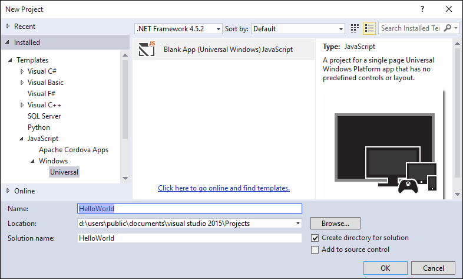
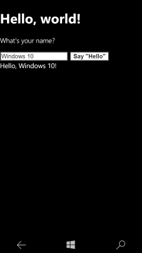
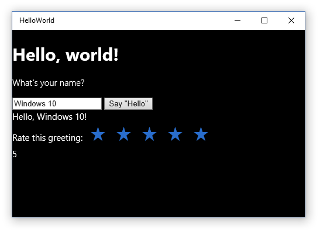

# Crear una aplicación "Hello, world" (JS)

Este tutorial te enseña a usar JavaScript y HTML para crear una aplicación sencilla "Hello, world" para la Plataforma universal de Windows (UWP) en Windows 10. Con un único proyecto en Microsoft Visual Studio, puedes compilar una aplicación que se ejecute en cualquier dispositivo de Windows 10. Aquí nos centraremos en crear una aplicación que se ejecute por igual en dispositivos móviles y de escritorio.

**Importante**   Este tutorial está diseñado para usarse con Microsoft Visual Studio 2015 y Windows 10. No funcionará correctamente con las versiones anteriores.

Aquí aprenderás a:

-   Crear un proyecto
-   Agregar contenido HTML a tu página de inicio
-   Controlar la entrada táctil, de pluma y mouse
-   Ejecutar el proyecto en el escritorio local y en el emulador de teléfono de Visual Studio.
-   Crear tus propios estilos personalizados
-   Usar un control de la Biblioteca de Windows para JavaScript

##Antes de comenzar...


-   Vamos a empezar directamente con los pasos para crear una aplicación universal simple. Por lo tanto, te recomendamos que, antes de empezar este tutorial, leas y entiendas la información general de los artículos [Novedades de Windows 10](https://dev.windows.com/whats-new-windows-10-dev-preview) y [Qué es una aplicación universal de Windows](whats-a-uwp.md).
-   Para completar este tutorial, debes tener Windows 10 y Visual Studio 2015. Consulta [Get set up](get-set-up.md) para obtener más información.
-   También se supone que estás usando el diseño de ventana predeterminado de Visual Studio. Si cambias el diseño predeterminado, puedes restablecerlo en el menú **Ventana** con el comando **Restablecer diseño de la ventana**.

##Paso 1: Crear un nuevo proyecto en Visual Studio


Vamos a crear una nueva aplicación llamada `HelloWorld`. Haz lo siguiente:

1.  Inicia Visual Studio 2015.

    Aparece la pantalla Inicio de Visual Studio 2015.

    (A partir de ahora, nos referiremos a Visual Studio 2015 simplemente como Visual Studio).

2.  En el menú **Archivo**, selecciona **Nuevo** > **Proyecto**.

    Se abre el cuadro de diálogo **Nuevo proyecto**. El panel izquierdo del cuadro de diálogo te deja elegir el tipo de plantillas que mostrar.

3.  En el panel izquierdo, expande **Instalado > Plantillas > JavaScript > Windows** y, a continuación, elige el grupo de plantillas **Universal**. El panel central del cuadro de diálogo muestra una lista de plantillas de proyecto para aplicaciones de la Plataforma universal de Windows (UWP).

    

    Para este tutorial, usamos la plantilla **Aplicación vacía**. Esta plantilla crea una aplicación para UWP mínima que se compila y ejecuta, pero que no contiene datos ni controles de interfaz de usuario. Después, a lo largo de este curso, agregarás controles y datos a la aplicación.

4.  En el panel central, selecciona la plantilla **Aplicación vacía (Windows Universal)**.

    La plantilla **Aplicación vacía** crea una aplicación para UWP mínima que se compila y ejecuta, pero que no contiene datos ni controles de interfaz de usuario. Después, a lo largo de este curso, agregarás controles a la aplicación.

5.  En el cuadro de texto **Nombre**, escribe "HelloWorld".
6.  Haz clic en **Aceptar** para crear el proyecto.

    Visual Studio crea tu proyecto y lo muestra en el **Explorador de soluciones**.

    

Aunque la **Aplicación vacía** sea una plantilla mínima, contiene muchos archivos:

-   Un archivo de manifiesto (package.appxmanifest) que describe tu aplicación (nombre, descripción, icono, página de inicio, página de presentación, etc.) y enumera los archivos que contiene la aplicación.
-   Un conjunto de imágenes de logotipo (images/Square150x150Logo.scale-200.png, images/Square44x44Logo.scale-200.png e images/Wide310x150Logo.scale-200.png) que se pueden mostrar en el menú Inicio.
-   Una imagen (images/StoreLogo.png) para representar tu aplicación en la Tienda Windows.
-   Una pantalla de presentación (images/SplashScreen.scale-200.png) que se muestra cuando se inicia la aplicación.
-   Una página de inicio (default.html) y el archivo JavaScript correspondiente (default.js) que se ejecutan cuando se inicia tu aplicación.

Para ver y editar los archivos, haz doble clic en el archivo que quieras en el **Explorador de soluciones**.

Estos archivos son esenciales para todas las aplicaciones para UWP que usan JavaScript. Cualquier proyecto que crees en Visual Studio contendrá estos archivos.

##Paso 2: Iniciar la aplicación


En este punto, has creado una aplicación muy sencilla. Este es un buen momento para compilar, implementar e iniciar tu aplicación para ver su aspecto. Puedes depurar la aplicación en el equipo local, en un simulador, un emulador o en un dispositivo remoto. Este es el menú del dispositivo de destino de Visual Studio.


### Iniciar la aplicación en un dispositivo de escritorio

De forma predeterminada, la aplicación se ejecuta en el equipo local. El menú del dispositivo de destino proporciona varias opciones para depurar la aplicación en dispositivos de la familia de dispositivos de escritorio.

-   **Simulador**
-   **Equipo local**
-   **Equipo remoto**

**Para empezar la depuración en el equipo local**

1.  En el menú del dispositivo de destino () de la barra de herramientas **Estándar**, asegúrate de que **Equipo local** esté seleccionado. (Es la selección predeterminada).
2.  Haz clic en el botón **Iniciar depuración** () en la barra de herramientas.

   O bien

   En el menú **Depurar**, haz clic en **Iniciar depuración**.

   O bien

   Presiona F5.

La aplicación se abre en una ventana y, en primer lugar, aparece una pantalla de presentación predeterminada. Esta pantalla se define mediante una imagen (SplashScreen.png) y un color de fondo (especificado en el archivo de manifiesto de la aplicación).

La pantalla de presentación desaparece y, a continuación, aparece tu aplicación. Contiene una pantalla negra con el texto "Aquí se debe incluir el contenido".


Presiona la tecla Windows para abrir el menú **Inicio** y mostrar todas las aplicaciones. Ten en cuenta que al implementar la aplicación localmente se agrega su icono al menú **Inicio**. Para ejecutar la aplicación de nuevo (no en modo de depuración), pulsa o haz clic en su icono en el menú **Inicio**.

No hace muchas cosas (todavía), pero te felicitamos, has compilado tu primera aplicación para UWP.

**Para detener la depuración**

-   Haz clic en el botón **Detener depuración** () en la barra de herramientas.

   O bien

   En el menú **Depurar**, haz clic en **Detener depuración**.

   O bien

   Cierra la ventana de la aplicación.

### Iniciar la aplicación en un emulador de dispositivos móviles

La aplicación se ejecuta en cualquier dispositivo de Windows 10, así que vamos a ver su aspecto en un Windows Phone.

Además de las opciones para realizar la depuración en un dispositivo de escritorio, Visual Studio ofrece opciones para implementar y depurar la aplicación en un dispositivo móvil físico conectado al equipo o en un emulador de dispositivos móviles. Puedes elegir entre varios emuladores para dispositivos con diferentes configuraciones de memoria y pantalla.

-   **Dispositivo**
-   **Emulador <SDK version> WVGA de 4 pulgadas y 512 MB**
-   **Emulador <SDK version> WVGA de 4 pulgadas y 1 GB**
-   Etc. (Varios emuladores en otras configuraciones)

Se recomienda probar la aplicación en un dispositivo con una pantalla pequeña y de memoria limitada, por lo tanto, usa la opción **Emulador 10.0.10240.0 WVGA de 4 pulgadas y 512 MB**.
**Para iniciar la depuración en un emulador de dispositivo móvil**

1.  En el menú del dispositivo de destino () en la barra de herramientas **Estándar**, elige **Emulador 10.0.10240.0 WVGA de 4 pulgadas y 512 MB**.
2.  Haz clic en el botón **Iniciar depuración** () en la barra de herramientas.

   O bien

   En el menú **Depurar**, haz clic en **Iniciar depuración**.

   
Visual Studio inicia el emulador seleccionado y, a continuación, implementa e inicia la aplicación. En el emulador de dispositivos móviles, la aplicación tiene este aspecto.


## Paso 3: Modificar tu página de inicio

Uno de los archivos que ha creado Visual Studio para ti es default.html, la página de inicio de tu aplicación. Cuando se ejecuta la aplicación, muestra el contenido de la página de inicio. Esta también contiene referencias a los archivos de código y hojas de estilo de la aplicación. Esta es la página de inicio que Visual Studio ha creado para ti:

```html
<!DOCTYPE html>
<html>
<head>
    <meta charset="utf-8" />
    <title>HelloWorld</title>

    <!-- WinJS references -->
    <link href="WinJS/css/ui-dark.css" rel="stylesheet" />
    <script src="WinJS/js/base.js"></script>
    <script src="WinJS/js/ui.js"></script>

    <!-- HelloWorld references -->
    <link href="/css/default.css" rel="stylesheet" />
    <script src="/js/default.js"></script>
</head>
<body class="win-type-body">
    <p>Content goes here</p>
</body>
</html>
```

Vamos a agregar contenido nuevo a tu archivo default.html. Igual que harías para agregar contenido a cualquier otro archivo HTML, agregas tu contenido dentro del elemento [**body**](https://msdn.microsoft.com/library/windows/apps/Hh453011). Puedes usar elementos de HTML5 para crear tu aplicación (con unas [pocas excepciones](https://msdn.microsoft.com/library/windows/apps/Hh465380)). Esto significa que puedes usar elementos de HTML5, como [**h1**](https://msdn.microsoft.com/library/windows/apps/Hh441078), [**p**](https://msdn.microsoft.com/library/windows/apps/Hh453431), [**button**](https://msdn.microsoft.com/library/windows/apps/Hh453017), [**div**](https://msdn.microsoft.com/library/windows/apps/Hh453133) e [**img**](https://msdn.microsoft.com/library/windows/apps/Hh466114).

**Para modificar la página de inicio**

1.  Reemplaza el contenido existente en el elemento [**body**](https://msdn.microsoft.com/library/windows/apps/Hh453011) por un encabezado de primer nivel que diga "Hello, world!", algún texto que solicite el nombre del usuario, un elemento [**input**](https://msdn.microsoft.com/library/windows/apps/Hh453271) para aceptar el nombre del usuario, un elemento [**button**](https://msdn.microsoft.com/library/windows/apps/Hh453017) y un elemento [**div**](https://msdn.microsoft.com/library/windows/apps/Hh453133). Asigna identificadores a los elementos **input**, **button** y **div**.

 ```html
    <body class="win-type-body">
        <h1>Hello, world!</h1>
        <p>What' s your name?</p>
        <input id="nameInput" type="text" />
        <button id="helloButton">Say "Hello"</button>
        <div id="greetingOutput"></div>
    </body>
 ```

2.  Ejecuta la aplicación en el equipo local. Tiene esta apariencia.


   Puedes escribir en el elemento [**input**](https://msdn.microsoft.com/library/windows/apps/Hh453271), pero, ahora mismo, si haces clic en [**button**](https://msdn.microsoft.com/library/windows/apps/Hh453017), no se realiza ninguna acción. Algunos objetos, como **button**, pueden enviar mensajes cuando se producen ciertos eventos. Estos mensajes de eventos te dan la oportunidad de realizar alguna acción como respuesta al evento. El código para responder al evento lo pones en un método de controlador de eventos.

   En los siguientes pasos, crearemos un controlador de eventos para el elemento [**button**](https://msdn.microsoft.com/library/windows/apps/Hh453017) que muestre un saludo personalizado. Agregamos el código de nuestro controlador de eventos a nuestro archivo default.js.

##Paso 4: Crear un controlador de eventos

Cuando creamos nuestro proyecto, Visual Studio creó un archivo /js/default.js. Este archivo contiene código para controlar el ciclo de vida de tu aplicación. También es donde escribes código adicional que proporciona interactividad para tu archivo default.html.

Abre el archivo default.js.

Antes de empezar a agregar nuestro propio código, echemos un vistazo a las primeras y últimas líneas de código del archivo:

```javascript
(function () {
    "use strict";

     // Omitted code 

 })(); 
```

Te estarás preguntando qué sucede con ellas. Estas líneas de código encapsulan el resto del código de default.js en una función anónima que se ejecuta automáticamente. Una función anónima que se ejecuta automáticamente hace que sea más sencillo evitar conflictos de nomenclatura o situaciones en las que modifiques accidentalmente un valor que no tenías intención de modificar. Además, mantiene los identificadores innecesarios lejos del espacio de nombres global, lo que contribuye a mejorar el rendimiento. Parece una cosa un poco rara, pero es un procedimiento recomendado de programación.

La siguiente línea de código activa el [modo strict](https://msdn.microsoft.com/en-us/library/windows/apps/br230269.aspx) para tu código JavaScript. El modo strict proporciona una comprobación adicional de errores para el código. Por ejemplo, impide que uses variables declaradas implícitamente o que asignes un valor a una propiedad de solo lectura.

Echa un vistazo al resto del código en default.js. Controla los eventos [**activated**](https://msdn.microsoft.com/library/windows/apps/BR212679) y [**checkpoint**](https://msdn.microsoft.com/library/windows/apps/BR229839) de tu aplicación. Más adelante, veremos con más detalle esos eventos. Por ahora, solo debes saber que el evento **activated** se desencadena cuando se inicia tu aplicación.

```javascript
   (function () {
    "use strict";

    var app = WinJS.Application;
    var activation = Windows.ApplicationModel.Activation;

    app.onactivated = function (args) {
        if (args.detail.kind === activation.ActivationKind.launch) {
            if (args.detail.previousExecutionState !== activation.ApplicationExecutionState.terminated) {
                // TODO: This application has been newly launched. Initialize your application here.
            } else {
                // TODO: This application was suspended and then terminated.
                // To create a smooth user experience, restore application state here so that it looks like the app never stopped running.
            }
            args.setPromise(WinJS.UI.processAll());
        }
    };

    app.oncheckpoint = function (args) {
        // TODO: This application is about to be suspended. Save any state that needs to persist across suspensions here.
        // You might use the WinJS.Application.sessionState object, which is automatically saved and restored across suspension.
        // If you need to complete an asynchronous operation before your application is suspended, call args.setPromise().
    };

    app.start();
})();
```

Vamos a definir un controlador de eventos para tu [**button**](https://msdn.microsoft.com/library/windows/apps/Hh453017). Nuestro nuevo controlador de eventos obtiene el nombre de usuario del control `nameInput` [**input**](https://msdn.microsoft.com/library/windows/apps/Hh453271) y lo usa para mostrar un saludo al elemento `greetingOutput` [**div**](https://msdn.microsoft.com/library/windows/apps/Hh453133) que creaste en la sección anterior.

### Uso de eventos que funcionan para entradas táctiles, de mouse y de lápiz

En una aplicación para UWP, no debes preocuparte por las diferencias entre táctil, mouse y otras formas de entrada de puntero. Puedes usar los eventos que conoces, como [**click**](https://msdn.microsoft.com/library/windows/apps/Hh441312) y funcionarán para todos los tipos de entrada.

**Sugerencia**   Tu aplicación también puede usar los nuevos eventos *MSPointer\** y *MSGesture\**, que funcionan para la entrada táctil, de mouse y de lápiz, y que pueden proporcionar información adicional sobre el dispositivo que activó el evento. Para más información, consulta [Responder a la interacción del usuario](https://msdn.microsoft.com/library/windows/apps/Hh700412) y [Gestos, manipulaciones e interacciones](https://msdn.microsoft.com/library/windows/apps/Hh761498).

Continuemos y vamos a crear el controlador de eventos.

**Para crear el controlador de eventos**

1.  En el archivo default.js, después del controlador de eventos [**app.oncheckpoint**](https://msdn.microsoft.com/library/windows/apps/BR229839) y antes de llamar a [**app.start**](https://msdn.microsoft.com/library/windows/apps/BR229705), crea una función de controlador de eventos [**click**](https://msdn.microsoft.com/library/windows/apps/Hh441312) denominada `buttonClickHandler` que tome un único parámetro llamado
```javascript
    function buttonClickHandler(eventInfo) {
     
        }
```

2.  Dentro de nuestro controlador de eventos, recupera el nombre de usuario del control `nameInput` [**input**](https://msdn.microsoft.com/library/windows/apps/Hh453271) y úsalo para crear un saludo. Usa `greetingOutput` [**div**](https://msdn.microsoft.com/library/windows/apps/Hh453133) para mostrar el resultado.
```javascript
    function buttonClickHandler(eventInfo) {
            var userName = document.getElementById("nameInput").value;
            var greetingString = "Hello, " + userName + "!";
            document.getElementById("greetingOutput").innerText = greetingString; 
        }
 ```

Has agregado tu controlador de eventos a default.js. Ahora debes registrarlo.

## Paso 5: Registrar el controlador de eventos cuando se inicia la aplicación


Lo único que necesitas hacer ahora es registrar el controlador de eventos con el botón. La forma recomendada de registrar un controlador de eventos es llamar a [**addEventListener**](https://msdn.microsoft.com/library/windows/apps/Hh441145) desde nuestro código. Un buen lugar para registrar el controlador de eventos es cuando se activa nuestra aplicación. Afortunadamente, Visual Studio generó algo de código en nuestro archivo default.js que controla la activación de nuestra aplicación: el controlador de eventos [**app.onactivated**](https://msdn.microsoft.com/library/windows/apps/BR212679). Echemos un vistazo a este código.

```javascript
    var app = WinJS.Application;
    var activation = Windows.ApplicationModel.Activation;

    app.onactivated = function (args) {
        if (args.detail.kind === activation.ActivationKind.launch) {
            if (args.detail.previousExecutionState !== activation.ApplicationExecutionState.terminated) {
                // TODO: This application has been newly launched. Initialize your application here.
            } else {
                // TODO: This application was suspended and then terminated.
                // To create a smooth user experience, restore application state here so that it looks like the app never stopped running.
            }
            args.setPromise(WinJS.UI.processAll());
        }
    };
```

Dentro del controlador [**onactivated**](https://msdn.microsoft.com/library/windows/apps/BR212679), el código comprueba qué tipo de activación se ha producido. Existen diferentes tipos de activación. Por ejemplo, tu aplicación se activa cuando el usuario inicia tu aplicación y cuando el usuario quiere abrir un archivo que está asociado con tu aplicación. (Para más información, consulta [Ciclo de vida de la aplicación](https://msdn.microsoft.com/library/windows/apps/Mt243287)).

La que nos interesa a nosotros es la de activación [**launch**](https://msdn.microsoft.com/library/windows/apps/BR224693). Una aplicación se *inicia* cuando un usuario la activa cuando no está en ejecución.

```javascript
    app.onactivated = function (args) {
        if (args.detail.kind === activation.ActivationKind.launch) {
```

Si la activación es una activación de inicio, el código comprueba cómo se cerró la aplicación la última vez que se ejecutó.

```javascript
            if (args.detail.previousExecutionState !== activation.ApplicationExecutionState.terminated) {
                // TODO: This application has been newly launched. Initialize your application here.
            } else {
                // TODO: This application was suspended and then terminated.
                // To create a smooth user experience, restore application state here so that it looks like the app never stopped running.
            }
```

A continuación, llama a [**WinJS.UI.processAll**](https://msdn.microsoft.com/library/windows/apps/Hh440975).

```javascript
            args.setPromise(WinJS.UI.processAll());
        }
    };
```    

Llama a [**WinJS.UI.processAll**](https://msdn.microsoft.com/library/windows/apps/Hh440975), con independencia de si se cerró la aplicación en el pasado o si es la primera vez que se inicia. **WinJS.UI.processAll** está incluido en una llamada al método [**setPromise**](https://msdn.microsoft.com/library/windows/apps/JJ215609), que se asegura de que la pantalla de presentación no desaparezca hasta que la página de la aplicación no esté lista.

**Sugerencia**   La función [**WinJS.UI.processAll**](https://msdn.microsoft.com/library/windows/apps/Hh440975) examina si en el archivo default.html hay controles WinJS y los inicializa. Hasta ahora, no hemos agregado ninguno de estos controles, pero te recomendamos dejar este código en caso de que quieras agregarlos más adelante.

Un buen lugar donde registrar los controladores de eventos para controles que no sean de WinJS es justo después de la llamada a [**WinJS.UI.processAll**](https://msdn.microsoft.com/library/windows/apps/Hh440975).

**Para registrar tu controlador de eventos**

-   En el controlador de eventos [**onactivated**](https://msdn.microsoft.com/library/windows/apps/BR212679) de default.js, recupera `helloButton` y usa [**addEventListener**](https://msdn.microsoft.com/library/windows/apps/Hh441145) para registrar nuestro controlador de eventos para el evento [**click**](https://msdn.microsoft.com/library/windows/apps/Hh441312). Agrega este código después de llamar a [**WinJS.UI.processAll**](https://msdn.microsoft.com/library/windows/apps/Hh440975).

```javascript
   app.onactivated = function (args) {
            if (args.detail.kind === activation.ActivationKind.launch) {
                if (args.detail.previousExecutionState !== activation.ApplicationExecutionState.terminated) {
                    // TODO: This application has been newly launched. Initialize your application here.
                } else {
                    // TODO: This application was suspended and then terminated.
                    // To create a smooth user experience, restore application state here so that it looks like the app never stopped running.
                }
                args.setPromise(WinJS.UI.processAll());

             // Retrieve the button and register our event handler. 
                var helloButton = document.getElementById("helloButton");
                helloButton.addEventListener("click", buttonClickHandler, false);
            }
        };
```    

Este es el código completo para nuestro archivo default.js personalizado:

```javascript
   (function () {
    "use strict";

    var app = WinJS.Application;
    var activation = Windows.ApplicationModel.Activation;

    app.onactivated = function (args) {
        if (args.detail.kind === activation.ActivationKind.launch) {
            if (args.detail.previousExecutionState !== activation.ApplicationExecutionState.terminated) {
                // TODO: This application has been newly launched. Initialize your application here.
            } else {
                // TODO: This application was suspended and then terminated.
                // To create a smooth user experience, restore application state here so that it looks like the app never stopped running.
            }
            args.setPromise(WinJS.UI.processAll());

            // Retrieve the button and register our event handler. 
            var helloButton = document.getElementById("helloButton");
            helloButton.addEventListener("click", buttonClickHandler, false);
        }
    };

    app.oncheckpoint = function (args) {
        // TODO: This application is about to be suspended. Save any state that needs to persist across suspensions here.
        // You might use the WinJS.Application.sessionState object, which is automatically saved and restored across suspension.
        // If you need to complete an asynchronous operation before your application is suspended, call args.setPromise().
    };

    function buttonClickHandler(eventInfo) {
        var userName = document.getElementById("nameInput").value;
        var greetingString = "Hello, " + userName + "!";
        document.getElementById("greetingOutput").innerText = greetingString;
    }

    app.start();
})();
```

Ejecuta la aplicación. Cuando entras tu nombre en el cuadro de texto y haces clic en el botón, la aplicación muestra un saludo personalizado. Este es su aspecto en el equipo local y en el emulador.




**Nota**   Si te preguntas por qué usamos [**addEventListener**](https://msdn.microsoft.com/library/windows/apps/Hh441145) para registrar nuestro evento en código en lugar de configurar el evento [**onclick**](https://msdn.microsoft.com/library/windows/apps/Hh441312) en nuestro HTML, consulta [Codificar aplicaciones básicas](https://msdn.microsoft.com/library/windows/apps/Hh780660), donde encontrarás una explicación más detallada.

## Paso 6: Agregar un control de la Biblioteca de Windows para JavaScript


Además de los controles HTML estándar, tu aplicación puede usar cualquiera de los controles de la Biblioteca de Windows para JavaScript, como los controles [**WinJS.UI.DatePicker**](https://msdn.microsoft.com/library/windows/apps/BR211681), [**WinJS.UI.FlipView**](https://msdn.microsoft.com/library/windows/apps/BR211711), [**WinjS.UI.ListView**](https://msdn.microsoft.com/library/windows/apps/BR211837) y [**WinJS.UI.Rating**](https://msdn.microsoft.com/library/windows/apps/BR211895).

A diferencia de los controles HTML, los controles de WinJS no tienen elementos de marcado dedicados; así, por ejemplo, no puedes agregar un elemento `<rating />` para crear un control [**Rating**](https://msdn.microsoft.com/library/windows/apps/BR211895). Para agregar un control de WinJS, crea un elemento [**div**](https://msdn.microsoft.com/library/windows/apps/Hh453133) y usa el atributo [**data-win-control**](https://msdn.microsoft.com/library/windows/apps/Hh440969) para especificar el tipo de control que quieras. Para agregar un control **Rating**, establece el atributo en "WinJS.UI.Rating".

Vamos a agregar un control [**Rating**](https://msdn.microsoft.com/library/windows/apps/BR211895) a tu aplicación.

1.  En el archivo default.html, agrega un control [**label**](https://msdn.microsoft.com/library/windows/apps/Hh453321) y [**Rating**](https://msdn.microsoft.com/library/windows/apps/BR211895) después de `greetingOutput` [**div**](https://msdn.microsoft.com/library/windows/apps/Hh453133).

    ```html
    <body class="win-type-body">
        <h1>Hello, world!</h1>
        <p>What' s your name?</p>
        <input id="nameInput" type="text" />
        <button id="helloButton">Say "Hello"</button>
        <div id="greetingOutput"></div>
        <label for="ratingControlDiv">
            Rate this greeting:
        </label>
        <div id="ratingControlDiv" data-win-control="WinJS.UI.Rating">
        </div>
    </body> 
    ```

2.  Ejecuta la aplicación en el equipo local. Observa el nuevo control [**Rating**](https://msdn.microsoft.com/library/windows/apps/BR211895).

   

> Para que se cargue [**Rating**](https://msdn.microsoft.com/library/windows/apps/BR211895), la página debe llamar a [**WinJS.UI.processAll**](https://msdn.microsoft.com/library/windows/apps/Hh440975). Puesto que la aplicación está usando una de las plantillas de Visual Studio, tu archivo default.js ya incluye una llamada a **WinJS.UI.processAll**, como se describió antes, de modo que no es necesario agregar más código.

Ahora mismo, al hacer clic en el control [**Rating**](https://msdn.microsoft.com/library/windows/apps/BR211895), se cambia la clasificación, pero no ocurre nada más. Vamos a usar un controlador de eventos para que cuando el usuario cambie la clasificación ocurra algo.

## Paso 7: Registrar un controlador de eventos para un control de la biblioteca de Windows para JavaScript


Registrar un controlador de eventos para un control de WinJS es algo distinto de registrar un controlador de eventos para un control HTML estándar. Antes hemos mencionado que el controlador de eventos [**onactivated**](https://msdn.microsoft.com/library/windows/apps/BR212679) llama al método [**WinJS.UI.processAll**](https://msdn.microsoft.com/library/windows/apps/Hh440975) para inicializar WinJS en el marcado. **WinJS.UI.processAll** está incluido en una llamada al método [**setPromise**](https://msdn.microsoft.com/library/windows/apps/JJ215609).

```javascript
            args.setPromise(WinJS.UI.processAll());           
```

Si [**Rating**](https://msdn.microsoft.com/library/windows/apps/BR211895) fuese un control HTML estándar, podrías agregar el controlador de eventos después de esta llamada a [**WinJS.UI.processAll**](https://msdn.microsoft.com/library/windows/apps/Hh440975). Pero resulta algo más complicado cuando se trata de un control de WinJS, como nuestro **Rating**. Dado que **WinJS.UI.processAll** crea el control **Rating**, no podemos agregar el controlador de eventos a **Rating** hasta después de que **WinJS.UI.processAll** haya finalizado su procesamiento.

Si [**WinJS.UI.processAll**](https://msdn.microsoft.com/library/windows/apps/Hh440975) fuese un método típico, podríamos registrar el controlador de eventos [**Rating**](https://msdn.microsoft.com/library/windows/apps/BR211895) justo después de llamarlo. Pero el método **WinJS.UI.processAll** es asincrónico, por lo que cualquier código que le siga se puede ejecutar antes de que **WinJS.UI.processAll** se complete. Entonces, ¿qué debemos hacer? Usamos un objeto [**Promise**](https://msdn.microsoft.com/library/windows/apps/BR211867) para recibir una notificación cuando **WinJS.UI.processAll** se complete.

Como todos los métodos asincrónicos de WinJS, [**WinJS.UI.processAll**](https://msdn.microsoft.com/library/windows/apps/Hh440975) devuelve un objeto [**Promise**](https://msdn.microsoft.com/library/windows/apps/BR211867). Un objeto **Promise** es la "promesa" de que algo ocurrirá en el futuro; cuando tal cosa ocurra, se habrá completado el objeto **Promise**.

[
              Los objetos **Promise**
            ](https://msdn.microsoft.com/library/windows/apps/BR211867) tienen un método [**then**](https://msdn.microsoft.com/library/windows/apps/BR229728) que toma una función "completed" como parámetro. El objeto **Promise** llama a esta función cuando se completa.

Si agregas el código a una función "completed" y la pasas al método [**then**](https://msdn.microsoft.com/library/windows/apps/BR229728) del objeto [**Promise**](https://msdn.microsoft.com/library/windows/apps/BR211867), puedes estar seguro de que el código se ejecutará después de que se complete [**WinJS.UI.processAll**](https://msdn.microsoft.com/library/windows/apps/Hh440975).

1.  Vamos a hacer que se muestre el valor de clasificación cuando el usuario seleccione una clasificación. En el archivo default.html, crea un elemento [**div**](https://msdn.microsoft.com/library/windows/apps/Hh453133) para mostrar el valor de clasificación y asígnale **id** "ratingOutput".
```html
        <body class="win-type-body">
        <h1>Hello, world!</h1>
        <p>What' s your name?</p>
        <input id="nameInput" type="text" />
        <button id="helloButton">Say "Hello"</button>
        <div id="greetingOutput"></div>
        <label for="ratingControlDiv">
            Rate this greeting:
        </label>
        <div id="ratingControlDiv" data-win-control="WinJS.UI.Rating">
        </div>
        <div id="ratingOutput"></div>
    </body>
```

2.  En nuestro archivo default.js, crea un controlador de eventos para el evento [**change**](https://msdn.microsoft.com/library/windows/apps/BR211891) del control [**Rating**](https://msdn.microsoft.com/library/windows/apps/BR211895), denominado `ratingChanged`. El parámetro [**eventInfo**](https://msdn.microsoft.com/library/windows/apps/Hh465776) contiene una propiedad **detail.tentativeRating** que proporciona una nueva clasificación de usuario. Recupera este valor y muéstralo en la salida [**div**](https://msdn.microsoft.com/library/windows/apps/Hh453133).

```javascript
        function ratingChanged(eventInfo) {

            var ratingOutput = document.getElementById("ratingOutput");
            ratingOutput.innerText = eventInfo.detail.tentativeRating; 
        }
    ```

3.  Update the code in the [**onactivated**](https://msdn.microsoft.com/library/windows/apps/BR212679) event handler that calls [**WinJS.UI.processAll**](https://msdn.microsoft.com/library/windows/apps/Hh440975) by adding a call to the [**then**](https://msdn.microsoft.com/library/windows/apps/BR229728) method and passing it a `completed` function. In the `completed` function, retrieve the `ratingControlDiv` element that hosts the [**Rating**](https://msdn.microsoft.com/library/windows/apps/BR211895) control. Then use the [**winControl**](https://msdn.microsoft.com/library/windows/apps/Hh770814) property to retrieve the actual **Rating** control. (This example defines the `completed` function inline.)

```javascript
           args.setPromise(WinJS.UI.processAll().then(function completed() {

                    // Retrieve the div that hosts the Rating control.
                    var ratingControlDiv = document.getElementById("ratingControlDiv");

                    // Retrieve the actual Rating control.
                    var ratingControl = ratingControlDiv.winControl;

                    // Register the event handler. 
                    ratingControl.addEventListener("change", ratingChanged, false);

                }));
    ```

4.  While it's fine to register event handlers for HTML controls after the call to [**WinJS.UI.processAll**](https://msdn.microsoft.com/library/windows/apps/Hh440975), it's also OK to register them inside your `completed` function. For simplicity, let's go ahead and move all your event handler registrations inside the [**then**](https://msdn.microsoft.com/library/windows/apps/BR229728) event handler.

Here's the updated [**onactivated**](https://msdn.microsoft.com/library/windows/apps/BR212679) event handler:

```javascript
       app.onactivated = function (args) {
            if (args.detail.kind === activation.ActivationKind.launch) {
                if (args.detail.previousExecutionState !== activation.ApplicationExecutionState.terminated) {
                    // TODO: This application has been newly launched. Initialize your application here.
                } else {
                    // TODO: This application was suspended and then terminated.
                    // To create a smooth user experience, restore application state here so that it looks like the app never stopped running.
                }
                args.setPromise(WinJS.UI.processAll().then(function completed() {

                    // Retrieve the div that hosts the Rating control.
                    var ratingControlDiv = document.getElementById("ratingControlDiv");

                    // Retrieve the actual Rating control.
                    var ratingControl = ratingControlDiv.winControl;

                    // Register the event handler. 
                    ratingControl.addEventListener("change", ratingChanged, false);

                    // Retrieve the button and register our event handler. 
                    var helloButton = document.getElementById("helloButton");
                    helloButton.addEventListener("click", buttonClickHandler, false);

                }));

            }
        };
```        

5.  Ejecuta la aplicación. Cuando selecciones un valor de clasificación, aparecerá el valor numérico debajo del control [**Rating**](https://msdn.microsoft.com/library/windows/apps/BR211895).




## Resumen

Enhorabuena, has creado tu primera aplicación para Windows 10 y la UWP con JavaScript y HTML.


<!--HONumber=May16_HO2-->


