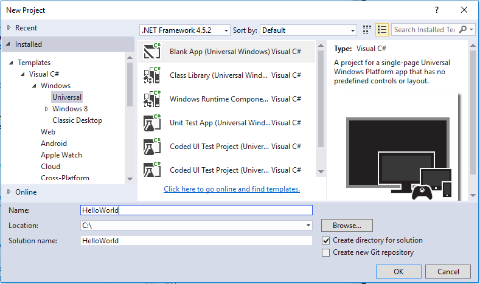
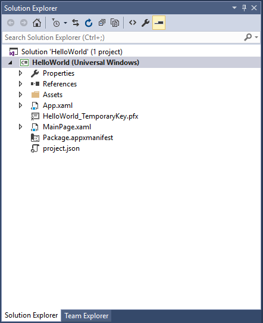

# Creación de una aplicación "Hello, world" (XAML)

Este tutorial te enseña a usar XAML y C# para crear una aplicación sencilla "Hello, world" para la Plataforma universal de Windows (UWP) en Windows 10. Con un único proyecto en Microsoft Visual Studio, puedes compilar una aplicación que se ejecute en cualquier dispositivo de Windows 10.

Aquí aprenderás a:

-   Creación de un nuevo proyecto de **Visual Studio 2015** diseñado para **Windows 10** y **UWP**.
-   Escribe XAML para cambiar la interfaz de usuario en la página de inicio.
-   Ejecuta el proyecto en el escritorio local y en el emulador de teléfono de Visual Studio.
-   Usa un SpeechSynthesizer para que la aplicación hable al presionar un botón.

## Antes de comenzar...

-   [¿Qué es una aplicación universal de Windows](whats-a-uwp.md)?
-   [Novedades de Windows10](https://dev.windows.com/whats-new-windows-10-dev-preview)
-   Para completar este tutorial, debes tener Windows 10 y Visual Studio 2015. [Prepárate](get-set-up.md).
-   También se supone que estás usando el diseño de ventana predeterminado de Visual Studio. Si cambias el diseño predeterminado, puedes restablecerlo en el menú **Ventana** con el comando **Restablecer diseño de la ventana**.


## Si en su lugar prefieres ver un vídeo...

<iframe src="https://channel9.msdn.com/Blogs/One-Dev-Minute/Writing-Your-First-Windows-10-App/player" width="640" height="360" allowFullScreen frameBorder="0"></iframe>

Si prefieres un enfoque visual sobre una guía paso a paso, en este vídeo se describe el mismo material pero con una banda sonora agradable.

## Paso 1: Creación de un nuevo proyecto en Visual Studio.

1.  Inicia Visual Studio 2015.

2.  En el menú **Archivo**, selecciona **Nuevo > Proyecto...** para abrir el cuadro de diálogo *Nuevo proyecto*.

3.  En la lista de plantillas del lado izquierdo, abre **Instalado > Plantillas > Visual C# > Windows** y, a continuación, elige **Universal** para ver la lista de plantillas de proyecto para UWP.

    (Si no ves ninguna plantilla Universal, es posible que no tengas Visual Studio 2015 o que falten los componentes para crear aplicaciones para UWP. Consulta [Prepárate](get-set-up.md) para arreglar tus herramientas.)

4.  Elige la plantilla **Aplicación vacía (Windows Universal)** y escribe "HelloWorld" como **Nombre**. Selecciona **Aceptar**.

    

5.  Se visualiza el cuadro de diálogo de versión mínima/de destino. La configuración predeterminada es correcta, por lo tanto, selecciona **Aceptar** para crear el proyecto.

    

6.  Cuando se abra el nuevo proyecto, sus archivos se muestran en el panel **Explorador de soluciones** de la derecha. Es posible que debas elegir la pestaña **Explorador de soluciones** en lugar de la pestaña **Propiedades** para ver los archivos.

    

Aunque **Aplicación vacía (Universal Window)** es una plantilla mínima, contiene muchos archivos. Estos archivos son esenciales para todas las aplicaciones para UWP que usan C#. Todos los proyectos que crees en Visual Studio contendrán estos archivos.


### ¿Qué hay en los archivos?

Para ver y editar un archivo de tu proyecto, haz doble clic en el archivo en el **Explorador de soluciones**. Expande un archivo XAML como una carpeta para ver su archivo de código asociado. Los archivos XAML se abren en una vista en dos paneles que muestra la superficie de diseño y el editor de XAML.
> [!NOTE]
> ¿Qué es XAML? El lenguaje de marcado de aplicaciones extensible (XAML) es el lenguaje que se usa para definir la interfaz de usuario de la aplicación. Puede especificarse manualmente, o crearse con las herramientas de diseño de Visual Studio. Un archivo .xaml tiene un archivo de código subyacente .xaml.cs que contiene la lógica. Juntos, el XAML y el código subyacente forman una clase completa. Para obtener más información, consulta [Introducción a XAML](https://msdn.microsoft.com/library/windows/apps/Mt185595).

*App.xaml y App.xaml.cs*

-   App.xaml es donde declaras recursos que se usan en la aplicación.
-   App.xaml.cs es el archivo de código subyacente de App.xaml. Como todas las páginas de código subyacente, contiene un constructor que llama al método `InitializeComponent`. Tú no escribes el método `InitializeComponent`. Lo genera Visual Studio, y su principal propósito es inicializar los elementos declarados en el archivo XAML.
-   App.xaml.cs es el punto de entrada para la aplicación.
-   App.xaml.cs también contiene métodos para controlar la activación y la suspensión de la aplicación.

*MainPage.xaml*

-   MainPage.xaml es donde defines la interfaz de usuario para la aplicación. Puedes agregar elementos directamente con el marcado XAML o puedes usar las herramientas de diseño suministradas por Visual Studio.
-   MainPage.xaml.cs es la página de código subyacente de MainPage.xaml. Es el sitio donde agregas los controladores de eventos y la lógica de la aplicación.
-   Estos dos archivos juntos definen una nueva clase denominada `MainPage`, que se hereda de [**Página**](https://msdn.microsoft.com/library/windows/apps/BR227503), en el espacio de nombres `HelloWorld`.

*Package.appxmanifest*
-   Un archivo de manifiesto que describe tu aplicación: su nombre, descripción, icono, página de inicio, etc.
-   Incluye una lista de los archivos que contiene la aplicación.

*Un conjunto de imágenes de logotipo*
-   Assets/Square150x150Logo.scale-200.png representa tu aplicación en el menú Inicio.
-   Assets/StoreLogo.png representa tu aplicación en la Tienda Windows.
-   Assets/SplashScreen.scale-200.png es la pantalla de presentación que se muestra cuando se inicia la aplicación.

## Paso 2: Adición de un botón

### Uso de la vista de diseñador

Vamos a agregar un botón a nuestra página. En este tutorial, trabajas con solo algunos de los archivos enumerados anteriormente: App.xaml, MainPage.xaml y MainPage.xaml.cs.

1.  Haz doble clic en **MainPage.xaml** para abrirlo en la vista de Diseño.

    Verás que hay una vista gráfica en la parte superior de la pantalla y la vista del código XAML debajo. Puedes realizar cambios en cualquiera de los dos, pero por ahora vamos a utilizar la vista gráfica.

    

2.  Haz clic en la pestaña vertical **Herramientas** a la izquierda para abrir la lista de controles de interfaz de usuario. (Puedes hacer clic en el icono de anclaje en la barra de título para mantenerlo visible.)

    

3.  Expande **Controles de XAML comunes**y arrastra el **Botón** hacia el centro del lienzo de diseño.

    

    Si buscas en la ventana de código XAML, verás que el botón se ha agregado allí también:

    ```XAML
<Button x:name="button" Content="Button" HorizontalAlignment="Left" Margin = "152,293,0,0" VerticalAlignment="Top"/>
```

4.  Cambia el texto del botón.

    Haz clic en la vista del código XAML y cambia el contenido del "Botón" a "Hello, world!".

    ```XAML
<Button x:name="button" Content="Hello, world!" HorizontalAlignment="Left" Margin = "152,293,0,0" VerticalAlignment="Top"/>
```

    Observa cómo se muestra el botón en las actualizaciones del lienzo de diseño para mostrar el texto nuevo.

    

## Paso 3: Inicio de la aplicación


En este punto, has creado una aplicación muy sencilla. Este es un buen momento para compilar, implementar e iniciar tu aplicación para ver su aspecto. Puedes depurar la aplicación en el equipo local, en un simulador, un emulador o en un dispositivo remoto. Este es el menú del dispositivo de destino de Visual Studio.


### Iniciar la aplicación en un dispositivo de escritorio

De forma predeterminada, la aplicación se ejecuta en el equipo local. El menú del dispositivo de destino proporciona varias opciones para depurar la aplicación en dispositivos de la familia de dispositivos de escritorio.

-   **Simulador**
-   **Equipo local**
-   **Equipo remoto**

**Para empezar la depuración en el equipo local**

1.  En el menú del dispositivo de destino () de la barra de herramientas **Estándar**, asegúrate de que **Equipo local** esté seleccionado. (Es la selección predeterminada).
2.  Haz clic en el botón **Iniciar depuración** () en la barra de herramientas.

   O bien

   En el menú **Depurar**, haz clic en **Iniciar depuración**.

   O bien

   Presiona F5.

La aplicación se abre en una ventana y, en primer lugar, aparece una pantalla de presentación predeterminada. Esta pantalla se define mediante una imagen (SplashScreen.png) y un color de fondo (especificado en el archivo de manifiesto de la aplicación).

La pantalla de presentación desaparece y, a continuación, aparece tu aplicación. Tiene esta apariencia.


Presiona la tecla Windows para abrir el menú **Inicio** y mostrar todas las aplicaciones. Ten en cuenta que al implementar la aplicación localmente se agrega su icono al menú **Inicio**. Para ejecutar la aplicación de nuevo más adelante (no en modo de depuración), pulsa o haz clic en su icono en el menú **Inicio**.

No hace muchas cosas (todavía), pero te felicitamos, has compilado tu primera aplicación para UWP.

**Para detener la depuración**

   Haz clic en el botón **Detener depuración** () en la barra de herramientas.

   O bien

   En el menú **Depurar**, haz clic en **Detener depuración**.

   O bien

   Cierra la ventana de la aplicación.

### Iniciar la aplicación en un emulador de dispositivos móviles

La aplicación se ejecuta en cualquier dispositivo de Windows 10, así que vamos a ver su aspecto en un Windows Phone.

Además de las opciones para realizar la depuración en un dispositivo de escritorio, Visual Studio ofrece opciones para implementar y depurar la aplicación en un dispositivo móvil físico conectado al equipo o en un emulador de dispositivos móviles. Puedes elegir entre varios emuladores para dispositivos con diferentes configuraciones de memoria y pantalla.

-   **Dispositivo**
-   **Emulador <SDK version> WVGA de 4 pulgadas y 512 MB**
-   **Emulador <SDK version> WVGA de 4pulgadas y 1GB**
-   Etc. (Varios emuladores en otras configuraciones)

(¿No ves los emuladores? Consulta [Prepárate](get-set-up.md) para asegurarte de que tienes instaladas las herramientas de desarrollo de la aplicación universal de Windows.)

**Inicio de la depuración en un emulador de dispositivo móvil**

1.  Es una buena práctica para probar la aplicación en un dispositivo con una pantalla pequeña y memoria limitada, por lo que en el menú del dispositivo de destino () en la barra de herramientas **Estándar**, elige **Emulador 10.0.14393.0 WVGA de 4 pulgadas y 512MB**.

2.  Haz clic en el botón **Iniciar depuración** () en la barra de herramientas.

   O bien

   En el menú **Depurar**, haz clic en **Iniciar depuración**.

   O bien

   Presiona F5.

Visual Studio inicia el emulador seleccionado y, a continuación, implementa e inicia la aplicación. Esto puede tardar un poco de tiempo la primera vez que se inicia. En el emulador de dispositivos móviles, la aplicación tiene este aspecto.


Si tienes un Windows Phone que funciona con Windows 10, también puedes conectarlo al equipo e implementar y ejecutar la aplicación en él directamente (aunque primero tendrás que [habilitar el modo de desarrollador](enable-your-device-for-development.md)).


## Paso 3: Controladores de eventos

Un "controlador de eventos" suena complicado, pero es simplemente otra forma de designar el código que se llama cuando se produce un evento (por ejemplo, cuando el usuario hace clic en tu botón).

1.  Para el funcionamiento de la aplicación, si no lo has hecho ya.

2.  Haz doble clic en el control de botón en el lienzo de diseño para hacer que Visual Studio cree un controlador de eventos para el botón.

  Por supuesto, también puedes crear todo el código manualmente. O puedes hacer clic en el botón para seleccionarlo y buscar en el panel **Propiedades** en la esquina inferior derecha. Si cambias a **Eventos** (el pequeño relámpago) puedes agregar el nombre del controlador de eventos.

3.  Edita el código del controlador de eventos en *MainPage.xaml.cs*, la página de código subyacente. Aquí es cuando se pone interesante. El controlador de eventos predeterminado tiene este aspecto:

```C#
private void button_Click(object sender, RouteEventArgs e)
{

}
```

  Vamos a cambiarlo para que tenga esta apariencia:

```C#
private async void button_Click(object sender, RoutedEventArgs e)
        {
            MediaElement mediaElement = new MediaElement();
            var synth = new Windows.Media.SpeechSynthesis.SpeechSynthesizer();
            Windows.Media.SpeechSynthesis.SpeechSynthesisStream stream = await synth.SynthesizeTextToStreamAsync("Hello, World!");
            mediaElement.SetSource(stream, stream.ContentType);
            mediaElement.Play();
        }
```

Asegúrate de incluir también la palabra clave **async**, o se producirá un error cuando se intente ejecutar la aplicación.

### ¿Qué acabamos de hacer?

Este código usa algunas API de Windows para crear un objeto de síntesis de voz y luego le proporciona algo de texto para que lo lea. (Para obtener más información sobre el uso de SpeechSynthesis, consulta los documentos sobre el [Espacio de nombres SpeechSynthesis](https://msdn.microsoft.com/library/windows/apps/windows.media.speechsynthesis.aspx).)

Cuando ejecutes la aplicación y hagas clic en el botón, tu equipo (o teléfono) literalmente dirá "¡Hello, World!".


## Resumen


Enhorabuena, has creado tu primera aplicación para Windows 10 y UWP.


<!--HONumber=Sep16_HO1-->


