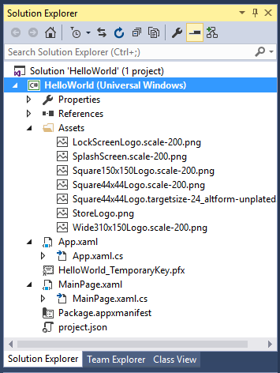

# Crear una aplicación "Hello, world" (XAML)

En este tutorial se enseña a usar lenguaje XAML con C# para crear una sencilla aplicación "Hello, world" para la Plataforma universal de Windows (UWP) de Windows 10. Con un único proyecto en Microsoft Visual Studio, puedes compilar una aplicación que se ejecute en cualquier dispositivo de Windows 10. Aquí nos centraremos en crear una aplicación que se ejecute por igual en dispositivos móviles y de escritorio.

**Importante**   Este tutorial está diseñado para usarse con Microsoft Visual Studio 2015 y Windows 10. No funcionará correctamente con las versiones anteriores.

Aquí aprenderás a:

-   Crear un nuevo proyecto de Visual Studio diseñado para Windows 10 y UWP.
-   Agregar contenido XAML a tu página de inicio.
-   Controlar la entrada táctil, de lápiz y de mouse.
-   Ejecutar el proyecto en el escritorio local y en el emulador de teléfono de Visual Studio.
-   Adaptar la interfaz de usuario a diferentes tamaños de pantalla.

## Antes de comenzar...


-   Vamos a empezar directamente con los pasos para crear una aplicación universal simple. Por lo tanto, te recomendamos que, antes de empezar este tutorial, leas y entiendas la información general de los artículos [Novedades de Windows 10](https://dev.windows.com/whats-new-windows-10-dev-preview) y [Qué es una aplicación universal de Windows](whats-a-uwp.md).
-   Para completar este tutorial, debes tener Windows 10 y Visual Studio 2015. Consulta [Get set up](get-set-up.md) para obtener más información.
-   Damos por hecho que tienes conocimientos básicos de XAML y que estás familiarizado con los conceptos de la [introducción a XAML](https://msdn.microsoft.com/library/windows/apps/Mt185595).
-   También se supone que estás usando el diseño de ventana predeterminado de Visual Studio. Si cambias el diseño predeterminado, puedes restablecerlo en el menú **Ventana** con el comando **Restablecer diseño de la ventana**.

##  Paso 1: Crear un nuevo proyecto en Visual Studio


1.  Inicia Visual Studio 2015.

   Aparecerá la página de inicio de Visual Studio 2015. (A partir de ahora, nos referiremos a Visual Studio 2015 simplemente como Visual Studio).

2.  En el menú **Archivo**, selecciona **Nuevo** > **Proyecto**.

   Se abre el cuadro de diálogo **Nuevo proyecto**. El panel izquierdo del cuadro de diálogo te permite seleccionar el tipo de plantillas que se muestran.

3.  En el panel izquierdo, expande **Instalado > Plantillas > Visual C# > Windows** y, a continuación, selecciona el grupo de plantillas **Universal**. El panel central del cuadro de diálogo muestra una lista de plantillas de proyecto para aplicaciones de la Plataforma universal de Windows (UWP).

   

4.  En el panel central, selecciona la plantilla **Aplicación vacía (Windows Universal)**.

   La plantilla **Aplicación vacía** crea una aplicación para UWP mínima que se compila y ejecuta, pero que no contiene datos ni controles de interfaz de usuario. Después, a lo largo de este curso, agregarás controles a la aplicación.

5.  En el cuadro de texto **Nombre**, escribe "HelloWorld".
6.  Haz clic en **Aceptar** para crear el proyecto.

   Visual Studio crea tu proyecto y lo muestra en el **Explorador de soluciones**.

   

Aunque **Aplicación vacía** es una plantilla mínima, contiene muchos archivos:

-   Un archivo de manifiesto (Package.appxmanifest) que describe tu aplicación (nombre, descripción, icono, página de inicio, etc.) y enumera los archivos que contiene la aplicación.
-   Un conjunto de imágenes de logotipo (Assets/Square150x150Logo.scale-200.png, Assets/Square44x44Logo.scale-200.png y Assets/Wide310x150Logo.scale-200.png) que se pueden mostrar en el menú Inicio.
-   Una imagen (Assets/StoreLogo.png) para representar tu aplicación en la Tienda Windows.
-   Una pantalla de presentación (Assets/SplashScreen.scale-200.png) que se muestra cuando se inicia la aplicación.
-   Archivos de código y XAML para la aplicación (App.xaml y App.xaml.cs).
-   Una página de inicio (MainPage.xaml) y un archivo de código complementario (MainPage.xaml.cs) que se ejecutan cuando se inicia la aplicación.

Estos archivos son esenciales para todas las aplicaciones para UWP que usan C#. Todos los proyectos que crees en Visual Studio contendrán estos archivos.

## Paso 2: Modificar tu página de inicio


### ¿Qué hay en los archivos?

Para ver y editar un archivo de tu proyecto, haz doble clic en el archivo en el **Explorador de soluciones**. De forma predeterminada, puedes expandir un archivo XAML del mismo modo que una carpeta para ver su archivo de código asociado. Los archivos XAML se abren en una vista en dos paneles que muestra la superficie de diseño y el editor de XAML.

En este tutorial, trabajas con solo algunos de los archivos enumerados anteriormente: App.xaml, MainPage.xaml y MainPage.xaml.cs.

### App.xaml y App.xaml.cs

App.xaml es donde declaras recursos que usas en la aplicación. App.xaml.cs es el archivo de código subyacente de App.xaml. El código subyacente es el código que se une a la clase parcial de la página XAML. Juntos, el XAML y el código subyacente forman una clase completa. App.xaml.cs es el punto de entrada para la aplicación. Como todas las páginas de código subyacente, contiene un constructor que llama al método `InitializeComponent`. Tú no escribes el método `InitializeComponent`. Lo genera Visual Studio, y su principal propósito es inicializar los elementos declarados en el archivo XAML. App.xaml.cs también contiene métodos para controlar la activación y la suspensión de la aplicación.

### MainPage.xaml

En MainPage.xaml defines la interfaz de usuario de la aplicación. Puedes agregar elementos directamente con el marcado XAML o puedes usar las herramientas de diseño suministradas por Visual Studio. MainPage.xaml.cs es la página de código subyacente de MainPage.xaml. Es el sitio donde agregas los controladores de eventos y la lógica de la aplicación.

Estos dos archivos juntos definen una nueva clase denominada `MainPage`, que se hereda de [**Page**](https://msdn.microsoft.com/library/windows/apps/BR227503), en el espacio de nombres `HelloWorld`.

MainPage.xaml

```xml
    <Page
    x:Class="HelloWorld.MainPage"
    xmlns="http://schemas.microsoft.com/winfx/2006/xaml/presentation"
    xmlns:x="http://schemas.microsoft.com/winfx/2006/xaml"
    xmlns:local="using:HelloWorld"
    xmlns:d="http://schemas.microsoft.com/expression/blend/2008"
    xmlns:mc="http://schemas.openxmlformats.org/markup-compatibility/2006"
    mc:Ignorable="d">

    <Grid Background="{ThemeResource ApplicationPageBackgroundThemeBrush}">

    </Grid>
</Page>
```

MainPage.xaml.cs

```csharp
using Windows.UI.Xaml;
using Windows.UI.Xaml.Controls;

namespace HelloWorld
{
    /// <summary>
    /// An empty page that can be used on its own or navigated to within a Frame.
    /// </summary>
    public sealed partial class MainPage : Page
    {
        public MainPage()
        {
            this.InitializeComponent();
        }
    }
}
```

### Modificar la página de inicio

Ahora vamos a agregar algo de contenido a la aplicación.

**Para modificar la página de inicio**

1.  Haz doble clic en el archivo MainPage.xaml en el **Explorador de soluciones** para abrirlo.
2.  En el editor de XAML, agrega los controles para la interfaz de usuario.

   En el elemento raíz [**Grid**](https://msdn.microsoft.com/library/windows/apps/BR242704), agrega este XAML. Contiene un elemento [**StackPanel**](https://msdn.microsoft.com/library/windows/apps/BR209635) con un elemento [**TextBlock**](https://msdn.microsoft.com/library/windows/apps/BR209652) de título, otro **TextBlock** que solicita el nombre del usuario, un elemento [**TextBox**](https://msdn.microsoft.com/library/windows/apps/BR209683) para aceptar el nombre de usuario, un elemento [**Button**](https://msdn.microsoft.com/library/windows/apps/BR209265) y otro **TextBlock** para mostrar un saludo. Algunos de estos controles tienen nombres para que puedas hacer referencia a ellos más tarde en el código.

```xml    
    <StackPanel x:Name="contentPanel" Margin="8,32,0,0">
        <TextBlock Text="Hello, world!" Margin="0,0,0,40"/>
        <TextBlock Text="What' s your name?"/>
        <StackPanel x:Name="inputPanel" Orientation="Horizontal" Margin="0,20,0,20">
            <TextBox x:Name="nameInput" Width="280" HorizontalAlignment="Left"/>
            <Button x:Name="inputButton" Content="Say &quot;Hello&quot;"/>
        </StackPanel>
        <TextBlock x:Name="greetingOutput"/>
    </StackPanel>
```    

    The controls that you added in the XAML editor show up in the design view.

## Paso 3: Iniciar la aplicación


En este punto, has creado una aplicación muy sencilla. Este es un buen momento para compilar, implementar e iniciar tu aplicación para ver su aspecto. Puedes depurar la aplicación en el equipo local, en un simulador, un emulador o en un dispositivo remoto. Este es el menú del dispositivo de destino de Visual Studio.


### Iniciar la aplicación en un dispositivo de escritorio

De forma predeterminada, la aplicación se ejecuta en el equipo local. El menú del dispositivo de destino proporciona varias opciones para depurar la aplicación en dispositivos de la familia de dispositivos de escritorio.

-   **Simulador**
-   **Equipo local**
-   **Equipo remoto**

**Para empezar la depuración en el equipo local**

1.  En el menú del dispositivo de destino () de la barra de herramientas **Estándar**, asegúrate de que **Equipo local** esté seleccionado. (Es la selección predeterminada).
2.  Haz clic en el botón **Iniciar depuración** () en la barra de herramientas.

   O bien

   En el menú **Depurar**, haz clic en **Iniciar depuración**.

   O bien

   Presiona F5.

La aplicación se abre en una ventana y, en primer lugar, aparece una pantalla de presentación predeterminada. Esta pantalla se define mediante una imagen (SplashScreen.png) y un color de fondo (especificado en el archivo de manifiesto de la aplicación).

La pantalla de presentación desaparece y, a continuación, aparece tu aplicación. Tiene esta apariencia.


Presiona la tecla Windows para abrir el menú **Inicio** y mostrar todas las aplicaciones. Ten en cuenta que al implementar la aplicación localmente se agrega su icono al menú **Inicio**. Para ejecutar la aplicación de nuevo (no en modo de depuración), pulsa o haz clic en su icono en el menú **Inicio**.

No hace muchas cosas (todavía), pero te felicitamos, has compilado tu primera aplicación para UWP.

**Para detener la depuración**

-   Haz clic en el botón **Detener depuración** () en la barra de herramientas.

   O bien

   En el menú **Depurar**, haz clic en **Detener depuración**.

   O bien

   Cierra la ventana de la aplicación.

### Iniciar la aplicación en un emulador de dispositivos móviles

La aplicación se ejecuta en cualquier dispositivo de Windows 10, así que vamos a ver su aspecto en un Windows Phone.

Además de las opciones para realizar la depuración en un dispositivo de escritorio, Visual Studio ofrece opciones para implementar y depurar la aplicación en un dispositivo móvil físico conectado al equipo o en un emulador de dispositivos móviles. Puedes elegir entre varios emuladores para dispositivos con diferentes configuraciones de memoria y pantalla.

-   **Dispositivo**
-   **Emulador <SDK version> WVGA de 4 pulgadas y 512 MB**
-   **Emulador <SDK version> WVGA de 4 pulgadas y 1 GB**
-   Etc. (Varios emuladores en otras configuraciones)

Se recomienda probar la aplicación en un dispositivo con una pantalla pequeña y de memoria limitada, por lo tanto, usa la opción **Emulador 10.0.10240.0 WVGA de 4 pulgadas y 512 MB**.
**Para iniciar la depuración en un emulador de dispositivo móvil**

1.  En el menú del dispositivo de destino () en la barra de herramientas **Estándar**, elige **Emulador 10.0.10240.0 WVGA de 4 pulgadas y 512 MB**.
2.  Haz clic en el botón **Iniciar depuración** () en la barra de herramientas.

   O bien

   En el menú **Depurar**, haz clic en **Iniciar depuración**.

   O bien

   Presiona F5.

Visual Studio inicia el emulador seleccionado y, a continuación, implementa e inicia la aplicación. En el emulador de dispositivos móviles, la aplicación tiene este aspecto.


Lo primero que observarás es que el botón queda fuera de la pantalla más pequeña de un dispositivo móvil. Más adelante en este tutorial, aprenderás a adaptar la interfaz de usuario a diferentes tamaños de pantalla para que la aplicación siempre se vea bien.

También puedes observar que puedes escribir en [**TextBox**](https://msdn.microsoft.com/library/windows/apps/BR209683), pero ahora mismo, al hacer clic o pulsar en [**Button**](https://msdn.microsoft.com/library/windows/apps/BR209265) no sucede nada. En los pasos siguientes, crearás un controlador de eventos para el evento [**Click**](https://msdn.microsoft.com/library/windows/apps/BR227737) del botón para mostrar un saludo personalizado. Agrega el código del controlador de eventos al archivo MainPage.xaml.cs.

## Paso 4: Crear un controlador de eventos


Los elementos XAML pueden enviar mensajes cuando se producen ciertos eventos. Estos mensajes de eventos te dan la oportunidad de realizar alguna acción como respuesta al evento. El código para responder al evento lo pones en un método de controlador de eventos. Uno de los eventos más comunes en muchas aplicaciones es que un usuario haga clic en un [**Button**](https://msdn.microsoft.com/library/windows/apps/BR209265).

Crearemos un controlador de eventos para el evento [**Click**](https://msdn.microsoft.com/library/windows/apps/BR227737) del botón. El controlador de eventos obtendrá el nombre del usuario del control `nameInput`[**TextBox**](https://msdn.microsoft.com/library/windows/apps/BR209683) y lo usará para enviar un saludo a `greetingOutput`[**TextBlock**](https://msdn.microsoft.com/library/windows/apps/BR209652).

### Uso de eventos que funcionan para entradas táctiles, de mouse y de lápiz

¿Qué eventos tienes que controlar? Dado que se pueden ejecutar en varios dispositivos, diseña tu aplicación de la Tienda Windows teniendo en cuenta la entrada táctil. Tu aplicación también debe poder controlar la entrada desde un mouse o un lápiz. Afortunadamente, los eventos como [**Click**](https://msdn.microsoft.com/library/windows/apps/BR227737) y [**DoubleTapped**](https://msdn.microsoft.com/library/windows/apps/BR208922) son independientes de dispositivo. Si estás familiarizado con la programación de Microsoft .NET, es posible que hayas visto eventos separados para entradas táctiles, de mouse o de lápiz, como **MouseMove**, **TouchMove** y **StylusMove**. En las aplicaciones de la Tienda Windows, estos eventos separados se sustituyen por un único evento [**PointerMoved**](https://msdn.microsoft.com/library/windows/apps/BR208970) que funciona igual de bien para entradas táctiles, de mouse o de lápiz.

**Para agregar un controlador de eventos**

1.  En la vista de diseño o XAML, selecciona el elemento [**Button**](https://msdn.microsoft.com/library/windows/apps/BR209265) "Saluda" que agregaste a MainPage.xaml.
2.  En la **Ventana de propiedades**, haz clic en el botón Eventos ().
3.  Busca el evento [**Click**](https://msdn.microsoft.com/library/windows/apps/BR227737) en la parte superior de la lista de eventos. En el cuadro de texto del evento, escribe el nombre de la función que controla el evento **Click**. Para este ejemplo, escribe "Button\_Click".

   

4.  Presiona Entrar. El método del controlador de eventos se crea y se abre en un editor de código, de forma que puedes agregar código para que se ejecute cuando se produzca el evento.

    En el editor de XAML, el XAML para [**Button**](https://msdn.microsoft.com/library/windows/apps/BR209265) se actualiza para declarar el controlador de eventos de [**Click**](https://msdn.microsoft.com/library/windows/apps/BR227737) del modo siguiente.

```xml   
   <Button x:Name="inputButton" Content="Say &quot;Hello&quot;" Click="Button_Click"/>
```    

5.  Agrega código al controlador de eventos que creaste en la página de código subyacente. En el controlador de eventos, recupera el nombre del usuario del control `nameInput`[**TextBox**](https://msdn.microsoft.com/library/windows/apps/BR209683) y úsalo para crear un saludo. Usa `greetingOutput`[**TextBlock**](https://msdn.microsoft.com/library/windows/apps/BR209652) para mostrar el resultado.
    
```csharp    
    private void Button_Click(object sender, RoutedEventArgs e)
    {
        greetingOutput.Text = "Hello, " + nameInput.Text + "!";
    }
```    

6.  Depura la aplicación en el equipo local. Cuando entras tu nombre en el cuadro de texto y haces clic en el botón, la aplicación muestra un saludo personalizado.

## Paso 5: Adaptar la interfaz de usuario a diferentes tamaños de ventana


Ahora haremos que la interfaz de usuario se adapte a diferentes tamaños de pantalla para que se vea correctamente en los dispositivos móviles. Para ello, agrega [**VisualStateManager**](https://msdn.microsoft.com/library/windows/apps/BR209021) y establece las propiedades que se aplican a diferentes estados visuales.

**Para ajustar el diseño de interfaz de usuario**

1.  En el editor XAML, agrega este bloque de XAML después de la etiqueta de apertura del elemento raíz [**Grid**](https://msdn.microsoft.com/library/windows/apps/BR242704).

```xml    
    <VisualStateManager.VisualStateGroups>
        <VisualStateGroup>
            <VisualState x:Name="wideState">
                <VisualState.StateTriggers>
                    <AdaptiveTrigger MinWindowWidth="641" />
                </VisualState.StateTriggers>
            </VisualState>
            <VisualState x:Name="narrowState">
                <VisualState.StateTriggers>
                    <AdaptiveTrigger MinWindowWidth="0" />
                </VisualState.StateTriggers>
                <VisualState.Setters>
                    <Setter Target="inputPanel.Orientation" Value="Vertical"/>
                    <Setter Target="inputButton.Margin" Value="0,4,0,0"/>
                </VisualState.Setters>
            </VisualState>
        </VisualStateGroup>
    </VisualStateManager.VisualStateGroups>
```    

2.  Depura la aplicación en el equipo local. Verás que la interfaz de usuario es igual que antes, a menos que la ventana tenga un ancho inferior a 641 píxeles.
3.  Depura la aplicación en el emulador de dispositivos móviles. Observa que la interfaz de usuario use las propiedades definidas en `narrowState` y aparezca correctamente en la pantalla pequeña.


Si has usado [**VisualStateManager**](https://msdn.microsoft.com/library/windows/apps/BR209021) en versiones anteriores de XAML, puedes observar que aquí el XAML usa una sintaxis simplificada.

El [**VisualState**](https://msdn.microsoft.com/library/windows/apps/BR209007) llamado `wideState` tiene un [**AdaptiveTrigger**](https://msdn.microsoft.com/library/windows/apps/Dn890382) con su propiedad [**MinWindowWidth**](https://msdn.microsoft.com/en-us/library/windows/apps/windows.ui.xaml.adaptivetrigger.minwindowwidth) establecida en 641. Esto significa que el estado se aplicará únicamente cuando el ancho de la ventana no sea inferior al mínimo de 641 píxeles. Para este estado no definas ningún objeto [**Setter**](https://msdn.microsoft.com/library/windows/apps/BR208817) a fin de que se usen las propiedades de diseño definidas en el XAML para el contenido de la página.

El segundo [**VisualState**](https://msdn.microsoft.com/library/windows/apps/BR209007), `narrowState`, tiene un [**AdaptiveTrigger**](https://msdn.microsoft.com/library/windows/apps/Dn890382) con su propiedad [**MinWindowWidth**](https://msdn.microsoft.com/en-us/library/windows/apps/windows.ui.xaml.adaptivetrigger.minwindowwidth) establecida en 0. Este estado se aplica cuando el ancho de la ventana es mayor que 0, pero inferior a 641 píxeles. (En 641 píxeles, se aplica `wideState`). En este estado, defines algunos objetos [**Setter**](https://msdn.microsoft.com/library/windows/apps/BR208817) para cambiar las propiedades de diseño de los controles de la interfaz de usuario:

-   Cambias [**Orientation**](https://msdn.microsoft.com/library/windows/apps/windows.ui.xaml.controls.stackpanel.orientation) del elemento `inputPanel` desde **Horizontal** a **Vertical**.
-   Agrega un margen superior de 4 al elemento `inputButton`.

## Resumen


Enhorabuena, has creado tu primera aplicación para Windows 10 y UWP.


<!--HONumber=May16_HO2-->


