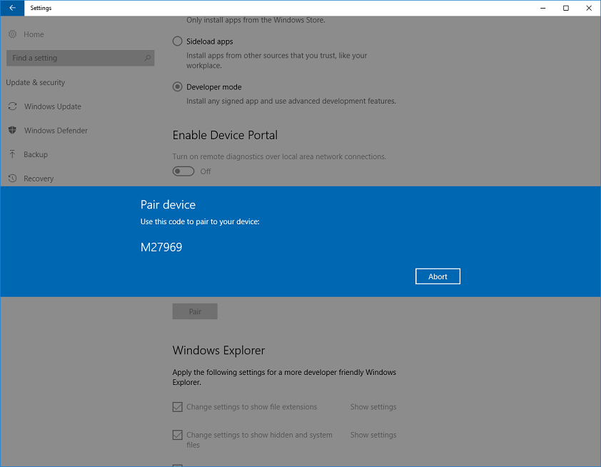

# Habilitar el dispositivo para el desarrollo

Para poder crear aplicaciones, necesitas habilitar el modo de desarrollador tanto en el equipo de desarrollo como en los dispositivos en los que probarás el código.

## Usar las funciones para desarrolladores

### Desarrollar la aplicación con Microsoft Visual Studio

Debes habilitar el modo de desarrollador en tu PC para poder abrir un proyecto de aplicación para UWP en Visual Studio. Si abres un proyecto de UWP y no está habilitado el modo de desarrollador, la página de configuración **Para desarrolladores** se abrirá automáticamente. Sigue las instrucciones de la siguiente sección para habilitar el modo de desarrollador.

Cuando abras un proyecto de aplicación para UWP en Visual Studio en Windows 10, versión 1511 o anterior, verás este cuadro de diálogo de Visual Studio. 

Cuando veas este cuadro de diálogo, haz clic en **configuración para desarrolladores** para abrir la página de configuración **Para desarrolladores** y habilitar el modo de desarrollador.

> Puedes ir a la página **Para desarrolladores** en cualquier momento para habilitar o deshabilitar el modo de desarrollador: solo tienes que escribir "configuración de desarrollador" en el cuadro de búsqueda de Cortana de la barra de tareas.

### Habilitar los dispositivos Windows 10

Puedes habilitar un dispositivo para el desarrollo o solo para transferir aplicaciones localmente.

-   *Transferir localmente* consiste en instalar y ejecutar o probar una aplicación que la Tienda Windows no ha certificado. Por ejemplo, una aplicación interna de tu empresa solamente.
-   El *Modo de desarrollador* permite transferir localmente aplicaciones y también ejecutar aplicaciones desde Visual Studio en modo de depuración. 

    Cuando se habilita el modo de desarrollador, se instala un paquete de opciones que:
    - Instala Windows Device Portal. Se habilita Device Portal y se configuran reglas de firewall para este solo si la opción **Habilitar Device Portal** está activada.
    - Instala, habilita y configura reglas de firewall para los servicios SSH que permiten la instalación remota de aplicaciones.
    - (Solo escritorio) Permite habilitar el subsistema de Windows para Linux. Para obtener más información, consulta [Bash on Ubuntu on Windows](https://msdn.microsoft.com/commandline/wsl/about) (Bash en Ubuntu en Windows).

Para obtener información detallada sobre las opciones, consulta [¿Qué opción de configuración debo elegir? ¿Transferencia local de aplicaciones o modo de desarrollador?](https://msdn.microsoft.com/en-us/windows/uwp/get-started/enable-your-device-for-development#which-settings-should-i-choose-sideload-apps-or-developer-mode)

**Usar las funciones para desarrollador**

1.  En el dispositivo que quieras habilitar, ve a **Configuración**. Elige **Actualización y seguridad** y, luego, **Para desarrolladores**.
2.  Elige el nivel de acceso que necesitas: para desarrollar aplicaciones para UWP, elige **Modo de desarrollador**. 
3.  Lee el aviso de declinación de responsabilidades para la configuración elegida y, luego, haz clic en **Sí** para aceptar el cambio.

> [!NOTE]
> Si el dispositivo pertenece a una organización, puede que esta haya deshabilitado algunas opciones, como se muestra aquí.

Esta es la página de configuración de la familia de dispositivos de escritorio.

Esta es la página de configuración de la familia de dispositivos móviles.

## Características del modo de desarrollador

Para cada familia de dispositivos, es posible que haya funciones para desarrolladores adicionales disponibles. Estas funciones solo están disponibles cuando el modo de desarrollador está habilitado en el dispositivo y pueden variar según la versión del sistema operativo.

En esta imagen se muestran las características para desarrolladores de la familia de dispositivos móviles de la versión 1511 de Windows 10.

 

### Device Portal

Para obtener más información sobre la detección de dispositivos y Device Portal, consulta [Introducción a Windows Device Portal](../debug-test-perf/device-portal.md).

Para obtener instrucciones específicas sobre la configuración del dispositivo, consulta:
- [Device Portal para equipos de escritorio](https://msdn.microsoft.com/windows/uwp/debug-test-perf/device-portal-desktop)
- [Device Portal para HoloLens](https://dev.windows.com/holographic/using_the_windows_device_portal)
- [Device Portal para IoT](http://ms-iot.github.io/content/en-US/win10/tools/DevicePortal.htm)
- [Device Portal para dispositivos móviles](../debug-test-perf/device-portal-mobile.md)
- [Device Portal para Xbox](../debug-test-perf/device-portal-xbox.md)

Si tienes problemas para habilitar el modo de desarrollador o Device Portal, consulta el foro de [problemas conocidos](https://social.msdn.microsoft.com/Forums/en-US/home?forum=Win10SDKToolsIssues&sort=relevancedesc&brandIgnore=True&searchTerm=%22device+portal%22) para encontrar soluciones para estos problemas. 

###SSH

Los servicios SSH se habilitan al habilitar el modo de desarrollador en el dispositivo.  Esto se usa cuando el dispositivo es un destino de implementación para aplicaciones para UWP.   Los nombres de los servicios son 'SSH Server Broker' y 'SSH Server Proxy'.

> [!NOTE]
> No se trata de la implementación OpenSSH de Microsoft, que puedes encontrar en [GitHub](https://github.com/PowerShell/Win32-OpenSSH).

Para aprovechar las ventajas de los servicios SSH, puedes habilitar la detección de dispositivos para permitir el emparejamiento de PIN. Si tienes previsto ejecutar otro servicio SSH, puedes configurar esto en un puerto diferente o desactivar los servicios SSH del modo de desarrollador. Para desactivar los servicios SSH, solo tienes que deshabilitar el modo de desarrollador.  

### Detección de dispositivos

Al habilitar la detección de dispositivos, permites que el dispositivo esté visible para otros dispositivos de la red a través de mDNS.  Esta característica también te permite obtener el PIN de SSH para el emparejamiento con este dispositivo.  

Debes habilitar la detección de dispositivos solo si tienes previsto que el dispositivo sea un destino de implementación. Por ejemplo, si usas Device Portal para implementar una aplicación en un teléfono para probarla, debes habilitar la detección de dispositivos en el teléfono, pero no en el equipo de desarrollo.

### Informes de error (solo dispositivos móviles)

Establece este valor para especificar el número de volcados de memoria que se guardarán en el teléfono.

La recopilación de los volcados de memoria en el teléfono te ofrece acceso inmediato a información importante sobre bloqueos apenas se producen. Los volcados de memoria se recopilan únicamente para aplicaciones firmadas por el desarrollador. Puedes encontrar los volcados de memoria en la carpeta Documents\\Debug de almacenamiento del teléfono. Para obtener más información sobre los archivos de volcado de memoria, consulta [Usar archivos de volcado de memoria](https://msdn.microsoft.com/library/d5zhxt22.aspx).

### Optimizaciones para Explorador de Windows, Escritorio remoto y PowerShell (solo equipos de escritorio)

 En la familia de dispositivos de escritorio, la página de configuración **Para desarrolladores** tiene accesos directos a la configuración que puedes usar para optimizar tu PC para realizar tareas de desarrollo. Para cada opción de configuración, puedes activar la casilla y hacer clic en **Aplicar** o hacer clic en el vínculo **Mostrar configuración** para abrir la página de configuración para esta opción. 

## ¿Qué opción de configuración debo elegir? ¿Transferencia local de aplicaciones o modo de desarrollador?

De forma predeterminada, solo se pueden instalar aplicaciones para plataforma universal de Windows (UWP) desde la Tienda Windows. Si modificas esta configuración para usar las funciones de desarrollador, puede cambiar el nivel de seguridad de tu dispositivo. No debes instalar aplicaciones proveniente de orígenes sin comprobar.

### Instalación de prueba de aplicaciones

Por lo general, las empresas y las instituciones educativas que necesitan instalar aplicaciones personalizadas en dispositivos administrados sin necesidad de usar la Tienda Windows eligen la opción de instalación de prueba de aplicaciones. En este caso, es habitual que la organización aplique una directiva que deshabilite la opción *Aplicaciones de la Tienda Windows*, tal como se mostró anteriormente en la imagen de la página de configuración. La organización también proporciona el certificado necesario y la ubicación de instalación para transferir aplicaciones localmente. Para obtener más información, consulta los artículos de TechNet [Realizar la instalación de prueba de aplicaciones de línea de negocio en Windows 10](https://technet.microsoft.com/library/mt269549.aspx) e [Introducción a la implementación de aplicaciones en Microsoft Intune](https://technet.microsoft.com/library/dn646955.aspx).

Información específica de la familia de dispositivos

-   En la familia de dispositivos de escritorio, puedes instalar un paquete de la aplicación (.appx) y cualquier certificado necesario para ejecutar la aplicación. Para hacerlo, ejecuta el script de Windows PowerShell que se creó con el paquete ("Add-AppDevPackage.ps1"). Para más información, consulta [Empaquetado de aplicaciones para UWP](../packaging/packaging-uwp-apps.md).

-   En la familia de dispositivos móviles: si el certificado necesario ya está instalado, puedes pulsar en el archivo para instalar cualquier archivo .appx que te hayan enviado por correo electrónico o que tengas en una tarjeta SD.

**Transferir localmente aplicaciones** es una opción más segura que el modo de desarrollador porque no permite instalar en el dispositivo aplicaciones que no tengan un certificado de confianza.

> [!NOTE]
> Aunque transfieras aplicaciones localmente, solo deberías instalar aplicaciones procedentes de orígenes de confianza. Cuando realizas la instalación de prueba de una aplicación que la Tienda Windows no ha certificado, admites que has obtenido todos los derechos necesarios para este fin y que eres el único responsable de los perjuicios que la instalación y la ejecución de esta aplicación puedan causar. Consulta la sección Windows &gt; Tienda Windows de esta [declaración de privacidad](http://go.microsoft.com/fwlink/?LinkId=521839).

### Modo de desarrollador

El modo de desarrollador reemplaza el requisito de Windows 8.1 que exige una licencia de desarrollador.  Además de la transferencia local, la opción de modo de desarrollador habilita la depuración y otras opciones de implementación. Esto incluye el inicio de un servicio SSH para poder implementar el dispositivo. Para detener este servicio, tienes que deshabilitar el modo de desarrollador.

Información específica de la familia de dispositivos

-   En la familia de dispositivos de escritorio:

    Habilita el modo de desarrollador para desarrollar y depurar aplicaciones en Visual Studio. Tal como mencionamos anteriormente, si este modo no está habilitado, en Visual Studio se te pedirá que lo habilites.

    Permite habilitar el subsistema de Windows para Linux. Para obtener más información, consulta [Bash on Ubuntu on Windows](https://msdn.microsoft.com/commandline/wsl/about) (Bash en Ubuntu en Windows).

-   En la familia de dispositivos móviles:

    Habilita el modo de desarrollador para implementar aplicaciones desde Visual Studio y depurarlas en el dispositivo.

    Puedes pulsar en el archivo para instalar cualquier .appx recibido por correo electrónico o que tengas en una tarjeta SD. No instales aplicaciones provenientes de orígenes sin comprobar.

**Sugerencia**  
Hay varias herramientas que puedes usar para implementar una aplicación de un equipo con Windows 10 a un dispositivo móvil con Windows 10. Ambos dispositivos deben estar conectados a la misma subred de la red mediante una conexión con cable o inalámbrica, o bien deben estar conectados mediante USB. Cualquiera de las formas mencionadas solo instala el paquete de la aplicación (.appx); no se instalan los certificados.

-   Usa la herramienta de implementación de aplicaciones de Windows10 (WinAppDeployCmd). Obtén más información sobre la [herramienta WinAppDeployCmd](http://msdn.microsoft.com/library/windows/apps/mt203806.aspx).
-   A partir de Windows 10, versión 1511, puedes usar [Device Portal](#device_portal) para realizar implementaciones desde el navegador en un dispositivo móvil con Windows 10, versión 1511 o posterior. Usa la página **[Aplicaciones](../debug-test-perf/device-portal.md#apps)** de Device Portal para cargar un paquete de la aplicación (.appx) e instalarlo en el dispositivo.

## Usar directivas de grupo o claves del Registro para habilitar un dispositivo

Para la mayoría de los desarrolladores, es recomendable usar la aplicación de configuración para habilitar el dispositivo para la depuración. En determinados escenarios, como las pruebas automatizadas, puedes usar otras formas de habilitar el dispositivo de escritorio Windows 10 para el desarrollo.

Puedes usar gpedit.msc para definir las directivas de grupo necesarias para habilitar el dispositivo, a menos que tengas Windows 10 Home. Si tienes Windows 10 Home, tienes que usar regedit o los comandos de PowerShell para establecer directamente las claves del Registro para habilitar el dispositivo.

**Usar gpedit para habilitar el dispositivo**

1.  Ejecuta **Gpedit.msc**.
2.  Ve a Directiva de equipo Local &gt; Configuración del equipo &gt; Plantillas administrativas &gt; Componentes de Windows &gt; Implementación de paquetes de aplicaciones
3.  Para habilitar la instalación de prueba, edita las directivas para habilitar:

    -   **Permitir la instalación de todas las aplicaciones de confianza**

    - O bien

    Para habilitar el modo de desarrollador, edita las directivas para habilitar ambos:

    -   **Permitir la instalación de todas las aplicaciones de confianza**
    -   **Permite el desarrollo de aplicaciones de la Tienda de Windows y su instalación desde un entorno de desarrollo integrado (IDE)**

4.  Reinicia el equipo.

**Usar regedit para habilitar el dispositivo**

1.  Ejecuta **regedit**.
2.  Para habilitar la instalación de prueba, establece el valor de este DWORD en 1:

    -   **HKLM\\SOFTWARE\\Microsoft\\Windows\\CurrentVersion\\AppModelUnlock\\AllowAllTrustedApps**

    - O bien

    Para habilitar el modo de desarrollador, establece los valores de este DWORD en 1:

    -   **HKLM\\SOFTWARE\\Microsoft\\Windows\\CurrentVersion\\AppModelUnlock\\AllowDevelopmentWithoutDevLicense**

**Usar PowerShell para habilitar el dispositivo**

1.  Ejecuta PowerShell con privilegios de administrador.
2.  Para habilitar la instalación de prueba, ejecuta el siguiente comando:

    -   **PS C:\\WINDOWS\\system32&gt; reg add "HKEY\_LOCAL\_MACHINE\\SOFTWARE\\Microsoft\\Windows\\CurrentVersion\\AppModelUnlock" /t REG\_DWORD /f /v "AllowAllTrustedApps" /d "1"**

    - O bien

    Para habilitar el modo de desarrollador, ejecuta el siguiente comando:

    -   **PS C:\\WINDOWS\\system32&gt; reg add "HKEY\_LOCAL\_MACHINE\\SOFTWARE\\Microsoft\\Windows\\CurrentVersion\\AppModelUnlock" /t REG\_DWORD /f /v "AllowDevelopmentWithoutDevLicense" /d "1"**

## Actualizar el dispositivo de Windows 8.1 a Windows 10

Si creas o transfieres localmente aplicaciones en un dispositivo con Windows 8.1, tienes que instalar una licencia de desarrollador. Si actualizas tu dispositivo de Windows 8.1 a Windows 10, esta información permanece. Ejecuta el siguiente comando para quitar la información del dispositivo actualizado a Windows 10. Este paso no es necesario si actualizas directamente de Windows 8.1 a Windows 10, versión 1511 o posterior.

**Para anular el registro de una licencia de desarrollador**

1.  Ejecuta PowerShell con privilegios de administrador.
2.  Ejecutar este comando: **unregister-windowsdeveloperlicense**.

Después debes habilitar el dispositivo para el desarrollo, tal como se describe en este tema, para que puedas seguir desarrollando en este dispositivo. Si no lo haces, es posible que obtengas un error al depurar la aplicación o intentar crear un paquete para ella. Este es un ejemplo de este error:

Error : DEP0700 : Error en el registro de la operación.

<!--HONumber=Aug16_HO5-->

