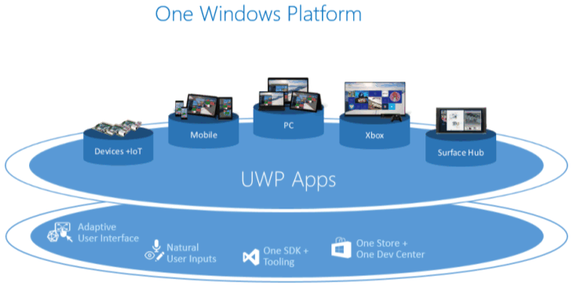

# ¿Qué es una aplicación para la Plataforma universal de Windows (UWP)?

Una aplicación para UWP es:

- Seguro: Las aplicaciones para UWP declaran qué recursos de dispositivo y acceso a datos. El usuario debe autorizar ese acceso.
- Pueden usar una API común en todos los dispositivos que usan Windows 10.
- Puede usar funcionalidades específicas del dispositivo y adaptar la interfaz de usuario para los tamaños de pantalla de otro dispositivo, resoluciones y PPP.
- Disponible desde Microsoft Store en todos los dispositivos (o solo aquellos que especifiques) que se ejecutan en Windows 10. Microsoft Store proporciona varias maneras de ganar dinero en tu aplicación.
- Puede instalarse y desinstalarse sin riesgo para la máquina ni incurrir en "equipo rot".
- Atractiva: usa iconos dinámicos, notificaciones de inserción y actividades del usuario que interactúan con la escala de tiempo de Windows y la función Continuar donde lo dejé de Cortana para atraer a los usuarios.
- Programable en C#, C++, Visual Basic y Javascript. Para la interfaz de usuario, usa XAML, HTML o DirectX.

Veamos esto con más detalle.

## Seguras

La aplicaciones para UWP declaran en el manifiesto las capacidades del dispositivo que necesitan, como el acceso al micrófono, la ubicación, la cámara web, los dispositivos USB, archivos, etc. El usuario debe confirmar y autorizar ese acceso antes de que la aplicación obtenga la funcionalidad.

## Una superficie de API común para todos los dispositivos

Windows 10 presenta la plataforma Universal de Windows (UWP), que proporciona una plataforma de aplicación comunes en todos los dispositivos que ejecutan Windows 10. Las API principales de la UWP son las mismas en todos los dispositivos Windows. Si la aplicación solo usa las API centrales, ejecutará en cualquier dispositivo Windows 10 con independencia de que el destino sea un PC de escritorio, Xbox, auriculares de realidad mixta y así sucesivamente.

Una aplicación para UWP escrita en C++ /WinRT or C++ /CX tiene acceso a las API de Win32 que forman parte de la UWP. Estas API de Win32 son implementadas por todos los dispositivos Windows 10.

## Las SDK de extensión exponen las funcionalidades exclusivas de tipos específicos de dispositivo

Si tu objetivo son las API universales, la aplicación puede ejecutarse en todos los dispositivos con Windows 10. Sin embargo, si quieres que tu aplicación para UWP aproveche las API específicas del dispositivo, puedes hacerlo.

Las SDK de extensión te permiten llamar a API especializadas para diferentes dispositivos. Por ejemplo, si tu aplicación para UWP está destinada a un dispositivo de IoT, puedes agregar la SDK de extensión IoT a tu proyecto para dirigirte a características específicas de los dispositivos IoT. Para obtener más información sobre cómo agregar SDK de extensión, consulta la sección **SDK de extensión** en [Información general sobre las familias de dispositivos](https://docs.microsoft.com/uwp/extension-sdks/device-families-overview#extension-sdks).

Puedes escribir tu aplicación para que se ejecute solo en un determinado tipo de dispositivo y, a continuación, limitar su distribución desde Microsoft Store a solo ese tipo de dispositivo. O bien, puedes probar de manera condicional la presencia de una API en tiempo de ejecución y adaptar el comportamiento de la aplicación en consecuencia. Para obtener más información, consulta la sección **Escribir código** en [Información general sobre las familias de dispositivos](https://docs.microsoft.com/uwp/extension-sdks/device-families-overview#writing-code) 

El siguiente vídeo proporciona una breve introducción de las familias de dispositivos y el código adaptable:
<iframe src="https://channel9.msdn.com/Blogs/One-Dev-Minute/Introduction-to-UWP-and-Device-Families/player" width="640" height="360" allowFullScreen frameBorder="0"></iframe>

## Controles y entrada adaptable

Los elementos de la interfaz de usuario responden al tamaño y los PPP de la pantalla sobre la que se ejecuta la aplicación ajustando su escala y diseño. Las aplicaciones de UWP funcionan bien con varios tipos de entrada, como el teclado, el mouse, la funcionalidad táctil, el lápiz y los controladores de Xbox One. Si necesitas personalizar aún más la interfaz de usuario a un tamaño de pantalla o un dispositivo específicos, los nuevos paneles y herramientas de diseño te ayudarán a diseñar interfaces de usuario que se puedan adaptar a los diferentes dispositivos y factores de forma sobre los que se ejecute tu aplicación.

Windows te ayuda a destinar la interfaz de usuario a varios dispositivos con las siguientes características:

- Los controles universales y los paneles de diseño te ayudan a optimizar la interfaz de usuario para la resolución de pantalla del dispositivo. Por ejemplo, controles como botones y controles deslizantes se adaptan automáticamente al tamaño de pantalla del dispositivo y la densidad de PPP. Los paneles de diseño ayudan a ajustar el diseño del contenido en función del tamaño de la pantalla. El ajuste de escala adaptable se amolda a la resolución y a las diferencias de PPP que haya entre los dispositivos.
- El control de entrada común te permite recibir una entrada mediante funcionalidad táctil, un lápiz, un ratón, un teclado o bien un controlador, como el controlador de Microsoft Xbox.
- Herramientas que te ayudan a diseñar una interfaz de usuario que se pueda adaptar a diferentes resoluciones de pantalla.

Algunos aspectos de la interfaz de usuario de la aplicación se adaptan automáticamente en todos los dispositivos. Sin embargo, quizá haya que adaptar el diseño de la experiencia del usuario en la aplicación, en función del dispositivo en el que esta se ejecute. Por ejemplo, una aplicación de fotos podría adaptar su interfaz de usuario cuando se ejecute en un dispositivo portátil y pequeño para garantizar que pueda usarse perfectamente con una sola mano. Cuando una aplicación de fotos se ejecuta en un ordenador de escritorio, la interfaz de usuario debe adaptarse para aprovechar el espacio de pantalla adicional.

## Hay una tienda para todos los dispositivos

Una tienda de aplicaciones unificada hace que la aplicación esté disponible en dispositivos Windows 10, como PC, Tablet PC, Xbox, HoloLens, Surface Hub y los dispositivos de Internet de las cosas (IoT). Puedes enviar la aplicación a la tienda y hacer que esté disponible en todos los tipos de dispositivos, o solo en los que elijas. Puedes enviar y administrar todas tus aplicaciones para los dispositivos de Windows en un solo lugar. ¿Tienes una aplicación de escritorio en C++ y quieres modernizarla con características de UWP y venderla en Microsoft Store? Tampoco hay problema.

Las aplicaciones de UWP se integran con [Application Insights](https://azure.microsoft.com/services/application-insights/) para los análisis y la telemetría detallada, una herramienta esencial para entender a tus usuarios y mejorar las aplicaciones.

### Rentabiliza tu aplicación

Puedes elegir cómo monetizar tu aplicación. Existen muchas maneras de ganar dinero con tus aplicaciones. Lo único que necesitas hacer es elegir la que mejor se adapte a ti, por ejemplo:

- Una descarga de pago es la opción más simple. Simplemente pon el precio.
- Las versiones de prueba permiten a los usuarios probar tu aplicación antes de comprarla, ya que ofrecen capacidades de detección y conversión más sencillas que las opciones "freemium" más tradicionales.
- Precios de venta para incentivar a los usuarios.
- También están disponibles compras desde la aplicación y anuncios.

### Las aplicaciones de Microsoft Store proporcionan una experiencia de instalación, desinstalación y actualización fluida.

Todas las aplicaciones de UWP se distribuyen mediante un sistema de empaquetado que protege el sistema, el dispositivo y el usuario. Los usuarios nunca tendrán que lamentar haber instalado una aplicación porque las aplicaciones para UWP se pueden desinstalar sin dejar nada atrás, excepto los documentos creados con la aplicación.

Las aplicaciones se pueden implementar y actualizar sin problemas. El empaquetado de la aplicación puede ser modular para poder descargar contenido y extensiones a petición.

## Ofrece información en tiempo real y relevante a los usuarios para que sigan volviendo

Hay varias formas de mantener a los usuarios interesados con tu aplicación para UWP:

- Iconos dinámicos e iconos de pantalla de bloqueo que muestran información relevante y oportuna según el contexto, desde tu aplicación y con solo un vistazo.
- Notificaciones de inserción que transmiten alertas en tiempo real para llamar la atención del usuario.
- Las actividades del usuario permiten que los usuarios reanuden la actividad en tu aplicación allá donde la dejaron, incluso en otros dispositivos.
- El Centro de acciones organiza notificaciones desde tu aplicación.
- La ejecución en segundo plano y los desencadenadores permiten que tu aplicación cobre vida justo cuando el usuario lo necesita.
- Tu aplicación puede usar la voz y dispositivos Bluetooth de bajo consumo para que los usuarios interactúen con el mundo que los rodea.
- Integra Cortana para agregar funcionalidad de comando de voz a tu aplicación.

##  Usar un lenguaje que ya conoces

Las aplicaciones para UWP usan Windows Runtime, la API nativa provista por el sistema operativo. Esta API se implementa en C++ y es compatible con C#, Visual Basic, C++ y JavaScript. Algunas de las opciones para escribir aplicaciones para UWP son:

- Interfaz de usuario XAML, C#, VB o C++
- Interfaz de usuario DirectX y C++
- JavaScript y HTML

## Vínculos que te ayudan a empezar

### Preparación

Consulta [Prepárate](get-set-up.md) para descargar las herramientas que necesitas a fin de empezar a crear aplicaciones y [escribe tu primera aplicación](your-first-app.md).

### Diseña tu aplicación

El sistema de diseño de Microsoft se denomina Fluent. El sistema Fluent Design es un conjunto de características para UWP combinado con procedimientos recomendados para crear aplicaciones que funcionan a la perfección en todo tipo de dispositivos Windows. Las experiencias fluidas se adaptan y se usan con fluidez en todos los dispositivos, desde tabletas a portátiles o equipos a televisores, y en dispositivos de realidad virtual. Consulta [El sistema Fluent Design para las aplicaciones para UWP](https://docs.microsoft.com/windows/uwp/design/fluent-design-system) para ver una introducción a Fluent Design.

Un buen [diseño](https://go.microsoft.com/fwlink/?LinkId=258848) consiste en decidir cómo interactuarán los usuarios con tu aplicación, además de qué aspecto tendrá y cómo funcionará. La experiencia del usuario tiene un papel clave a la hora de determinar la satisfacción de los usuarios con tu aplicación, así que no ahorres esfuerzos en este paso. [Conceptos básicos de diseño](https://developer.microsoft.com/en-us/windows/apps/design) es una introducción al diseño de aplicaciones universales de Windows. Consulta [Introducción a las aplicaciones de la Plataforma universal de Windows (UWP) para diseñadores](https://docs.microsoft.com/windows/uwp/layout/design-and-ui-intro) para obtener información sobre cómo diseñar aplicaciones para UWP que encandilen a los usuarios. Antes de empezar a escribir código, consulta la [Información básica de dispositivos](../design/devices/index.md) , que te ayudará a reflexionar sobre la experiencia de interacción que ofrecerá la aplicación en los diferentes factores de forma a los que quieras destinarla.

Además de la interacción en diferentes dispositivos, [planea la aplicación](https://docs.microsoft.com/windows/uwp/get-started/plan-your-app) para incorporar las ventajas de trabajar en varios dispositivos. Por ejemplo:

- Diseña el flujo de trabajo con [Conceptos básicos de diseño de la navegación para aplicaciones para UWP](https://docs.microsoft.com/windows/uwp/layout/navigation-basics) para integrar dispositivos móviles, de pantalla pequeña y de pantalla grande. [Diseña la interfaz de usuario](https://docs.microsoft.com/windows/uwp/layout/screen-sizes-and-breakpoints-for-responsive-design) para responder a diferentes tamaños de pantalla y resoluciones.

- Determina cómo integrar varios tipos de entrada. Consulta las [Directrices sobre interacciones](https://developer.microsoft.com/windows/design/inputs-devices) para conocer cómo pueden interactuar los usuarios con la aplicación usando [Cortana](https://docs.microsoft.com/windows/uwp/input-and-devices/cortana-design-guidelines), [voz](https://docs.microsoft.com/windows/uwp/input-and-devices/speech-interactions), [interacciones táctiles](https://docs.microsoft.com/windows/uwp/input-and-devices/guidelines-for-user-interaction), el [teclado táctil](https://docs.microsoft.com/windows/uwp/input-and-devices/keyboard-interactions) y mucho más.  O consulta las [Directrices de texto y entrada de texto](https://docs.microsoft.com/windows/uwp/controls-and-patterns/text-controls) para conocer experiencias de interacción más tradicionales.

### Agrega servicios

- Usa [servicios en la nube](https://go.microsoft.com/fwlink/?LinkId=526377) para sincronizarla entre dispositivos.
- Aprende a [conectarte a servicios web](https://docs.microsoft.com/previous-versions/windows/apps/hh761504(v=win.10)) para mejorar la experiencia con la aplicación.
- Aprende a [agregar Cortana a tu aplicación](https://mva.microsoft.com/training-courses/integrating-cortana-in-your-apps-8487?l=20D3s5Xz_5904984382) para que tu aplicación pueda responder a comandos de voz.
- Incluye [notificaciones de inserción](https://docs.microsoft.com/windows/uwp/controls-and-patterns/tiles-and-notifications-windows-push-notification-services--wns--overview) y [compras desde la aplicación](https://docs.microsoft.com/windows/uwp/monetize/enable-in-app-product-purchases) en tu planificación. Estas características deberían funcionar en todos los dispositivos.

### Envía tu aplicación a la Tienda.

[Centro de partners](https://partner.microsoft.com/dashboard) le permite administrar y enviar todas las aplicaciones para dispositivos de Windows en un solo lugar. Consulte [Windows publicar aplicaciones y juegos](../publish/index.md) para aprender a enviar sus aplicaciones para la publicación en la Microsoft Store.

Las nuevas funciones simplifican los procesos y te dan más control. También encontrarás [informes analíticos](https://docs.microsoft.com/windows/uwp/publish/analytics) detallados combinados con [detalles de pago](https://docs.microsoft.com/windows/uwp/publish/payout-summary), formas de [promocionar la aplicación y atraer a los clientes](https://docs.microsoft.com/windows/uwp/publish/app-promotion-and-customer-engagement) y mucho más.

Para obtener más material de introducción, consulta [An Introduction to Building Windows Apps for Windows 10 Devices (Introducción a la compilación de aplicaciones para dispositivos para Windows 10)](https://msdn.microsoft.com/magazine/dn973012.aspx).

### Temas más avanzados

- Aprende a usar [Actividades del usuario](https://blogs.windows.com/buildingapps/2017/12/19/application-engagement-windows-timeline-user-activities/#tHuZ6tLPtCXqYKvw.97) para que la actividad del usuario en la aplicación aparezca en la línea de tiempo de Windows y en la opción Continuar donde lo dejé de Cortana.
- Aprende a usar [iconos, distintivos y notificaciones para las aplicaciones para UWP](https://docs.microsoft.com/windows/uwp/design/shell/tiles-and-notifications/).
- Para obtener la lista completa de las API de Win32 disponibles para las aplicaciones para UWP, consulta [Conjuntos de API para aplicaciones para UWP](https://docs.microsoft.com/previous-versions//mt186421(v=vs.85)) y [DLLs para aplicaciones para UWP](https://docs.microsoft.com/previous-versions//mt186422(v=vs.85)).
- Consulta [aplicaciones universales de Windows en. NET](https://devblogs.microsoft.com/dotnet/universal-windows-apps-in-net/) para obtener información general sobre la escritura de aplicaciones para UWP. NET.
- Para obtener una lista de tipos de .NET que puedes usar en una aplicación para UWP, consulta [.NET para aplicaciones para UWP](https://docs.microsoft.com/dotnet/api/index?view=dotnet-uwp-10.0)
- [Compilar aplicaciones con .NET Native](https://docs.microsoft.com/dotnet/framework/net-native/)
- Aprende a agregar experiencias modernas para los usuarios de Windows 10 a tu aplicación de escritorio existente y distribuirla en Microsoft Store con el [Puente de dispositivo de escritorio](https://developer.microsoft.com/windows/bridges/desktop).

## Cómo se relaciona con la plataforma Universal de Windows a Windows Runtime APIs
Si va a compilar una aplicación de plataforma Universal de Windows (UWP), a continuación, puede obtener un lote de kilometraje y comodidad de tratamiento de los términos "plataforma de Windows Universal (UWP)" y "Windows en tiempo de ejecución (WinRT)" como sinónimos más o menos. Pero *es* posible buscar en segundo plano de la tecnología y determinar justo lo que es la diferencia entre estas ideas. Si tiene curiosidad acerca de eso, esta última sección es para usted.

El tiempo de ejecución de Windows y WinRT APIs, son una evolución de las API de Windows. Originalmente, programó plana, las API de Win32 de estilo C a través de Windows. A los que se agregaron COM APIs ([DirectX](https://docs.microsoft.com/windows/desktop/directx) que se va a obtener un ejemplo destacado). Puede poner su propia manera de escribir aplicaciones de Windows y su propio tipo de la tecnología de la API de Windows Forms, WPF, .NET y lenguajes administrados. Es el tiempo de ejecución de Windows, en segundo plano, la siguiente fase de COM. En la capa de interfaz binaria (ABI) de una aplicación real, sus raíces en COM se hacen visibles. Pero el tiempo de ejecución de Windows se diseñó para que pueda llamar desde una gran gama de diferentes lenguajes de programación. Y que se puede llamar de manera que es muy natural a cada uno de esos lenguajes. Con este fin, el acceso al tiempo de ejecución de Windows está disponible a través de lo que se conoce como las proyecciones de lenguaje. Hay una proyección de lenguaje en tiempo de ejecución de Windows en C#, en Visual Basic, en el estándar de C++, en JavaScript y así sucesivamente. Además, una vez empaquetarse adecuadamente (consulte [Desktop Bridge](/windows/uwp/porting/desktop-to-uwp-root)), puede llamar a WinRT APIs desde una aplicación compilada en uno de una gran gama de modelos de aplicación: Win32,. NET, formularios Windows Forms y WPF.

Y, por supuesto, puede llamar a WinRT APIs desde su aplicación para UWP. UWP es un modelo de aplicación basado en el tiempo de ejecución de Windows. Técnicamente, el modelo de aplicación para UWP se basa en [CoreApplication](/uwp/api/windows.applicationmodel.core.coreapplication), aunque pueden estar oculto que detalles del usuario, según la elección del lenguaje de programación. Tal y como se ha explicado en este tema, desde un punto de vista de la propuesta de valor, la UWP se presta a la escritura de un archivo binario único que puede, debería elegir, se publican en la Microsoft Store y ejecutar en cualquiera de una gran gama de factores de forma. La cobertura de los dispositivos de su aplicación para UWP depende el subconjunto de las API de UWP que limite la aplicación que realiza la llamada, o llamar condicionalmente.

Espero que esta sección ha tenido éxito en la descripción de la diferencia entre la tecnología subyacente de Windows en tiempo de ejecución APIs y el mecanismo y valor empresarial de la plataforma Universal de Windows.
