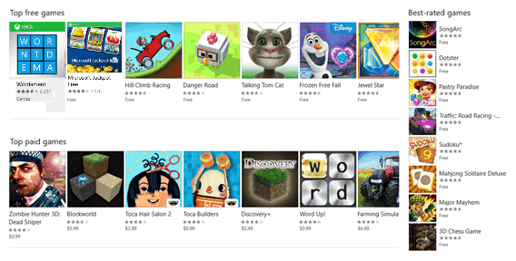

# Guía de aplicaciones para la Plataforma universal de Windows (UWP)


\[ Actualizado para aplicaciones para UWP en Windows 10. Para leer más artículos sobre Windows 8.x, consulta el [archivo](http://go.microsoft.com/fwlink/p/?linkid=619132) \]

En esta guía, descubrirás:

-   Qué es una *familia de dispositivos* y cómo se decide a qué dispositivo destinar la aplicación.
-   Nuevos controles y paneles de la interfaz de usuario que te permiten adaptarla a diferentes factores de forma del dispositivo.
-   Cómo comprender y controlar la superficie de API que está disponible para tu aplicación.

Windows 8 introdujo Windows Runtime (WinRT), una evolución del modelo de aplicaciones de Windows. Se diseñó como arquitectura de aplicación común.

Cuando se publicó Windows Phone 8.1, se adaptó Windows en tiempo de ejecución a Windows Phone 8.1 y a Windows. Esto permitió a los desarrolladores crear *aplicaciones universales para Windows 8* destinadas a Windows y a Windows Phone con un código base compartido.

Windows 10 presenta la Plataforma universal de Windows (UWP), que continúa el desarrollo del modelo de Windows Runtime y lo incorpora al núcleo unificado de Windows 10. Como parte del núcleo, UWP ahora proporciona una plataforma común de aplicaciones disponible en todos los dispositivos que se ejecutan en Windows 10. Con esta evolución, las aplicaciones destinadas a UWP no solo pueden llamar a las API de WinRT comunes a todos los dispositivos, sino también a las API (incluidas las API de Win32 y. NET) específicas de la familia de dispositivos en los que se ejecuta la aplicación. UWP proporciona un nivel de API principal garantizado en todos los dispositivos. Esto significa que puedes crear un único paquete de la aplicación para instalar en una amplia gama de dispositivos. Con ese único paquete de la aplicación, la Tienda Windows proporciona un canal de distribución unificado para llegar a todos los tipos de dispositivos en los que se puede ejecutar la aplicación.


Como la aplicación para UWP se ejecuta en una amplia variedad de dispositivos con diferentes factores de forma y modalidades de entrada, te interesa que esté adaptada a cada dispositivo y sea capaz de desbloquear las exclusivas funcionalidades de cada uno. Los dispositivos agregan sus propias API exclusivas al nivel de API garantizado. Puedes escribir código para tener acceso a estas API únicas condicionalmente, para que así tu aplicación mejore las características específicas de un tipo de dispositivo y presente una experiencia distinta en otros dispositivos. Los controles de interfaz de usuario adaptables y los nuevos paneles de diseño ayudan a adaptar la interfaz de usuario en una amplia variedad de resoluciones de pantalla.

## Familias de dispositivos


Las aplicaciones de Windows 8.1 y Windows Phone 8.1 están destinadas a un sistema operativo, ya sea Windows o Windows Phone. Con Windows 10, ya no hace falta que destines tu aplicación a un sistema operativo, sino a una o más familias de dispositivos. Una familia de dispositivos identifica las API, las características del sistema y los comportamientos que puedes esperar en todos los dispositivos de la familia. También determina el conjunto de dispositivos en los que se puede instalar la aplicación desde la Tienda. Esta es la jerarquía de familias de dispositivos.


Una familia de dispositivos es una colección de API con un nombre y un número de versión específicos. Una familia de dispositivos es la base de un sistema operativo. Los ordenadores ejecutan el sistema operativo de escritorio, basado en la familia de dispositivos de escritorio. Los teléfonos, tabletas, etc., ejecutan el sistema operativo móvil, basado en la familia de dispositivos móviles. Etcétera.

La familia de dispositivos universales es especial. No es la base directa de cualquier sistema operativo. En su lugar, el conjunto de API de la familia de dispositivos universales se hereda en familias de dispositivos secundarios. De este modo, se garantiza que las API de la familia de dispositivos universales estén presentes en todos los sistemas operativos y, por lo tanto, en todos los dispositivos.

Cada familia de dispositivos secundarios agrega sus propias API a las que hereda. El conjunto de API resultante en una familia de dispositivos secundarios tiene garantizado estar presente en el sistema operativo en el que se basa la familia y, por lo tanto, en todos los dispositivos que ejecutan ese sistema operativo.

Una de las ventajas de las familias de dispositivos es que la aplicación se puede ejecutar en cualquiera de los diversos dispositivos disponibles, o incluso en todos: desde teléfonos, tabletas y ordenadores de escritorio hasta Surface Hubs y consolas Xbox. La aplicación también puede usar código adaptable para detectar y usar dinámicamente las características de un dispositivo que están fuera de la familia de dispositivos universales.

Tú decides a qué familia (o familias) de dispositivos destinarás la aplicación. Y esa decisión afecta a la aplicación en estos aspectos importantes. Determina:

-   El conjunto de API que la aplicación puede suponer que está presente cuando se ejecuta (y que, por lo tanto, puede llamar libremente).
-   El conjunto de llamadas a API que son seguras solo dentro de instrucciones condicionales.
-   El conjunto de dispositivos en los que se puede instalar la aplicación desde la Tienda (y, por lo tanto, los factores de forma que debes tener en cuenta).

Decidir una familia de dispositivos tiene dos consecuencias principales: la superficie de API que la aplicación puede llamar incondicionalmente y el número de dispositivos a los que puede llegar la aplicación. Estos dos factores implican equilibrios y están inversamente relacionados. Por ejemplo, una aplicación para UWP es una aplicación destinada específicamente a la familia de dispositivos universales y, por lo tanto, está disponible para todos los dispositivos. Una aplicación destinada a la familia de dispositivos universales puede suponer que están presentes solo las API de esa familia (porque ese es su objetivo). La llamada a otras API debe ser condicional. Además, una aplicación de este tipo debe tener una interfaz de usuario altamente adaptable y funciones de entrada completas porque se puede ejecutar en una amplia variedad de dispositivos. Una aplicación móvil de Windows es una aplicación destinada específicamente a la familia de dispositivos móviles, que está disponible para los dispositivos con un sistema operativo basado en esa familia (que incluye teléfonos, tabletas y dispositivos similares). Una aplicación de la familia de dispositivos móviles puede suponer que están presentes todas las API de la familia de dispositivos móviles y su interfaz de usuario tiene que ser moderadamente adaptable. Una aplicación destinada a la familia de dispositivos IoT puede instalarse únicamente en dispositivos IoT y puede suponer que están presentes todas las API de esa familia. Esa aplicación puede tener una interfaz de usuario y unas funciones de entrada muy especializadas porque sabrá que se ejecutará únicamente en un determinado tipo de dispositivo.

Estas son algunas consideraciones que te ayudarán a decidir a qué familia de dispositivos destinar tu aplicación:

**Maximizar el alcance de la aplicación**

Para alcanzar el número máximo de dispositivos con la aplicación y hacer que se ejecute en todos los tipos de dispositivos que sea posible, la aplicación se destinará a la familia de dispositivos universales. Al hacerlo, la aplicación se destina automáticamente a todas las familias de dispositivos basadas en la universal (en el diagrama, todas los familias secundarias que proceden de la universal). Esto significa que la aplicación se ejecuta en todos los sistemas operativos basados en esas familias de dispositivos y en todos los dispositivos que ejecutan esos sistemas operativos. Las únicas API que tienen garantizado estar disponibles en todos los dispositivos son las del conjunto definido por la versión concreta de la familia de dispositivos universales de destino. (Con este lanzamiento, la versión es siempre 10.0.x.0). Para saber cómo una aplicación puede llamar a las API con otra versión de familia de dispositivos de destino, lee la sección "Escribir código" más adelante en este tema.

**Limitar la aplicación a un tipo de dispositivo**

Quizá no quieras que tu aplicación se ejecute en una amplia gama de dispositivos; tal vez sea específica de, por ejemplo, un ordenador de escritorio o una consola Xbox. En ese caso, puedes elegir destinar la aplicación a una de las familias de dispositivos secundarios. Por ejemplo, si el destino es la familia de dispositivos de escritorio, entre las API que tienen garantizado estar disponibles para tu aplicación se incluyen las API heredadas de la familia de dispositivos universales, además de las API que son específicas de la familia de dispositivos de escritorio.

**Limitar la aplicación a un subconjunto de todos los dispositivos posibles**

En lugar de destinar la aplicación a la familia de dispositivos universales o a una de las familias de dispositivos secundarios, puedes destinarla a dos (o más) familias de dispositivos secundarios. Quizá lo más lógico para tu aplicación sea destinarla a escritorio y dispositivos móviles. O a escritorio y Xbox. O a escritorio, Xbox y Surface Hub.

**Excluir la compatibilidad con una versión determinada de una familia de dispositivos**

En ocasiones excepcionales, tal vez quieras que tu aplicación se ejecute en cualquier dispositivo excepto en los que tengan una versión concreta de una familia de dispositivos determinada. Por ejemplo, supongamos que la aplicación esté destinada a la versión 10.0.x.0 de la familia de dispositivos universales. Cuando cambie la versión del sistema operativo en el futuro, por ejemplo, a 10.0.x.2, podrás especificar que la aplicación se ejecute en cualquier dispositivo excepto en la versión 10.0.x.1 de Xbox destinando la aplicación a las versiones 10.0.x.0 de universal y 10.0.x.1 de Xbox. Desde entonces, la aplicación no estará disponible para el conjunto de versiones de la familia de dispositivos en Xbox 10.0.x.1 (inclusive) y versiones anteriores.

De manera predeterminada, Microsoft Visual Studio especifica **Windows.Universal** como la familia de dispositivos de destino en el archivo de manifiesto del paquete de la aplicación. Para especificar la familia de dispositivos o familias de dispositivos a las que se ofrece la aplicación desde dentro de la Tienda, configura manualmente el elemento [**TargetDeviceFamily**](https://msdn.microsoft.com/library/windows/apps/dn986903) en el archivo Package.appxmanifest.

## Interfaz de usuario y entrada universal


Una aplicación para UWP se puede ejecutar en muchos tipos de dispositivos distintos con diferentes formas de entrada, resoluciones de pantalla, densidad de PPP y otras características únicas. Windows 10 proporciona nuevos controles universales, paneles de diseño y herramientas que te ayudarán a adaptar la interfaz de usuario a los dispositivos en los que se pueda ejecutar la aplicación. Por ejemplo, puedes adaptar la interfaz de usuario para aprovechar la diferencia en la resolución de pantalla cuando la aplicación se ejecuta en un ordenador de escritorio frente a un dispositivo móvil.

Algunos aspectos de la interfaz de usuario de la aplicación se adaptan automáticamente en todos los dispositivos. Algunos controles, como botones y controles deslizantes, se adaptan automáticamente a diversas familias de dispositivos y modos de entrada. Sin embargo, quizá haya que adaptar el diseño de la experiencia del usuario en la aplicación, en función del dispositivo en el que esta se ejecute. Por ejemplo, una aplicación de fotos debe adaptar la interfaz de usuario cuando se ejecute en un dispositivo de mano pequeño para garantizar que pueda usarse perfectamente con una mano. Cuando la aplicación de fotos se ejecuta en un ordenador de escritorio, debe adaptar la interfaz de usuario para aprovechar el espacio de pantalla adicional.

Windows te ayuda a destinar la interfaz de usuario a varios dispositivos con las siguientes características:

-   Los controles universales y paneles de diseño te ayudan a optimizar la interfaz de usuario para la resolución de pantalla del dispositivo.
-   El control de entrada común te permite recibir una entrada mediante funcionalidad táctil, un lápiz, un mouse, un teclado o bien un controlador, como el controlador de Microsoft Xbox.
-   Las herramientas te ayudan a diseñar una interfaz de usuario que se pueda adaptar a diferentes resoluciones de pantalla.
-   El ajuste de escala adaptable se amolda a la resolución y a las diferencias de PPP de todos los dispositivos.

### Controles universales y paneles de diseño

Windows 10 incluye controles nuevos, como la vista de calendario y la vista dividida. El control dinámico, que antes estaba disponible solo para Windows Phone, ahora también está disponible para la familia de dispositivos universales.

Los controles se han actualizado para funcionar bien en pantallas más grandes, adaptarse al número de píxeles de pantalla disponibles en el dispositivo y responder correctamente a varios tipos de entrada, como teclado, ratón, funcionalidad táctil, lápiz y controladores, como el controlador de Xbox.

Quizá descubras que tienes que adaptar el diseño de interfaz de usuario general en función de la resolución de pantalla del dispositivo en el que se ejecute la aplicación. Por ejemplo, una aplicación de comunicaciones que se ejecute en el escritorio puede incluir una imagen incrustada del autor de la llamada y controles adaptados a la entrada de mouse:


Sin embargo, cuando la aplicación se ejecuta en un teléfono, al tener que trabajar en una superficie de pantalla menor, la aplicación puede eliminar la imagen incrustada y agrandar el botón de llamada para facilitar la operación con una mano:


Para ayudarte a adaptar el diseño de interfaz de usuario general en función de la cantidad de espacio disponible en pantalla, Windows 10 presenta los paneles adaptables y los estados de diseño.

### Diseño de interfaz de usuario adaptable con paneles adaptables

Los paneles de diseño proporcionan tamaños y posiciones a sus elementos secundarios, en función del espacio disponible. Por ejemplo, [**StackPanel**](https://msdn.microsoft.com/library/windows/apps/br209635) ordena sus elementos secundarios en una secuencia (horizontal o verticalmente). [
              **Grid**
            ](https://msdn.microsoft.com/library/windows/apps/br242704) es como una cuadrícula CSS que coloca sus elementos secundarios en celdas.

El nuevo [**RelativePanel**](https://msdn.microsoft.com/library/windows/apps/dn879546) implementa un estilo de diseño definido por las relaciones entre sus elementos secundarios. Está destinado a crear diseños de aplicaciones que puedan adaptarse a los cambios en la resolución de pantalla. El **RelativePanel** simplifica el proceso de reorganizar los elementos definiendo relaciones entre ellos, lo que te permite crear una interfaz de usuario más dinámica sin usar diseños anidados.

En el siguiente ejemplo, **blueButton** aparecerá a la derecha de **textBox1** independientemente de los cambios en la orientación o el diseño, y **orangeButton** aparecerá inmediatamente debajo de **blueButton** y alineado con él, incluso si cambia el ancho de **textBox1** a medida que se escribe texto en él. Anteriormente habría necesitado filas y columnas en una **Grid** para lograr este efecto, pero ahora puede hacerse con mucho menos marcado.


```XML
<RelativePanel>
    <TextBox x:Name="textBox1" Text="textbox" Margin="5"/>
    <Button x:Name="blueButton" Margin="5" Background="LightBlue" Content="ButtonRight" RelativePanel.RightOf="textBox1"/>
    <Button x:Name="orangeButton" Margin="5" Background="Orange" Content="ButtonBelow" RelativePanel.RightOf="textBox1" RelativePanel.Below="blueButton"/>
</RelativePanel>
```

### Usar desencadenadores de estado visual para crear una interfaz de usuario que se pueda adaptar al espacio disponible en pantalla

Tu interfaz de usuario quizá tenga que adaptarse a los cambios de tamaño de ventana. Los estados visuales adaptables te permiten cambiar el estado visual en respuesta a cambios en el tamaño de la ventana.

La función StateTriggers define un umbral para activar un estado visual que establece las propiedades de diseño según el tamaño de ventana que desencadenó el cambio de estado.

En el siguiente ejemplo, cuando el tamaño de ventana es de 720 píxeles o más ancho, se desencadena el estado visual llamado **wideView**, que organiza el panel **Juegos mejor valorados** para que aparezca a la derecha del panel **Principales juegos gratuitos**, alineado con su parte superior.



Cuando la ventana es menor que 720 píxeles, se desencadena el estado visual **narrowView** porque ya no se cumplen las condiciones del desencadenador **wideView** y, por lo tanto, este ya no está en vigor. El estado visual **narrowView** coloca el panel **Juegos mejor valorados** debajo del panel **Principales juegos de pago**, alineado con su lado izquierdo:


Este es el código XAML de los desencadenadores de estado visual descritos anteriormente. La definición de los paneles, referida a continuación con "`...`", se ha quitado por razones de brevedad.

```XML
<Grid Background="{ThemeResource ApplicationPageBackgroundThemeBrush}">
    <VisualStateManager.VisualStateGroups>
        <VisualStateGroup>
            <VisualState x:Name="wideView">
                <VisualState.StateTriggers>
                    <AdaptiveTrigger MinWindowWidth="720" />
                </VisualState.StateTriggers>
                <VisualState.Setters>
                    <Setter Target="best.(RelativePanel.RightOf)" Value="free"/>
                    <Setter Target="best.(RelativePanel.AlignTopWidth)" Value="free"/>
                </VisualState.Setters>
            </VisualState>
            <VisualState x:Name="narrowView">
                <VisualState.Setters>
                    <Setter Target="best.(RelativePanel.Below)" Value="paid"/>
                    <Setter Target="best.(RelativePanel.AlignLeftWithPanel)" Value="true"/>
                </VisualState.Setters>
                <VisualState.StateTriggers>
                    <AdaptiveTrigger MinWindowWidth="0" />
                </VisualState.StateTriggers>
            </VisualState>
        </VisualStateGroup>
    </VisualStateManager.VisualStateGroups>
    ...
</Grid>
```

### Herramientas

De manera predeterminada, probablemente querrás destinar tu aplicación a la familia de dispositivos más amplia posible. Cuando estés listo para ver la apariencia y el diseño de tu aplicación en un dispositivo determinado, usa la barra de herramientas de vista previa del dispositivo de Visual Studio para obtener una vista previa de la interfaz de usuario en un dispositivo móvil de tamaño pequeño y mediano, en un ordenador de escritorio o en una pantalla de televisión grande. De esta forma puedes personalizar y probar los estados visuales adaptables:


No tienes que tomar una decisión desde el principio sobre todos los tipos de dispositivos compatibles. Puedes agregar un tamaño de dispositivo adicional al proyecto más adelante.

### Ajuste de escala adaptable

Windows 10 presenta una evolución del modelo de ajuste de escala existente. Además del contenido del vector de escala, hay un conjunto unificado de factores de escala que proporciona un tamaño coherente para los elementos de interfaz de usuario en diversos tamaños y resoluciones de pantalla. Los factores de escala también son compatibles con los factores de escala de otros sistemas operativos, como iOS y Android. Esto hace que sea más fácil compartir activos entre estas plataformas.

La Tienda elige los recursos para descargar en parte según los valores de PPP del dispositivo. Solo se descargan los recursos que se ajusten mejor al dispositivo.

### Control de entrada común

Puedes crear una aplicación universal de Windows con controles universales que administran varias entradas, como ratón, teclado, funcionalidad táctil, lápiz y controlador (por ejemplo, el controlador de Xbox). Tradicionalmente, la entrada manuscrita se ha asociado solo con la entrada de lápiz, pero con Windows 10 puedes realizar la entrada manuscrita con la funcionalidad táctil (en algunos dispositivos) y con cualquier entrada de puntero. La entrada manuscrita se admite en muchos dispositivos (incluidos los dispositivos móviles) y se puede integrar fácilmente con tan solo unas líneas de código.

Las siguientes API ofrecen acceso a la entrada:

-   [
              **CoreIndependentInputSource**
            ](https://msdn.microsoft.com/library/windows/apps/dn298460) es una nueva API que le permite consumir entrada sin procesar en el subproceso principal o en un subproceso en segundo plano.
-   [
              **PointerPoint**
            ](https://msdn.microsoft.com/library/windows/apps/br242038) unifica los datos sin procesar de la entrada táctil, de mouse y de lápiz en un conjunto único y coherente de interfaces y eventos que se pueden consumir en el subproceso principal o en un subproceso en segundo plano mediante **CoreInput.**
-   [
              **PointerDevice**
            ](https://msdn.microsoft.com/library/windows/apps/br225633) es una API de dispositivo que permite consultar las capacidades del dispositivo para determinar qué modalidades de entrada están disponibles en el dispositivo.
-   El nuevo control XAML [**InkCanvas**](https://msdn.microsoft.com/library/windows/apps/dn858535) y [**InkPresenter**](https://msdn.microsoft.com/library/windows/apps/dn922011) y las API de Windows Runtime te permiten tener acceso a los datos de trazo de lápiz.

## Escribir código


Entre las opciones de lenguaje de programación para tu [proyecto de Windows 10 en Visual Studio](https://msdn.microsoft.com/en-us/library/windows/apps/dn609832.aspx#target_win10) se incluyen Visual C++, C#, Visual Basic y JavaScript. Con Visual C++, C# y Visual Basic, puedes usar XAML para obtener una experiencia de interfaz de usuario nativa con fidelidad total. Con Visual C++, puedes dibujar con DirectX en lugar de XAML, o usar ambos. Con JavaScript, la capa de presentación será HTML, y HTML es, por supuesto, un estándar web multiplataforma. Gran parte del código y de la interfaz de usuario será universal y se ejecutará del mismo modo en cualquier dispositivo. Pero para adaptar el código a familias de dispositivos determinadas y la interfaz de usuario a factores de forma concretos, tendrás la opción de usar código adaptable y una interfaz de usuario adaptable. Veamos los distintos casos.

**Llamar a una API que implementa la familia de dispositivos de destino**

Siempre que quieras llamar a una API, debes saber si la implementa la familia de dispositivos a la que está destinada la aplicación. En caso de duda, puedes buscarla en la documentación de referencia de API. Si abres el tema relevante y buscas la sección Requisitos, verás cuál es la familia del dispositivo de implementación. Supongamos que tu aplicación está destinada a la versión 10.0.x.0 de la familia de dispositivos universales y quieres llamar a los miembros de la clase [**Windows.UI.Core.SystemNavigationManager**](https://msdn.microsoft.com/library/windows/apps/dn893595). En este ejemplo, la familia de dispositivos es "Universal". Se recomienda que confirmes que tu aplicación también está destinada a los miembros de la clase que quieres llamar; en este caso, lo está. Así que, en este ejemplo, ahora sabes que las API tienen garantizado estar presentes en todos los dispositivos en los que puede instalarse la aplicación y que puedes llamar a las API en el código como lo harías normalmente.

```csharp
    Windows.UI.Core.SystemNavigationManager.GetForCurrentView().BackRequested += TestView_BackRequested;
```

Otro ejemplo: supongamos que tu aplicación está destinada a la versión 10.0.x.0 de la familia de dispositivos de Xbox y el tema de referencia sobre una API que quieres llamar dice que la API se presentó en la versión 10.0.x.0 de la familia de dispositivos de Xbox. De nuevo, en ese caso, la API tiene garantizado estar presente en todos los dispositivos en los que puede instalarse la aplicación. Por lo tanto, podrás llamar a esa API en el código del modo normal.

Ten en cuenta que IntelliSense de Visual Studio no reconocerá las API a menos que las implemente la familia de dispositivos de destino de la aplicación o cualquier SDK de extensión al que hayas hecho referencia. Por lo tanto, si aún no has hecho referencia a ningún SDK de extensión, puedes asegurarte de que cualquiera de las API que aparezcan en IntelliSense esté en la familia de dispositivos de destino y pueda llamarse libremente.

**Llamar a una API que NO implementa la familia de dispositivos de destino**

Habrá casos en los que quieras llamar a una API, pero no aparezca en la documentación de la familia de dispositivos de destino. En ese caso, puedes optar por escribir código adaptable para llamar a esa API.

**Escribir código adaptable con la clase ApiInformation**

El código adaptable se escribe en dos pasos. El primer paso es hacer que las API a las que quieras tener acceso estén disponibles para el proyecto. Para ello, agrega una referencia para el SDK de extensión que representa la familia de dispositivos que posee las API que quieres llamar condicionalmente. Consulta [SDK de extensión](../porting/w8x-to-uwp-porting-to-a-uwp-project.md#extension-sdks).

El segundo paso es usar la clase [**Windows.Foundation.Metadata.ApiInformation**](https://msdn.microsoft.com/library/windows/apps/dn949001) en una condición del código para probar la presencia de la API que quieras llamar. Esta condición se evaluará donde se ejecute la aplicación, pero solo se evaluará en true en los dispositivos en los que la API esté presente y, por lo tanto, disponible para llamadas.

Si quieres llamar solo a una pequeña cantidad de API, puedes usar el método [**ApiInformation.IsTypePresent**](https://msdn.microsoft.com/library/windows/apps/dn949016) de esta manera.

```csharp
    // Note: Cache the value instead of querying it more than once.
    bool isHardwareButtonsAPIPresent =
        Windows.Foundation.Metadata.ApiInformation.IsTypePresent("Windows.Phone.UI.Input.HardwareButtons");

    if (isHardwareButtonsAPIPresent)
    {
        Windows.Phone.UI.Input.HardwareButtons.CameraPressed +=
            HardwareButtons_CameraPressed;
    }
```

En este caso, sabemos que la presencia de la clase [**HardwareButtons**](https://msdn.microsoft.com/library/windows/apps/jj207557) implica la presencia del evento [**CameraPressed**](https://msdn.microsoft.com/library/windows/apps/dn653805) porque la clase y el miembro tienen la misma información sobre requisitos. Pero con el tiempo se agregarán miembros nuevos a las clases ya introducidas y esos miembros tendrán números de versión "presentada" posteriores. En esos casos, en lugar de usar **IsTypePresent**, puedes probar la presencia de miembros individuales con **IsEventPresent**, **IsMethodPresent**, **IsPropertyPresent** y métodos similares. A continuación te mostramos un ejemplo.

```csharp
    bool isHardwareButtons_CameraPressedAPIPresent =
        Windows.Foundation.Metadata.ApiInformation.IsEventPresent
            ("Windows.Phone.UI.Input.HardwareButtons", "CameraPressed");
```

El conjunto de API de una familia de dispositivos se desglosa en subdivisiones, conocidas como contratos de API. Puedes usar el método **ApiInformation.IsApiContractPresent** para probar la presencia de un contrato de API. Esto es útil si quieres probar la presencia de un gran número de API que estén en la misma versión de un contrato de API.

```csharp
    bool isWindows_Devices_Scanners_ScannerDeviceContract_1_0Present =
        Windows.Foundation.Metadata.ApiInformation.IsApiContractPresent
            ("Windows.Devices.Scanners.ScannerDeviceContract", 1, 0);
```

**API de Win32 en UWP**

Una aplicación para UWP o un componente de Windows en tiempo de ejecución escritos en C++/CX tienen acceso a las API de Win32 que forman parte de UWP. Todas las familias de dispositivos de Windows 10 implementan estas API de Win32. Vincular tu aplicación con Windowsapp.lib. Windowsapp.lib es un biblioteca "paraguas" que proporciona las exportaciones de las API de UWP. Al vincular Windowsapp.lib a tu aplicación se agregarán dependencias a archivos DLL presentes en todas las familias de dispositivos de Windows 10.

Para obtener la lista completa de las API de Win32 disponibles para las aplicaciones para UWP, consulta [API Sets for UWP apps (Conjuntos de API para aplicaciones para UWP)](https://msdn.microsoft.com/library/windows/desktop/mt186421) y [Dlls for UWP apps (DLLs para aplicaciones para UWP)](https://msdn.microsoft.com/library/windows/desktop/mt186422).

## Experiencia de usuario


Una aplicación universal de Windows te permite aprovechar las exclusivas funcionalidades del dispositivo en el que se ejecuta. La aplicación puede usar toda la potencia de un dispositivo de escritorio, la interacción natural de la manipulación directa de una tableta (incluida la entrada táctil y de lápiz), la portabilidad y la comodidad de los dispositivos móviles y la capacidad de colaboración de [Surface Hub](http://go.microsoft.com/fwlink/?LinkId=526365).

Un buen [diseño](http://go.microsoft.com/fwlink/?LinkId=258848) consiste en decidir cómo interactuarán los usuarios con tu aplicación, qué aspecto tendrá y cómo funcionará. La experiencia del usuario tiene un papel clave a la hora de determinar la satisfacción de los usuarios con tu aplicación, así que no ahorres esfuerzos en este paso. La sección [Conceptos básicos de diseño](https://dev.windows.com/en-us/design) es una introducción al diseño de aplicaciones universales de Windows. Consulta [Introducción a las aplicaciones de la Plataforma universal de Windows (UWP) para diseñadores](https://msdn.microsoft.com/library/windows/apps/dn958439) para obtener información sobre cómo diseñar aplicaciones para UWP que encandilen a los usuarios. Antes de empezar a escribir código, consulta la [Información básica de dispositivos](../input-and-devices/device-primer.md) , que te ayudará a reflexionar sobre la experiencia de interacción que ofrecerá la aplicación en los diferentes factores de forma a los que quieras destinarla.


Además de la interacción en diferentes dispositivos, [planea la aplicación](https://msdn.microsoft.com/library/windows/apps/hh465427) para incorporar las ventajas de trabajar en varios dispositivos. Por ejemplo:

-   Usa [servicios en la nube](http://go.microsoft.com/fwlink/?LinkId=526377) para sincronizarla entre dispositivos. Aprende a [conectarte a servicios web](https://msdn.microsoft.com/library/windows/apps/xaml/hh761504) para mejorar la experiencia con la aplicación.

-   Piensa de qué forma puedes ayudar a los usuarios a cambiar de dispositivo y seguir con la aplicación en el punto en el que la dejaron. Incluye [notificaciones](https://msdn.microsoft.com/library/windows/apps/mt187203) y [compras desde la aplicación](https://msdn.microsoft.com/library/windows/apps/mt219684) en tu planeación. Estas características deberían funcionar en todos los dispositivos.

-   Diseña el flujo de trabajo con [Conceptos básicos de diseño de la navegación para aplicaciones para UWP](https://msdn.microsoft.com/library/windows/apps/dn958438) para integrar dispositivos móviles, de pantalla pequeña y de pantalla grande. [Diseña la interfaz de usuario](https://msdn.microsoft.com/library/windows/apps/dn958435) para responder a diferentes tamaños de pantalla y resoluciones.

-   Determina si hay características de la aplicación que no tienen sentido en una pantalla pequeña de móvil. También puede haber áreas que no tengan sentido en un ordenador de escritorio fijo y solo destaquen en un dispositivo móvil. Por ejemplo, la mayoría de los escenarios sobre [ubicación](https://msdn.microsoft.com/library/windows/apps/mt219698) implica un dispositivo móvil.

-   Determina cómo integrar varias modalidades de entrada. Consulta las [Directrices sobre interacciones](https://msdn.microsoft.com/library/windows/apps/dn611861) para conocer cómo pueden interactuar los usuarios con la aplicación usando [Cortana](https://msdn.microsoft.com/library/windows/apps/dn974233), [voz](https://msdn.microsoft.com/library/windows/apps/dn596121), [interacciones táctiles](https://msdn.microsoft.com/library/windows/apps/hh465370), el [teclado táctil](https://msdn.microsoft.com/library/windows/apps/hh972345) y mucho más.

    Consulta las [Directrices sobre texto y entrada de texto](https://msdn.microsoft.com/library/windows/apps/dn611864) para conocer las experiencias de interacción más tradicionales.

## Enviar una aplicación universal de Windows mediante el panel


El nuevo panel unificado del Centro de desarrollo de Windows te permite administrar y enviar todas las aplicaciones para dispositivos Windows en un solo lugar. Las nuevas funciones simplifican los procesos y te dan más control. También encontrarás [informes analíticos](https://msdn.microsoft.com/library/windows/apps/mt148522) detallados combinados con [detalles de pago](https://msdn.microsoft.com/library/windows/apps/dn986925), formas de [promocionar la aplicación y atraer a los clientes](https://msdn.microsoft.com/library/windows/apps/mt148526) y mucho más.

Consulta [Usar el panel unificado del Centro de desarrollo de Windows](../publish/using-the-windows-dev-center-dashboard.md) para aprender a enviar tus aplicaciones para publicarlas en la Tienda Windows.

 

 


<!--HONumber=May16_HO2-->


