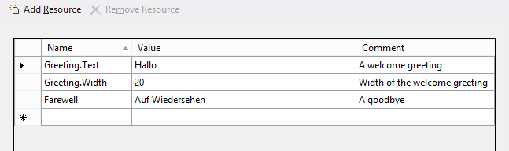

# Colocar las cadenas de la interfaz de usuario en recursos


**API importantes**

-   [**ApplicationModel.Resources.ResourceLoader**](https://msdn.microsoft.com/library/windows/apps/br206014)
-   [**WinJS.Resources.processAll**](https://msdn.microsoft.com/library/windows/apps/br211864)

Coloca los recursos de cadena de la interfaz de usuario en archivos de recursos. Así, podrás hacer referencia a dichas cadenas desde el código o marcado.

Este tema muestra los pasos para agregar varios recursos de cadena de idioma a tu aplicación universal de Windows y cómo probarlos brevemente.

## <span id="put_strings_into_resource_files__instead_of_putting_them_directly_in_code_or_markup."></span><span id="PUT_STRINGS_INTO_RESOURCE_FILES__INSTEAD_OF_PUTTING_THEM_DIRECTLY_IN_CODE_OR_MARKUP."></span>Coloca las cadenas en archivos de recursos en lugar de ponerlas directamente en el código o la revisión.


1.  Abre la solución (o crea una nueva) en Visual Studio.

2.  Abre package.appxmanifest en Visual Studio, ve a la pestaña **Aplicación** y (para este ejemplo) establece el idioma predeterminado en "en-US". Si hay varios archivos package.appxmanifest en la solución, haz lo siguiente para cada uno.
    <br>**Nota** De este modo, se especifica el idioma predeterminado del proyecto. Los recursos de idioma predeterminado se usan cuando los idiomas de visualización o el idioma preferido del usuario no coinciden con los recursos de idioma indicados en la aplicación.
3.  Crea una carpeta que contenga los archivos de recursos.
    1.  En el Explorador de soluciones, haz clic con el botón derecho en el proyecto (el proyecto compartido si la solución contiene varios proyectos) y selecciona **Agregar**&gt;**Nueva carpeta**.
    2.  Asigna el nombre "Strings" a la nueva carpeta.
    3.  Si no se ve la nueva carpeta en el Explorador de soluciones, selecciona **Proyecto**&gt;**Mostrar todos los archivos** en el menú de Microsoft Visual Studio con el proyecto seleccionado.

4.  Crea una subcarpeta y un archivo de recursos para inglés (Estados Unidos).
    1.  Haz clic con el botón derecho en la carpeta Strings y agrega una nueva carpeta debajo. Asígnale el nombre "en-US". El archivo de recursos debe colocarse en una carpeta a la que se ha asignado un nombre para la etiqueta de idioma [BCP-47](http://go.microsoft.com/fwlink/p/?linkid=227302). Consulta [Cómo asignar nombre a los recursos mediante calificadores](https://msdn.microsoft.com/library/windows/apps/xaml/hh965324) para obtener información detallada sobre el calificador de idioma y ver una lista de etiquetas de idioma comunes.
    2.  Haz clic con el botón derecho en la carpeta en-US y selecciona **Agregar**&gt;**Nuevo elemento**.
    3.  **XAML:** selecciona "Archivo de recursos (.resw)".
        <br>**HTML:** selecciona "Archivo de recursos (.resjson)".

    4.  Haz clic en **Agregar**. Se agrega un archivo de recursos con el nombre predeterminado "Resources.resw" (para **XAML**) o "resources.rejson" (para **HTML**). Te recomendamos que uses este nombre de archivo predeterminado. Las aplicaciones pueden particionar sus recursos en otros archivos, pero debes asegurarte de hacer referencia a estos correctamente (consulta el tema [Cómo cargar recursos de cadenas](https://msdn.microsoft.com/library/windows/apps/xaml/hh965323)).
    5.  **Solo XAML:** si tienes archivos .resx únicamente con recursos de cadena de proyectos de .NET anteriores, selecciona **Agregar**&gt;**Elemento existente**, agrega el archivo .resx y cambia el nombre del archivo a .resw.
    6.  Abre el archivo y usa el editor para agregar estos recursos:

        **XAML:**

        Strings/en-US/Resources.resw  En este ejemplo, "Greeting.Text" y "Farewell" señalan las cadenas que se mostrarán. "Greeting.Width" es la propiedad Width de la cadena "Greeting". Los comentarios constituyen un buen lugar donde proporcionar instrucciones especiales a los traductores que localizan las cadenas a otros idiomas.

        **HTML:**

        El nuevo archivo incluye contenido predeterminado. Sustituye el contenido por lo siguiente (que puede ser parecido al contenido predeterminado):

        Strings/en-US/resources.resjson

        ```        json
        {
                "greeting"              : "Hello",
                "_greeting.comment"     : "A welcome greeting",

                "farewell"              : "Goodbye",
                "_farewell.comment"     : "A goodbye"
        }
        ```

        Esto es sintaxis estricta de notación de objetos JavaScript (JSON), en la que debe colocarse una coma después de cada par nombre/valor, excepto en el último caso. En este ejemplo, "greeting" y "farewell" identifican las cadenas que se van a mostrar. El resto de los pares ("\_greeting.comment" y "\_farewell.comment") son comentarios que describen las cadenas. Los comentarios constituyen un buen lugar donde proporcionar instrucciones especiales a los traductores que localizan las cadenas a otros idiomas.

## <span id="associate_controls_to_resources."></span><span id="ASSOCIATE_CONTROLS_TO_RESOURCES."></span>Asocia controles a los recursos.


**Solo XAML:**

Tienes que asociar cada control que necesita texto localizado con el archivo .resw. Haces esto usando el atributo **x:Uid** en todos tus elementos XAML de la siguiente manera:

```XML
<TextBlock x:Uid="Greeting" Text="" />
```

Para el nombre de recurso, proporcionas el valor del atributo **Uid**, además de especificar qué propiedad obtendrá la cadena traducida (en este caso, la propiedad Text). Puedes especificar otros valores o propiedades para diferentes idiomas, como Greeting.Width, pero ten cuidado con las propiedades relacionadas con el diseño de este tipo. Debes tratar de permitir que los controles se distribuyan dinámicamente según la pantalla del dispositivo.

Ten en cuenta que las propiedades adjuntadas se controlan de manera diferente en los archivos resw como AutomationPeer.Name. Tienes que escribir el espacio de nombres explícitamente de la siguiente manera:

```XML
MediumButton.[using:Windows.UI.Xaml.Automation]AutomationProperties.Name</code></pre></td>
```

## <span id="add_string_resource_identifiers_to_code_and_markup."></span><span id="ADD_STRING_RESOURCE_IDENTIFIERS_TO_CODE_AND_MARKUP."></span>Agrega identificadores de recursos de cadena al código y al marcado.


**XAML:**

En tu código, puedes hacer referencia de forma dinámica a las cadenas:

**C#**
```CSharp
var loader = new Windows.ApplicationModel.Resources.ResourceLoader();
var str = loader.GetString("Farewell");
```

**C++**
```cpp
auto loader = ref new Windows::ApplicationModel::Resources::ResourceLoader();
auto str = loader->GetString("Farewell");
```

**HTML:**

1.  Agrega al archivo HTML algunas referencias a la Biblioteca de Windows para JavaScript, si aún no las contiene.

    **Nota** El siguiente código muestra el texto HTML del archivo default.html del proyecto de Windows que se genera cuando creas un nuevo proyecto **Aplicación vacía (Windows universal)** de JavaScript en Visual Studio. Ten en cuenta que el archivo ya contiene referencias a WinJS.

    ```    HTML
    <!-- WinJS references -->
    <link href="WinJS/css/ui-dark.css" rel="stylesheet" />
    <script src="WinJS/js/base.js"></script>
    <script src="WinJS/js/ui.js"></script>
    ```

2.  En el código JavaScript que acompaña a tu archivo HTML, llama a la función [**WinJS.Resources.processAll**](https://msdn.microsoft.com/library/windows/apps/br211864) cuando el HTML esté cargado.

    ```    JavaScript
    WinJS.Application.onloaded = function(){
        WinJS.Resources.processAll();
    }
    ```
    
    Si se carga HTML adicional a un objeto [**WinJS.UI.Pages.PageControl**](https://msdn.microsoft.com/library/windows/apps/jj126158), llama a [**WinJS.Resources.processAll**](https://msdn.microsoft.com/library/windows/apps/br211864)(*elemento*) en el método [**IPageControlMembers.ready**](https://msdn.microsoft.com/library/windows/apps/hh770590) del control de la página, donde *element* es el elemento HTML (y sus elementos secundarios) que se está cargando. Este ejemplo se basa en el escenario 6 de la [muestra de recursos de la aplicación y localización](http://go.microsoft.com/fwlink/p/?linkid=227301):

    ```    JavaScript
    var output;
    
    var page = WinJS.UI.Pages.define("/html/scenario6.html", {
        ready: function (element, options) {
            output = element.querySelector('#output');
            WinJS.Resources.processAll(output); // Refetch string resources
            WinJS.Resources.addEventListener("contextchanged", refresh, false);
        }
        unload: function () { 
            WinJS.Resources.removeEventListener("contextchanged", refresh, false); 
        } 
    });
    ```

3.  En el HTML, haz referencia a los recursos de cadena con los identificadores de recursos ('greeting' y 'farewell') desde los archivos de recursos.
    ```    HTML
    <h2><span data-win-res="{textContent: 'greeting';}"></span></h2>
    <h2><span data-win-res="{textContent: 'farewell'}"></span></h2>
    ```

4.  Consulta los recursos de cadena para ver los atributos.

    ```    HTML
    <div data-win-res="{attributes: {'aria-label'; : 'String1'}}" >
    ```

    El patrón general del atributo data-win-res para la sustitución de HTML es data-win-res = "{*propertyname1*: '*resouce ID*', *propertyname2*: '*resource ID2*'}".

    **Nota** Si la cadena no contiene ningún marcado, enlaza el recurso siempre que sea posible a la propiedad textContent en lugar de innerHTML. La propiedad textContent puede reemplazarse con más rapidez que innerHTML.

5.  Consulta los recursos de cadena en JavaScript.
    <span codelanguage="JavaScript"></span>
    ```    JavaScript
    var el = element.querySelector('#header');
    var res = WinJS.Resources.getString('greeting');
    el.textContent = res.value;
    el.setAttribute('lang', res.lang);
    ```

## <span id="add_folders_and_resource_files_for_two_additional_languages."></span><span id="ADD_FOLDERS_AND_RESOURCE_FILES_FOR_TWO_ADDITIONAL_LANGUAGES."></span>Agrega carpetas y archivos de recursos para dos idiomas adicionales.


1.  Agrega otra carpeta debajo de la carpeta Cadenas para alemán. Asigna el nombre "de-DE" a la carpeta de alemán (Alemania).
2.  Crea otro archivo de recursos en la carpeta de-DE y agrega lo siguiente:

    **XAML:**

    strings/de-DE/Resources.resw

    

    **HTML:**

    strings/de-DE/resources.resjson

    ```    json
    {
        "greeting"              : "Hallo",
        "_greeting.comment"     : "A welcome greeting.",

        "farewell"              : "Auf Wiedersehen",
        "_farewell.comment"     : "A goodbye."
    }
    ```

3.  Crea una carpeta más llamada "fr-FR" para francés (Francia). Crea un nuevo archivo de recursos y agrega lo siguiente:

    **XAML:**

    strings/fr-FR/Resources.resw 
    **HTML:**

    strings/fr-FR/resources.resjson

    ```    json
    {
        "greeting"              : "Bonjour",
        "_greeting.comment"     : "A welcome greeting.",

        "farewell"              : "Au revoir",
        "_farewell.comment"     : "A goodbye."
    }
    ```

## <span id="build_and_run_the_app."></span><span id="BUILD_AND_RUN_THE_APP."></span>Compila y ejecuta la aplicación.


Prueba la aplicación con el idioma para mostrar predeterminado.

1.  Presiona F5 para compilar y ejecutar la aplicación.
2.  Ten en cuenta que los saludos de bienvenida y despedida (greeting y farewell) se muestran en el idioma preferido del usuario.
3.  Sal de la aplicación.

Prueba la aplicación con otros idiomas.

1.  Abre **Configuración** en el dispositivo.
2.  Selecciona **Hora e idioma**.
3.  Selecciona **Región e idioma** (o en un teléfono o emulador de teléfono, **Idioma**).
4.  Ten en cuenta que el idioma que se mostró al ejecutar la aplicación es el idioma que está más arriba en la lista, es decir, inglés, alemán o francés. Si tu idioma de nivel superior no es ninguno de estos tres, la aplicación retrocede al siguiente de la lista que admita la aplicación.
5.  Si no tienes ninguno de estos tres idiomas en la máquina, agrega a la lista los que falten haciendo clic en **Agregar un idioma**.
6.  Para probar la aplicación con otro idioma, selecciona el idioma en la lista y haz clic en **Establecer como predeterminado** (o en un teléfono o emulador de teléfono, mantén pulsado el idioma en la lista y, a continuación, pulsa **Subir** hasta que esté en la parte superior). Después ejecuta la aplicación.

## <span id="related_topics"></span>Temas relacionados


* [Cómo asignar un nombre a los recursos mediante calificadores](https://msdn.microsoft.com/library/windows/apps/xaml/hh965324)
* [Cómo cargar recursos de cadenas](https://msdn.microsoft.com/library/windows/apps/xaml/hh965323)
* [La etiqueta de idioma BCP-47](http://go.microsoft.com/fwlink/p/?linkid=227302)
 

 


<!--HONumber=Jun16_HO4-->


