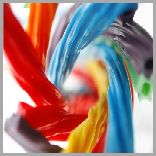

# <a name="composition-brushes"></a>Pinceles de composición

\[ Actualizado para aplicaciones para UWP en Windows 10. Para leer más artículos sobre Windows 8.x, consulta el [archivo](http://go.microsoft.com/fwlink/p/?linkid=619132) \]

Un pincel pinta el área de un objeto [**Visual**](https://msdn.microsoft.com/library/windows/apps/Dn706858) con su salida. Distintos pinceles tienen tipos de salida diferentes. La API de composición proporciona tres tipos de pincel:

-   [**CompositionColorBrush**](https://msdn.microsoft.com/library/windows/apps/Mt589399) pinta un elemento visual con un color sólido.
-   [**CompositionSurfaceBrush**](https://msdn.microsoft.com/library/windows/apps/Mt589415) pinta un elemento visual con el contenido de una superficie de composición.
-   [**CompositionEffectBrush**](https://msdn.microsoft.com/library/windows/apps/Mt589406) pinta un elemento visual con el contenido de un efecto de composición.

Todos los pinceles heredan del objeto [**CompositionBrush**](https://msdn.microsoft.com/library/windows/apps/Mt589398). Los crea directa o indirectamente el objeto [**Compositor**](https://msdn.microsoft.com/library/windows/apps/Dn706789) y son recursos independientes del dispositivo. Aunque los pinceles son independientes del dispositivo, los objetos [**CompositionSurfaceBrush**](https://msdn.microsoft.com/library/windows/apps/Mt589415) y [**CompositionEffectBrush**](https://msdn.microsoft.com/library/windows/apps/Mt589406) pintan un objeto [**Visual**](https://msdn.microsoft.com/library/windows/apps/Dn706858) con contenido de una superficie de composición que depende del dispositivo.

-   [Requisitos previos](./composition-brushes.md#prerequisites)
-   [Conceptos básicos de color](./composition-brushes.md#color-basics)
    -   [Modos alfa](./composition-brushes.md#alpha-modes)
-   [Usar un pincel de color](./composition-brushes.md#using-color-brush)
-   [Usar el pincel de superficie](./composition-brushes.md#using-surface-brush)
-   [Configurar los objetos Stretch y Alignment](./composition-brushes.md#configuring-stretch-and-alignment)

## <a name="prerequisites"></a>Requisitos previos

En esta introducción se supone que estás familiarizado con la estructura de una aplicación de composición básica, tal como se describe en [Interfaz de usuario de composición](visual-layer.md).

## <a name="color-basics"></a>Conceptos básicos de color

Antes de dibujar con un objeto [**CompositionColorBrush**](https://msdn.microsoft.com/library/windows/apps/Mt589399), tienes que elegir los colores. La API de composición usa la estructura de Windows Runtime, Color, para representar un color. La estructura Color usa la codificación sRGB. La codificación sRGB divide los colores en cuatro canales: alfa, rojo, verde y azul. Cada componente se representa mediante un valor de punto flotante con un intervalo normal de 0,0 a 1,0. Un valor de 0,0 indica la ausencia completa de ese color, mientras que un valor de 1,0 indica que el color está completamente presente. Para el componente alfa, 0,0 representa un color completamente transparente y 1,0 representa un color totalmente opaco.

### <a name="alpha-modes"></a>Modos alfa

Los valores de color de [**CompositionColorBrush**](https://msdn.microsoft.com/library/windows/apps/Mt589399) siempre se interpretan como alfa convencional.

## <a name="using-color-brush"></a>Usar un pincel de color

Para crear un pincel de color, llama al método Compositor.[**CreateColorBrush**](https://msdn.microsoft.com/library/windows/apps/windows.ui.composition.compositor.createcolorbrush.aspx), que devuelve un objeto [**CompositionColorBrush**](https://msdn.microsoft.com/library/windows/apps/Mt589399). El color predeterminado de **CompositionColorBrush** es \#00000000. En la siguiente ilustración y código se muestra un pequeño árbol visual para crear un rectángulo que se traza en un pincel de color negro y se dibuja con un pincel de color sólido con el valor de color 0x9ACD32.


```cs
Compositor _compositor;
ContainerVisual _container;
SpriteVisual visual1, visual2;
CompositionColorBrush _blackBrush, _greenBrush; 

_compositor = new Compositor();
_container = _compositor.CreateContainerVisual();

_blackBrush = _compositor.CreateColorBrush(Colors.Black);
visual1 = _compositor.CreateSpriteVisual();
visual1.Brush = _blackBrush;
visual1.Size = new Vector2(156, 156);
visual1.Offset = new Vector3(0, 0, 0);

_ greenBrush = _compositor.CreateColorBrush(Color.FromArgb(0xff, 0x9A, 0xCD, 0x32));
Visual2 = _compositor.CreateSpriteVisual();
Visual2.Brush = _greenBrush;
Visual2.Size = new Vector2(150, 150);
Visual2.Offset = new Vector3(3, 3, 0);
```

A diferencia de otros pinceles, crear un objeto [**CompositionColorBrush**](https://msdn.microsoft.com/library/windows/apps/Mt589399) es una operación relativamente económica. Puedes crear objetos **CompositionColorBrush** cada vez que representes contenido, con poco o ningún impacto en el rendimiento.

## <a name="using-surface-brush"></a>Usar el pincel de superficie

Un objeto [**CompositionSurfaceBrush**](https://msdn.microsoft.com/library/windows/apps/Mt589415) pinta un elemento visual con una superficie de composición (representada por un objeto [**ICompositionSurface**](https://msdn.microsoft.com/library/windows/apps/Dn706819)). En la siguiente ilustración se muestra un cuadrado visual pintado con un mapa de bits de color orozuz representado en un objeto **ICompositionSurface** con D2D.

 En el primer ejemplo, se inicializa una superficie de composición que se usará con el pincel. La superficie de la composición se crea mediante un método auxiliar, LoadImage, que acepta un objeto [**CompositionSurfaceBrush**](https://msdn.microsoft.com/library/windows/apps/Mt589415) y una dirección URL como cadena. Carga la imagen desde la dirección URL, representa la imagen en un objeto [**ICompositionSurface**](https://msdn.microsoft.com/library/windows/apps/Dn706819) y establece la superficie en el contenido del objeto **CompositionSurfaceBrush**. Nota: **ICompositionSurface** se expone solo en código nativo. Por lo tanto, el método LoadImage se implementa en código nativo.

```cs
LoadImage(Brush,
          "ms-appx:///Assets/liqorice.png");
```

Para crear el pincel de superficie, llama al método Compositor.[**CreateSurfaceBrush**](https://msdn.microsoft.com/library/windows/apps/windows.ui.composition.compositor.createsurfacebrush.aspx). El método devuelve un objeto [**CompositionSurfaceBrush**](https://msdn.microsoft.com/library/windows/apps/Mt589415). En el siguiente código se muestra el código que se puede usar para pintar un elemento visual con contenido de un objeto **CompositionSurfaceBrush**.

```cs
Compositor _compositor;
ContainerVisual _container;
SpriteVisual visual;
CompositionSurfaceBrush _surfaceBrush;

_surfaceBrush = _compositor.CreateSurfaceBrush();
LoadImage(_surfaceBrush, "ms-appx:///Assets/liqorice.png");
visual.Brush = _surfaceBrush;
```

## <a name="configuring-stretch-and-alignment"></a>Configurar los objetos Stretch y Alignment

A veces, el contenido del objeto [**ICompositionSurface**](https://msdn.microsoft.com/library/windows/apps/Dn706819) de un objeto [**CompositionSurfaceBrush**](https://msdn.microsoft.com/library/windows/apps/Mt589415) no rellena completamente las áreas del elemento visual que se está dibujando. Cuando esto sucede, la API de composición usa el pincel la configuración de modo [**HorizontalAlignmentRatio**](https://msdn.microsoft.com/library/windows/apps/windows.ui.composition.compositionsurfacebrush.horizontalalignmentratio.aspx), [**VerticalAlignmentRatio**](https://msdn.microsoft.com/library/windows/apps/windows.ui.composition.compositionsurfacebrush.verticalalignmentratio) y [**Stretch**](https://msdn.microsoft.com/library/windows/apps/windows.ui.composition.compositionsurfacebrush.stretch) para determinar cómo rellenar el área restante.

-   [**HorizontalAlignmentRatio**](https://msdn.microsoft.com/library/windows/apps/windows.ui.composition.compositionsurfacebrush.horizontalalignmentratio.aspx) y [**VerticalAlignmentRatio**](https://msdn.microsoft.com/library/windows/apps/windows.ui.composition.compositionsurfacebrush.verticalalignmentratio) son de tipo flotante y se pueden usar para controlar la posición del pincel dentro de los límites del elemento visual.
    -   El valor 0,0 alinea la esquina izquierda o superior del pincel con la esquina izquierda o superior del elemento visual.
    -   El valor 0,5 alinea el centro del pincel con el centro del elemento visual.
    -   El valor 1,0 alinea a la esquina derecha o inferior del pincel con la esquina derecha o inferior del elemento visual.
-   La propiedad [**Stretch**](https://msdn.microsoft.com/library/windows/apps/windows.ui.composition.compositionsurfacebrush.stretch) acepta estos valores, definidos por la enumeración [**CompositionStretch**](https://msdn.microsoft.com/library/windows/apps/Dn706786):
    -   None: el pincel no se amplía para rellenar los límites del elemento visual. Ten cuidado con esta opción de configuración Stretch: si el pincel es más grande que los límites del elemento visual, el contenido del pincel se recortará. La parte del pincel que se usa para pintar los límites del elemento visual se puede controlar con las 
              propiedades [**HorizontalAlignmentRatio**](https://msdn.microsoft.com/library/windows/apps/windows.ui.composition.compositionsurfacebrush.horizontalalignmentratio.aspx) y [**VerticalAlignmentRatio**](https://msdn.microsoft.com/library/windows/apps/windows.ui.composition.compositionsurfacebrush.verticalalignmentratio).
    -   Uniform: el pincel se escala para ajustarse a los límites del elemento visual y se conserva la relación de aspecto del pincel. Este es el valor predeterminado.
    -   UniformToFill: el pincel se escala para que llene por completo los límites del elemento visual y se conserva la relación de aspecto del pincel.
    -   Fill: el pincel se escala para ajustarse a los límites del elemento visual. Debido a que el ancho y el alto del pincel se escalan por separado, es posible que la relación de aspecto original del pincel no se conserve. El decir, el pincel podría distorsionarse para rellenar completamente los límites del elemento visual.

 

## <a name="related-topics"></a>Temas relacionados
[Interoperación DirectX y Direct2D nativa de composición con BeginDraw y EndDraw](composition-native-interop.md)


