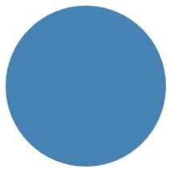
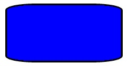

# <a name="draw-shapes"></a>Dibujar formas

\[ Actualizado para las aplicaciones para UWP en Windows 10. Para leer artículos sobre Windows 8.x, consulta el [archivo](http://go.microsoft.com/fwlink/p/?linkid=619132) \]


**API importantes**

-   [**Ruta de acceso**](https://msdn.microsoft.com/library/windows/apps/BR243355)
-   [**Espacio de nombres Windows.UI.Xaml.Shapes**](https://msdn.microsoft.com/library/windows/apps/BR243401)
-   [**Espacio de nombres Windows.UI.Xaml.Media**](https://msdn.microsoft.com/library/windows/apps/BR243045)

Aprende a dibujar formas como elipses, rectángulos, polígonos y trayectorias. La clase [**Path**](https://msdn.microsoft.com/library/windows/apps/BR243355) te permite visualizar un lenguaje de dibujo basado en vectores, relativamente complejo, en una interfaz de usuario XAML; por ejemplo, lo puedes visualizar para dibujar curvas Bézier.

## <a name="introduction"></a>Introducción

Son dos los conjuntos de clases que definen una región del espacio en la interfaz de usuario XAML: las clases [**Shape**](https://msdn.microsoft.com/library/windows/apps/BR243377) y las clases [**Geometry**](https://msdn.microsoft.com/library/windows/apps/BR210041). La principal diferencia entre estas clases es que **Shape** tiene asociado un pincel y se puede representar en la pantalla, mientras que **Geometry** simplemente define una región del espacio y no se representa, salvo que ayude a aportar información a otra propiedad de interfaz de usuario. Puedes pensar en **Shape** como una clase [**UIElement**](https://msdn.microsoft.com/library/windows/apps/BR208911), la cual tiene su límite definido por **Geometry**. Este tema se centra principalmente en las clases **Shape**.

Las clases [**Shape**](https://msdn.microsoft.com/library/windows/apps/BR243377) son: [**Line**](https://msdn.microsoft.com/library/windows/apps/BR243345), [**Ellipse**](https://msdn.microsoft.com/library/windows/apps/BR243343), [**Rectangle**](https://msdn.microsoft.com/library/windows/apps/BR243371), [**Polygon**](https://msdn.microsoft.com/library/windows/apps/BR243359), [**Polyline**](https://msdn.microsoft.com/library/windows/apps/BR243365) y [**Path**](https://msdn.microsoft.com/library/windows/apps/BR243355). La clase **Path** es interesante porque puede definir una geometría arbitraria. Asimismo, la clase [**Geometry**](https://msdn.microsoft.com/library/windows/apps/BR210041) también tiene su función aquí, dado que es una forma de definir las partes de una clase **Path**.

## <a name="fill-and-stroke-for-shapes"></a>Relleno y trazo para formas

Para representar una clase [**Shape**](https://msdn.microsoft.com/library/windows/apps/BR243377) en el lienzo de la aplicación, debes asociarla a una clase [**Brush**](https://msdn.microsoft.com/library/windows/apps/BR228076). Establece la propiedad [**Fill**](https://msdn.microsoft.com/library/windows/apps/windows.ui.xaml.shapes.shape.fill) de la clase **Shape** en la clase **Brush** que quieras. Para obtener más información sobre los pinceles, consulta [Usar pinceles](using-brushes.md).

Igualmente, una clase [**Shape**](https://msdn.microsoft.com/library/windows/apps/BR243377) también puede tener una propiedad [**Stroke**](https://msdn.microsoft.com/library/windows/apps/windows.ui.xaml.shapes.shape.stroke), que es una línea dibujada en torno al perímetro de la forma. Además, la propiedad **Stroke** no solo necesita tener una clase [**Brush**](https://msdn.microsoft.com/library/windows/apps/BR228076) que defina su apariencia, también debe tener un valor distinto de cero para la propiedad [**StrokeThickness**](https://msdn.microsoft.com/library/windows/apps/windows.ui.xaml.shapes.shape.strokethickness). **StrokeThickness** es una propiedad que define el grosor del perímetro en torno al borde de la forma. Si no especificas un valor **Brush** de la propiedad **Stroke** o si estableces **StrokeThickness** en 0, no se dibujará el borde alrededor de la forma.

## <a name="ellipse"></a>Elipse

Una [**Elipse**](https://msdn.microsoft.com/library/windows/apps/BR243343) es una forma con un perímetro curvo. Para crear una **elipse** básica, especifica las propiedades [**Width**](https://msdn.microsoft.com/library/windows/apps/BR208751), [**Height**](https://msdn.microsoft.com/library/windows/apps/BR208718) y el objeto [**Brush**](https://msdn.microsoft.com/library/windows/apps/BR228076) de la propiedad [**Fill**](https://msdn.microsoft.com/library/windows/apps/windows.ui.xaml.shapes.shape.fill).

En el siguiente ejemplo crearemos una [**elipse**](https://msdn.microsoft.com/library/windows/apps/BR243343) cuya propiedad [**Width**](https://msdn.microsoft.com/library/windows/apps/BR208751) tenga un valor de 200, la propiedad [**Height**](https://msdn.microsoft.com/library/windows/apps/BR208718) tenga un valor de 200 y que use una clase [**SolidColorBrush**](https://msdn.microsoft.com/library/windows/apps/BR242962) con un valor de color [**SteelBlue**](https://msdn.microsoft.com/library/windows/apps/Hh748056) en la propiedad [**Fill**](https://msdn.microsoft.com/library/windows/apps/windows.ui.xaml.shapes.shape.fill).

```xml
<Ellipse Fill="SteelBlue" Height="200" Width="200" />
```

```csharp
var ellipse1 = new Ellipse();
ellipse1.Fill = new SolidColorBrush(Windows.UI.Colors.SteelBlue);
ellipse1.Width = 200;
ellipse1.Height = 200;

layoutRoot.Children.Add(ellipse1);
```

Esta es la [**elipse**](https://msdn.microsoft.com/library/windows/apps/BR243343) representada.



En este caso, la [**elipse**](https://msdn.microsoft.com/library/windows/apps/BR243343) parece un círculo, pero así es como se declara un círculo en XAML: debes usar una **elipse** que tenga los mismos valores en las propiedades [**Width**](https://msdn.microsoft.com/library/windows/apps/BR208751) y [**Height**](https://msdn.microsoft.com/library/windows/apps/BR208718).

Cuando se coloca una [**elipse**](https://msdn.microsoft.com/library/windows/apps/BR243343) en un diseño de interfaz de usuario, se supone que su tamaño es el mismo que el de un rectángulo que tenga los mismos valores en sus propiedades [**Width**](https://msdn.microsoft.com/library/windows/apps/BR208751) y [**Height**](https://msdn.microsoft.com/library/windows/apps/BR208718); el área que quede fuera del perímetro no tiene representación, pero sigue formando parte del tamaño de diseño asignado.

Un grupo de seis elementos [**Ellipse**](https://msdn.microsoft.com/library/windows/apps/BR243343) forman parte de la plantilla de control para el control [**ProgressRing**](https://msdn.microsoft.com/library/windows/apps/BR227538) y dos elementos **Ellipse** concéntricos forman parte de un elemento [**RadioButton**](https://msdn.microsoft.com/library/windows/apps/BR227544).

## <a name="span-idrectanglespanspan-idrectanglespanspan-idrectanglespanrectangle"></a><span id="Rectangle"></span><span id="rectangle"></span><span id="RECTANGLE"></span>Rectángulo

Un [**Rectángulo**](https://msdn.microsoft.com/library/windows/apps/BR243371) es una forma de cuatro lados cuyos lados opuestos son iguales. Para crear un **rectángulo** básico, debes especificar las propiedades [**Width**](https://msdn.microsoft.com/library/windows/apps/BR208751), [**Height**](https://msdn.microsoft.com/library/windows/apps/BR208718) y [**Fill**](https://msdn.microsoft.com/library/windows/apps/windows.ui.xaml.shapes.shape.fill).

Puedes redondear las esquinas de un [**rectángulo**](https://msdn.microsoft.com/library/windows/apps/BR243371). Para ello, especifica un valor para las propiedades [**RadiusX**](https://msdn.microsoft.com/library/windows/apps/windows.ui.xaml.shapes.rectangle.radiusx.aspx) y [**RadiusY**](https://msdn.microsoft.com/library/windows/apps/windows.ui.xaml.shapes.rectangle.radiusy). Estas propiedades especifican los ejes x e y de una elipse que define la curva de las esquinas. El valor máximo permitido de **RadiusX** es el valor de la propiedad [**Width**](https://msdn.microsoft.com/library/windows/apps/BR208751) dividido entre dos; asimismo, el valor máximo permitido de **RadiusY** es el valor de la propiedad [**Height**](https://msdn.microsoft.com/library/windows/apps/BR208718) dividido entre dos.

En el ejemplo siguiente, crearemos un [**rectángulo**](https://msdn.microsoft.com/library/windows/apps/BR243371) cuya propiedad [**Width**](https://msdn.microsoft.com/library/windows/apps/BR208751) tenga un valor de 200 y la propiedad [**Height**](https://msdn.microsoft.com/library/windows/apps/BR208718) un valor de 100. Asimismo, usa la clase [**SolidColorBrush**](https://msdn.microsoft.com/library/windows/apps/BR242962) con un valor de color [**Blue**](https://msdn.microsoft.com/library/windows/apps/Hh747837) en la propiedad [**Fill**](https://msdn.microsoft.com/library/windows/apps/windows.ui.xaml.shapes.shape.fill) y otra clase **SolidColorBrush** con valor de color [**Black**](https://msdn.microsoft.com/library/windows/apps/Hh747833) en la propiedad [**Stroke**](https://msdn.microsoft.com/library/windows/apps/windows.ui.xaml.shapes.shape.stroke). A continuación, establecemos el valor de la propiedad [**StrokeThickness**](https://msdn.microsoft.com/library/windows/apps/windows.ui.xaml.shapes.shape.strokethickness) en 3. Igualmente, establecemos la propiedad [**RadiusX**](https://msdn.microsoft.com/library/windows/apps/windows.ui.xaml.shapes.rectangle.radiusx.aspx) en 50 y la propiedad [**RadiusY**](https://msdn.microsoft.com/library/windows/apps/windows.ui.xaml.shapes.rectangle.radiusy) en 10 para dar al **rectángulo** las esquinas redondeadas.

```xml
<Rectangle Fill="Blue"
           Width="200"
           Height="100"
           Stroke="Black"
           StrokeThickness="3"
           RadiusX="50"
           RadiusY="10" />
```

```csharp
var rectangle1 = new Rectangle();
rectangle1.Fill = new SolidColorBrush(Windows.UI.Colors.Blue);
rectangle1.Width = 200;
rectangle1.Height = 100;
rectangle1.Stroke = new SolidColorBrush(Windows.UI.Colors.Black);
rectangle1.StrokeThickness = 3;
rectangle1.RadiusX = 50;
rectangle1.RadiusY = 10;

layoutRoot.Children.Add(rectangle1);

```

Este es el [**Rectangle**](https://msdn.microsoft.com/library/windows/apps/BR243371) representado.



**Sugerencia** Hay algunos escenarios para definiciones de UI en los que, en lugar de usar un [**Rectangle**](https://msdn.microsoft.com/library/windows/apps/BR243371), es más apropiado usar un [**Border**](https://msdn.microsoft.com/library/windows/apps/BR209250). Si quieres crear una forma rectangular en torno a otro contenido, puede ser mejor usar un **Border**, ya que puede tener contenido secundario y su tamaño se ajustará automáticamente en torno a ese contenido, en lugar de tener dimensiones fijas de alto y ancho como un **Rectangle**. Un **Border** también ofrece la opción de tener esquinas redondeadas, a través de la propiedad [**CornerRadius**](https://msdn.microsoft.com/library/windows/apps/windows.ui.xaml.controls.border.cornerradius).

 

Por otro lado, es probable que un [**Rectángulo**](https://msdn.microsoft.com/library/windows/apps/BR243371) sea la mejor opción para la composición de controles. Un **Rectangle** es una forma que se ve en muchas plantillas de control, porque se usa como una parte de "FocusVisual" para los controles activables. Cuando el control esté en un estado visual "Focused", este rectángulo se hará visible; en otros estados, estará oculto.

## <a name="polygon"></a>Polygon

Un [**Polygon**](https://msdn.microsoft.com/library/windows/apps/BR243359) es una forma con un límite definida por un número de puntos arbitrario. El límite se crea conectando una línea desde un punto al siguiente, con el último punto conectado al primero. La propiedad [**Points**](https://msdn.microsoft.com/library/windows/apps/windows.ui.xaml.shapes.polygon.points.aspx) define la colección de puntos que conforman el límite. En XAML, los puntos se definen con una lista separada por comas. En el código subyacente, se usa una [**PointCollection**](https://msdn.microsoft.com/library/windows/apps/BR210220) para definir los puntos, y cada punto individual se agrega como un valor [**Point**](https://msdn.microsoft.com/library/windows/apps/BR225870) a la colección.

No tienes que declarar explícitamente los puntos como el punto inicial y el punto final, ya que ambos se especifican con el mismo valor [**Point**](https://msdn.microsoft.com/library/windows/apps/BR225870). La lógica de representación para un [**Polygon**](https://msdn.microsoft.com/library/windows/apps/BR243359) supone que se está definiendo una forma cerrada y se conectará el punto final con el punto inicial implícitamente.

El ejemplo siguiente crea un [**Polygon**](https://msdn.microsoft.com/library/windows/apps/BR243359) con 4 puntos establecidos en `(10,200)`, `(60,140)`, `(130,140)`y `(180,200)`. Usa un valor de [**LightBlue**](https://msdn.microsoft.com/library/windows/apps/Hh747960) igual a [**SolidColorBrush**](https://msdn.microsoft.com/library/windows/apps/BR242962) para su [**Fill**](https://msdn.microsoft.com/library/windows/apps/windows.ui.xaml.shapes.shape.fill) y no tiene ningún valor para [**Stroke**](https://msdn.microsoft.com/library/windows/apps/windows.ui.xaml.shapes.shape.stroke), por lo que no tiene contorno de perímetro.

```xml
<Polygon Fill="LightBlue"
         Points="10,200,60,140,130,140,180,200" />
```

```csharp
var polygon1 = new Polygon();
polygon1.Fill = new SolidColorBrush(Windows.UI.Colors.LightBlue);

var points = new PointCollection();
points.Add(new Windows.Foundation.Point(10, 200));
points.Add(new Windows.Foundation.Point(60, 140));
points.Add(new Windows.Foundation.Point(130, 140));
points.Add(new Windows.Foundation.Point(180, 200));
polygon1.Points = points;

layoutRoot.Children.Add(polygon1);
```

Y aquí tienes el [**Polygon**](https://msdn.microsoft.com/library/windows/apps/BR243359) representado.


**Sugerencia** El valor de [**Point**](https://msdn.microsoft.com/library/windows/apps/BR225870) se usa a menudo como tipo en XAML para escenarios en los que no se declaran los vértices de las formas. Por ejemplo, un valor **Point** forma parte de los datos del evento referentes a los eventos de entrada táctil; de esta manera, podrás saber con exactitud en qué punto de un espacio de coordenadas se produjo la acción táctil. Para obtener más información sobre el valor **Point** y cómo usarlo en XAML o en código, consulta el tema de referencia de la API para [**Point**](https://msdn.microsoft.com/library/windows/apps/BR225870).

## <a name="line"></a>Línea

Una [**Línea**](https://msdn.microsoft.com/library/windows/apps/BR243345) es simplemente una línea dibujada entre dos puntos en un espacio de coordenadas. Una **línea** omite cualquier valor proporcionado para [**Fill**](https://msdn.microsoft.com/library/windows/apps/windows.ui.xaml.shapes.shape.fill), ya que no tiene espacio interior. Si vas a realizar una **línea**, asegúrate de especificar los valores de las propiedades [**Stroke**](https://msdn.microsoft.com/library/windows/apps/windows.ui.xaml.shapes.shape.stroke) y [**StrokeThickness**](https://msdn.microsoft.com/library/windows/apps/windows.ui.xaml.shapes.shape.strokethickness), ya que de lo contrario no se podrá representar esa **línea**.

No uses valores de la estructura [**Point**](https://msdn.microsoft.com/library/windows/apps/BR225870) para especificar una [**línea**](https://msdn.microsoft.com/library/windows/apps/BR243345); en vez de eso, puedes usar valores discretos de la estructura [**Double**](https://msdn.microsoft.com/library/windows/apps/xaml/system.double.aspx) para las propiedades [**X1**](https://msdn.microsoft.com/library/windows/apps/windows.ui.xaml.shapes.line.x1.aspx), [**Y1**](https://msdn.microsoft.com/library/windows/apps/windows.ui.xaml.shapes.line.y1.aspx), [**X2**](https://msdn.microsoft.com/library/windows/apps/windows.ui.xaml.shapes.line.x2.aspx) y [**Y2**](https://msdn.microsoft.com/library/windows/apps/windows.ui.xaml.shapes.line.y2.aspx). Esto permite usar un número mínimo de marcas para líneas horizontales o verticales. Por ejemplo, `<Line Stroke="Red" X2="400"/>` define una línea horizontal de 400 píxeles de largo. Las otras propiedades X e Y tienen el valor 0 de manera predeterminada, por lo que, en términos de puntos, este XAML dibujaría una línea de `(0,0)` a `(400,0)`. A continuación, puedes usar la clase [**TranslateTransform**](https://msdn.microsoft.com/library/windows/apps/BR243027) para mover toda la **línea**, si quieres que se inicie en un punto que no sea (0,0).

```xml
<Line Stroke="Red" X2="400"/>
```

```csharp
var line1 = new Line();
line1.Stroke = new SolidColorBrush(Windows.UI.Colors.Red);
line1.X2 = 400;

layoutRoot.Children.Add(line1);

```

## <a name="span-idpolylinespanspan-idpolylinespanspan-idpolylinespan-polyline"></a><span id="_Polyline"></span><span id="_polyline"></span><span id="_POLYLINE"></span> Polilínea

Una [**Polilínea**](https://msdn.microsoft.com/library/windows/apps/BR243365) es similar a un [**polígono**](https://msdn.microsoft.com/library/windows/apps/BR243359) ya que el límite de la forma está definido por un conjunto de puntos, pero hay que tener en cuenta que el último punto de la **polilínea** no está conectado al primero.

**Nota**: Puedes tener un punto inicial y un punto final explícitamente idénticos en la propiedad [**Points**](https://msdn.microsoft.com/library/windows/apps/windows.ui.xaml.shapes.polyline.points.aspx) establecida para la clase [**Polyline**](https://msdn.microsoft.com/library/windows/apps/BR243365), pero en ese caso te recomendamos que uses una clase [**Polygon**](https://msdn.microsoft.com/library/windows/apps/BR243359).


Si especificas la propiedad [**Fill**](https://msdn.microsoft.com/library/windows/apps/windows.ui.xaml.shapes.shape.fill) de una [**polilínea**](https://msdn.microsoft.com/library/windows/apps/BR243365), la propiedad **Fill** pintará el espacio interior de la forma, incluso si el punto inicial y el punto final de la propiedad [**Points**](https://msdn.microsoft.com/library/windows/apps/windows.ui.xaml.shapes.polyline.points.aspx) establecidos en la **polilínea** no se cruzan. Si no especificas la propiedad **Fill**, la **polilínea** será similar a lo que se habría representado si hubieras especificado varios elementos [**Line**](https://msdn.microsoft.com/library/windows/apps/BR243345) individuales en los que se cruzan los puntos iniciales y finales de líneas consecutivas.

Al igual que en un [**polígono**](https://msdn.microsoft.com/library/windows/apps/BR243359), la propiedad [**Points**](https://msdn.microsoft.com/library/windows/apps/windows.ui.xaml.shapes.polyline.points.aspx) define la colección de puntos que conforman el límite. En XAML, los puntos se definen con una lista separada por comas. En el código subyacente, se usa una clase [**PointCollection**](https://msdn.microsoft.com/library/windows/apps/BR210220) para definir los puntos; una vez hecho esto, cada punto individual se agrega como una estructura [**Point**](https://msdn.microsoft.com/library/windows/apps/BR225870) a la colección.

En este ejemplo crearemos una [**polilínea**](https://msdn.microsoft.com/library/windows/apps/BR243365) con cuatro puntos establecidos en `(10,200)`, `(60,140)`, `(130,140)` y `(180,200)`. Se define la propiedad [**Stroke**](https://msdn.microsoft.com/library/windows/apps/windows.ui.xaml.shapes.shape.stroke), pero no la propiedad [**Fill**](https://msdn.microsoft.com/library/windows/apps/windows.ui.xaml.shapes.shape.fill).

```xml
<Polyline Stroke="Black"
        StrokeThickness="4"
        Points="10,200,60,140,130,140,180,200" />
```

```csharp
var polyline1 = new Polyline();
polyline1.Stroke = new SolidColorBrush(Windows.UI.Colors.Black);
polyline1.StrokeThickness = 4;

var points = new PointCollection();
points.Add(new Windows.Foundation.Point(10, 200));
points.Add(new Windows.Foundation.Point(60, 140));
points.Add(new Windows.Foundation.Point(130, 140));
points.Add(new Windows.Foundation.Point(180, 200));
polyline1.Points = points;

layoutRoot.Children.Add(polyline1);
```

Y aquí tienes la [**polilínea**](https://msdn.microsoft.com/library/windows/apps/BR243365) representada. Observa que el primer y el último punto no están conectados por el contorno establecido por la propiedad [**Stroke**](https://msdn.microsoft.com/library/windows/apps/windows.ui.xaml.shapes.shape.stroke), como sucedería con un [**polígono**](https://msdn.microsoft.com/library/windows/apps/BR243359).


## <a name="path"></a>Trazados

Un [**Trazado**](https://msdn.microsoft.com/library/windows/apps/BR243355) es el objeto más versátil de la clase [**Shape**](https://msdn.microsoft.com/library/windows/apps/BR243377), ya que se puede usar para definir una geometría arbitraria. Pero esta versatilidad implica complejidad. Veamos cómo crear un **trazado** básico en XAML.

Primero, debes definir la geometría de un trazado con la propiedad [**Data**](https://msdn.microsoft.com/library/windows/apps/windows.ui.xaml.shapes.path.data). Existen dos técnicas para establecer la propiedad **Data**:

-   Puedes establecer un valor de cadena para la propiedad [**Data**](https://msdn.microsoft.com/library/windows/apps/windows.ui.xaml.shapes.path.data) en XAML. Con este formato, el valor **Path.Data** usará un formato de serialización para elementos gráficos. Normalmente no se edita el texto de este valor en forma de cadena una vez establecido. En lugar de ello puedes usar herramientas de diseño para trabajar en una metáfora de diseño o dibujo sobre una superficie. A continuación, guardas o exportas la salida para generar un archivo XAML o un fragmento de cadena XAML con información de la propiedad **Path.Data**.
-   Puedes establecer la propiedad [**Data**](https://msdn.microsoft.com/library/windows/apps/windows.ui.xaml.shapes.path.data) en un solo objeto [**Geometry**](https://msdn.microsoft.com/library/windows/apps/BR210041). Esto puede hacerse mediante programación o en XAML. Ese simple objeto **Geometry** suele ser una clase [**GeometryGroup**](https://msdn.microsoft.com/library/windows/apps/windows.ui.xaml.media.geometrygroup), que actúa como un contenedor que puede componer varias definiciones de geometría en un solo objeto, para satisfacer los fines del modelo de objetos. La razón más común para hacer esto, es que quieras usar una o más de las curvas y formas complejas que se pueden definir como valores de la propiedad [**Segments**](https://msdn.microsoft.com/library/windows/apps/BR210164) de la clase [**PathFigure**](https://msdn.microsoft.com/library/windows/apps/BR210143) como, por ejemplo, [**BezierSegment**](https://msdn.microsoft.com/library/windows/apps/BR228068).

En este ejemplo se muestra un [**trazado**](https://msdn.microsoft.com/library/windows/apps/BR243355) que puede ser perfectamente el resultado de haber usado Blend para Visual Studio para obtener unas pocas formas vectoriales y guardarlas como un archivo XAML. El **trazado** total consiste en un segmento de curva Bézier y un segmento de línea. Este ejemplo está pensado principalmente para señalar los elementos que existen en el formato de serialización [**Path.Data**](https://msdn.microsoft.com/library/windows/apps/windows.ui.xaml.shapes.path.data) y para indicar qué representan los números.

Esta propiedad [**Data**](https://msdn.microsoft.com/library/windows/apps/windows.ui.xaml.shapes.path.data) comienza con el comando Move, indicado con una "M", que establece el punto de inicio de la trayectoria.

El primer segmento es una curva Bézier cúbica que comienza en `(100,200)` y termina en `(400,175)`, y que se dibuja con los dos puntos de control `(100,25)` y `(400,350)`. Este segmento se indica con el comando "C" de la cadena de atributo [**Data**](https://msdn.microsoft.com/library/windows/apps/windows.ui.xaml.shapes.path.data).

El segundo segmento comienza con un comando de línea horizontal absoluto "H", que especifica una línea dibujada desde el punto de conexión de la subtrayectoria anterior `(400,175)` hasta un nuevo punto de conexión `(280,175)`. Como se trata de un comando de línea horizontal, el valor especificado es una coordenada x.

```xml
<Path Stroke="DarkGoldenRod" 
      StrokeThickness="3"
      Data="M 100,200 C 100,25 400,350 400,175 H 280" />
```

Este es el [**trazado**](https://msdn.microsoft.com/library/windows/apps/BR243355) representado.


En el siguiente ejemplo, se muestra el uso de otra técnica que analizamos: un [**GeometryGroup**](https://msdn.microsoft.com/library/windows/apps/windows.ui.xaml.media.geometrygroup) con una [**PathGeometry**](https://msdn.microsoft.com/library/windows/apps/BR210168). En este ejemplo, se ejercitan algunos de los tipos de geometría de contribución que se pueden usar como parte de una **PathGeometry**: [**PathFigure**](https://msdn.microsoft.com/library/windows/apps/BR210143) y los diversos elementos que pueden ser un segmento en [**PathFigure.Segments**](https://msdn.microsoft.com/library/windows/apps/BR210164).

```xml
<Path Stroke="Black" StrokeThickness="1" Fill="#CCCCFF">
    <Path.Data>
        <GeometryGroup>
            <RectangleGeometry Rect="50,5 100,10" />
            <RectangleGeometry Rect="5,5 95,180" />
            <EllipseGeometry Center="100, 100" RadiusX="20" RadiusY="30"/>
            <RectangleGeometry Rect="50,175 100,10" />
            <PathGeometry>
                <PathGeometry.Figures>
                    <PathFigureCollection>
                        <PathFigure IsClosed="true" StartPoint="50,50">
                            <PathFigure.Segments>
                                <PathSegmentCollection>
                                    <BezierSegment Point1="75,300" Point2="125,100" Point3="150,50"/>
                                    <BezierSegment Point1="125,300" Point2="75,100"  Point3="50,50"/>
                                </PathSegmentCollection>
                            </PathFigure.Segments>
                        </PathFigure>
                    </PathFigureCollection>
                </PathGeometry.Figures>
            </PathGeometry>
        </GeometryGroup>
    </Path.Data>
</Path>
```

```csharp
var path1 = new Windows.UI.Xaml.Shapes.Path();
path1.Fill = new SolidColorBrush(Windows.UI.Color.FromArgb(255, 204, 204, 255));
path1.Stroke = new SolidColorBrush(Windows.UI.Colors.Black);
path1.StrokeThickness = 1;

var geometryGroup1 = new GeometryGroup();
var rectangleGeometry1 = new RectangleGeometry();
rectangleGeometry1.Rect = new Rect(50, 5, 100, 10);
var rectangleGeometry2 = new RectangleGeometry();
rectangleGeometry2.Rect = new Rect(5, 5, 95, 180);
geometryGroup1.Children.Add(rectangleGeometry1);
geometryGroup1.Children.Add(rectangleGeometry2);

var ellipseGeometry1 = new EllipseGeometry();
ellipseGeometry1.Center = new Point(100, 100);
ellipseGeometry1.RadiusX = 20;
ellipseGeometry1.RadiusY = 30;
geometryGroup1.Children.Add(ellipseGeometry1);

var pathGeometry1 = new PathGeometry();
var pathFigureCollection1 = new PathFigureCollection();
var pathFigure1 = new PathFigure();
pathFigure1.IsClosed = true;
pathFigure1.StartPoint = new Windows.Foundation.Point(50, 50);
pathFigureCollection1.Add(pathFigure1);
pathGeometry1.Figures = pathFigureCollection1;

var pathSegmentCollection1 = new PathSegmentCollection();
var pathSegment1 = new BezierSegment();
pathSegment1.Point1 = new Point(75, 300);
pathSegment1.Point2 = new Point(125, 100);
pathSegment1.Point3 = new Point(150, 50);
pathSegmentCollection1.Add(pathSegment1);

var pathSegment2 = new BezierSegment();
pathSegment2.Point1 = new Point(125, 300);
pathSegment2.Point2 = new Point(75, 100);
pathSegment2.Point3 = new Point(50, 50);
pathSegmentCollection1.Add(pathSegment2);
pathFigure1.Segments = pathSegmentCollection1;

geometryGroup1.Children.Add(pathGeometry1);
path1.Data = geometryGroup1;

layoutRoot.Children.Add(path1);

```

Este es el [**trazado**](https://msdn.microsoft.com/library/windows/apps/BR243355) representado.


El uso de [**PathGeometry**](https://msdn.microsoft.com/library/windows/apps/BR210168) puede ofrecer un resultado más legible que rellenar una cadena [**Path.Data**](https://msdn.microsoft.com/library/windows/apps/windows.ui.xaml.shapes.path.data). Por otro lado, [**Path.Data**](https://msdn.microsoft.com/library/windows/apps/windows.ui.xaml.shapes.path.data) usa una sintaxis compatible con las definiciones de rutas de imágenes de Scalable Vector Graphics (SVG), por lo que puede resultar útil para migrar gráficos SVG o como salida de una herramienta como Blend.

 

 


