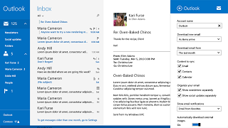

# Directrices para una interfaz de usuario informativa

\ [Actualizado para aplicaciones para la Plataforma universal de Windows (UWP) en Windows 10. Para leer artículos sobre Windows 8.x, consulta el [archivo](http://go.microsoft.com/fwlink/p/?linkid=619132) \]

Algunas veces, puede resultar útil informar al usuario acerca de las funciones de la aplicación que quizá no sean obvias para ellos, tales como interacciones táctiles específicas. En estos casos, es necesario presentar instrucciones al usuario a través de la interfaz de usuario para que pueda descubrir y usar esas características que posiblemente no conozcan.

## Cuándo usar la interfaz de usuario informativa

La interfaz de usuario informativa debe usarse con cuidado. Si se abusa de ella, es fácil pasarla por alto o puede resultar molesta para el usuario, lo que hará que pierda su eficacia.

La interfaz de usuario informativa debería usarse para ayudar al usuario a descubrir características importantes de aplicación que no son evidentes, como los gestos táctiles o ajustes que podrían interesarles. También puede usarse para informar a los usuarios sobre características nuevas o cambios en la aplicación que, de lo contrario, pueden pasar desapercibidos.

A menos que la aplicación dependa de los gestos táctiles, la interfaz de usuario informativa no debe usarse para enseñar al usuario las características fundamentales de la aplicación.

## Principios del diseño de la UI informativa

Una buena interfaz de usuario informativa es pertinente y educativa para el usuario y mejora su experiencia. Debe ser:

-   **Simple:** Los usuarios no quieren que su experiencia se vea interrumpida con información complicada.
-   **Memorable:** Los usuarios no desean ver las mismas instrucciones cada vez que intenten realizar una tarea, por lo que estas deben ser fáciles de recordar.
-   **Pertinente de manera inmediata:** si la interfaz de usuario informativa no informa a los usuarios sobre algo que quieren hacer inmediatamente, estos no tendrán ningún motivo para prestarle atención.

Evita el uso excesivo de la interfaz de usuario informativa y asegúrate de elegir los temas correctos. No incluyas la siguiente información:

-   **Características fundamentales:** si los usuarios necesitan instrucciones para usar la aplicación, considera la posibilidad de crear un diseño de aplicación más intuitivo.
-   **Características obvias:** La interfaz de usuario informativa no debe interferir en los casos en que los usuarios puedan descubrir el funcionamiento de una característica por sí solos.
-   **Características complejas:** La interfaz de usuario informativa debe ser concisa. Los usuarios interesados en características complejas normalmente están dispuestos a buscar instrucciones.

Evita que la interfaz de usuario informativa suponga una molestia para los usuarios. No hagas lo siguiente:

-   **Ocultar información importante:** la interfaz de usuario informativa nunca debería obstaculizar otras características de la aplicación.
-   **Obligar a los usuarios a participar:** los usuarios deben tener la posibilidad de omitir la interfaz de usuario informativa y avanzar en la aplicación.
-   **Mostrar información repetida:** No agobies al usuario con la interfaz de usuario informativa, incluso si la pasa por alto la primera vez. La mejor solución es agregar una opción de configuración para volver a mostrar la interfaz de usuario informativa.

## Ejemplos de interfaz de usuario informativa

Aquí te mostramos algunos ejemplos de cómo la interfaz de usuario informativa puede ayudar a los usuarios:

-   **Ayudar a los usuarios a descubrir interacciones táctiles.** En la siguiente captura de pantalla se muestra una interfaz de usuario informativa en la que se enseña a un jugador a usar gestos táctiles en el juego *Cut the Rope*.

    

-   **Causar una excelente primera impresión.** Cuando la aplicación Momentos especiales se inicia por primera vez, la interfaz de usuario informativa pide al usuario que comience a crear películas sin obstaculizar su experiencia.

    

-   **Guiar a los usuarios para que realicen el siguiente paso en una tarea complicada.** En la aplicación Correo de Windows, una sugerencia en la parte inferior de la bandeja de entrada dirige a los usuarios a **Configuración** para acceder a los mensajes más antiguos.

    

    Cuando el usuario hace clic en el mensaje, el control flotante **Configuración** de la aplicación aparece en el lado derecho de la pantalla y permite al usuario completar la tarea. En estas imágenes se muestra la aplicación Correo de Windows antes y después de que un usuario seleccione el mensaje de la interfaz de usuario informativa.

    | Antes                                                               | Después                                                                                                        |
    |----------------------------------------------------------------------|--------------------------------------------------------------------------------------------------------------|
    |  |  |

## Artículos relacionados

* [Directrices para la ayuda de la aplicación](guidelines-for-app-help.md)

<!--HONumber=Jun16_HO5-->

