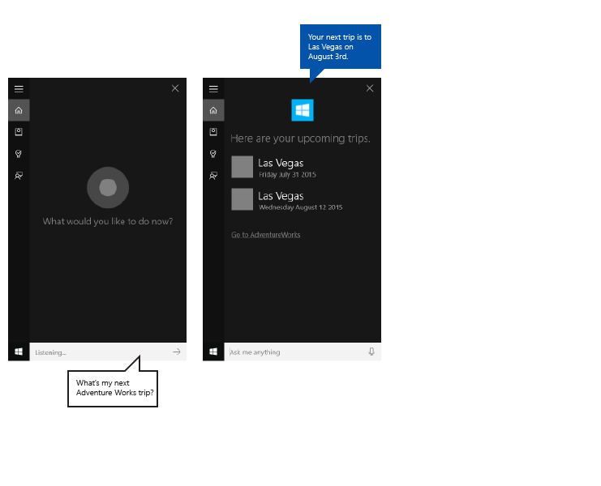

# Directrices para el diseño de Cortana

\[ Actualizado para aplicaciones para UWP en Windows 10. Para leer más artículos sobre Windows 8.x, consulta el [archivo](http://go.microsoft.com/fwlink/p/?linkid=619132) \]

Estas directrices y recomendaciones describen cómo la aplicación puede usar mejor **Cortana** para interactuar con el usuario, ayudarle a realizar una tarea y comunicar claramente lo que está sucediendo.

**Cortana** permite que las aplicaciones que se ejecutan en segundo plano pidan al usuario desambiguación o confirmación y, a cambio, proporcionan comentarios al usuario sobre el estado del comando de voz. El proceso es ligero, rápido y no obliga al usuario a dejar la experiencia de **Cortana** o cambiar el contexto a la aplicación.

Aunque el usuario debe sentir que **Cortana** le ayuda a que el proceso sea lo más ligero y fácil posible, es probable que quieras que **Cortana** también deje claro que es tu aplicación la que lleva a cabo la tarea.

Usamos una aplicación de planeación y administración de viajes denominada **Adventure Works** que se integra en la interfaz de usuario de **Cortana**, que se muestra aquí, para demostrar muchos de los conceptos y las funciones que analizamos.

## Escritura de conversación

Las interacciones de **Cortana** correctas requieren que sigas algunos principios fundamentales al crear cadenas de la interfaz gráfica de usuario y de texto a voz (TTS).

<table>
<colgroup>
<col width="33%" />
<col width="33%" />
<col width="33%" />
</colgroup>
<thead>
<tr class="header">
<th align="left">Principio</th>
<th align="left">Ejemplo incorrecto</th>
<th align="left">Ejemplo correcto</th>
</tr>
</thead>
<tbody>
<tr class="odd">
<td align="left">

<dl>
<dt>Eficaz</dt>
<dd>
Usa el menor número de palabras posible y coloca la información más importante delante.

</dd>
</dl></td>
<td align="left">
Claro que puedo hacerlo, ¿qué película quieres buscar hoy? Tenemos una gran colección.
</td>
<td align="left">
Perfecto, ¿qué película buscas?
</td>
</tr>
<tr class="even">
<td align="left">

<dl>
<dt>Relevante</dt>
<dd>
Proporcionar información relativa solo a la tarea, el contenido y el contexto.

</dd>
</dl></td>
<td align="left">
He agregado esto a tu lista de reproducción. Solo para que lo sepas, la batería está baja.
</td>
<td align="left">
He agregado esto a tu lista de reproducción.
</td>
</tr>
<tr class="odd">
<td align="left">

<dl>
<dt>Claro</dt>
<dd>
Evita la ambigüedad. Usa lenguaje cotidiano en lugar de jerga técnica.

</dd>
</dl></td>
<td align="left">
No hay resultados para la consulta &quot;Viajes a Las Vegas&quot;.
</td>
<td align="left">
No pude encontrar viajes a Las Vegas.
</td>
</tr>
<tr class="even">
<td align="left">

<dl>
<dt>Fiable </dt>
<dd>
Sé lo más preciso posible. Sé transparente sobre lo que sucede en segundo plano: si una tarea aún no ha finalizado, no digas que lo ha hecho. Respeta la privacidad: no leas información privada en voz alta.

</dd>
</dl></td>
<td align="left">
No pude encontrar esa película, seguro que aún no se ha estrenado.
</td>
<td align="left">
No pude encontrar esa película en nuestro catálogo.
</td>
</tr>
</tbody>
</table>

 

Escribe cómo habla la gente. No des prioridad a la precisión gramatical sobre el sonar natural. Por ejemplo, las formas verbales naturales como "quiero" o "tengo que" son adecuadas para la lectura TTS.

Usa la primera persona implícita cuando sea posible y natural. Por ejemplo, "Buscando tu próximo viaje de Adventure Works" implica que alguien está realizando la búsqueda, pero no usa la palabra "Estoy" para especificarlo.

Usa alguna variación para ayudar a que tu aplicación suene más natural. Proporciona distintas versiones de tus cadenas TTS y GUI para decir lo mismo de forma eficaz. Por ejemplo, "¿Qué película quieres ver?" podría tener alternativas como "¿Qué película te gustaría ver?". La gente no dice lo mismo de la misma manera cada vez. Asegúrate de mantener sincronizadas tus versiones de TTS y de la interfaz gráfica de usuario.

Usa palabras como "Vale" y "De acuerdo" en tus respuestas con cautela. Aunque pueden proporcionar confirmación y una sensación de progreso, también se pueden volver repetitivas si se usan con demasiada frecuencia y sin variación.

**Nota**  Usa frases de confirmación en TTS solamente. Debido a la limitación de espacio del lienzo de **Cortana**, no los repitas en las cadenas de la interfaz gráfica de usuario correspondientes.

 

Usa contracciones en las respuestas para que las interacciones sean más naturales y se ahorre espacio adicional en el lienzo de **Cortana**. Por ejemplo, "No encuentro esa película" en lugar de "No he podido encontrar esa película". Escribe para el oído, no para la vista.

Usa lenguaje que el sistema comprenda. Los usuarios suelen repetir las palabras que se usan con ellos. Ten claro lo que se muestra

Usa alguna variación en las respuestas, dándoles la vuelta o seleccionándolas aleatoriamente de una colección de respuestas alternativas. Por ejemplo, "¿Qué película quieres ver?" y "¿qué película te gustaría ver?". Esto hace que la aplicación parezca más natural y única.

## Localización

Para iniciar una acción mediante un comando de voz, la aplicación debe registrar los comandos de voz en el idioma que el usuario seleccionó en su dispositivo (Configuración &gt; Sistema &gt; Speech &gt; Idioma de voz).

Se deben localizar los comandos de voz a los que la aplicación responde y todas las cadenas de TTS y de la interfaz gráfica de usuario.

Debes evitar cadenas de GUI largas. El lienzo de **Cortana** proporciona tres líneas para las respuestas y truncará las cadenas que sean más largas.

Para obtener más información, consulta la [Sección Globalización y localización](../globalizing/globalizing-portal.md).

## Recursos de imágenes y escalado

Las aplicaciones para la Plataforma universal de Windows (UWP) pueden seleccionar automáticamente la imagen más adecuada de logotipo de la aplicación en función de la configuración específica y funcionalidades del dispositivo (contraste alto, píxeles efectivos, configuración regional, etc.). Lo único que tienes que hacer es proporcionar las imágenes y asegurarte de que usas la nomenclatura y organización de carpeta apropiadas en el proyecto de aplicación para las diferentes versiones de recursos. Si no proporcionas las versiones de recurso recomendadas, pueden verse afectadas la calidad de imagen, localización y accesibilidad, según las preferencias del usuario, capacidades, tipo de dispositivo y ubicación.

Para más información sobre recursos de imagen para los factores de escala y contraste alto, consulta las [directrices para los activos de icono y el mosaico](../controls-and-patterns/tiles-and-notifications-app-assets.md).

Se asigna nombre a los recursos mediante calificadores. Los calificadores de recursos son modificadores de carpetas y nombres de archivo que identifican el contexto en el que debe usarse una versión particular de un recurso.

La convención de nomenclatura estándar es "foldername/qualifiername-value\[\_qualifiername-value\]/filename.qualifiername-value\[\_qualifiername-value\].ext". Por ejemplo: images/en-US/logo.scale-100\_contrast-white.png se denomina en código simplemente mediante la carpeta raíz y el nombre de archivo: images/logo.png. Consulta [Globalización y localización](../globalizing/globalizing-portal.md) y [Cómo asignar un nombre a los recursos mediante calificadores](https://msdn.microsoft.com/library/windows/apps/xaml/hh965324).

Se recomienda que marques el idioma predeterminado en los archivos de recursos de cadena (como "en-US\\resources.resw") y el factor de escala predeterminado en las imágenes (como "logo.scale-100.png"), incluso si no tienes previsto ofrecer recursos localizados o de resolución múltiple. Sin embargo, como mínimo, te recomendamos que proporciones activos para los factores de escala 100, 200 y 400.

**Importante**  
El icono de la aplicación usado en el área de título del lienzo de Cortana es el icono Square44x44Logo especificado en el archivo "Package.appxmanifest". 

También puedes especificar un icono para cada resultado de una consulta que se muestra en el área de contenido del lienzo de Cortana. Los tamaños de imagen válidos para los iconos de resultados son:

-   68 (ancho) x 68 (alto)
-   68 (ancho) x 92 (alto)
-   280 (ancho) x 140 (alto)

## Ejemplo

Este ejemplo muestra un flujo de tareas integral para una aplicación en segundo plano en **Cortana**. Estamos usando la aplicación **Adventure Works** para cancelar un viaje a Las Vegas.

A continuación se describen los pasos destacados en esta imagen:

1.  El usuario toca el micrófono para iniciar **Cortana**.
2.  El usuario dice "Cancelar el viaje de Adventure Works a las Vegas" para iniciar la aplicación **Adventure Works** en segundo plano. La aplicación usa tanto la voz como el lienzo de **Cortana** para interactuar con el usuario.
3.  Las transacciones de **Cortana** a una pantalla de entrega que ofrece información de confirmación al usuario ("Obtendré Adventure Works ahí".), una barra de estado y un botón Cancelar.
4.  En este caso, el usuario tiene varios viajes que coinciden con la consulta, por lo que la aplicación proporciona una pantalla de desambiguación que enumera todos los resultados y tareas coincidentes, "¿cuál deseas cancelar?"
5.  El usuario especifica el elemento "Conferencia tecnológica de Las Vegas".
6.  Como la cancelación no se puede deshacer, la aplicación proporciona una pantalla de confirmación que pide al usuario que confirme su propósito.
7.  El usuario dice "Sí".
8.  La aplicación proporciona una pantalla de finalización que muestra el resultado de la operación.

A continuación exploraremos estos pasos con más detalle.

### Entrega

|                                                                                                          |
|----------------------------------------------------------------------------------------------------------|
|               |
| Encontrar viaje sin pantalla de entrega                                                                              |
|  |
| Cancelar viaje con pantalla de entrega                                                                          |

 

Se pueden realizar tareas que tardan menos de 500 ms en hacer que tu aplicación responda que no requieran información adicional del usuario sin más participación por parte de **Cortana**, aparte de mostrar la pantalla de finalización.

Si la aplicación requiere más de 500 ms en responder, **Cortana** proporciona una pantalla de entrega. Se muestran el icono y el nombre de la aplicación, y debes proporcionar cadenas de entrega de la interfaz gráfica de usuario y TTS para indicar que el comando de voz se entendió correctamente. La pantalla de entrega se mostrará durante un máximo de 5 segundos; si la aplicación no responde en este tiempo, **Cortana** presentará una pantalla de error genérica.

### Directrices de la interfaz gráfica de usuario y TTS para pantallas de entrega

Indicar claramente que la tarea está en curso.

Usar el tiempo presente.

Usar un verbo de acción que confirme qué tarea se está iniciando y que haga referencia a la entidad específica.

Usa un verbo genérico que no confirme la acción solicitada, incompleta. Por ejemplo, "Buscar tu viaje" en lugar de "Cancelar tu viaje". En este caso, si no se devuelven resultados, el usuario no escucha algo como "Cancelando tu viaje a Las Vegas... No pude encontrar un viaje a Las Vegas".

Deja claro que la tarea todavía no ha tenido lugar si la aplicación todavía necesita resolver la entidad solicitada. Por ejemplo, ten en cuenta cómo decimos "Buscando tu viaje" en lugar de "Cancelando tu viaje", porque pueden encontrarse cero o más viajes, y todavía no sabemos el resultado.

Las cadenas de la interfaz gráfica de usuario y TTS pueden coincidir, pero no necesariamente. Intenta que la cadena de GUI sea corta para evitar que se trunquen y dupliquen otros activos visuales.

| TTS                                                    | INTERFAZ GRÁFICA DE USUARIO                                 |
|--------------------------------------------------------|-------------------------------------|
| Buscando tu próximo viaje de Adventure Works.            | Buscando tu próximo viaje...         |
| Buscando tu viaje de Adventure Works a Falls City. | Buscando el viaje a Falls City... |

 

### Progreso

|                                                                                             |
|---------------------------------------------------------------------------------------------|
|  |
| Cancelar viaje con pantalla de progreso                                                            |

 

Cuando una tarea tarda unos instantes entre los pasos, la aplicación debe entrar e informar al usuario de lo que sucede en una pantalla de progreso. A continuación se muestra el icono de la aplicación y debes proporcionar cadenas de progreso de la interfaz gráfica de usuario y TTS para indicar que la tarea está en curso.

Debes proporcionar un vínculo a la aplicación con los parámetros de inicio para iniciar la aplicación en el estado adecuado. Esto permite al usuario ver o completar la tarea por sí mismos. **Cortana** proporciona el texto del vínculo (como "Ir a Adventure Works").

Las pantallas de progreso se mostrarán 5 segundos cada una, tras lo cual deben estar seguidas de otra pantalla o la tarea superará el tiempo de espera.

Estas pantallas pueden seguir una pantalla de progreso:

-   Progreso
-   Confirmación (explícita, descrita más adelante)
-   Desambiguación
-   Finalización

### Directrices de interfaz gráfica de usuario y TTS para pantallas de progreso

Usar el tiempo presente.

Usar un verbo de acción que confirme que la tarea está en curso.

**Interfaz gráfica de usuario**: si se muestra la entidad, usa una referencia a esta ("Cancelando este viaje..."); si no se muestra ninguna entidad, llama explícitamente a la entidad ("Cancelando 'Conferencia tecnológica de Las Vegas'").

**TTS**: solo debes incluir una cadena TTS en la primera pantalla de progreso. Si se requieren más pantallas de progreso, envía una cadena vacía, {}, como la cadena TTS y proporcionar una cadena de interfaz gráfica de usuario solamente.

| Condiciones                                              | TTS                            | INTERFAZ GRÁFICA DE USUARIO                            |
|---------------------------------------------------------|--------------------------------|--------------------------------|
| ENTIDAD LEÍDA EN EL TURNO ANTERIOR / ENTIDAD MOSTRADA EN LA PANTALLA     | Cancelando este viaje...          | Cancelando este viaje...          |
| ENTIDAD SIN LEER EN EL TURNO ANTERIOR / ENTIDAD MOSTRADA EN LA PANTALLA | Cancelar tu viaje a Las Vegas... | Cancelando este viaje...          |
| ENTIDAD SIN LEER EN EL TURNO ANTERIOR / ENTIDAD NO MOSTRADA        | Cancelando tu viaje a Las Vegas... | Cancelando tu viaje a Las Vegas... |

 

### Confirmación

|                                                                                                     |
|-----------------------------------------------------------------------------------------------------|
|  |
| Cancelar viaje con pantalla de confirmación                                                                |

 

Algunas tareas pueden confirmarse implícitamente mediante la naturaleza de los comandos del usuario; otras son más confidenciales y requieren confirmación explícita. Estas son algunas directrices sobre cuándo usar una confirmación explícita o implícita.

Las cadenas de la interfaz gráfica de usuario y TTS de la pantalla de confirmación están especificadas por la aplicación; el icono de la aplicación, si se ha indicado, se muestra en lugar del avatar de **Cortana**.

Una vez que el cliente responde a la confirmación, la aplicación debe proporcionar la siguiente pantalla antes de 500 ms para evitar acceder a una pantalla de progreso.

Usar la confirmación explícita cuando...

-   El contenido sale del usuario (por ejemplo, un mensaje de texto, un correo electrónico o una publicación en una red social)
-   Las acciones no se pueden deshacer (por ejemplo, realizar una compra o eliminar algo)
-   El resultado podría ser vergonzoso (por ejemplo, una llamada a la persona incorrecta)
-   Se requiere un reconocimiento más complejo (por ejemplo, una transcripción abierta)

Usar la confirmación implícita cuando...

-   El contenido se guarde solo para el usuario (por ejemplo, una nota para uno mismo)
-   Hay una manera sencilla de salir (por ejemplo, activar o desactivar una alarma)
-   La tarea debe ser rápida (por ejemplo, capturar rápidamente una idea antes de olvidarla)
-   La precisión es alta (por ejemplo, un menú sencillo)

### Directrices de la interfaz gráfica de usuario y TTS para pantallas de confirmación

Usar el tiempo presente.

Formular al usuario una pregunta inequívoca que pueda responderse con "Sí" o "No". La pregunta debe confirmar explícitamente lo que el usuario intenta hacer y no debe haber ninguna otra opción obvia.

Proporciona una variación de la pregunta para volver a formularla en caso de que el comando de voz no se entienda la primera vez.

**Interfaz gráfica de usuario**: si se muestra la entidad, usa una referencia a ella. Si no se muestra ninguna entidad, llama explícitamente a esta.

**TTS**: para mayor claridad, haz siempre referencia al elemento o entidad específico, a menos que la haya leído el sistema en el turno anterior.

| Condiciones                                              | TTS                                        | INTERFAZ GRÁFICA DE USUARIO                                           |
|---------------------------------------------------------|--------------------------------------------|-----------------------------------------------|
| ENTIDAD SIN LEER EN EL TURNO ANTERIOR / ENTIDAD MOSTRADA EN LA PANTALLA | ¿Quieres cancelar la conferencia tecnológica de Las Vegas? | ¿Cancelar este viaje?                             |
| ENTIDAD SIN LEER EN EL TURNO ANTERIOR / ENTIDAD NO MOSTRADA        | ¿Quieres cancelar la conferencia tecnológica de Las Vegas? | ¿Cancelar la conferencia tecnológica de Las Vegas?                 |
| ENTIDAD LEÍDA EN EL TURNO ANTERIOR / ENTIDAD NO MOSTRADA            | ¿Quieres cancelar este viaje?             | ¿Cancelar este viaje?                             |
| VOLVER A PREGUNTAR CON ESTA ENTIDAD MOSTRADA                              | ¿Querías cancelar este viaje?            | ¿Querías cancelar este viaje?             |
| VOLVER A PREGUNTAR CON ESTA ENTIDAD NO MOSTRADA                          | ¿Querías cancelar este viaje?            | ¿Querías cancelar la conferencia tecnológica de Las Vegas? |

 

### Desambiguación

|                                                                                                        |
|--------------------------------------------------------------------------------------------------------|
|  |
| Cancelar viaje con pantalla de desambiguación                                                                 |

 

Es posible que algunas tareas requieran al usuario seleccionar de una lista de entidades para completar la tarea.

Las cadenas de la interfaz gráfica de usuario y TTS de la pantalla de desambiguación están especificadas por la aplicación; el icono de la aplicación, si se ha indicado, se muestra en lugar del avatar de **Cortana**.

Una vez que el cliente responde a la pregunta de desambiguación, la aplicación debe proporcionar la siguiente pantalla antes de 500 ms para evitar acceder a una pantalla de progreso.

### Directrices de la interfaz gráfica de usuario y TTS para pantallas de desambiguación

Usar el tiempo presente.

Pedir al usuario una pregunta inequívoca que pueda responderse con la línea de título o el texto de cualquier entidad mostrada.

Se pueden mostrar hasta 10 entidades.

Cada entidad debe tener un título único.

Proporciona una variación de la pregunta para volver a formularla en caso de que el comando de voz no se entienda la primera vez.

**TTS**: para mayor claridad, haz siempre referencia al elemento o entidad específico, a menos que se haya dicho en el paso anterior.

**TTS**: no leas la lista de entidades, a menos que haya tres o menos y sean cortas.

| Condiciones                 | TTS                                                                            | INTERFAZ GRÁFICA DE USUARIO                              |
|----------------------------|--------------------------------------------------------------------------------|----------------------------------|
| SÍMBOLO DEL SISTEMA - 3 O MENOS ELEMENTOS  | ¿Qué viaje a Las Vegas quieres cancelar? ¿El de la conferencia tecnológica o el de la fiesta en Las Vegas? | ¿Cuál quieres cancelar? |
| SÍMBOLO DEL SISTEMA - MÁS DE 3 ELEMENTOS | ¿Qué viaje a Las Vegas quieres cancelar?                                          | ¿Cuál quieres cancelar? |
| VOLVER A PREGUNTAR                   | ¿Qué viaje a Las Vegas querías cancelar?                                         | ¿Cuál quieres cancelar? |

 

### Finalización

|                                                                                                 |
|-------------------------------------------------------------------------------------------------|
|  |
| Cancelar viaje con la pantalla de finalización                                                              |

 

Tras finalizar la tarea correctamente, la aplicación debe informar al usuario que la tarea solicitada se realizó correctamente.

Las cadenas de la interfaz gráfica de usuario y TTS de la pantalla de finalización están especificadas por la aplicación; el icono de la aplicación, si se ha indicado, se muestra en lugar del avatar de **Cortana**.

Debes proporcionar un vínculo a la aplicación con los parámetros de inicio para iniciar la aplicación en el estado adecuado. Esto permite al usuario ver o completar la tarea por sí mismos. **Cortana** proporciona el texto del vínculo (como "Ir a Adventure Works").

### Directrices de la interfaz gráfica de usuario y TTS para pantallas de finalización

Usar el tiempo pasado.

Usar un verbo de acción para indicar explícitamente que se ha completado la tarea.

Si se muestra la entidad o se ha hecho referencia a ella en el paso anterior, solo haz referencia a ella.

| Condiciones                                       | TTS                                             | INTERFAZ GRÁFICA DE USUARIO                                |
|--------------------------------------------------|-------------------------------------------------|------------------------------------|
| ENTIDAD MOSTRADA / ENTIDAD LEÍDA EN EL TURNO ANTERIOR         | He cancelado este viaje.                       | Se ha cancelado este viaje.               |
| ENTIDAD NO MOSTRADA / ENTIDAD SIN LEER EN EL PASO ANTERIOR | He cancelado tu viaje a la conferencia tecnológica de Las Vegas. | Se ha cancelado la "conferencia tecnológica de Las Vegas". |

 

### Error

|                                                                                      |
|--------------------------------------------------------------------------------------|
|  |
| Cancelar viaje con pantalla de error                                                        |

 

Cuando se produce uno de los siguientes errores, **Cortana** muestra el mismo mensaje de error genérico.

-   El servicio de la aplicación termina inesperadamente.
-   **Cortana** no se puede comunicar con el servicio de la aplicación.
-   La aplicación no muestra una pantalla después de que **Cortana** muestre una pantalla de entrega o una pantalla de progreso durante 5 segundos.

## Artículos relacionados

* [Interacciones de voz](speech-interactions.md)
**Desarrolladores**
* [Interacciones de Cortana](https://msdn.microsoft.com/library/windows/apps/mt185598)
* [Interacciones de voz](https://msdn.microsoft.com/library/windows/apps/mt185614)
 

 

<!--HONumber=Mar16_HO1-->

