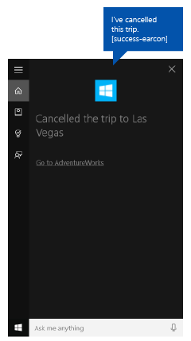

# Vínculo profundo desde Cortana para una aplicación en segundo plano


**API importantes**

-   [**Windows.ApplicationModel.VoiceCommands**](https://msdn.microsoft.com/library/windows/apps/dn706594)
-   [**Elementos y atributos de Definición de comando de voz (VCD) v1.2**](https://msdn.microsoft.com/library/windows/apps/dn706593)

Proporciona vínculos profundos desde una aplicación en segundo plano en **Cortana** que inician la aplicación en primer plano en un contexto o un estado determinado.

> **Nota**  
Tanto **Cortana** como el servicio de la aplicación en segundo plano finalizan cuando se inicia la aplicación en primer plano.

Se muestra un vínculo profundo de manera predeterminada en la pantalla de finalización de **Cortana**, que se muestra aquí ("Ir a AdventureWorks"), pero puedes mostrar vínculos profundos en otras pantallas diferentes. 


**Requisitos previos:  **

Este tema se basa en [Interactuar con una aplicación en segundo plano en Cortana](interact-with-a-background-app-in-cortana.md). Seguimos usando una aplicación de administración y planeación de viajes llamada **Adventure Works** para mostrar diversas funciones de **Cortana**.

Si acabas de empezar a desarrollar aplicaciones de la Plataforma universal de Windows (UWP), consulta estos temas para familiarizarte con las tecnologías presentadas aquí.

-   [Crear tu primera aplicación](https://msdn.microsoft.com/library/windows/apps/bg124288)
-   Encontrarás más información acerca de los eventos, en [Introducción a eventos y eventos enrutados](https://msdn.microsoft.com/library/windows/apps/mt185584).

**Directrices sobre la experiencia del usuario:  **

Consulta [Directrices para el diseño de Cortana](https://msdn.microsoft.com/library/windows/apps/dn974233) para obtener información sobre cómo integrar tu aplicación con **Cortana** y [Directrices para el diseño de voz](https://msdn.microsoft.com/library/windows/apps/dn596121) para obtener sugerencias prácticas y diseñar una aplicación habilitada para la voz que sea útil y atractiva.

## <span id="Overview"></span><span id="overview"></span><span id="OVERVIEW"></span>Información general


Los usuarios pueden tener acceso a la aplicación mediante **Cortana** al:

-   Activarla como una aplicación en primer plano (consulta [Activar una aplicación en primer plano con los comandos de voz a través de Cortana](launch-a-foreground-app-with-voice-commands-in-cortana.md)).
-   Exponer funciones específicas como un servicio de la aplicación de segundo plano (consulta [Activar una aplicación en segundo plano con los comandos de voz a través de Cortana](launch-a-background-app-with-voice-commands-in-cortana.md)).
-   Crear vínculos profundos a páginas, contenido y estado o contexto específicos.

Analizaremos aquí la vinculación profunda.

La vinculación profunda es útil cuando Cortana y el servicio de la aplicación actúan como una puerta de enlace a tu aplicación con todas las funciones (en lugar de obligar al usuario a iniciar la aplicación a través del menú Inicio) o para proporcionar acceso a más detalles y funcionalidades dentro de la aplicación que no están disponibles a través de Cortana. La vinculación profunda es otra forma de aumentar la facilidad de uso y promocionar tu aplicación.

Hay tres formas de ofrecer vínculos profundos:

-   El vínculo "Ir a &lt;aplicación&gt;" en diversas pantallas de **Cortana**.
-   Un vínculo incrustado en un icono de contenido en diversas pantallas de **Cortana**.
-   Inicio mediante programación de la aplicación en primer plano desde el servicio de la aplicación en segundo plano.

## <span id="Go_to__app__deep_link"></span><span id="go_to__app__deep_link"></span><span id="GO_TO__APP__DEEP_LINK"></span>Vínculo profundo "Ir a &lt;aplicación&gt;"


**Cortana** muestra el vínculo profundo "Ir a &lt;aplicación&gt;" bajo de la tarjeta de contenido en la mayoría de las pantallas.



Puedes proporcionar un argumento de inicio para este vínculo que abra tu aplicación en un contexto similar al del servicio de la aplicación. Si no proporcionas un argumento de inicio, la aplicación se inicia en la pantalla principal.

En este ejemplo de AdventureWorksVoiceCommandService.cs de la muestra **AdventureWorks**, pasamos el destino especificado en el método SendCompletionMessageForDestination, que recupera todos los viajes coincidentes y proporciona un vínculo profundo a la aplicación.

Primero, creamos un [ **VoiceCommandUserMessage** ](https://msdn.microsoft.com/library/windows/apps/windows.applicationmodel.voicecommands.voicecommandusermessage.aspx) (```userMessage```) que es dicho por **Cortana** y que se muestran en lienzo de **Cortana**. Luego se crea un objeto lista [**VoiceCommandContentTile**](https://msdn.microsoft.com/library/windows/apps/windows.applicationmodel.voicecommands.voicecommandcontenttile.aspx) para mostrar la colección de tarjetas de resultado en el lienzo. 

Estos dos objetos luego se pasan al método [CreateResponse](https://msdn.microsoft.com/library/windows/apps/windows.applicationmodel.voicecommands.voicecommandresponse.createresponse.aspx) del objeto [ **VoiceCommandResponse** ](https://msdn.microsoft.com/library/windows/apps/dn974182)(```response```). A continuación, establecemos el valor de propiedad [ **AppLaunchArgument** ](https://msdn.microsoft.com/library/windows/apps/dn974183) al valor de destino en el comando de voz.

Por último, llamamos al método [ **ReportSuccessAsync** ](https://msdn.microsoft.com/library/windows/apps/dn706580) de la [ **VoiceCommandServiceConnection**](https://msdn.microsoft.com/library/windows/apps/dn974204).

```csharp
/// <summary>
/// Show details for a single trip, if the trip can be found. 
/// This demonstrates a simple response flow in Cortana.
/// </summary>
/// <param name="destination">The destination specified in the voice command.</param>
private async Task SendCompletionMessageForDestination(string destination)
{
...
    IEnumerable<Model.Trip> trips = store.Trips.Where(p => p.Destination == destination);

    var userMessage = new VoiceCommandUserMessage();
    var destinationsContentTiles = new List<VoiceCommandContentTile>();
...
    var response = VoiceCommandResponse.CreateResponse(userMessage, destinationsContentTiles);

    if (trips.Count() > 0)
    {
        response.AppLaunchArgument = destination;
    }

    await voiceServiceConnection.ReportSuccessAsync(response);
}
```


## <span id="Content_tile_deep_link"></span><span id="content_tile_deep_link"></span><span id="CONTENT_TILE_DEEP_LINK"></span>Vínculo profundo de icono de contenido


Puedes agregar vínculos profundos a las tarjetas de contenido en varias de las pantallas de **Cortana**.


Al igual que los vínculos "Ir a &lt;aplicación&gt;", puedes proporcionar un argumento de inicio para abrir la aplicación con un contexto similar al del servicio de la aplicación. Si no proporcionas un argumento de inicio, el icono de contenido no se vincula a la aplicación.

En este ejemplo de AdventureWorksVoiceCommandService.cs de la muestra **AdventureWorks**, pasamos el destino especificado en el método SendCompletionMessageForDestination, que recupera todos los viajes coincidentes y proporciona tarjetas de contenido con vínculos profundos a la aplicación.

Primero, creamos un [ **VoiceCommandUserMessage** ](https://msdn.microsoft.com/library/windows/apps/windows.applicationmodel.voicecommands.voicecommandusermessage.aspx) (```userMessage```) que es dicho por **Cortana** y que se muestran en lienzo de **Cortana**. Luego se crea un objeto lista [**VoiceCommandContentTile**](https://msdn.microsoft.com/library/windows/apps/windows.applicationmodel.voicecommands.voicecommandcontenttile.aspx) para mostrar la colección de tarjetas de resultado en el lienzo. 

Estos dos objetos luego se pasan al método [CreateResponse](https://msdn.microsoft.com/library/windows/apps/windows.applicationmodel.voicecommands.voicecommandresponse.createresponse.aspx) del objeto [ **VoiceCommandResponse** ](https://msdn.microsoft.com/library/windows/apps/dn974182)(```response```). A continuación, establecemos el valor de propiedad [ **AppLaunchArgument** ](https://msdn.microsoft.com/library/windows/apps/dn974183) al valor de destino en el comando de voz.

Por último, llamamos al método [ **ReportSuccessAsync** ](https://msdn.microsoft.com/library/windows/apps/dn706580) de la [ **VoiceCommandServiceConnection**](https://msdn.microsoft.com/library/windows/apps/dn974204).
Aquí, agregamos dos iconos de contenido con diferentes valores de parámetro [**AppLaunchArgument**](https://msdn.microsoft.com/library/windows/apps/dn974183) para una lista [**VoiceCommandContentTile**](https://msdn.microsoft.com/library/windows/apps/dn974168) usada en la llamada [**ReportSuccessAsync**](https://msdn.microsoft.com/library/windows/apps/dn706580) del objeto [**VoiceCommandServiceConnection**](https://msdn.microsoft.com/library/windows/apps/dn974204).

```csharp
/// <summary>
/// Show details for a single trip, if the trip can be found. 
/// This demonstrates a simple response flow in Cortana.
/// </summary>
/// <param name="destination">The destination specified in the voice command.</param>
private async Task SendCompletionMessageForDestination(string destination)
{
    // If this operation is expected to take longer than 0.5 seconds, the task must
    // supply a progress response to Cortana before starting the operation, and
    // updates must be provided at least every 5 seconds.
    string loadingTripToDestination = string.Format(
               cortanaResourceMap.GetValue("LoadingTripToDestination", cortanaContext).ValueAsString,
               destination);
    await ShowProgressScreen(loadingTripToDestination);
    Model.TripStore store = new Model.TripStore();
    await store.LoadTrips();

    // Query for the specified trip. 
    // The destination should be in the phrase list. However, there might be  
    // multiple trips to the destination. We pick the first.
    IEnumerable<Model.Trip> trips = store.Trips.Where(p => p.Destination == destination);

    var userMessage = new VoiceCommandUserMessage();
    var destinationsContentTiles = new List<VoiceCommandContentTile>();
    if (trips.Count() == 0)
    {
        string foundNoTripToDestination = string.Format(
               cortanaResourceMap.GetValue("FoundNoTripToDestination", cortanaContext).ValueAsString,
               destination);
        userMessage.DisplayMessage = foundNoTripToDestination;
        userMessage.SpokenMessage = foundNoTripToDestination;
    }
    else
    {
        // Set plural or singular title.
        string message = "";
        if (trips.Count() > 1)
        {
            message = cortanaResourceMap.GetValue("PluralUpcomingTrips", cortanaContext).ValueAsString;
        }
        else
        {
            message = cortanaResourceMap.GetValue("SingularUpcomingTrip", cortanaContext).ValueAsString;
        }
        userMessage.DisplayMessage = message;
        userMessage.SpokenMessage = message;

        // Define a tile for each destination.
        foreach (Model.Trip trip in trips)
        {
            int i = 1;
            
            var destinationTile = new VoiceCommandContentTile();

            destinationTile.ContentTileType = VoiceCommandContentTileType.TitleWith68x68IconAndText;
            destinationTile.Image = await StorageFile.GetFileFromApplicationUriAsync(new Uri("ms-appx:///AdventureWorks.VoiceCommands/Images/GreyTile.png"));

            destinationTile.AppLaunchArgument = trip.Destination;
            destinationTile.Title = trip.Destination;
            if (trip.StartDate != null)
            {
                destinationTile.TextLine1 = trip.StartDate.Value.ToString(dateFormatInfo.LongDatePattern);
            }
            else
            {
                destinationTile.TextLine1 = trip.Destination + " " + i;
            }

            destinationsContentTiles.Add(destinationTile);
            i++;
        }
    }

    var response = VoiceCommandResponse.CreateResponse(userMessage, destinationsContentTiles);

    if (trips.Count() > 0)
    {
        response.AppLaunchArgument = destination;
    }

    await voiceServiceConnection.ReportSuccessAsync(response);
}
```
## <span id="Programmatic_deep_link"></span><span id="programmatic_deep_link"></span><span id="PROGRAMMATIC_DEEP_LINK"></span>Vínculo profundo mediante programación


También puedes iniciar la aplicación mediante programación con un argumento de inicio que abra la aplicación con un contexto similar al del servicio de la aplicación. Si no proporcionas un argumento de inicio, la aplicación se inicia en la pantalla principal.

Aquí agregamos un parámetro [**AppLaunchArgument**](https://msdn.microsoft.com/library/windows/apps/dn974183) con un valor de "Las Vegas" a un objeto [**VoiceCommandResponse**](https://msdn.microsoft.com/library/windows/apps/dn974182) usado en la llamada [**RequestAppLaunchAsync**](https://msdn.microsoft.com/library/windows/apps/dn706581) del objeto [**VoiceCommandServiceConnection**](https://msdn.microsoft.com/library/windows/apps/dn974204).

```CSharp
var userMessage = new VoiceCommandUserMessage();
userMessage.DisplayMessage = "Here are your trips.";
userMessage.SpokenMessage = 
  "You have one trip to Vegas coming up.";

response = VoiceCommandResponse.CreateResponse(userMessage);
response.AppLaunchArgument = “Las Vegas”;
await  VoiceCommandServiceConnection.RequestAppLaunchAsync(response);
```

## <span id="App_manifest"></span><span id="app_manifest"></span><span id="APP_MANIFEST"></span>Manifiesto de la aplicación


Para habilitar la vinculación profunda en la aplicación, debes declarar la extensión `windows.personalAssistantLaunch` en el archivo Package.appxmanifest de tu proyecto de aplicación.

Aquí declaramos la extensión `windows.personalAssistantLaunch` para la aplicación **Adventure Works**.

```XML
<Extensions>
  <uap:Extension Category="windows.appService" 
    EntryPoint="AdventureWorks.VoiceCommands.AdventureWorksVoiceCommandService">
    <uap:AppService Name="AdventureWorksVoiceCommandService"/>
  </uap:Extension>
  <uap:Extension Category="windows.personalAssistantLaunch"/> 
</Extensions>
```

## <span id="Protocol_contract"></span><span id="protocol_contract"></span><span id="PROTOCOL_CONTRACT"></span>Contrato de protocolo


La aplicación se inicia en primer plano mediante la activación del identificador uniforme de recursos (URI) con un contrato [**Protocol**](https://msdn.microsoft.com/library/windows/apps/br224693). La aplicación debe invalidar el evento [**OnActivated**](https://msdn.microsoft.com/library/windows/apps/br242330) de la aplicación y buscar un **ActivationKind** de **Protocol**. Para obtener más información, consulta [Administrar la activación de URI](https://msdn.microsoft.com/library/windows/apps/mt228339).

A continuación, descodificamos el URI proporcionado por el [**ProtocolActivatedEventArgs**](https://msdn.microsoft.com/library/windows/apps/br224742) para obtener acceso al argumento de inicio. Para este ejemplo, el objeto [**Uri**](https://msdn.microsoft.com/library/windows/apps/br224746) se establece en "windows.personalassistantlaunch:?LaunchContext=Las Vegas".

```CSharp
if (args.Kind == ActivationKind.Protocol)
  {
    var commandArgs = args as ProtocolActivatedEventArgs;
    Windows.Foundation.WwwFormUrlDecoder decoder = 
      new Windows.Foundation.WwwFormUrlDecoder(commandArgs.Uri.Query);
    var destination = decoder.GetFirstValueByName("LaunchContext");

    navigationCommand = new ViewModel.TripVoiceCommand(
      "protocolLaunch",
      "text",
      "destination",
      destination);

    navigationToPageType = typeof(View.TripDetails);

    rootFrame.Navigate(navigationToPageType, navigationCommand);

    // Ensure the current window is active.
    Window.Current.Activate();
  }
```

## <span id="related_topics"></span>Artículos relacionados


**Desarrolladores**
* [Interacciones de Cortana](cortana-interactions.md)
* [**VCD elements and attributes v1.2 (Elementos y atributos de VCD v1.2)**](https://msdn.microsoft.com/library/windows/apps/dn706593)

**Diseñadores**
* [Directrices para el diseño de Cortana](https://msdn.microsoft.com/library/windows/apps/dn974233)
* [Directrices para el diseño de Voz](https://msdn.microsoft.com/library/windows/apps/dn596121)

**Muestras**
* [Muestra de comando de voz de Cortana](http://go.microsoft.com/fwlink/p/?LinkID=619899)
 

 


<!--HONumber=May16_HO2-->


