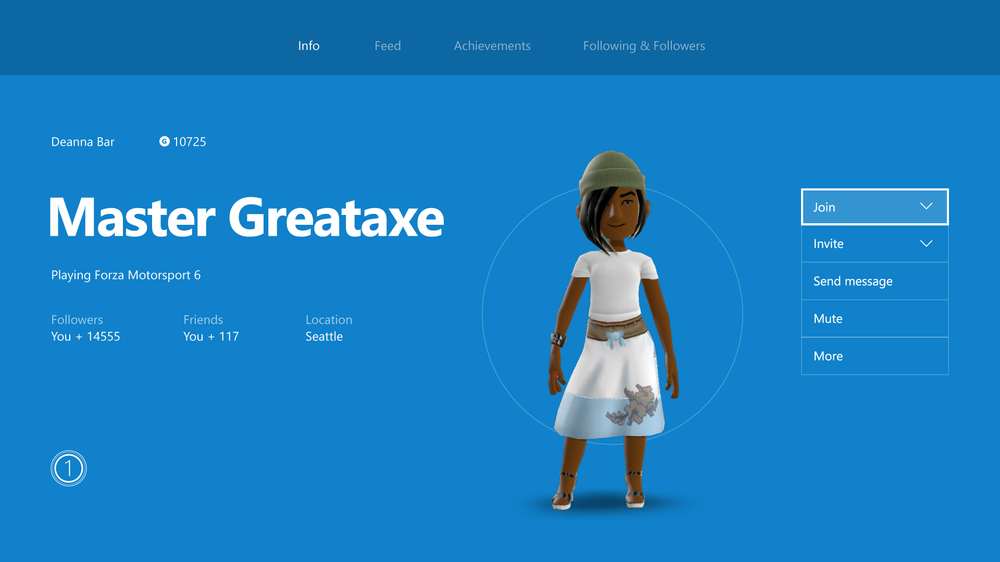
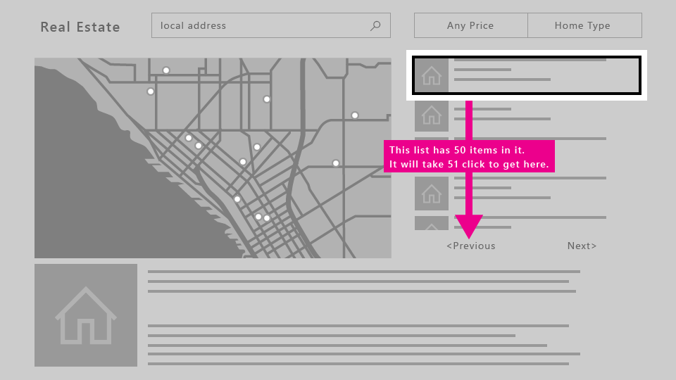
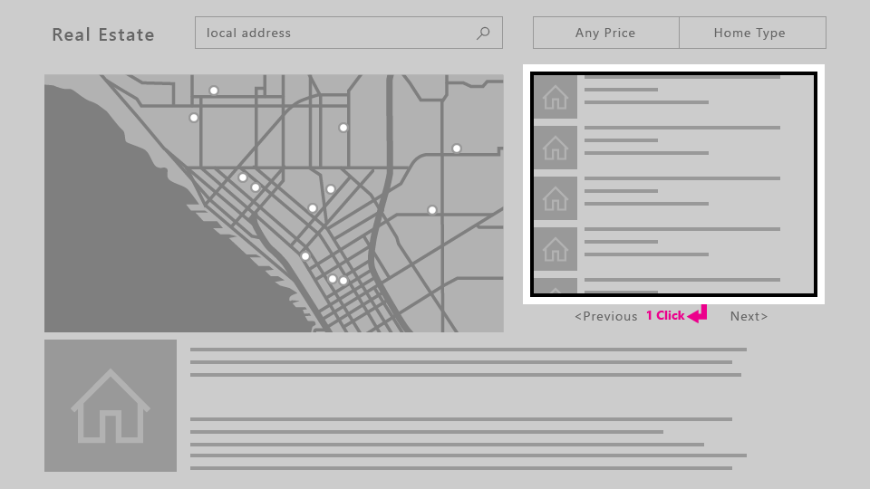
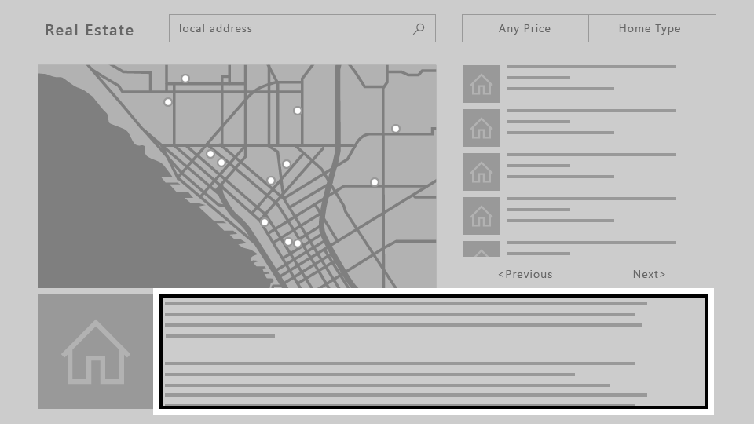
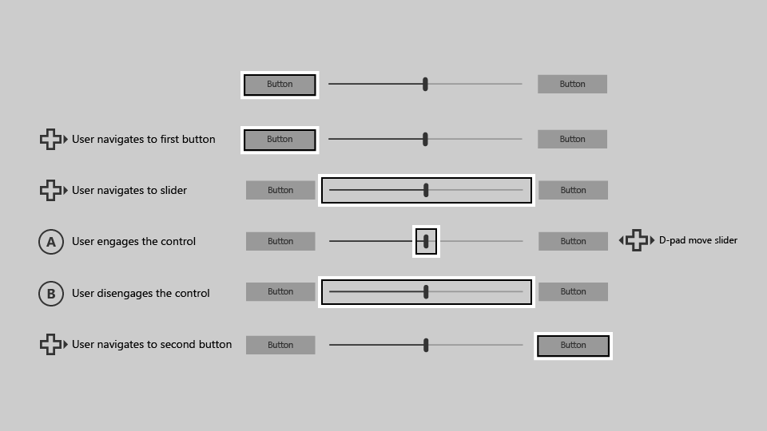
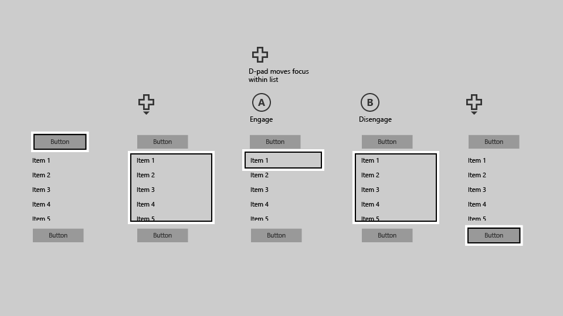
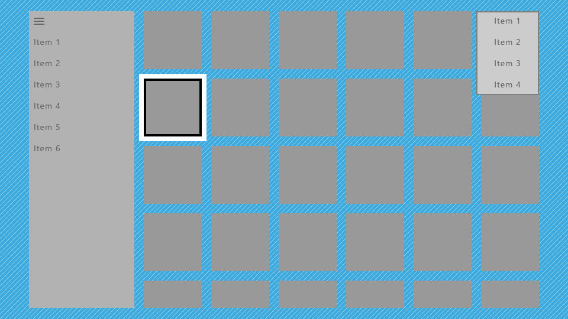

> \[Este artículo describe una característica que aún no está disponible. Esta característica puede sufrir grandes modificaciones antes del lanzamiento de su versión comercial. Microsoft no ofrece ninguna garantía, expresa o implícita, con respecto a la información que se ofrece aquí.\]

# Diseño para Xbox y televisión

Aprende a diseñar tu aplicación para la Plataforma universal de Windows (UWP) de manera que se vea y funcione bien en la Xbox One y las pantallas de televisión.

## Información general

La Plataforma universal de Windows (UWP) te permite crear experiencias agradables en varios dispositivos de Windows 10. 
La mayoría de la funcionalidad proporcionada por el entorno de desarrollo UWP les permite a las aplicaciones usar la misma interfaz de usuario (UI) en cualquiera de estos dispositivos, sin realizar ningún trabajo adicional. 
Sin embargo, personalizar y optimizar tu aplicación para que funcione bien en Xbox One y pantallas de televisión requiere consideraciones especiales.

La experiencia de estar sentado en tu sofá al otro lado de la sala, con un controlador para juegos o control remoto para interactuar con tu televisor, se llama la **experiencia de 10 pies**. 
Se denomina así porque el usuario generalmente está sentado aproximadamente a 10 pies de distancia de la pantalla. 
Esto proporciona desafíos que no están presentes, por ejemplo, en la experiencia de *2 pies* o interactuando con un PC. 
Si estás desarrollando una aplicación para Xbox One o cualquier otro dispositivo que se muestra en una pantalla de TV y usa un controlador para la entrada, siempre debes tener esto en cuenta.

No todos los pasos de este artículo son necesarios para que tu aplicación funcione bien en experiencias de 10 pies, pero entenderlos y tomar las decisiones apropiadas para tu aplicación dará como resultado una mejor experiencia de 10 pies adaptada a las necesidades específicas de tu aplicación. 
Al traer a la vida a tu aplicación en el entorno de 10 pies, ten en cuenta los siguientes principios de diseño.

### Simple

El diseño para el entorno de 10 pies presenta un conjunto único de desafíos. La resolución y distancia de visualización pueden dificultar a la gente el procesar demasiada información. 
Intenta mantener tu diseño limpio y reducido a los componentes más simples posibles. La cantidad de información que se muestra en un televisor debe ser comparable a lo que verías en un teléfono móvil, más que en un equipo de escritorio.


### Coherente

Las aplicaciones para UWP en el entorno de 10 pies deben ser intuitivas y fáciles de usar. Haz que el enfoque sea claro e inequívoco. 
Organiza el contenido para que el movimiento a través del espacio sea consistente y predecible. Dale a las personas la ruta más corta hacia lo quieran hacer.


_**Todas las películas que se muestran en la captura de pantalla están disponibles en Películas y TV de Microsoft.**_  

### Fascinantes

Las experiencias más envolventes y cinematográficas realizadas en la pantalla grande. Los escenarios de extremo a extremo, el movimiento elegante y un vibrante uso del color y la tipografía llevan tus aplicaciones al siguiente nivel. Sea valiente y hermoso.



### Optimizaciones para la experiencia de 10 pies

Ahora que conoces los principios del buen diseño de aplicaciones para experiencia de 10 pies en UWP, lee la siguiente información general sobre las formas específicas en las puedes optimizar tu aplicación y proporcionar una gran experiencia al usuario.

| Función        | Descripción           |
| -------------------------------------------------------------- |--------------------------------|
| [Controlador para juegos y control remoto](#gamepad-and-remote-control)      | Asegurarse de que la aplicación funcione bien tanto con el controlador para juegos como con el control remoto es el paso más importante en la optimización de experiencias de 10 pies. Hay varias mejoras específicas para los controladores para juegos y los controles remotos que puedes hacer para optimizar la interacción con el usuario en un dispositivo en el que sus acciones son un poco limitadas. |
| [Interacción y navegación con foco XY](#xy-focus-navigation-and-interaction) | El UWP proporciona **navegación con foco XY** la cual permite al usuario navegar por la interfaz de usuario de tu aplicación. Sin embargo, esto limita al usuario a navegar hacia arriba, abajo, izquierda y derecha. En esta sección se describen recomendaciones para lidiar con esta y otras consideraciones. |
| [Modo de mouse](#mouse-mode)|En algunas interfaces de usuario, tales como mapas y superficies de dibujo, no es posible o práctico usar la navegación con foco XY. Para estas interfaces, UWP proporciona el **modo de mouse** para permitir al controlador para juegos y al control remoto navegar libremente, como el mouse de un equipo de escritorio.|
| [Foco visual](#focus-visual)  | El foco visual es el borde alrededor del elemento de interfaz de usuario que actualmente tiene el foco. Esto ayuda a orientar al usuario para que pueda navegar fácilmente por tu interfaz de usuario sin perderse. Si el foco no está claramente visible, el usuario podría perderse en tu interfaz de usuario y no tener una gran experiencia.  |
| [Participación del foco](#focus-engagement) | Configurar la participación del foco en un elemento de interfaz de usuario requiere que el usuario presione el botón **A/seleccionar** para interactuar con él. Esto puede ayudar a crear una mejor experiencia para el usuario cuando navegue por la interfaz de usuario de la aplicación.
| [Variación del tamaño del elemento de la interfaz de usuario](#ui-element-sizing)  | La Plataforma universal de Windows usa [píxeles efectivos y ajuste de escala](..\layout\design-and-ui-intro.md#effective-pixels-and-scaling) para escalar la interfaz de usuario según la distancia de visualización. Entender la variación de tamaño y aplicarla a toda tu interfaz de usuario te ayudarán a optimizar tu aplicación para el entorno de 10 pies.  |
|  [Zona segura del televisor](#tv-safe-area) | La UWP automáticamente evitará mostrar cualquier interfaz de usuario en áreas no seguras de los televisores (áreas cercanas a los bordes de la pantalla) de forma predeterminada. Sin embargo, esto crea un efecto de "encajonamiento" en la que la interfaz de usuario queda encerrada por un marco. Para que tu aplicación sea verdaderamente envolvente en el televisor, es conveniente modificarla para que se extiende hasta los bordes de la pantalla en los televisores que lo admiten. |
| [Colores](#colors)  |  La UWP admite temas de colores y una aplicación que respeta el tema del sistema tendrá como valor predeterminado **oscuro** en Xbox One. Si tu aplicación tiene un tema de color específico, debes tener en cuenta que algunos colores no funcionan bien en los televisores y deben evitarse. |
| [Sonido](../style/sound.md)    | Los sonidos desempeñan un papel esencial en la experiencia de 10 pies, ya que ayudan a sumergir y a proporcionar información al usuario. El UWP proporciona funciones que activan automáticamente los sonidos de los controles habituales cuando la aplicación se ejecuta en Xbox One. Obtén más información sobre la compatibilidad de audio integrada en el UWP y descubre cómo sacarle provecho.    |
| [Directrices sobre controles de la interfaz de usuario](#guidelines-for-ui-controls)  |  Hay varios controles de interfaz de usuario que funcionan bien en varios dispositivos, pero tienen ciertas consideraciones cuando se usan en televisores. Obtén información sobre algunos procedimientos recomendados para usar estos controles al diseñar la experiencia de 10 pies. |

<!--[elcowle] We may uncomment this now that the Sound article is live-->
<!--| [Sound](../style/sound.md)  |  Sounds play a key role in the 10-foot experience, helping to immerse and give feedback to the user. The UWP provides functionality that automatically turns on sounds for common controls when the app is running on Xbox One. Find out more about the sound support built into the UWP and learn how to take advantage of it. |-->

## Controlador para juegos y control remoto

Al igual que el teclado y el mouse son para el PC y la entrada táctil es para el teléfono y la tableta, el controlador para juegos y el control remoto son los dispositivos de entrada principales para la experiencia de 10 pies. 
Esta sección presenta los botones de hardware y qué es lo que hacen. 
En [Interacción y navegación con foco XY](#xy-focus-navigation-and-interaction) y [Modo de mouse](#mouse-mode), aprenderás a optimizar tu aplicación al usar estos dispositivos de entrada.

La calidad del controlador para juegos y el comportamiento del control remoto que obtienes a priori depende de qué tanto soporte le dé tu aplicación al teclado. Una buena forma de asegurarte de que tu aplicación funcionará bien con el controlador para juegos/control remoto es asegurarte de que funciona bien con el teclado del equipo y, a continuación, usar el controlador para juegos/control remoto para buscar puntos débiles en tu interfaz de usuario.

### Botones de hardware

En este documento, se hará referencia a los botones mediante los nombres asignados en el siguiente diagrama.


Como puedes ver en el diagrama, hay algunos botones que son compatibles con el controlador para juegos pero que no son compatibles con el control remoto y viceversa. Si bien puedes usar botones que solo se admiten en un dispositivo de entrada para agilizar la navegación por la interfaz de usuario, ten en cuenta que usarlos para las interacciones críticas puede crear una situación en la que el usuario no pueda interactuar con determinadas partes de la interfaz de usuario.

La siguiente tabla enumera todos los botones de hardware compatibles con las aplicaciones para UWP y cuál dispositivo de entrada es compatible con ellos.

| Botón                    | Controlador para juegos   | Control remoto    |
|---------------------------|-----------|-------------------|
| A/Botón de selección           | Sí       | Sí               |
| Botón B/Atrás             | Sí       | Sí               |
| Pad direccional (pad-D)   | Sí       | Sí               |
| Botón de menú               | Sí       | Sí               |
| Botón de vista               | Sí       | Sí               |
| Botones X e Y           | Sí       | No                |
| Palanca izquierda                | Sí       | No                |
| Palanca hacia la derecha               | Sí       | No                |
| Desencadenadores izquierdo y derecho   | Sí       | No                |
| Reboteadores izquierdo y derecho    | Sí       | No                |
| Botón OneGuide           | No        | Sí               |
| Botón de Volumen             | No        | Sí               |
| Botón de canal            | No        | Sí               |
| Botones de control de medios     | No        | Sí               |
| Botón de silencio               | No        | Sí               |

### Soporte para botones incorporado

La UWP asigna automáticamente el comportamiento de entrada del teclado existente al controlador para juegos y al control remoto. La siguiente tabla enumera estas asignaciones integradas.

| Teclado              | Controlador para juegos/control remoto                        |
|-----------------------|---------------------------------------|
| Teclas de dirección            | Pad-D (también la palanca izquierda en el controlador para juegos)    |
| Barra espaciadora              | A/Botón de selección                       |
| Entrar                 | A/Botón de selección                       |
| Escape                | Botón B/Atrás*                        |

\*Cuando la aplicación no maneja los eventos [KeyDown](https://msdn.microsoft.com/library/windows/apps/br208941) ni [KeyUp](https://msdn.microsoft.com/en-us/library/windows/apps/windows.ui.xaml.uielement.keyup.aspx) del botón B, se desencadenará el evento [SystemNavigationManager.BackRequested](https://msdn.microsoft.com/en-us/library/windows/apps/windows.ui.core.systemnavigationmanager.backrequested.aspx), lo que producirá una navegación hacia atrás dentro de la aplicación.

### Soporte para aceleradores

Los botones aceleradores son botones que pueden usarse para aumentar la velocidad de navegación a través de una interfaz de usuario. Sin embargo, estos botones pueden ser exclusivos para un determinado dispositivo de entrada, por lo tanto, ten en cuenta que no todos los usuarios podrán usar estas funciones. De hecho, el controlador para juegos es el único dispositivo de entrada que actualmente admite las funciones de aceleradores en aplicaciones para UWP en Xbox One.

La siguiente tabla enumera la compatibilidad con aceleradores integrada en la UWP, así como también la que puedes implementar por tu cuenta. Usa estos comportamientos en tu interfaz de usuario personalizada para brindar una experiencia de usuario coherente y agradable.

| Interacción   | Teclado   | Controlador para juegos      | Integrada para:  | Recomendada para: |
|---------------|------------|--------------|----------------|------------------|
| Movimiento panorámico       | Ninguno       | Palanca hacia la derecha  | Ninguno           |      [ScrollViewer](https://msdn.microsoft.com/en-us/library/windows/apps/windows.ui.xaml.controls.scrollviewer.aspx) |
| Retroceder/avanzar página  | Retroceder/avanzar página | Desencadenadores izquierdo/derecho | Ninguno | `ScrollViewer` y lista/cuadrícula
| Página a la izquierda/derecha | Ninguno | Reboteadores izquierdo/derecho | [Control dinámico](https://msdn.microsoft.com/en-us/library/windows/apps/windows.ui.xaml.controls.pivot.aspx) | `ScrollViewer`
| Acercar/alejar        | Ctrl +/- | Desencadenadores izquierdo/derecho | `ScrollViewer` | Vistas que admiten acercamiento y alejamiento

## Interacción y navegación con foco XY

Si tu aplicación admite una navegación del foco adecuada para el teclado, esto se trasladará bien al controlador para juegos y al control remoto. 
La navegación con las teclas de dirección se asigna al **pad-D** (así como a la **palanca izquierda** en el controlador para juegos), y la interacción con los elementos de la interfaz de usuario se asigna a la tecla **Entrar/Seleccionar** (ver [Controlador para juegos y control remoto](#gamepad-and-remote-control)). Para obtener directrices de diseño para teclado, consulta [Interacciones con el teclado](keyboard-interactions.md).

Si la compatibilidad con el teclado se implementa correctamente, tu aplicación funcionará razonablemente bien; sin embargo, esto puede requerir algo más de trabajo para admitir todos los escenarios. Piensa en las necesidades específicas de tu aplicación para proporcionar la mejor experiencia posible para el usuario.

### Interfaz de usuario accesible

Dado que la navegación con foco XY limita al usuario a moverse hacia arriba, abajo, izquierda y derecha, puedes terminar con escenarios en donde algunas partes de la interfaz de usuario no son accesibles. 
El siguiente diagrama ilustra un ejemplo de tipo de diseño de interfaz de usuario que no admite la navegación con foco XY. 
Observa cómo el elemento en el medio es inaccesible mediante un controlador para juegos/control remoto porque se le dará prioridad a la navegación vertical y horizontal y el elemento central nunca tendrá la prioridad suficiente para obtener el foco.


Si por algún motivo no es posible reorganizar la interfaz de usuario, usa una de las técnicas que se describen en la siguiente sección para reemplazar el comportamiento predeterminado del foco.

### Reemplazo de la navegación predeterminada <a name="overriding-the-default-navigation"></a>

Si bien la UWP intenta garantizar que la navegación del pad-D/palanca izquierda tenga sentido para el usuario, no puede garantizar un comportamiento optimizado para las intenciones de tu aplicación. 
La mejor manera de garantizar una navegación optimizada para tu aplicación es probarla con un controlador para juegos y confirmar que el usuario pueda acceder a cada elemento de la interfaz de usuario de una manera que tenga sentido para escenarios de tu aplicación. En caso de que alguno de los escenarios de tu aplicación requiera un comportamiento que no se obtiene a través de la navegación con foco XY proporcionada, considera las recomendaciones en las siguientes secciones y/o reemplaza el comportamiento para colocar el foco en un elemento lógico.

El siguiente fragmento de código muestra cómo puedes invalidar el comportamiento de navegación con foco XY:

```xml
<StackPanel>
    <Button x:Name="MyBtnLeft" 
            Content="Search" />
    <Button x:Name="MyBtnRight" 
            Content="Delete"/>
    <Button x:Name="MyBtnTop" 
            Content="Update" />
    <Button x:Name="MyBtnDown" 
            Content="Undo" />
    <Button Content="Home"  
            XYFocusLeft="{x:Bind MyBtnLeft}" 
            XYFocusRight="{x:Bind MyBtnRight}"
            XYFocusDown="{x:Bind MyBtnDown}"
            XYFocusUp="{x:Bind MyBtnTop}" />
</StackPanel>
```

En este caso, cuando el foco esté en el botón `Home` y el usuario navegue a la izquierda, el enfoque se moverá al botón `MyBtnLeft`; si el usuario navega a la derecha, el enfoque se moverá hacia el botón `MyBtnRight`; y así sucesivamente.

Para evitar que el foco se vaya de un control en una dirección determinada, usa la propiedad `XYFocus*` para que apunte al mismo control:

```xml
<Button Name="HomeButton"  
        Content="Home"  
        XYFocusLeft ="{x:Bind HomeButton}" />
```

### El camino de menos clics <a name="path-of-least-clicks"></a>

Intenta permitirle al usuario realizar las tareas más comunes en el menor número de clics. En el siguiente ejemplo, el [TextBlock](https://msdn.microsoft.com/en-us/library/windows/apps/windows.ui.xaml.controls.textblock.aspx) se coloca entre el botón **Reproducir** (que inicialmente obtiene el foco) y un elemento usado frecuentemente, para que se coloque un elemento innecesario entre tareas con prioridad.


En cambio, en el siguiente ejemplo, el [TextBlock](https://msdn.microsoft.com/en-us/library/windows/apps/windows.ui.xaml.controls.textblock.aspx) se coloca encima del botón **Reproducir**. 
Simplemente reorganizar la interfaz de usuario para que no queden elementos innecesarios entre tareas con una prioridad mejorará en gran medida la facilidad de uso de tu aplicación.


### CommandBar y ContextFlyout

Cuando se usa [CommandBar](https://msdn.microsoft.com/en-us/library/windows/apps/windows.ui.xaml.controls.commandbar.aspx), ten en cuenta el problema de desplazamiento por una lista, como se mencionó en [Problema: elementos de la interfaz de usuario ubicados después de una cuadrícula/lista de desplazamiento larga](#problem-ui-elements-located-after-long-scrolling-list-grid). La siguiente imagen muestra un diseño de interfaz de usuario con `CommandBar` en la parte inferior de la lista/cuadrícula. El usuario tendría que desplazarse hacia abajo de todo por la lista/cuadrícula para llegar a la `CommandBar`.


¿Qué ocurre si colocas `CommandBar`*por encima* de la lista/cuadrícula? Si bien un usuario que se desplazó hacia abajo de la lista/cuadrícula tendría que desplazarse nuevamente hacia arriba para llegar a la `CommandBar`, se trata de una navegación ligeramente más corta que en la configuración anterior. Ten en cuenta que esto es suponiendo que el foco inicial de tu aplicación se sitúe junto a o encima de `CommandBar`; este enfoque no funcionará si el foco inicial se encuentra por debajo de la lista/cuadrícula. Si estos elementos de la `CommandBar` son elementos de acción global a los que no se accede muy a menudo (como un botón de **sincronización**), puede ser aceptable que se ubiquen encima de la lista/cuadrícula.

Si tu aplicación tiene una `CommandBar` cuyos elementos necesitan ser fácilmente accesibles para los usuarios, es aconsejable que consideres colocar estos elementos dentro de un `ContextFlyout` y quitarlos de la `CommandBar`. 

Si bien no se pueden apilar los elementos de una `CommandBar` verticalmente, colocarlos contra la dirección del desplazamiento (por ejemplo, a la izquierda o derecha de una lista con desplazamiento vertical, o en la parte superior o inferior de una lista de desplazamiento horizontal) es otra opción que podrías considerar si funciona bien para el diseño de tu interfaz de usuario.

### Desafíos en el diseño de la interfaz de usuario

Algunos diseños de interfaz de usuario son más desafiantes debido a la naturaleza de la navegación con foco XY y deben evaluarse caso por caso. Si bien no hay una única forma "correcta" y la solución que elijas depende de las necesidades específicas de tu aplicación, hay algunas técnicas que puedes emplear para brindar una gran experiencia en el televisor.

Para comprender mejor esto, echemos un vistazo a una aplicación imaginaria que muestra algunos de estos problemas y las técnicas para resolverlos.

> **Nota**
            &nbsp;&nbsp;Esta aplicación imaginaria pretende ilustrar los problemas en la interfaz de usuario y sus posibles soluciones y no está pensada para mostrar la mejor experiencia de usuario para tu aplicación en particular.

La siguiente es una aplicación inmobiliaria imaginaria que muestra una lista de viviendas disponibles para la venta, un mapa, una descripción de la propiedad y demás información. Esta aplicación presenta tres desafíos que puedes superar mediante el uso de las siguientes técnicas:

- [Reorganizar la interfaz de usuario](#ui-rearrange)
- [Participación del foco](#engagement)
- [Modo de mouse](#mouse-mode)


#### Problema: algunos elementos de la interfaz de usuario se encuentran después de una cuadrícula/lista de desplazamiento larga <a name="problem-ui-elements-located-after-long-scrolling-list-grid"></a>

La [ListView](https://msdn.microsoft.com/en-us/library/windows/apps/windows.ui.xaml.controls.listview.aspx) de las propiedades que se muestra en la siguiente imagen es una lista con desplazamiento muy larga. Si la [participación](#focus-engagement) *no* se requiere en la `ListView`, cuando el usuario navegue a la lista, el foco se colocará en el primer elemento en la lista. Para que el usuario llegue al botón **anterior** o **siguiente**, deberá pasar por todos los elementos de la lista. En casos como este en el que resulta difícil solicitarle al usuario que recorra toda la lista (es decir, cuando la lista no es lo suficientemente corta como para que esta experiencia sea aceptable) sería conveniente considerar otras opciones.



#### Soluciones

##### Reorganizar la interfaz de usuario <a name="ui-rearrange"></a>

A menos que tu foco inicial se coloque en la parte inferior de la página, los elementos de la interfaz de usuario colocados encima de una lista con desplazamiento larga son por lo general más accesibles que si se encuentran debajo. 
Si este nuevo diseño funciona para los otros dispositivos, cambiar el diseño para todas las familias de dispositivos en lugar de hacer cambios especiales a la interfaz de usuario solo para Xbox One puede ser un enfoque menos costoso. 
Además, colocar los elementos de la interfaz de usuario en contra de la dirección de desplazamiento (es decir, horizontalmente a una lista de desplazamiento vertical, o verticalmente a una lista de desplazamiento horizontal) mejorará aún más la accesibilidad.


##### Participación del foco <a name="engagement"></a>

Cuando se *requiere* la participación, todo la `ListView` se convierte en un objeto de foco único. El usuario podrá saltear el contenido de la lista para ir al siguiente elemento activable. Lee más acerca de los controles que admiten participación y cómo usarlos en [Participación del foco](#focus-engagement).



#### Problema: ScrollViewer sin elementos activables

Como la navegación con foco XY depende de la navegación a un elemento de interfaz de usuario activable cada vez, un [ScrollViewer](https://msdn.microsoft.com/en-us/library/windows/apps/windows.ui.xaml.controls.scrollviewer.aspx) que no contiene elementos activables (como con solo texto, al igual que en este ejemplo) puede desencadenar un escenario en el que el usuario no puede ver todo el contenido del `ScrollViewer`. 
Consulta las soluciones para este y otros escenarios relacionados en [Participación del foco](#focus-engagement).



#### Problema: Interfaz de usuario de desplazamiento libre

Cuando tu aplicación requiera una interfaz de usuario de desplazamiento libre, como por ejemplo una superficie de dibujo o, en este ejemplo, un mapa, la navegación con foco XY simplemente no funciona. 
En estos casos, puedes activar el [modo de mouse](#mouse-mode) para permitir que el usuario pueda navegar libremente dentro de un elemento de la interfaz de usuario.


## Modo de mouse

Como se describe en [Interacción y navegación con foco XY](#xy-focus-navigation-and-interaction), en Xbox One el foco se mueve mediante un sistema de navegación XY, el cual permite al usuario cambiar el foco desde un control a otro desplazándose hacia arriba, abajo, izquierda y derecha. 
Sin embargo, algunos controles, como [WebView](https://msdn.microsoft.com/en-us/library/windows/apps/windows.ui.xaml.controls.webview.aspx) y [MapControl](https://msdn.microsoft.com/en-us/library/windows/apps/windows.ui.xaml.controls.maps.mapcontrol.aspx), requieren una interacción de mouse en la que los usuarios pueden mover libremente el puntero dentro de los límites del control. 
También hay algunas aplicaciones en las que tiene sentido que el usuario pueda mover el puntero por toda la página, haciendo que los usuarios tengan con un controlador para juegos/control remoto una experiencia similar a lo que pueden encontrar en un equipo con un mouse.

Para estos escenarios, debes solicitar un puntero (modo de mouse) para toda la página, o para un control dentro de una página. 
Por ejemplo, la aplicación podría tener una página que tenga un control `WebView` que use el modo de mouse solo mientras se esté dentro del control y la navegación con foco XY en cualquier otro lado. 
Para solicitar un puntero, puedes especificar si lo quieres **cuando se activa una página o control** o **cuando la página tiene el foco**.

> **Nota**
            &nbsp;&nbsp;No se admiten solicitudes de un puntero cuando un control obtiene el foco.

El siguiente diagrama muestra las asignaciones de los botones del controlador para juegos/control remoto en modo de mouse.


> **Nota**
            &nbsp;&nbsp;El modo de mouse solo se admite en Xbox One con controlador para juegos/control remoto. En las otras familias de dispositivos y tipos de entrada se omite silenciosamente.

Usa la propiedad `RequiresPointer` en un control o una página para activar el modo de mouse en ella. `RequiresPointer` tiene tres valores posibles: `Never` (el valor predeterminado), `WhenEngaged` y `WhenFocused`.

> **Nota**
            &nbsp;&nbsp;`RequiresPointer` es una nueva API y aún no está documentada. 

<!--TODO: Link to doc-->

### Activación del modo de mouse en un control

Cuando el usuario utiliza un control con `RequiresPointer="WhenEngaged"`, se activa el modo de mouse en el control hasta que el usuario deja de usarlo. El siguiente fragmento de código muestra una sencilla `MapControl` que activa el modo de mouse cuando se utiliza un control:

```xml
<Page>
    <Grid>
        <MapControl IsEngagementRequired="true" 
                    RequiresPointer="WhenEngaged"/>
    </Grid>
</Page> 
```

> **Nota**
            &nbsp;&nbsp;Si un control activa el modo de mouse cuando se usa, también debe solicitar la activación de `IsEngagementRequired="true"`; de lo contrario, nunca se activará el modo de mouse.

Cuando un control está en modo de mouse, sus controles anidados también estarán en modo de mouse. El modo solicitado de sus elementos secundarios se ignorará; no es posible que un elemento primario esté en modo de mouse y un elemento secundario no.

Además, el modo solicitado de un control solo se inspecciona cuando obtiene el foco, por lo que el modo no cambiará dinámicamente mientras tiene el foco.

### Activación del modo de mouse en una página

Cuando una página tiene la propiedad `RequiresPointer="WhenFocused"`, el modo de mouse se activará para toda la página cuando obtenga el foco. El siguiente fragmento de código muestra cómo se asigna esta propiedad a una página:

```xml
<Page RequiresPointer="WhenFocused">
    ...
</Page> 
```

> **Nota**
            &nbsp;&nbsp;El valor `WhenFocused` solo se admite en objetos [Page](https://msdn.microsoft.com/en-us/library/windows/apps/windows.ui.xaml.controls.page.aspx). Si se intenta establecer este valor en un control, se generará una excepción.

## Foco visual

El foco visual es el borde alrededor del elemento de interfaz de usuario que actualmente tiene el foco. Esto ayuda a orientar al usuario para que pueda navegar fácilmente por tu interfaz de usuario sin perderse.

Con una actualización visual y numerosas opciones de personalización agregadas al foco visual, los desarrolladores pueden confiar en que un foco visual individual funcionará correctamente tanto en equipos como en Xbox One, así como en otros dispositivos con Windows 10 que admiten controlador para juegos/control remoto y/o teclado.

Aunque se puede usar el mismo foco visual en distintas plataformas, el contexto en el que el usuario la encuentra es ligeramente distinto en la experiencia de 10 pies. Debes suponer que el usuario no le está prestando toda su atención a la pantalla del televisor entera y, por lo tanto, es importante que el elemento enfocado actualmente sea claramente visible para el usuario en todo momento para evitar la frustración de buscar el foco visual.

También es importante tener en cuenta que el foco visual se muestra de manera predeterminada al usar un controlador para juegos o control remoto, pero *no* al usar un teclado. Por lo tanto, incluso si no lo implementas, aparecerá al ejecutar tu aplicación en Xbox One.

### Colocación inicial del foco visual

Cuando se inicia una aplicación o al navegar a una página, coloca el foco en un elemento de la interfaz de usuario que sea lógico que sea el primer elemento sobre el que el usuario podría realizar una acción. Por ejemplo, una aplicación de fotos podría colocar el foco en el primer elemento de la galería, y una aplicación de música en la que se navegó a una vista detallada de una canción podría colocar el foco en el botón de reproducir para facilitar la reproducción de música.

Prueba poniendo el foco inicial en la región superior izquierda de tu aplicación (o en la parte superior derecha en caso de un flujo de derecha a izquierda). La mayoría de los usuarios suele centrarse primero en esa esquina porque es donde comienza por lo general el flujo de contenido de la aplicación.

### Hacer que el foco sea claramente visible

Siempre debe haber un foco visual visible en la pantalla para que el usuario pueda continuar desde donde estaba sin necesidad de buscar el foco. Del mismo modo, debe haber un elemento activable en la pantalla en todo momento; por ejemplo, no uses ventanas emergentes con solo texto y ningún elemento activable.

### Superposición de cierre del elemento por cambio de foco

Para llamar la atención del usuario a los elementos de la interfaz de usuario que el usuario actualmente está manipulando con el controlador para juegos o el control remoto, la UWP agrega automáticamente una capa de "humo" que abarca áreas fuera de la interfaz de usuario emergente cuando la aplicación se ejecuta en Xbox One. Esto no requiere ningún trabajo adicional, pero es algo a tener en cuenta al diseñar tu interfaz de usuario.

## Participación del foco

La participación del foco está pensada para que sea más fácil usar un controlador para juegos o control remoto para interactuar con una aplicación. 

> **Nota**
            &nbsp;&nbsp;Configurar la participación del foco no afecta al teclado ni a los demás dispositivos de entrada.

Cuando la propiedad `IsFocusEngagementEnabled` en un objeto [FrameworkElement](https://msdn.microsoft.com/en-us/library/windows/apps/windows.ui.xaml.frameworkelement.aspx) se establece en `True`, se marca que el control requiere la participación del foco. Esto significa que el usuario debe presionar el botón **A/Seleccionar** para "usar" el control e interactuar con él. Cuando termina, puede presionar el botón **B/Atrás** para dejar de usar el control y navegar fuera de él.

> **Nota**
            &nbsp;&nbsp;`IsFocusEngagementEnabled` es una nueva API y aún no está documentada.

### Captura de foco

La captura de foco es lo que sucede cuando un usuario intenta navegar por la interfaz de usuario de una aplicación pero se queda "atrapado" dentro de un control, lo que le hace difícil o incluso imposible salir del mismo.

El siguiente ejemplo muestra una interfaz de usuario que crea una captura del foco.


Si el usuario quiere navegar desde el botón izquierdo hasta el botón derecho, lo lógico sería asumir que todo lo que tiene que hacer es presionar dos veces el pad-D/palanca izquierda hacia la derecha. 
Sin embargo, si el [Slider](https://msdn.microsoft.com/en-us/library/windows/apps/windows.ui.xaml.controls.slider.aspx) no requiere participación, se produciría el siguiente comportamiento: cuando el usuario presiona la primera vez hacia la derecha, el foco se cambiará al `Slider`, y cuando presione de nuevo a la derecha, el controlador del `Slider` se movería hacia la derecha. El usuario seguiría moviendo el controlador hacia la derecha y no sería capaz de llegar al botón.

Hay varios enfoques para evitar este problema. Uno es crear un diseño diferente, similar al ejemplo de la aplicación inmobiliaria en [Interacción y navegación con foco XY](#xy-focus-navigation-and-interaction) en la que reubicamos los botones **anterior** y **siguiente** encima de la `ListView`. Apilar los controles de forma vertical en lugar de horizontal como en la siguiente imagen solucionaría el problema.


Ahora el usuario puede navegar a cada uno de los controles presionando hacia arriba y hacia abajo en el pad-D/palanca izquierda y cuando `Slider` tiene el foco, pueden presionar hacia la izquierda y derecha para mover el controlador de `Slider`, como se espera.

Otro enfoque para resolver este problema es solicitar participación en `Slider`. Si estableces `IsFocusEngagementEnabled="True"`, esto dará como resultado el siguiente comportamiento.



Cuando `Slider` requiera la participación del foco, el usuario puede llegar al botón de la derecha simplemente presionando dos veces el pad-D/palanca izquierda hacia la derecha. Esta solución es excelente porque no precisa de ajustes en la interfaz de usuario y produce el comportamiento esperado.

### Controles de los elementos

Aparte del control [Slider](https://msdn.microsoft.com/en-us/library/windows/apps/windows.ui.xaml.controls.slider.aspx), hay otros controles a los cuales conviene solicitar participación, como por ejemplo:

- [ListBox](https://msdn.microsoft.com/en-us/library/windows/apps/windows.ui.xaml.controls.listbox.aspx)
- [ListView](https://msdn.microsoft.com/en-us/library/windows/apps/windows.ui.xaml.controls.listview.aspx)
- [GridView](https://msdn.microsoft.com/en-us/library/windows/apps/windows.ui.xaml.controls.gridview.aspx)
- [FlipView](https://msdn.microsoft.com/en-us/library/windows/apps/xaml/windows.ui.xaml.controls.flipview)

A diferencia del control `Slider`, estos controles no capturan el foco en su interior; sin embargo, pueden provocar problemas de facilidad de uso cuando contengan grandes cantidades de datos. El siguiente es un ejemplo de una `ListView` que contiene una gran cantidad de datos.


Similar al ejemplo del `Slider`, tratemos de navegar desde el botón en la parte superior hasta el botón en la parte inferior con un controlador para juegos/control remoto. 
Comenzando por el foco en el botón superior, al presionar hacia abajo en el pad-D/palanca el foco se coloca en el primer elemento de `ListView` ("elemento 1"). 
Cuando el usuario presiona nuevamente hacia abajo, el siguiente elemento en la lista obtiene el foco, no el botón en la parte inferior. 
Para llegar al botón, el usuario primero debe desplazarse por cada elemento de la `ListView`. 
Si `ListView` contiene una gran cantidad de datos, esto puede resultar incómodo y no ser una experiencia óptima para el usuario.

Para resolver este problema, establece la propiedad `IsFocusEngagementEnabled="True"` en `ListView` para que requiera participación en él. 
Esto permitirá al usuario saltear la `ListView` rápidamente simplemente presionando hacia abajo. Sin embargo, no podrán desplazarse por la lista o elegir un elemento de ella a menos que lo activen presionando el botón **A/Seleccionar** cuando tenga foco y, a continuación, presionando el botón **B/Atrás** para desactivarlo.



#### ScrollViewer

[ScrollViewer](https://msdn.microsoft.com/en-us/library/windows/apps/windows.ui.xaml.controls.scrollviewer.aspx) es ligeramente diferente a estos controles, ya que tiene sus propias peculiaridades que hay que tener en cuenta. Si tienes un `ScrollViewer` con contenido activable, desplazándose al `ScrollViewer` te permitirá por defecto moverte por sus elementos activables. Como en `ListView`, debes desplazarte por cada elemento para navegar fuera de `ScrollViewer`. 

Si el `ScrollViewer` *no* tiene contenido activable (por ejemplo, si solo contiene texto) puedes establecer `IsFocusEngagementEnabled="True"` para que el usuario puede activar el `ScrollViewer` mediante el uso del botón **A/Seleccionar**. Después de haberlo activado, pueden desplazarse por el texto mediante el **pad-D/palanca izquierda**y, a continuación, presionar el botón **B/Atrás** para desactivarlo una vez que han terminado.

Otro enfoque sería establecer `IsTabStop="True"` en el `ScrollViewer` para que el usuario no tenga que activar el control; pueden simplemente colocar el foco en él y, a continuación, desplazarse con **pad-D/palanca izquierda** cuando no haya ningún elemento activable el `ScrollViewer`.

### Valores predeterminados de participación del foco

Algunos controles causan la captura del foco con frecuencia suficiente como para justificar que su configuración predeterminada requiera participación del foco, mientras que en otros la participación del foco está desactivada de forma predeterminada, pero pueden beneficiarse de su activación. La siguiente tabla enumera estos controles y sus comportamientos de participación del foco predeterminados.

| Control               | Valor predeterminado de participación del foco  |
|-----------------------|---------------------------|
| CalendarDatePicker    | Activado                        |
| FlipView              | Desactivada                       |
| GridView              | Desactivada                       |
| ListBox               | Desactivada                       |
| ListView              | Desactivada                       |
| ScrollViewer          | Desactivada                       |
| SemanticZoom          | Desactivada                       |
| Control deslizante                | Activado                        |

Todos los demás controles de la UWP no darán como resultado ningún cambio visual o del comportamiento cuando `IsFocusEngagementEnabled="True"`.

## Variación del tamaño del elemento de la interfaz de usuario

Debido a que el usuario de una aplicación en el entorno de 10 pies usa un control remoto o controlador para juegos y se encuentra a varios pies de la pantalla, hay algunas consideraciones sobre la interfaz de usuario que deben tenerse en cuenta en tu diseño. 
Asegúrate de que la interfaz de usuario tenga una densidad de contenido apropiada y que no esté demasiado sobrecargada para que el usuario pueda navegar y seleccionar elementos fácilmente. Recuerda: la simplicidad es clave.

### Factor de escala y diseño adaptativo

El **Factor de escala** ayuda a garantizar que los elementos de interfaz de usuario se muestren con el tamaño correcto para el dispositivo en el que se ejecuta la aplicación. 
En el escritorio, esta configuración se encuentra en **Configuración > Sistema > Pantalla** como un valor de deslizamiento. 
Esta misma configuración existe en el teléfono también si el dispositivo la admite.

 

En Xbox One, no hay ninguna configuración semejante del sistema; sin embargo, para que los elementos de la interfaz de usuario de la UWP tengan el tamaño apropiado para un televisor, se escalan con un valor predeterminado de **200%**. 
Siempre que los elementos de la interfaz de usuario sean del tamaño apropiado en otros dispositivos, también lo serán en televisores. 
Xbox One representa tu aplicación en 1080p (1920 x 1080 píxeles). Por lo tanto, al traer una aplicación desde otros dispositivos tales como un equipo, asegúrate de que la interfaz de usuario se vea bien en 960 x 540 px al 100 % de escala usando las [técnicas adaptables](https://msdn.microsoft.com/en-us/windows/uwp/layout/screen-sizes-and-breakpoints-for-responsive-design).

El diseño para Xbox es un poco diferente al diseño para PC porque solo necesitas preocuparte por una resolución: 1920 x 1080. 
No importa si el usuario tiene un televisor con una mayor resolución; las aplicaciones para UWP siempre se ajustarán a 1080p.

Los tamaños correctos de los activos del conjunto de 200% también se traerán para tu aplicación cuando se ejecute en Xbox One, independientemente de la resolución del televisor.

### Densidad de contenido

Al diseñar tu aplicación, recuerda que el usuario verá la interfaz de usuario desde la distancia e interactuará con ella mediante un control remoto o controlador para juegos, lo que hace que la navegación sea más lenta que con un mouse o entrada táctil.

#### Tamaños de los controles de la interfaz de usuario

Los elementos interactivos de la interfaz de usuario deben tener una altura mínima de 32 epx (píxeles efectivos). Este es el valor predeterminado de los controles comunes de la UWP, y cuando se usan en la escala del 200%, garantiza que los elementos de la interfaz de usuario serán visibles desde la distancia y ayuda a reducir la densidad de contenido. 


#### Número de clics

Cuando el usuario está navegando desde un extremo a otro de la pantalla del televisor, no debería llevarle más de **seis clics** para simplificar tu interfaz de usuario. Nuevamente se aplica aquí el principio de **simplicidad**. Para obtener más información, consulta [El camino de menos clics](#path-of-least-clicks).


### Tamaños del texto

Para hacer que tu interfaz de usuario sea visible desde cierta distancia, usa las siguientes reglas generales:

* Texto principal y contenido de lectura: 15 epx mínimo
* Texto no crítico y contenido adicional: 12 epx mínimo

Cuando uses un texto más grande en tu interfaz de usuario, elige un tamaño que no limite la superficie de la pantalla demasiado, ocupando el espacio que potencialmente podría ocupar otro contenido.

### Deshabilitar el factor de escala

Recomendamos que tu aplicación aproveche la compatibilidad con el factor de escala, la cual le ayudará a ejecutarse correctamente en todos los dispositivos mediante un ajuste de escala para cada tipo de dispositivo. 
Sin embargo, es posible deshabilitar este comportamiento y diseñar toda tu interfaz de usuario en escala del 100%. Ten en cuenta que no puedes cambiar el factor de escala a un valor distinto de 100%.

Puedes deshabilitar el factor de escala usando el siguiente fragmento de código:

```csharp
bool result = Windows.UI.ViewManagement.ApplicationViewScaling.TrySetDisableLayoutScaling(true);
```

`result` te notificará si la deshabilitación se realizó correctamente.

Asegúrate de calcular los tamaños adecuados de los elementos de la interfaz de usuario duplicando los valores de píxel *efectivos* mencionados en este tema a los valores de píxel *reales*.

## Zona segura del televisor

No todos los televisores muestran contenido hacia los extremos de la pantalla por razones históricas y tecnológicas. De forma predeterminada, la UWP evitará mostrar cualquier contenido de la interfaz de usuario en las áreas no seguras de los televisores y en su lugar, solo dibujará el fondo de la página.

El área no segura de un televisor está representada por el área azul en la siguiente imagen.


Puedes definir un color estático o de tema, o una imagen para el fondo, como muestran los siguientes fragmentos de código.

### Color del tema

```xml
<Page x:Class="Sample.MainPage"
      Background="{ThemeResource ApplicationPageBackgroundThemeBrush}"/>
```

### Imagen

```xml
<Page x:Class="Sample.MainPage"
      Background="\Assets\Background.png"/>
```

Este será el aspecto de tu aplicación sin realizar ningún trabajo adicional.



Esto no es óptimo ya que le proporciona a la aplicación un efecto de "encajonamiento", con elementos de la interfaz de usuario, tales como el panel de navegación y la cuadrícula, que parecen recortados. Sin embargo, puedes realizar optimizaciones para ampliar las partes de la interfaz de usuario hasta los bordes de la pantalla para que la aplicación tenga un efecto más cinematográfico.

### Dibujar la interfaz de usuario hasta el borde

Te recomendamos que uses determinados elementos de interfaz de usuario para llegar hasta los bordes de la pantalla a fin de proporcionar al usuario una mayor inmersión. Estos incluyen [ScrollViewers](https://msdn.microsoft.com/en-us/library/windows/apps/windows.ui.xaml.controls.scrollviewer.aspx), [paneles de navegación](https://msdn.microsoft.com/en-us/windows/uwp/controls-and-patterns/nav-pane) y [CommandBars](https://msdn.microsoft.com/en-us/library/windows/apps/windows.ui.xaml.controls.commandbar.aspx).

Por otro lado, también es importante que el texto y los elementos interactivos eviten siempre los bordes de la pantalla para asegurarte de que no se recortarán en algunos televisores. Te recomendamos que solo dibujes elementos visuales no esenciales dentro del 5% de los bordes de la pantalla. Como se mencionó en [Variación del tamaño del elemento de interfaz de usuario](#ui-element-sizing), una aplicación para UWP que respeta el factor de escala predeterminado de 200% de la consola Xbox One utilizará un área de 960 x 540 epx, por lo que en la interfaz de usuario de tu aplicación debes evitar colocar elementos esenciales en las siguientes áreas:

- a 27 epx de la parte superior e inferior
- a 48 epx de los lados izquierdo y derecho

Hay dos maneras de extender la interfaz de usuario hasta los bordes de la pantalla: *límites de la ventana principal* y *márgenes negativos*.

### Límites de la ventana principal

En las aplicaciones para UWP destinadas solo para la experiencia de 10 pies, los límites de la ventana principal es la opción más sencilla.

En el método `OnLaunched` de `App.xaml.cs`, agrega el siguiente código:

```csharp
Windows.UI.ViewManagement.ApplicationView.GetForCurrentView().SetDesiredBoundsMode
    (Windows.UI.ViewManagement.ApplicationViewBoundsMode.UseCoreWindow);
```

Con esta línea de código, la ventana de la aplicación se extenderá hasta los bordes de la pantalla, por lo que tendrás que mover todos los elementos interactivos y esenciales de la interfaz de usuario al área segura del televisor descrita anteriormente. Los elementos de la interfaz de usuario transitorios, tales como los menús contextuales y [ComboBoxes](https://msdn.microsoft.com/en-us/library/windows/apps/windows.ui.xaml.controls.combobox.aspx) abiertos, permanecerán automáticamente dentro de la zona segura del televisor.


### Márgenes negativos

En las aplicaciones para UWP destinadas a una variedad de dispositivos tales como móviles, escritorio y Xbox One, los márgenes negativos pueden ser un método más intuitivo para personalizar los diseños adaptativos. 
Te recomendamos que crees un [desencadenador personalizado](#custom-visual-state-trigger-for-xbox-one) y modifiques los márgenes para diseños de TV.

#### Fondos del panel 

Los paneles de navegación se dibujan normalmente cerca del borde de la pantalla, por lo que debes ampliar el fondo hasta el área no segura del televisor para no generar huecos extraños. 
Puedes hacer esto con los márgenes negativos en el control [SplitView](https://msdn.microsoft.com/en-us/library/windows/apps/windows.ui.xaml.controls.splitview.aspx), que normalmente se usa como un bloque de creación del panel de navegación, y los márgenes positivos en el contenido de `SplitView` para mantenerlo dentro de la zona segura del televisor.


Aquí se ha ampliado fondo del panel de navegación hasta los bordes de la pantalla, mientras que los elementos de navegación se mantienen en la zona segura del televisor. 
El contenido de `SplitView` (en este caso, una cuadrícula de elementos) se ha ampliado hasta la parte inferior de la pantalla para que parezca que sigue y no se corte, mientras que la parte superior de la cuadrícula sigue estando dentro de la zona segura del televisor. Más adelante en esta sección aprenderás a mantener también el elemento enfocado en el área segura del televisor.

El siguiente fragmento de código logra este efecto:

```xml
<SplitView x:Name="RootSplitView"
           Margin="-48, -27">
            <SplitView.Pane>
                 <ListView x:Name="NavMenuList"
                           Margin="0,75,0,27"
                           ContainerContentChanging=
                                "NavMenuItemContainerContentChanging"
                           ItemContainerStyle="{StaticResource 
                                NavMenuItemContainerStyle}"
                           ItemTemplate="{StaticResource NavMenuItemTemplate}"
                           ItemInvoked="NavMenuList_ItemInvoked"/>
            </SplitView.Pane>
            <Frame x:Name="frame"
                   Margin="0,27,48,27"
                   Navigating="OnNavigatingToPage"
                   Navigated="OnNavigatedToPage"/>
    </SplitView>
```

[CommandBar](https://msdn.microsoft.com/en-us/library/windows/apps/windows.ui.xaml.controls.commandbar.aspx) es otro ejemplo de un panel que normalmente se ubica cerca de uno o más de los bordes de la aplicación y, como tal, su fondo se debe ampliar en los televisores hasta los bordes de la pantalla. También suele contener un botón **Más**, representado por "..." en el lado derecho, que debe permanecer en la zona segura del televisor. Las siguientes son algunas estrategias diferentes para lograr las interacciones y efectos visuales deseados.

**Opción 1**: cambiar el color de fondo de la `CommandBar` a transparente o al mismo color que el fondo de la página:

```xml
<CommandBar x:Name="topbar" 
            Background="{ThemeResource SystemControlBackgroundAltHighBrush}">
            ...
</CommandBar>
```

Esto hará parecer que `CommandBar` está sobre el mismo fondo que el resto de la página, por lo tanto, el fondo fluye perfectamente hasta el borde de la pantalla.

**Opción 2**: agregar un rectángulo de fondo cuyo relleno sea del mismo color que el fondo de la `CommandBar` y extenderlo hasta los bordes de la pantalla con márgenes negativos:

```xml
<Rectangle VerticalAlignment="Top" 
            HorizontalAlignment="Stretch" 
            Margin="0,-27,-48,0"      
            Fill="{ThemeResource SystemControlBackgroundChromeMediumBrush}"/>
<CommandBar x:Name="topbar" 
            VerticalAlignment="Top" 
            HorizontalContentAlignment="Stretch">
            ...
</CommandBar>
```

> **Nota**
            &nbsp;&nbsp;Si usas este enfoque, ten en cuenta que el botón **Más** cambia el alto del `CommandBar` abierto si es necesario, a fin de mostrar las etiquetas de los `AppBarButton` debajo de los iconos. Te recomendamos que muevas las etiquetas a la *derecha* de sus iconos para evitar este cambio de tamaño.

#### Imágenes de fondo y elementos multimedia

La mayoría de las imágenes y otros elementos multimedia no contienen información crítica en sus bordes, por lo que es seguro dibujar estos elementos de interfaz de usuario en los bordes de la pantalla para proporcionar una experiencia envolvente. El siguiente fragmento de código muestra un ejemplo de dibujo de una imagen en los bordes de la pantalla:

```xml
<Image Source="\Assets\HeaderBackground.png" 
       Stretch="Uniform" 
       Height="227" 
       VerticalAlignment="Top" 
       Margin="-48,-27,-48,0"/>
```

Por supuesto, puedes hacer lo mismo para multimedia, tal como los vídeos.

#### Topes de desplazamiento de listas y cuadrículas

Es común que las listas y cuadrículas contengan más elementos de los que pueden caber en la pantalla al mismo tiempo. Cuando este es el caso, te recomendamos extender la lista o cuadrícula hasta el borde de la pantalla. Las listas y cuadrículas de desplazamiento horizontal se debe extender hasta el borde derecho y las de desplazamiento vertical se deben extender hasta a la parte inferior.


Cuando una lista o cuadrícula se extiende de esta manera, es importante mantener el foco visual y su elemento asociado dentro de la zona segura del televisor.


El UWP tiene una funcionalidad que conservará el foco visual dentro de [VisibleBounds](https://msdn.microsoft.com/en-us/library/windows/apps/windows.ui.viewmanagement.applicationview.visiblebounds.aspx), pero necesitas agregar espaciado interno para garantizar que los elementos de cuadrícula/lista se puedan desplazar a la vista del área segura. Específicamente, agrega un margen positivo al [ItemsPresenter](https://msdn.microsoft.com/en-us/library/windows/apps/windows.ui.xaml.controls.itemspresenter.aspx) de la [ListView](https://msdn.microsoft.com/en-us/library/windows/apps/windows.ui.xaml.controls.listview.aspx) o [GridView](https://msdn.microsoft.com/en-us/library/windows/apps/windows.ui.xaml.controls.gridview.aspx), como en el siguiente fragmento de código:

```xml
<Style x:Key="TitleSafeListViewStyle" 
       TargetType="ListView">
    <Setter Property="Margin" 
            Value="0,0,0,-27"/>
        <Setter Property="Template">
            <Setter.Value>
                <ControlTemplate TargetType="ListView">
                    <Border BorderBrush="{TemplateBinding BorderBrush}" 
                            Background="{TemplateBinding Background}" 
                            BorderThickness="{TemplateBinding BorderThickness}">
                        <ScrollViewer x:Name="ScrollViewer"
                                      TabNavigation="{TemplateBinding TabNavigation}"
                                      HorizontalScrollMode="{TemplateBinding ScrollViewer.HorizontalScrollMode}"
                                      HorizontalScrollBarVisibility="{TemplateBinding ScrollViewer.HorizontalScrollBarVisibility}"
                                      IsHorizontalScrollChainingEnabled="{TemplateBinding ScrollViewer.IsHorizontalScrollChainingEnabled}"
                                      VerticalScrollMode="{TemplateBinding ScrollViewer.VerticalScrollMode}"
                                      VerticalScrollBarVisibility="{TemplateBinding ScrollViewer.VerticalScrollBarVisibility}"
                                      IsVerticalScrollChainingEnabled="{TemplateBinding ScrollViewer.IsVerticalScrollChainingEnabled}"
                                      IsHorizontalRailEnabled="{TemplateBinding ScrollViewer.IsHorizontalRailEnabled}"
                                      IsVerticalRailEnabled="{TemplateBinding ScrollViewer.IsVerticalRailEnabled}"
                                      ZoomMode="{TemplateBinding ScrollViewer.ZoomMode}"
                                      IsDeferredScrollingEnabled="{TemplateBinding ScrollViewer.IsDeferredScrollingEnabled}"
                                      BringIntoViewOnFocusChange="{TemplateBinding ScrollViewer.BringIntoViewOnFocusChange}"
                                      AutomationProperties.AccessibilityView="Raw">
                            <ItemsPresenter Header="{TemplateBinding Header}"
                                            HeaderTemplate="{TemplateBinding HeaderTemplate}"
                                            HeaderTransitions="{TemplateBinding HeaderTransitions}"
                                            Footer="{TemplateBinding Footer}"
                                            FooterTemplate="{TemplateBinding FooterTemplate}"
                                            FooterTransitions="{TemplateBinding FooterTransitions}"
                                            Padding="{TemplateBinding Padding}" 
                                            Margin="0,27,0,27"/>
                    </ScrollViewer>
                </Border>
            </ControlTemplate>
        </Setter.Value>
    </Setter>
</Style>
```

La idea es colocar el fragmento de código anterior en los recursos de la página o en la aplicación y, a continuación, acceder a él de la siguiente manera:

```xml
<Page>
    <Grid>
        <ListView Style="{StaticResource TitleSafeListViewStyle}"
                  ... />
```

> **Nota**
            &nbsp;&nbsp;Este fragmento de código es específico para `ListView`; para un estilo `GridView`, establece el atributo [TargetType](https://msdn.microsoft.com/en-us/library/windows/apps/windows.ui.xaml.controls.controltemplate.targettype.aspx) tanto para [ControlTemplate](https://msdn.microsoft.com/en-us/library/windows/apps/windows.ui.xaml.controls.controltemplate.aspx) como para [Style](https://msdn.microsoft.com/en-us/library/windows/apps/windows.ui.xaml.style.aspx) en `GridView`.


### Desencadenador de estado visual personalizado para Xbox One <a name="custom-visual-state-trigger-for-xbox-one"></a>

A fin de adaptar tu aplicación para UWP a la experiencia de 10 pies, te recomendamos realizar cambios de diseño cuando la aplicación detecta que se ha iniciado en una consola Xbox. Esto puede hacerse usando un desencadenador de estado visual personalizado, como se muestra en el siguiente fragmento de código:

```xml
<VisualStateManager.VisualStateGroups>
    <VisualStateGroup>
        <VisualState>
            <VisualState.StateTriggers>
                <triggers:DeviceFamilyTrigger DeviceFamily="Windows.Xbox"/>
            </VisualState.StateTriggers>
            <VisualState.Setters>
                <Setter Target="RootSplitView.Margin" 
                        Value="-48,-27"/>
                <Setter Target="RootSplitView.OpenPaneLength" 
                        Value="368"/>
                <Setter Target="RootSplitView.CompactPaneLength" 
                        Value="96"/>
                <Setter Target="NavMenuList.Margin" 
                        Value="0,75,0,27"/>
                <Setter Target="Frame.Margin" 
                        Value="0,27,48,27"/>
                <Setter Target="NavMenuList.ItemContainerStyle" 
                        Value="{StaticResource NavMenuItemContainerXboxStyle}"/>
            </VisualState.Setters>
        </VisualState>
    </VisualStateGroup>
</VisualStateManager.VisualStateGroups>
```

Para crear el desencadenador, agrega la siguiente clase a tu aplicación. Esta es la clase a la que se hace referencia en el código XAML anterior:

```csharp
class DeviceFamilyTrigger : StateTriggerBase
{
    private string _currentDeviceFamily, _queriedDeviceFamily;

    public string DeviceFamily
    {
        get
        {
            return _queriedDeviceFamily;
        }
        
        set
        {
            _queriedDeviceFamily = value;
            _currentDeviceFamily = AnalyticsInfo.VersionInfo.DeviceFamily;
            SetActive(_queriedDeviceFamily == _currentDeviceFamily);
        }
    }
}
```

Después de agregar el desencadenador personalizado, tu aplicación hará automáticamente los cambios de diseño que especificaste en el código XAML siempre que detecte que se está ejecutando en una consola Xbox One.

## Colores

De manera predeterminada, la Plataforma universal de Windows no hace nada para cambiar los colores de tu aplicación. Dicho esto, hay mejoras que puedes realizar al conjunto de colores que usa tu aplicación para mejorar la experiencia visual en televisores.

### Tema de la aplicación

Puedes elegir un **tema de la aplicación** (claro u oscuro) según lo que sea adecuado para tu aplicación, o bien puedes deshabilitar los temas. Obtén más información acerca de las recomendaciones generales para temas en [Temas de colores](../style/color.md#color-themes).

La UWP también permite que las aplicaciones establezcan dinámicamente el tema en base a la configuración del sistema proporcionada por los dispositivos en los que se ejecutan. 
Si bien la UWP siempre respeta la configuración de tema especificada por el usuario, cada dispositivo también proporciona un tema predeterminado adecuado. 
Dada la naturaleza de Xbox One, la cual se espera que tengas más experiencias *multimedia* que experiencias de *productividad*, el valor predeterminado es un tema del sistema oscuro. 
Si el tema de tu aplicación se basa en la configuración del sistema, espera un valor predeterminado oscuro en Xbox One.

### Color de énfasis

La UWP proporciona una forma cómoda para exponer el **color de énfasis** que el usuario ha seleccionado en su configuración del sistema.

En Xbox One, el usuario es capaz de seleccionar un color de usuario, al igual que puede seleccionar un color de énfasis en un equipo. 
Siempre y cuando tu aplicación llame a estos colores de énfasis a través de pinceles o recursos de color, se usará el color que el usuario ha seleccionado en la configuración del sistema. Ten en cuenta que los colores de énfasis en Xbox One son por usuario y no por sistema.

También ten en cuenta que el conjunto de colores del usuario en Xbox One no es el mismo que en los equipos, teléfonos y otros dispositivos. 
Esto es en parte debido al hecho de que estos colores fueron seleccionados a mano para que la experiencia 10 pies en Xbox One sea la mejor posible, siguiendo las mismas metodologías y estrategias que se explican en este artículo.

Siempre que tu aplicación use un recurso de pincel como **SystemControlForegroundAccentBrush**, o un recurso de color (**SystemAccentColor**), o en cambio, llame a los colores de énfasis directamente a través de la API [UIColorType.Accent*](https://msdn.microsoft.com/en-us/library/windows/apps/windows.ui.viewmanagement.uicolortype.aspx), esos colores se reemplazan con los colores de énfasis apropiados para el televisor. Los colores del pincel de alto contraste también se extraen del sistema del mismo modo que en un equipo o teléfono, pero con los colores adecuados para el televisor.

Para obtener más información sobre colores de énfasis en general, consulta [Color de énfasis](../style/color.md#accent-color).

### Variación de color entre televisores

Al diseñar para televisores, observe que los colores se muestran de forma muy diferente según el televisor en el que se muestren. No asumas que los colores aparecerán exactamente igual que en el monitor. Si tu aplicación depende de diferencias sutiles en el color para diferenciar las partes de la interfaz de usuario, los colores se podrían mezclar y confundir a los usuarios. Trata de usar colores que sean lo suficientemente distintos para que los usuarios puedan diferenciarlos claramente, independientemente del televisor que utilicen.

### Colores seguros para el televisor

Los valores RGB de un color representan las intensidades de rojo, verde y azul. Los televisores no manejan muy bien las intensidades extremas; por lo tanto, debes evitar usar estos colores al diseñar la experiencia de 10 pies. Pueden producir un extraño efecto de bandas o aparecer más pálidos en determinados televisores. Además, los colores de gran intensidad pueden causar un efecto de desbordamiento o "blooming" (los píxeles cercanos comienzan a dibujar los mismos colores). 

Si bien existen diferentes escuelas de pensamiento sobre lo que se considera colores seguros para el televisor, los colores dentro de los valores RGB de 16-235 (o 10-EB en hexadecimal) son generalmente seguros el televisor.


### Corrección de colores no seguros para el televisor

Corregir los colores no seguros para el televisor individualmente ajustando sus valores RGB para que estén dentro del rango seguro del televisor se suele denominar **compresión de color**. Este método puede ser apropiado para una aplicación que no usa una paleta de colores enriquecida. Sin embargo, corregir los colores solo mediante este método puede provocar que los colores entren en conflicto entre sí, lo cual no proporciona la mejor experiencia de 10 pies.

Para optimizar la paleta de colores para televisión, te recomendamos que compruebes en primer lugar que tus colores son seguros para el televisor mediante un método como la compresión de color y, luego, usa un método llamado **escalado**.

Esto implica ajustar la escala de todos los valores RGB de tus colores en un factor determinado para que queden dentro del intervalo seguro para el televisor. Ajustar la escala todos los colores de tu aplicación ayuda a evitar las colisiones de color y contribuye a una mejor experiencia de 10 pies.


### Activos

Al realizar cambios en los colores, asegúrate de actualizar también los activos como corresponda. Si tu aplicación usa un color en XAML que se supone que se ve igual que el color de un elemento, pero tú solo actualizas el código XAML, tus activos quedarán con un color incongruente.

### Muestra de color de la UWP

Los [temas de color de la UWP](../style/color.md#color-themes) están diseñados pensando en un fondo de la aplicación que sea **negro** para el tema oscuro o **blanco** para el tema claro. Dado que ni el negro ni el blanco son seguros para el televisor, estos colores deben corregirse utilizando *compresión*. Una vez corregidos, todos los demás colores deben ajustarse mediante el *escalado* para conservar el contraste necesario.

<!--[v-lcap to eliot]why is the above paragraph in the past tense?-->
<!--[elcowle] Because this is something that Microsoft had to do to the UWP color themes to accommodate TV-safe colors for Xbox. These themes are then provided in the below code sample.-->

El siguiente ejemplo de código proporciona un tema de color que se ha optimizado para usarse en televisores:

```xml
<Application.Resources>
    <ResourceDictionary>
        <ResourceDictionary.ThemeDictionaries>
            <ResourceDictionary x:Key="Default">
                <SolidColorBrush x:Key="ApplicationPageBackgroundThemeBrush" 
                                 Color="#FF101010"/>
                <Color x:Key="SystemAltHighColor">#FF101010</Color>
                <Color x:Key="SystemAltLowColor">#33101010</Color>
                <Color x:Key="SystemAltMediumColor">#99101010</Color>
                <Color x:Key="SystemAltMediumHighColor">#CC101010</Color>
                <Color x:Key="SystemAltMediumLowColor">#66101010</Color>
                <Color x:Key="SystemBaseHighColor">#FFEBEBEB</Color>
                <Color x:Key="SystemBaseLowColor">#33EBEBEB</Color>
                <Color x:Key="SystemBaseMediumColor">#99EBEBEB</Color>
                <Color x:Key="SystemBaseMediumHighColor">#CCEBEBEB</Color>
                <Color x:Key="SystemBaseMediumLowColor">#66EBEBEB</Color>
                <Color x:Key="SystemChromeAltLowColor">#FFDDDDDD</Color>
                <Color x:Key="SystemChromeBlackHighColor">#FF101010</Color>
                <Color x:Key="SystemChromeBlackLowColor">#33101010</Color>
                <Color x:Key="SystemChromeBlackMediumLowColor">#66101010</Color>
                <Color x:Key="SystemChromeBlackMediumColor">#CC101010</Color>
                <Color x:Key="SystemChromeDisabledHighColor">#FF333333</Color>
                <Color x:Key="SystemChromeDisabledLowColor">#FF858585</Color>
                <Color x:Key="SystemChromeHighColor">#FF767676</Color>
                <Color x:Key="SystemChromeLowColor">#FF1F1F1F</Color>
                <Color x:Key="SystemChromeMediumColor">#FF262626</Color>
                <Color x:Key="SystemChromeMediumLowColor">#FF2B2B2B</Color>
                <Color x:Key="SystemChromeWhiteColor">#FFEBEBEB</Color>
                <Color x:Key="SystemListLowColor">#19EBEBEB</Color>
                <Color x:Key="SystemListMediumColor">#33EBEBEB</Color>
            </ResourceDictionary>
            <ResourceDictionary x:Key="Light">
                <SolidColorBrush x:Key="ApplicationPageBackgroundThemeBrush" 
                                 Color="#FFEBEBEB" /> 
                <Color x:Key="SystemAltHighColor">#FFEBEBEB</Color>
                <Color x:Key="SystemAltLowColor">#33EBEBEB</Color>
                <Color x:Key="SystemAltMediumColor">#99EBEBEB</Color>
                <Color x:Key="SystemAltMediumHighColor">#CCEBEBEB</Color>
                <Color x:Key="SystemAltMediumLowColor">#66EBEBEB</Color>
                <Color x:Key="SystemBaseHighColor">#FF101010</Color>
                <Color x:Key="SystemBaseLowColor">#33101010</Color>
                <Color x:Key="SystemBaseMediumColor">#99101010</Color>
                <Color x:Key="SystemBaseMediumHighColor">#CC101010</Color>
                <Color x:Key="SystemBaseMediumLowColor">#66101010</Color>
                <Color x:Key="SystemChromeAltLowColor">#FF1F1F1F</Color>
                <Color x:Key="SystemChromeBlackHighColor">#FF101010</Color>
                <Color x:Key="SystemChromeBlackLowColor">#33101010</Color>
                <Color x:Key="SystemChromeBlackMediumLowColor">#66101010</Color>
                <Color x:Key="SystemChromeBlackMediumColor">#CC101010</Color>
                <Color x:Key="SystemChromeDisabledHighColor">#FFCCCCCC</Color>
                <Color x:Key="SystemChromeDisabledLowColor">#FF7A7A7A</Color>
                <Color x:Key="SystemChromeHighColor">#FFB2B2B2</Color>
                <Color x:Key="SystemChromeLowColor">#FFDDDDDD</Color>
                <Color x:Key="SystemChromeMediumColor">#FFCCCCCC</Color>
                <Color x:Key="SystemChromeMediumLowColor">#FFDDDDDD</Color>
                <Color x:Key="SystemChromeWhiteColor">#FFEBEBEB</Color>
                <Color x:Key="SystemListLowColor">#19101010</Color>
                <Color x:Key="SystemListMediumColor">#33101010</Color>
            </ResourceDictionary> 
        </ResourceDictionary.ThemeDictionaries>
    </ResourceDictionary>
</Application.Resources>
```

> **Nota**
            &nbsp;&nbsp;El tema claro **SystemChromeMediumLowColor** y **SystemChromeMediumLowColor** tienen el mismo color a propósito y no como resultado de la compresión. 

> **Nota**
            &nbsp;&nbsp;Los colores hexadecimales se especifican en **ARGB** (alfa rojo verde azul).

No recomendamos usar colores seguros para televisores en monitores capaces de mostrar el rango completo sin compresión porque los colores se verían descoloridos. Carga, en cambio, el diccionario de recursos (ejemplo anterior) cuando tu aplicación se ejecute en Xbox pero *no* cuando se ejecute en otras plataformas. En el método `OnLaunched` de `App.xaml.cs`, agrega la siguiente comprobación:

```csharp
if (Windows.System.Profile.AnalyticsInfo.VersionInfo.DeviceFamily == "Windows.Xbox")
{ 
    this.Resources.MergedDictionaries.Add(new ResourceDictionary 
    { 
        Source = new Uri("ms-appx:///TenFootStylesheet.xaml") 
    }); 
}
```

Esto garantiza que se mostrarán los colores correctos cualquiera sea el dispositivo que está ejecutando la aplicación, brindándole al usuario una experiencia estéticamente más agradable.

## Directrices sobre controles de la interfaz de usuario

Hay varios controles de interfaz de usuario que funcionan bien en varios dispositivos, pero tienen ciertas consideraciones cuando se usan en televisores. Obtén información sobre algunos procedimientos recomendados para usar estos controles al diseñar la experiencia de 10 pies.

### Control de la tabla dinámica

El control [Pivot](https://msdn.microsoft.com/en-us/library/windows/apps/windows.ui.xaml.controls.pivot.aspx) tiene propiedades que puedes establecer que hacen que los encabezados no se encapsulen alrededor de la pantalla como lo hacen en los teléfonos y tabletas. Esto brinda una mejor experiencia en pantallas de gran tamaño tales como televisores, ya que el encapsulamiento de los encabezados puede resultar confuso para los usuarios. Para obtener más información, consulta [Pestañas y tablas dinámicas](https://msdn.microsoft.com/windows/uwp/controls-and-patterns/tabs-pivot).

### Panel de navegación

La UWP permite una apariencia coherente en todos los dispositivos. Para obtener más información sobre el comportamiento de los paneles de navegación en pantallas de diferentes tamaños así como sobre los mejores procedimientos recomendados para la navegación con controladores para juegos/controles remotos, consulta [Paneles de navegación](https://msdn.microsoft.com/windows/uwp/controls-and-patterns/nav-pane).

### Etiquetas de CommandBar

El control [CommandBar](https://msdn.microsoft.com/en-us/library/windows/apps/windows.ui.xaml.controls.commandbar.aspx) tiene una propiedad que hace que las etiquetas junto a los iconos se muestren siempre. Esto funciona bien para la experiencia de 10 pies ya que minimiza el número de clics para que el usuario pueda ver lo que hacen los botones. Esto también es un modelo excelente para los otros tipos de dispositivos que vendrán.

### Información sobre herramientas

El control [Tooltip](https://msdn.microsoft.com/en-us/library/windows/apps/windows.ui.xaml.controls.tooltip.aspx) se introdujo como una manera de proporcionar más información en la interfaz de usuario cuando el usuario mantiene el mouse sobre, o pulsa y mantiene su dedo en, un elemento. Para los controladores para juegos y controles remotos, el `Tooltip` aparece brevemente cuando el elemento obtiene el foco, permanece en la pantalla durante un instante y luego desaparece. Este comportamiento puede causar confusión si se usan demasiados `Tooltip`. Intenta evitar el uso de la información sobre herramientas cuando diseñas para televisores.

### Estilos de botón

Si bien los botones estándar de la UWP funcionan bien en televisores, algunos estilos visuales de botones llaman mejor la atención sobre la interfaz de usuario, los cuales es conveniente considerar para todas las plataformas, especialmente para la experiencia de 10 pies, la cual se beneficia de comunicar claramente dónde se encuentra el foco. Para obtener más información acerca de estos estilos, consulta [Botones](https://msdn.microsoft.com/windows/uwp/controls-and-patterns/buttons).

### Elementos anidados de la interfaz de usuario

Cuando los elementos de la interfaz de usuario están anidados dentro de otros, el comportamiento predeterminado es que el usuario no podrá tener acceso a los elementos anidados.

Uno de los principales escenarios es cuando hay una interfaz de usuario que se muestra cuando el usuario se desplaza con el mouse sobre un elemento de interfaz de usuario anidado, pero que no se muestra en caso contrario.


La manera recomendada a fin de controlar este escenario para entradas de controlador para juegos/control remoto es colocar estos elementos de la interfaz de usuario en un `ContextFlyout`.

## Resumen

El diseño para la experiencia de 10 pies tiene consideraciones especiales que hay que tener en cuenta y que lo hacen diferente del diseño para cualquier otra plataforma. Aunque por supuesto que puedes hacer una migración directa de la aplicación para UWP a Xbox One y que también funcione, no necesariamente estará optimizada para la experiencia de 10 pies y puede llevar a la frustración del usuario. Si sigues las instrucciones de este artículo te asegurarás de que la aplicación sea lo mejor posible en televisión.

## Artículos relacionados

- [Dispositivo básico para aplicaciones de la Plataforma universal de Windows (UWP)](device-primer.md)
- [Interacciones con controlador para juegos y control remoto](gamepad-and-remote-interactions.md)
- [Sonido en las aplicaciones para UWP](../style/sound.md)


<!--HONumber=May16_HO2-->


