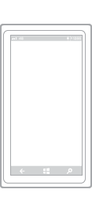
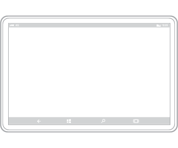

#  Dispositivo básico para aplicaciones de la Plataforma universal de Windows (UWP)

Familiarizarte con los dispositivos que admiten aplicaciones para la Plataforma universal de Windows (UWP) te ayudará a ofrecer la mejor experiencia de usuario para cada factor de forma. Al diseñar un dispositivo en particular, hay que tener en cuenta principalmente cómo aparecerá la aplicación en el dispositivo dónde, cuándo y cómo se usará la aplicación en el dispositivo y cómo interactuará el usuario con el dispositivo.

## Teléfonos y tabléfonos

Los más usados de todos los dispositivos informáticos, los teléfonos pueden hacer muchas cosas con la superficie de pantalla limitada y las entradas básicas. Los teléfonos están disponibles en una amplia variedad de tamaños; los teléfonos más grandes se denominan tabléfonos. Las experiencias de la aplicación en tabléfonos son similares a las de los teléfonos, pero debido a que la superficie de pantalla de los tabléfonos es mayor, se pueden producir algunos cambios clave en el consumo de contenido.

Con Continuum para teléfonos, una nueva experiencia de dispositivos móviles compatibles con Windows 10, los usuarios pueden conectar sus teléfonos a un monitor e incluso usar un mouse y un teclado para que los teléfonos funcionen como un portátil. (Para obtener más información, consulta el [artículo Continuum para teléfonos](http://go.microsoft.com/fwlink/p/?LinkID=699431)).

Tamaños de pantalla
-   Entre 4 y 5 pulgadas para teléfono
-   Entre 5,5 y 7 pulgadas para tabléfono

Uso típico
-   Se usan principalmente en orientación vertical, principalmente debido a la facilidad para sostener el teléfono con una mano y poder interactuar completamente interactuar con él de esta forma, pero hay algunas experiencias que funcionan bien en horizontal, como ver fotos y vídeo, leer un libro y escribir texto.
-   Usados principalmente por tan solo una persona, el propietario del dispositivo.
-   Siempre al alcance, normalmente se colocan en un bolsillo o una bolsa.
-   Se usan durante períodos breves.
-   A menudo, los usuarios realizan varias tareas cuando usan el teléfono.
-   Se escribe texto en ráfagas cortas.

Consideraciones sobre la interfaz de usuario
-   Las dimensiones reducidas de la pantalla de un teléfono solo permite ver un marco cada vez tanto en orientación vertical como en horizontal. Todos los patrones de navegación jerárquica de un teléfono usan el modelo de "exploración", donde el usuario navega a través de capas de interfaz de usuario de un solo marco.

-   De manera similar a los teléfonos, en modo vertical, los tabléfonos solo pueden ver un marco a la vez. Sin embargo, puesto que la superficie de pantalla disponible de un tabléfono es mayor, los usuarios pueden girar hacia la orientación horizontal y mantenerla de manera que haya dos marcos visibles a la vez.

-   En las orientaciones horizontales y verticales, asegúrate de que haya suficiente superficie de pantalla para la barra de la aplicación cuando el teclado en pantalla está arriba.

Entradas
-   Función táctil
-   Voz

Funcionalidades típicas del dispositivo
-   Micrófono
-   Cámara
-   Sensores de movimiento
-   Sensores de ubicación

 

## Tabletas

Los Tablet PC ultraportátiles están equipados con pantallas táctiles, cámaras, micrófonos y acelerómetros. El tamaño de la pantalla de las tabletas varía de 7" a 13,3".

Tamaños de pantalla
-   Entre 7 y 13,3 pulgadas

Uso típico
-   Aproximadamente el 80 % del uso de la tableta es por parte del propietario, mientras que el 20 % restante del uso es compartido.
-   Normalmente se usa en casa como un dispositivo complementario mientras se ve el televisor.
-   Se usa durante períodos más prolongados que los teléfonos y tabléfonos.
-   Se escribe texto en ráfagas cortas.

Consideraciones sobre la interfaz de usuario
-   En las orientaciones horizontal y vertical, las tabletas permiten dos marcos a la vez.
-   El botón Atrás del sistema se encuentra en la barra de navegación.

Entradas
-   Función táctil
-   Lápiz
-   Teclado externo (en ocasiones)
-   Mouse (en ocasiones)
-   Voz (en ocasiones)

Funcionalidades típicas del dispositivo
-   Cámara
-   Micrófono
-   Sensores de movimiento
-   Sensores de ubicación

 

## PC y portátiles

Los PC y los portátiles de Windows incluyen una amplia gama de dispositivos y tamaños de pantalla. En general, los PC y los portátiles pueden mostrar más de información que los teléfonos o tabletas.

Tamaños de pantalla
-   13 pulgadas y tamaños superiores

Uso típico
-   En las aplicaciones de los equipos de escritorio y de los portátiles, se puede ver el uso compartido, pero no por más de un usuario a la vez, normalmente por períodos más largos.

Consideraciones sobre la interfaz de usuario
-   Las aplicaciones pueden tener una vista de ventana, cuyo tamaño viene determinado por el usuario. Según el tamaño de ventana, puede haber entre uno y tres marcos. En los monitores más grandes, la aplicación puede tener más de tres marcos.

-   Al usar una aplicación en un equipo de escritorio o un portátil, el usuario tiene control sobre los archivos de la aplicación. Como diseñador de la aplicación, asegúrate de proporcionar los mecanismos para administrar su contenido. Piensa en incluir comandos y funciones como, por ejemplo, "Guardar como", "Archivos recientes", etc.

-   La función Atrás del sistema es opcional. Cuando un desarrollador de aplicaciones elige mostrarla, aparece en la barra de título de la aplicación.

Entradas
-   Mouse
-   Teclado
-   Entrada táctil en equipos portátiles y equipos de escritorio todo en uno.
-   A veces se usan mandos, como el controlador de Xbox.

Funcionalidades típicas del dispositivo
-   Cámara
-   Micrófono

 

## Dispositivos de Surface Hub

Microsoft Surface Hub es un dispositivo de colaboración en equipo de pantalla grande diseñado para el uso simultáneo por parte de varios usuarios.

Tamaños de pantalla
-   55 y 84 pulgadas

Uso típico
-   Las aplicaciones de Surface Hub ven el uso compartido durante períodos cortos de tiempo, como en las reuniones.

-   Los dispositivos de Surface Hub suelen estar inmóviles y raras veces se mueven.

Consideraciones sobre la interfaz de usuario
-   Las aplicaciones de Surface Hub pueden aparecer en uno de cuatro estados: lleno (vista en pantalla completa estándar), en segundo plano (oculto mientras la aplicación sigue funcionando, disponible en el conmutador de tareas), relleno (vista fija que ocupa el área de ensayo disponible) y acoplado (vista variable que ocupa los lados izquierdo o derecho del área).
-   En modo acoplado o en los modos de relleno, el sistema muestra la barra lateral de Skype y reduce la aplicación horizontalmente.
-   La función Atrás del sistema es opcional. Cuando un desarrollador de aplicaciones elige mostrarla, aparece en la barra de título de la aplicación.

Entradas
-   Función táctil
-   Lápiz
-   Voz
-   Teclado (en pantalla/remoto)
-   Panel táctil (remoto)

Funcionalidades típicas del dispositivo
-   Cámara
-   Micrófono

 

## Dispositivos de Windows IoT

Los dispositivos Windows IoT son una nueva clase de dispositivos que se centran en la incrustación de dispositivos electrónicos pequeños, sensores y conectividad dentro de los objetos físicos. Por lo general, estos dispositivos están conectados a través de una red o Internet para informar sobre los datos reales que detectan y, en algunos casos, actúan sobre ellos. Es posible que los dispositivos no tengan ninguna pantalla (también conocidos como dispositivos "sin periféricos") o que estén conectados a una pantalla pequeña (conocidos como dispositivos "con periféricos") con un tamaño de pantalla generalmente de 3,5 pulgadas o inferior.

Tamaños de pantalla
-   3,5 pulgadas o inferior
-   Algunos dispositivos no tienen ninguna pantalla

Uso típico
-   Por lo general, estos dispositivos están conectados a través de una red o Internet para informar sobre los datos reales que detectan y, en algunos casos, actúan sobre ellos.
-   Estos dispositivos solo pueden ejecutar una aplicación de cada vez, a diferencia de los teléfonos u otros dispositivos más grandes.
-   No es algo con lo que se interactúe todo el tiempo, sino que, en su lugar, está disponible cuando se necesita y desaparece cuando no.
-   La aplicación no tiene una prestación Atrás específica. Esto es responsabilidad de los desarrolladores.

Consideraciones sobre la interfaz de usuario
-   Los dispositivos "sin periféricos" no tienen ninguna pantalla.
-   La pantalla de los dispositivos "con periféricos" es mínima y solo muestra lo necesario debido a la funcionalidad y espacio en pantalla limitados.
-   La mayoría de veces, la orientación está bloqueada, por lo que tu aplicación solo necesita tener en cuenta una dirección de la pantalla.

Entradas
-   Variable, en función del dispositivo

Funcionalidades típicas del dispositivo
-   Variable, en función del dispositivo

 

 

 

<!--HONumber=May16_HO2-->

