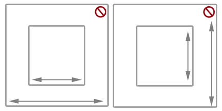
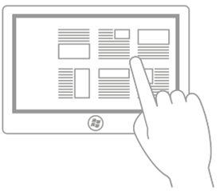
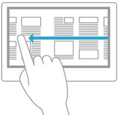
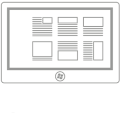
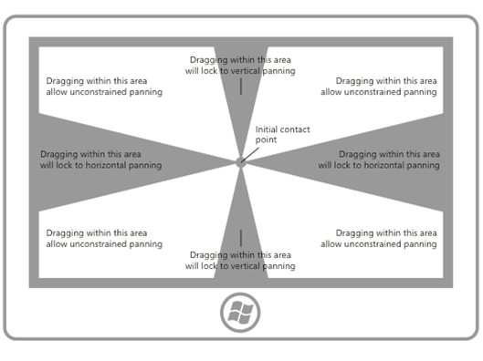
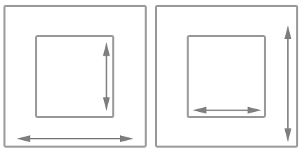
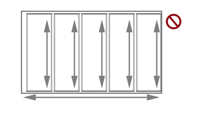

# Directrices sobre el movimiento panorámico
<link rel="stylesheet" href="https://az835927.vo.msecnd.net/sites/uwp/Resources/css/custom.css">

El movimiento panorámico o el desplazamiento permiten a los usuarios navegar dentro de una única vista para mostrar el contenido de la vista que no cabe en la ventanilla. Algunos ejemplos de vistas son la estructura de carpetas de un equipo, una biblioteca de documentos o un álbum de fotos.

<b>API importantes</b> 
<ul>
<li>[**Windows.UI.Input**](https://msdn.microsoft.com/library/windows/apps/br242084)</li>
<li>[**Windows.UI.Xaml.Input**](https://msdn.microsoft.com/library/windows/apps/br227994)</li>
</ul>

## Qué hacer y qué no hacer

**Indicadores de movimiento panorámico y barras de desplazamiento**

-   Asegúrate de que el movimiento panorámico y el desplazamiento sean posibles antes de cargar contenido en tu aplicación.

-   Haz que queden visibles los indicadores de movimiento panorámico y las barras de desplazamiento para ofrecer indicaciones de ubicación y tamaño. Ocúltalos si ofreces una función de navegación personalizada.

    **Nota** A diferencia de las barras de desplazamiento estándares, los indicadores de desplazamiento lateral son meramente informativos. No se exponen a dispositivos de entrada y no es posible manipularlos de ninguna forma.

     

**Movimiento panorámico en un solo eje (desbordamiento de una dimensión)**

-   Usa movimiento panorámico en un eje para las áreas de contenido que se extienden más allá de un límite de la ventanilla (vertical u horizontal).

    -   Movimiento panorámico vertical para una lista de elementos de una dimensión.
    -   Movimiento panorámico horizontal para una cuadrícula de elementos.
-   No uses puntos de acoplamiento obligatorios con el movimiento panorámico en un solo eje si un usuario tiene que contar con la posibilidad de realizar movimientos panorámicos y detenerse entre puntos de acoplamiento. Los puntos de acoplamiento obligatorios garantizan que el usuario se detendrá en un punto de acoplamiento. Usa, en cambio, puntos de acoplamiento de proximidad.

**Movimiento panorámico de forma libre (desbordamiento en dos dimensiones)**

-   Usa movimiento panorámico en dos ejes para las áreas de contenido que se extienden más allá de ambos límites de la ventanilla (vertical y horizontal).

    -   Invalida el comportamiento predeterminado de las guías y usa movimiento panorámico de forma libre para contenidos no estructurados donde es probable que el usuario se mueva en varias direcciones.
-   El movimiento panorámico de forma libre suele ser ideal para navegar en imágenes o mapas.

**Vista paginada**

-   Usa puntos de acoplamiento obligatorios cuando el contenido está compuesto de elementos discretos o cuando quieres mostrar un elemento completo. Puede tratarse de páginas de un libro o revista, una columna de elementos o imágenes individuales.

    -   Coloca un punto de acoplamiento en cada límite lógico.
    -   Dimensiona o escala cada elemento de modo que se ajuste a la vista.

**Puntos clave y lógicos**

-   Usa puntos de acoplamiento de proximidad si hay puntos clave o sitios lógicos en el contenido en los que el usuario probablemente se detendrá. Por ejemplo, un encabezado de sección.

-   Si defines restricciones o límites de tamaño máximo y mínimo, usa información visual para indicar al usuario cuándo ha alcanzado o superado esos límites.

**Encadenamiento de contenido incrustado o anidado**

-   Usa el movimiento panorámico en un solo eje (generalmente, el horizontal) y los diseños de columna para contenido de texto y basado en cuadrículas. En estos casos, por lo general, el contenido se encapsula y fluye de columna en columna y permite que la experiencia del usuario sea coherente y pueda detectarse en las aplicaciones de la Tienda Windows.

-   No uses regiones incrustadas que se puedan mover panorámicamente para mostrar texto o listas de elementos. Como los indicadores de movimiento panorámico y las barras de desplazamiento se muestran solamente cuando se detecta el contacto de entrada en la región, no se trata de una experiencia de usuario intuitiva ni que se pueda detectar.

-   No encadenes ni coloques una región desplazable dentro de otra si las dos se mueven panorámicamente en la misma dirección, como se muestra aquí. El resultado podría ser que el área primaria se desplazara de manera no intencionada cuando se llega a un límite del área secundaria. Considera la posibilidad de que establecer que el eje de desplazamiento sea perpendicular.

    

## Instrucciones de uso adicionales

El movimiento panorámico de forma táctil, mediante un gesto de deslizar o deslizar rápidamente con uno o varios dedos, es como desplazarse con el mouse. La interacción de movimiento panorámico es más parecida a la acción de girar la rueda del mouse o deslizar el cuadro de desplazamiento que a la de hacer clic en la barra de desplazamiento. A menos que se establezca una distinción en una API o que lo requiera la interfaz de usuario de Windows específica de algún dispositivo, simplemente se hace referencia a las dos interacciones como movimiento panorámico.

Según el dispositivo de entrada, el usuario se mueve panorámicamente en una región de movimiento panorámico usando uno de los siguientes:

-   Un mouse, un panel táctil o una pluma o un lápiz activos para hacer clic en las flechas de desplazamiento, arrastrar el cuadro de desplazamiento o hacer clic en la barra de desplazamiento.
-   La rueda del mouse para emular la acción de arrastrar el cuadro de desplazamiento.
-   Los botones extendidos (XBUTTON1 y XBUTTON2), si son compatibles con el mouse.
-   Las teclas de dirección del teclado para emular la acción de arrastrar el cuadro de desplazamiento o las teclas de página para emular la acción de hacer clic en la barra de desplazamiento.
-   La entrada táctil, el panel táctil, o la pluma o el lápiz pasivos para deslizar o deslizar rápidamente los dedos en la dirección deseada.

El deslizamiento implica mover los dedos lentamente en la dirección del movimiento panorámico. El resultado es una relación de uno a uno, en la que el contenido se mueve panorámicamente a la misma velocidad y distancia que los dedos. Deslizar rápidamente, que implica deslizar y levantar rápidamente los dedos, tiene como resultado la aplicación de los siguientes efectos físicos a la animación de movimiento panorámico:

-   Desaceleración (inercia): al levantar los dedos, el movimiento panorámico empieza a desacelerarse, algo similar a la acción de dejar de deslizarse en una superficie resbaladiza. Es similar a la acción de dejar de deslizarse en una superficie resbaladiza.
-   Absorción: durante la desaceleración, la inercia del movimiento panorámico provoca un ligero efecto de rebote si se llega a un punto de acoplamiento o al límite de un área de contenido.

**Tipos de movimiento panorámico**

Windows8 admite tres tipos de movimiento panorámico:

-   Eje único: el movimiento panorámico es posible solo en una dirección (horizontal o vertical).
-   Guías: el movimiento panorámico es posible en todas las direcciones. Sin embargo, una vez que el usuario cruza un umbral de distancia en una dirección específica, el movimiento panorámico queda restringido a ese eje.
-   Forma libre: el movimiento panorámico es posible en todas las direcciones.

**Interfaz de usuario de movimiento panorámico**

La experiencia de interacción para el movimiento panorámico es exclusiva del dispositivo de entrada, aunque sigue proporcionando funciones similares.

**Regiones desplazables** Los comportamientos de las regiones desplazables se exponen a los desarrolladores de aplicaciones de la Tienda Windows que usan JavaScript en el momento del diseño a través de las hojas de estilo CSS.

Hay dos modos de visualización de movimiento panorámico en función del dispositivo de entrada detectado:

-   Indicadores de movimiento panorámico para la entrada táctil.
-   Barras de desplazamiento para otros dispositivos de entrada, como el mouse, el panel táctil, el teclado y el lápiz.

**Nota** Los indicadores de desplazamiento lateral panorámico solo se ven cuando el contacto táctil se encuentra dentro de la región desplazable. Del mismo modo, la barra de desplazamiento solo se ve cuando el cursor del mouse, el cursor del lápiz o la pluma, o el foco del teclado se encuentran dentro de la región desplazable.

 

**Indicadores de desplazamiento** Los indicadores de desplazamiento son similares al cuadro de desplazamiento de una barra de desplazamiento. Indican la proporción del contenido visualizado respecto al área total que puede moverse panorámicamente, así como la posición relativa del contenido mostrado en el área desplazable.

En el diagrama siguiente se muestran dos áreas que pueden moverse panorámicamente con diferentes longitudes y sus correspondientes indicadores de movimiento panorámico.

**Comportamientos de desplazamiento**
**Puntos de acoplamiento** El desplazamiento con el gesto de deslizar agrega un comportamiento de inercia a la interacción cuando se levanta el contacto táctil. Con la inercia, el contenido se sigue desplazando hasta alcanzar algún umbral de distancia sin la entrada directa del usuario. Usa puntos de acoplamiento para modificar el comportamiento de inercia.

Los puntos de acoplamiento especifican paradas lógicas en el contenido de tu aplicación. Desde el punto de vista cognitivo, los puntos de acoplamiento actúan como un mecanismo de paginación para el usuario y minimizan la fatiga que producen los gestos excesivos de deslizar y deslizar rápidamente en grandes regiones desplazables. Con ellos, puedes controlar las entradas del usuario imprecisas y asegurarte de que se muestre en la ventanilla un subconjunto específico de contenido o información clave.

Existen dos tipos de puntos de acoplamiento:

-   Proximidad: después de levantar el dedo, se selecciona un punto de acoplamiento si la inercia se detiene dentro del umbral de distancia del punto de acoplamiento. El movimiento panorámico aún puede detenerse entre puntos de acoplamiento de proximidad.
-   Obligatorio: el punto de acoplamiento seleccionado es el que precede o sigue inmediatamente al último punto de acoplamiento que se cruzó antes de levantar el contacto (en función de la dirección y velocidad del gesto). El movimiento panorámico debe detenerse en un punto de acoplamiento obligatorio.

Los puntos de acoplamiento del movimiento panorámico son útiles para aplicaciones como exploradores web y álbumes de fotos que emulan contenidos con páginas o tienen agrupamientos lógicos de elementos que pueden reagruparse dinámicamente para ajustarse a una ventanilla o pantalla.

En los siguientes diagramas se muestra que al mover panorámicamente un contenido hasta cierto punto y soltarlo, el contenido se desplaza de forma automática hasta una ubicación lógica.

|                                                                |                                                                                         |                                                                                                                 |
|----------------------------------------------------------------|-----------------------------------------------------------------------------------------|-----------------------------------------------------------------------------------------------------------------|
|  |  |  |
| Desliza rápidamente para realizar un movimiento panorámico.                                                  | Levanta el contacto táctil.                                                                     | La región desplazable se detiene en el punto de acoplamiento, no cuando se levanta el contacto táctil.                                |

 

**Guías** El contenido puede ser más alto y más ancho que las dimensiones y la resolución de un dispositivo de pantalla. Por ese motivo, el movimiento panorámico en dos dimensiones (horizontal y vertical) suele ser necesario. En estos casos, las guías mejoran la experiencia del usuario al enfatizar el movimiento panorámico a lo largo del eje de movimiento (vertical u horizontal).

En el diagrama siguiente se muestra el concepto de guía.

**Encadenamiento de contenido incrustado o anidado**

Cuando un usuario alcance el límite de zoom o desplazamiento en un elemento que estaba anidado dentro de otro elemento ampliable o desplazable, puedes especificar si el elemento primario debe continuar con la operación de zoom o desplazamiento que comenzó en el elemento secundario. Este comportamiento se denomina encadenamiento de zoom o de desplazamiento.

El encadenamiento se usa para efectuar movimiento panorámico en un área de contenido de un solo eje que contiene una o más regiones de desplazamiento de un eje o de forma libre (cuando el contacto táctil se produce en una de esas regiones secundarias). Cuando se alcanza el límite de movimiento panorámico de la región secundaria en una dirección específica, se activa el movimiento panorámico en la misma dirección en la región primaria.

Cuando una región desplazable se anida dentro de otra, es importante especificar suficiente espacio entre el contenedor y el contenido incrustado. En los diagramas siguientes, una región desplazable se sitúa dentro de otra y las direcciones del movimiento de cada una son perpendiculares. Hay abundante espacio para que los usuarios se muevan panorámicamente en cada región.

Como se muestra en el diagrama siguiente, si no hay suficiente espacio, la región desplazable incrustada puede interferir con el movimiento panorámico en el contenedor. El resultado es que podría producirse un desplazamiento no intencionado en una o varias regiones desplazables.

Esta guía también es útil para aplicaciones, como álbumes de fotografías o aplicaciones de mapas, que admiten el movimiento panorámico sin restricciones en un mapa o una imagen individual y, al mismo tiempo, el movimiento panorámico en un solo eje dentro del álbum (para desplazarse a las imágenes anteriores o siguientes) o del área de detalles. En las aplicaciones que proporcionan un área de detalles u opciones correspondiente a un mapa o una imagen de movimiento panorámico de forma libre, es recomendable que el diseño de página comience por el área de detalles y opciones, ya que el área de movimiento panorámico sin restricciones de la imagen o el mapa podrían interferir con el movimiento panorámico en el área de detalles.

## Artículos relacionados

* [Interacciones del usuario personalizadas](https://msdn.microsoft.com/library/windows/apps/mt185599)
* [Optimizar ListView y GridView](https://msdn.microsoft.com/library/windows/apps/mt204776)
* [Accesibilidad de teclado](https://msdn.microsoft.com/library/windows/apps/mt244347)

**Muestras**
* [Ejemplo de entrada básica](http://go.microsoft.com/fwlink/p/?LinkID=620302)
* [Muestra de entrada de latencia baja](http://go.microsoft.com/fwlink/p/?LinkID=620304)
* [Muestra de modo de interacción del usuario](http://go.microsoft.com/fwlink/p/?LinkID=619894)
* [Muestra de elementos visuales de foco](http://go.microsoft.com/fwlink/p/?LinkID=619895)

**Muestras de archivo**
* [Entrada: muestra de eventos de entrada de usuario de XAML](http://go.microsoft.com/fwlink/p/?linkid=226855)
* [Entrada: muestra de funcionalidades del dispositivo](http://go.microsoft.com/fwlink/p/?linkid=231530)
* [Entrada: muestra de prueba de acceso táctil](http://go.microsoft.com/fwlink/p/?linkid=231590)
* [Muestra de desplazamiento, movimiento panorámico y zoom XAML](http://go.microsoft.com/fwlink/p/?linkid=251717)
* [Entrada: ejemplo de entrada de lápiz simplificada](http://go.microsoft.com/fwlink/p/?linkid=246570)
* [Entrada: muestra de gestos de Windows 8](http://go.microsoft.com/fwlink/p/?LinkId=264995)
* [Entrada: muestra de manipulaciones y gestos (C++)](http://go.microsoft.com/fwlink/p/?linkid=231605)
* [Muestra de entrada táctil de DirectX](http://go.microsoft.com/fwlink/p/?LinkID=231627)
 

 

