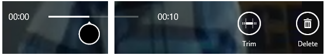

# Seleccionar texto e imágenes
<link rel="stylesheet" href="https://az835927.vo.msecnd.net/sites/uwp/Resources/css/custom.css">

En este artículo se describen la selección y la manipulación de texto, imágenes y controles, y se ofrecen directrices sobre la experiencia del usuario que debes tener en cuenta al usar estos mecanismos en las aplicaciones.

<b>API importantes</b> 
<ul>
<li>[**Windows.UI.Xaml.Input**](https://msdn.microsoft.com/library/windows/apps/br227994)</li>
<li>[**Windows.UI.Input**](https://msdn.microsoft.com/library/windows/apps/br242084)</li>
</ul>

 

## Qué hacer y qué no hacer

-   Usa glifos de fuentes al implementar una interfaz de usuario de barra de redimensionamiento propia. La barra de redimensionamiento es una combinación de dos fuentes Segoe UI que se encuentran disponibles en todo el sistema. El uso de recursos de fuente simplifica los problemas de representación a diferentes ppp y da resultado con las diversas mesetas de escalado de la interfaz de usuario. Cuando implementes tus propias barras de redimensionamiento, estas deben compartir los siguientes rasgos de interfaz de usuario:

    -   Forma circular
    -   Visible con cualquier fondo
    -   Tamaño coherente
-   Proporciona un margen alrededor del contenido seleccionable para acomodar la interfaz de usuario de la barra de redimensionamiento. Si la aplicación permite la selección de texto en una región en la que no hay disponible desplazamiento ni desplazamiento lateral, deja un margen de media barra de redimensionamiento en los lados izquierdo y derecho del área de texto y la altura de una barra de redimensionamiento en los lados superior e inferior del área de texto (como se muestra en las siguientes imágenes). Esto garantiza que el usuario vea toda la interfaz de usuario de la barra de redimensionamiento y minimiza las interacciones accidentales con otras interfaces de usuario en el borde.

    

-   Oculta la interfaz de usuario de las barras de redimensionamiento durante la interacción. Elimina la oclusión producida por las barras de redimensionamiento durante la interacción. Esto resulta útil cuando el dedo no oculta completamente la barra de redimensionamiento o cuando hay varias barras de redimensionamiento de selección de texto. Esto elimina los artefactos visuales al mostrar ventanas secundarias.

-   No permitas la selección de elementos de interfaz de usuario, como controles, etiquetas, imágenes, contenido registrado, etc. Por lo general, las aplicaciones de Windows solo permiten seleccionar dentro de controles específicos. Los controles como los botones, las etiquetas y los logotipos no son seleccionables. Evalúa si la selección puede ser un problema para la aplicación y, si es así, identifica las áreas de la interfaz de usuario donde debes prohibir la selección. 

## Instrucciones de uso adicionales

La selección y la manipulación de texto son particularmente sensibles frente a los retos que pueden presentar las interacciones táctiles en la experiencia del usuario. Las entradas mediante mouse, pluma o lápiz y teclado tienen un alto grado de detalle: el clic de un mouse o el contacto de una pluma o lápiz por lo general se asignan a un solo píxel, y una tecla se considera presionada o no presionada. La entrada táctil no es precisa: es difícil asignar toda la superficie de la punta de un dedo a una ubicación x-y específica en la pantalla para situar un símbolo de intercalación de texto de manera precisa.

**Consideraciones y recomendaciones**

Usa los controles integrados que se exponen a través de los marcos de lenguaje de Windows para crear aplicaciones que proporcionen toda la experiencia de interacción del usuario de la plataforma, incluidos los comportamientos de selección y manipulación. Encontrarás que la funcionalidad de interacción de los controles integrados es suficiente para la mayoría de las aplicaciones para UWP.

Cuando usas controles de texto estándar para UWP, no puedes personalizar los elementos visuales y los comportamientos de selección que se describen en este tema.

**Selección de texto**

Si la aplicación requiere una interfaz de usuario personalizada que admita la selección de texto, es recomendable seguir los comportamientos de selección de Windows que se describen en este artículo.

**Contenido modificable y no modificable**

Con la entrada táctil, las interacciones de selección se ejecutan básicamente mediante gestos, como pulsar para establecer un cursor de inserción o seleccionar una palabra y deslizar para modificar una selección. Como ocurre con otras interacciones táctiles en Windows, las interacciones con intervalo están limitadas al gesto de pulsar y sostener para mostrar una interfaz de usuario informativa. Para más información, consulta [Directrices para información visual](guidelines-for-visualfeedback.md).

Windows reconoce dos estados posibles para las interacciones de selección, modificables y no modificables, y ajusta la interfaz de usuario, la información y la funcionalidad de selección en función de esa distinción.

**Contenido modificable**

Al pulsar en la mitad izquierda de una palabra, el cursor aparece inmediatamente a la izquierda de la palabra, mientras que al pulsar dentro de la mitad derecha, el cursor aparece inmediatamente a la derecha de la palabra.

En la imagen siguiente se muestra cómo colocar un cursor de inserción inicial con barra de redimensionamiento pulsando cerca del comienzo o el final de una palabra.

En la imagen siguiente se muestra cómo ajustar una selección arrastrando la barra de redimensionamiento.

En las imágenes siguientes se muestra cómo invocar el menú contextual pulsando dentro de la selección o sobre una barra de redimensionamiento (también puedes usar el gesto de pulsar y sostener).

**Nota** Estas interacciones presentan cierta variación en el caso de una palabra con errores ortográficos. Si pulsas una palabra marcada por tener errores ortográficos, la palabra se resalta y se invoca el menú contextual con la ortografía sugerida.

 

**Contenido no modificable**

En la imagen siguiente se muestra cómo seleccionar una palabra pulsando dentro de la palabra (no se incluyen espacios en la selección inicial).

Para ajustar la selección y mostrar el menú contextual, sigue los mismos procedimientos que con el texto modificable.

**Manipulación de objetos**

Siempre que sea posible, usa los mismos recursos de barra de redimensionamiento (o unos similares) que la selección de texto al implementar manipulación de objetos personalizada en una aplicación para UWP. Esto ayuda a ofrecer una experiencia de interacción coherente en toda la plataforma.

Por ejemplo, las barras de redimensionamiento también se pueden usar en aplicaciones de procesamiento de imágenes que admitan cambio de tamaño y recorte, o bien en aplicaciones de reproductor multimedia que proporcionen barras de progreso ajustables, como se muestra en las siguientes imágenes.

*Reproductor multimedia con barra de redimensionamiento ajustable.*

*Editor de imágenes con barras de redimensionamiento de recorte.*

## Artículos relacionados

**Para desarrolladores**
* [Interacciones del usuario personalizadas](https://msdn.microsoft.com/library/windows/apps/mt185599)

**Muestras**
* [Ejemplo de entrada básica](http://go.microsoft.com/fwlink/p/?LinkID=620302)
* [Muestra de entrada de latencia baja](http://go.microsoft.com/fwlink/p/?LinkID=620304)
* [Muestra de modo de interacción del usuario](http://go.microsoft.com/fwlink/p/?LinkID=619894)
* [Muestra de elementos visuales de foco](http://go.microsoft.com/fwlink/p/?LinkID=619895)

**Muestras de archivo**
* [Entrada: muestra de eventos de entrada de usuario de XAML](http://go.microsoft.com/fwlink/p/?linkid=226855)
* [Entrada: muestra de funcionalidades del dispositivo](http://go.microsoft.com/fwlink/p/?linkid=231530)
* [Entrada: muestra de prueba de acceso táctil](http://go.microsoft.com/fwlink/p/?linkid=231590)
* [Muestra de desplazamiento, movimiento panorámico y zoom XAML](http://go.microsoft.com/fwlink/p/?linkid=251717)
* [Entrada: ejemplo de entrada de lápiz simplificada](http://go.microsoft.com/fwlink/p/?linkid=246570)
* [Entrada: muestra de gestos de Windows 8](http://go.microsoft.com/fwlink/p/?LinkId=264995)
* [Entrada: muestra de manipulaciones y gestos (C++)](http://go.microsoft.com/fwlink/p/?linkid=231605)
* [Muestra de entrada táctil de DirectX](http://go.microsoft.com/fwlink/p/?LinkID=231627)
 

 

