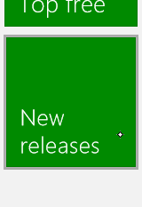
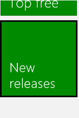
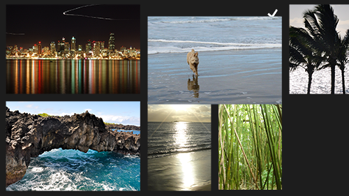

# Instrucciones para la información visual

\[ Actualizado para aplicaciones para UWP en Windows 10. Para leer más artículos sobre Windows 8.x, consulta el [archivo](http://go.microsoft.com/fwlink/p/?linkid=619132) \]

Usa la información visual para mostrar a los usuarios cuándo se detectan, se interpretan y se controlan sus interacciones. La información visual puede ayudar a los usuarios al promover la interacción. Indica si una interacción se ha realizado correctamente, lo que mejora la sensación de control del usuario. También transmite los estados del sistema y reduce los errores.

**API importantes**

-   [**Windows.Devices.Input**](https://msdn.microsoft.com/library/windows/apps/br225648)
-   [**Windows.UI.Input**](https://msdn.microsoft.com/library/windows/apps/br242084)
-   [**Windows.UI.Core**](https://msdn.microsoft.com/library/windows/apps/br208383)

## Qué hacer y qué no hacer

-   Proporciona información visual sin importar lo breve que sea el contacto. Esto permite al usuario:
    -   Confirmar que la pantalla táctil funciona.
    -   Identificar si el destino responde y si está habilitado para entrada táctil.
    -   Identificar si el usuario se equivocó de destino.
-   Muestra la información de inmediato para todos los eventos de interacción.
-   Proporciona información que contenga indicaciones visuales sutiles e intuitivas que no distraigan a los usuarios.
-   Asegúrate de que los destinos táctiles obedezcan al dedo durante todas las manipulaciones.
-   Habilita la selección de elementos con el gesto de deslizar rápidamente cuando el movimiento panorámico esté restringido a una sola dirección.
-   No uses visualizaciones táctiles en situaciones en que podrían interferir con el uso de la aplicación. Para más información, consulta [**ShowGestureFeedback**](https://msdn.microsoft.com/library/windows/apps/br241969).
-   No muestres información a menos que sea absolutamente necesario. No muestres información visual a menos que esta sirva para añadir valor que no se encuentra disponible en ningún otro sitio. De este modo, mantendrás la interfaz de usuario ordenada y organizada. Nunca muestres información sobre herramientas si esta repite el texto que ya se encuentra visible. La información sobre herramientas debe reservarse para ocasiones específicas, como texto truncado (texto con puntos suspensivos) que no se muestra al seleccionar el elemento, o cuando se necesita información adicional para comprender o usar la aplicación.
-   No uses el gesto de pulsar y sostener en otro sitio que no sea la interfaz de usuario informativa.
    **Importante:** El gesto de pulsar y sostener puede usarse para la selección cuando el movimiento panorámico está habilitado tanto en dirección vertical como horizontal.

     

-   No personalices los comportamientos de la información visual de los gestos integrados de Windows 8, ya que esto podría generar una experiencia del usuario confusa e incoherente.
-   No muestres información visual durante el desplazamiento lateral o el arrastre. El movimiento real del objeto en la pantalla es suficiente. Pero si el área de contenido no se desplaza lateralmente ni de algún otro modo, usa visualizaciones para indicar las condiciones de límite. Para más información, consulta las [directrices para desplazamiento lateral](guidelines-for-panning.md).
-   No muestres información para un control que no se identifica como el destino. La información visual es decisiva cuando se usa la entrada táctil para llevar a cabo actividades que requieren exactitud y precisión en función de la ubicación. Si se muestra información siempre que se detecte entrada táctil, se ayuda al usuario a entender las heurísticas de destino personalizadas que definen la aplicación y los controles correspondientes.
-   No uses el comportamiento de la información pensado para un tipo de entrada con otro. Por ejemplo, un rectángulo de foco de teclado debe usarse solo con la entrada de teclado y no con la entrada táctil.

## Instrucciones de uso adicionales

Las visualizaciones de contacto son especialmente importantes para las interacciones táctiles que requieren exactitud y precisión. Por ejemplo, tu aplicación debe indicar de manera clara la ubicación de una pulsación para que el usuario sepa si se equivocó al pulsar el objetivo, por cuánto se equivocó y qué ajustes debe realizar.

Usa los controles de la plataforma expuestos mediante los marcos de lenguaje de las aplicaciones de la Tienda Windows (aplicaciones de la Tienda Windows con JavaScript y aplicaciones de la Tienda Windows con C++, C\# o Visual Basic) para obtener las visualizaciones de Windows 8 de manera gratuita. Si tu aplicación presenta interacciones personalizadas que necesitan de información personalizada, debes asegurarte de que esta información sea adecuada, abarque los dispositivos de entrada y no distraiga al usuario de su tarea. Esto es especialmente importante en las aplicaciones de dibujo o de juegos, donde la información visual podría entrar en conflicto con áreas críticas de la interfaz de usuario u ocultarlas.

**Importante**  
Se recomienda que no se cambie el comportamiento de interacción de los gestos integrados.

 

**Interfaz de usuario de información**

La interfaz de usuario de información por lo general depende del dispositivo de entrada (táctil, panel táctil, mouse, lápiz o pluma, teclado, etc.). Por ejemplo, la información integrada para un mouse por lo general implica mover y cambiar el cursor, mientras que la entrada táctil o de lápiz requiere visualizaciones de contacto, y la navegación y entrada de teclado usa rectángulos de foco y resaltado.

Usa [**ShowGestureFeedback**](https://msdn.microsoft.com/library/windows/apps/br241969) para establecer el comportamiento de la información para los gestos de la plataforma.

Si personalizas la interfaz de usuario de información, asegúrate de proporcionar información que sea adecuada y admita todos los modos de entrada.

Estos son algunos ejemplos de visualizaciones de contacto integradas en Windows 8.

<table>
<colgroup>
<col width="25%" />
<col width="25%" />
<col width="25%" />
<col width="25%" />
</colgroup>
<tbody>
<tr class="odd">
<td align="left">

Visualización táctil
</td>
<td align="left">

Visualización de mouse y panel táctil
</td>
<td align="left">

Visualización de pluma
</td>
<td align="left">

Visualización de teclado
</td>
</tr>
</tbody>
</table>

 

### 

**Interfaz de usuario informativa (elementos emergentes)**

Una de las principales formas de información visual es la interfaz de usuario informativa (o interfaz de usuario de desambiguación). La interfaz de usuario informativa identifica y muestra información sobre un objeto, describe las funciones y cómo acceder a ellas, y ofrece instrucciones cuando es necesario.

Estos son los distintos tipos de interfaz de usuario informativa admitidos por las aplicaciones de la Tienda Windows.

-   Información sobre herramientas
-   Información sobre herramientas enriquecida
-   Menús
-   Cuadros de diálogo de mensaje
-   Controles flotantes

La interfaz de usuario informativa es especialmente útil para superar la oclusión con la punta de los dedos (obstrucción) y para mejorar las interacciones táctiles con la aplicación. Incluso tiene un gesto integrado dedicado a ella: pulsar y sostener.

Pulsar y sostener es una interacción dependiente del tiempo y este tipo de interacción no se recomienda en Windows 8. En este caso, resulta aceptable una interacción con intervalo pues se usa como herramienta para el aprendizaje y la exploración. La duración recomendada depende del tipo de interfaz de usuario informativa. Estos son los umbrales de tiempo recomendados.

Tipo de interfaz de usuario informativa
Intervalos
Activación
Uso
Información sobre herramienta para superar oclusión (para arrastre y destinos pequeños)
0 milisegundos
Sí
Para aclaración rápida de acciones. Generalmente se usa para comandos.
Información sobre herramienta para superar oclusión (para acciones)
200 milisegundos
Sí
Información sobre herramientas enriquecida
~2000 milisegundos
No
Para exploración y aprendizaje más lentos y reflexivos. Generalmente se usa con elementos de una colección.
Interacción reveladora
~2000 milisegundos
No
Menú contextual
~2000 milisegundos
No
Expone un conjunto limitado de comandos relacionados con el objeto seleccionado.
Controles flotantes
~2000 milisegundos
No
Expone un conjunto limitado de comandos relacionados con el objeto seleccionado.
 

Para más información sobre cómo ofrecer la interfaz de usuario informativa, consulta los temas [Diseñar la interfaz de usuario](https://msdn.microsoft.com/library/windows/apps/hh465304) y [Mostrar elementos emergentes](https://msdn.microsoft.com/library/windows/apps/hh738362).

**Información sobre herramientas**

Usa la información sobre herramientas para mostrar más información sobre un control antes de pedir al usuario que realice una acción.

La información sobre herramientas ([**Tooltip**](https://msdn.microsoft.com/library/windows/apps/br229763)) aparece automáticamente cuando el usuario realiza un gesto de pulsar y sostener (o cuando se detecta un evento en que el puntero se mantiene) sobre un control o un objeto. La información sobre herramientas desaparece cuando el contacto o el cursor se retiran del control o del objeto. La información sobre herramientas puede incluir texto e imágenes, pero no es interactiva.

**Información sobre herramientas para superar oclusión para destinos pequeños**

La información sobre herramientas para superar oclusión describe el destino que queda oculto. Resulta útil cuando se intenta seleccionar y activar elementos más pequeños que un destino táctil estándar, como hipervínculos en una página web.

Esta información sobre herramientas puede reemplazarse con una ventana emergente informativa una vez superado un umbral de tiempo determinado. Por ejemplo, usa la información sobre herramientas para superar oclusión para mostrar el texto oculto del hipervínculo y después reemplázala con un elemento emergente que contenga la dirección URL.

**Informaciones sobre herramientas para superar la oclusión para acciones y comandos**

Esta información sobre herramientas describe la acción o el comando que tiene lugar cuando un usuario levanta el dedo de un elemento. Esta información sobre herramientas es útil cuando se intenta seleccionar y activar un botón o un control similar.

Una información sobre herramientas para destino pequeño puede ir seguida de una información sobre herramientas para acción una vez superado un umbral de tiempo determinado. En este caso, la información sobre herramientas para destino pequeño debe expandirse para incluir la información adicional en la información sobre herramientas para acción.

**Información sobre herramientas enriquecida**

Esta información sobre herramientas revela información secundaria sobre un elemento. Por ejemplo, una información sobre herramientas enriquecida podría ser una descripción textual de una imagen, el texto completo de un título truncado u otra información relacionada con el destino.

La información sobre herramientas enriquecida por lo general contiene información de la que no es necesario disponer de inmediato y que, en algunos casos, podría ser motivo de distracción si se mostrara demasiado pronto. Un umbral de tiempo más prolongado proporciona a los usuarios la posibilidad de pensar si desean obtener la información.

Cuando se muestra una información sobre herramientas enriquecida, el objeto ya no se activa cuando el usuario levanta el dedo. El motivo es que la información obtenida de este modo podría llevar a que el usuario eligiera no activar el elemento.

Es recomendable que el diseño visual y la información contenida en la información sobre herramientas enriquecida sea diferente de la que ofrece la información sobre herramientas estándar, y más sustancial.

**Menú contextual**

El menú contextual ([**PopupMenu**](https://msdn.microsoft.com/library/windows/apps/br208693)) es un menú ligero que ofrece a los usuarios acceso inmediato a las acciones (como comandos del Portapapeles) para objetos de texto o de la interfaz de usuario en las aplicaciones de la Tienda Windows.

El menú contextual optimizado para entrada táctil consta de dos partes. Como resultado de la interacción de sostener, se muestra una indicación visual: la sugerencia. Después se muestra el menú contextual una vez que desaparece la sugerencia y el usuario levanta el dedo.

En las imágenes siguientes se muestra cómo invocar el menú contextual predeterminado para texto pulsando dentro de una selección o sobre una barra de redimensionamiento (también puedes usar el gesto de pulsar y sostener).

Consulta [Agregar menús contextuales](https://msdn.microsoft.com/library/windows/apps/hh465300).

**Cuadro de diálogo de mensaje**

Usa cuadros de diálogo de mensaje ([**MessageDialog**](https://msdn.microsoft.com/library/windows/apps/br208674)) para pedir una respuesta al usuario (basada en la acción del usuario o en el estado de la aplicación) antes de continuar. Hasta que el usuario responda, se requiere su interacción explícita y se bloquean las entradas en la aplicación.

Estos son algunos motivos típicos para mostrar un cuadro de diálogo de mensaje.

-   Proporcionar información urgente
-   Hacer una pregunta antes de continuar con la ejecución
-   Mostrar mensajes de error

Consulta [Agregar cuadros de diálogo de mensaje](https://msdn.microsoft.com/library/windows/apps/hh738361).

**Control flotante**

Un control flotante ([**Flyout**](https://msdn.microsoft.com/library/windows/apps/br211726)) es un panel de interfaz de usuario ligero que se muestra al realizar una pulsación, un clic u otra acción de activación y se usa para presentar al usuario información, preguntas o un menú con opciones relacionadas con la actividad actual. Puede cerrarse por cambio de foco (desaparece cuando el usuario toca o hace clic fuera del panel del control flotante o presiona la tecla Esc). En otras palabras, los controles flotantes se pueden pasar por alto.

A diferencia de la información sobre herramientas, los controles flotantes aceptan entrada. A diferencia de lo que ocurre con los cuadros de diálogo de mensaje, la aplicación sigue activa y acepta entradas.

Consulta [Agregar controles flotantes y menús](https://msdn.microsoft.com/library/windows/apps/hh465325).

### 

**Interfaz de usuario que se revela automáticamente**

Una interacción reveladora es una animación o indicación visual informativa que muestra cómo ejecutar una acción con un objeto de destino y proporciona una vista previa del resultado de la acción.

En las siguientes imágenes se muestra la interacción reveladora correspondiente a una selección con deslizamiento transversal en la pantalla Inicio. Cuando un usuario toca un icono de la aplicación (sin arrastrarlo), el icono baja (como si se arrastrara) y deja al descubierto la marca de verificación de selección que aparecería si en realidad se seleccionara la aplicación.

*Presiona el dedo sobre un elemento para iniciar la interacción reveladora para la selección. La interacción reveladora muestra qué acción va a ejecutarse en el elemento.*

*Sin levantar el dedo, desliza rápidamente para seleccionar el elemento.*

*Si el usuario sigue deslizando el dedo, la visualización reveladora cambia y muestra que ahora se puede mover el objeto.*

Una vez se muestra una interacción reveladora, el objeto no vuelve a activarse cuando el usuario levanta el dedo.

## Artículos relacionados

**Para diseñadores**
* [Directrices sobre el movimiento panorámico](guidelines-for-panning.md)
**Para desarrolladores**
* [Interacciones del usuario personalizadas](https://msdn.microsoft.com/library/windows/apps/mt185599)
**Muestras**
* [Muestra de entrada básica](http://go.microsoft.com/fwlink/p/?LinkID=620302)
* [Muestra de entrada de latencia baja](http://go.microsoft.com/fwlink/p/?LinkID=620304)
* [Muestra de modo de interacción del usuario](http://go.microsoft.com/fwlink/p/?LinkID=619894)
* [Muestra de elementos visuales de foco](http://go.microsoft.com/fwlink/p/?LinkID=619895)
**Muestras de archivo**
* [Entrada: muestra de eventos de entrada de usuario de XAML](http://go.microsoft.com/fwlink/p/?linkid=226855)
* [Entrada: muestra de funcionalidades del dispositivo](http://go.microsoft.com/fwlink/p/?linkid=231530)
* [Entrada: muestra de prueba de acceso táctil](http://go.microsoft.com/fwlink/p/?linkid=231590)
* [Muestra de desplazamiento, movimiento panorámico y zoom XAML](http://go.microsoft.com/fwlink/p/?linkid=251717)
* [Entrada: ejemplo de entrada de lápiz simplificada](http://go.microsoft.com/fwlink/p/?linkid=246570)
* [Entrada: muestra de gestos de Windows 8](http://go.microsoft.com/fwlink/p/?LinkId=264995)
* [Entrada: muestra de manipulaciones y gestos (C++)](http://go.microsoft.com/fwlink/p/?linkid=231605)
* [Muestra de entrada táctil de DirectX](http://go.microsoft.com/fwlink/p/?LinkID=231627)
 

 

<!--HONumber=Mar16_HO4-->

