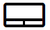
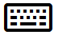

# Información básica sobre interacción
<link rel="stylesheet" href="https://az835927.vo.msecnd.net/sites/uwp/Resources/css/custom.css">

Las interacciones del usuario en la Plataforma universal de Windows (UWP) son una combinación de orígenes de entrada y salida (tales como ratón, teclado, lápiz, función táctil, panel táctil, voz, **Cortana**, controlador, gestos, miradas, etc.), junto con diversos modos o modificadores, que permiten experiencias ampliadas (incluidos la rueda y los botones del ratón, los botones de borrador de lápiz y de menú contextual, el teclado táctil y los servicios de aplicaciones de segundo plano).

UWP usa un sistema "inteligente" de interacción contextual que, en la mayoría de los casos, elimina la necesidad de controlar individualmente los tipos únicos de entradas que recibe la aplicación. Esto incluye el control de la función táctil, el panel táctil, el mouse y la entrada manuscrita como un tipo de puntero genérico para admitir gestos estáticos (como presionar o mantener presionado), gestos de manipulación (como deslizar para movimiento panorámico) o la representación de la entrada de lápiz digital.

Familiarízate con cada tipo de dispositivo de entrada y sus comportamientos, capacidades y limitaciones con determinados factores de forma. Esto puede ayudarte a decidir si los controles de plataforma y las prestaciones son suficientes para tu aplicación o requieren que proporciones experiencias de interacción personalizadas.

## Surface Dial

Para la Actualización de aniversario de Windows 10, presentamos una nueva categoría de dispositivo de entrada llamado rueda de Windows. Surface Dial es el primer dispositivo de esta clase. 

### Compatibilidad con dispositivos

-   Tableta
-   PC y portátiles

### Uso típico

Con un factor de forma que se basa en una acción (o gesto) de giro, Surface Dial se ha diseñado como un dispositivo de entrada secundario multimodal que complementa o modifica la entrada de un dispositivo principal. En la mayoría de los casos, el dispositivo se manipula con la mano no dominante del usuario mientras realiza una tarea con la mano dominante (por ejemplo, una entrada manuscrita con un lápiz).

### Más información

[Directrices de diseño de Surface Dial](windows-wheel-interactions.md)

## Cortana

En Windows 10, la extensibilidad **Cortana** te permite controlar los comandos de voz desde un usuario e iniciar tu aplicación para llevar a cabo una única acción.

### Compatibilidad con dispositivos

-   Teléfonos y tabléfonos
-   Tableta
-   PC y portátiles
-   Surface Hub
-   IoT
-   Xbox
-   HoloLens

### Uso típico

Un comando de voz es una expresión única, definida en un archivo de definición de comando de voz (VCD), dirigida a una aplicación instalada a través de **Cortana**. Se puede iniciar la aplicación en primer o en segundo plano, según el nivel y la complejidad de la interacción. Por ejemplo, los comandos de voz que requieren más contexto o la entrada del usuario se administran mejor en primer plano, mientras que los comandos básicos se pueden controlar en segundo plano.

Al integrar la funcionalidad básica de tu aplicación y ofrecer un punto de entrada central para que el usuario realice la mayoría de las tareas sin tener que abrir la aplicación directamente, se permite que **Cortana** se convierta en un enlace entre tu aplicación y el usuario. En muchos casos, esto puede ahorrarle al usuario mucho tiempo y esfuerzo. Para obtener más información, consulta las [Directrices para el diseño de Cortana](https://msdn.microsoft.com/library/windows/apps/dn974233).

### Más información

[Directrices para el diseño de Cortana](https://msdn.microsoft.com/library/windows/apps/dn974233)
 

## Voz

Voz es un método eficaz y natural para que los usuarios interactúen con las aplicaciones. Es una forma fácil y precisa de comunicarse con aplicaciones y permite que los usuarios sean productivos y se mantengan informados en diversas situaciones.

La función Voz puede complementar o, en muchos casos, ser el tipo de entrada principal, según el dispositivo del usuario. Por ejemplo, en dispositivos como HoloLens y Xbox no se admiten los tipos de entrada convencionales (aparte de un teclado de software en casos específicos). En su lugar, la mayoría de las interacciones del usuario se basan en la entrada y la salida de voz (a menudo combinadas con otros tipos de entrada no convencionales, como la mirada y los gestos).

Texto a voz (también conocido como TTS o síntesis de voz) se usa para informar o dirigir al usuario.

### Compatibilidad con dispositivos

-   Teléfonos y tabléfonos
-   Tableta
-   PC y portátiles
-   Surface Hub
-   IoT
-   Xbox
-   HoloLens

### Uso típico

Existen tres modos de interacción de Voz:

**Lenguaje natural**

Lenguaje natural hace referencia a cómo interactuamos oralmente con usuarios de forma regular. Nuestra voz varía de una persona a otra y de una situación a otra, y normalmente se entiende. Cuando no es así, solemos usar palabras diferentes y otro orden de las palabras para obtener el mismo concepto.

Las interacciones del lenguaje natural con una aplicación son similares: hablamos a la aplicación a través de nuestro dispositivo como si fuera una persona y esperamos que este comprenda y actúe en consecuencia.

El lenguaje natural es el modo más avanzado de interacción de voz y se puede implementar y exponer a través de **Cortana**.

**Comando y control**

Comando y control es el uso de los comandos de voz para activar los controles y las funciones como, por ejemplo, hacer clic en un botón o seleccionar un elemento de menú.

Como comando y control es esencial para una experiencia de usuario correcta, normalmente no se recomienda un solo tipo de entrada. Voz suele ser una de varias opciones de entrada para los usuarios según sus preferencias o características de hardware.

**Dictado**

El método de entrada de voz más básico. Cada expresión se convierte en texto.

La función de dictado normalmente se usa cuando una aplicación no necesita comprender el significado o la intención.

### Más información

[Directrices para el diseño de Voz](https://msdn.microsoft.com/library/windows/apps/dn596121)
 

## Lápiz

Un lápiz (o pluma) puede servir como un dispositivo señalador de precisión de píxeles (por ejemplo, un mouse) y es el dispositivo de entrada ideal para la entrada de lápiz digital.

**Nota**  Hay dos tipos de dispositivos de lápiz: activo y pasivo.
  -   Los lápices pasivos no contienen electrónica y emulan la entrada táctil de un dedo de forma eficaz. Requieren una pantalla de dispositivo básico que reconozca la entrada basada en la presión por contacto. Dado que los usuarios a menudo sitúan la mano a medida que escriben en la superficie de entrada, los datos de entrada pueden contaminarse debido a un rechazo de palma incorrecto.
  -   Los lápices activos contienen electrónica y pueden funcionar con pantallas de dispositivos complejos para proporcionar datos de entrada mucho más amplios (lo que incluye mantener el puntero sobre un elemento o los datos de proximidad) al sistema y a la aplicación. El rechazo de la palma es mucho más eficaz.

Cuando hacemos referencia a dispositivos de lápiz, nos referimos a lápices activos que proporcionan datos de entrada enriquecidos y se usan principalmente para la escritura con lápiz precisa y para interacciones de señalización.

### Compatibilidad con dispositivos

-   Teléfonos y tabléfonos
-   Tableta
-   PC y portátiles
-   Surface Hub
-   IoT

### Uso típico

La plataforma de entrada de lápiz de Windows, junto con un lápiz, ofrece una forma natural de crear notas, dibujos y anotaciones manuscritas. La plataforma admite la captura de datos de entrada de lápiz desde la entrada del digitalizador, la generación de datos de entrada de lápiz, la representación de los datos como trazos de lápiz en el dispositivo de salida, la administración de los datos de entrada de lápiz y la ejecución del reconocimiento de escritura a mano. Además de capturar movimientos espaciales del lápiz a medida que el usuario escribe o dibuja, la aplicación también puede recopilar información como la presión, la forma, el color y la opacidad para ofrecer experiencias de usuario que se asemejan mucho a dibujar sobre papel con un lápiz o un pincel.

La entrada de lápiz y la entrada táctil difieren en la posibilidad de esta última de simular la manipulación directa de los elementos de la interfaz de usuario en la pantalla a través de gestos físicos realizados sobre esos objetos (como deslizar rápidamente, deslizar, arrastrar, girar, etc.).

Para admitir estas interacciones, es necesario proporcionar comandos de interfaz de usuario, o prestaciones, específicos de lápiz. Por ejemplo, usa los botones anterior y siguiente (o + y -) para permitir a los usuarios pasar páginas de contenido o girar, cambiar de tamaño y aplicar zoom sobre objetos.

### Más información

[Directrices para el diseño de lápiz](https://msdn.microsoft.com/library/windows/apps/dn456352)
 

## Función táctil

Con la función táctil, es posible usar gestos físicos mediante uno o más dedos bien para emular la manipulación directa de los elementos de interfaz de usuario (como el movimiento panorámico, girar, cambiar el tamaño o mover), como un método de entrada alternativo (parecido al mouse o al lápiz), o bien como un método de entrada complementario (para modificar los aspectos de otra entrada, como difuminar un trazo de lápiz dibujado con un lápiz). Las experiencias táctiles como esta pueden proporcionar sensaciones más naturales y realistas para los usuarios que interactúan con los elementos en una pantalla.

### Compatibilidad con dispositivos

-   Teléfonos y tabléfonos
-   Tableta
-   PC y portátiles
-   Surface Hub
-   IoT

### Uso típico

La compatibilidad con la entrada táctil puede variar considerablemente en función del dispositivo.

Algunos dispositivos no admiten la función táctil en absoluto, otros admiten entrada de un solo toque (un solo contacto), mientras que otros admiten entrada multitáctil (dos o más contactos).

La mayoría de los dispositivos que admiten entrada multitáctil, reconoce normalmente diez contactos únicos y simultáneos.

Los dispositivos Surface Hub reconocen 100 contactos táctiles únicos simultáneos.

En general, la función táctil:

-   Está destinada a un solo usuario, a menos que se use con un dispositivo de Microsoft Team como Surface Hub, donde se enfatiza colaboración.
-   No se limita a la orientación del dispositivo.
-   Se usa en todas las interacciones, incluida la entrada de texto (teclado táctil) y la entrada manuscrita (configurada por la aplicación).

### Más información

[Directrices para el diseño de la función táctil](https://msdn.microsoft.com/library/windows/apps/hh465370)
 

## Panel táctil

Un panel táctil combina la entrada multitáctil indirecta con la entrada precisa de un dispositivo señalador, como un mouse. Esta combinación hace que el panel táctil sea ideal tanto para una interfaz de usuario optimizada para entrada táctil como para los destinos de menor tamaño de las aplicaciones de productividad.

### Compatibilidad con dispositivos

-   PC y portátiles
-   IoT

### Uso típico

Normalmente, los paneles táctiles admiten un conjunto de gestos táctiles que proporcionan soporte similar a la entrada táctil para la manipulación directa de objetos y la interfaz de usuario.

Debido a esta convergencia de experiencias de interacción admitidas por paneles táctiles, también es recomendable que proporciones comandos de interfaz de usuario de estilo ratón o prestaciones en lugar de confiar únicamente en la compatibilidad con la entrada táctil. Para admitir estas interacciones, es necesario proporcionar comandos de interfaz de usuario, o prestaciones, específicos de panel táctil.

Para admitir estas interacciones, es necesario proporcionar comandos de interfaz de usuario, o prestaciones, específicos de mouse. Por ejemplo, usa los botones anterior y siguiente (o + y -) para permitir a los usuarios pasar páginas de contenido o girar, cambiar de tamaño y aplicar zoom sobre objetos.

### Más información

[Directrices para el diseño de panel táctil](https://msdn.microsoft.com/library/windows/apps/dn456353)
 

## Teclado

Un teclado es el principal dispositivo de entrada de texto y, a menudo, resulta indispensable para personas con ciertas discapacidades o para los usuarios que lo consideran una manera más rápida y eficaz de interactuar con una aplicación.

Con [Continuum para teléfonos](http://go.microsoft.com/fwlink/p/?LinkID=699431), una nueva experiencia para dispositivos móviles compatibles con Windows 10, los usuarios pueden conectar sus teléfonos a un mouse y un teclado para que los teléfonos funcionen como un portátil.

### Compatibilidad con dispositivos

-   Teléfonos y tabléfonos
-   Tableta
-   PC y portátiles
-   Surface Hub
-   IoT
-   Xbox
-   HoloLens

### Uso típico

Los usuarios pueden interactuar con aplicaciones universales de Windows a través de un teclado de hardware y dos teclados de software: el teclado en pantalla y el teclado táctil.

El teclado en pantalla es un teclado de software visual que puedes usar en lugar del teclado físico para escribir datos mediante la entrada táctil, el ratón, el lápiz o la pluma, u otro dispositivo señalador (no es necesaria una pantalla táctil). El teclado en pantalla se proporciona para sistemas que no incluyen un teclado físico o para usuarios cuyos problemas de movilidad les impidan usar los dispositivos de entrada físicos tradicionales. El teclado en pantalla simula la mayoría de las funciones, si no todas, de un teclado de hardware.

El teclado táctil es un teclado de software visual que se usa para escribir texto con entrada táctil. El teclado táctil no reemplaza al teclado en pantalla, ya que se usa únicamente para escribir texto (no simula el teclado de hardware) y solo aparece cuando se hace foco en un campo editable o en otro control de texto editable. El teclado táctil no admite comandos de aplicación ni del sistema.

**Nota**  El teclado en pantalla tiene prioridad sobre el teclado táctil, que no se mostrará si el teclado en pantalla está presente.

En general, un teclado:

-   Está destinado a un solo usuario.
-   No se limita a la orientación del dispositivo.
-   Se usa para entrada de texto, navegación, juegos y accesibilidad.
-   Siempre está disponible, ya sea de forma proactiva o reactiva.

### Más información

[Directrices para el diseño de teclado](https://msdn.microsoft.com/library/windows/apps/hh972345)
 

## Mouse

Un mouse es ideal para aplicaciones de productividad e interfaz de usuario de alta densidad en las que las interacciones del usuario requieren precisión a nivel de píxel para la selección de destinos y comandos.

### Compatibilidad con dispositivos

-   Teléfonos y tabléfonos
-   Tableta
-   PC y portátiles
-   Surface Hub
-   IoT

### Uso típico

Se puede modificar la entrada de mouse con la adición de diversas teclas del teclado (Ctrl, Mayús, Alt, etc.). Estas teclas pueden combinarse con el botón primario del mouse, el botón secundario del mouse, el botón de rueda y los botones X para obtener un conjunto de comandos optimizado para el mouse ampliado. (Algunos dispositivos de mouse de Microsoft tienen dos botones adicionales, denominados botones X, que normalmente se usan para navegar hacia atrás y hacia adelante en exploradores web).

De modo similar al lápiz, la entrada de mouse y la entrada táctil difieren en la posibilidad de esta última de emular la manipulación directa de los elementos de la interfaz de usuario en la pantalla a través de gestos físicos realizados sobre esos objetos (como deslizar rápidamente, deslizar, arrastrar, girar, etc.).

Para admitir estas interacciones, es necesario proporcionar comandos de interfaz de usuario, o prestaciones, específicos de mouse. Por ejemplo, usa los botones anterior y siguiente (o + y -) para permitir a los usuarios pasar páginas de contenido o girar, cambiar de tamaño y aplicar zoom sobre objetos.

### Más información

[Directrices para el diseño de mouse](https://msdn.microsoft.com/library/windows/apps/dn456351)
 

## Gesto

Un gesto es cualquier forma de movimiento del usuario que se reconoce como entrada para controlar o interactuar con una aplicación. Los gestos adoptan muchas formas, desde simplemente el uso de una mano para seleccionar como destino algo de la pantalla, pasando por patrones de movimiento específicos y aprendidos, hasta ampliaciones largas de movimiento continuo mediante todo el cuerpo. Ten cuidado al diseñar gestos personalizados, debido a que su significado puede variar en función de la configuración regional y la referencia cultural.

### Compatibilidad con dispositivos

-   PC y portátiles
-   IoT
-   Xbox
-   HoloLens

### Uso típico

Los eventos de gestos estáticos se desencadenan una vez completada una interacción.

- Entre los eventos de gestos estáticos se incluyen Tapped, DoubleTapped, RightTapped y Holding.

Los eventos de gestos de manipulación indican una interacción continua. Estos eventos comienzan a desencadenarse cuando el usuario toca un elemento y continúan hasta que el usuario levanta el dedo (o los dedos) o se cancela la manipulación.

- Entre los eventos de manipulación se incluyen las interacciones multitáctiles, tales como el zoom, el movimiento panorámico o la rotación, y las interacciones que usan datos de velocidad e inercia, como arrastrar. (La información que proporcionan los eventos de manipulación no identifica la interacción sino que proporciona datos como la posición, la diferencia de traslación y la velocidad).

- Los eventos de puntero, como PointerPressed y PointerMoved, proporcionan detalles de bajo nivel para cada contacto táctil como, por ejemplo, el movimiento del puntero y la capacidad de distinguir eventos de presionar y soltar.

Debido a la convergencia de las experiencias de interacción admitidas por Windows, también es recomendable que proporciones comandos o prestaciones de interfaz de usuario de estilo mouse en lugar de confiar únicamente en la compatibilidad con la entrada táctil. Por ejemplo, usa los botones anterior y siguiente (o + y -) para permitir a los usuarios pasar páginas de contenido o girar, cambiar de tamaño y aplicar zoom a los objetos.

## Controlador para juegos y controlador

El controlador para juegos y controlador es un dispositivo muy especializado normalmente diseñado para jugar. Sin embargo, también se usa para emular la entrada de teclado básica y proporciona una experiencia de navegación en la interfaz de usuario muy similar al teclado.

### Compatibilidad con dispositivos

-   PC y portátiles
-   IoT
-   Xbox

### Uso típico

Jugar a juegos e interactuar con una consola especializada.

## Varias entradas

Acoger al máximo de usuarios y dispositivos posibles y diseñar tus aplicaciones para que funcionen con el mayor número posible de tipos de entrada (gestos, voz, función táctil, panel táctil, mouse y teclado) maximiza la flexibilidad, la facilidad de uso y la accesibilidad.

### Compatibilidad con dispositivos

-   Teléfonos y tabléfonos
-   Tableta
-   PC y portátiles
-   Surface Hub
-   IoT
-   Xbox
-   HoloLens

### Uso típico

Al igual que las personas usan una combinación de voz y gestos para comunicarse entre sí, cuando interactúes con una aplicación pueden resultarte útiles varios tipos y modos de entrada. Sin embargo, estas interacciones combinadas deben ser lo más intuitivas y naturales posible, ya que también pueden crear una experiencia muy confusa.

 

 

