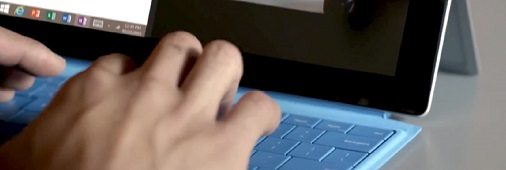
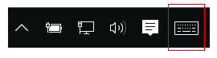
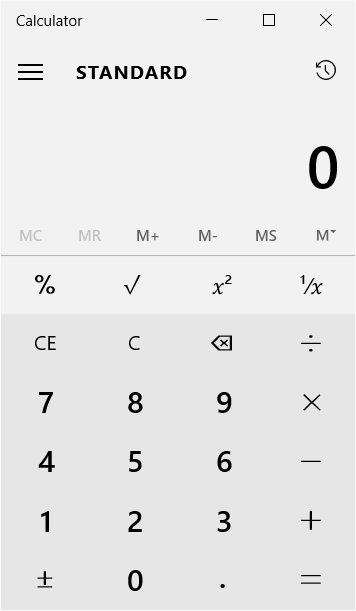
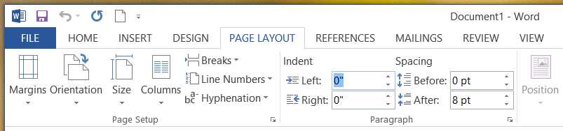

# Interacciones de teclado


La entrada de teclado es una parte importante de la experiencia de interacción del usuario global en las aplicaciones. El teclado es indispensable para personas con ciertas discapacidades o para los usuarios que, simplemente, lo consideran una manera más eficaz de interactuar con una aplicación. Por ejemplo, los usuarios deben poder navegar por la aplicación con las teclas TAB y las flechas de dirección, activar los elementos de la interfaz de usuario con la barra espaciadora y la tecla ENTRAR y, asimismo, acceder a los comandos con los métodos abreviados del teclado.



**API importantes**

-   [**KeyDown**](https://msdn.microsoft.com/library/windows/apps/br208941)
-   [**KeyUp**](https://msdn.microsoft.com/library/windows/apps/br208942)
-   [**KeyRoutedEventArgs**](https://msdn.microsoft.com/library/windows/apps/hh943072)


Una interfaz de usuario de teclado bien diseñada es un aspecto importante de la accesibilidad del software. Permite a usuarios con dificultades visuales o con ciertas discapacidades motrices navegar por una aplicación e interactuar con sus funciones. Es posible que estos usuarios no puedan controlar un mouse y empleen varias tecnologías de ayuda, como herramientas para la mejora del teclado, teclados en pantalla, ampliadores de pantallas, lectores de pantalla y utilidades de entrada de voz.

Los usuarios pueden interactuar con aplicaciones universales a través de un teclado hardware y dos teclados software: el teclado en pantalla y el teclado táctil.

<span></span>Teclado en pantalla  
El teclado en pantalla es un teclado software visual que puedes usar en lugar del teclado físico para escribir datos con entrada táctil, el mouse, el lápiz o la pluma, u otro dispositivo señalador (no es necesaria una pantalla táctil). El teclado en pantalla se proporciona para sistemas que no incluyen un teclado físico, o para usuarios cuyos problemas de movilidad les impidan usar los dispositivos de entrada físicos tradicionales. El teclado en pantalla simula la mayoría de las funciones, si no todas, de un teclado de hardware.

Puede activarse desde la página Teclado, que se encuentra en Configuración &gt; Accesibilidad.

**Nota** El teclado en pantalla tiene prioridad sobre el teclado táctil, que no se mostrará si el primero está presente.

 


<sup>Teclado en pantalla</sup>

<span id="Touch_keyboard"></span><span id="touch_keyboard"></span><span id="TOUCH_KEYBOARD"></span>Teclado táctil  
El teclado táctil es un teclado de software visual que se usa para escribir texto con entrada táctil. No es un sustituto para el teclado en pantalla ya que se usa únicamente para introducir texto (no simula el teclado de hardware).

Según el dispositivo, el teclado táctil aparece cuando un campo de texto u otro control de texto editable obtiene el foco o cuando el usuario manualmente lo habilita a través del **centro de notificaciones**:



**Nota** Es posible que el usuario deba ir a la pantalla **Modo tableta** en Configuración &gt; Sistema, y activar "Hacer que Windows se adapte mejor a los gestos táctiles al usar el dispositivo como tableta" para habilitar la aparición automática del teclado táctil.

 

Si la aplicación establece el foco mediante programación en un control de entrada de texto, no se invoca el teclado táctil. Esto elimina comportamientos inesperados no originados directamente por el usuario. Sin embargo, el teclado se oculta automáticamente cuando el foco se mueve mediante programación a un control de entrada que no es de texto.

El teclado táctil normalmente permanece visible mientras el usuario navega por los controles de un formulario. Este comportamiento puede variar en función de los otros tipos de control dentro del formulario.

La siguiente es una lista de controles de no edición que pueden recibir el foco durante una sesión de entrada de texto con el teclado táctil sin por ello descartar el teclado. En lugar de renovar innecesariamente la interfaz de usuario y, posiblemente, desorientar al usuario, el teclado táctil permanece visible porque es probable que el usuario alterne entre estos controles y la entrada de texto con el teclado táctil.

-   Casilla
-   Cuadro combinado
-   Botón de radio
-   Barra de desplazamiento
-   Árbol
-   Elemento del árbol
-   Menú
-   Barra de menús
-   Elemento de menú
-   Barra de herramientas
-   Lista
-   Elemento de lista

Estos son algunos ejemplos de los diferentes modos del teclado táctil. La primera imagen es el diseño predeterminado, la segunda es el diseño para pulgares (puede que no esté disponible para todos los idiomas).

Estos son algunos ejemplos de los diferentes modos del teclado táctil. La primera imagen es el diseño predeterminado, la segunda es el diseño para pulgares (es posible que este último no esté disponible en todos los idiomas).
<table>
<tr>
    <td>**El teclado táctil en el modo de diseño predeterminado:  **</td>
    <td></td>
</tr>
<tr>
    <td>**El teclado táctil en el modo de diseño expandido:  **</td>
    <td></td>
</tr>
<tr>
    <td>**El teclado táctil en el modo de diseño para pulgares predeterminado:  **</td>
    <td></td>
</tr>
<tr>
    <td>**El teclado táctil en el modo de diseño para pulgares numérico:  **</td>
    <td></td>
</tr>
</table>


La correcta interacción con el teclado permite a los usuarios emplear escenarios de aplicación básicos mediante el uso exclusivo del teclado. Es decir, que los usuarios pueden alcanzar todos los elementos interactivos de la interfaz de usuario y activar funciones predeterminadas. Hay una serie de factores que pueden afectar el grado de éxito, como la navegación por el teclado, las teclas de acceso para accesibilidad y las teclas de aceleración (o de método abreviado) para usuarios avanzados.

**Nota** El teclado táctil no admite la alternancia ni la mayoría de los comandos del sistema (consulta [Patrones](#keyboard_command_patterns)

## <span id="Navigation"></span><span id="navigation"></span><span id="NAVIGATION"></span>Navegación


Para usar un control (incluidos los elementos de navegación) con el teclado, el control debe tener un foco. Un modo de hacer que un control reciba el foco del teclado es hacerlo accesible a través de la navegación mediante tabulación. Un modelo de navegación de teclado bien diseñado ofrece un orden de tabulación predecible y lógico que permite que el usuario explore y use la aplicación de forma rápida y eficaz.

Todos los controles interactivos deberían tener tabulaciones (a menos que estén en un grupo), todo lo contrario de los controles no interactivos, como las etiquetas.

Es posible convertir un conjunto de controles relacionados en un grupo de controles, y asignar a este una sola tabulación. Los grupos de controles se usan para conjuntos de controles que se comportan como un control único, como los botones de radio. También pueden usarse cuando hay demasiados controles para navegar de forma eficiente solo con la tecla Tab. Las flechas de dirección, Inicio, Fin, Re Pág y Av Pág desplazan el foco de entrada entre los controles de un grupo (no es posible salir de un grupo de control mediante estas teclas).

Deberías establecer el foco inicial del teclado en el elemento con el que los usuarios interactuarán primero de forma intuitiva (o es más probable que lo hagan) al iniciarse la aplicación. A menudo se trata de la vista Contenido principal de la aplicación, de modo que el usuario pueda usar inmediatamente las teclas de flecha para desplazarse por el contenido de la aplicación.

No establezcas el foco inicial del teclado en un elemento con resultados potencialmente negativos, o incluso desastrosos. Así se evita la pérdida de datos o de acceso al sistema.

Prueba a clasificar y presentar los comandos, controles y contenido más importantes en primer lugar, tanto en el orden de tabulación como en el orden de visualización (o jerarquía visual). Sin embargo, la posición de visualización puede depender del contenedor de diseño primario y de ciertas propiedades de los elementos secundarios que influyen en el diseño. En particular, los diseños que usan una metáfora de cuadrícula o una tabla pueden tener un orden de lectura muy diferente del orden de tabulación. Esto no es siempre un problema, pero deberías probar la funcionalidad de la aplicación tanto con una interfaz de usuario táctil como con una interfaz accesible mediante teclado.

El orden de tabulación debería seguir el de lectura, siempre que sea posible. Esto puede reducir la confusión y depende de la configuración regional y de idioma.

Asocia los botones del teclado con la interfaz de usuario correspondiente (botones Atrás y Adelante) en tu aplicación.

Intenta que la vuelta a la pantalla de inicio de la aplicación y el desplazamiento entre los principales contenidos sea lo más fácil y directo posible.

Usa las teclas de flecha como métodos abreviados de teclado para una navegación interna apropiada entre los elementos secundarios de los elementos compuestos. Si los nodos de la vista de árbol tienen elementos secundarios separados para administrar la activación de nodos y las acciones de expandir/contraer, usa las teclas de flecha izquierda y derecha para proporcionar la funcionalidad de expandir/contraer del teclado. Esto es coherente con los controles de plataforma.

Dado que el teclado táctil tapa una gran parte de la pantalla, la Plataforma universal de Windows (UWP) garantiza que el campo de entrada con el foco se muestre siempre aunque el usuario se desplace por los controles del formulario, incluidos los controles que no están en la vista. Los controles personalizados deberían emular este comportamiento.


En algunos casos, algunos elementos de interfaz de usuario deben permanecer en la pantalla todo el tiempo. Diseña la interfaz de usuario de modo que los controles del formulario estén incluidos en una región de movimiento panorámico y los elementos de interfaz de usuario importantes permanezcan estáticos. Por ejemplo:


## <span id="Activation"></span><span id="activation"></span><span id="ACTIVATION"></span>Activación


Un control puede activarse de varias maneras, tenga o no el foco.

<span id="Spacebar__Enter__and_Esc"></span><span id="spacebar__enter__and_esc"></span><span id="SPACEBAR__ENTER__AND_ESC"></span>Barra espaciadora, Intro y Esc  
La barra espaciadora debería activar el control con el foco de entrada. La tecla Intro debería activar un control predeterminado o el control con el foco de entrada. Un control predeterminado es aquel con el foco inicial, o uno que responde exclusivamente a la tecla Intro (normalmente cambia con el foco de entrada). Además, la tecla Esc debería cerrar o salir de una interfaz de usuario transitoria, como un menú o cuadro de diálogo.

La aplicación Calculadora que se muestra aquí usa la barra espaciadora para activar el botón con el foco, bloquea la tecla ENTRAR para el botón "=" y bloquea la tecla Esc para el botón "C".



<span id="Keyboard_modifiers"></span><span id="keyboard_modifiers"></span><span id="KEYBOARD_MODIFIERS"></span>Modificadores de teclado  
Los modificadores de teclado se dividen en las siguientes categorías: 

 
| Categoría | Descripción | 
|----------|-------------| 
| Teclas de método abreviado | Realiza una acción habitual sin usar la interfaz de usuario, por ejemplo, "Ctrl+S" para **Guardar**. Implementa métodos abreviados de teclado para las funciones principales de la aplicación. No todos los comandos tienen o requieren un método abreviado. |   
| Teclas de acceso/Teclas de acceso rápido | Se asignan a todos los controles visibles y de nivel superior como "Alt+F" para el menú **Archivo**. Las teclas de acceso no invocan o activan comandos. |
| Teclas aceleradoras | Realiza comandos predeterminados del sistema o definidos por la aplicación, por ejemplo, "Alt+Impr Pant" para las capturas de pantalla, "Alt+TAB" para cambiar de aplicación o "F1" para obtener ayuda. Los comandos asociados con las teclas de aceleración no tienen por qué ser elementos de menú. |
| Teclas de aplicación/Teclas de menú | Muestra el menú contextual. |
| Teclas de ventana/Teclas de comando | Activa comandos del sistema tales como **menú de sistema**, **pantalla de bloqueo** o **mostrar escritorio**. |

Las teclas de acceso y las teclas de aceleración te permiten interactuar directamente con los controles, en lugar de acceder a ellos mediante la tecla TAB.
> Aunque algunos controles tienen etiquetas intrínsecas, como los botones de comando, las casillas y los botones de radio, otros tienen etiquetas externas, como las vistas de lista. Para los controles con etiquetas externas, la tecla de acceso se asigna a la etiqueta, que, cuando se invoca, establece el foco en un elemento o valor dentro del control asociado.


En este ejemplo se muestran las teclas de acceso de la pestaña **Diseño de página** que se encuentra en **Word**.


Aquí se resalta el valor del campo de texto Sangría izquierda, después de escribir la clave de acceso identificada en la etiqueta asociada.



## <span id="Usability_and_accessibility"></span><span id="usability_and_accessibility"></span><span id="USABILITY_AND_ACCESSIBILITY"></span>Facilidad de uso y accesibilidad


Una experiencia de interacción de teclado bien diseñada es un aspecto importante de la accesibilidad del software. Permite a usuarios con dificultades visuales o con ciertas discapacidades motrices navegar por una aplicación e interactuar con sus funciones. Es posible que estos usuarios no puedan controlar un mouse y deban emplear diversas tecnologías de ayuda, como herramientas para la mejora del teclado y teclados en pantalla (además de ampliadores y lectores de pantalla y utilidades de entrada de voz). Para estos usuarios, la exhaustividad es más importante que la coherencia.

Los usuarios con experiencia suelen tener una fuerte preferencia por el teclado, ya que los comandos se pueden introducir más rápidamente y no requieran apartar las manos de las teclas. Para estos usuarios, la eficacia y la coherencia son cruciales; la exhaustividad es importante solo para los comandos usados con más frecuencia.

Existen diferencias sutiles al diseñar para lograr facilidad de uso o accesibilidad, motivo por el cual se admiten dos mecanismos distintos de acceso de teclado.

Las teclas de acceso tienen las siguientes características:

-   Una tecla de acceso es un método abreviado a un elemento de la interfaz de usuario de tu aplicación.
-   Usan la tecla Alt y una tecla alfanumérica.
-   Son principalmente para la accesibilidad.
-   Se asignan a todos los menús y a la mayoría de los controles de cuadro de diálogo.
-   No se espera que se memoricen, por lo que se documentan directamente en la interfaz de usuario subrayando el carácter de etiqueta correspondiente.
-   Tienen efecto únicamente en la ventana actual y desplazan al control o elemento de menú correspondiente.
-   No se asignan de forma coherente porque no siempre es posible hacerlo. Sin embargo, las teclas de acceso deben asignarse de forma coherente para los comandos usados con frecuencia, especialmente los botones de confirmación.
-   Están traducidas.

Como no se pretende que las teclas de acceso se memoricen, se les asigna uno de los primeros caracteres de la etiqueta para que sean fáciles de encontrar, aunque en la etiqueta aparezca más adelante una palabra clave.

Por su parte, las teclas de aceleración tienen las siguientes características:

-   Una tecla de aceleración es un método abreviado a un comando de la aplicación.
-   Usan principalmente secuencias de Ctrl y teclas de función (las teclas de método abreviado del sistema de Windows usan también Alt + teclas no alfanuméricos y la tecla del logotipo de Windows).
-   Su fin principal es aumentar la eficiencia de los usuarios avanzados.
-   Se asignan únicamente a los comandos que más se usan.
-   Se espera que se memoricen y solo se documentan en los menús, en la información sobre herramientas y en la Ayuda.
-   Tienen efecto en todo el programa, pero no tienen efecto si no son de aplicación.
-   Se deben asignar de forma coherente porque se memorizan y no se documentan de forma directa.
-   No están traducidas.

Como se espera que las teclas aceleradoras se memoricen, las más usadas tratan de emplear las letras primeras o más memorables de las palabras clave del comando, como CTRL+C para copiar.

Los usuarios deberían poder realizar todas las tareas admitidas por la aplicación usando solo el teclado hardware o el teclado en pantalla.

Deberías proporcionar una forma sencilla para que los usuarios que usan lectores de pantalla y otra tecnología de asistencia puedan descubrir las teclas aceleradoras de tu aplicación. Comunica las teclas aceleradoras mediante información sobre herramientas, nombres accesibles, descripciones accesibles o alguna otra forma de comunicación en pantalla. Como mínimo, las teclas aceleradoras deben estar correctamente documentadas en la Ayuda de la aplicación.

No asignar teclas de aceleración bien conocidas o estándar a otra funcionalidad. Por ejemplo, Ctrl+F normalmente se usa para realizar búsquedas.

No te molestes en asignar teclas de acceso a todos los controles interactivos de una interfaz de usuario densa. Asegúrate simplemente de que las más importantes y usadas dispongan de una tecla de acceso, o usa grupos de control y asigna una tecla de acceso a la etiqueta de dicho grupo.

No cambies comandos mediante modificadores de teclado. Puede causar confusión al no ser posible darse cuenta.

No deshabilite un control que tiene el foco de entrada. Esto puede interferir con la entrada de teclado.

Para garantizar una correcta experiencia de interacción con el teclado, es fundamental probar la aplicación cuidadosamente, empleando únicamente el teclado.

## <span id="Text_input"></span><span id="text_input"></span><span id="TEXT_INPUT"></span>Entrada de texto


Consulta siempre las capacidades del dispositivo al usar una entrada de teclado. En algunos dispositivos (como un teléfono), el teclado táctil solo puede usarse para escribir texto y no proporciona muchas de las teclas aceleradoras o de comando que se encuentran en un teclado hardware (como la tecla Alt, las teclas de función o la tecla con el logotipo de Windows).

No obligues a los usuarios a moverse por la aplicación con el teclado táctil. En función del control que obtiene el foco, el teclado táctil podría descartarse.

Intenta mostrar el teclado durante toda la interacción con el formulario. Esto evita la renovación de la interfaz de usuario, que puede desorientar al usuario en pleno flujo de entrada de texto o de un formulario.

Asegúrate de que el usuario siempre pueda ver el campo de entrada en el que están escribiendo. El teclado táctil tapa la mitad de la pantalla, por lo que el campo de entrada con el foco deberá desplazarse para seguir mostrándose a medida que el usuario recorra el formulario.

Un teclado de hardware estándar o un teclado en pantalla constan de siete tipos de teclas, cada uno con una funcionalidad propia:

-   Teclas de caracteres: envían un carácter literal a la ventana con el foco de entrada.
-   Teclas modificadoras: alteran la función de una tecla principal cuando se presionan al mismo tiempo, como Ctrl, Alt, Mayús y la tecla del logotipo de Windows.
-   Teclas de exploración: mueven el foco de entrada o la ubicación de entrada de texto, como Tab, Inicio, Fin, Re Pág, Av Pág y las flechas de dirección.
-   Teclas de edición: manipulan el texto, como Mayús, Tab, Intro, Insert, Retroceso y Supr.
-   Teclas de función: realiza una función especial, como las teclas F1 a F12.
-   Teclas de alternancia: ponen el sistema en un modo determinado; por ejemplo, las teclas Bloq Mayús, Bloq Despl y Bloq Num.
-   Teclas de comando: realizan una tarea del sistema o un comando de activación, como la barra espaciadora, Intro, Esc, Pausa/Inter e Impr Pant.

Además de estas categorías, existe una clase secundaria de teclas y combinaciones de teclas que pueden usarse como accesos directos a las funciones de la aplicación:

-   Teclas de acceso: exponen controles o elementos de menú presionando la tecla Alt y una tecla de carácter indicada por un carácter de acceso subrayado. Este carácter subrayado aparece en los menús o en alguna superposición que muestre las distintas teclas de acceso.
-   Teclas aceleradoras: exponen los comandos de la aplicación al presionar una tecla de función o la tecla Ctrl más una tecla de carácter. Tu aplicación podría o no tener una interfaz de usuario que se corresponda exactamente con el comando.

Una aplicación no puede interceptar otra clase de combinaciones de teclas, conocida como secuencia de aviso de seguridad (SAS). Esta es una característica de seguridad destinada a proteger el sistema del usuario durante el inicio de sesión e incluir Ctrl+Alt+Supr y Win+L.

Aquí se muestra la aplicación Bloc de notas, con el menú archivo expandido para poder ver las teclas de acceso y de aceleración.


## <span id="Keyboard_commands"></span><span id="keyboard_commands"></span><span id="KEYBOARD_COMMANDS"></span>Comandos de teclado


La siguiente es una lista completa de las interacciones de teclado que se proporcionan en los diversos dispositivos que admiten la entrada de teclado. Algunos dispositivos y plataformas requieren interacciones y pulsaciones de teclas propias, y en estos casos así se indica.

Al diseñar las interacciones y los controles personalizados, usa este idioma de teclado de forma coherente para que tu aplicación resulte familiar, confiable y fácil de aprender.

No redefinas los métodos abreviados de teclado predeterminados.

Las siguientes tablas enumeran los comandos de teclado usados con frecuencia. Para obtener una lista completa de comandos de teclado, consulta el tema sobre las [teclas de métodos abreviados del teclado de Windows](http://go.microsoft.com/fwlink/p/?linkid=325424).

**Comandos de navegación**

| Acción                               | Comando de tecla                                      |
|--------------------------------------|--------------------------------------------------|
| Atrás                                 | Alt+Izquierda o el botón Atrás en teclados especiales |
| Adelante                              | Alt+Derecha                                        |
| Arriba                                   | Alt+Arriba                                           |
| Cancelar o salir del modo actual   | Esc                                              |
| Moverse por elementos de una lista         | Tecla de flecha (Izquierda, Derecha, Arriba, Abajo)                |
| Saltar a la siguiente lista de elementos           | Ctrl+Izquierda                                        |
| Zoom semántico                        | Ctrl++ o Ctrl+-                                 |
| Saltar a un elemento denominado en una colección | Comenzar a escribir el nombre del elemento                           |
| Página siguiente                            | Repág, Avpág o Barra espaciadora                   |
| Pestaña siguiente                             | Ctrl+TAB                                         |
| Pestaña anterior                         | Ctrl+Mayús+TAB                                   |
| Abrir barra de la aplicación                         | Windows+Z                                        |
| Activar o navegar a un elemento    | Entrar                                            |
| Seleccionar                               | Barra espaciadora                                         |
| Seleccionar continuamente                  | Mayús+Tecla de flecha                                  |
| Seleccionar todos                           | Ctrl+A                                           |

 

**Comandos comunes**

| Acción                                                 | Comando de tecla     |
|--------------------------------------------------------|-----------------|
| Anclar un elemento                                            | Ctrl+Mayús+1    |
| Guardar                                                   | Ctrl+S          |
| Buscar                                                   | Ctrl+F          |
| Imprimir                                                  | Ctrl+P          |
| Copiar                                                   | Ctrl+C          |
| Cortar                                                    | Ctrl+X          |
| Nuevo elemento                                               | Ctrl+N          |
| Pegar                                                  | Ctrl+V          |
| Abrir                                                   | Ctrl+O          |
| Abrir dirección (por ejemplo, una URL en Internet Explorer) | Ctrl+L o Alt+D |

 

**Comandos de navegación multimedia**

| Acción       | Comando de tecla |
|--------------|-------------|
| Reproducir/Pausar   | Ctrl+P      |
| Elemento siguiente    | Ctrl+F      |
| Elemento anterior | Ctrl+B      |

 

Nota: los comandos de tecla de navegación multimedia para Reproducir o Pausar y Elemento siguiente son los mismos que los comandos de tecla para Imprimir y Buscar, respectivamente. Los comandos comunes deben tener prioridad sobre los comando de navegación multimedia. Por ejemplo, si una aplicación admite tanto la reproducción como la impresión de medios, el comando Ctrl+P debe destinarse a impresión.
## <span id="Visual_feedback"></span><span id="visual_feedback"></span><span id="VISUAL_FEEDBACK"></span>Información visual


Usa rectángulos de foco solamente con las interacciones del teclado. Si el usuario inicia una interacción táctil, haz que la interfaz de usuario del teclado vaya desapareciendo de forma gradual. Esto mantiene la interfaz de usuario ordenada y organizada.

No muestres información visual si un elemento no admite interacción (por ejemplo, texto estático). De nuevo, esto mantiene la interfaz de usuario limpia y despejada.

Intenta mostrar información visual simultáneamente para todos los elementos que representan el mismo destino de entrada.

Intenta proporcionar botones en pantalla (como + y -) como sugerencias para simular las manipulaciones táctiles, como realizar un movimiento panorámico, girar, hacer zoom, etc.

Para obtener instrucciones más generales sobre la información visual, consulta el tema sobre las [directrices para información visual](guidelines-for-visualfeedback.md).


## <span id="keyboard_events"></span><span id="KEYBOARD_EVENTS"></span>Eventos de teclado y foco


Los siguientes eventos de teclado se pueden producir en teclados tanto de hardware como táctiles.

| Evento                                      | Descripción                    |
|--------------------------------------------|--------------------------------|
| [**KeyDown**](https://msdn.microsoft.com/library/windows/apps/br208941) | Ocurre cuando se presiona una tecla.  |
| [**KeyUp**](https://msdn.microsoft.com/library/windows/apps/br208942)     | Ocurre cuando se libera una tecla. |


**Importante**  
Algunos controles de Windows Runtime controlan los eventos de entrada de manera interna. en cuyo caso puede dar la impresión de que un evento de entrada no se produce, dado que la escucha de eventos no invoca al controlador asociado correspondiente. Normalmente, este subconjunto de teclas se procesa mediante el controlador de eventos de clase para aportar compatibilidad integrada de accesibilidad de teclado básico. Por ejemplo, la clase [**Button**](https://msdn.microsoft.com/library/windows/apps/br209265) invalida los eventos [**OnKeyDown**](https://msdn.microsoft.com/library/windows/apps/hh967982) tanto de la barra espaciadora como de la tecla ENTRAR (así como [**OnPointerPressed**](https://msdn.microsoft.com/library/windows/apps/hh967989)) y los enruta al evento [**Click**](https://msdn.microsoft.com/library/windows/apps/br227737) del control. Cuando una presión de tecla se controla mediante la clase de control, no se generan los eventos [**KeyDown**](https://msdn.microsoft.com/library/windows/apps/br208941) y [**KeyUp**](https://msdn.microsoft.com/library/windows/apps/br208942).

Esto proporciona un teclado integrado que equivale a invocar el botón, como si se presionara con un dedo o se hiciera clic en él con un mouse. Las teclas que no son la barra espaciadora ni ENTRAR sí siguen desencadenando eventos [**KeyDown**](https://msdn.microsoft.com/library/windows/apps/br208941) y [**KeyUp**](https://msdn.microsoft.com/library/windows/apps/br208942). Para obtener más información sobre cómo funciona el control de eventos basado en clases (en concreto, la sección "Controladores de eventos de entrada en controles"). Consulta [Introducción a eventos y eventos enrutados](https://msdn.microsoft.com/library/windows/apps/mt185584).


Los controles de la interfaz de usuario generan eventos de teclado solo cuando tienen el foco de entrada. Un control individual obtiene el foco cuando el usuario hace clic o presiona directamente sobre dicho control en el diseño o bien usa la tecla TAB para entrar en una secuencia de tabulación dentro del área de contenido.

También puedes llamar al método [**Focus**](https://msdn.microsoft.com/library/windows/apps/hh702161) de un control para forzar el foco. Esto solo es necesario si implementas teclas de método abreviado, porque el foco del teclado no se establece de manera predeterminada cuando se carga la interfaz de usuario. Si deseas obtener más información, consulta el [ejemplo de teclas de método abreviado](#shortcut_keys_example) más adelante en este tema.

Para que un control reciba el foco de entrada, debe estar habilitado y sus propiedades [**IsTabStop**](https://msdn.microsoft.com/library/windows/apps/br209422) y [**HitTestVisible**](https://msdn.microsoft.com/library/windows/apps/br208933) deben tener un valor **true**. Este es el estado predeterminado para la mayoría de los controles. Cuando un control tiene el foco de entrada, puede generar eventos de entrada del teclado y responder a ellos, tal y como se describe más adelante en este capítulo. También puedes responder a un control que recibe o pierde el enfoque al controlar los eventos [**GotFocus**](https://msdn.microsoft.com/library/windows/apps/br208927) y [**LostFocus**](https://msdn.microsoft.com/library/windows/apps/br208943).

De manera predeterminada, la secuencia de tabulación de los controles es el orden con que aparecen en el lenguaje XAML. Sin embargo, puedes modificar este orden mediante la propiedad [**TabIndex**](https://msdn.microsoft.com/library/windows/apps/br209461). Para más información, consulta [Implementación de accesibilidad de teclado](https://msdn.microsoft.com/library/windows/apps/hh868161).

## <span id="keyboard_event_handlers"></span><span id="KEYBOARD_EVENT_HANDLERS"></span>Controladores de eventos de teclado


Un controlador de eventos de entrada implementa un delegado que proporciona la siguiente información:

-   El remitente del evento. El remitente notifica el objeto al que se adjunta el controlador de eventos.
-   Datos del evento. Para los eventos de teclado, esos datos serán una instancia de [**KeyRoutedEventArgs**](https://msdn.microsoft.com/library/windows/apps/hh943072). El delegado de los controladores es [**KeyEventHandler**](https://msdn.microsoft.com/library/windows/apps/br227904). Las propiedades más importantes de la clase **KeyRoutedEventArgs** para la mayoría de los escenarios de controladores, son [**Key**](https://msdn.microsoft.com/library/windows/apps/hh943074) y posiblemente [**KeyStatus**](https://msdn.microsoft.com/library/windows/apps/hh943075).
-   [
              **OriginalSource**
            ](https://msdn.microsoft.com/library/windows/apps/br208810). Dado que los eventos de teclado están enrutados, los datos del evento proporcionan el objeto **OriginalSource**. Si estás permitiendo deliberadamente que los eventos se propaguen por un árbol de objetos, a veces **OriginalSource** es el objeto de interés en lugar del remitente. Sin embargo, eso depende de tu diseño. Si quieres obtener más información sobre cómo podrías usar el objeto **OriginalSource** en lugar del remitente, consulta la sección "Eventos de teclado enrutados" de este tema o bien el tema [Introducción a eventos y eventos enrutados](https://msdn.microsoft.com/library/windows/apps/mt185584).

### <span id="attaching_a_keyboard_event_handler"></span><span id="ATTACHING_A_KEYBOARD_EVENT_HANDLER"></span>Adjuntar un controlador de eventos de teclado

Puedes adjuntar funciones de controlador de eventos de teclado a cualquier objeto que incluya el evento como miembro. Esto engloba cualquier clase derivada de [**UIElement**](https://msdn.microsoft.com/library/windows/apps/br208911). El siguiente ejemplo en XAML muestra cómo adjuntar controladores para el evento [**KeyUp**](https://msdn.microsoft.com/library/windows/apps/br208942) de una clase [**Grid**](https://msdn.microsoft.com/library/windows/apps/br242704).

```XAML
<Grid KeyUp="Grid_KeyUp">
  ...
</Grid>
```

También puedes adjuntar un controlador de eventos mediante código. Para más información, consulta el tema [Introducción a eventos y eventos enrutados](https://msdn.microsoft.com/library/windows/apps/mt185584).

### <span id="defining_a_keyboard_event_handler"></span><span id="DEFINING_A_KEYBOARD_EVENT_HANDLER"></span>Definición de un controlador de eventos de teclado

El siguiente ejemplo muestra la definición incompleta de un controlador de eventos para el controlador de eventos [**KeyUp**](https://msdn.microsoft.com/library/windows/apps/br208942) que se adjuntó en el ejemplo anterior.

```CSharp
void Grid_KeyUp(object sender, KeyRoutedEventArgs e)
{
    //handling code here
}
```

```VisualBasic
Private Sub Grid_KeyUp(ByVal sender As Object, ByVal e As KeyRoutedEventArgs)
    &#39;handling code here
End Sub
```

```ManagedCPlusPlus
void MyProject::MainPage::Grid_KeyUp(
  Platform::Object^ sender,
  Windows::UI::Xaml::Input::KeyRoutedEventArgs^ e)
{//handling code here}
```

### <span id="using_keyroutedeventargs"></span><span id="USING_KEYROUTEDEVENTARGS"></span>Uso de KeyRoutedEventArgs

Todos los eventos de teclado usan [**KeyRoutedEventArgs**](https://msdn.microsoft.com/library/windows/apps/hh943072) para datos de eventos. **KeyRoutedEventArgs** contiene las siguientes propiedades:

-   [**Key**](https://msdn.microsoft.com/library/windows/apps/hh943074)
-   [**KeyStatus**](https://msdn.microsoft.com/library/windows/apps/hh943075)
-   [**Handled**](https://msdn.microsoft.com/library/windows/apps/hh943073)
-   [
              **OriginalSource**
            ](https://msdn.microsoft.com/library/windows/apps/br208810) (heredada de [**RoutedEventArgs**](https://msdn.microsoft.com/library/windows/apps/br208809)

### <span id="key"></span><span id="KEY"></span>Tecla

El evento [**KeyDown**](https://msdn.microsoft.com/library/windows/apps/br208941) se genera si se presiona una tecla. De igual modo, [**KeyUp**](https://msdn.microsoft.com/library/windows/apps/br208942) se genera si se libera una tecla. Por lo general, los eventos se escuchan para procesar un valor de tecla específico. Para determinar qué tecla se presiona o se libera, comprueba el valor [**Key**](https://msdn.microsoft.com/library/windows/apps/hh943074) en los datos del evento. La propiedad **Key** devuelve un valor [**VirtualKey**](https://msdn.microsoft.com/library/windows/apps/br241812). La enumeración **VirtualKey** incluye todas las teclas compatibles.

### <span id="modifier_keys"></span><span id="MODIFIER_KEYS"></span>Teclas modificadoras

Las teclas modificadoras son teclas como Ctrl o Mayús que los usuarios suelen presionar en combinación con otras teclas. Tu aplicación puede usar estas combinaciones como métodos abreviados de teclado para invocar comandos de la aplicación.

Las combinaciones de teclas de método abreviado se detectan usando código en los controladores de eventos [**KeyDown**](https://msdn.microsoft.com/library/windows/apps/br208941) y [**KeyUp**](https://msdn.microsoft.com/library/windows/apps/br208942). Después, puedes seguir el estado de las teclas modificadoras presionadas que te interesen. Cuando se produce un evento de teclado para una tecla que no es modificadora, puedes comprobar si hay una tecla modificadora presionada al mismo tiempo.

**Nota** La tecla Alt está representada por el valor **VirtualKey.Menu**.

 

## <span id="shortcut_keys_example"></span><span id="SHORTCUT_KEYS_EXAMPLE"></span>Ejemplo de teclas de método abreviado


En el siguiente ejemplo se muestra cómo implementar teclas de método abreviado. En este ejemplo, los usuarios pueden controlar la reproducción multimedia con los botones Reproducir, Pausa y Detener, o bien con las teclas de método abreviado Ctrl+P, Ctrl+A y Ctrl+S. El XAML de los botones muestra los métodos abreviados mediante las propiedades [**AutomationProperties**](https://msdn.microsoft.com/library/windows/apps/br209081) e información sobre herramientas en las etiquetas de los botones. Esta información automática es importante para mejorar la facilidad de uso y de acceso de tu aplicación. Para más información, consulta [Accesibilidad de teclado](https://msdn.microsoft.com/library/windows/apps/mt244347).

Ten en cuenta que la página establece el foco de entrada en sí misma cuando se carga. Sin este paso, ninguno de los controles tiene el enfoque de entrada inicial y la aplicación no genera eventos de entrada hasta que el usuario establezca el enfoque manualmente (por ejemplo, mediante tabulación o haciendo clic en un control).

```XAML
<Grid KeyDown="Grid_KeyDown">

  <Grid.RowDefinitions>
    <RowDefinition Height="Auto" />
    <RowDefinition Height="Auto" />
  </Grid.RowDefinitions>

  <MediaElement x:Name="DemoMovie" Source="xbox.wmv" 
    Width="500" Height="500" Margin="20" HorizontalAlignment="Center" />

  <StackPanel Grid.Row="1" Margin="10"
    Orientation="Horizontal" HorizontalAlignment="Center">

    <Button x:Name="PlayButton" Click="MediaButton_Click"
      ToolTipService.ToolTip="Shortcut key: Ctrl+P"
      AutomationProperties.AcceleratorKey="Control P">
      <TextBlock>Play</TextBlock>
    </Button>

    <Button x:Name="PauseButton" Click="MediaButton_Click"
      ToolTipService.ToolTip="Shortcut key: Ctrl+A" 
      AutomationProperties.AcceleratorKey="Control A">
      <TextBlock>Pause</TextBlock>
    </Button>

    <Button x:Name="StopButton" Click="MediaButton_Click"
      ToolTipService.ToolTip="Shortcut key: Ctrl+S" 
      AutomationProperties.AcceleratorKey="Control S">
      <TextBlock>Stop</TextBlock>
    </Button>

  </StackPanel>

</Grid>
```

```ManagedCPlusPlus
//showing implementations but not header definitions
void MainPage::OnNavigatedTo(NavigationEventArgs^ e)
{
    (void) e;    // Unused parameter
    this->Loaded+=ref new RoutedEventHandler(this,&amp;MainPage::ProgrammaticFocus);
}
void MainPage::ProgrammaticFocus(Object^ sender, RoutedEventArgs^ e) {
    this->Focus(Windows::UI::Xaml::FocusState::Programmatic);
}

void KeyboardSupport::MainPage::MediaButton_Click(Platform::Object^ sender, Windows::UI::Xaml::RoutedEventArgs^ e)
{
    FrameworkElement^ fe = safe_cast<FrameworkElement^>(sender);
    if (fe->Name == "PlayButton") {DemoMovie->Play();}
    if (fe->Name == "PauseButton") {DemoMovie->Pause();}
    if (fe->Name == "StopButton") {DemoMovie->Stop();}
}


void KeyboardSupport::MainPage::Grid_KeyDown(Platform::Object^ sender, Windows::UI::Xaml::Input::KeyRoutedEventArgs^ e)
{
    if (e->Key == VirtualKey::Control) isCtrlKeyPressed = true;
}


void KeyboardSupport::MainPage::Grid_KeyUp(Platform::Object^ sender, Windows::UI::Xaml::Input::KeyRoutedEventArgs^ e)
{
    if (e->Key == VirtualKey::Control) isCtrlKeyPressed = true;
    else if (isCtrlKeyPressed) {
        if (e->Key==VirtualKey::P) {
            DemoMovie->Play();
        }
        if (e->Key==VirtualKey::A) {DemoMovie->Pause();}
        if (e->Key==VirtualKey::S) {DemoMovie->Stop();}
    }
}
```

```CSharp
protected override void OnNavigatedTo(NavigationEventArgs e)
{
    // Set the input focus to ensure that keyboard events are raised.
    this.Loaded += delegate { this.Focus(FocusState.Programmatic); };
}

private void Grid_KeyUp(object sender, KeyRoutedEventArgs e)
{
    if (e.Key == VirtualKey.Control) isCtrlKeyPressed = false;
}

private void Grid_KeyDown(object sender, KeyRoutedEventArgs e)
{
    if (e.Key == VirtualKey.Control) isCtrlKeyPressed = true;
    else if (isCtrlKeyPressed)
    {
        switch (e.Key)
        {
            case VirtualKey.P: DemoMovie.Play(); break;
            case VirtualKey.A: DemoMovie.Pause(); break;
            case VirtualKey.S: DemoMovie.Stop(); break;
        }
    }
}

private void MediaButton_Click(object sender, RoutedEventArgs e)
{
    switch ((sender as Button).Name)
    {
        case "PlayButton": DemoMovie.Play(); break;
        case "PauseButton": DemoMovie.Pause(); break;
        case "StopButton": DemoMovie.Stop(); break;
    }
}
```

```VisualBasic
Private isCtrlKeyPressed As Boolean
Protected Overrides Sub OnNavigatedTo(e As Navigation.NavigationEventArgs)

End Sub

Private Sub Grid_KeyUp(sender As Object, e As KeyRoutedEventArgs)
    If e.Key = Windows.System.VirtualKey.Control Then
        isCtrlKeyPressed = False
    End If
End Sub

Private Sub Grid_KeyDown(sender As Object, e As KeyRoutedEventArgs)
    If e.Key = Windows.System.VirtualKey.Control Then isCtrlKeyPressed = True
    If isCtrlKeyPressed Then
        Select Case e.Key
            Case Windows.System.VirtualKey.P
                DemoMovie.Play()
            Case Windows.System.VirtualKey.A
                DemoMovie.Pause()
            Case Windows.System.VirtualKey.S
                DemoMovie.Stop()
        End Select
    End If
End Sub

Private Sub MediaButton_Click(sender As Object, e As RoutedEventArgs)
    Dim fe As FrameworkElement = CType(sender, FrameworkElement)
    Select Case fe.Name
        Case "PlayButton"
            DemoMovie.Play()
        Case "PauseButton"
            DemoMovie.Pause()
        Case "StopButton"
            DemoMovie.Stop()
    End Select
End Sub
```

**Nota** Si estableces [**AutomationProperties.AcceleratorKey**](https://msdn.microsoft.com/library/windows/apps/hh759762) o [**AutomationProperties.AccessKey**](https://msdn.microsoft.com/library/windows/apps/hh759763) en XAML, podrás obtener información sobre la cadena; esto te permitirá documentar la tecla de método abreviado para invocar esa acción en particular. Los clientes de automatización de la interfaz de usuario de Microsoft (como, por ejemplo, Narrador) capturan esta información que, por lo general, se entrega directamente al usuario. Establecer **AutomationProperties.AcceleratorKey** o **AutomationProperties.AccessKey** no genera ninguna acción. Deberás adjuntar controladores para los eventos [**KeyDown**](https://msdn.microsoft.com/library/windows/apps/br208941) o [**KeyUp**](https://msdn.microsoft.com/library/windows/apps/br208942) para implementar el comportamiento de método abreviado de teclado en tu aplicación. Además, el detalle de texto subrayado en una tecla de acceso no se proporciona de manera automática. Si quieres mostrar texto subrayado en la interfaz de usuario, debes subrayar explícitamente el texto de la tecla de acceso específica como formato [**Underline**](https://msdn.microsoft.com/library/windows/apps/br209982) en línea.

 

## <span id="keyboard_routed_events"></span><span id="KEYBOARD_ROUTED_EVENTS"></span>Eventos de teclado enrutados


Ciertos eventos son eventos enrutados, entre ellos [**KeyDown**](https://msdn.microsoft.com/library/windows/apps/br208941) y [**KeyUp**](https://msdn.microsoft.com/library/windows/apps/br208942). Los eventos enrutados usan la estrategia de enrutamiento por propagación. La estrategia de enrutamiento por propagación significa que un evento se origina en un objeto secundario y después se enruta hacia los objetos primarios sucesivos del árbol de objetos. Esto da otra oportunidad para controlar el mismo evento e interactuar con los mismos datos de evento.

Observa el siguiente ejemplo de XAML, que controla eventos [**KeyUp**](https://msdn.microsoft.com/library/windows/apps/br208942) para una clase [**Canvas**](https://msdn.microsoft.com/library/windows/apps/br209267) y dos objetos [**Button**](https://msdn.microsoft.com/library/windows/apps/br209265). En este caso, si liberas una tecla mientras el foco está en cualquiera de los objetos **Button**, se genera el evento **KeyUp**. A continuación, el evento se propaga a la clase **Canvas** primaria.

```XAML
<StackPanel KeyUp="StackPanel_KeyUp">
  <Button Name="ButtonA" Content="Button A"/>
  <Button Name="ButtonB" Content="Button B"/>
  <TextBlock Name="statusTextBlock"/>
</StackPanel>
```

El siguiente ejemplo muestra cómo implementar el controlador de eventos [**KeyUp**](https://msdn.microsoft.com/library/windows/apps/br208942) para el contenido en XAML correspondiente al ejemplo anterior.

```CSharp
void StackPanel_KeyUp(object sender, KeyRoutedEventArgs e)
{
    statusTextBlock.Text = String.Format(
        "The key {0} was pressed while focus was on {1}",
        e.Key.ToString(), (e.OriginalSource as FrameworkElement).Name);
}
```

Observa el uso de la propiedad [**OriginalSource**](https://msdn.microsoft.com/library/windows/apps/br208810) en el controlador precedente. Aquí **OriginalSource** notifica el objeto que generó el evento. El objeto no pudo ser [**StackPanel**](https://msdn.microsoft.com/library/windows/apps/br209635) porque **StackPanel** no es un control y no puede tener el foco. Solo uno de los dos botones dentro de **StackPanel** podría haber generado el evento, pero ¿cuál? Usa **OriginalSource** para distinguir el objeto origen real del evento, si estás controlando el evento en un objeto primario.

### <span id="handled_property"></span><span id="HANDLED_PROPERTY"></span>La propiedad Handled en los datos de evento

En función de la estrategia de control de eventos que implementes, puede ser que desees que solo un controlador de eventos reaccione ante un evento de propagación. Por ejemplo, si tienes un controlador [**KeyUp**](https://msdn.microsoft.com/library/windows/apps/br208942) específico adjunto a uno de los controles [**Button**](https://msdn.microsoft.com/library/windows/apps/br209265), tendría la primera oportunidad de controlar dicho evento. En este caso, quizás no quieras que el panel primario controle también el evento. Para este escenario, puedes usar la propiedad [**Handled**](https://msdn.microsoft.com/library/windows/apps/hh943073) en los datos del evento.

El propósito de la propiedad [**Handled**](https://msdn.microsoft.com/library/windows/apps/hh943073) en una clase de datos de evento enrutado es notificar que otro controlador que registraste antes en la ruta del evento ya ha actuado. Esto influye en el comportamiento del sistema de eventos enrutados. Cuando estableces **Handled** en **true** en un controlador de eventos, ese evento deja de enrutarse y no se envía a los elementos primarios sucesivos.

### <span id="addhandler_and_already_handled_keyboard_events"></span><span id="ADDHANDLER_AND_ALREADY_HANDLED_KEYBOARD_EVENTS"></span>AddHandler y eventos de teclado ya controlados

Puedes usar una técnica especial para adjuntar controladores que pueden actuar sobre eventos que ya están marcados como controlados. Esta técnica usa el método [**AddHandler**](https://msdn.microsoft.com/library/windows/apps/hh702399) para registrar un controlador en lugar de usar atributos XAML o una sintaxis específica de lenguaje para agregar controladores, como += en C\#. Una limitación de esta técnica en general es que la API **AddHandler** toma un parámetro de tipo [**RoutedEvent**](https://msdn.microsoft.com/library/windows/apps/br208808) que identifica el evento enrutado en cuestión. No todos los eventos enrutados proporcionan un identificador **RoutedEvent**. Por lo tanto, esta consideración, influye en qué eventos enrutados es posible controlar en el caso [**Handled**](https://msdn.microsoft.com/library/windows/apps/hh943073) . Los eventos [**KeyDown**](https://msdn.microsoft.com/library/windows/apps/br208941) y [**KeyUp**](https://msdn.microsoft.com/library/windows/apps/br208942) tienen identificadores de evento enrutado ([**KeyDownEvent**](https://msdn.microsoft.com/library/windows/apps/hh702416) y [**KeyUpEvent**](https://msdn.microsoft.com/library/windows/apps/hh702418)) en [**UIElement**](https://msdn.microsoft.com/library/windows/apps/br208911). Sin embargo, otros eventos como [**TextBox.TextChanged**](https://msdn.microsoft.com/library/windows/apps/br209706) no tienen identificadores de evento enrutado y, por lo tanto, no pueden usarse con la técnica **AddHandler**.

## <span id="commanding"></span><span id="COMMANDING"></span>Comandos


Algunos elementos de la interfaz de usuario admiten comandos. Los comandos usan eventos enrutados relacionados con la entrada en su implementación subyacente. Permiten procesar la entrada de la interfaz de usuario relacionada (como una acción de puntero determinada o una tecla aceleradora específica) mediante la invocación de un único controlador de comandos.

Si hay comandos disponibles para un elemento de interfaz de usuario, te recomendamos que uses las API de comandos en lugar de eventos de entrada discretos. Para más información, consulta [**ButtonBase.Command**](https://msdn.microsoft.com/library/windows/apps/br227740).

También puedes implementar [**ICommand**](https://msdn.microsoft.com/library/windows/apps/br227885) para encapsular la funcionalidad de los comandos que invocas desde controladores de eventos comunes. Esto permite usar los comandos aunque no haya ninguna propiedad **Command** disponible.

## <span id="text_input_and_controls"></span><span id="TEXT_INPUT_AND_CONTROLS"></span>Controles y entrada de texto


Ciertos controles reaccionan ante los eventos de teclado con su propio control. Por ejemplo, [**TextBox**](https://msdn.microsoft.com/library/windows/apps/br209683) es un control diseñado para capturar y representar visualmente el texto que se especificó con el teclado. Usa [**KeyUp**](https://msdn.microsoft.com/library/windows/apps/br208942) y [**KeyDown**](https://msdn.microsoft.com/library/windows/apps/br208941) en su propia lógica para capturar las pulsaciones y después también genera su propio evento [**TextChanged**](https://msdn.microsoft.com/library/windows/apps/br209706) si el texto ha cambiado.

Por lo general, puedes agregar controladores para [**KeyUp**](https://msdn.microsoft.com/library/windows/apps/br208942) y [**KeyDown**](https://msdn.microsoft.com/library/windows/apps/br208941) a una clase [**TextBox**](https://msdn.microsoft.com/library/windows/apps/br209683) o cualquier control relacionado que tenga por finalidad procesar entrada de texto. Sin embargo, puede ocurrir que, como parte de su diseño intencional, un control no responda a todos los valores de teclas que se dirijan a él a través de eventos de tecla. El comportamiento es específico de cada control.

A modo de ejemplo, [**ButtonBase**](https://msdn.microsoft.com/library/windows/apps/br227736) (la clase base para [**Button**](https://msdn.microsoft.com/library/windows/apps/br209265)) procesa [**KeyUp**](https://msdn.microsoft.com/library/windows/apps/br208942) para poder buscar la barra espaciadora o la tecla ENTRAR. La clase **ButtonBase** considera que el evento **KeyUp** equivale al botón primario del mouse presionado con el propósito de generar un evento [**Click**](https://msdn.microsoft.com/library/windows/apps/br227737). Este procesamiento del evento se logra cuando **ButtonBase** invalida el método virtual [**OnKeyUp**](https://msdn.microsoft.com/library/windows/apps/hh967983). En su implementación, establece [**Handled**](https://msdn.microsoft.com/library/windows/apps/hh943073) en **true**. El resultado es que cualquier elemento primario de un botón que escucha un evento de tecla, en el caso de una barra espaciadora, no recibiría el evento ya controlado para sus propios controladores.

Otro ejemplo es [**TextBox**](https://msdn.microsoft.com/library/windows/apps/br209683). **TextBox** no considera algunas teclas como texto, por ejemplo, las teclas de dirección; en cambio, las considera específicas del comportamiento de la interfaz de usuario de control. **TextBox** marca estos casos de eventos como controlados.

Los controles personalizados pueden implementar su propio comportamiento de invalidación similar para eventos de tecla, mediante la invalidación de [**OnKeyDown**](https://msdn.microsoft.com/library/windows/apps/hh967982) / [**OnKeyUp**](https://msdn.microsoft.com/library/windows/apps/hh967983). Si tu control personalizado procesa teclas aceleradoras específicas o tiene un comportamiento de control o foco similar al escenario que describimos en el caso de la clase [**TextBox**](https://msdn.microsoft.com/library/windows/apps/br209683), puedes incluir esta lógica en tus propias invalidaciones de **OnKeyDown** / **OnKeyUp**.

## <span id="the_touch_keyboard"></span><span id="THE_TOUCH_KEYBOARD"></span>Teclado táctil


Los controles de entrada de texto proporcionan compatibilidad automática para el teclado táctil. Cuando el usuario establece el enfoque de entrada en un control de texto mediante entrada táctil, el teclado táctil aparece automáticamente. Cuando el enfoque de entrada no está en un control de texto, el teclado táctil se oculta.

Cuando el teclado táctil aparece, recoloca automáticamente la interfaz de usuario para asegurar que el elemento con foco permanezca visible. Esto puede hacer que otras áreas importantes de la interfaz de usuario queden fuera de la pantalla. Sin embargo, puedes deshabilitar el comportamiento predeterminado y realizar tus propios ajustes en la interfaz de usuario cuando el teclado táctil aparezca. Si quieres obtener más información, consulta [Responding to the appearance of the on-screen keyboard sample (Muestra de respuesta a la apariencia del teclado en pantalla)](http://go.microsoft.com/fwlink/p/?linkid=231633).

Si creas un control personalizado que necesite una entrada de texto, pero que no derive de un control de entrada de texto estándar, puedes agregar la compatibilidad con el teclado táctil si implementas los modelos de control adecuados para la automatización de la interfaz de usuario. Para más información, consulta los temas [Responder a la presencia del teclado táctil](respond-to-the-presence-of-the-touch-keyboard.md) y [Touch keyboard sample (Muestra de teclado táctil)](http://go.microsoft.com/fwlink/p/?linkid=246019).

Al presionar las teclas en el teclado táctil se generan los eventos [**KeyDown**](https://msdn.microsoft.com/library/windows/apps/br208941) y [**KeyUp**](https://msdn.microsoft.com/library/windows/apps/br208942), igual que cuando se presionan las teclas de un teclado de hardware. Sin embargo, el teclado táctil no genera eventos de entrada para Ctrl+A, Ctrl+Z, Ctrl+X, Ctrl+C y Ctrl+V, que están reservadas para la manipulación de texto en el control de entrada.

Es posible conseguir que los usuarios escriban datos en la aplicación de forma mucho más rápida y sencilla, si estableces el ámbito de entrada del control de texto para que coincida con el tipo de datos que esperas que el usuario escriba. El ámbito de entrada proporciona una sugerencia sobre el tipo de entrada de texto que espera el control para que el sistema pueda proporcionar una distribución del teclado táctil especializada para el tipo de entrada. Por ejemplo, si un cuadro de texto se usa únicamente para escribir un PIN de 4 dígitos, establece la propiedad [**InputScope**](https://msdn.microsoft.com/library/windows/apps/hh702632) en [**Number**](https://msdn.microsoft.com/library/windows/apps/hh702028). Esto indica al sistema que debe mostrar el diseño de teclado numérico, lo cual facilita al usuario la inserción del PIN. Para más información, consulta [Usar el ámbito de entrada para cambiar el teclado táctil](https://msdn.microsoft.com/library/windows/apps/mt280229).


## Otros artículos de esta sección
<table>
<colgroup>
<col width="50%" />
<col width="50%" />
</colgroup>
<thead>
<tr class="header">
<th align="left">Tema</th>
<th align="left">Descripción</th>
</tr>
</thead>
<tbody>
<tr class="odd">
<td align="left"><p>[Responder a la presencia del teclado táctil](respond-to-the-presence-of-the-touch-keyboard.md)</p></td>
<td align="left"><p>Aprende a adaptar la interfaz de usuario de la aplicación al mostrar u ocultar el teclado táctil.</p></td>
</tr>
</tbody>
</table>

 


## <span id="related_topics"></span>Artículos relacionados


**Desarrolladores**
* [Identificar dispositivos de entrada](identify-input-devices.md)
* [Responder a la presencia del teclado táctil](respond-to-the-presence-of-the-touch-keyboard.md)

**Diseñadores**
* [Directrices de diseño de teclado](https://msdn.microsoft.com/library/windows/apps/hh972345)

**Muestras**
* [Muestra de entrada básica](http://go.microsoft.com/fwlink/p/?LinkID=620302)
* [Muestra de entrada de latencia baja](http://go.microsoft.com/fwlink/p/?LinkID=620304)
* [Muestra de elementos visuales de foco](http://go.microsoft.com/fwlink/p/?LinkID=619895)

**Muestras de archivo**
* [Muestra de entrada](http://go.microsoft.com/fwlink/p/?linkid=226855)
* [Entrada: muestra de funcionalidades del dispositivo](http://go.microsoft.com/fwlink/p/?linkid=231530)
* [Entrada: muestra de teclado táctil](http://go.microsoft.com/fwlink/p/?linkid=246019)
* [Muestra de respuesta a la apariencia del teclado en pantalla](http://go.microsoft.com/fwlink/p/?linkid=231633)
* [Muestra de edición de texto XAML](http://go.microsoft.com/fwlink/p/?LinkID=251417)
 

 


<!--HONumber=May16_HO2-->


