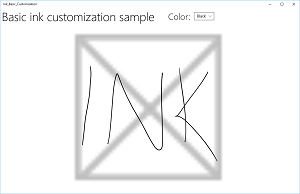
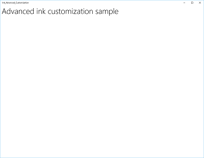
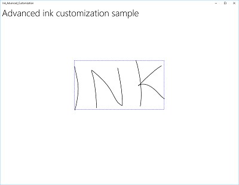

# Interacciones de pluma y lápiz en aplicaciones para UWP

Optimiza tu aplicación para la Plataforma universal de Windows (UWP) para que las entradas realizadas con la pluma proporcionen tanto la funcionalidad del [**dispositivo señalador**](https://msdn.microsoft.com/library/windows/apps/br225633) como la mejor experiencia de Windows Ink para tus usuarios.

> Nota: este tema se centra en la plataforma de Windows Ink. Consulta el artículo [Handle pointer input (Controlar las entradas del puntero)](handle-pointer-input.md) para poder controlar las entradas generales del puntero (es algo similar al mouse, a la función táctil y al panel táctil).


**API importantes**

-   [**Windows.Devices.Input**](https://msdn.microsoft.com/library/windows/apps/br225648)
-   [**Windows.UI.Input.Inking**](https://msdn.microsoft.com/library/windows/apps/br208524)
-   [**Windows.UI.Input.Inking.Core**](https://msdn.microsoft.com/library/windows/apps/dn958452)

La plataforma de Windows Ink, junto con un dispositivo de lápiz, te ofrece una forma natural de crear notas, dibujos y anotaciones manuscritas, todo ello de forma digital. Asimismo, la plataforma te permite capturar los datos de entrada del digitalizador a modo de datos de entrada de lápiz, generar datos de entrada de lápiz, administrarlos, representarlos como trazos de lápiz en el dispositivo de salida y convertirlos en texto a través del reconocimiento de escritura a mano.

Además de capturar la posición básica y el movimiento del lápiz a medida que el usuario escribe o dibuja, la aplicación también puede realizar un seguimiento y recopilar los distintos niveles de presión que se usan en un trazo. Esta información, junto con la configuración de la forma de la punta del lápiz, el tamaño y la rotación, el color de la entrada de lápiz y el propósito (como la entrada de lápiz sin formato y las acciones de borrar, resaltar y seleccionar), te permite proporcionar experiencias de usuario que se asemejan mucho a escribir o dibujar sobre papel con un lápiz, un bolígrafo o un pincel.

**Nota** La aplicación también puede ser compatible con la entrada de lápiz de otros dispositivos señaladores tales como digitalizadores táctiles y dispositivos de mouse. 

La plataforma de entrada de lápiz es muy flexible. Está diseñada para admitir varios niveles de funcionalidad, dependiendo de los requisitos.

Existen tres componentes para la plataforma de entrada de lápiz:

-   [
              **InkCanvas**
            ](https://msdn.microsoft.com/library/windows/apps/dn858535): es un control de plataforma de interfaz de usuario XAML que, de manera predeterminada, recibe y muestra todas las entradas de lápiz como un trazo de lápiz o un trazo de borrado.

-   [
              **InkPresenter**
            ](https://msdn.microsoft.com/library/windows/apps/dn922011): es un objeto de código subyacente, cuya instancia se ha creado con un control [**InkCanvas**](https://msdn.microsoft.com/library/windows/apps/dn858535) (expuesto a través de la propiedad [**InkCanvas.InkPresenter**](https://msdn.microsoft.com/library/windows/apps/dn899081)). Este objeto proporciona todas las funcionalidades de entrada manuscrita predeterminadas y que expuso **InkCanvas**, junto con un completo conjunto de API para la personalización adicional.

-   [
              **IInkD2DRenderer**
            ](https://msdn.microsoft.com/library/mt147263): habilita la representación de trazos de lápiz en el contexto de dispositivo de Direct2D designado de una aplicación universal de Windows, en lugar del control [**InkCanvas**](https://msdn.microsoft.com/library/windows/apps/dn858535). Esto permite la personalización completa de la experiencia de entrada manuscrita.

## Entrada manuscrita básica con InkCanvas


Para la funcionalidad básica de entrada manuscrita, solo debes colocar un control [**InkCanvas**](https://msdn.microsoft.com/library/windows/apps/dn858535) en cualquier parte de una página.

El control [**InkCanvas**](https://msdn.microsoft.com/library/windows/apps/dn858535) solo admite la entrada de lápiz que se haya realizado con un lápiz. La entrada se representa como un trazo de lápiz mediante la configuración predeterminada de color y espesor, o se trata como si fuera un borrador de trazos (cuando la entrada se realiza desde un extremo del borrador o cuando la punta del lápiz se modifica con un botón de borrador).

En este ejemplo, un control [**InkCanvas**](https://msdn.microsoft.com/library/windows/apps/dn858535) se superpone a una imagen de fondo.

```XAML
<Grid Background="{ThemeResource ApplicationPageBackgroundThemeBrush}">
    <Grid.RowDefinitions>
        <RowDefinition Height="Auto"/>
        <RowDefinition Height="*"/>
    </Grid.RowDefinitions>
    <StackPanel x:Name="HeaderPanel" Orientation="Horizontal" Grid.Row="0">
        <TextBlock x:Name="Header" 
                   Text="Basic ink sample" 
                   Style="{ThemeResource HeaderTextBlockStyle}" 
                   Margin="10,0,0,0" />            
    </StackPanel>
    <Grid Grid.Row="1">
        <Image Source="Assets\StoreLogo.png" />
        <InkCanvas x:Name="inkCanvas" />
    </Grid>
</Grid>
```

Esta serie de imágenes muestra cómo se representa la entrada manuscrita mediante el control [**InkCanvas**](https://msdn.microsoft.com/library/windows/apps/dn858535).

|  |  |  |
| --- | --- | ---|
| Control [**InkCanvas**](https://msdn.microsoft.com/library/windows/apps/dn858535) en blanco con una imagen de fondo. | Control [**InkCanvas**](https://msdn.microsoft.com/library/windows/apps/dn858535) con trazos de lápiz. | Control [**InkCanvas**](https://msdn.microsoft.com/library/windows/apps/dn858535) con un trazo borrado (ten en cuenta que la opción de borrado actúa en todo el trazo, no en una parte). |

La funcionalidad de entrada manuscrita admitida por el control [**InkCanvas**](https://msdn.microsoft.com/library/windows/apps/dn858535) la proporciona un objeto de código subyacente denominado [**InkPresenter**](https://msdn.microsoft.com/library/windows/apps/dn922011).

Para realizar entradas manuscritas básicas, no es necesario preocuparse por [**InkPresenter**](https://msdn.microsoft.com/library/windows/apps/dn922011). Sin embargo, para personalizar y configurar el comportamiento de la entrada manuscrita en la clase [**InkCanvas**](https://msdn.microsoft.com/library/windows/apps/dn858535), debe acceder al objeto correspondiente **InkPresenter**.

## Personalización básica con InkPresenter


Se crea una instancia de un objeto [**InkPresenter**](https://msdn.microsoft.com/library/windows/apps/dn922011) con cada control [**InkCanvas**](https://msdn.microsoft.com/library/windows/apps/dn858535).

Junto con el suministro de todos los comportamientos de entrada manuscrita predeterminados del control [**InkCanvas**](https://msdn.microsoft.com/library/windows/apps/dn858535) correspondiente, la propiedad [**InkPresenter**](https://msdn.microsoft.com/library/windows/apps/dn922011) te ofrece un completo conjunto de API para la personalización del trazo adicional. Se incluyen las propiedades de trazo, los tipos de dispositivo de entrada admitidos y si el objeto procesa la entrada o esta se pasa a la aplicación.

**Nota**  
No se pueden crear instancias de la propiedad [**InkPresenter**](https://msdn.microsoft.com/library/windows/apps/dn922011) directamente. En su lugar, debes acceder a ellas a través de la propiedad [**InkPresenter**](https://msdn.microsoft.com/library/windows/apps/dn899081) de la clase [**InkCanvas**](https://msdn.microsoft.com/library/windows/apps/dn858535).

 

En este apartado, configuraremos [**InkPresenter**](https://msdn.microsoft.com/library/windows/apps/dn899081) para que interprete los datos de entrada del lápiz y el mouse como trazos de lápiz. Asimismo, también estableceremos algunos atributos de trazo de lápiz iniciales que se usarán en la representación de trazos de [**InkCanvas**](https://msdn.microsoft.com/library/windows/apps/dn858535).

```CSharp
public MainPage()
{
    this.InitializeComponent();

    // Set supported inking device types.
    inkCanvas.InkPresenter.InputDeviceTypes = 
        Windows.UI.Core.CoreInputDeviceTypes.Mouse | 
        Windows.UI.Core.CoreInputDeviceTypes.Pen;

    // Set initial ink stroke attributes.
    InkDrawingAttributes drawingAttributes = new InkDrawingAttributes();
    drawingAttributes.Color = Windows.UI.Colors.Black;
    drawingAttributes.IgnorePressure = false;
    drawingAttributes.FitToCurve = true;
    inkCanvas.InkPresenter.UpdateDefaultDrawingAttributes(drawingAttributes);
}
```

Los atributos de trazo de lápiz se pueden establecer de forma dinámica para así ajustarlos a las preferencias del usuario o a los requisitos de la aplicación.

Aquí dejamos que un usuario elija en una lista de colores de entrada de lápiz.

```XAML
<Grid Background="{ThemeResource ApplicationPageBackgroundThemeBrush}">
    <Grid.RowDefinitions>
        <RowDefinition Height="Auto"/>
        <RowDefinition Height="*"/>
    </Grid.RowDefinitions>
    <StackPanel x:Name="HeaderPanel" Orientation="Horizontal" Grid.Row="0">
        <TextBlock x:Name="Header" 
                   Text="Basic ink customization sample" 
                   VerticalAlignment="Center"
                   Style="{ThemeResource HeaderTextBlockStyle}" 
                   Margin="10,0,0,0" />
        <TextBlock Text="Color:"
                   Style="{StaticResource SubheaderTextBlockStyle}"
                   VerticalAlignment="Center"
                   Margin="50,0,10,0"/>
        <ComboBox x:Name="PenColor"
                  VerticalAlignment="Center"
                  SelectedIndex="0"
                  SelectionChanged="OnPenColorChanged">
            <ComboBoxItem Content="Black"/>
            <ComboBoxItem Content="Red"/>
        </ComboBox>
    </StackPanel>
    <Grid Grid.Row="1">
        <Image Source="Assets\StoreLogo.png" />
        <InkCanvas x:Name="inkCanvas" />
    </Grid>
</Grid>
```

A continuación, controlamos los cambios en el color seleccionado y actualizamos los atributos de trazo de lápiz en consecuencia.

```CSharp
// Update ink stroke color for new strokes.
private void OnPenColorChanged(object sender, SelectionChangedEventArgs e)
{
    if (inkCanvas != null)
    {
        InkDrawingAttributes drawingAttributes = 
            inkCanvas.InkPresenter.CopyDefaultDrawingAttributes();

        string value = ((ComboBoxItem)PenColor.SelectedItem).Content.ToString();

        switch (value)
        {
            case "Black":
                drawingAttributes.Color = Windows.UI.Colors.Black;
                break;
            case "Red":
                drawingAttributes.Color = Windows.UI.Colors.Red;
                break;
            default:
                drawingAttributes.Color = Windows.UI.Colors.Black;
                break;
        };

        inkCanvas.InkPresenter.UpdateDefaultDrawingAttributes(drawingAttributes);
    }
}
```

Estas imágenes muestran cómo se procesa y personaliza la entrada manuscrita mediante [**InkPresenter**](https://msdn.microsoft.com/library/windows/apps/dn899081).

|  |  |
| --- | -- |
| [
            **InkCanvas**](https://msdn.microsoft.com/library/windows/apps/dn858535) con trazos de lápiz negro predeterminados. | [
            **InkCanvas**](https://msdn.microsoft.com/library/windows/apps/dn858535) con trazos de lápiz rojo seleccionados por el usuario. |

 

Para proporcionar funcionalidades que vayan más allá de la entrada manuscrita y el borrado (como la selección de trazo), la aplicación debe identificar la entrada específica de [**InkPresenter**](https://msdn.microsoft.com/library/windows/apps/dn899081), la cual debe pasarse sin procesar para que la aplicación la controle.

## Entrada de paso a través para el procesamiento avanzado


De manera predeterminada, [**InkPresenter**](https://msdn.microsoft.com/library/windows/apps/dn899081) procesa todas las entradas como trazos de lápiz o trazos de borrado. Esto incluye la entrada que modificó una prestación de hardware secundaria, como el botón de menú contextual del lápiz, el botón secundario del mouse o similares.

Al usar estas prestaciones secundarias, los usuarios suelen esperar algunas funciones adicionales o un comportamiento modificado.

En algunos casos, es posible que necesites exponer la funcionalidad básica de la entrada manuscrita para lápices sin prestaciones secundarias (esta funcionalidad generalmente no está asociada con la punta del lápiz), otros tipos de dispositivos de entrada, o bien una funcionalidad adicional o un comportamiento modificado; todo ello según la selección que el usuario haga en la interfaz de usuario de la aplicación.

Para que esta acción sea compatible, puedes configurar [**InkPresenter**](https://msdn.microsoft.com/library/windows/apps/dn899081) para que deje una entrada específica sin procesar. A continuación, esta entrada sin procesar se pasa a través de la aplicación para su procesamiento.

El código de ejemplo siguiente indica cómo habilitar la selección de trazo cuando la entrada se modifica con el botón de menú contextual del lápiz (o el botón secundario del mouse).

En este ejemplo usaremos los archivos MainPage.xaml y MainPage.xaml.cs para hospedar todo el código.

1.  En primer lugar, debemos configurar la interfaz de usuario en MainPage.xaml.

    Una vez hecho esto, agregamos un lienzo (debajo de [**InkCanvas**](https://msdn.microsoft.com/library/windows/apps/dn858535)) para dibujar el trazo de selección. Si usas una capa independiente para dibujar el trazo de selección, **InkCanvas** y su contenido no se modifican.

    
```    XAML
<Grid Background="{ThemeResource ApplicationPageBackgroundThemeBrush}">
        <Grid.RowDefinitions>
            <RowDefinition Height="Auto"/>
            <RowDefinition Height="*"/>
        </Grid.RowDefinitions>
        <StackPanel x:Name="HeaderPanel" Orientation="Horizontal" Grid.Row="0">
            <TextBlock x:Name="Header" 
                       Text="Advanced ink customization sample" 
                       VerticalAlignment="Center"
                       Style="{ThemeResource HeaderTextBlockStyle}" 
                       Margin="10,0,0,0" />
        </StackPanel>
        <Grid Grid.Row="1">
            <!-- Canvas for displaying selection UI. -->
            <Canvas x:Name="selectionCanvas"/>
            <!-- Inking area -->
            <InkCanvas x:Name="inkCanvas"/>
        </Grid>
    </Grid>
```

2.  En MainPage.xaml.cs, declaramos un par de variables globales para mantener las referencias a los aspectos de la interfaz de usuario de selección. Usaremos específicamente el trazo de lazo de selección y el rectángulo delimitador que resalta los trazos seleccionados.
```    CSharp
// Stroke selection tool.
    private Polyline lasso;
    // Stroke selection area.
    private Rect boundingRect;
```

3.  A continuación, configuramos [**InkPresenter**](https://msdn.microsoft.com/library/windows/apps/dn899081) para que interprete los datos de entrada del lápiz y el mouse como trazos de lápiz, y establecemos algunos atributos de trazo iniciales que se usan para la representación de trazos en [**InkCanvas**](https://msdn.microsoft.com/library/windows/apps/dn858535).

    Recuerda usar la propiedad [**InputProcessingConfiguration**](https://msdn.microsoft.com/library/windows/apps/dn948764) de [**InkPresenter**](https://msdn.microsoft.com/library/windows/apps/dn899081) para indicar que la aplicación debe procesar cualquier entrada modificada. La entrada modificada se especifica asignando a **InputProcessingConfiguration.RightDragAction** un valor de [**InkInputRightDragAction.LeaveUnprocessed**](https://msdn.microsoft.com/library/windows/apps/dn948760).

    A continuación, asignamos agentes de escucha para los eventos [**PointerPressed**](https://msdn.microsoft.com/library/windows/apps/dn914712), [**PointerMoved**](https://msdn.microsoft.com/library/windows/apps/dn914711) y [**PointerReleased**](https://msdn.microsoft.com/library/windows/apps/dn914713) sin procesar que la propiedad [**InkPresenter**](https://msdn.microsoft.com/library/windows/apps/dn899081) ha pasado. Todas las funcionalidades de selección se implementan en los controladores de estos eventos.

    Por último, asignamos agentes de escucha para los eventos [**StrokeStarted**](https://msdn.microsoft.com/library/windows/apps/dn914702) y [**StrokesErased**](https://msdn.microsoft.com/library/windows/apps/dn948767) de la propiedad [**InkPresenter**](https://msdn.microsoft.com/library/windows/apps/dn899081). Los controladores de estos eventos se usan para limpiar la interfaz de usuario de selección si se inicia un nuevo trazo o se borra un trazo existente.

    
```    CSharp
public MainPage()
    {
        this.InitializeComponent();

        // Set supported inking device types.
        inkCanvas.InkPresenter.InputDeviceTypes =
            Windows.UI.Core.CoreInputDeviceTypes.Mouse |
            Windows.UI.Core.CoreInputDeviceTypes.Pen;

        // Set initial ink stroke attributes.
        InkDrawingAttributes drawingAttributes = new InkDrawingAttributes();
        drawingAttributes.Color = Windows.UI.Colors.Black;
        drawingAttributes.IgnorePressure = false;
        drawingAttributes.FitToCurve = true;
        inkCanvas.InkPresenter.UpdateDefaultDrawingAttributes(drawingAttributes);

        // By default, the InkPresenter processes input modified by 
        // a secondary affordance (pen barrel button, right mouse 
        // button, or similar) as ink.
        // To pass through modified input to the app for custom processing 
        // on the app UI thread instead of the background ink thread, set 
        // InputProcessingConfiguration.RightDragAction to LeaveUnprocessed.
        inkCanvas.InkPresenter.InputProcessingConfiguration.RightDragAction = 
            InkInputRightDragAction.LeaveUnprocessed;

        // Listen for unprocessed pointer events from modified input.
        // The input is used to provide selection functionality.
        inkCanvas.InkPresenter.UnprocessedInput.PointerPressed += 
            UnprocessedInput_PointerPressed;
        inkCanvas.InkPresenter.UnprocessedInput.PointerMoved += 
            UnprocessedInput_PointerMoved;
        inkCanvas.InkPresenter.UnprocessedInput.PointerReleased += 
            UnprocessedInput_PointerReleased;

        // Listen for new ink or erase strokes to clean up selection UI.
        inkCanvas.InkPresenter.StrokeInput.StrokeStarted += 
            StrokeInput_StrokeStarted;
        inkCanvas.InkPresenter.StrokesErased += 
            InkPresenter_StrokesErased;
    }
```

4.  Una vez hecho todo esto, definimos los controladores de los eventos [**PointerPressed**](https://msdn.microsoft.com/library/windows/apps/dn914712), [**PointerMoved**](https://msdn.microsoft.com/library/windows/apps/dn914711) y [**PointerReleased**](https://msdn.microsoft.com/library/windows/apps/dn914713) sin procesar que la propiedad [**InkPresenter**](https://msdn.microsoft.com/library/windows/apps/dn899081) ha pasado.

    Todas las funcionalidades de selección se implementan en estos controladores, incluido el trazo de lazo y el rectángulo delimitador.

    
```    CSharp
// Handle unprocessed pointer events from modifed input.
    // The input is used to provide selection functionality.
    // Selection UI is drawn on a canvas under the InkCanvas.
    private void UnprocessedInput_PointerPressed(
        InkUnprocessedInput sender, PointerEventArgs args)
    {
        // Initialize a selection lasso.
        lasso = new Polyline()
        {
            Stroke = new SolidColorBrush(Windows.UI.Colors.Blue),
            StrokeThickness = 1,
            StrokeDashArray = new DoubleCollection() { 5, 2 },
        };

        lasso.Points.Add(args.CurrentPoint.RawPosition);

        selectionCanvas.Children.Add(lasso);
    }

    private void UnprocessedInput_PointerMoved(
        InkUnprocessedInput sender, PointerEventArgs args)
    {
        // Add a point to the lasso Polyline object.
        lasso.Points.Add(args.CurrentPoint.RawPosition);
    }

    private void UnprocessedInput_PointerReleased(
        InkUnprocessedInput sender, PointerEventArgs args)
    {
        // Add the final point to the Polyline object and 
        // select strokes within the lasso area.
        // Draw a bounding box on the selection canvas 
        // around the selected ink strokes.
        lasso.Points.Add(args.CurrentPoint.RawPosition);

        boundingRect = 
            inkCanvas.InkPresenter.StrokeContainer.SelectWithPolyLine(
                lasso.Points);

        DrawBoundingRect();
    }
```

5.  Para concluir el controlador de eventos PointerReleased, borramos la capa de selección de todo el contenido (trazo de lazo) y, a continuación, dibujamos un único rectángulo delimitador alrededor de los trazos de lápiz incluidos en el área del lazo.

    
```    CSharp
// Draw a bounding rectangle, on the selection canvas, encompassing 
    // all ink strokes within the lasso area.
    private void DrawBoundingRect()
    {
        // Clear all existing content from the selection canvas.
        selectionCanvas.Children.Clear();

        // Draw a bounding rectangle only if there are ink strokes 
        // within the lasso area.
        if (!((boundingRect.Width == 0) || 
            (boundingRect.Height == 0) || 
            boundingRect.IsEmpty))
        {
            var rectangle = new Rectangle()
            {
                Stroke = new SolidColorBrush(Windows.UI.Colors.Blue),
                StrokeThickness = 1,
                StrokeDashArray = new DoubleCollection() { 5, 2 },
                Width = boundingRect.Width,
                Height = boundingRect.Height
            };

            Canvas.SetLeft(rectangle, boundingRect.X);
            Canvas.SetTop(rectangle, boundingRect.Y);

            selectionCanvas.Children.Add(rectangle);
        }
    }
```

6.  Por último, definimos los controladores de los eventos [**StrokeStarted**](https://msdn.microsoft.com/library/windows/apps/dn914702) y [**StrokesErased**](https://msdn.microsoft.com/library/windows/apps/dn948767) de la propiedad InkPresenter.

    Ambos llaman a la misma función de limpieza para borrar la selección actual siempre que se detecta un nuevo trazo.
```    CSharp
// Handle new ink or erase strokes to clean up selection UI.
    private void StrokeInput_StrokeStarted(
        InkStrokeInput sender, Windows.UI.Core.PointerEventArgs args)
    {
        ClearSelection();
    }

    private void InkPresenter_StrokesErased(
        InkPresenter sender, InkStrokesErasedEventArgs args)
    {
        ClearSelection();
    }
```

7.  Esta es la función para quitar toda la interfaz de usuario de selección del lienzo de selección cuando se inicia un nuevo trazo o se borra un trazo existente.
```    CSharp
// Clean up selection UI.
    private void ClearSelection()
    {
        var strokes = inkCanvas.InkPresenter.StrokeContainer.GetStrokes();
        foreach (var stroke in strokes)
        {
            stroke.Selected = false;
        }
        ClearDrawnBoundingRect();
    }

    private void ClearDrawnBoundingRect()
    {
        if (selectionCanvas.Children.Any())
        {
            selectionCanvas.Children.Clear();
            boundingRect = Rect.Empty;
        }
    }
```

## Representación de entrada de lápiz personalizada


De manera predeterminada, la entrada de lápiz se procesa en un subproceso en segundo plano de baja latencia y se representa como "húmeda" mientras se dibuja. Cuando se completa el trazo (se levanta el lápiz o el dedo o se libera el botón del mouse), el trazo se procesa en el subproceso de la interfaz de usuario y se representa como "seco" en la capa de [**InkCanvas**](https://msdn.microsoft.com/library/windows/apps/dn858535) (lo verás sobre el contenido de la aplicación y reemplazando la entrada de lápiz húmeda).

La plataforma de entrada de lápiz te permite invalidar este comportamiento y personalizar totalmente la experiencia de entrada de lápiz mediante el secado personalizado de la entrada de lápiz.

El secado personalizado requiere un objeto [**IInkD2DRenderer**](https://msdn.microsoft.com/library/mt147263) para administrar la entrada de lápiz y representarla en el contexto de dispositivo Direct2D de la aplicación universal de Windows, en lugar del control [**InkCanvas**](https://msdn.microsoft.com/library/windows/apps/dn858535) predeterminado.

Al llamar a [**ActivateCustomDrying**](https://msdn.microsoft.com/library/windows/apps/dn922012) (antes de cargar [**InkCanvas**](https://msdn.microsoft.com/library/windows/apps/dn858535)), una aplicación crea un objeto [**InkSynchronizer**](https://msdn.microsoft.com/library/windows/apps/dn903979) para personalizar la representación de un trazo de lápiz seco en la clase [**SurfaceImageSource**](https://msdn.microsoft.com/library/windows/apps/hh702041) o [**VirtualSurfaceImageSource**](https://msdn.microsoft.com/library/windows/apps/hh702050). Por ejemplo, un trazo de lápiz se puede rasterizar e integrar en el contenido de la aplicación, en lugar de hacerlo como una capa de **InkCanvas** diferente.

Para obtener un ejemplo completo de esta funcionalidad, consulta [Complex ink sample](http://go.microsoft.com/fwlink/p/?LinkID=620314) (Muestra de entrada de lápiz compleja).


## Otros artículos de esta sección 
<table>
<colgroup>
<col width="50%" />
<col width="50%" />
</colgroup>
<thead>
<tr class="header">
<th align="left">Tema</th>
<th align="left">Descripción</th>
</tr>
</thead>
<tbody>
<tr class="odd">
<td align="left"><p>[Reconocer trazos de lápiz](convert-ink-to-text.md)</p></td>
<td align="left"><p>Convertir trazos de lápiz en texto mediante el reconocimiento de escritura a mano, o en formas mediante el reconocimiento personalizado.</p></td>
</tr>
<tr class="even">
<td align="left"><p>[Almacenar y recuperar trazos de lápiz](save-and-load-ink.md)</p></td>
<td align="left"><p>Almacena los datos de trazo de lápiz en un archivo de formato de intercambio de elementos gráficos (GIF) mediante los metadatos de Ink Serialized Format (ISF) insertados.</p></td>
</tr>
</tbody>
</table>

 


## Artículos relacionados


* [Controlar la entrada de puntero](handle-pointer-input.md)
* [Identificar dispositivos de entrada](identify-input-devices.md)

**Muestras**
* [Ink sample (Muestra de entrada de lápiz)](http://go.microsoft.com/fwlink/p/?LinkID=620308)
* [Muestra de entrada de lápiz simple](http://go.microsoft.com/fwlink/p/?LinkID=620312)
* [Muestra de entrada de lápiz compleja](http://go.microsoft.com/fwlink/p/?LinkID=620314)
* [Muestra de entrada básica](http://go.microsoft.com/fwlink/p/?LinkID=620302)
* [Muestra de entrada de latencia baja](http://go.microsoft.com/fwlink/p/?LinkID=620304)
* [Muestra de modo de interacción del usuario](http://go.microsoft.com/fwlink/p/?LinkID=619894)
* [Muestra de elementos visuales de foco](http://go.microsoft.com/fwlink/p/?LinkID=619895)

**Muestras de archivo**
* [Entrada: muestra de funcionalidades del dispositivo](http://go.microsoft.com/fwlink/p/?linkid=231530)
* [Entrada: muestra de eventos de entrada de usuario de XAML](http://go.microsoft.com/fwlink/p/?linkid=226855)
* [Muestra de desplazamiento, movimiento panorámico y zoom XAML](http://go.microsoft.com/fwlink/p/?linkid=251717)
* [Entrada: gestos y manipulaciones con GestureRecognizer](http://go.microsoft.com/fwlink/p/?LinkID=231605)
 

 


<!--HONumber=Jun16_HO5-->


