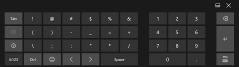
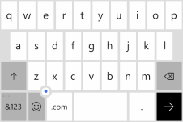
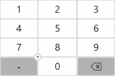
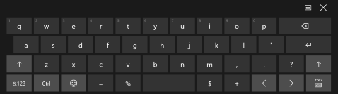

# <a name="use-input-scope-to-change-the-touch-keyboard"></a>Usar el ámbito de entrada para cambiar el teclado táctil
<link rel="stylesheet" href="https://az835927.vo.msecnd.net/sites/uwp/Resources/css/custom.css">

Para ayudar a que los usuarios escriban datos con el teclado táctil o con el panel de entrada por software (SIP), puedes establecer el ámbito de entrada del control de texto para que coincida con el tipo de datos que se espera que escriba el usuario.

<div class="important-apis" >
<b>API importantes</b><br/>
<ul>
<li>[**InputScope**](https://msdn.microsoft.com/library/windows/apps/hh702632)</li>
<li>[**InputScopeNameValue**](https://msdn.microsoft.com/library/windows/apps/hh702028)</li>
</ul>
</div>


El teclado táctil se puede usar para escribir texto cuando la aplicación se ejecuta en un dispositivo con pantalla táctil. El teclado táctil se invoca cuando el usuario pulsa en un campo de entrada editable, como una [**TextBox**](https://msdn.microsoft.com/library/windows/apps/br209683) o [**RichEditBox**](https://msdn.microsoft.com/library/windows/apps/br227548). Es posible conseguir que los usuarios escriban datos en la aplicación de forma mucho más rápida y sencilla, si estableces el *ámbito de entrada* del control de texto para que coincida con el tipo de datos que esperas que el usuario escriba. El ámbito de entrada proporciona una sugerencia al sistema sobre el tipo de entrada de texto que espera el control para que el sistema pueda proporcionar una distribución del teclado táctil especializada para el tipo de entrada.

Por ejemplo, si un cuadro de texto se usa únicamente para escribir un PIN de 4 dígitos, establece la propiedad [**InputScope**](https://msdn.microsoft.com/library/windows/apps/hh702632) en **Number**. Esto indica al sistema que debe mostrar el diseño de teclado numérico, lo cual facilita al usuario la inserción del PIN.

> **Importante**&nbsp;&nbsp;
- Esta información se aplica únicamente al SIP. No se aplica a teclados de hardware o al teclado en pantalla disponible en las opciones de accesibilidad de Windows.
- El ámbito de entrada no implica que se realice ninguna validación de entrada y tampoco impide que el usuario proporcione cualquier entrada a través de un teclado de hardware u otro dispositivo de entrada. Sigues siendo responsable de la validación de la entrada en tu código, según sea necesario.

## <a name="changing-the-input-scope-of-a-text-control"></a>Cambio del ámbito de entrada de un control de texto

Los ámbitos de entrada que están disponibles para tu aplicación de Windows forman parte de la enumeración [**InputScopeNameValue**](https://msdn.microsoft.com/library/windows/apps/hh702028). Puedes establecer la propiedad **InputScope** de un [**TextBox**](https://msdn.microsoft.com/library/windows/apps/br209683) o de un [**RichEditBox**](https://msdn.microsoft.com/library/windows/apps/br227548) en uno de estos valores.

> **Importante**&nbsp;&nbsp;La propiedad [**InputScope**](https://msdn.microsoft.com/library/windows/apps/dn996570) en [**PasswordBox**](https://msdn.microsoft.com/library/windows/apps/br227519) solo admite los valores **Password** y **NumericPin**. Se ignorará cualquier otro valor.

Aquí, cambias el ámbito de entrada de varios cuadros de texto para que coincida con los datos que esperan cada uno de ellos.

**Para cambiar el ámbito de entrada en XAML**

1.  En el archivo XAML de la página, ubica la etiqueta para el control de texto que deseas cambiar.
2.  Agrega el atributo [**InputScope**](https://msdn.microsoft.com/library/windows/apps/hh702632) a la etiqueta y especifica el valor [**InputScopeNameValue**](https://msdn.microsoft.com/library/windows/apps/hh702028) que coincida con la entrada esperada.

    Estos son algunos cuadros de texto que pueden aparecer en un formulario típico de contacto del cliente. Si se establece [**InputScope**](https://msdn.microsoft.com/library/windows/apps/hh702632), para cada cuadro de texto se muestra un teclado táctil con un diseño adecuado para los datos.

    ```xaml
    <StackPanel Width="300">
        <TextBox Header="Name" InputScope="Default"/>
        <TextBox Header="Email Address" InputScope="EmailSmtpAddress"/>
        <TextBox Header="Telephone Number" InputScope="TelephoneNumber"/>
        <TextBox Header="Web site" InputScope="Url"/>
    </StackPanel>
    ```

**Para cambiar el ámbito de entrada en el código**

1.  En el archivo XAML de la página, ubica la etiqueta para el control de texto que deseas cambiar. Si no se está establecido, establece el atributo [x:Name](https://msdn.microsoft.com/library/windows/apps/mt204788) para que puedas hacer referencia al control en el código.

    ```csharp
    <TextBox Header="Telephone Number" x:Name="phoneNumberTextBox"/>
    ```

2.  Crea una instancia del objeto [**InputScope**](https://msdn.microsoft.com/library/windows/apps/hh702025).

    ```csharp
    InputScope scope = new InputScope();
    ```

3.  Crea una instancia del objeto [**InputScopeName**](https://msdn.microsoft.com/library/windows/apps/hh702027).
    
    ```csharp
    InputScopeName scopeName = new InputScopeName();
    ```

4.  Establece la propiedad [**NameValue**](https://msdn.microsoft.com/library/windows/apps/hh702032) del objeto [**InputScopeName**](https://msdn.microsoft.com/library/windows/apps/hh702027) en un valor de la enumeración [**InputScopeNameValue**](https://msdn.microsoft.com/library/windows/apps/hh702028).

    ```csharp
    scopeName.NameValue = InputScopeNameValue.TelephoneNumber;
    ```

5.  Agrega el objeto [**InputScopeName**](https://msdn.microsoft.com/library/windows/apps/hh702027) a la colección [**Names**](https://msdn.microsoft.com/library/windows/apps/hh702034) del objeto [**InputScope**](https://msdn.microsoft.com/library/windows/apps/hh702025).

    ```csharp
    scope.Names.Add(scopeName);
    ```

6.  Establece el objeto [**InputScope**](https://msdn.microsoft.com/library/windows/apps/hh702025) con el valor de la propiedad [**InputScope**](https://msdn.microsoft.com/library/windows/apps/hh702632) del control de texto.

    ```csharp
    phoneNumberTextBox.InputScope = scope;
    ```

Este es el código al completo.

```CSharp
InputScope scope = new InputScope();
InputScopeName scopeName = new InputScopeName();
scopeName.NameValue = InputScopeNameValue.TelephoneNumber;
scope.Names.Add(scopeName);
phoneNumberTextBox.InputScope = scope;
```

Es posible condensar los mismos pasos en este código abreviado.

```CSharp
phoneNumberTextBox.InputScope = new InputScope() 
{
    Names = {new InputScopeName(InputScopeNameValue.TelephoneNumber)}
};
```

## <a name="text-prediction-spell-checking-and-auto-correction"></a>Predicción de texto, revisión ortográfica y autocorrección

Los controles [**TextBox**](https://msdn.microsoft.com/library/windows/apps/br209683) y [**RichEditBox**](https://msdn.microsoft.com/library/windows/apps/br227548) tienen varias propiedades que influyen en el comportamiento del SIP. Para proporcionar la mejor experiencia para los usuarios, es importante comprender cómo afectan estas propiedades a la introducción de texto con la entrada táctil.

-   [**IsSpellCheckEnabled**](https://msdn.microsoft.com/library/windows/apps/br209688): Cuando la revisión ortográfica está habilitada para un control de texto, el control interactúa con el motor de corrección ortográfica del sistema para marcar las palabras que no se reconocen. Puedes presionar una palabra para ver una lista de las correcciones sugeridas. La revisión ortográfica está habilitada de manera predeterminada.

    Para el ámbito de entrada **Default**, esta propiedad también activa el uso de mayúsculas automático de la primera palabra de una frase y la corrección automática de palabras a medida que escribes. Estas funciones de corrección automática pueden estar deshabilitadas en otros ámbitos de entrada. Para obtener más información, consulta las tablas que figuran más adelante en este tema.

-   [**IsTextPredictionEnabled**](https://msdn.microsoft.com/library/windows/apps/br209690): Cuando se habilita la predicción de texto para un control de texto, el sistema muestra una lista de palabras que es posible que estés empezando a escribir. Puedes seleccionarlas de la lista para no tener que escribir toda la palabra. La predicción está habilitada de manera predeterminada.

    La predicción de texto puede estar deshabilitada si el ámbito de entrada es distinto de **Default**, incluso si la propiedad [**IsTextPredictionEnabled**](https://msdn.microsoft.com/library/windows/apps/br209690) es **true**. Para obtener más información, consulta las tablas que figuran más adelante en este tema.

    **Nota**&nbsp;&nbsp;En la familia de dispositivos móviles, se muestran las predicciones de texto y correcciones ortográficas en el SIP, en el área situada sobre el teclado táctil. Si [**IsTextPredictionEnabled**](https://msdn.microsoft.com/library/windows/apps/br209690) se establece en **false**, se oculta esta parte del SIP y se deshabilita la corrección automática, incluso si [**IsSpellCheckEnabled**](https://msdn.microsoft.com/library/windows/apps/br209688) es **true**.

-   [**PreventKeyboardDisplayOnProgrammaticFocus**](https://msdn.microsoft.com/library/windows/apps/dn299273): Cuando esta propiedad es **true**, impide que el sistema muestre el teclado táctil cuando el foco se establece mediante programación en un control de texto. En su lugar, el teclado se muestra únicamente cuando el usuario interactúa con el control.

## <a name="touch-keyboard-index-for-windows-and-windows-phone"></a>Índice del teclado táctil para Windows y Windows Phone

Estas tablas muestran los diseños de Panel entrada software (SIP) en dispositivos móviles y de escritorio para los valores de ámbito de entrada comunes. El efecto del ámbito de entrada en las funciones que habilitan las propiedades **IsSpellCheckEnabled** y **IsTextPredictionEnabled** se muestran para cada ámbito de entrada. Esta no es una lista completa de los ámbitos de entrada disponibles.

> **Nota**&nbsp;&nbsp;El menor tamaño del SIP en dispositivos móviles provoca que para las aplicaciones móviles sea especialmente importante que establezcas el ámbito de entrada correcto. Como se muestra aquí, Windows Phone ofrece una gran variedad de distribuciones de teclado especializadas. Un campo de texto que no necesita tener su ámbito de entrada establecido en una aplicación de la Tienda Windows puede beneficiarse de tenerlo establecido en una aplicación de la Tienda de Windows Phone.

> **Sugerencia**&nbsp;&nbsp;Puedes alternar la mayoría de los teclados táctiles entre una distribución alfabética y una distribución de números y símbolos. En Windows, alterna la tecla **&123**. En Windows Phone, presiona la tecla **&123** para cambiar a la distribución de números y símbolos, y presiona la tecla **abcd** para cambiar a la distribución alfabética.

### <a name="default"></a>Predeterminado

`<TextBox InputScope="Default"/>`

El teclado predeterminado.

| Windows                                                    | Windows Phone                                                    |
|------------------------------------------------------------|------------------------------------------------------------------|
|  |  |

Disponibilidad de funciones:

-   Revisión ortográfica: habilitada si **IsSpellCheckEnabled** = **true**, deshabilitada si **IsSpellCheckEnabled** = **false**
-   Autocorrección: habilitada si **IsSpellCheckEnabled** = **true**, deshabilitada si **IsSpellCheckEnabled** = **false**
-   Uso de mayúsculas automático: habilitada si **IsSpellCheckEnabled** = **true**, deshabilitada si **IsSpellCheckEnabled** = **false**
-   Predicción de texto: habilitada si **IsTextPredictionEnabled** = **true**, deshabilitada si **IsTextPredictionEnabled** = **false**

### <a name="currencyamountandsymbol"></a>CurrencyAmountAndSymbol

`<TextBox InputScope="CurrencyAmountAndSymbol"/>`

La distribución de teclado de números y símbolos predeterminada.

| Windows                                                    | Windows Phone                                                    |
|------------------------------------------------------------|------------------------------------------------------------------|
| <br>También incluye teclas de página a la izquierda y a la derecha para mostrar más símbolos.|  |
|Disponibilidad de funciones:<ul><li>Revisión ortográfica: habilitada de manera predeterminada, se puede deshabilitar</li><li>Autocorrección: siempre deshabilitada</li><li>Uso de mayúsculas automático: siempre deshabilitado</li><li>Predicción de texto: siempre deshabilitada</li></ul>Igual que **Number** y **TelephoneNumber**. | Disponibilidad de funciones:<ul><li>Revisión ortográfica: habilitada de manera predeterminada, se puede deshabilitar</li><li>Autocorrección: habilitada de forma predeterminada, se puede deshabilitar</li><li>Uso de mayúsculas automático: siempre deshabilitado</li><li>Predicción de texto: habilitada de manera predeterminada, se puede deshabilitar</li>| 

### <a name="url"></a>Url

`<TextBox InputScope="Url"/>`

Incluye las teclas **.com** y  (Ir). Mantén presionada la tecla **.com** para mostrar las opciones adicionales (**.org**, **.net** y sufijos específicos de región).

| Windows                                                    | Windows Phone                                                    |
|------------------------------------------------------------|------------------------------------------------------------------|
| <br>También incluye las teclas **:**, **-** y **/**.| <br>Mantén pulsada la tecla del punto para ver las opciones adicionales ( - + &quot; / &amp; : , ). |
|Disponibilidad de funciones:<ul><li>Revisión ortográfica: habilitada de manera predeterminada, se puede deshabilitar</li><li>Autocorrección: habilitada de forma predeterminada, se puede deshabilitar</li><li>Uso de mayúsculas automático: siempre deshabilitado</li><li>Predicción de texto: siempre deshabilitada</li></ul> | Disponibilidad de funciones:<ul><li>Revisión ortográfica: deshabilitada de manera predeterminada, se puede habilitar</li><li>Autocorrección: deshabilitada de manera predeterminada, se puede habilitar</li><li>Uso de mayúsculas automático: deshabilitado de manera predeterminada, se puede habilitar</li><li>Predicción de texto: deshabilitada de manera predeterminada, se puede habilitar</li></ul> |

### <a name="emailsmtpaddress"></a>EmailSmtpAddress

`<TextBox InputScope="EmailSmtpAddress"/>`

Incluye las teclas **@** y **.com**. Mantén pulsada la tecla **.com** para mostrar las opciones adicionales (**.org**, **.net** y sufijos específicos de región).

| Windows                                                    | Windows Phone                                                    |
|------------------------------------------------------------|------------------------------------------------------------------|
| <br>También incluye las teclas **_** y **-**.| <br>Mantén pulsada la tecla del punto para ver las opciones adicionales ( - _ , ; ). |
|Disponibilidad de funciones:<ul><li>Revisión ortográfica: habilitada de manera predeterminada, se puede deshabilitar</li><li>Autocorrección: habilitada de forma predeterminada, se puede deshabilitar</li><li>Uso de mayúsculas automático: siempre deshabilitado</li><li>Predicción de texto: siempre deshabilitada</li></ul> | Disponibilidad de funciones:<ul><li>Revisión ortográfica: deshabilitada de manera predeterminada, se puede habilitar</li><li>Autocorrección: deshabilitada de manera predeterminada, se puede habilitar</li><li>Uso de mayúsculas automático: deshabilitado de manera predeterminada, se puede habilitar</li><li>Predicción de texto: deshabilitada de manera predeterminada, se puede habilitar</li></ul> |

### <a name="number"></a>Número

`<TextBox InputScope="Number"/>`

| Windows                                                    | Windows Phone                                                    |
|------------------------------------------------------------|------------------------------------------------------------------|
| | <br>El teclado contiene números y un separador decimal. Mantén presionada la tecla de punto decimal para ver las opciones adicionales ( , - ). |
|Igual que **CurrencyAmountAndSymbol** y **TelephoneNumber**. | Disponibilidad de funciones:<ul><li>Revisión ortográfica: siempre deshabilitada</li><li>Autocorrección: siempre deshabilitada</li><li>Uso de mayúsculas automático: siempre deshabilitado</li><li>Predicción de texto: siempre deshabilitada</li></ul> |

### <a name="telephonenumber"></a>TelephoneNumber

`<TextBox InputScope="TelephoneNumber"/>`

| Windows                                                    | Windows Phone                                                    |
|------------------------------------------------------------|------------------------------------------------------------------|
| | <br>El teclado imita el teclado del teléfono. Mantén pulsada la tecla del punto para ver las opciones adicionales ( , ( ) X . ). Mantén pulsada la tecla 0 para insertar +. |
|Igual que **CurrencyAmountAndSymbol** y **TelephoneNumber**. | Disponibilidad de funciones:<ul><li>Revisión ortográfica: siempre deshabilitada</li><li>Autocorrección: siempre deshabilitada</li><li>Uso de mayúsculas automático: siempre deshabilitado</li><li>Predicción de texto: siempre deshabilitada</li></ul> |

### <a name="search"></a>Buscar

`<TextBox InputScope="Search"/>`

Incluye la tecla **Buscar** en lugar de la tecla **ENTRAR**.

| Windows                                                    | Windows Phone                                                    |
|------------------------------------------------------------|------------------------------------------------------------------|
| | |
|Disponibilidad de funciones:<ul><li>Revisión ortográfica: habilitada de manera predeterminada, se puede deshabilitar</li><li>Autocorrección: siempre deshabilitada</li><li>Uso de mayúsculas automático: siempre deshabilitado</li><li>Predicción de texto: habilitada de manera predeterminada, se puede deshabilitar</li></ul> | Disponibilidad de funciones:<ul><li>Revisión ortográfica: habilitada de manera predeterminada, se puede deshabilitar</li><li>Autocorrección: habilitada de forma predeterminada, se puede deshabilitar</li><li>Uso de mayúsculas automático: siempre deshabilitado</li><li>Predicción de texto: habilitada de manera predeterminada, se puede deshabilitar</li></ul> |

### <a name="searchincremental"></a>SearchIncremental

`<TextBox InputScope="SearchIncremental"/>`

| Windows                                                    | Windows Phone                                                    |
|------------------------------------------------------------|------------------------------------------------------------------|
| <br>Misma distribución que **Default**.| |
|Disponibilidad de funciones:<ul><li>Revisión ortográfica: deshabilitada de manera predeterminada, se puede habilitar</li><li>Autocorrección: siempre deshabilitada</li><li>Uso de mayúsculas automático: siempre deshabilitado</li><li>Predicción de texto: siempre deshabilitada</li></ul> | Igual que el valor **Predeterminado**. |

### <a name="formula"></a>Fórmula

`<TextBox InputScope="Formula"/>`

Incluye la tecla **=**.

| Windows                                                    | Windows Phone                                                    |
|------------------------------------------------------------|------------------------------------------------------------------|
| <br>También incluye las teclas **%**, **$** y **+**.| <br>Mantén pulsada la tecla del punto para ver las opciones adicionales ( - ! ? , ). Mantén pulsada la tecla **=** para ver las opciones adicionales ( ( ) : &lt; &gt; ). |
|Disponibilidad de funciones:<ul><li>Revisión ortográfica: deshabilitada de manera predeterminada, se puede habilitar</li><li>Autocorrección: siempre deshabilitada</li><li>Uso de mayúsculas automático: siempre deshabilitado</li><li>Predicción de texto: siempre deshabilitada</li></ul> | Disponibilidad de funciones:<ul><li>Revisión ortográfica: habilitada de manera predeterminada, se puede deshabilitar</li><li>Autocorrección: habilitada de forma predeterminada, se puede deshabilitar</li><li>Uso de mayúsculas automático: siempre deshabilitado</li><li>Predicción de texto: habilitada de manera predeterminada, se puede deshabilitar</li></ul> |

### <a name="chat"></a>Chat

`<TextBox InputScope="Chat"/>`

| Windows                                                    | Windows Phone                                                    |
|------------------------------------------------------------|------------------------------------------------------------------|
| <br>Misma distribución que **Default**.| <br>Misma distribución que **Default**.|
|Disponibilidad de funciones:<ul><li>Revisión ortográfica: deshabilitada de manera predeterminada, se puede habilitar</li><li>Autocorrección: siempre deshabilitada</li><li>Uso de mayúsculas automático: siempre deshabilitado</li><li>Predicción de texto: siempre deshabilitada</li></ul> | Disponibilidad de funciones:<ul><li>Revisión ortográfica: habilitada de manera predeterminada, se puede deshabilitar</li><li>Autocorrección: habilitada de forma predeterminada, se puede deshabilitar</li><li>Uso de mayúsculas automático: habilitado de manera predeterminada, se puede deshabilitar</li><li>Predicción de texto: habilitada de manera predeterminada, se puede deshabilitar</li></ul> |

### <a name="nameorphonenumber"></a>NameOrPhoneNumber

`<TextBox InputScope="NameOrPhoneNumber"/>`

| Windows                                                    | Windows Phone                                                    |
|------------------------------------------------------------|------------------------------------------------------------------|
| <br>Misma distribución que **Default**.| <br>Incluye las teclas **;** y **@**. La tecla **&amp;123** se sustituye por la tecla **123**, que abre el teclado del teléfono (consulta **TelephoneNumber**).|
|Disponibilidad de funciones:<ul><li>Revisión ortográfica: habilitada de manera predeterminada, se puede deshabilitar</li><li>Autocorrección: siempre deshabilitada</li><li>Uso de mayúsculas automático: siempre habilitado</li><li>Predicción de texto: siempre deshabilitada</li></ul> | Disponibilidad de funciones:<ul><li>Revisión ortográfica: deshabilitada de manera predeterminada, se puede habilitar</li><li>Autocorrección: deshabilitada de manera predeterminada, se puede habilitar</li><li>Uso de mayúsculas automático: deshabilitado de manera predeterminada, se puede habilitar. La primera letra de cada palabra se escribe en mayúscula.</li><li>Predicción de texto: deshabilitada de manera predeterminada, se puede habilitar</li></ul> |

