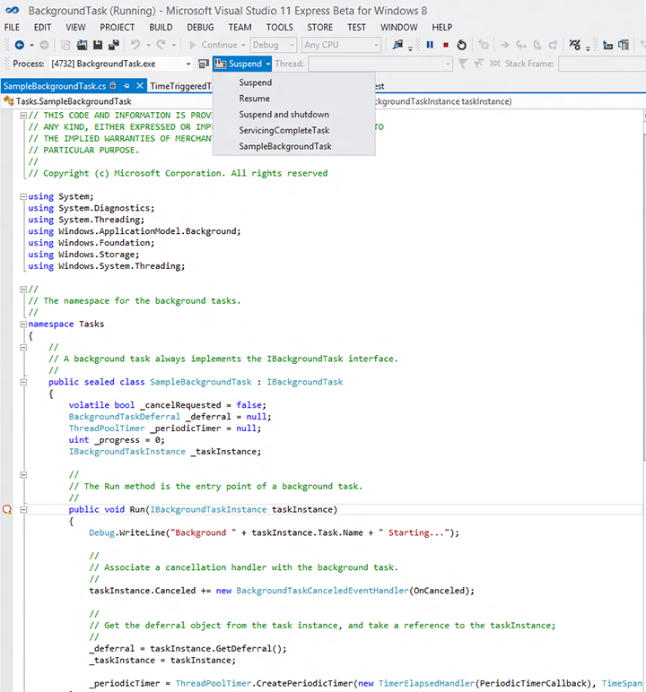

# Depurar una tarea en segundo plano

**API importantes**
-   [Windows.ApplicationModel.Background](https://msdn.microsoft.com/library/windows/apps/br224847)

Aprende a depurar una tarea en segundo plano, incluida la activación y el seguimiento de depuración de la tarea en segundo plano en el registro de eventos de Windows.

## Depuración de tareas en segundo plano fuera y dentro del proceso
Este tema aborda principalmente las tareas en segundo plano que se ejecutan en un proceso independiente de la aplicación host. Si estás depurando una tarea en segundo plano dentro del proceso, no tendrás un proyecto de tarea en segundo plano independiente y podrás establecer un punto de interrupción en **OnBackgroundActivated()** (donde se ejecuta el código en segundo plano dentro del proceso) y consultar el paso 2 en [Desencadenar manualmente tareas en segundo plano para depurar el código de la tarea en segundo plano](#trigger-background-tasks-manually-to-debug-background-task-code) a continuación para obtener instrucciones sobre cómo activar el código en segundo plano para ejecutarlo.

## Comprobar que el proyecto de tarea en segundo plano está correctamente configurado

En este tema se supone que tienes una aplicación existente con una tarea en segundo plano que depurar. Lo siguiente es específico para las tareas en segundo plano fuera del proceso y no se aplican a las tareas en segundo plano dentro del proceso.

-   En C# y C++, asegúrate de que el proyecto principal hace referencia al proyecto de tarea en segundo plano. Si esta referencia no se realiza, la tarea en segundo plano no se incluirá en el paquete de la aplicación.
-   En C# y C++, asegúrate de que el **Tipo de resultado** del proyecto de tarea en segundo plano sea "Componente de Windows Runtime".
-   La clase en segundo plano debe declararse en el atributo de punto de entrada en el manifiesto del paquete.

## Desencadenar manualmente tareas en segundo plano para depurar el código de la tarea en segundo plano

Las tareas en segundo plano se pueden desencadenar manualmente mediante Microsoft Visual Studio. Después, podrás analizar el código y depurarlo.

1.  En C#, coloca un punto de interrupción en el método Run de la clase en segundo plano (para las tareas en segundo plano dentro del proceso, coloca el punto de interrupción en App.OnBackgroundActivated()) o escribe el resultado de depuración mediante [**System.Diagnostics**](https://msdn.microsoft.com/library/windows/apps/xaml/hh441592.aspx).

    En C++, coloca un punto de interrupción en la función Run de la clase en segundo plano (para las tareas en segundo plano dentro del proceso, coloca el punto de interrupción en App.OnBackgroundActivated()) o escribe el resultado de depuración mediante [**OutputDebugString**](https://msdn.microsoft.com/library/windows/desktop/aa363362).

2.  Ejecuta la aplicación en el depurador y después desencadena la tarea en segundo plano mediante la barra de herramientas **Eventos de ciclo de vida**. Este menú desplegable muestra los nombres de las tareas en segundo plano que pueden activarse con Visual Studio.

    Para que esto funcione, la tarea en segundo plano ya debe estar registrada y debe seguir esperando el desencadenador. Por ejemplo, si una tarea en segundo plano se registró con TimeTrigger y ese desencadenador ya está activado, iniciar la tarea a través de Visual Studio no tendrá efecto.

> [!Note]
> Las tareas en segundo plano que usen los siguientes desencadenadores no se pueden activar de esta manera: [**ApplicationTrigger**](https://msdn.microsoft.com/library/windows/apps/windows.applicationmodel.background.applicationtrigger.aspx), [**MediaProcessingTrigger**](https://msdn.microsoft.com/library/windows/apps/windows.applicationmodel.background.mediaprocessingtrigger.aspx), [**ControlChannelTrigger**](https://msdn.microsoft.com/library/windows/apps/hh701032), [**PushNotificationTrigger**](https://msdn.microsoft.com/library/windows/apps/hh700543) y las tareas en segundo plano que usen un [**SystemTrigger**](https://msdn.microsoft.com/library/windows/apps/br224838) con el tipo de desencadenador [**SmsReceived**](https://msdn.microsoft.com/library/windows/apps/br224839).  
> **ApplicationTrigger** y **MediaProcessingTrigger** se pueden señalar manualmente en el código con `trigger.RequestAsync()`.

3.  Cuando la tarea en segundo plano se activa, el depurador se adjuntará a ella y mostrará el resultado de depuración en VS.

## Depurar la activación de tareas en segundo plano

> [!NOTE]
> Esta sección es específica para las tareas en segundo plano fuera del proceso y no se aplica a las tareas en segundo plano dentro del proceso.

La activación de la tarea en segundo plano depende de tres cosas:

-   Nombre y espacio de nombres de la clase de tarea en segundo plano
-   Atributo de punto de entrada especificado en el manifiesto del paquete
-   Punto de entrada especificado por la aplicación al registrar la tarea en segundo plano

1.  Usa Visual Studio para anotar el punto de entrada de la tarea en segundo plano:

    -   En C# y C++, anota el nombre y el espacio de nombres de la clase de tarea en segundo plano especificada en el proyecto de tarea en segundo plano.

2.  Usa el diseñador de manifiestos para comprobar que la tarea en segundo plano se ha declarado correctamente en el manifiesto de la aplicación:

    -   En C# y C++, el atributo de punto de entrada debe coincidir con el espacio de nombres de la tarea en segundo plano seguido por el nombre de clase. Por ejemplo: RuntimeComponent1.MyBackgroundTask.
    -   También deben especificarse todos los tipos de desencadenadores usados con la tarea.
    -   El ejecutable NO DEBE especificarse a menos que estés usando [**ControlChannelTrigger**](https://msdn.microsoft.com/library/windows/apps/hh701032) o [**PushNotificationTrigger**](https://msdn.microsoft.com/library/windows/apps/hh700543).

3.  Solo Windows. Para ver el punto de entrada que usa Windows para activar la tarea en segundo plano, habilita el seguimiento de depuración y usa el registro de eventos de Windows.

    Si sigues este procedimiento y el registro de eventos muestra un punto de entrada o un desencadenador incorrecto para la tarea en segundo plano, la aplicación no está registrando la tarea en segundo plano correctamente. Para obtener ayuda con esta tarea, consulta [Registrar una tarea en segundo plano](register-a-background-task.md).

    1.  Abre el visor de eventos; para ello, ve a la pantalla Inicio y busca eventvwr.exe.
    2.  Ve a **Servicios de registros de aplicaciones y**  - &gt; **Microsoft**  - &gt; **Windows**  - &gt; **BackgroundTaskInfrastructure** en el Visor de eventos.
    3.  En el panel Acciones, selecciona **vista**  - &gt; **Mostrar Depurar registros analíticos y** para habilitar el registro de diagnóstico.
    4.  Selecciona el **Registro de diagnóstico** y haz clic en **Habilitar registro**.
    5.  Ahora, intenta usar tu aplicación para registrar y activar de nuevo la tarea en segundo plano.
    6.  Consulta los registros de diagnóstico para obtener información detallada del error. Esto incluirá el punto de entrada registrado para la tarea en segundo plano.

## Tareas en segundo plano e implementación del paquete de Visual Studio

Si una aplicación que usa tareas en segundo plano se implementa con Visual Studio y la versión (mayor y/o menor) especificada en el diseñador de manifiestos después se actualiza, al reimplementar posteriormente la aplicación con Visual Studio es posible que las tareas en segundo plano de la aplicación se atasquen. Esto puede remediarse de la siguiente manera:

-   Usa Windows PowerShell para implementar la aplicación actualizada (en lugar de Visual Studio) mediante la ejecución del script generado junto con el paquete.
-   Si ya implementaste la aplicación con Visual Studio y las tareas en segundo plano de la aplicación ahora están atascadas, reinicia o cierra sesión y vuelve a abrirla para que las tareas en segundo plano vuelvan a funcionar.
-   Puedes seleccionar la opción de depuración "Reinstalar siempre mi paquete" para evitar esto en proyectos con C#.
-   Espera hasta que la aplicación está lista para la implementación final para incrementar la versión del paquete (no lo cambies durante la depuración).

## Comentarios

-   Asegúrate de que tu aplicación compruebe los registros de tareas en segundo plano existentes antes de registrar la tarea nuevamente. Varios registros de la misma tarea pueden causar resultados inesperados al ejecutar la tarea en segundo plano más de una vez cada vez que esta se desencadena.
-   Si la tarea en segundo plano requiere acceso a la pantalla de bloqueo, asegúrate de poner la aplicación en la pantalla de bloqueo antes de intentar depurar la tarea en segundo plano. Para obtener información acerca de cómo especificar opciones para bloquear aplicaciones compatibles con la pantalla de bloqueo, consulta [Declarar tareas en segundo plano en el manifiesto de la aplicación](declare-background-tasks-in-the-application-manifest.md).
-   Los parámetros de registro de tareas en segundo plano se validan en el momento en que se realiza el registro. Se devuelve un error si cualquiera de los parámetros de registro no es válido. Asegúrate de que la aplicación se ocupe correctamente de los escenarios en los que se produce un error en el registro de tareas en segundo plano. Si, en cambio, la aplicación depende de que haya un objeto de registro válido después de intentar registrar una tarea, es posible que se bloquee.

Para obtener más información sobre cómo usar VS para depurar una tarea en segundo plano, consulta [cómo desencadenar suspender, reanudar y eventos en aplicaciones para UWP en segundo plano](https://msdn.microsoft.com/library/windows/apps/xaml/hh974425.aspx).

## Temas relacionados

* [Crear y registrar una tarea en segundo plano fuera de proceso](create-and-register-a-background-task.md)
* [Crear y registrar una tarea en segundo plano dentro del proceso](create-and-register-an-inproc-background-task.md)
* [Registrar una tarea en segundo plano](register-a-background-task.md)
* [Declarar tareas en segundo plano en el manifiesto de la aplicación](declare-background-tasks-in-the-application-manifest.md)
* [Directrices para tareas en segundo plano](guidelines-for-background-tasks.md)
* [Cómo desencadenar suspender, reanudar y eventos en aplicaciones para UWP en segundo plano](https://msdn.microsoft.com/library/windows/apps/xaml/hh974425.aspx)
* [Analizar la calidad del código de aplicaciones para UWP con el análisis de código de Visual Studio](https://msdn.microsoft.com/library/windows/apps/xaml/hh441471.aspx)

 

 
