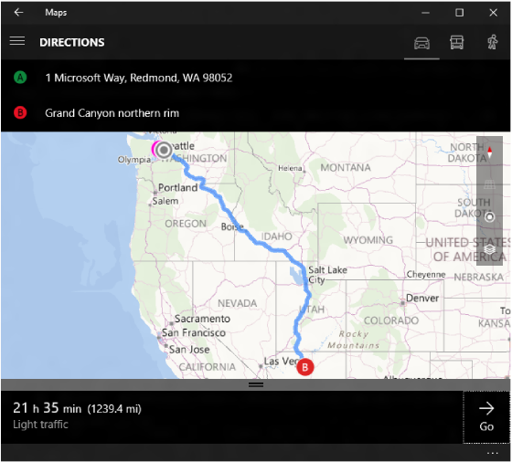

# <a name="launch-the-windows-maps-app"></a>Iniciar la aplicación Mapas de Windows


Aprende a iniciar la aplicación Mapas de Windows desde la aplicación. En este tema se describen los esquemas de identificador uniforme de recursos (URI) **bingmaps:**, **ms-drive-to:**, **ms-walk-to:** y **ms-settings:**. Usa estos esquemas de URI para iniciar la aplicación Mapas de Windows para especificar mapas, indicaciones y resultados de búsqueda o para descargar mapas sin conexión de Mapas de Windows desde la aplicación Configuración.

**Sugerencia** Para obtener más información sobre cómo iniciar la aplicación Mapas de Windows desde tu aplicación, descarga la [muestra de mapas de la Plataforma universal de Windows (UWP)](https://github.com/Microsoft/Windows-universal-samples/tree/master/Samples/MapControl) del [repositorio de muestras universales de Windows](https://github.com/Microsoft/Windows-universal-samples) en GitHub.

## <a name="introducing-uris"></a>Introducción a los URI

Los esquemas de URI te permiten abrir aplicaciones haciendo clic en los hipervínculos (o mediante programación, en la aplicación). Al igual que puedes iniciar un nuevo correo electrónico con **mailto:** o abrir un navegador web con **http:**, puedes abrir la aplicación Mapas de Windows mediante **¿bingmaps:**, **ms-drive-to:** y **ms-walk-to:**.

-   El URI **bingmaps:** proporciona mapas de tráfico, resultados de búsqueda, indicaciones y ubicaciones.
-   El URI **ms-drive-to:** proporciona indicaciones paso a paso para ir en coche desde tu ubicación actual.
-   El URI **ms-walk-to:** proporciona indicaciones paso a paso para ir a pie desde tu ubicación actual.

Por ejemplo, el siguiente URI abre la aplicación Mapas de Windows y muestra un mapa centrado sobre la ciudad de Nueva York.

```xml
<bingmaps:?cp=40.726966~-74.006076>
```


A continuación se ofrece una descripción del esquema de URI:

**bingmaps:?query**

En este esquema de URI, *query* es una serie de pares nombre-valor de parámetros:

**&parám1 = value1&parám2 = value2...**

Para obtener una lista completa de los parámetros disponibles, consulta la referencia de los parámetros [bingmaps:](#bingmaps-param-reference), [ms-drive-to:](#ms-drive-to-param-reference)y [ms-walk-to:](#ms-walk-to-param-reference) . Más adelante en este tema puedes encontrar más ejemplos.

## <a name="launch-a-uri-from-your-app"></a>Iniciar un URI de la aplicación


Para iniciar la aplicación Mapas de Windows desde la aplicación, llama al método [**LaunchUriAsync**](https://docs.microsoft.com/uwp/api/windows.system.launcher.launchuriasync) con un URI **bingmaps:**, **ms-drive-to:** o **ms-walk-to:**. El siguiente ejemplo inicia el mismo URI del ejemplo anterior. Para obtener más información sobre cómo iniciar aplicaciones mediante URI, consulta [Iniciar la aplicación predeterminada de un URI](launch-default-app.md).

```cs
// Center on New York City
var uriNewYork = new Uri(@"bingmaps:?cp=40.726966~-74.006076");

// Launch the Windows Maps app
var launcherOptions = new Windows.System.LauncherOptions();
launcherOptions.TargetApplicationPackageFamilyName = "Microsoft.WindowsMaps_8wekyb3d8bbwe";
var success = await Windows.System.Launcher.LaunchUriAsync(uriNewYork, launcherOptions);
```

En este ejemplo, la clase [**LauncherOptions**](https://docs.microsoft.com/uwp/api/Windows.System.LauncherOptions) se usa para ayudar a garantizar que se inicia la aplicación Mapas de Windows.

## <a name="display-known-locations"></a>Mostrar ubicaciones conocidas

Hay muchas opciones para controlar qué parte del mapa se va a mostrar. Puede usar el parámetro *CP* (punto central) con los parámetros de *Rad* (radio) o de nivel de detalle (nivel de zoom) para mostrar una ubicación y *elegir la proximidad* de zoom. Al usar el parámetro *CP* , también puede especificar un *HDG* (encabezado) y un *Pit* (tono) para controlar la dirección que se debe buscar. Otro método consiste en usar el parámetro *BB* (cuadro de límite) para proporcionar las coordenadas máximas de sur, este, norte y oeste del área que desea mostrar.

Para controlar el tipo de vista, use los parámetros *STY* (Style) y *SS* (streetside). El parámetro *STY* permite cambiar entre las vistas carretera y aérea. El parámetro *ss* coloca el mapa en una vista de Streetside. Para obtener más información sobre estos y otros parámetros, consulta la [referencia del parámetro bingmaps:](#bingmaps-param-reference).


| URI de ejemplo                                                                 | Results                                                                                                                                                                                        |
|----------------------------------------------------------------------------|------------------------------------------------------------------------------------------------------------------------------------------------------------------------------------------------|
| bingmaps:?                                                                 | Abre la aplicación Mapas.                                                                                                                                                                            |
| bingmaps:?cp=40.726966~-74.006076                                          | Muestra un mapa centrado sobre la ciudad de Nueva York.                                                                                                                                                    |
| bingmaps:?cp=40.726966~-74.006076&lvl=10                                   | Muestra un mapa centrado sobre la ciudad de Nueva York con un nivel de zoom de 10.                                                                                                                            |
| bingmaps:? BB = 39.719 \_ -74.52 ~ 41.71 \_ -73,5                                   | Muestra un mapa de la ciudad de Nueva York, que es el área especificada en el argumento **BB** .                                                                                                           |
| bingmaps:? BB = 39.719 \_ -74.52 ~ 41.71 \_ -73,5&CP = 47 ~-122                        | Muestra un mapa de la ciudad de Nueva York, que es el área especificada en el argumento del cuadro límite. El punto central de Seattle especificado en el argumento **CP** se omite porque se especifica *BB* . |
| bingmaps:? Collection = Point. 36.116584 \_ -115,176753 \_ Caesars% 20Palace&ism = 16 | Muestra un mapa con un punto denominado Caesars Palace (en Las Vegas) y establece el nivel de zoom en 16.                                                                                                 |
| bingmaps:? Collection = Point. 40.726966 \_ -74,006076 \_ some% 255FBusiness        | Muestra un mapa con un punto denominado algún \_ negocio (en las Vegas).                                                                                                                               |
| bingmaps:?cp=40.726966~-74.006076&trfc=1&sty=a                             | Muestra un mapa de Nueva York con el tráfico en y el estilo de mapa aéreo.                                                                                                                          |
| bingmaps:?cp=47.6204~-122.3491&sty=3d                                      | Muestra una vista 3D de la Space Needle.                                                                                                                                                        |
| bingmaps:?cp=47.6204~-122.3491&sty=3d&rad=200&pit=75&hdg=165               | Muestra una vista 3D de la aguja de espacio con un radio de 200m, un tono de 75 grados y un título de 165 grados.                                                                             |
| bingmaps:?cp=47.6204~-122.3491&ss=1                                        | Muestra una vista de Streetside de Space Needle.                                                                                                                                                |


## <a name="display-search-results"></a>Mostrar los resultados de la búsqueda

Al buscar lugares mediante el parámetro *q* , se recomienda que los términos sean lo más específicos posible y que use los parámetros *CP*, *BB*o *Where* para especificar una ubicación de búsqueda. Si no especifica una ubicación de búsqueda y la ubicación actual del usuario no está disponible, es posible que la búsqueda no devuelva resultados significativos. Los resultados de la búsqueda se muestran en la vista de mapa más adecuada. Para obtener más información sobre estos y otros parámetros, consulta la [referencia del parámetro bingmaps:](#bingmaps-param-reference).


| URI de ejemplo                                                    | Results                                                                            |
|---------------------------------------------------------------|------------------------------------------------------------------------------------|
| bingmaps:? q = 1600% 20Pennsylvania% 20Ave,% 20Washington,% 20DC     | Muestra un mapa y busca la dirección de la Casa Blanca en Washington, D.C. |
| bingmaps:?q=coffee&where=Seattle                              | Busca cafeterías en Seattle.                                                    |
| bingmaps:? CP = 40.726966 ~-74,006076&donde = nuevo% 20York            | Busca Nueva York cerca del punto central especificado.                             |
| bingmaps:? BB = 39.719 \_ -74.52 ~ 41.71 \_ -73,5&q = pizza              | Busca pizza en el cuadro de límite especificado (es decir, en la ciudad de Nueva York).      |

 
## <a name="display-multiple-points"></a>Mostrar varios puntos


Usa el parámetro *collection* para mostrar un conjunto de puntos personalizado en el mapa. Si hay más de un punto, se muestra una lista de puntos. Puede haber hasta 25 puntos en una colección, los cuales se enumeran en el orden indicado. La colección tiene prioridad sobre las solicitudes de búsqueda e indicaciones. Para obtener más información sobre este y otros parámetros, consulta la [referencia del parámetro bingmaps:](#bingmaps-param-reference).

| URI de ejemplo | Results                                                                                                                   |
|--------------------------------------------------------------------------------------------------------------------------------------------------------------------|---------------------------------------------------------------------------------------------------------------------------|
| bingmaps:? Collection = Point. 36.116584 \_ -115,176753 \_ Caesars% 20Palace                                                                                                | Busca Caesar's Palace en Las Vegas y muestra los resultados en un mapa en la vista de mapa óptima.                         |
| bingmaps:? Collection = Point. 36.116584 \_ -115,176753 \_ Caesars% 20Palace&ism = 16                                                                                         | Muestra un marcador denominado Caesars Palace en Las Vegas y establece el nivel de zoom en 16.                                               |
| bingmaps:? Collection = Point. 36.116584 \_ -115,176753 \_ Caesars% 20Palace ~ Point. 36.113126 \_ -115,175188 \_ el% 20Bellagio&ism = 16&CP = 36.114902 ~-115,176669                   | Muestra un marcador denominado Caesars Palace y un marcador denominado The Bellagio en Las Vegas y establece el nivel de zoom en 16.              |
| bingmaps:? Collection = Point. 40.726966 \_ -74,006076 \_ falso% 255FBusiness% 255Fwith% 255FUnderscore                                                                        | Muestra Nueva York con un marcador denominado \_ empresa falsa \_ con un \_ carácter de subrayado.                                                  |
| bingmaps:? Collection = nombre. Hotel% 20List ~ Point. 36.116584 \_ -115,176753 \_ Caesars% 20Palace ~ Point. 36.113126 \_ -115,175188 \_ el% 20Bellagio&ism = 16&CP = 36.114902 ~-115,176669 | Muestra una lista denominada Lista de hoteles y dos marcadores para Caesars Palace y The Bellagio en Las Vegas, y establece el nivel de zoom en 16. |

 

## <a name="display-directions-and-traffic"></a>Mostrar indicaciones y tráfico


Puede mostrar direcciones entre dos puntos mediante el parámetro *RTP* ; esos puntos pueden ser direcciones o coordenadas de latitud y longitud. Usa el parámetro *trfc* para mostrar información sobre el tráfico. Para especificar el tipo de indicaciones (en coche, a pie o en transporte público), usa el parámetro *mode*. Si no se especifica *mode* , se proporcionarán instrucciones mediante el modo de transporte preferido del usuario. Para obtener más información sobre estos y otros parámetros, consulta la [referencia del parámetro bingmaps:](#bingmaps-param-reference).



| URI de ejemplo                                                                                                              | Results                                                                                                                                                         |
|-------------------------------------------------------------------------------------------------------------------------|-----------------------------------------------------------------------------------------------------------------------------------------------------------------|
| bingmaps:? RTP = pos. 44.9160 \_ -110.4158 ~ pos. 45.0475 \_ -109,4187                                                             | Muestra un mapa con indicaciones de un punto a otro. Puesto que *mode* no se especificó, se proporcionarán indicaciones con el modo de preferencia de transporte del usuario. |
| bingmaps:?cp=43.0332~-87.9167&trfc=1                                                                                    | Muestra un mapa centrado sobre la ciudad de Milwaukee, WI, con tráfico.                                                                                                        |
| bingmaps:? RTP = ADR. One Microsoft Way, Redmond, WA 98052 ~ pos. 39.0731 \_ -108,7238                                           | Muestra un mapa con indicaciones desde la dirección especificada hasta la ubicación especificada.                                                                            |
| bingmaps:? RTP = ADR. 1% 20Microsoft% 20Way,% 20Redmond,% 20WA, %2098052 ~ pos. 36.1223 \_ -111,9495 \_ Grand% 20Canyon% 20northern% 20rim | Muestra indicaciones desde 1 Microsoft Way, Redmond, Washington, 98052, para llegar a la costa norte del Gran Cañón.                                                                |
| bingmaps:?rtp=adr.Davenport, CA~adr.Yosemite Village                                                                    | Muestra un mapa con indicaciones para ir en coche desde la ubicación especificada hasta el punto de referencia especificado.                                                                   |
| bingmaps:?rtp=adr.Mountain%20View,%20CA~adr.San%20Francisco%20International%20Airport,%20CA&mode=d                      | Muestra indicaciones para ir en coche desde Mountain View, California, hasta el aeropuerto internacional de San Francisco, CA.                                                                  |
| bingmaps:?rtp=adr.Mountain%20View,%20CA~adr.San%20Francisco%20International%20Airport,%20CA&mode=w                      | Muestra indicaciones para ir andando desde Mountain View, California, hasta el aeropuerto internacional de San Francisco, CA.                                                                  |
| bingmaps:?rtp=adr.Mountain%20View,%20CA~adr.San%20Francisco%20International%20Airport,%20CA&mode=t                      | Muestra indicaciones de transporte público ahora desde Mountain View, California, hasta el aeropuerto internacional de San Francisco, CA.                                                                  |

## <a name="display-turn-by-turn-directions"></a>Mostrar indicaciones paso a paso


Los esquemas de URI **ms-drive-to:** y **ms-walk-to:** te permiten iniciar directamente en una vista paso a paso de una ruta. Estos esquemas URI solo pueden proporcionar indicaciones desde la ubicación actual del usuario. Si debes proporcionar indicaciones entre los puntos que no incluyen la ubicación actual del usuario, usa el esquema de URI **bingmaps:** como se describe en la sección anterior. Para obtener más información sobre estos esquemas de URI, consulta la referencia de los parámetros [ms-drive-to:](#ms-drive-to-param-reference) y [ms-walk-to:](#ms-walk-to-param-reference) .

> **Importante**  Cuando los esquemas de URI **ms-drive-to:** o **ms-walk-to:** se inicien, la aplicación Mapas comprobará si el dispositivo tuvo alguna vez una corrección de la ubicación GPS. Si es así, la aplicación Mapas procederá a realizar indicaciones paso a paso. En caso contrario, la aplicación mostrará la información general de la ruta, tal como se describe en [Mostrar indicaciones y tráfico](#display-directions-and-traffic).


| URI de ejemplo                                                                                                | Results                                                                                       |
|-----------------------------------------------------------------------------------------------------------|-----------------------------------------------------------------------------------------------|
| ms-drive-to:?destination.latitude=47.680504&destination.longitude=-122.328262&destination.name=Green Lake | Muestra un mapa con indicaciones paso a paso para ir en coche a Green Lake de tu ubicación actual. |
| ms-walk-to:?destination.latitude=47.680504&destination.longitude=-122.328262&destination.name=Green Lake  | Muestra un mapa con indicaciones paso a paso para ir a pie a Green Lake de tu ubicación actual. |


## <a name="download-offline-maps"></a>Descargar mapas sin conexión

El esquema de URI **ms-settings:** te permite ir directamente a una página determinada de la aplicación Configuración. Aunque el esquema de URI **ms-settings:** no se inicie en la aplicación Mapas, te permite iniciar directamente la página Mapas sin conexión en la aplicación Configuración y muestra un cuadro de diálogo de confirmación para descargar los mapas sin conexión que usa la aplicación Mapas. El esquema de URI acepta un punto especificado por una latitud y longitud y determina automáticamente si hay mapas sin conexión disponibles para una región que contenga ese punto.  Si la latitud y longitud pasadas se incluyen en varias regiones de descarga, el cuadro de diálogo de confirmación permite al usuario elegir cuál de las regiones descargar. Si los mapas sin conexión no están disponibles para una región que contenga ese punto, se muestra la página Mapas sin conexión en la aplicación Configuración con un cuadro de diálogo de error.

| URI de ejemplo  | Results |
|-------------|---------|
| ms-settings:maps-downloadmaps?latlong=47.6,-122.3 | Abre la aplicación Configuración en la página Mapas sin conexión con un cuadro de diálogo de confirmación que se muestra para descargar mapas para la región que contiene el punto especificado de latitud y longitud. |

<span id="bingmaps-param-reference"/>

## <a name="bingmaps-parameter-reference"></a>Referencia de parámetro bingmaps:

La sintaxis de cada parámetro de esta tabla se muestra usando la Notación de Backus-Naur aumentada (ABNF).

<table>
<colgroup>
<col width="25%" />
<col width="25%" />
<col width="25%" />
<col width="25%" />
</colgroup>
<thead>
<tr class="header">
<th align="left">Parámetro</th>
<th align="left">Definición</th>
<th align="left">Definición y ejemplo de ABNF</th>
<th align="left">Detalles</th>
</tr>
</thead>
<tbody>
<tr class="odd">
<td align="left"><p><b>CP</b></p></td>
<td align="left"><p>Punto central</p></td>
<td align="left"><p>cp = "cp=" cpval</p>
<p>cpval = degreeslat "~" degreeslon</p>
<p>degreeslat = ["-"] 1*3DIGIT ["." 1*7DIGIT]</p>
<p>degreeslon = ["-"] 1*2DIGIT ["." 1*7DIGIT]</p>
<p>Ejemplo:</p>
<p>cp=40.726966~-74.006076</p></td>
<td align="left"><p>Ambos valores deben expresarse en grados decimales y estar separados por una tilde ( <b>~</b> ).</p>
<p>Los valores de longitud válidos están entre -180 y +180 incluidos.</p>
<p>Los valores de latitud válidos están entre -90 y +90 incluidos.</p></td>
</tr>
<tr class="even">
<td align="left"><p><b>be</b></p></td>
<td align="left"><p>Rectángulo de selección</p></td>
<td align="left"><p>bb = "bb=" southlatitude "_" westlongitude "~" northlatitude "_" eastlongitude</p>
<p>southlatitude = degreeslat</p>
<p>northlatitude = degreeslat</p>
<p>westlongitude = degreeslon</p>
<p>eastlongitude = degreeslon</p>
<p>degreeslat = ["-"] 13DIGIT ["." 17DIGIT]</p>
<p>degreeslon = ["-"] 12DIGIT ["." 17DIGIT]</p>
<p>Ejemplo:</p>
<p>bb=39.719_-74.52~41.71_-73.5</p></td>
<td align="left"><p>Área rectangular que especifica el cuadro de límite expresado en grados decimales, utilizando una tilde ( <b>~</b> ) para separar la esquina inferior izquierda de la esquina superior derecha. La latitud y longitud de cada uno se separan con un carácter de subrayado (<b>_</b>).</p>
<p>Los valores de longitud válidos están entre -180 y +180 incluidos.</p>
<p>Los valores de latitud válidos están entre -90 y +90 incluidos.</p><p>Los parámetros cp y lvl se omiten cuando se proporciona un cuadro de límite.</p></td>
</tr>
<tr class="odd">
<td align="left"><p><b>where</b></p></td>
<td align="left"><p>Location</p></td>
<td align="left"><p>where = "where=" whereval</p>
<p>whereval = 1 *(alfa/dígito/"-"/"."/"_"/PCT-codificado/"!"/"$"/"'"/"("/")"/"*"/"+"/","/";"/":"/" @" / " /"/"?")</p>
<p>Ejemplo:</p>
<p>where=1600%20Pennsylvania%20Ave,%20Washington,%20DC</p></td>
<td align="left"><p>Término de búsqueda para una ubicación, un punto de referencia o un lugar específicos.</p></td>
</tr>
<tr class="even">
<td align="left"><p><b>respuestas</b></p></td>
<td align="left"><p>Término de consulta</p></td>
<td align="left"><p>q = "q="</p>
<p>whereval</p>
<p>Ejemplo:</p>
<p>q=mexican%20restaurants</p></td>
<td align="left"><p>Término de búsqueda para empresas locales o categorías de empresas.</p></td>
</tr>
<tr class="odd">
<td align="left"><p><b>coste</b></p></td>
<td align="left"><p>Nivel de zoom</p></td>
<td align="left"><p>lvl = "lvl=" 1<i>2DIGIT ["." 1</i>2DIGIT]</p>
<p>Ejemplo:</p>
<p>lvl=10.50</p></td>
<td align="left"><p>Define el nivel de zoom de la vista de mapa. Los valores válidos son 1-20 donde 1 es el nivel de zoom más alejado.</p></td>
</tr>
<tr class="even">
<td align="left"><p><b>STY</b></p></td>
<td align="left"><p>Estilo</p></td>
<td align="left"><p>sty = "sty=" ("a" / "r"/"3d")</p>
<p>Ejemplo:</p>
<p>sty=a</p></td>
<td align="left"><p>Define el estilo de mapa. Los valores válidos para este parámetro son:</p>
<ul>
<li><b>a</b>: mostrar una vista aérea del mapa.</li>
<li><b>r</b>: mostrar una vista de carreteras del mapa.</li>
<li><b>3d</b>: mostrar una vista 3D del mapa. Usar conjuntamente con el parámetro <b>cp</b> y, opcionalmente, con el parámetro <b>rad</b>.</li>
</ul>
<p>En Windows 10, los estilos de la vista aérea y la vista 3D son los mismos.</p>
<div class="alert">
<b>Nota:</b>    Si se omite el parámetro <b>STY</b> , se obtienen los mismos resultados que STY = r.
</div>
<div>
 
</div></td>
</tr>
<tr class="odd">
<td align="left"><p><b>RAD</b></p></td>
<td align="left"><p>Radio</p></td>
<td align="left"><p>rad = "rad=" 1*8DIGIT</p>
<p>Ejemplo:</p>
<p>rad=1000</p></td>
<td align="left"><p>Un área circular que especifica la vista de mapa deseada. El valor de radio se mide en metros.</p></td>
</tr>
<tr class="even">
<td align="left"><p><b>pit</b></p></td>
<td align="left"><p>Inclinación</p></td>
<td align="left"><p>pit = "pit=" rotación alrededor del eje x (pitch)</p>
<p>Ejemplo:</p>
<p>pit=60</p></td>
<td align="left"><p>Indica el ángulo en el que se ve el mapa, donde 90 es mirando al horizonte (máximo) y 0 es mirando hacia abajo (mínimo).</p><p>Los valores de rotación alrededor del eje x (pitch) válidos están entre -0 y +90 incluidos.</td>
</tr>
<tr class="odd">
<td align="left"><p><b>hdg</b></p></td>
<td align="left"><p>Dirección</p></td>
<td align="left"><p>hdg = "hdg=" encabezado</p>
<p>Ejemplo:</p>
<p>hdg=180</p></td>
<td align="left"><p>Indica la dirección que usa el mapa en grados, donde 0 o 360 = Norte, 90 = este, 180 = sur y 270 = oeste.</p></td>
</tr>
<tr class="even">
<td align="left"><p><b>ss</b></p></td>
<td align="left"><p>Streetside</p></td>
<td align="left"><p>ss = "ss=" BIT</p>
<p>Ejemplo:</p>
<p>ss=1</p></td>
<td align="left"><p>Indica que se muestran las imágenes de nivel de calle cuando <code>ss=1</code>. Si se omite el parámetro <b>ss</b>, se obtiene el mismo resultado que <code>ss=0</code>. Se usa conjuntamente con el parámetro <b>cp</b> para especificar la ubicación de la vista de nivel de calle.</p>
<div class="alert">
<b>Nota:</b>    La imagen en el nivel de calle no está disponible en todas las regiones.
</div>
<div>
 
</div></td>
</tr>
<tr class="odd">
<td align="left"><p><b>trfc</b></p></td>
<td align="left"><p>Tráfico</p></td>
<td align="left"><p>trfc = "trfc=" BIT</p>
<p>Ejemplo:</p>
<p>trfc=1</p></td>
<td align="left"><p>Especifica si se incluye información sobre el tráfico en el mapa. Si se omite el parámetro trfc, se obtienen los mismos resultados que <code>trfc=0</code>.</p>
<div class="alert">
<b>Nota:</b>    Los datos de tráfico no están disponibles en todas las regiones.
</div>
<div>
 
</div></td>
</tr>
<tr class="even">
<td align="left"><p><b>rtp</b></p></td>
<td align="left"><p>Enrutar</p></td>
<td align="left"><p>rtp = "rtp=" (waypoint "~" [waypoint]) / ("~" waypoint)</p>
<p>waypoint = ("pos." point ) / ("adr." whereval)</p>
<p>point = "point." pointval ["_" title]</p>
<p>pointval = degreeslat "" degreeslon</p>
<p>degreeslat = ["-"] 13DIGIT ["." 17DIGIT]</p>
<p>degreeslon = ["-"] 12DIGIT ["." 17DIGIT]</p>
<p>title = whereval</p>
<p>whereval = 1 (alfa/dígito/"-"/"."/"_"/PCT-codificado/"!"/"$"/"'"/"("/")"/""/"+"/","/";"/":"/" @" / " /"/"?")</p>


<p>Ejemplos:</p>
<p>rtp=adr.Mountain%20View,%20CA~adr.SFO</p>
<p>RTP = ADR. Un% 20Microsoft% 20Way,% 20Redmond,% 20WA ~ pos. 45.23423 _-122.1232_My% 20Picnic% 20Spot</p></td>
<td align="left"><p>Define el inicio y el final de una ruta para dibujar en el mapa, separados por una tilde ( <b>~</b> ). Cada uno de los puntos de referencia se define mediante una posición con latitud, longitud y un título opcional o un identificador de dirección.</p>
<p>Una ruta completa contiene exactamente dos puntos de referencia. Por ejemplo, una ruta con dos puntos de referencia se define mediante <code>rtp="A"~"B"</code>.</p>
<p>También se puede especificar una ruta incompleta. Por ejemplo, puedes definir únicamente el inicio de una ruta con <code>rtp="A"~</code>. En este caso, la entrada de indicaciones se muestra con el punto de referencia proporcionado en el campo <b>Desde:</b> y el campo <b>A:</b> con enfoque.</p>
<p>Si solo se especifica el final de una ruta, como con <code>rtp=~"B"</code>, el panel de indicaciones se muestra con el punto de referencia proporcionado en el campo <b>A:</b>. Si hay una ubicación precisa actual disponible, la ubicación actual se rellena previamente en el campo <b>Desde</b> con enfoque.</p>
<p>Cuando se proporciona una ruta incompleta, no se dibuja ninguna línea de ruta.</p>
<p>Usar conjuntamente con el parámetro <b>mode</b> para especificar el modo de transporte (ir en coche, en transporte público o a pie). Si <b>mode</b> no se especificó, se proporcionarán indicaciones con el modo de preferencia de transporte del usuario.</p>
<div class="alert">
<b>Nota:</b>    Se puede usar un título para una ubicación si la ubicación se especifica mediante el valor del parámetro <b>pos</b> . En lugar de mostrar la latitud y la longitud, se mostrará el título.
</div>
<div>
 
</div></td>
</tr>
<tr class="odd">
<td align="left"><p><b>mode</b></p></td>
<td align="left"><p>Modo de transporte</p></td>
<td align="left"><p>mode = "mode=" ("d" / "t" / "w")</p>
<p>Ejemplo:</p>
<p>mode=d</p></td>
<td align="left"><p>Define el modo de transporte. Los valores válidos para este parámetro son:</p>
<ul>
<li><b>d</b>: muestra información general sobre la ruta para obtener indicaciones de conducción</li>
<li><b>t</b>: muestra información general sobre la ruta para obtener indicaciones de transporte público</li>
<li><b>w</b>: muestra información general sobre la ruta para obtener indicaciones para ir a pie</li>
</ul>
<p>Usar conjuntamente con el parámetro <b>rtp</b> para obtener indicaciones de transporte. Si <b>mode</b> no se especificó, se proporcionarán indicaciones con el modo de preferencia de transporte del usuario. Un <b>modo</b> se puede proporcionar sin ningún parámetro de ruta para especificar la entrada de indicaciones para ese modo desde la ubicación actual.</p></td>
</tr>

<tr class="even">
<td align="left"><p><b>Collection</b></p></td>
<td align="left"><p>Colección</p></td>
<td align="left"><p>collection = "collection="(name"~"/)point["~"point]</p>
<p>name = "name." whereval </p>
<p>whereval = 1 (alfa/dígito/"-"/"."/"_"/PCT-codificado/"!"/"$"/"'"/"("/")"/""/"+"/","/";"/":"/" @" / " /"/"?") </p>
<p>point = "point." pointval ["_" title] </p>
<p>pointval = degreeslat "" degreeslon </p>
<p>degreeslat = ["-"] 13DIGIT ["." 17DIGIT] </p>
<p>degreeslon = ["-"] 12DIGIT ["." 17DIGIT] </p>
<p>title = whereval</p>


<p>Ejemplo:</p>
<p>collection=name.My%20Trip%20Stops~point.36.116584_-115.176753_Las%20Vegas~point.37.8268_-122.4798_Golden%20Gate%20Bridge</p></td>
<td align="left"><p>Colección de puntos que se deben agregar a la lista y al mapa. La colección de puntos se puede denominar con el parámetro de nombre. Un punto se especifica mediante una latitud, una longitud y un título opcional.</p>
<p>Separe el nombre y varios puntos con tildes ( <b>~</b> ).</p>
<p>Si el elemento especificado contiene una tilde de la ñ, asegúrate de que esta se codifica como <code>%7E</code>. Si no va acompañada de los parámetros de punto central y de nivel de Zoom, la colección proporcionará la mejor vista de mapa.</p>

<p><b>Importante</b> Si el elemento especificado contiene un carácter de subrayado, asegúrate de que el carácter de subrayado presente una codificación doble como %255F.</p></td>
</tr>
</tbody>
</table>

  
<span id="ms-drive-to-param-reference"/>

## <a name="ms-drive-to-parameter-reference"></a>Referencia del parámetro ms-drive-to:


El URI para iniciar una solicitud de indicaciones paso a paso de conducción no necesita codificación y tiene el siguiente formato.

> **Nota**  En este esquema de URI no se especifica el punto inicial. Siempre se supone que el punto inicial es la ubicación actual. Si necesitas especificar un punto inicial que no sea la ubicación actual, consulta [Mostrar indicaciones y tráfico](#display-directions-and-traffic).

 

| Parámetro | Definición | Ejemplo | Detalles |
|------------|-----------|---------|---------|
| **destination.latitude** | Latitud del destino | Ejemplo: destination.latitude=47.6451413797194 | La latitud del destino. Los valores de latitud válidos están entre -90 y +90 incluidos. |
| **destination.longitude** | Longitud del destino | Ejemplo: destination.longitude=-122.141964733601 | La longitud del destino. Los valores de longitud válidos están entre -180 y +180 incluidos. |
| **destination.name** | Nombre del destino | Ejemplo: destination.name=Redmond, WA | El nombre del destino. No es necesario codificar el valor de **destination.name**. |

 
<span id="ms-walk-to-param-reference"/>

## <a name="ms-walk-to-parameter-reference"></a>Referencia del parámetro ms-walk-to:


El URI para iniciar una solicitud de indicaciones paso a paso para ir a pie no necesita codificación y tiene el siguiente formato.

> **Nota**  En este esquema de URI no se especifica el punto inicial. Siempre se supone que el punto inicial es la ubicación actual. Si necesitas especificar un punto inicial que no sea la ubicación actual, consulta [Mostrar indicaciones y tráfico](#display-directions-and-traffic).
 

| Parámetro | Definición | Ejemplo | Detalles |
|-----------|------------|---------|----------|
| **destination.latitude** | Latitud del destino | Ejemplo: destination.latitude=47.6451413797194 | La latitud del destino. Los valores de latitud válidos están entre -90 y +90 incluidos. |
| **destination.longitude** | Longitud del destino | Ejemplo: destination.longitude=-122.141964733601 | La longitud del destino. Los valores de longitud válidos están entre -180 y +180 incluidos. |
| **destination.name** | Nombre del destino | Ejemplo: destination.name=Redmond, WA | El nombre del destino. No es necesario codificar el valor de **destination.name**. |

## <a name="ms-settings-parameter-reference"></a>ms-settings: referencia del parámetro

La sintaxis de los parámetros específicos de la aplicación Mapas para el esquema de URI **ms-settings:** se define a continuación. **maps-downloadmaps** se especifica junto con el URI **ms-settings:** en forma de **ms-settings:maps-downloadmaps?** para indicar la página de configuración de mapas sin conexión. 

| Parámetro | Definición | Ejemplo | Detalles |
|-----------|------------|---------|----------|
| **latlong** | Punto que define la región de Mapa sin conexión. | Ejemplo: latlong=47.6,-122.3 | El GeoPoint se especifica mediante una latitud y una longitud separados por comas. Los valores de latitud válidos están entre -90 y +90 incluidos. Los valores de longitud válidos están entre -180 y +180 incluidos. |
