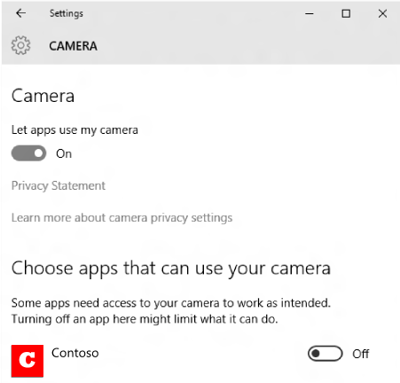

# <a name="launch-the-windows-settings-app"></a>Iniciar la aplicación de configuración de Windows


**API importantes**

-   [**LaunchUriAsync**](https://msdn.microsoft.com/library/windows/apps/hh701476)
-   [**PreferredApplicationPackageFamilyName**](https://msdn.microsoft.com/library/windows/apps/hh965482)
-   [**DesiredRemainingView**](https://msdn.microsoft.com/library/windows/apps/dn298314)

Aprende a iniciar la aplicación Configuración de Windows. En este tema, se describe el esquema de URI **ms-settings:**. Usa este esquema de URI para iniciar la aplicación Configuración de Windows en las páginas de configuración específicas.

El inicio de la aplicación Configuración es una parte importante de la programación de una aplicación compatible con la privacidad. Si la aplicación no puede obtener acceso a un recurso con información confidencial, se recomienda proporcionar al usuario un vínculo a la configuración de privacidad de ese recurso. Para obtener más información, consulta [Directrices para aplicaciones compatibles con la privacidad](https://msdn.microsoft.com/library/windows/apps/hh768223).

## <a name="how-to-launch-the-settings-app"></a>Cómo iniciar la aplicación Configuración

Para iniciar la aplicación **Configuración**, usa el esquema de URI `ms-settings:`, como se muestra en los siguientes ejemplos.

En este ejemplo, se usa un control de hipervínculo XAML para iniciar la página de configuración de privacidad para el micrófono mediante el URI `ms-settings:privacy-microphone`.

```xml
<!--Set Visibility to Visible when access to the microphone is denied -->
<TextBlock x:Name="LocationDisabledMessage" FontStyle="Italic"
                 Visibility="Collapsed" Margin="0,15,0,0" TextWrapping="Wrap" >
          <Run Text="This app is not able to access the microphone. Go to " />
              <Hyperlink NavigateUri="ms-settings:privacy-microphone">
                  <Run Text="Settings" />
              </Hyperlink>
          <Run Text=" to check the microphone privacy settings."/>
</TextBlock>
```

Como alternativa, la aplicación puede llamar al método [**LaunchUriAsync**](https://msdn.microsoft.com/library/windows/apps/hh701476) para iniciar la aplicación **Configuración**. Este ejemplo muestra cómo iniciar la página de configuración de privacidad de la cámara mediante el URI `ms-settings:privacy-webcam` .

```cs
bool result = await Windows.System.Launcher.LaunchUriAsync(new Uri("ms-settings:privacy-webcam"));
```

El código anterior inicia la página de configuración de privacidad de la cámara:



Para obtener más información sobre el inicio de URI, consulta [Iniciar la aplicación predeterminada de un URI](launch-default-app.md).

## <a name="ms-settings-uri-scheme-reference"></a>Referencia del esquema de URI ms-settings:

Usa los siguientes URI para abrir varias páginas de la aplicación Configuración.

> Ten en cuenta que la disponibilidad de una página de configuración varía según la SKU de Windows. No todas las páginas de configuración disponibles en Windows 10 para escritorio están disponibles en Windows 10 Mobile y viceversa. La columna de notas también indica los requisitos adicionales que se deben cumplir para que una página esté disponible.

## <a name="accounts"></a>Cuentas

|Página Configuración| URI |
|-------------|-----|
| Acceder a la red del trabajo o centro docente | ms-settings:workplace |
| Cuentas de correo electrónico y aplicaciones  | ms-settings:emailandaccounts |
| Familia y otras personas | ms-settings:otherusers |
| Opciones de inicio de sesión | ms-settings:signinoptions<br>ms-settings:signinoptions-dynamiclock |
| Sincronizar la configuración | ms-settings:sync |
| Configurar Windows Hello | ms-settings:signinoptions-launchfaceenrollment<br>ms-settings:signinoptions-launchfingerprintenrollment |
| Tu información | ms-settings:yourinfo |

## <a name="apps"></a>Aplicaciones

|Página Configuración| URI |
|-------------|-----|
| Aplicaciones y características | ms-settings:appsfeatures |
| Características de la aplicación | ms-settings:appsfeatures-app (Restablecer, administrar contenido de complementos y descargable, etc. para la aplicación)|
| Aplicaciones para sitios web | ms-settings:appsforwebsites |
| Aplicaciones predeterminadas | ms-settings:defaultapps |
| Administrar características opcionales | ms-settings:optionalfeatures |
| Mapas sin conexión | ms-settings:maps |
| Aplicaciones de inicio | ms-settings:startupapps |
| Reproducción de vídeo | ms-settings:videoplayback |

## <a name="cortana"></a>Cortana

|Página Configuración| URI |
|-------------|-----|
| Permisos e historial | ms-settings:cortana-permissions |
| Más detalles | ms-settings:cortana-moredetails |
| Cortana en Mis dispositivos | ms-settings:cortana-notifications |
| Hablar con Cortana | ms-settings:cortana-language |

> [!NOTE] 
> En esta sección de configuración en el escritorio se llamará búsqueda cuando el equipo se establece en las regiones donde Cortana no está disponible actualmente o se ha deshabilitado Cortana. En este caso no se mostrarán las páginas de Cortana específicas (Cortana a través de Mis dispositivos) y hablar con Cortana. 

## <a name="devices"></a>Dispositivos

|Página Configuración| URI |
|-------------|-----|
| Audio y voz | ms-settings:holographic-audio (solo disponible si la aplicación del Portal de realidad mixta está instalada - disponible en la Microsoft Store) |
| AutoPlay | ms-settings:autoplay |
| Bluetooth | ms-settings:bluetooth |
| Dispositivos conectados | ms-settings:connecteddevices |
| Cámara predeterminada | ms-settings:camera |
| Ratón y panel táctil | ms-settings:mousetouchpad (la configuración del panel táctil solo está disponible en dispositivos que disponen de panel táctil) |
| Lápiz y Windows Ink | ms-settings:pen |
| Impresoras y escáneres | ms-settings:printers |
| Panel táctil | ms-settings:devices-touchpad (la configuración del panel táctil solo está disponible en dispositivos que disponen de hardware de panel táctil) |
| Escritura | ms-settings:typing |
| USB | ms-settings:usb |
| Rueda | ms-settings:wheel (solo disponible si Dial está emparejado) |
| Tu teléfono | ms-settings:mobile-devices  |

## <a name="ease-of-access"></a>Accesibilidad

|Página Configuración| URI |
|-------------|-----|
| Audio | ms-settings:easeofaccess-audio |
| Subtítulos | ms-settings:easeofaccess-closedcaptioning |
| Filtros de color | MS-configuración: easeofaccess-colorfilter |
| Pantalla | ms-settings:easeofaccess-display |
| Control ocular | ms-settings:easeofaccess-eyecontrol |
| Fuentes | ms-settings:fonts |
| Contraste alto | ms-settings:easeofaccess-highcontrast |
| Casco holográfico | ms-settings:holographic-headset (requiere hardware holográfico) |
| Teclado | ms-settings:easeofaccess-keyboard |
| Lupa | ms-settings:easeofaccess-magnifier |
| Mouse | ms-settings:easeofaccess-mouse |
| Narrador | ms-settings:easeofaccess-narrator |
| Otras opciones | ms-settings:easeofaccess-otheroptions |
| Voz | ms-settings:easeofaccess-speechrecognition |

## <a name="extras"></a>Extras

|Página Configuración| URI |
|-------------|-----|
| Extras | ms-settings:extras (solo disponible si se instalan las "aplicaciones de configuración", por ejemplo, de un tercero) |

## <a name="gaming"></a>Juegos

|Página Configuración| URI |
|-------------|-----|
| Difusión | ms-settings:gaming-broadcasting |
| Barra de juegos | ms-settings:gaming-gamebar |
| Game DVR | ms-settings:gaming-gamedvr |
| Modo de juego | ms-settings:gaming-gamemode |
| Reproducir un juego en pantalla completa | ms-settings:quietmomentsgame |
| TruePlay | ms-settings:gaming-trueplay |
| Redes Xbox | ms-settings:gaming-xboxnetworking |

## <a name="home-page"></a>Página principal

|Página Configuración| URI |
|-------------|-----|
| Página principal de configuración | ms-settings: |


## <a name="network--internet"></a>Redes e Internet

|Página Configuración| URI |
|-------------|-----|
| Modo avión | ms-settings:network-airplanemode (usa ms-settings:proximity en Windows 8.x) |
| Red móvil y SIM | ms-settings:network-cellular |
| Uso de datos | ms-settings:datausage |
| Marcación | ms-settings:network-dialup |
| DirectAccess | ms-settings:network-directaccess (solo está disponible si se habilita DirectAccess) |
| Ethernet | ms-settings:network-ethernet |
| Administrar redes conocidas | ms-settings:network-wifisettings |
| Zona con cobertura inalámbrica móvil | ms-settings:network-mobilehotspot |
| NFC | ms-settings:nfctransactions |
| Proxy | ms-settings:network-proxy |
| Estado | ms-settings:network-status |
| VPN | ms-settings:network-vpn |
| Wi-Fi | ms-settings:network-wifi (solo está disponible si el dispositivo tiene un adaptador Wi-Fi) |
| Llamada por Wi-Fi | ms-settings:network-wificalling (solo está disponible si se habilitan las llamadas por Wi-Fi) |

## <a name="personalization"></a>Personalización

|Página Configuración| URI |
|-------------|-----|
| Segundo plano | ms-settings:personalization-background |
| Elegir las carpetas que aparecen en Inicio | ms-settings:personalization-start-places |
| Colores | ms-settings:personalization-colors |
| Resumen | ms-settings:personalization-glance |
| Pantalla de bloqueo | ms-settings:lockscreen |
| Barra de navegación | ms-settings:personalization-navbar |
| Personalización (categoría) | ms-settings:personalization |
| Inicio | ms-settings:personalization-start |
| Barra de tareas | ms-settings:taskbar |
| Temas | ms-settings:themes |

## <a name="phone"></a>Phone

|Página Configuración| URI |
|-------------|-----|
| Tu teléfono | ms-settings:mobile-devices  |

## <a name="privacy"></a>Privacidad

|Página Configuración| URI |
|-------------|-----|
| Aplicaciones para accesorios | ms-settings:privacy-accessoryapps |
| Información de cuenta | ms-settings:privacy-accountinfo |
| Historial de actividades | ms-settings:privacy-activityhistory |
| Id. de publicidad | ms-settings:privacy-advertisingid |
| Diagnósticos de aplicaciones | ms-settings:privacy-appdiagnostics |
| Descargas automáticas de archivos | ms-settings:privacy-automaticfiledownloads |
| Aplicaciones en segundo plano | ms-settings:privacy-backgroundapps |
| Calendario | ms-settings:privacy-calendar |
| Historial de llamadas | ms-settings:privacy-callhistory |
| Cámara | ms-settings:privacy-webcam |
| Contactos | ms-settings:privacy-contacts |
| Documentos | ms-settings:privacy-documents |
| Correo electrónico | ms-settings:privacy-email |
| Seguidor de ojos | ms-settings:privacy-eyetracker (requiere hardware de seguidor de ojos) |
| Comentarios y diagnósticos | ms-settings:privacy-feedback |
| Sistema de archivos | ms-settings:privacy-broadfilesystemaccess |
| General | ms-settings:privacy-general |
| Ubicación | ms-settings:privacy-location |
| Mensajes | ms-settings:privacy-messaging |
| Micrófono | ms-settings:privacy-microphone |
| Movimiento | ms-settings:privacy-motion |
| Notificaciones | ms-settings:privacy-notifications |
| Otros dispositivos | ms-settings:privacy-customdevices |
| Imágenes | ms-settings:privacy-pictures |
| Llamadas de teléfono | ms-settings:privacy-phonecall |
| Señales de radio | ms-settings:privacy-radios |
| Voz, entrada manuscrita y escritura |ms-settings:privacy-speechtyping |
| Tareas | ms-settings:privacy-tasks |
| Vídeos | ms-settings:privacy-videos |

## <a name="surface-hub"></a>Surface Hub

|Página Configuración| URI |
|-------------|-----|
| Cuentas | ms-settings:surfacehub-accounts |
| Liberador de sesiones | ms-settings:surfacehub-sessioncleanup |
| Reuniones de equipo | ms-settings:surfacehub-calling |
| Administración de dispositivos de equipo | ms-settings:surfacehub-devicemanagenent |
| Pantalla de inicio de sesión | ms-settings:surfacehub-welcome |

## <a name="system"></a>Sistema

|Página Configuración| URI |
|-------------|-----|
| Acerca de | ms-settings:about |
| Configuración avanzada de pantalla | ms-settings:display-advanced (solo está disponible en dispositivos que admiten opciones avanzadas de pantalla) |
| Ahorro de batería | ms-settings:batterysaver (solo está disponible en dispositivos que tengan batería, como una tableta) |
| Configuración de ahorro de batería | ms-settings:batterysaver-settings (solo está disponible en dispositivos que tengan batería, como una tableta) |
| Uso de la batería | ms-settings:batterysaver-usagedetails (solo está disponible en dispositivos que tengan batería, como una tableta) |
| Pantalla | ms-settings:display |
| Ubicaciones de guardado predeterminadas | ms-settings:savelocations |
| Pantalla | ms-settings:screenrotation |
| Duplicar mi pantalla | ms-settings:quietmomentspresentation |
| Durante estas horas | ms-settings:quietmomentsscheduled |
| Cifrado | ms-settings:deviceencryption |
| Asistente de concentración | ms-settings:quiethours <br> ms-settings:quietmomentshome |
| Configuración de gráficos | ms-settings:display-advancedgraphics (solo está disponible en dispositivos que admiten opciones gráficas avanzadas) |
| Mensajes | ms-settings:messaging |
| Multitarea | ms-settings:multitasking |
| Ajustes de luz nocturna | ms-settings:nightlight |
| Teléfono | ms-settings:phone-defaultapps |
| Proyección en este PC | ms-settings:project |
| Experiencias compartidas | ms-settings:crossdevice |
| Modo tableta | ms-settings:tabletmode |
| Barra de tareas | ms-settings:taskbar |
| Notificaciones y acciones | ms-settings:notifications |
| Escritorio remoto | ms-settings:remotedesktop |
| Teléfono | ms-settings:phone |
| Inicio/apagado y suspensión | ms-settings:powersleep |
| Sonidos | ms-settings:sounds |
| Almacenamiento | ms-settings:storagesense |
| Sensor de almacenamiento | ms-settings:storagepolicies |

## <a name="time-and-language"></a>Hora e idioma

|Página Configuración| URI |
|-------------|-----|
| Fecha y hora | ms-settings:dateandtime |
| Configuración de IME de Japón | ms-settings:regionlanguage-jpnime (disponible si está instalado el Editor de métodos de entrada de Japón de Microsoft) |
| Configuración IME de Pinyin | ms-settings:regionlanguage-chsime-pinyin (disponible si está instalado el Editor de métodos de entrada de Pinyin de Microsoft) |
| Región e idioma | ms-settings:regionlanguage |
| Idioma de voz | ms-settings:speech |
| Configuración IME de Wubi  | ms-settings:regionlanguage-chsime-wubi (disponible si está instalado el Editor de métodos de entrada de Wubi de Microsoft) |

## <a name="update--security"></a>Actualización y seguridad

|Página Configuración| URI |
|-------------|-----|
| Activación | ms-settings:activation |
| Copia de seguridad | ms-settings:backup |
| Optimización de distribución | ms-settings:delivery-optimization |
| Encuentra mi dispositivo | ms-settings:findmydevice |
| Para desarrolladores | ms-settings:developers |
| Recuperación | ms-settings:recovery |
| Solución de problemas | ms-settings:troubleshoot |
| Seguridad de Windows | ms-settings:windowsdefender |
| ProgramaWindowsInsider | ms-settings:windowsinsider (solo está disponible si el usuario se inscribe en WIP) |
| Windows Update | ms-settings:windowsupdate<br>ms-settings:windowsupdate-action |
| Windows Update: opciones avanzadas | ms-settings:windowsupdate-options |
| Windows Update: opciones de reinicio | ms-settings:windowsupdate-restartoptions |
| Windows Update: ver el historial de actualizaciones | ms-settings:windowsupdate-history |

## <a name="user--accounts"></a>Cuentas de usuario

|Página Configuración| URI |
|-------------|-----|
| Aprovisionamiento | ms-settings:workplace-provisioning (solo disponible si la empresa ha implementado un paquete de aprovisionamiento) |
| Aprovisionamiento | ms-settings:provisioning (solo disponible en dispositivos móviles y si la empresa ha implementado un paquete de aprovisionamiento) |
| Windows Anywhere | ms-settings:windowsanywhere (el dispositivo debe admitir Windows Anywhere) |
