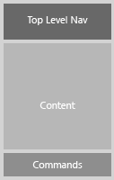
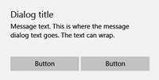

#  Conceptos básicos de diseño de los comandos para las aplicaciones para UWP

En una aplicación de la Plataforma universal de Windows (UWP), los *elementos de comandos* son los elementos interactivos de la interfaz de usuario que permiten al usuario realizar acciones como enviar un correo electrónico, eliminar un elemento o enviar un formulario. En este artículo se describen los elementos de comandos (como los botones y las casillas), las interacciones que admiten y las superficies de comandos (como las barras de comandos y los menús contextuales) para hospedarlos.

## Proporcionar el tipo correcto de interacciones

Al diseñar una interfaz de comandos, la decisión más importante es elegir lo que los usuarios deberían poder hacer. Por ejemplo, si vas a crear una aplicación de fotos, el usuario necesitará herramientas para editar sus fotografías. Sin embargo, si vas a crear una aplicación de redes sociales que muestra fotos, puede que la edición de imágenes no sea una prioridad y, por lo tanto, se pueden omitir las herramientas de edición para ahorrar espacio. Decide lo que quieres que los usuarios lleven a cabo y proporciónales las herramientas para ayudarles a hacerlo.

Para obtener recomendaciones sobre cómo planificar las interacciones adecuadas para tu aplicación, consulta [Planear la aplicación](https://msdn.microsoft.com/library/windows/apps/hh465427.aspx).

## Usa el elemento de comando adecuado para la interacción

Si se usan los elementos adecuados para las interacciones apropiadas, se puede marcar la diferencia entre una aplicación que resulte intuitiva y otra que parezca difícil o confusa. La Plataforma universal de Windows (UWP) ofrece un gran conjunto de elementos de comandos, en forma de controles, que puedes usar en tu aplicación. Esta es una lista de algunos de los controles más habituales y un resumen de las interacciones que permiten.

| Categoría              | Elementos                                                                                                                                                                                                            | Interacción                                                                                                                                        |
|-----------------------|---------------------------------------------------------------------------------------------------------------------------------------------------------------------------------------------------------------------|----------------------------------------------------------------------------------------------------------------------------------------------------|
| Botones               | [Botón](https://msdn.microsoft.com/library/windows/apps/hh465470)                                                                                                                                                     | Desencadena una acción inmediata, por ejemplo, enviar un correo electrónico, confirmar una acción en un cuadro de diálogo o enviar datos de un formulario.                                    |
| Selectores de fecha y hora | [selector de fecha del calendario, vista de calendario, selector de fecha, selector de hora](https://msdn.microsoft.com/library/windows/apps/hh465466)                                                                                                                 | Permite al usuario ver y modificar la información de fecha y hora, como al escribir la fecha de expiración de una tarjeta de crédito o al establecer una alarma.                   |
| Listas                 | [lista desplegable, cuadro de lista, vista de lista y vista de cuadrícula](https://msdn.microsoft.com/library/windows/apps/mt186889)                                                                                                                                              | Presenta los elementos en una lista interactiva o una cuadrícula. Usa estos elementos para permitir a los usuarios seleccionar una película de una lista de nuevas versiones o administrar un inventario. |
| Entrada de texto predictivo | [Cuadro de sugerencias automáticas](https://msdn.microsoft.com/library/windows/apps/dn997762)                                                                                                                                                                    | Ahorra tiempo a los usuarios cuando escriben datos o realizan consultas, al proporcionar sugerencias a medida que escriben.                                                   |
| Controles de selección    | [casilla](https://msdn.microsoft.com/library/windows/apps/hh700393), [botón de radio](https://msdn.microsoft.com/library/windows/apps/hh700395), [modificador para alternar](https://msdn.microsoft.com/library/windows/apps/hh465475) | Permite al usuario elegir entre diferentes opciones, como al completar una encuesta o al configurar los parámetros de la aplicación.                                      |

 

Para obtener una lista completa, consulta [Controles y elementos de la interfaz de usuario](https://dev.windows.com/design/controls-patterns)

##  Colocar los comandos en la superficie correcta

Puedes colocar elementos de comandos en un número de superficies de tu aplicación, como el lienzo de la aplicación (el área de contenido de la aplicación) o elementos de comandos especiales que pueden actuar como contenedores de comandos, como los controles flotantes, menús, cuadros de diálogo y barras de comandos. Estas son algunas recomendaciones generales para la colocación de comandos:

-   Siempre que sea posible, permite que los usuarios manipulen directamente el contenido en el lienzo de la aplicación, en lugar de agregar comandos que actúen sobre el contenido. Por ejemplo, en la aplicación de viajes, permite que los usuarios reorganicen el itinerario arrastrando y colocando las actividades de una lista en el lienzo, en lugar de seleccionar la actividad y usar los botones de comandos Arriba o Abajo.
-   En otro caso, coloca los comandos en una de estas superficies de interfaz de usuario si los usuarios no pueden manipular directamente el contenido:

    -   En la [barra de comandos](https://msdn.microsoft.com/library/windows/apps/hh465302): debes colocar la mayoría de los comandos en la barra de comandos, que ayuda a organizar los comandos y facilita su acceso.
    -   En el lienzo de la aplicación: si el usuario se encuentra en una página o vista que tiene un solo propósito, puedes ofrecer comandos para ese propósito directamente en el lienzo. Debería haber muy pocos de estos comandos.
    -   En un [menú contextual](https://msdn.microsoft.com/library/windows/apps/hh465308): puedes usar los menús contextuales para acciones del Portapapeles (como cortar, copiar y pegar) o para comandos que se aplican al contenido y que no se pueden seleccionar (como agregar un alfiler de anotación en una ubicación sobre el mapa).

Esta es una lista de las superficies de comandos que proporciona Windows y de recomendaciones para saber cuándo usarlas.

<table>
<colgroup>
<col width="50%" />
<col width="50%" />
</colgroup>
<thead>
<tr class="header">
<th align="left">Superficie</th>
<th align="left">Descripción</th>
</tr>
</thead>
<tbody>
<tr class="odd">
<td align="left">Lienzo de la aplicación (área de contenido)

</td>
<td align="left">
Si un comando es esencial y se necesita constantemente para completar tareas en escenarios principales, ponlo en el lienzo (el área de contenido de la aplicación). Debido a que se pueden colocar comandos cerca (o encima) de los objetos sobre los que actúan, colocarlos en el lienzo hace que sean más evidentes y fáciles de usar.

Sin embargo, elige los comandos que colocas en el lienzo con cuidado. Si se colocan demasiados comandos en el lienzo de la aplicación, se ocupa valioso espacio en pantalla y puede saturar al usuario. Si el comando no se usará con frecuencia, considera la posibilidad de colocarlo en otra superficie de comandos, como un menú o el área &quot;Más&quot; de la barra de comandos.
</td>
</tr>
<tr class="even">
<td align="left">[Barra de comandos](https://msdn.microsoft.com/library/windows/apps/hh465302)

</td>
<td align="left">
Las barras de comandos proporcionan a los usuarios un acceso sencillo a las acciones. Puedes usar una barra de comandos para mostrar comandos u opciones que sean específicos del contexto del usuario, como un modo de dibujo o selección de fotos.

Las barras de comandos pueden colocarse en la parte superior de la pantalla, en la parte inferior o en ambas partes a la vez. Este diseño de una aplicación de edición de fotos muestra el área de contenido y la barra de comandos:

Para obtener más información sobre las barras de comandos, consulta el artículo [Directrices para la barra de comandos](https://msdn.microsoft.com/library/windows/apps/hh465302).
</td>
</tr>
<tr class="odd">
<td align="left">[Menús y menús contextuales](../controls-and-patterns/dialogs-popups-menus.md)

</td>
<td align="left">
A veces resulta más eficaz agrupar varios comandos en un menú de comandos. Los menús permiten presentar más opciones en menos espacio. Los menús pueden incluir controles interactivos.

Los menús contextuales pueden proporcionar accesos directos a las acciones más comunes y ofrecer acceso a los comandos secundarios que solo son relevantes en contextos determinados.

Los menús contextuales son para los siguientes tipos de comandos y escenarios de comandos:

<ul>
<li>Acciones contextuales en selecciones de texto, como Copiar, Cortar, Pegar, Revisar ortografía, etc.</li>
<li>Comandos para un objeto sobre el que se quiere actuar pero que no se puede seleccionar ni indicar de otra forma.</li>
<li>Mostrar comandos del portapapeles.</li>
<li>Comandos personalizados.</li>
</ul>

En este ejemplo se muestra el diseño de una aplicación de metro que usa un menú contextual para modificar la ruta, agregar una ruta a marcadores o seleccionar otro tren.

Para obtener más información sobre los menús contextuales, consulta el artículo de [Directrices para el menú contextual](https://msdn.microsoft.com/library/windows/apps/hh465308).
</td>
</tr>
<tr class="even">
<td align="left">[Controles de cuadro de diálogo](../controls-and-patterns/dialogs-popups-menus.md)

</td>
<td align="left">
Los cuadros de diálogo son superposiciones modales en la interfaz de usuario que proporcionan información contextual sobre la aplicación. En la mayoría de casos, los cuadros de diálogo bloquean las interacciones con la ventana de la aplicación hasta que se descartan de forma explícita y a menudo solicitan algún tipo de acción por parte del usuario.

Los cuadros de diálogo pueden ser molestos y solo deben usarse en ciertas situaciones. Para obtener más información, consulta la sección [Cuándo se deben confirmar o deshacer acciones](#whentoconfirm).
</td>
</tr>
<tr class="odd">
<td align="left">[Control flotante](../controls-and-patterns/dialogs-popups-menus.md)

</td>
<td align="left">
Un elemento emergente contextual ligero que muestra la interfaz de usuario relacionada con lo que está haciendo el usuario. Usa un control flotante para:

<ul>
<li>Mostrar un menú.</li>
<li>Mostrar más detalles sobre un elemento.</li>
<li>Pedir al usuario que confirme una acción sin bloquear la interacción con la aplicación.</li>
</ul>

Los controles flotantes se pueden descartar tocando o haciendo clic en algún lugar fuera del control flotante. Para obtener más información sobre los controles flotantes, consulta el artículo [Cuadros de diálogo, elementos emergentes y menús](../controls-and-patterns/dialogs-popups-menus.md).
</td>
</tr>
</tbody>
</table>

 

## Cuándo se deben confirmar o deshacer acciones

Independientemente de lo bien diseñada que esté la interfaz de usuario y de lo cuidadoso que sea el usuario, en algún momento todos los usuarios llevarán a cabo una acción que desearían no haber realizado. La aplicación puede ayudar en este tipo de situaciones, solicitando al usuario que confirme una acción o proporcionando una manera de deshacer las acciones recientes.

-   Para las acciones que no se pueden deshacer y tienen consecuencias mayores, te recomendamos que uses un cuadro de diálogo de confirmación. Algunos ejemplos de estas acciones son:
    -   sobrescribir un archivo
    -   no guardar un archivo antes de cerrar
    -   confirmar la eliminación permanente de un archivo o datos
    -   realizar una compra (a menos que el usuario rechace exigir una confirmación)
    -   enviar un formulario, como cuando se iniciar sesión para algo.
-   Para las acciones que se pueden deshacer, ofrecer un comando Deshacer simple suele bastar. Algunos ejemplos de estas acciones son:
    -   eliminar un archivo
    -   eliminar un correo electrónico (no de forma permanente)
    -   modificar contenido o editar texto
    -   cambiar el nombre de un archivo

**Sugerencia**  Ten cuidado con la cantidad de cuadros de diálogo de confirmación que usa la aplicación; pueden ser muy útiles cuando el usuario comete un error, pero son un estorbo cuando el usuario intenta realizar una acción de forma intencionada.

 

##  Optimización para determinados tipos de entradas

Consulta la [Información básica de interacción](../input-and-devices/input-primer.md) para obtener más información sobre la optimización de las experiencias de usuario en torno a un dispositivo o tipo de entrada.

 

 

<!--HONumber=Jun16_HO4-->

