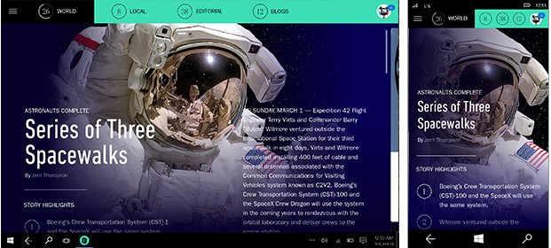

#  Conceptos básicos del diseño de contenido para las aplicaciones para UWP

<link rel="stylesheet" href="https://az835927.vo.msecnd.net/sites/uwp/Resources/css/custom.css"> 

El propósito principal de cualquier aplicación es proporcionar acceso a contenido: en una aplicación de edición de fotos, la fotografía es el contenido; en una aplicación de viajes, los mapas y la información acerca de los destinos de viaje son el contenido; y así sucesivamente. Los elementos de navegación proporcionan acceso a contenido; los elementos de comando permiten al usuario interactuar con el contenido; los elementos de contenido muestran el contenido real.

Este artículo proporciona recomendaciones de diseño del contenido para los tres escenarios de contenido.

## Diseño para el escenario de contenido correcto

Hay tres escenarios principales de contenido:

-   **Consumo**: una experiencia principalmente unidireccional en que se consume contenido. Incluye tareas como la lectura, escuchar música, ver vídeos y ver fotos e imágenes.
-   **Creación**: una experiencia principalmente unidireccional en que el foco está en la creación de nuevo contenido. Puede dividirse en hacer las cosas desde cero, como tomar una foto o un vídeo, crear una nueva imagen en una aplicación de dibujo o abrir un documento nuevo.
-   **Interactivo**: una experiencia de contenido bidireccional que incluye consumir, crear y revisar el contenido.

## Aplicaciones centradas en el consumo

Los elementos de contenido reciben la prioridad más alta en una aplicación centrada en el consumo, seguida por los [elementos de navegación](navigation-basics.md) necesarios para ayudar a los usuarios a encontrar el contenido que quieren. Entre las aplicaciones centradas en el consumo se incluyen reproductores de películas, aplicaciones de lectura, aplicaciones de música y visores de fotos.

Recomendaciones generales para las aplicaciones centradas en el consumo:

-   Considera la posibilidad de crear páginas de [navegación](navigation-basics.md) específicas y de visualización de contenidos para que cuando los usuarios encuentran el contenido que buscan puedan verlo en una página dedicada libres de distracciones.
-   Considera la posibilidad de crear una opción de vista de pantalla completa que expanda el contenido hasta llenar toda la pantalla y oculte todos los demás elementos de la interfaz de usuario.

## Aplicaciones centradas en la creación

Los elementos de contenido y [comando](commanding-basics.md) son los elementos de la interfaz de usuario más importantes de una aplicación centrada en la creación: los elementos de comandos permiten al usuario crear contenido nuevo. Algunos ejemplos son las aplicaciones de pintura, las aplicaciones de edición de fotos, las aplicaciones de edición de vídeos y las aplicaciones de procesamiento de texto.

Como ejemplo, se muestra un diseño para una aplicación de fotos que usa las barras de comandos para proporcionar acceso a las herramientas y opciones de manipulación de fotos. Dado que todos los comandos están en la barra de comandos, la aplicación puede dedicar la mayor parte de su espacio de pantalla al contenido: la foto que se está editando.

Recomendaciones generales para las aplicaciones centradas en la creación:

-   Minimizar el uso de elementos de [navegación](navigation-basics.md).
-   Los elementos de [Comando](commanding-basics.md) son especialmente importantes en las aplicaciones centradas en la creación de elementos. Dado que los usuarios van a ejecutar una gran cantidad de comandos, te recomendamos que proporciones una funcionalidad de historial y de deshacer comandos.

## Aplicaciones con contenido interactivo

En una aplicación con contenido interactivo, los usuarios crean, muestran y editan contenido; muchas aplicaciones pertenecen a esta categoría. Algunos ejemplos de estos tipos de aplicaciones son aplicaciones de línea de negocio, aplicaciones de administración de inventario y aplicaciones de cocina que permiten al usuario crear o modificar las recetas de cocina.

Ese tipo de aplicaciones deben equilibrar los tres elementos de interfaz de usuario:

-   Los elementos de [Navegación](navigation-basics.md) ayudan a los usuarios a buscar y visualizar contenido. Si ver y buscar contenido es el escenario más importante, da prioridad a los elementos de navegación, filtrado, ordenación y búsqueda.
-   Los elementos de [Comando](commanding-basics.md) permiten al usuario crear, editar y manipular el contenido.

Recomendaciones generales para las aplicaciones con contenido interactivo:

-   Puede resultar difícil equilibrar los elementos de navegación, contenido y de comando cuando los tres son importantes. Si es posible, considera la posibilidad de crear pantallas diferentes para explorar, crear y editar el contenido o proporcionar interruptores de modo.

## Elementos de contenido usados frecuentemente

A continuación se facilitan algunos elementos de interfaz de usuario usados frecuentemente para mostrar contenido. (Para obtener una lista completa de los elementos de la interfaz de usuario, consulta [Elementos de los controles y la interfaz de usuario](https://msdn.microsoft.com/library/windows/apps/dn611856)).

<table>
<colgroup>
<col width="33%" />
<col width="33%" />
<col width="33%" />
</colgroup>
<thead>
<tr class="header">
<th align="left">Categoría</th>
<th align="left">Elementos</th>
<th align="left">Descripción</th>
</tr>
</thead>
<tbody>
<tr class="odd">
<td align="left">Audio y vídeo</td>
<td align="left">[Controles de transporte y reproducción de contenido multimedia](../controls-and-patterns/media-playback.md)</td>
<td align="left">Reproduce audio y vídeo.</td>
</tr>
<tr class="even">
<td align="left">Visores de imágenes</td>
<td align="left">[Vista invertida](../controls-and-patterns/flipview.md), [imagen](../controls-and-patterns/images-imagebrushes.md)</td>
<td align="left">Muestra imágenes. El control de vista de volteo muestra una a una las imágenes de una colección, como las fotos de un álbum o los elementos de una página de detalles de un producto.</td>
</tr>
<tr class="odd">
<td align="left">Listas</td>
<td align="left">[lista desplegable, cuadro de lista, vista de lista y vista de cuadrícula](../controls-and-patterns/lists.md)</td>
<td align="left">Presenta los elementos en una lista interactiva o una cuadrícula. Usa estos elementos para permitir a los usuarios seleccionar una película de una lista de nuevos lanzamientos o administrar un inventario.</td>
</tr>
<tr class="even">
<td align="left">Texto y entrada de texto</td>
<td align="left">
[Bloque de texto](../controls-and-patterns/text-block.md), [cuadro de texto](../controls-and-patterns/text-box.md), [cuadro de edición enriquecido](../controls-and-patterns/rich-edit-box.md)

</td>
<td align="left">Muestra texto. Algunos elementos permiten al usuario editar texto. Para obtener más información, consulta [Controles de texto](../controls-and-patterns/text-controls.md)</td>
</tr>
</tbody>
</table>

 

 

