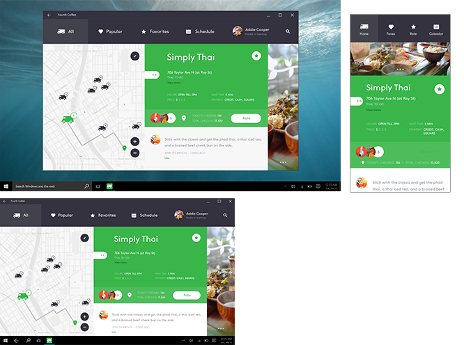
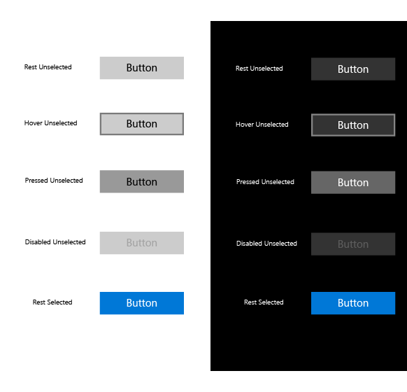
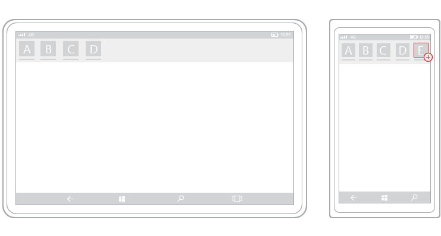
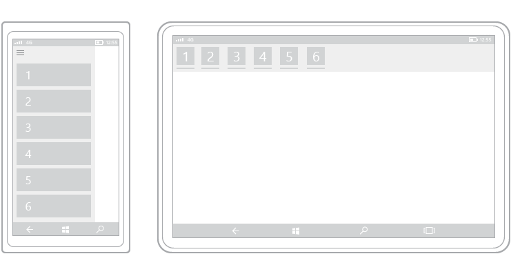

#  Introducción al diseño de aplicaciones para UWP

<link rel="stylesheet" href="https://az835927.vo.msecnd.net/sites/uwp/Resources/css/custom.css">

Una aplicación de la Plataforma universal de Windows (UWP) puede ejecutarse en cualquier dispositivo de Windows, desde el teléfono o la tableta hasta el equipo. 

El diseño de una aplicación que tenga una buena apariencia en una tan amplia variedad de dispositivos puede ser un gran desafío. Afortunadamente, la Plataforma universal de Windows (UWP) proporciona un conjunto de características integradas y bloques de compilación universales que te ayudarán a crear una experiencia de usuario que funcione bien con una diversidad de dispositivos, pantallas y métodos de entrada. Este artículo describe las funciones de la interfaz de usuario y las ventajas de las aplicaciones para UWP, y proporciona una serie de instrucciones generales de diseño para crear tu primera aplicación para UWP. 

## Resumen en vídeo

> [!VIDEO https://channel9.msdn.com/Blogs/One-Dev-Minute/Designing-Universal-Windows-Platform-apps/player]

<!--

-->

<!--

-->

## Funciones UWP

Empecemos echando un vistazo a algunas de las funciones que se obtienen al crear una aplicación para UWP.

### Escalado y píxeles efectivos

Las aplicaciones para UWP ajustan automáticamente el tamaño de los controles, las fuentes y otros elementos de la interfaz de usuario para que sean legibles y fáciles de interaccionar en todos los dispositivos.

Cuando la aplicación se ejecuta en un dispositivo, el sistema usa un algoritmo para normalizar la manera en que los elementos de la interfaz de usuario se muestran en la pantalla. Este algoritmo de escalado tiene en cuenta la distancia de visualización y la densidad de la pantalla (píxeles por pulgada) para optimizar el tamaño percibido (en lugar del tamaño físico). El algoritmo de escalado garantiza que una fuente de 24 px en un dispositivo Surface Hub a 3 metros de distancia sea tan legible para el usuario como una fuente de 24 px en un teléfono de 5 pulgadas a unos centímetros de distancia.

Debido al funcionamiento del sistema de escalado, al diseñar la aplicación para UWP, estás diseñando en *píxeles efectivos*, no en píxeles físicos reales. Por lo tanto, ¿cómo afecta esto a la manera de diseñar la aplicación?

-   Al diseñar, puedes ignorar la densidad de píxeles y la resolución de pantalla real. En su lugar, diseña la resolución efectiva (la resolución en píxeles efectivos) de una clase de tamaño (para obtener más información, consulta el [artículo Tamaños de pantalla y puntos de interrupción](screen-sizes-and-breakpoints-for-responsive-design.md)).

-   Cuando el sistema escala la interfaz de usuario, lo hace en múltiplos de 4. Para garantizar un aspecto nítido, ajusta los diseños a la cuadrícula de 4 x 4 píxeles: convierte los márgenes, los tamaños y las posiciones de los elementos de la interfaz de usuario a un múltiplo de 4 píxeles efectivos. Ten en cuenta que el texto no tiene este requisito; el texto puede tener cualquier tamaño y posición. 

En esta ilustración se muestran elementos de diseño que se asignan a la cuadrícula de 4 x 4 píxeles. El elemento de diseño siempre tendrá bordes nítidos.

> [!TIP]
> Al crear bocetos de pantalla en los programas de edición de imágenes, establece el valor de PPP en 72 y las dimensiones de imagen en la resolución eficaz de la clase de tamaño que quieres obtener. Para una lista de las clases de tamaño y resoluciones efectivas, consulta el [artículo Tamaños de pantalla y puntos de interrupción](screen-sizes-and-breakpoints-for-responsive-design.md).

### Entrada universal e interacciones inteligentes

Otra funcionalidad integrada de la UWP es la entrada universal habilitada a través de interacciones inteligentes. Aunque puedes diseñar tus aplicaciones para dispositivos y modos de entrada específicos, no es necesario. Esto es porque las aplicaciones Windows universales se basan de forma predeterminada en interacciones inteligentes. Esto significa que puedes diseñar con la interacción mediante clic sin tener que saber o definir si el clic procede de un clic del mouse real o de la presión de un dedo.

### Controles y estilos universales

La UWP también proporciona algunos bloques de creación útiles que facilitan el diseño de aplicaciones para varias familias de dispositivos.

-   **Controles universales**

    La UWP proporciona un conjunto de controles universales que se garantiza que funcionan bien en todos los dispositivos que ejecutan Windows. Este conjunto de controles universales incluye de todo, desde controles de formulario comunes, como botones de opción y cuadros de texto, hasta controles sofisticados como la vista de cuadrícula y la vista de lista, que pueden generar listas de elementos de un flujo de datos y una plantilla. Estos controles tienen en cuenta las entradas y se implementan con el conjunto adecuado de funciones de entrada, estados de evento y funcionalidad general para cada familia de dispositivos.

    Para obtener una lista completa de estos controles y los patrones que se pueden crear a partir de ellos, consulta la sección [Controles y patrones](https://dev.windows.com/design/controls-patterns).

-   **Estilos universales**

    Tu aplicación para UWP obtiene automáticamente un conjunto predeterminado de estilos que ofrecen estas características:

    -   Un conjunto de estilos que proporcionan automáticamente a la aplicación un tema claro u oscuro (a tu elección) y puede incorporar la preferencia de color de énfasis que el usuario prefiera.

        

    -   Una tabla de tipos Segoe que garantiza que el texto de la aplicación aparezca nítido en todos los dispositivos.
    -   Animaciones predeterminadas para interacciones.
    -   Compatibilidad automática para modos de alto contraste. Estos estilos se diseñaron teniendo en cuenta el alto contraste, para que cuando se ejecute tu aplicación en un dispositivo en modo de alto contraste, se visualice correctamente.
    -   Compatibilidad automática con otros idiomas. Nuestros estilos predeterminados seleccionan automáticamente la fuente correcta para cada idioma compatible con Windows. Puedes incluso usar varios idiomas en la misma aplicación, y se mostrarán correctamente.
    -   Compatibilidad integrada para el orden de lectura de derecha a izquierda.

    Puedes personalizar estos estilos predeterminados para dar un toque personal a la aplicación o reemplazarlos por completo con los tuyos propios para crear una experiencia visual única. Por ejemplo, este es un diseño para una aplicación meteorológica con un estilo visual único:

    

## UWP y el sistema de diseño Fluent

 El sistema de diseño Fluent te ayuda a crear interfaces de usuario modernas y claras que incorporan luz, profundidad, movimiento, materiales y escala. El diseño Fluent se está aplicando en dispositivos y aplicaciones de Windows 10 para crear experiencias atractivas, llamativas e intuitivas. 
 
 ¿Cómo puedes incorporar el diseño Fluent a tu aplicación? Agregamos continuamente nuevos controles y funciones que lo hacen fácil. Esta es una lista de funciones de diseño Fluent actuales para UWP:  

* [Acrílico](../style/acrylic.md) es un tipo de pincel que crea superficies semitransparentes.
* [Parallax](../style/parallax.md) agrega perspectiva tridimensional, profundidad y movimiento al contenido en desplazamiento, como las listas de desplazamiento.
* [Mostrar](../style/reveal.md) utiliza luz para crear un efecto de superposición del ratón que ilumina elementos interactivos de la interfaz de usuario. 
* [Animaciones conectadas](../style/connected-animation.md) proporciona escenas de transición logradas que mejoran la facilidad de uso, manteniendo el contexto y proporcionando continuidad. 

También hemos actualizado nuestras [directrices de diseño](https://developer.microsoft.com/windows/apps/design) (lo que estás leyendo actualmente), de manera que se basen en los principios de diseño Fluent.

## Anatomía de una aplicación para UWP típica

Ahora que hemos descrito los bloques de creación de aplicaciones para UWP, echemos un vistazo a cómo reunirlos para crear una interfaz de usuario.

Una interfaz de usuario moderna es algo complejo que se compone de texto, formas, colores y animaciones formadas en última instancia por píxeles individuales de la pantalla del dispositivo que estás usando. Al empezar a diseñar una interfaz de usuario, la gran cantidad de opciones puede ser abrumadora.

Para que las cosas sean más sencillas, vamos a definir la anatomía de una aplicación desde una perspectiva de diseño. Supongamos que una aplicación se compone de pantallas y páginas. Cada página tiene una interfaz de usuario que consta de tres tipos de elementos de interfaz de usuario: elementos de contenido, de comandos y de navegación.

<table class="uwpd-noborder" >
<colgroup>
<col width="50%" />
<col width="50%" />
</colgroup>
<tbody>
<tr class="odd">
<td align="left">

</td>
<td align="left"><strong>Elementos de navegación</strong>

Los elementos de navegación ayudan a los usuarios a elegir el contenido que quieren mostrar. Entre algunos ejemplos de elementos de navegación se incluyen [pestañas y tablas dinámicas](../controls-and-patterns/tabs-pivot.md), [hipervínculos](../controls-and-patterns/hyperlinks.md) y [paneles de navegación](../controls-and-patterns/navigationview.md).

Los elementos de navegación se tratan en detalle en el artículo [Conceptos básicos del diseño de navegación](navigation-basics.md).

<strong>Elementos de comandos</strong>

Los elementos de comandos inician acciones como manipular, guardar o compartir contenido. Entre algunos ejemplos de elementos de comandos se incluyen el [botón](../controls-and-patterns/buttons.md) y la [barra de comandos](../controls-and-patterns/app-bars.md). Los elementos de comandos también pueden incluir métodos abreviados de teclado que no están visibles en la pantalla.

Los elementos de comando se tratan en detalle en el artículo [Conceptos básicos del diseño de comandos](commanding-basics.md).

<strong>Elementos de contenido</strong>

Los elementos de contenido muestran el contenido de la aplicación. Para una aplicación de pintura, el contenido puede ser un dibujo; para una aplicación de noticias, el contenido puede ser un artículo.

Los elementos de contenido se tratan en detalle en el artículo [Conceptos básicos del diseño de contenido](content-basics.md).
</td>
</tr>
</tbody>
</table>

 

Como mínimo, una aplicación tiene una pantalla de presentación y una página principal que define la interfaz de usuario. Una aplicación típica tendrá varias páginas y pantallas, y los elementos de navegación, comandos y contenido pueden cambiar de una página a otra.

Al decidir los elementos de la interfaz de usuario adecuados para la aplicación, también puedes considerar los dispositivos y los tamaños de pantalla en los que se ejecutará la aplicación.

## Adaptación de la aplicación a dispositivos y tamaños de pantalla específicos.

Las aplicaciones para UWP usan píxeles efectivos para garantizar que los elementos de diseño sean legibles y se puedan usar en todos los dispositivos con sistema operativo Windows. Por lo tanto, ¿por qué querría personalizar la interfaz de usuario de la aplicación para una familia de dispositivos específicos?

**Nota**  
Antes de continuar, Windows no proporciona un método para que la aplicación detecte el dispositivo específico en el que esta se ejecuta. Puede indicar la familia de dispositivos (móvil, de escritorio, etc.) en que se ejecuta la aplicación, la resolución efectiva y la cantidad de espacio de pantalla disponible en la aplicación (el tamaño de la ventana de la aplicación).

 

-   **Hacer un uso más eficaz del espacio y reducir la necesidad de desplazarse**

    Si diseñas una aplicación para que se vea bien en un dispositivo con una pantalla pequeña, como un teléfono, la aplicación se podrá usar en un equipo con una cantidad de pantalla más grande, pero probablemente habrá espacio desperdiciado. Puedes personalizar la aplicación para mostrar más contenido cuando la pantalla esté por encima de un determinado tamaño. Por ejemplo, una aplicación de compras podría mostrar una categoría de producto a la vez en un teléfono, pero mostrar varias categorías y productos al mismo tiempo en un equipo o en un portátil.

    Al colocar más contenido en la pantalla, se reduce la cantidad de navegación que el usuario necesita realizar.

-   **Para aprovechar las funcionalidades de los dispositivos**

    Determinados dispositivos tienen más probabilidad de contar con ciertas funcionalidades. Por ejemplo, los teléfonos suelen tener un sensor de ubicación y una cámara, mientras que en un equipo puede que no tenga ninguna de las dos funcionalidades. La aplicación puede detectar qué funcionalidades están disponibles y habilitar las funciones que las usan.

-   **Para optimizar la entrada**

    La biblioteca de controles universales funciona con todos los tipos de entrada (táctil, lápiz, teclado, mouse), pero además se pueden optimizar ciertos tipos de entrada reorganizando los elementos de la interfaz de usuario. Por ejemplo, si se colocan elementos de navegación en la parte inferior de la pantalla, acceder a ellos será más fácil para los usuarios de teléfonos, pero la mayoría de los usuarios de equipos esperan ver los elementos de navegación en la parte superior de la pantalla.

## Técnicas de diseño con capacidad de respuesta

Cuando se optimiza la interfaz de usuario de la aplicación para anchos de pantalla específicos, decimos que se está creando un diseño con capacidad de respuesta. Hay seis técnicas de diseño con capacidad de respuesta que puedes usar para personalizar la interfaz de usuario de la aplicación.

### Cambiar la posición

Puedes modificar la ubicación y la posición de los elementos de interfaz de usuario de la aplicación para aprovechar al máximo cada dispositivo. En este ejemplo, la vista vertical en el teléfono o el tabléfono necesita una interfaz de usuario de desplazamiento porque solo está visible un fotograma completo a la vez. Cuando la aplicación se traslada a un dispositivo que permite dos fotogramas completos en pantalla, ya se en orientación vertical u horizontal, el fotograma B puede ocupar un espacio dedicado. Si estás usando una cuadrícula para el posicionamiento, puedes usar la misma cuadrícula al cambiar la posición de los elementos de la interfaz de usuario.

En este diseño de ejemplo para una aplicación de fotos, la aplicación de fotos recoloca su contenido en las pantallas grandes.

### Cambiar el tamaño

Puedes optimizar el tamaño del marco ajustando los márgenes y el tamaño de los elementos de la interfaz de usuario. Esto te permitiría, como se muestra en el ejemplo, mejorar la experiencia de lectura en una pantalla más grande, aumentando simplemente el marco de contenido.

### Redistribuir

Al cambiar el flujo de elementos de la interfaz de usuario en función del dispositivo y la orientación, la aplicación puede ofrecer una visualización óptima del contenido. Por ejemplo, al pasar a una pantalla más grande, tendría sentido cambiar a contenedores más grandes, agregar columnas y generar elementos de lista de forma distinta.

En este ejemplo se muestra cómo se puede adaptar a una única columna de contenido de desplazamiento vertical en el teléfono o tabléfono a una pantalla mayor para mostrar dos columnas de texto.

### Mostrar/ocultar

Puedes mostrar u ocultar los elementos de una interfaz de usuario según la superficie de la pantalla o cuando el dispositivo admite funcionalidades adicionales, situaciones específicas u orientaciones de pantalla preferidas.

En este ejemplo con pestañas, la pestaña del medio con el icono de la cámara podría ser específica de una aplicación, un teléfono o un tabléfono y no es aplicable a dispositivos más grandes, por lo que se muestra en el dispositivo a la derecha. Otro ejemplo común de mostrar u ocultar la interfaz de usuario se aplica a los controles del reproductor multimedia, donde el botón establecido se reduce en dispositivos pequeños y ampliado en dispositivos más grandes con más espacio en pantalla. El reproductor multimedia del equipo, por ejemplo, puede controlar mucho más funcionalidad en pantalla de lo que puede en un teléfono.

Parte de la técnica de mostrar u ocultar incluye elegir cuándo se deben mostrar más metadatos. Cuando la superficie es primordial, como en un teléfono o tabléfono, es mejor mostrar una cantidad mínima de metadatos. Con un equipo de sobremesa o un portátil, puede aparecer una gran cantidad de metadatos. Algunos ejemplos de cómo controlar la función de mostrar u ocultar metadatos son:

-   En una aplicación de correo electrónico, donde puedes mostrar el avatar del usuario.
-   En una aplicación de música, donde puedes mostrar más información acerca de un álbum o intérprete.
-   En una aplicación de vídeo, donde puedes mostrar más información acerca de una película o un programa, como mostrar detalles del reparto y del equipo.
-   En cualquier aplicación puedes desglosar columnas y mostrar más detalles.
-   En cualquier aplicación puedes tomar elementos apilados verticalmente y distribuirlos horizontalmente. Al pasar desde un teléfono o tabléfono a dispositivos más grandes, los elementos de lista apilados pueden cambiar para mostrar filas de elementos de lista y columnas de metadatos.

### Reemplazar

Esta técnica te permite cambiar la interfaz de usuario por una clase de tamaño de dispositivo u orientación específicos. En este ejemplo, el panel de navegación y su interfaz de usuario compacta y transitoria funciona bien para un dispositivo más pequeño, pero en un dispositivo más grande, las pestañas pueden ser una elección mejor.

###  Rediseño de la arquitectura

Puedes contraer o bifurcar la arquitectura de la aplicación para adaptarla mejor a dispositivos específicos. En este ejemplo, ir desde el dispositivo izquierdo al dispositivo de derecho muestra la unión de las páginas.

A continuación se muestra un ejemplo de esta técnica aplicado al diseño de una aplicación de casa inteligente.

## Herramientas y kits de herramientas de diseño

Proporcionamos una serie de herramientas que te ayudarán a diseñar tu aplicación UWP. Consulta nuestra [página de kits de herramientas de diseño](../design-downloads/index.md) para los kits de herramientas XD, Illustrator, Photoshop, Framer y Sketch, así como las descargas herramientas de diseño y fuentes adicionales. 

Para lograr que el equipo esté configurado para codificar realmente aplicaciones para UWP, consulta nuestro artículo [Introducción &gt; Obtener configuración](../get-started/get-set-up.md). 

## Artículos relacionados

- [¿Qué es una aplicación para UWP?](https://msdn.microsoft.com/library/windows/apps/dn726767.aspx)
- [Kits de herramientas de diseño](../design-downloads/index.md)

 
