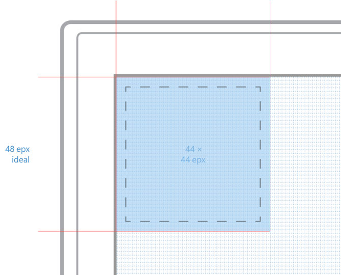

# Unidad de base

La cuadrícula de Windows se construye a partir de unidades de 4 × 4 píxeles. Estos son **píxeles efectivos** y no píxeles físicos. Siempre se debe modificar la escala de los elementos dentro de los diseños en incrementos de 4 px. De este modo, se crea un ritmo conocido que proporciona equilibrio y cohesión.

# Píxeles efectivos

El píxel efectivo es una unidad de medida virtual. Se usa para expresar las dimensiones de diseño y el espaciado, independientemente de la densidad de píxeles de la pantalla (también conocida como puntos por pulgada o PPP). Los píxeles efectivos permiten centrarse en el tamaño percibido real de los elementos de interfaz de usuario sin tener que preocuparse de la densidad de píxeles del dispositivo que se esté ejecutando.

En la mayoría de los casos, simplemente usamos el símbolo px como abreviatura de píxeles efectivos, ya que nunca diseñamos con píxeles físicos.

<video class="video-responsive" controls>
    <source src="assets/grid/epx.mp4" type="video/mp4" />
    Oops! Your browser doesn't seem to support this video. Sorry about that.
</video>

<aside class="aside-dev">
    

        Developer Notes
    

    

            Although XAML doesn't specify units for its widths, heights, margins, and padding, they are all implicitly measured in effective pixels.
    

</aside>

# Destinos táctiles

48 × 48 px es el tamaño óptimo para un elemento con función táctil. Sin embargo, se podría reducir a 44 × 44 px por restricciones de tamaño o en los casos en que la interacción sea menos frecuente. Si es necesaria una altura menor, también se puede optar por un tamaño de 32 × 120 px, pero solo debe usarse en equipos 2 en 1 o de escritorio.

<!--HONumber=Mar16_HO4-->

