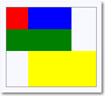
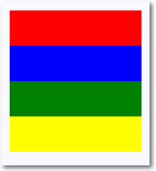
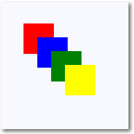

# Paneles de diseño

Puedes usar paneles de diseño para organizar y agrupar elementos de interfaz de usuario en la aplicación. En los paneles de diseño XAML integrados se incluyen [**RelativePanel**](https://msdn.microsoft.com/library/windows/apps/xaml/windows.ui.xaml.controls.relativepanel.aspx), [**StackPanel**](https://msdn.microsoft.com/library/windows/apps/xaml/windows.ui.xaml.controls.stackpanel.aspx), [**Grid**](https://msdn.microsoft.com/library/windows/apps/xaml/windows.ui.xaml.controls.grid.aspx), [**VariableSizedWrapGrid**](https://msdn.microsoft.com/library/windows/apps/xaml/windows.ui.xaml.controls.variablesizedwrapgrid.aspx) y [**Canvas**](https://msdn.microsoft.com/library/windows/apps/xaml/windows.ui.xaml.controls.canvas.aspx). Aquí describimos cada panel y mostramos cómo usarlos para el diseño de los elementos de interfaz de usuario XAML.

Hay varias cosas que tienes que tener en cuenta a la hora de elegir panel de diseño:
- El modo en que el panel coloca sus elementos secundarios.
- El modo en que el panel establece el tamaño de sus elementos secundarios.
- El modo en que los elementos secundarios superpuestos se colocan uno encima del otro (orden Z).
- El número y la complejidad de los elementos anidados del panel que se necesitan para crear el diseño deseado.


**Propiedades adjuntas del panel**

La mayoría de los paneles de diseño XAML usa propiedades adjuntas para permitir que sus elementos secundarios indiquen al panel primario cómo deben colocarse en la interfaz de usuario. Las propiedades adjuntas usan la sintaxis *AttachedPropertyProvider.PropertyName*. Si tienes paneles anidados en otros paneles, solo el panel primario más inmediato interpretará las propiedades adjuntas de los elementos de la interfaz de usuario que especifican características de diseño a un elemento primario.

Este es un ejemplo de cómo puedes establecer la propiedad adjunta [**Canvas.Left**](https://msdn.microsoft.com/library/windows/apps/xaml/windows.ui.xaml.controls.canvas.left.aspx) en un control Button en XAML. Esto informa al elemento primario Canvas de que el objeto Button debe estar situado a 50 píxeles efectivos desde el borde izquierdo del objeto Canvas.

```xaml
<Canvas>
  <Button Canvas.Left="50">Hello</Button>
</Canvas>
```

Para obtener más información sobre las propiedades adjuntas, consulta [Introducción a las propiedades adjuntas](../xaml-platform/attached-properties-overview.md).

> 
              **Nota**&nbsp;&nbsp;Una propiedad adjunta es un concepto de XAML que requiere una sintaxis especial para obtenerla o establecerla desde el código. Para usar propiedades adjuntas en el código, consulta la sección *Propiedades adjuntas en el código* del artículo *Introducción a las propiedades adjuntas*.

**Bordes de panel**

En los paneles RelativePanel, StackPanel y Grid se definen las propiedades de borde que permiten dibujar un borde alrededor del panel sin encapsularlos en un elemento Border adicional. Las propiedades de borde son **BorderBrush**, **BorderThickness**, **CornerRadius** y **Padding**.

Este es un ejemplo de cómo establecer las propiedades de borde de una Grid.

```xaml
<Grid BorderBrush="Blue" BorderThickness="12" CornerRadius="12" Padding="12">
    <TextBlock Text="Hello World!"/>
</Grid>
```


El uso de las propiedades de borde integradas permite reducir el recuento de elementos XAML, lo que puede mejorar el rendimiento de la interfaz de usuario de la aplicación. Para obtener más información sobre los paneles de diseño y el rendimiento de la interfaz de usuario, consulta [Optimiza tu diseño XAML](https://msdn.microsoft.com/library/windows/apps/mt404609.aspx).

## RelativePanel


              [
              **RelativePanel**](https://msdn.microsoft.com/library/windows/apps/xaml/windows.ui.xaml.controls.relativepanel.aspx) permite diseñar los elementos de la interfaz de usuario al especificar su posición en relación con otros elementos y en relación con el panel. De manera predeterminada, un elemento se coloca en la esquina superior izquierda del panel. Puedes usar RelativePanel con un elemento [**VisualStateManager**](https://msdn.microsoft.com/library/windows/apps/xaml/windows.ui.xaml.visualstatemanager.aspx) y elementos [**AdaptiveTrigger**](https://msdn.microsoft.com/library/windows/apps/xaml/windows.ui.xaml.adaptivetrigger.aspx) para reorganizar la interfaz de usuario en distintos tamaños de ventana.

En esta tabla se muestran las propiedades adjuntas que puedes usar para alinear un elemento con el borde o el centro del panel y alinearlo y colocarlo en relación con otros elementos.

Alineación de paneles | Alineación de elementos del mismo nivel | Posición de elementos del mismo nivel
----------------|-------------------|-----------------
[**AlignTopWithPanel**](https://msdn.microsoft.com/library/windows/apps/xaml/windows.ui.xaml.controls.relativepanel.aligntopwithpanel.aspx) | [**AlignTopWith**](https://msdn.microsoft.com/library/windows/apps/xaml/windows.ui.xaml.controls.relativepanel.aligntopwith.aspx) | [**Above**](https://msdn.microsoft.com/library/windows/apps/xaml/windows.ui.xaml.controls.relativepanel.above.aspx)  
[**AlignBottomWithPanel**](https://msdn.microsoft.com/library/windows/apps/xaml/windows.ui.xaml.controls.relativepanel.alignbottomwithpanel.aspx) | [**AlignBottomWith**](https://msdn.microsoft.com/library/windows/apps/xaml/windows.ui.xaml.controls.relativepanel.alignbottomwith.aspx) | [**Below**](https://msdn.microsoft.com/library/windows/apps/xaml/windows.ui.xaml.controls.relativepanel.below.aspx)  
[**AlignLeftWithPanel**](https://msdn.microsoft.com/library/windows/apps/xaml/windows.ui.xaml.controls.relativepanel.alignleftwithpanel.aspx) | [**AlignLeftWith**](https://msdn.microsoft.com/library/windows/apps/xaml/windows.ui.xaml.controls.relativepanel.alignleftwith.aspx) | [**LeftOf**](https://msdn.microsoft.com/library/windows/apps/xaml/windows.ui.xaml.controls.relativepanel.leftof.aspx)  
[**AlignRightWithPanel**](https://msdn.microsoft.com/library/windows/apps/xaml/windows.ui.xaml.controls.relativepanel.alignrightwithpanel.aspx) | [**AlignRightWith**](https://msdn.microsoft.com/library/windows/apps/xaml/windows.ui.xaml.controls.relativepanel.alignrightwith.aspx) | [**RightOf**](https://msdn.microsoft.com/library/windows/apps/xaml/windows.ui.xaml.controls.relativepanel.rightof.aspx)  
[**AlignHorizontalCenterWithPanel**](https://msdn.microsoft.com/library/windows/apps/xaml/windows.ui.xaml.controls.relativepanel.alignhorizontalcenterwithpanel.aspx) | [**AlignHorizontalCenterWith**](https://msdn.microsoft.com/library/windows/apps/xaml/windows.ui.xaml.controls.relativepanel.alignhorizontalcenterwith.aspx) | &nbsp;   
[**AlignVerticalCenterWithPanel**](https://msdn.microsoft.com/library/windows/apps/xaml/windows.ui.xaml.controls.relativepanel.alignverticalcenterwithpanel.aspx) | [**AlignVerticalCenterWith**](https://msdn.microsoft.com/library/windows/apps/xaml/windows.ui.xaml.controls.relativepanel.alignverticalcenterwith.aspx) | &nbsp;   

 
En este código XAML se muestra cómo organizar los elementos en un RelativePanel.

```xaml
<RelativePanel BorderBrush="Gray" BorderThickness="1">
    <Rectangle x:Name="RedRect" Fill="Red" Height="44" Width="44"/>
    <Rectangle x:Name="BlueRect" Fill="Blue"
               Height="44" Width="88"
               RelativePanel.RightOf="RedRect" />

    <Rectangle x:Name="GreenRect" Fill="Green" 
               Height="44"
               RelativePanel.Below="RedRect" 
               RelativePanel.AlignLeftWith="RedRect" 
               RelativePanel.AlignRightWith="BlueRect"/>
    <Rectangle Fill="Yellow"
               RelativePanel.Below="GreenRect" 
               RelativePanel.AlignLeftWith="BlueRect" 
               RelativePanel.AlignRightWithPanel="True"
               RelativePanel.AlignBottomWithPanel="True"/>
</RelativePanel>
```

El resultado tiene el siguiente aspecto. 



Estas son algunas cosas que tienes que tener en cuenta sobre la variación de tamaño de los rectángulos.
- Al rectángulo rojo se le proporciona un tamaño explícito de 44 x 44. Se coloca en la esquina superior izquierda del panel, que es la posición predeterminada.
- Al rectángulo verde se le asigna una altura explícita de 44. Se alinea a la izquierda con el rectángulo rojo y su lado derecho se alinea al rectángulo azul, que determina su ancho.
- Al rectángulo amarillo no se le asigna un tamaño explícito. Se alinea a la izquierda al rectángulo azul. Sus bordes derecho e inferior se alinean al borde del panel. Su tamaño lo determinan estas alineaciones y cambiará cuando cambie el tamaño del panel.

## StackPanel


              [
              **StackPanel**](https://msdn.microsoft.com/library/windows/apps/xaml/windows.ui.xaml.controls.stackpanel.aspx) es un sencillo panel de diseño que organiza los elementos secundarios en una única línea que se puede orientar horizontal o verticalmente. El uso de controles de StackPanel es típico en escenarios donde quieres organizar una pequeña subsección de la interfaz de usuario en la página.

Puedes usar la propiedad [**Orientation**](https://msdn.microsoft.com/library/windows/apps/xaml/windows.ui.xaml.controls.stackpanel.orientation.aspx) para especificar la dirección de los elementos secundarios. La orientación predeterminada es [**Vertical**](https://msdn.microsoft.com/library/windows/apps/xaml/windows.ui.xaml.controls.orientation.aspx).

En el siguiente código XAML se muestra cómo crear un StackPanel vertical de elementos.

```xaml
<StackPanel>
    <Rectangle Fill="Red" Height="44"/>
    <Rectangle Fill="Blue" Height="44"/>
    <Rectangle Fill="Green" Height="44"/>
    <Rectangle Fill="Yellow" Height="44"/>
</StackPanel>
```


El resultado tiene el siguiente aspecto.



En un objeto StackPanel, si el tamaño de un elemento secundario no se establece explícitamente, se amplía para rellenar el ancho disponible (o el alto si el objeto Orientation es **Horizontal**). En este ejemplo, el ancho de los rectángulos no está establecido. Los rectángulos se expanden para ocupar todo el ancho del StackPanel.

## Grid

El panel [**Grid**](https://msdn.microsoft.com/library/windows/apps/xaml/windows.ui.xaml.controls.grid.aspx) permite organizar los controles en diseños de varias filas y varias columnas. Puedes especificar las filas y columnas de un panel Grid mediante las propiedades [**RowDefinitions**](https://msdn.microsoft.com/library/windows/apps/xaml/windows.ui.xaml.controls.grid.rowdefinitions.aspx) y [**ColumnDefinitions**](https://msdn.microsoft.com/library/windows/apps/xaml/windows.ui.xaml.controls.grid.columndefinitions.aspx). En XAML, usa la sintaxis de elemento de propiedad para declarar las filas y columnas en el elemento Grid. Puedes distribuir el espacio dentro de una columna o una fila usando variación de tamaño **Auto** o proporcional.

Los objetos se colocan en celdas específicas de la Grid a través de las propiedades adjuntas [**Grid.Column**](https://msdn.microsoft.com/library/windows/apps/xaml/windows.ui.xaml.controls.grid.column.aspx) y [**Grid.Row**](https://msdn.microsoft.com/library/windows/apps/xaml/windows.ui.xaml.controls.grid.row.aspx).

Puedes hacer que el contenido se expanda entre varias filas y columnas mediante las propiedades adjuntas [**Grid.RowSpan**](https://msdn.microsoft.com/library/windows/apps/xaml/windows.ui.xaml.controls.grid.rowspan.aspx) y [**Grid.ColumnSpan**](https://msdn.microsoft.com/library/windows/apps/xaml/windows.ui.xaml.controls.grid.columnspan.aspx).

En este ejemplo de código XAML se muestra cómo crear una Grid con tres filas y dos columnas. El alto de las filas primera y tercera es lo suficientemente grande como para contener el texto. La altura de la segunda fila rellena el resto de altura que queda disponible. El ancho de las columnas se divide por igual dentro del ancho disponible del contenedor.

```xaml
<Grid>
    <Grid.RowDefinitions>
        <RowDefinition/>
        <RowDefinition Height="44"/>
    </Grid.RowDefinitions>
    <Grid.ColumnDefinitions>
        <ColumnDefinition Width="Auto"/>
        <ColumnDefinition/>
    </Grid.ColumnDefinitions>
    <Rectangle Fill="Red" Width="44"/>
    <Rectangle Fill="Blue" Grid.Row="1"/>
    <Rectangle Fill="Green" Grid.Column="1"/>
    <Rectangle Fill="Yellow" Grid.Row="1" Grid.Column="1"/>
</Grid>
```


El resultado tiene el siguiente aspecto.


En este ejemplo, la variación del tamaño funciona del siguiente modo: 
- La segunda fila tiene un alto explícito de 44 píxeles efectivos. De manera predeterminada, el alto de la primera fila rellena el espacio restante.
- El ancho de la primera columna se establece en **Auto**, por lo su ancho es el necesario para sus elementos secundarios. En este caso, tiene un ancho de 44 píxeles efectivos para que se ajuste al ancho del rectángulo rojo.
- Los rectángulos no tienen ninguna otra limitación de tamaño, por lo que cada uno de ellos se amplía para rellenar la celda de cuadrícula en la que se encuentra.

## VariableSizedWrapGrid


              [
              **VariableSizedWrapGrid**](https://msdn.microsoft.com/library/windows/apps/xaml/windows.ui.xaml.controls.variablesizedwrapgrid.aspx) proporciona un panel de diseño con estilo de cuadrícula en el que los elementos se organizan en filas o en columnas que se ajustan automáticamente a una nueva fila o columna cuando se alcanza el valor [**MaximumRowsOrColumns**](https://msdn.microsoft.com/library/windows/apps/xaml/windows.ui.xaml.controls.variablesizedwrapgrid.maximumrowsorcolumns.aspx). 

La propiedad [**Orientation**](https://msdn.microsoft.com/library/windows/apps/xaml/windows.ui.xaml.controls.variablesizedwrapgrid.orientation.aspx) especifica si la cuadrícula agrega sus elementos en filas o columnas antes de realizar el encapsulado. La orientación predeterminada es **Vertical**, lo que significa que la cuadrícula agrega elementos de arriba abajo hasta que se llene una columna y luego se ajusta a una columna nueva. Cuando el valor es **Horizontal**, la cuadrícula agrega elementos de izquierda a derecha y luego se ajusta a una nueva fila.

Las dimensiones de celda la especifican los elementos [**ItemHeight**](https://msdn.microsoft.com/library/windows/apps/xaml/windows.ui.xaml.controls.variablesizedwrapgrid.itemheight.aspx) e [**ItemWidth**](https://msdn.microsoft.com/library/windows/apps/xaml/windows.ui.xaml.controls.variablesizedwrapgrid.itemwidth.aspx). Cada celda tiene el mismo tamaño. Si ItemHeight o ItemWidth no se especifican, el tamaño de la primera celda se ajusta según su contenido y todas las demás celdas tienen el tamaño de la primera celda.

Puedes usar las propiedades adjuntas [**VariableSizedWrapGrid.ColumnSpan**](https://msdn.microsoft.com/library/windows/apps/xaml/windows.ui.xaml.controls.variablesizedwrapgrid.columnspan.aspx) y [**VariableSizedWrapGrid.RowSpan**](https://msdn.microsoft.com/library/windows/apps/xaml/windows.ui.xaml.controls.variablesizedwrapgrid.rowspan.aspx) para especificar cuántas celdas adyacentes debe llenar un elemento secundario.

Aquí te mostramos cómo usar una VariableSizedWrapGrid en el código XAML.

```xaml
<VariableSizedWrapGrid MaximumRowsOrColumns="3" ItemHeight="44" ItemWidth="44">
    <Rectangle Fill="Red"/>
    <Rectangle Fill="Blue" 
               VariableSizedWrapGrid.RowSpan="2"/>
    <Rectangle Fill="Green" 
               VariableSizedWrapGrid.ColumnSpan="2"/>
    <Rectangle Fill="Yellow" 
               VariableSizedWrapGrid.RowSpan="2" 
               VariableSizedWrapGrid.ColumnSpan="2"/>
</VariableSizedWrapGrid>
```


El resultado tiene el siguiente aspecto.


En este ejemplo, el número máximo de filas de cada columna es 3. En la primera columna se incluyen solo dos elementos (los rectángulos rojos y azules) porque el rectángulo azul se extiende entre dos filas. El rectángulo verde luego se ajusta a la parte superior de la siguiente columna.

## Lienzo

El panel [**Canvas**](https://msdn.microsoft.com/library/windows/apps/xaml/windows.ui.xaml.controls.canvas.aspx) posiciona sus elementos secundarios con puntos de coordenadas fijos. Para especificar los puntos en los elementos secundarios se establecen las propiedades adjuntas [**Canvas.Left**](https://msdn.microsoft.com/library/windows/apps/xaml/windows.ui.xaml.controls.canvas.left.aspx) y [**Canvas.Top**](https://msdn.microsoft.com/library/windows/apps/xaml/windows.ui.xaml.controls.canvas.top.aspx) de cada elemento. Durante el diseño, el objeto Canvas primario lee estas propiedades adjuntas en sus elementos secundarios y usa los valores durante el pase de diseño [Arrange](https://msdn.microsoft.com/library/windows/apps/xaml/windows.ui.xaml.uielement.arrange.aspx).

Los objetos de un Canvas se pueden superponer, donde un objeto se dibuja encima de otro objeto. De manera predeterminada, el Canvas representa los objetos secundarios en el orden en que se declaran, por lo que el último elemento secundario se representa en la parte superior (cada elemento tiene un valor predeterminado z-index de 0). Esto es lo mismo que en otros paneles integrados. Sin embargo, Canvas también admite la propiedad adjunta [**Canvas.ZIndex**](https://msdn.microsoft.com/library/windows/apps/xaml/windows.ui.xaml.controls.canvas.zindex.aspx) que puedes establecer en cada uno de los elementos secundarios. Puedes establecer esta propiedad en el código para cambiar el orden de dibujo de los elementos en tiempo de ejecución. El elemento con el valor Canvas.ZIndex más alto se dibuja en última instancia y, por lo tanto, se dibuja sobre los demás elementos que compartan el mismo espacio y se superponen. Observa que el valor alfa (transparencia) se respeta, por lo que, aunque los elementos se superpongan, el contenido que se muestra en las áreas superpuestas podría mezclarse si el valor de alfa del que está situado más arriba no es el máximo.

El Canvas no ajusta el tamaño de sus elementos secundarios. Cada elemento debe especificar su tamaño.

Este es un ejemplo de un Canvas en el código XAML.

```xaml
<Canvas Width="120" Height="120">
    <Rectangle Fill="Red" Height="44" Width="44"/>
    <Rectangle Fill="Blue" Height="44" Width="44" Canvas.Left="20" Canvas.Top="20"/>
    <Rectangle Fill="Green" Height="44" Width="44" Canvas.Left="40" Canvas.Top="40"/>
    <Rectangle Fill="Yellow" Height="44" Width="44" Canvas.Left="60" Canvas.Top="60"/>
</Canvas>
```


El resultado tiene el siguiente aspecto.



Usa el panel Canvas con moderación. Aunque resulta conveniente poder controlar con precisión la posición de los elementos de la interfaz de usuario en algunos escenarios, un panel de diseño con una posición fija puede hacer que el área de la interfaz de usuario sea menos adaptativa a los cambios generales de tamaño de la ventana de la aplicación. El cambio de tamaño de la ventana de la aplicación podría ser el resultado de un cambio de orientación del dispositivo, de la división de las ventanas de la aplicación o de un cambio de monitor, entre otros escenarios.

## Paneles para ItemsControl

Hay varios paneles especiales que se pueden usar solo como [**ItemsPanel**](https://msdn.microsoft.com/library/windows/apps/xaml/windows.ui.xaml.controls.itemscontrol.itemspanel.aspx) para mostrar los elementos en un [**ItemsControl**](https://msdn.microsoft.com/library/windows/apps/xaml/windows.ui.xaml.controls.itemscontrol.aspx). Estos son [**ItemsStackPanel**](https://msdn.microsoft.com/library/windows/apps/xaml/windows.ui.xaml.controls.itemsstackpanel.aspx), [**ItemsWrapGrid**](https://msdn.microsoft.com/library/windows/apps/xaml/windows.ui.xaml.controls.itemswrapgrid.aspx), [**VirtualizingStackPanel**](https://msdn.microsoft.com/library/windows/apps/xaml/windows.ui.xaml.controls.virtualizingstackpanel.aspx) y [**WrapGrid**](https://msdn.microsoft.com/library/windows/apps/xaml/windows.ui.xaml.controls.wrapgrid.aspx). No puedes usar estos paneles para el diseño general de la interfaz de usuario.


<!--HONumber=Jul16_HO2-->


