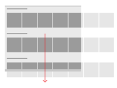

#  Conceptos básicos del diseño de navegación para las aplicaciones para UWP

<link rel="stylesheet" href="https://az835927.vo.msecnd.net/sites/uwp/Resources/css/custom.css">

La navegación en las aplicaciones para la Plataforma universal de Windows (UWP) se basa en un modelo flexible de estructuras de navegación, elementos de navegación y características de nivel del sistema. Juntas, te permiten habilitar diversas experiencias de usuario intuitivas para desplazarse entre las aplicaciones, las páginas y el contenido.

En algunos casos, es posible que puedas encajar todo el contenido y la funcionalidad de la aplicación en una única página, por lo que el usuario solo necesitará desplazarse lateralmente para navegar por ese contenido. Sin embargo, la mayoría de las aplicaciones suelen tener varias páginas de contenido y funcionalidad con las que es posible explorar, atraer e interactuar. Cuando una aplicación tiene más de una página, debes proporcionar la experiencia de navegación adecuada.

Para que la experiencia de navegación con varias páginas de las aplicaciones para UWP tenga éxito y sea intuitiva para los usuarios, deben incluir (estas características se describen más adelante con más detalle):

-   **La estructura de navegación adecuada**

    Compilar una estructura de navegación que tenga sentido para el usuario es fundamental para crear una experiencia de navegación intuitiva.

-   **Elementos de navegación compatibles** que admitan la estructura elegida.

    Los elementos de navegación pueden ayudar a los usuarios a obtener el contenido que desean y también pueden permitir a los usuarios saber dónde se encuentran dentro de la aplicación. Sin embargo, también ocupan espacio que se podría usar para elementos de contenido o comandos, por lo que es importante usar los elementos de navegación adecuados para la estructura de la aplicación.

-   **Respuestas adecuadas a las características de navegación de nivel del sistema (por ejemplo, Atrás)**

    Para proporcionar una experiencia coherente que te resulte más intuitiva, responde a las funciones de navegación de nivel del sistema de manera previsible.

## Crea la estructura de navegación adecuada

Echemos un vistazo a una aplicación que resulta ser una colección de grupos de páginas, en la que cada página contiene un conjunto único de contenidos o funcionalidades. Por ejemplo, una aplicación de fotos podría tener una página para tomar fotos, una página de edición de imágenes y otra página de administración de la biblioteca de imágenes. La manera de organizar estas páginas en grupos define la estructura de navegación de la aplicación. Hay dos formas habituales de organizar un grupo de páginas:

<table class="uwpd-noborder uwpd-top-aligned-table">
<colgroup>
<col width="50%" />
<col width="50%" />
</colgroup>
<thead>
<tr class="header">
<th align="left">En una jerarquía</th>
<th align="left">Como elementos del mismo nivel</th>
</tr>
</thead>
<tbody>
<tr class="odd">
<td style="text-align: center;">

</td>
<td style="text-align: center;">

</td>
</tr>
<tr class="even">
<td style="vertical-align: top">Las páginas se organizan en una estructura de árbol. Cada página secundaria tiene un único elemento primario, pero un elemento primario puede tener una o más páginas secundarias. Para llegar a una página secundaria, hay que moverse a través del elemento primario. </td>
<td style="vertical-align: top"> Existen páginas en paralelo. Puedes ir de una página a otra en cualquier orden. </td>
</tr>
</tbody>
</table>

 

Una aplicación típica usará ambas distribuciones y contendrá algunas partes organizadas como elementos del mismo nivel y, otras partes, en jerarquías.

Por lo tanto, ¿cuándo se deberían organizar las páginas en jerarquías y cuándo en elementos del mismo nivel? Para responder a esta pregunta, debemos tener en cuenta el número de páginas del grupo, si las páginas deben recorrerse en un determinado orden y la relación entre las páginas. En general, las estructuras más planas son más fáciles de entender y más rápidas para navegar, pero a veces es apropiado tener una jerarquía profunda.

  
Se recomienda usar una relación jerárquica cuando
<ul>
<li>se espera que el usuario recorra las páginas en un orden específico; organices la jerarquía para aplicar ese orden.</li>
<li>Hay una relación primaria-secundaria clara entre una de las páginas y las otras páginas en el grupo.</li>
<li>Hay más de 7 páginas en el grupo.

Cuando hay más de 7 páginas en el grupo, puede resultar difícil para los usuarios comprender cómo las páginas son únicas o comprender su ubicación actual dentro del grupo. Si no crees que eso es un problema para tu aplicación, organiza las páginas como elementos del mismo nivel. Por otro lado, puedes tener en cuenta la posibilidad de usar una estructura jerárquica para separar las páginas en dos o más grupos pequeños. Un control de navegación centralizada te puede ayudar a agrupar páginas en categorías.
</li>
</ul>
  

  
Se recomienda usar una relación al mismo nivel cuando
<ul>
<li>las páginas se pueden ver en cualquier orden;</li>
<li>las páginas son claramente distintas entre sí y no tienen una relación primaria-secundaria obvia.</li>
<li>
hay menos de 8 páginas en el grupo.

Cuando hay más de 7 páginas en el grupo, puede resultar difícil para los usuarios comprender cómo las páginas son únicas o comprender su ubicación actual dentro del grupo. Si no crees que eso es un problema para tu aplicación, organiza las páginas como elementos del mismo nivel. Por otro lado, puedes tener en cuenta la posibilidad de usar una estructura jerárquica para separar las páginas en dos o más grupos pequeños. Un control de navegación centralizada te puede ayudar a agrupar páginas en categorías.
</li>
</ul>
  

 

## Usar los elementos de navegación correctos

Los elementos de navegación pueden proporcionar dos servicios: ayudan a los usuarios a obtener el contenido que desean, y algunos elementos también permiten a los usuarios saber dónde se encuentran dentro de la aplicación. Sin embargo, también ocupan espacio que la aplicación puede usar para elementos de contenido o comandos, por lo que es importante usar los elementos de navegación adecuados para la estructura de la aplicación.

### Elementos de navegación de punto a punto

Los elementos de navegación de punto a punto habilitan la navegación entre páginas que se encuentren en el mismo nivel del mismo subárbol.

Para la navegación punto a punto, te recomendamos usar las pestañas o un panel de navegación.

<table>
<thead>
<tr class="header">
<th align="left">Elemento de navegación</th>
<th align="left">Descripción</th>
</tr>
</thead>
<tbody>
<tr class="odd">
<td style="vertical-align:top;">[Pestañas y controles dinámicos](../controls-and-patterns/tabs-pivot.md)

</td>
<td style="vertical-align:top;">Muestra una lista persistente de vínculos a páginas del mismo nivel.

Usa las pestañas o controles dinámicos cuando:

<ul>
<li>
Hay entre 2 y 5 páginas.

(Se pueden usar pestañas/controles dinámicos cuando hay más de 5 páginas pero puede ser difícil ajustarlos todos en la pantalla.)
</li>
<li>se espera que los usuarios cambien entre las páginas con frecuencia;</li>
</ul>

Este diseño de una aplicación para encontrar restaurantes usa pestañas o controles dinámicos:

</td>
</tr>
<tr class="even">
<td style="vertical-align:top;">[Panel de navegación](../controls-and-patterns/nav-pane.md)

</td>
<td style="vertical-align:top;">Muestra una lista de vínculos a páginas de nivel superior.

Usa un panel de navegación cuando:

<ul>
<li>No se espera que los usuarios cambien entre las páginas con frecuencia.</li>
<li>Quieres ahorrar espacio a expensas de ralentizar las operaciones de navegación.</li>
<li>Las páginas existan en el nivel superior.</li>
</ul>

Este diseño de una aplicación particular inteligente incluye un panel de navegación:

</td>
</tr>
</tbody>
</table>

 

Si la estructura de navegación tiene varios niveles, te recomendamos que los elementos de navegación punto a punto solo se vinculen con los elementos del mismo nivel dentro de su subárbol. Ten en cuenta la siguiente ilustración, que muestra una estructura de navegación con tres niveles:

-   En el nivel 1, el elemento de navegación punto a punto debe proporcionar acceso a las páginas A, B, C y D.
-   En el nivel 2, los elementos de navegación punto a punto de las páginas A2 solo deben vincularse a otras páginas A2. No se deben vincular a páginas de nivel 2 del subárbol C.

### Elementos de navegación jerárquica

Los elementos de navegación jerárquica proporcionan navegación entre una página principal y sus páginas secundarias.

<table>
<thead>
<tr class="header">
<th align="left">Elemento de navegación</th>
<th align="left">Descripción</th>
</tr>
</thead>
<tbody>
<tr class="odd">
<td style="vertical-align:top;">[Concentrador](../controls-and-patterns/hub.md)

</td>
<td align="left">Un concentrador es un tipo especial de control de navegación que proporciona vistas previas y resúmenes de sus páginas secundarias. A diferencia del panel de navegación o las pestañas, proporciona navegación a estas páginas secundarias a través de vínculos y encabezados de sección incrustados en la propia página.

Usa un concentrador cuando:

<ul>
<li>Se espera que el usuario quiera ver parte del contenido de las páginas secundarias sin tener que navegar a cada una de ellas.</li>
</ul>

Los concentradores promueven la detección y la exploración, por lo que son adecuados para elementos multimedia, lectores de noticias y aplicaciones de compras.

</td>
</tr>

<tr class="even">
<td style="vertical-align:top;">[Patrón de maestro y detalles](../controls-and-patterns/master-details.md)

</td>
<td align="left">Muestra una lista (vista maestro) de resúmenes de elementos. Al seleccionar un elemento se muestra su página de elementos correspondiente en la sección de detalles.

Usa el elemento de maestro y detalles cuando:

<ul>
<li>no se espera que los usuarios cambien entre elementos secundarios con frecuencia;</li>
<li>si desea permitir al usuario realizar operaciones de alto nivel, como eliminar u ordenar, en elementos individuales o grupos de elementos, y también quieres que el usuario pueda ver o actualizar los detalles de cada elemento.</li>
</ul>

Los elementos de maestro y detalles son ideales para las bandejas de entrada de correo electrónico, las listas de contactos y la entrada de datos.

Este diseño de una aplicación de seguimiento de cotizaciones hace uso de un patrón de maestro y detalles:

</td>
</tr>
</tbody>
</table>

 

### Elementos de navegación histórica

<table>
<thead>
<tr class="header">
<th align="left">Elemento de navegación</th>
<th align="left">Descripción</th>
</tr>
</thead>
<tbody>
<tr class="odd">
<td style="vertical-align:top;">[Atrás](navigation-history-and-backwards-navigation.md)</td>
<td style="vertical-align:top;">Permite al usuario recorrer el historial de navegación dentro de una aplicación y, según el dispositivo, ir de una aplicación a otra. Para obtener más información, consulta el [artículo Historial de navegación y navegación hacia atrás](navigation-history-and-backwards-navigation.md).</td>
</tr>
</tbody>
</table>

 

### Elementos de navegación de nivel de contenido

<table>
<thead>
<tr class="header">
<th align="left">Elemento de navegación</th>
<th align="left">Descripción</th>
</tr>
</thead>
<tbody>
<tr class="odd">
<td style="vertical-align:top;">Hipervínculos y botones</td>
<td style="vertical-align:top;">Los elementos de navegación de contenido incrustado aparecen en el contenido de una página. A diferencia de otros elementos de navegación, que deben ser coherentes en el grupo o subárbol de la página, los elementos de navegación de contenido incrustado son únicos de una página a otra.</td>
</tr>
</tbody>
</table>

 

### Combinación de elementos de navegación

Puedes combinar los elementos de navegación para crear una experiencia de navegación adecuada para tu aplicación. Por ejemplo, la aplicación puede usar un panel de navegación para proporcionar acceso a las páginas de nivel superior, y pestañas para proporcionar acceso a las páginas de segundo nivel.

 

