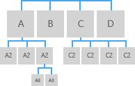
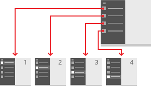

# Conceptos básicos del diseño de navegación para las aplicaciones para UWP

<link rel="stylesheet" href="https://az835927.vo.msecnd.net/sites/uwp/Resources/css/custom.css">

Si se piensa en una aplicación como una colección de páginas, el término *navegación* describe la acción de moverse entre las páginas y dentro de la página. Es el punto de partida de la experiencia del usuario. Es la forma en que los usuarios buscan el contenido y las características que les interesan. Es muy importante y puede ser difícil conseguir que sea correcta. 

> **API importantes**: [Frame](https://docs.microsoft.com/en-us/uwp/api/Windows.UI.Xaml.Controls.Frame), [Clase Pivot](https://docs.microsoft.com/en-us/uwp/api/Windows.UI.Xaml.Controls.Pivot), [Clase NavigationView](https://docs.microsoft.com/en-us/uwp/api/Windows.UI.Xaml.Controls.NavigationView)

Parte del motivo de que sea difícil de conseguir que sea correcta es que, como diseñadores de la aplicación, tenemos un gran número de elecciones que realizar. Si diseñáramos un libro, nuestras elecciones serían sencillas: el orden en que van los capítulos. Con una aplicación, podemos crear una experiencia de navegación que imite un libro y requiera que el usuario pase a través de una serie de páginas por orden. O podemos proporcionar un menú que permita al usuario saltar directamente a cualquier página que quiera, pero si tenemos demasiadas páginas, podemos agobiar al usuario con elecciones. También podemos poner todo en una sola página y proporcionar mecanismos de filtrado para ver el contenido. 

Si bien no hay ningún diseño de navegación que funcione para todas las aplicaciones, hay un conjunto de principios y directrices que puedes seguir para saber el diseño correcto para tu aplicación. 

## Principios de un buen diseño 
Empecemos con los principios básicos que las investigaciones realizadas muestran que son la base de un buen diseño de navegación: 

* Sé coherente: cumple con las expectativas del usuario.
* Sencillo, ante todo: no hagas más de lo que necesites.
* Mantenla limpio: no dejes que las funciones de navegación molesten al usuario.

### Sé coherente 
La navegación tiene que ser coherente con las expectativas del usuario, apoyarse en las convenciones estándar para los iconos, la ubicación y la aplicación de estilos. 

Por ejemplo, en la siguiente ilustración, puedes ver los lugares donde los usuarios esperan encontrar normalmente una funcionalidad, como el panel de navegación y la barra de comandos. Las diferentes familias de dispositivos tienen sus propias convenciones para los elementos de navegación. Por ejemplo, el panel de navegación aparece normalmente en el lado izquierdo de la pantalla en las tabletas y en la parte superior en los dispositivos móviles.

<figure class="wdg-figure">
  
  <figcaption>Los usuarios esperan encontrar determinados elementos de interfaz de usuario en las ubicaciones estándar.</figcaption>
</figure> 

### Sencillo, ante todo
Otro factor importante en el diseño de navegación es la ley de Hick-Hyman, que se cita a menudo en relación con las opciones de navegación. Esta ley nos anima a agregar menos opciones al menú. Cuantas más opciones haya, más lentas serán las interacciones del usuario, en particular cuando explora una nueva aplicación. 

<figure class="wdg-figure">
  
  <figcaption> A la izquierda, observa que hay menos opciones entre las que el usuario puede seleccionar, mientras que, a la derecha, hay varias. La ley Hick-Hyman indica que el menú de la izquierda será más fácil de comprender y utilizar para los usuarios.
</figcaption>
</figure> 

### Mantenla limpia
La característica clave final de la navegación es la interacción limpia, que hace referencia a la forma física en que los usuarios interactúan con la navegación entre una variedad de contextos. Esta es un área donde colocarte en el sitio de los usuarios ayudará a tu diseño. Intenta comprender al usuario y sus comportamientos. Por ejemplo, si estás diseñando una aplicación de cocina, puedes ofrecer acceso fácil a una lista de la compra y un temporizador. 

## Tres reglas generales
Ahora vamos a tomar nuestros principios de diseño: coherencia, simplicidad e interacción limpia y los vamos a usar para llegar a algunas reglas generales. Como con cualquier regla general, úsalos como punto de partida y modifícalos según sea necesario. 

1. Evita las jerarquías de navegación profundas. ¿Cuántos niveles de navegación es mejor para los usuarios? Una navegación de nivel superior y un nivel por debajo de ella suele ser suficiente. Si vas más allá de tres niveles de navegación, se rompe el principio de simplicidad. Aún peor, existe el riesgo de encallar al usuario en una jerarquía profunda de la que tenga dificultades para salir.

2. Evita demasiadas opciones de navegación. De tres a seis elementos de navegación por nivel es lo más común. Si la navegación necesita más, especialmente en el nivel superior de la jerarquía, considera la posibilidad de dividir la aplicación en varias, ya que puede que intentes hacer demasiado en un solo lugar. Demasiados elementos de navegación en una aplicación suelen conducir a objetivos incoherentes y no relacionados.

3. Evita el "pogo-sticking". El pogo-sticking se produce cuando hay contenido relacionado, pero navegar hasta él requiere que el usuario suba un nivel y después vuelva a bajar. El pogo-sticking infringe el principio de interacción limpia ya que requiere clics o interacciones que son innecesarios para lograr un objetivo obvio, en este caso, consultar contenido relacionado en serie. (La excepción a esta regla es la búsqueda y exploración, donde el pogo-sticking puede ser la única manera de proporcionar la diversidad y profundidad necesarias).
<figure class="wdg-figure">
  
  <figcaption> Pogo-sticking para navegar en una aplicación: el usuario tiene que volver atrás (flecha atrás verde) hasta la página principal para navegar a la pestaña "Proyectos".
</figcaption>
</figure> 
<figure class="wdg-figure">
  
  <figcaption>Puedes resolver algunos problemas de pogo-sticking con un icono (observa el gesto de deslizar rápidamente en verde).
</figcaption>
</figure> 

## Uso de la estructura correcta 
Ahora que estás familiarizado con los principios y las reglas generales de navegación, es el momento de tomar la más importante de todas las decisiones de navegación: ¿cómo tienes que estructurar la aplicación? Hay dos estructuras generales: jerárquica y plana. 

### Plana o lateral
En una estructura plana o lateral, las páginas existen en paralelo. Puedes ir de una página a otra en cualquier orden. 
<figure class="wdg-figure">
  
<figcaption>Páginas organizadas en una estructura plana</figcaption>
</figure> 

Las estructuras planas tienen muchas ventajas: son sencillas y fáciles de entender, y permiten que el usuario salte directamente a una página específica sin tener que atravesar páginas intermedias.  En general, las estructuras planas son geniales, pero no funcionan en todas las aplicaciones. Si la aplicación tiene una gran cantidad de páginas, una lista plana puede ser abrumadora. Si las páginas necesitan verse en un determinado orden, una estructura plana no funciona. 

Te recomendamos que uses una estructura plana cuando: 
<ul>
<li>Las páginas se pueden ver en cualquier orden.</li>
<li>las páginas son claramente distintas entre sí y no tienen una relación primaria-secundaria obvia.</li>
<li>hay menos de 8 páginas en el grupo. 
Cuando hay más de 7 páginas en el grupo, puede resultar difícil para los usuarios comprender cómo las páginas son únicas o comprender su ubicación actual dentro del grupo. Si no crees que eso es un problema para tu aplicación, organiza las páginas como elementos del mismo nivel. Por otro lado, puedes tener en cuenta la posibilidad de usar una estructura jerárquica para separar las páginas en dos o más grupos pequeños. (Un control de navegación centralizada te puede ayudar a agrupar páginas en categorías).</li>
</ul>

### Jerárquica

En una estructura jerárquica, las páginas se organizan en una estructura parecida a un árbol. Cada página secundaria tiene un único elemento primario, pero un elemento primario puede tener una o más páginas secundarias. Para llegar a una página secundaria, hay que moverse a través del elemento primario.

<figure class="wdg-figure">
  
<figcaption>Páginas organizadas en una jerarquía</figcaption>
</figure>

Las estructuras jerárquicas sirven para organizar el contenido complejo que se abarca una gran cantidad de páginas, o cuando las páginas tienen que verse en un determinado orden. La desventaja es que las páginas jerárquicas introducen una sobrecarga de navegación: cuanto más profunda es la estructura, más clics se necesitan para que los usuarios pasen de una página otra. 

Te recomendamos una estructura jerárquica cuando: 
<ul>
<li>Se espera que el usuario recorra las páginas en un orden específico. organices la jerarquía para aplicar ese orden.</li>
<li>Hay una relación primaria-secundaria clara entre una de las páginas y las otras páginas en el grupo.</li>
<li>Hay más de 7 páginas en el grupo. 
Cuando hay más de 7 páginas en el grupo, puede resultar difícil para los usuarios comprender cómo las páginas son únicas o comprender su ubicación actual dentro del grupo. Si no crees que eso es un problema para tu aplicación, organiza las páginas como elementos del mismo nivel. Por otro lado, puedes tener en cuenta la posibilidad de usar una estructura jerárquica para separar las páginas en dos o más grupos pequeños. (Un control de navegación centralizada te puede ayudar a agrupar páginas en categorías).</li>
</ul>

### Combinación de estructuras
No tienes que elegir una estructura u otra; muchas aplicaciones de bien diseñadas usan ambas estructuras, plana y jerárquica:

Estas aplicaciones usan estructuras planas para las páginas de nivel superior que pueden verse en cualquier orden, y estructuras jerárquicas para las páginas que tienen relaciones más complejas. 

Si la estructura de navegación tiene varios niveles, te recomendamos que los elementos de navegación punto a punto solo se vinculen con los elementos del mismo nivel dentro de su subárbol. Ten en cuenta la siguiente ilustración, que muestra una estructura de navegación con tres niveles:

-   En el nivel 1, el elemento de navegación punto a punto debe proporcionar acceso a las páginas A, B, C y D.
-   En el nivel 2, los elementos de navegación punto a punto de las páginas A2 solo deben vincularse a otras páginas A2. No se deben vincular a páginas de nivel 2 del subárbol C.

 

## Uso de los controles correctos

Cuando hayas decidido la estructura de las páginas, tendrás que decidir cómo navegarán los usuarios a través de esas páginas. UWP proporciona una variedad de controles de navegación para ayudarte. Dado que estos controles están disponibles en todas las aplicaciones para UWP, usarlos ayuda a garantizar una experiencia de navegación coherente y confiable. 

<table>
<tr>
    <th>Control</th>
    <th>Descripción</th>
</tr>
<tr>
    <td>[Marco](https://docs.microsoft.com/en-us/uwp/api/Windows.UI.Xaml.Controls.Frame)</td>
    <td>Con algunas excepciones, cualquier aplicación que tiene varias páginas usa el marco. En una configuración típica, la aplicación tiene una página principal que contiene el marco y un elemento de navegación primario, como un control de vista de navegación. Cuando el usuario selecciona una página, el marco se carga y la muestra.</td>
</tr>
<tr>
    <td>[Pestañas y controles dinámicos](../controls-and-patterns/tabs-pivot.md)  
    </td>
    <td>Muestra una lista de vínculos a páginas del mismo nivel.

Usa las pestañas o controles dinámicos cuando:

<ul>
<li>
Hay entre 2 y 5 páginas.

(Se pueden usar pestañas/controles dinámicos cuando hay más de 5 páginas pero puede ser difícil ajustarlos todos en la pantalla.)
</li>
<li>Se espera que los usuarios cambien entre las páginas con frecuencia.</li>
</ul></td>
</tr>
<tr>
    <td>[Vista de navegación](../controls-and-patterns/navigationview.md)  
    </td>
    <td>Muestra una lista de vínculos a páginas de nivel superior.

Usa un panel de navegación cuando:

<ul>
<li>No se espera que los usuarios cambien entre las páginas con frecuencia.</li>
<li>Quieres ahorrar espacio a expensas de ralentizar las operaciones de navegación.</li>
<li>Las páginas existen en el nivel superior.</li>
</ul></td>
</tr>
<tr>
<td>[Maestro y detalles](../controls-and-patterns/master-details.md)  
</td>
<td>Muestra una lista (vista maestro) de resúmenes de elementos. Al seleccionar un elemento se muestra su página de elementos correspondiente en la sección de detalles.

Usa el elemento de maestro y detalles cuando:

<ul>
<li>no se espera que los usuarios cambien entre elementos secundarios con frecuencia;</li>
<li>si desea permitir al usuario realizar operaciones de alto nivel, como eliminar u ordenar, en elementos individuales o grupos de elementos, y también quieres que el usuario pueda ver o actualizar los detalles de cada elemento.</li>
</ul>

Los elementos maestro y detalles son idóneos para las bandejas de entrada de correo electrónico, las listas de contactos y la entrada de datos.

</td>
</tr>
<tr>
<td s>[Atrás](navigation-history-and-backwards-navigation.md)</td>
<td style="vertical-align:top;">Permite al usuario recorrer el historial de navegación dentro de una aplicación y, según el dispositivo, ir de una aplicación a otra. Para más información, consulta el [artículo Historial de navegación y navegación hacia atrás](navigation-history-and-backwards-navigation.md).</td>
</tr>
<tr class="odd">
<td>Hipervínculos y botones</td>
<td>Los elementos de navegación de contenido incrustado aparecen en el contenido de una página. A diferencia de otros elementos de navegación, que deben ser coherentes en el grupo o subárbol de la página, los elementos de navegación de contenido incrustado son únicos de una página a otra.</td>
</tr>
</table>

## A continuación: agrega código de navegación a la aplicación
En el siguiente artículo sobre cómo [implementar la navegación básica](navigate-between-two-pages.md), se muestra el XAML y el código necesarios para usar un control Frame para habilitar la navegación básica en tu aplicación. 

<!--
## History and the back button
UWP provides a back button and a system for traversing the user's navigation hsitory within an app. This system does most of the work for you, but there are a few APIs you need to call so that it works properly. For more info and instructions, see [History and backwards navigation](navigation-history-and-backwards-navigation.md). 
-->

