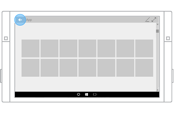
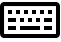

#  <a name="navigation-history-and-backwards-navigation-for-uwp-apps"></a>Historial de navegación y navegación hacia atrás para las aplicaciones para UWP

<link rel="stylesheet" href="https://az835927.vo.msecnd.net/sites/uwp/Resources/css/custom.css">

En Internet, hay sitios web individuales que proporcionan sus propios sistemas de navegación, como tablas de contenido, botones, menús, listas sencillas de vínculos, etc. La experiencia de navegación puede variar considerablemente de un sitio web a otro. Sin embargo, existe una experiencia de navegación coherente: el botón Atrás. La mayoría de los exploradores proporcionan un botón Atrás que tiene el mismo comportamiento, independientemente del sitio web.

Por razones similares, la Plataforma universal de Windows (UWP) proporciona un sistema de navegación hacia atrás coherente para recorrer el historial de navegación del usuario dentro de una aplicación y, según el dispositivo, para pasar de una aplicación a otra.

La interfaz de usuario del botón Atrás del sistema está optimizado para cada tipo de dispositivo de entrada y factor de forma, pero la experiencia de navegación es global y coherente en diferentes dispositivos y aplicaciones para UWP.

Estos son los factores de forma principales que constan de una interfaz de usuario para el botón Atrás:


<table>
    <tr>
        <td colspan="2">Dispositivos</td>
        <td style="vertical-align:top;">Comportamiento del botón Atrás</td>
     </tr>
    <tr>
        <td style="vertical-align:top;">Teléfono</td>
        <td style="vertical-align:top;"></td>
        <td style="vertical-align:top;">
        <ul>
<li>Siempre está presente.</li>
<li>Un botón de hardware o de software situado en la parte inferior del dispositivo.</li>
<li>Navegación hacia atrás global dentro de la aplicación y entre aplicaciones.</li>
</ul>
</td>
     </tr>
     <tr>
        <td style="vertical-align:top;">Tableta</td>
        <td style="vertical-align:top;"></td>
        <td style="vertical-align:top;">
<ul>
<li>Siempre está presente en el modo tableta. No está disponible en modo de escritorio. En su lugar, se puede habilitar botón Atrás de la barra de título. Consulta [PC, Portátil, Tableta](#PC).
Los usuarios pueden cambiar entre ejecutar en modo tableta y modo de escritorio desde **Configuración &gt; Sistema &gt; Modo tableta** con la opción **Hacer que Windows se adapte mejor a los gestos táctiles al usar el dispositivo como tableta**.</li>
<li> Un botón de software de la barra de navegación situado en la parte inferior del dispositivo.</li>
<li>Navegación hacia atrás global dentro de la aplicación y entre aplicaciones.</li></ul>        
        </td>
     </tr>
    <tr>
        <td style="vertical-align:top;">PC, Portátil, Tableta</td>
        <td style="vertical-align:top;"></td>
        <td style="vertical-align:top;">
<ul>
<li>Opcional en el modo de escritorio. No está disponible en modo tableta. Consulta [Tableta](#Tablet). Deshabilitado de manera predeterminada. Deben participar para habilitarlo.
Los usuarios pueden cambiar entre ejecutar en modo tableta y modo de escritorio desde **Configuración &gt; Sistema &gt; Modo tableta** con la opción **Hacer que Windows se adapte mejor a los gestos táctiles al usar el dispositivo como tableta**.</li>
<li>Un botón de software situado en la barra de título de la aplicación.</li>
<li>Navegación hacia atrás solo dentro de la aplicación. No es compatible con la navegación entre aplicaciones.</li></ul>        
        </td>
     </tr>
    <tr>
        <td style="vertical-align:top;">Surface Hub</td>
        <td style="vertical-align:top;"></td>
        <td style="vertical-align:top;">
<ul>
<li>Opcional.</li>
<li>Deshabilitado de manera predeterminada. Los usuarios deben participar para habilitarlo.</li>
<li>Un botón de software situado en la barra de título de la aplicación.</li>
<li>Navegación hacia atrás solo dentro de la aplicación. No es compatible con la navegación entre aplicaciones.</li></ul>        
        </td>
     </tr>     
<table>


Estos son algunos tipos de entrada alternativos que no dependen de la interfaz de usuario del botón Atrás, pero que aun así proporcionan exactamente la misma funcionalidad.


<table>
<tr><td colspan="3">Dispositivos de entrada</td></tr>
<tr><td style="vertical-align:top;">Teclado</td><td style="vertical-align:top;"></td><td style="vertical-align:top;">Tecla Windows + Retroceso</td></tr>
<tr><td style="vertical-align:top;">Cortana</td><td style="vertical-align:top;"></td><td style="vertical-align:top;">Di: "Hola Cortana, retrocede"</td></tr>
</table>
 

Cuando la aplicación se ejecute en un teléfono, una tableta, un equipo o un portátil que tenga habilitado el botón Atrás del sistema, el sistema avisará a la aplicación cuando se presione el botón Atrás. El usuario espera que el botón Atrás vaya a la ubicación anterior en el historial de navegación de la aplicación. Tú decides qué acciones de navegación agregar al historial de navegación y cómo responderán al presionar el botón Atrás.


## <a name="how-to-enable-system-back-navigation-support"></a>Cómo habilitar la compatibilidad con la navegación del botón Atrás del sistema


Las aplicaciones deben habilitar la navegación del botón Atrás en todos los botones Atrás (tanto de hardware como de software) del sistema. Para ello, registra un agente de escucha para el evento [**BackRequested**](https://msdn.microsoft.com/library/windows/apps/dn893596) y define el controlador correspondiente.

Aquí registraremos un agente de escucha global para el evento [**BackRequested**](https://msdn.microsoft.com/library/windows/apps/dn893596) en el archivo de código subyacente App.xaml. Puedes registrar este evento en cada página si quieres excluir páginas específicas de la navegación del botón Atrás, o si quieres ejecutar código en el nivel de página antes de que se muestre la página.

> [!div class="tabbedCodeSnippets"]
```csharp
Windows.UI.Core.SystemNavigationManager.GetForCurrentView().BackRequested += 
    App_BackRequested;
```
```cpp
Windows::UI::Core::SystemNavigationManager::GetForCurrentView()->
    BackRequested += ref new Windows::Foundation::EventHandler<
    Windows::UI::Core::BackRequestedEventArgs^>(
        this, &amp;App::App_BackRequested);
```

Este es el controlador del evento [**BackRequested**](https://msdn.microsoft.com/library/windows/apps/dn893596) que llama a [**GoBack**](https://msdn.microsoft.com/library/windows/apps/dn996568) en el marco raíz de la aplicación.

Este controlador se invoca en un evento global del botón Atrás. Si la pila de retroceso en la aplicación está vacía, el sistema puede navegar a la aplicación anterior de la pila de aplicaciones o a la pantalla Inicio. No hay ninguna pila de retroceso de aplicación en modo de escritorio y, el usuario permanece en la aplicación, incluso cuando se agota la pila de retroceso de aplicación.

> [!div class="tabbedCodeSnippets"]
```csharp
>private void App_BackRequested(object sender, 
>    Windows.UI.Core.BackRequestedEventArgs e)
>{
>    Frame rootFrame = Window.Current.Content as Frame;
>    if (rootFrame == null)
>        return;
>
>    // Navigate back if possible, and if the event has not 
>    // already been handled .
>    if (rootFrame.CanGoBack &amp;&amp; e.Handled == false)
>    {
>        e.Handled = true;
>        rootFrame.GoBack();
>    }
>}
```
```cpp
>void App::App_BackRequested(
>    Platform::Object^ sender, 
>    Windows::UI::Core::BackRequestedEventArgs^ e)
>{
>    Frame^ rootFrame = dynamic_cast<Frame^>(Window::Current->Content);
>    if (rootFrame == nullptr)
>        return;
>
>    // Navigate back if possible, and if the event has not
>    // already been handled.
>    if (rootFrame->CanGoBack && e->Handled == false)
>    {
>        e->Handled = true;
>        rootFrame->GoBack();
>    }
>}
```

## <a name="how-to-enable-the-title-bar-back-button"></a>Cómo habilitar el botón Atrás de la barra de título


Los dispositivos que admiten el modo de escritorio (normalmente PC y portátiles, pero también algunas tabletas) y tienen habilitada la opción (**Configuración &gt; Sistema &gt; Modo de tableta**), no incluyen una barra de navegación global con el botón Atrás del sistema.

En el modo de escritorio, cada aplicación se ejecuta en una ventana con una barra de título. Puedes proporcionar un botón Atrás alternativo para la aplicación, para que aparezca en esta barra de título.

El botón Atrás de la barra de título solo está disponible en aplicaciones que se ejecuten en dispositivos en modo de escritorio, y solo admite el historial de navegación en la aplicación; no admite el historial de navegación entre aplicaciones.

**Importante**  El botón Atrás de la barra de título no se muestra de forma predeterminada. Debes habilitarlo tú mismo.

 

|                                                             |                                                        |
|-------------------------------------------------------------|--------------------------------------------------------|
|  |  |
| Modo de escritorio, sin navegación con el botón Atrás.                           | Modo de escritorio, navegación con el botón Atrás habilitado.                 |

 

Invalida el evento [**OnNavigatedTo**](https://msdn.microsoft.com/library/windows/apps/br227508) y establece [**AppViewBackButtonVisibility**](https://msdn.microsoft.com/library/windows/apps/dn986448) en [**Visible**](https://msdn.microsoft.com/library/windows/apps/dn986276) en el archivo de código subyacente para cada página en la que quieras habilitar el botón Atrás de la barra de título.

Para este ejemplo, enumeraremos cada página en la pila de retroceso y habilitaremos el botón Atrás si la propiedad [**CanGoBack**](https://msdn.microsoft.com/library/windows/apps/br242685) del marco tiene un valor **true**.

> [!div class="tabbedCodeSnippets"]
>```csharp
>protected override void OnNavigatedTo(NavigationEventArgs e)
>{
>    Frame rootFrame = Window.Current.Content as Frame;
>
>    string myPages = "";
>    foreach (PageStackEntry page in rootFrame.BackStack)
>    {
>        myPages += page.SourcePageType.ToString() + "\n";
>    }
>    stackCount.Text = myPages;
>
>    if (rootFrame.CanGoBack)
>    {
>        // Show UI in title bar if opted-in and in-app backstack is not empty.
>        SystemNavigationManager.GetForCurrentView().AppViewBackButtonVisibility = 
>            AppViewBackButtonVisibility.Visible;
>    }
>    else
>    {
>        // Remove the UI from the title bar if in-app back stack is empty.
>        SystemNavigationManager.GetForCurrentView().AppViewBackButtonVisibility = 
>            AppViewBackButtonVisibility.Collapsed;
>    }
>}
>```
>```cpp
>void StartPage::OnNavigatedTo(NavigationEventArgs^ e)
>{
>    auto rootFrame = dynamic_cast<Windows::UI::Xaml::Controls::Frame^>(Window::Current->Content);
>
>    Platform::String^ myPages = "";
>
>    if (rootFrame == nullptr)
>        return;
>
>    for each (PageStackEntry^ page in rootFrame->BackStack)
>    {
>        myPages += page->SourcePageType.ToString() + "\n";
>    }
>    stackCount->Text = myPages;
>
>    if (rootFrame->CanGoBack)
>    {
>        // If we have pages in our in-app backstack and have opted in to showing back, do so
>        Windows::UI::Core::SystemNavigationManager::GetForCurrentView()->AppViewBackButtonVisibility =
>            Windows::UI::Core::AppViewBackButtonVisibility::Visible;
>    }
>    else
>    {
>        // Remove the UI from the title bar if there are no pages in our in-app back stack
>        Windows::UI::Core::SystemNavigationManager::GetForCurrentView()->AppViewBackButtonVisibility =
>            Windows::UI::Core::AppViewBackButtonVisibility::Collapsed;
>    }
>}
>```


### <a name="guidelines-for-custom-back-navigation-behavior"></a>Guía para el comportamiento personalizado de la navegación hacia atrás

Si decides proporcionar tu propia navegación de pila de retroceso, la experiencia debe ser coherente con otras aplicaciones. Te recomendamos que sigas los siguientes patrones de acciones de navegación:

<table>
<thead>
<tr class="header">
<th align="left">Acción de navegación</th>
<th align="left">¿Agregar al historial de navegación?</th>
</tr>
</thead>
<tbody>
<tr class="odd">
<td style="vertical-align:top;"><strong>Página a página, grupos diferentes del mismo nivel</strong></td>
<td style="vertical-align:top;"><strong>Sí</strong>
<p>En esta ilustración, el usuario va del nivel 1 de la aplicación al nivel 2, cruzando grupos del mismo nivel, de forma que la navegación se agrega al historial de navegación.</p>
<p></p>
<p>En la siguiente ilustración, el usuario navega entre dos grupos del mismo nivel, cruzando nuevamente grupos del mismo nivel, de modo que la navegación se agrega al historial de navegación.</p>
<p></p></td>
</tr>
<tr class="even">
<td style="vertical-align:top;"><strong>Página a página; mismo grupo del mismo nivel; sin elemento de navegación en pantalla</strong>
<p>El usuario navega de una página a otra con el mismo grupo del mismo nivel. No hay ningún elemento de navegación que siempre esté presente (como pestañas o controles dinámicos o un panel de navegación acoplado) y que proporcione navegación directa a las dos páginas.</p></td>
<td style="vertical-align:top;"><strong>Sí</strong>
<p>En la siguiente ilustración, el usuario navega entre dos páginas en el mismo grupo del mismo nivel. Las páginas no usan pestañas o un panel de navegación acoplado, por lo que la navegación se agrega al historial de navegación.</p>
<p></p></td>
</tr>
<tr class="odd">
<td style="vertical-align:top;"><strong>Página a página; mismo grupo del mismo nivel; con un elemento de navegación en pantalla</strong>
<p>El usuario navega de una página a otra en el mismo grupo del mismo nivel. Ambas páginas se muestran en el mismo elemento de navegación. Por ejemplo, ambas páginas usan el mismo elemento de pestañas o controles dinámicos, o ambas páginas aparecen en un panel de navegación acoplado.</p></td>
<td style="vertical-align:top;"><strong>No</strong>
<p>Cuando el usuario presiona o pulsa Atrás, volverá a la página previa antes de navegar al grupo actual del mismo nivel.</p>
<p></p></td>
</tr>
<tr class="even">
<td style="vertical-align:top;"><strong>Mostrar una interfaz de usuario transitoria</strong>
<p>La aplicación muestra una ventana emergente o secundaria (como un cuadro de diálogo, pantalla de presentación o teclado en pantalla), o bien la aplicación entra en un modo especial, como el modo de selección múltiple.</p></td>
<td style="vertical-align:top;"><strong>No</strong>
<p>Cuando el usuario presiona el botón Atrás, se descarta la interfaz de usuario transitoria (oculta el teclado en pantalla, cancela el cuadro de diálogo, etc.) y vuelve a la página que genera la interfaz de usuario transitoria.</p>
<p></p></td>
</tr>
<tr class="odd">
<td style="vertical-align:top;"><strong>Enumerar elementos</strong>
<p>La aplicación muestra el contenido de un elemento en pantalla, como los detalles del elemento seleccionado en la lista maestro y detalles.</p></td>
<td style="vertical-align:top;"><strong>No</strong>
<p>Enumerar elementos es similar a navegar dentro de un grupo del mismo nivel. Cuando el usuario presiona o pulsa Atrás, va a la página que precede a la página actual que contiene la enumeración de elementos.</p>
</td>
</tr>
</tbody>
</table>


### <a name="resuming"></a>Reanudar

Cuando el usuario cambia a otra aplicación y vuelve a tu aplicación, te recomendamos que este vuelva a la última página del historial de navegación.


## <a name="get-the-samples"></a>Obtener las muestras
*   [Muestra del botón Atrás](https://github.com/Microsoft/Windows-universal-samples/blob/master/Samples/BackButton)<br/>
    Muestra cómo configurar un controlador de eventos para el evento de botón Atrás y cómo habilitar el botón Atrás de la barra de título para los casos en que la aplicación está en modo de escritorio de ventana.

## <a name="related-articles"></a>Artículos relacionados
* [Conceptos básicos de navegación](navigation-basics.md)

 


