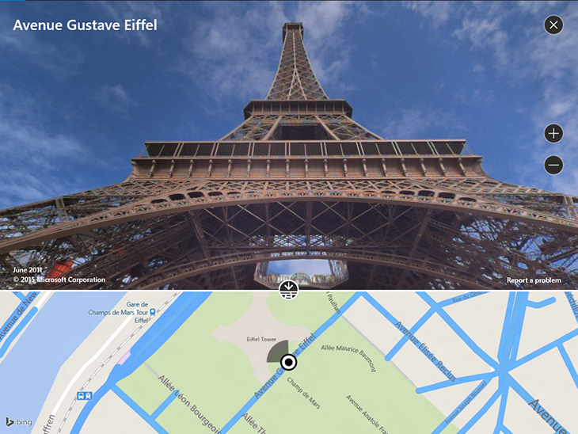
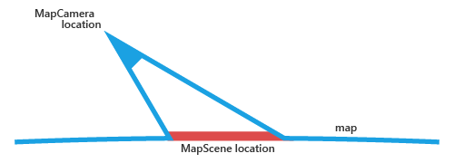

# <a name="display-maps-with-2d-3d-and-streetside-views"></a>Mostrar mapas con vistas 2D, 3D y Streetside

Puedes mostrar un mapa en una ventana de cierre del elemento por cambio de foco llamada *colocar tarjeta* o en un control de mapa completo.

Descarga la [muestra de mapa](http://go.microsoft.com/fwlink/p/?LinkId=619977) para probar algunas de las características descritas en esta guía.

<a id="placecard" />

## <a name="display-map-in-a-placecard"></a>Mostrar el mapa en una tarjeta
Puedes mostrar a los usuarios un mapa en el interior de una ventana emergente ligera arriba, debajo o al lado de un elemento de IU o área de la aplicación donde el usuario puede tocar. Un mapa puede mostrar una ciudad o dirección relacionada con la información de tu aplicación.  

Esta tarjeta muestra la ciudad de Seattle.


Este es el código que hace que Seattle aparezca en una tarjeta debajo de un botón.

```csharp
private void Seattle_Click(object sender, RoutedEventArgs e)
{
    Geopoint seattlePoint = new Geopoint
        (new BasicGeoposition { Latitude = 47.6062, Longitude = -122.3321 });

    PlaceInfo spaceNeedlePlace = PlaceInfo.Create(seattlePoint);

    FrameworkElement targetElement = (FrameworkElement)sender;

    GeneralTransform generalTransform =
        targetElement.TransformToVisual((FrameworkElement)targetElement.Parent);

    Rect rectangle = generalTransform.TransformBounds(new Rect(new Point
        (targetElement.Margin.Left, targetElement.Margin.Top), targetElement.RenderSize));

    spaceNeedlePlace.Show(rectangle, Windows.UI.Popups.Placement.Below);
}
```

Esta tarjeta muestra la ubicación de la Space Needle en Seattle.


Este es el código que hace que la Space Needle aparezca en una tarjeta debajo de un botón.

```csharp
private void SpaceNeedle_Click(object sender, RoutedEventArgs e)
{
    Geopoint spaceNeedlePoint = new Geopoint
        (new BasicGeoposition { Latitude = 47.6205, Longitude = -122.3493 });

    PlaceInfoCreateOptions options = new PlaceInfoCreateOptions();

    options.DisplayAddress = "400 Broad St, Seattle, WA 98109";
    options.DisplayName = "Seattle Space Needle";

    PlaceInfo spaceNeedlePlace =  PlaceInfo.Create(spaceNeedlePoint, options);

    FrameworkElement targetElement = (FrameworkElement)sender;

    GeneralTransform generalTransform =
        targetElement.TransformToVisual((FrameworkElement)targetElement.Parent);

    Rect rectangle = generalTransform.TransformBounds(new Rect(new Point
        (targetElement.Margin.Left, targetElement.Margin.Top), targetElement.RenderSize));

    spaceNeedlePlace.Show(rectangle, Windows.UI.Popups.Placement.Below);
}
```

<a id="map-control" />

## <a name="display-map-in-a-control"></a>Mostrar el mapa en un control

Usa un control de mapa para mostrar los datos de mapa enriquecidos y personalizables en tu aplicación. En un control de mapa se pueden mostrar mapas de carreteras, vistas aéreas en 3D, indicaciones, resultados de la búsqueda y el estado del tráfico. En un mapa se pueden mostrar indicaciones, puntos de interés y la ubicación del usuario. También se pueden mostrar vistas aéreas en 3D, vistas Streetside, el estado del tráfico y del transporte público y negocios locales.

Usa un control de mapa si quieres un mapa dentro de la aplicación que permita a los usuarios ver información geográfica general o específica de la aplicación. Disponer de un control de mapa en la aplicación significa que los usuarios no tienen que salir de la misma para obtener esa información.

> [!NOTE]
>Si no te importa que los usuarios salgan de la aplicación para buscar información, considera la posibilidad de usar para ello la aplicación Mapas de Windows. Tu aplicación puede iniciar Mapas de Windows para que muestre mapas específicos, indicaciones y resultados de búsqueda. Para obtener más información, consulta [Iniciar la aplicación Mapas de Windows](https://msdn.microsoft.com/library/windows/apps/mt228341).

### <a name="add-a-map-control-to-your-app"></a>Agregar un mapa a la interfaz de usuario de la aplicación

Agrega la clase [**MapControl**](https://msdn.microsoft.com/library/windows/apps/dn637004) para mostrar un mapa en una página XAML. Para usar la clase **MapControl**, debes declarar el espacio de nombres [**Windows.UI.Xaml.Controls.Maps**](https://msdn.microsoft.com/library/windows/apps/dn610751) en la página XAML o en el código. Si arrastras el control desde el cuadro de herramientas, esta declaración de espacio de nombres se agregará automáticamente. Si agregas la clase **MapControl** a la página XAML manualmente, también debes agregar manualmente la declaración de espacio de nombres en la parte superior de la página.

El siguiente ejemplo muestra un control de mapa básico y configura el mapa para que muestre los controles de inclinación y zoom, además de aceptar entradas táctiles.

```xml
<Page
    x:Class="MapsAndLocation1.DisplayMaps"
    xmlns="http://schemas.microsoft.com/winfx/2006/xaml/presentation"
    xmlns:x="http://schemas.microsoft.com/winfx/2006/xaml"
    xmlns:local="using:MapsAndLocation1"
    xmlns:d="http://schemas.microsoft.com/expression/blend/2008"
    xmlns:mc="http://schemas.openxmlformats.org/markup-compatibility/2006"
    xmlns:Maps="using:Windows.UI.Xaml.Controls.Maps"
    mc:Ignorable="d">

 <Grid x:Name="pageGrid" Background="{ThemeResource ApplicationPageBackgroundThemeBrush}">

    <Maps:MapControl
       x:Name="MapControl1"            
       ZoomInteractionMode="GestureAndControl"
       TiltInteractionMode="GestureAndControl"   
       MapServiceToken="EnterYourAuthenticationKeyHere"/>

 </Grid>
</Page>
```

Si agregas el control de mapa en el código, debes declarar el espacio de nombres manualmente en la parte superior del archivo de código.

```csharp
using Windows.UI.Xaml.Controls.Maps;
...

// Add the MapControl and the specify maps authentication key.
MapControl MapControl2 = new MapControl();
MapControl2.ZoomInteractionMode = MapInteractionMode.GestureAndControl;
MapControl2.TiltInteractionMode = MapInteractionMode.GestureAndControl;
MapControl2.MapServiceToken = "EnterYourAuthenticationKeyHere";
pageGrid.Children.Add(MapControl2);
```

### <a name="get-and-set-a-maps-authentication-key"></a>Obtener y establecer una clave de autenticación de mapas

Para poder usar la clase [**MapControl**](https://msdn.microsoft.com/library/windows/apps/dn637004) y los servicios de mapa, debes especificar la clave de autenticación de mapas como el valor de la propiedad [**MapServiceToken**](https://msdn.microsoft.com/library/windows/apps/dn637036). En los ejemplos anteriores, reemplaza `EnterYourAuthenticationKeyHere` por la clave que obtuviste en [Bing Maps Developer Center](https://www.bingmapsportal.com/). El texto **Advertencia: no se especificó el elemento MapServiceToken** seguirá apareciendo debajo del control hasta que se especifique la clave de autenticación de mapas. Para obtener más información sobre cómo obtener y establecer una clave de autenticación de mapas, consulta [Solicitar una clave de autenticación de mapas](authentication-key.md).

## <a name="set-the-location-of-a-map"></a>Establecer la ubicación de un mapa
Señala en el mapa cualquier ubicación que desees o usa la ubicación actual del usuario.  

### <a name="set-a-starting-location-for-the-map"></a>Establecer una ubicación inicial para el mapa

Para establecer la ubicación que se debe mostrar en el mapa, especifica la propiedad [**Center**](https://msdn.microsoft.com/library/windows/apps/dn637005) de [**MapControl**](https://msdn.microsoft.com/library/windows/apps/dn637004) en el código o enlaza la propiedad en el marcado XAML. En el siguiente ejemplo se muestra un mapa con la ciudad de Seattle en su centro.

> [!NOTE]
> Dado que no se puede convertir una cadena a la clase [**Geopoint**](https://msdn.microsoft.com/library/windows/apps/dn263675), no se puede especificar un valor para la propiedad [**Center**](https://msdn.microsoft.com/library/windows/apps/dn637005) en el marcado XAML, a menos que se use el enlace de datos. (Esta limitación se aplica también a la propiedad adjunta [**MapControl.Location**](https://msdn.microsoft.com/library/windows/apps/dn653264)).

 
```csharp
protected override void OnNavigatedTo(NavigationEventArgs e)
{
   // Specify a known location.
   BasicGeoposition cityPosition = new BasicGeoposition() { Latitude = 47.604, Longitude = -122.329 };
   Geopoint cityCenter = new Geopoint(cityPosition);

   // Set the map location.
   MapControl1.Center = cityCenter;
   MapControl1.ZoomLevel = 12;
   MapControl1.LandmarksVisible = true;
}
```


### <a name="set-the-current-location-of-the-map"></a>Establecer la ubicación actual del mapa

Para poder acceder a la ubicación del usuario, la aplicación debe llamar al método [**RequestAccessAsync**](https://msdn.microsoft.com/library/windows/apps/dn859152). En ese momento, la aplicación debe estar en primer plano y se debe llamar a **RequestAccessAsync** desde el subproceso de la interfaz de usuario. Ten en cuenta que la aplicación no puede acceder a los datos de ubicación del usuario, hasta que este le conceda permiso para obtenerlos.

Usa el método [**GetGeopositionAsync**](https://msdn.microsoft.com/library/windows/apps/hh973536) de la clase [**Geolocator**](https://msdn.microsoft.com/library/windows/apps/br225534) para obtener la ubicación actual del dispositivo (si está disponible). Para obtener el [**Geopoint**](https://msdn.microsoft.com/library/windows/apps/dn263675) correspondiente, usa la propiedad [**Point**](https://msdn.microsoft.com/library/windows/apps/dn263665) de las coordenadas geográficas de la posición geográfica. Para obtener más información, consulta [Obtener la ubicación actual](get-location.md).

```csharp
// Set your current location.
var accessStatus = await Geolocator.RequestAccessAsync();
switch (accessStatus)
{
   case GeolocationAccessStatus.Allowed:

      // Get the current location.
      Geolocator geolocator = new Geolocator();
      Geoposition pos = await geolocator.GetGeopositionAsync();
      Geopoint myLocation = pos.Coordinate.Point;

      // Set the map location.
      MapControl1.Center = myLocation;
      MapControl1.ZoomLevel = 12;
      MapControl1.LandmarksVisible = true;
      break;

   case GeolocationAccessStatus.Denied:
      // Handle the case  if access to location is denied.
      break;

   case GeolocationAccessStatus.Unspecified:
      // Handle the case if  an unspecified error occurs.
      break;
}
```

Al mostrar la ubicación del dispositivo en un mapa, tal vez te interese mostrar elementos gráficos y establecer el nivel de zoom según la exactitud de los datos de ubicación. Para obtener más información, consulta [Directrices para aplicaciones con reconocimiento de ubicación](https://msdn.microsoft.com/library/windows/apps/hh465148).

### <a name="change-the-location-of-the-map"></a>Cambiar la ubicación del mapa

Para cambiar la ubicación que aparece en un mapa 2D, llama a una de las sobrecargas del método [**TrySetViewAsync**](https://msdn.microsoft.com/library/windows/apps/dn637060). Este método sirve para especificar nuevos valores de [**Center**](https://msdn.microsoft.com/library/windows/apps/dn637005), [**ZoomLevel**](https://msdn.microsoft.com/library/windows/apps/dn637068), [**Heading**](https://msdn.microsoft.com/library/windows/apps/dn637019) y [**Pitch**](https://msdn.microsoft.com/library/windows/apps/dn637044). También puedes especificar una animación opcional para usarla cuando la vista cambie. Para ello, proporciona una constante de la enumeración [**MapAnimationKind**](https://msdn.microsoft.com/library/windows/apps/dn637002).

Para cambiar la ubicación de un mapa 3D, usa el método [**TrySetSceneAsync**](https://msdn.microsoft.com/library/windows/apps/dn974296) en su lugar. Para obtener más información, consulta [Mostrar vistas aéreas en 3D](#3Dviews).

Llama al método [**TrySetViewBoundsAsync**](https://msdn.microsoft.com/library/windows/apps/dn637065) para que se muestre el contenido de una clase [**GeoboundingBox**](https://msdn.microsoft.com/library/windows/apps/dn607949) en el mapa. Usa este método, por ejemplo, para mostrar una ruta o la parte de una ruta en el mapa. Para obtener más información, consulta [Mostrar rutas e indicaciones en un mapa](routes-and-directions.md).

## <a name="change-the-appearance-of-a-map"></a>Cambiar el aspecto de un mapa

Para personalizar la apariencia del mapa, establece la propiedad [**StyleSheet**](https://docs.microsoft.com/uwp/api/windows.ui.xaml.controls.maps.mapcontrol.StyleSheet) del control de mapa a cualquiera de los objetos [**MapStyleSheet**](https://docs.microsoft.com/uwp/api/windows.ui.xaml.controls.maps.mapstylesheet) existentes.

```csharp
myMap.StyleSheet = MapStyleSheet.RoadDark();
```


Puedes usar también JSON para definir estilos personalizados y luego usar ese JSON para crear un objeto [**MapStyleSheet**](https://docs.microsoft.com/uwp/api/windows.ui.xaml.controls.maps.mapstylesheet).

Hoja de estilo de JSON puede crearse de forma interactiva mediante la aplicación de [Editor de hojas de estilo de mapa](https://www.microsoft.com/p/map-style-sheet-editor/9nbhtcjt72ft) .

```csharp
myMap.StyleSheet = MapStyleSheet.ParseFromJson(@"
    {
        ""version"": ""1.0"",
        ""settings"": {
            ""landColor"": ""#FFFFFF"",
            ""spaceColor"": ""#000000""
        },
        ""elements"": {
            ""mapElement"": {
                ""labelColor"": ""#000000"",
                ""labelOutlineColor"": ""#FFFFFF""
            },
            ""water"": {
                ""fillColor"": ""#DDDDDD""
            },
            ""area"": {
                ""fillColor"": ""#EEEEEE""
            },
            ""political"": {
                ""borderStrokeColor"": ""#CCCCCC"",
                ""borderOutlineColor"": ""#00000000""
            }
        }
    }
");
```


Para la referencia de entrada JSON completa, consulta [Referencia de hoja de estilo de mapa](elements-of-map-style-sheet.md).

Puedes empezar con una hoja existente y luego usar JSON para invalidar los elementos que quieras. Este ejemplo empieza por un estilo existente y usa JSON para cambiar solo el color de las zonas de agua.

```csharp
 MapStyleSheet \customSheet = MapStyleSheet.ParseFromJson(@"
    {
        ""version"": ""1.0"",
        ""elements"": {
            ""water"": {
                ""fillColor"": ""#DDDDDD""
            }
        }
    }
");

MapStyleSheet builtInSheet = MapStyleSheet.RoadDark();

myMap.StyleSheet = MapStyleSheet.Combine(new List<MapStyleSheet> { builtInSheet, customSheet });
```


>[!NOTE]
>Los estilos que defines en la segunda hoja de estilos invalidan los estilos de la primera.

## <a name="set-orientation-and-perspective"></a>Establecer la orientación y la perspectiva

Acerca, aleja, girar e inclinar la cámara del mapa para obtener solo el ángulo derecho para el efecto que quieres. Prueba estas propiedades.

-   Para establecer el **centro** del mapa en un punto geográfico, configura la propiedad [**Center**](https://msdn.microsoft.com/library/windows/apps/dn637005).
-   Para establecer el **nivel de zoom** del mapa, configura la propiedad [**ZoomLevel**](https://msdn.microsoft.com/library/windows/apps/dn637068) con un valor que oscile entre 1 y 20 grados.
-   Para establecer la **rotación** del mapa, configura la propiedad [**Heading**](https://msdn.microsoft.com/library/windows/apps/dn637019), de la siguiente manera: 0 o 360 grados = Norte; 90 = Este; 180 = Sur; y 270 = Oeste.
-   Para establecer la **inclinación** del mapa, configura la propiedad [**DesiredPitch**](https://msdn.microsoft.com/library/windows/apps/dn637012) con un valor que oscile entre 0 y 65 grados.

## <a name="show-and-hide-map-features"></a>Mostrar y ocultar las características del mapa

Muestra u oculta características de mapa, como carreteras y puntos de referencia estableciendo los valores de las siguientes propiedades de la clase [**MapControl**](https://msdn.microsoft.com/library/windows/apps/dn637004).

* Mostrar **edificios y puntos de referencia** en el mapa, habilita o deshabilita la propiedad [**LandmarksVisible**](https://msdn.microsoft.com/library/windows/apps/dn637023).

  > [!NOTE]
  > Puedes mostrar u ocultar los edificios, pero no puedes evitar que aparezcan 3 dimensiones.  

* Para mostrar **características para los peatones** (por ejemplo, escaleras públicas) en el mapa, habilita o deshabilita la propiedad [**PedestrianFeaturesVisible**](https://msdn.microsoft.com/library/windows/apps/dn637042).
* Para mostrar el **tráfico** en el mapa, habilita o deshabilita la propiedad [**TrafficFlowVisible**](https://msdn.microsoft.com/library/windows/apps/dn637055).
* Para especificar si la **marca de agua** se muestra en el mapa, configura la propiedad [**WatermarkMode**](https://msdn.microsoft.com/library/windows/apps/dn637066) en una de las constantes de la enumeración [**MapWatermarkMode**](https://msdn.microsoft.com/library/windows/apps/dn610749).
* Para mostrar **rutas en coche o a pie** en el mapa, agrega una clase [**MapRouteView**](https://msdn.microsoft.com/library/windows/apps/dn637122) a la colección [**Routes**](https://msdn.microsoft.com/library/windows/apps/dn637047) del control de mapa. Para obtener más información y un ejemplo, consulta [Mostrar rutas e indicaciones en un mapa](routes-and-directions.md).

Para obtener información sobre cómo mostrar controles de marcadores, formas y XAML en la clase [**MapControl**](https://msdn.microsoft.com/library/windows/apps/dn637004), consulta el artículo [Mostrar puntos de interés en un mapa](display-poi.md).

## <a name="display-streetside-views"></a>Mostrar vistas de Streetside


Una vista de Streetside es una perspectiva en el nivel de calle de una ubicación que aparece encima del control de mapa.



Ten en cuenta que la experiencia en el "interior" de la vista de Streetside es diferente del mapa que se mostró en un principio en el control de mapa. Por ejemplo, al cambiar la ubicación en la vista de Streetside no cambia la ubicación o el aspecto del mapa que subyace bajo la vista de Streetside. Tras cerrar la vista de Streetside (haciendo clic en la **X** de la esquina superior derecha del control), no se modifica el mapa original.

Para mostrar una vista de Streetside

1.  Consulta [**IsStreetsideSupported**](https://msdn.microsoft.com/library/windows/apps/dn974271) para ver si el dispositivo admite vistas de Streetside.
2.  Si las admite, crea una clase [**StreetsidePanorama**](https://msdn.microsoft.com/library/windows/apps/dn974360) cerca de la ubicación especificada llamando a [**FindNearbyAsync**](https://msdn.microsoft.com/library/windows/apps/dn974361).
3.  Comprueba que la clase [**StreetsidePanorama**](https://msdn.microsoft.com/library/windows/apps/dn974360) no sea nula; gracias a ello podrás saber si ha encontrado una panorámica cercana.
4.  Si la encontró, crea una clase [**StreetsideExperience**](https://msdn.microsoft.com/library/windows/apps/dn974356) para la propiedad [**CustomExperience**](https://msdn.microsoft.com/library/windows/apps/dn974263) del control de mapa.

Este ejemplo indica cómo mostrar una vista de Streetside similar a la imagen anterior.

**Nota**el mapa general no aparecerá si el tamaño del control de mapa es demasiado pequeño.

 

```csharp
private async void showStreetsideView()
{
   // Check if Streetside is supported.
   if (MapControl1.IsStreetsideSupported)
   {
      // Find a panorama near Avenue Gustave Eiffel.
      BasicGeoposition cityPosition = new BasicGeoposition() { Latitude = 48.858, Longitude = 2.295};
      Geopoint cityCenter = new Geopoint(cityPosition);
      StreetsidePanorama panoramaNearCity = await StreetsidePanorama.FindNearbyAsync(cityCenter);

      // Set the Streetside view if a panorama exists.
      if (panoramaNearCity != null)
      {
         // Create the Streetside view.
         StreetsideExperience ssView = new StreetsideExperience(panoramaNearCity);
         ssView.OverviewMapVisible = true;
         MapControl1.CustomExperience = ssView;
      }
   }
   else
   {
      // If Streetside is not supported
      ContentDialog viewNotSupportedDialog = new ContentDialog()
      {
         Title = "Streetside is not supported",
         Content ="\nStreetside views are not supported on this device.",
         PrimaryButtonText = "OK"
      };
      await viewNotSupportedDialog.ShowAsync();            
   }
}
```

<a id="3Dviews" />
## <a name="display-aerial-3d-views"></a>Mostrar vistas aéreas en 3D


Usa la clase [**MapScene**](https://msdn.microsoft.com/library/windows/apps/dn974329) para especificar una perspectiva en 3D del mapa. La escena del mapa representa la vista en 3D que aparece en el mapa. Asimismo, la clase [**MapCamera**](https://msdn.microsoft.com/library/windows/apps/dn974244) representa la posición de la cámara que mostrará esta vista.



Para que los edificios y otras características de la superficie de mapa aparezcan en 3D, establece la propiedad [**Style**](https://msdn.microsoft.com/library/windows/apps/dn637051) del control de mapa en [**MapStyle.Aerial3DWithRoads**](https://msdn.microsoft.com/library/windows/apps/dn637127). Este es un ejemplo de una vista en 3D con el estilo **Aerial3DWithRoads**.


Para mostrar una vista en 3D

1.  Comprueba [**Is3DSupported**](https://msdn.microsoft.com/library/windows/apps/dn974265) para ver si el dispositivo admite vistas en 3D.
2.  Si admite vistas en 3D, establece la propiedad [**Style**](https://msdn.microsoft.com/library/windows/apps/dn637051) del control de mapa en [**MapStyle.Aerial3DWithRoads**](https://msdn.microsoft.com/library/windows/apps/dn637127).
3.  Crea un objeto [**MapScene**](https://msdn.microsoft.com/library/windows/apps/dn974329) mediante uno de los diversos métodos **CreateFrom**, como [**CreateFromLocationAndRadius**](https://msdn.microsoft.com/library/windows/apps/dn974336) y [**CreateFromCamera**](https://msdn.microsoft.com/library/windows/apps/dn974334).
4.  Llama a [**TrySetSceneAsync**](https://msdn.microsoft.com/library/windows/apps/dn974296) para mostrar la vista en 3D. También puedes especificar una animación opcional para usarla cuando la vista cambie. Para ello, proporciona una constante de la enumeración [**MapAnimationKind**](https://msdn.microsoft.com/library/windows/apps/dn637002).

Este ejemplo indica cómo mostrar una vista en 3D.

```csharp
private async void display3DLocation()
{
   if (MapControl1.Is3DSupported)
   {
      // Set the aerial 3D view.
      MapControl1.Style = MapStyle.Aerial3DWithRoads;

      // Specify the location.
      BasicGeoposition hwGeoposition = new BasicGeoposition() { Latitude = 43.773251, Longitude = 11.255474};
      Geopoint hwPoint = new Geopoint(hwGeoposition);

      // Create the map scene.
      MapScene hwScene = MapScene.CreateFromLocationAndRadius(hwPoint,
                                                                           80, /* show this many meters around */
                                                                           0, /* looking at it to the North*/
                                                                           60 /* degrees pitch */);
      // Set the 3D view with animation.
      await MapControl1.TrySetSceneAsync(hwScene,MapAnimationKind.Bow);
   }
   else
   {
      // If 3D views are not supported, display dialog.
      ContentDialog viewNotSupportedDialog = new ContentDialog()
      {
         Title = "3D is not supported",
         Content = "\n3D views are not supported on this device.",
         PrimaryButtonText = "OK"
      };
      await viewNotSupportedDialog.ShowAsync();
   }
}
```

## <a name="get-info-about-locations"></a>Obtener información sobre ubicaciones


Para obtener información sobre las ubicaciones en el mapa, llama a los siguientes métodos de la clase [**MapControl**](https://msdn.microsoft.com/library/windows/apps/dn637004).

-   [**GetLocationFromOffset**](https://msdn.microsoft.com/library/windows/apps/dn637016): gracias a este método, puedes obtener la ubicación geográfica correspondiente al punto especificado en la ventanilla del control del mapa.
-   [**GetOffsetFromLocation**](https://msdn.microsoft.com/library/windows/apps/dn637018): gracias a este método, puedes obtener el punto especificado en la ventanilla del control de mapa correspondiente a la ubicación geográfica especificada.
-   [**IsLocationInView**](https://msdn.microsoft.com/library/windows/apps/dn637022): gracias a este método, puedes determinar si la ubicación geográfica especificada está actualmente visible en la ventanilla del control de mapa.
-   [**FindMapElementsAtOffset**](https://msdn.microsoft.com/library/windows/apps/dn637014): gracias a este método, puedes obtener los elementos del mapa ubicados en el punto que se especificó en la ventanilla del control de mapa.

## <a name="handle-interaction-and-changes"></a>Controlar la interacción y los cambios


Debes controlar los siguientes eventos de la clase [**MapControl**](https://msdn.microsoft.com/library/windows/apps/dn637004) para administrar los gestos de entrada del usuario en el mapa. Comprueba los valores de las propiedades [**Location**](https://msdn.microsoft.com/library/windows/apps/dn637091) y [**Position**](https://msdn.microsoft.com/library/windows/apps/dn637093) de la clase [**MapInputEventArgs**](https://msdn.microsoft.com/library/windows/apps/dn637090) para obtener información sobre la ubicación geográfica en el mapa y la posición física en la ventanilla donde se produjo el gesto.

-   [**MapTapped**](https://msdn.microsoft.com/library/windows/apps/dn637038)
-   [**MapDoubleTapped**](https://msdn.microsoft.com/library/windows/apps/dn637032)
-   [**MapHolding**](https://msdn.microsoft.com/library/windows/apps/dn637035)

Para determinar si el mapa se está cargando o está totalmente cargado, administra el evento [**LoadingStatusChanged**](https://msdn.microsoft.com/library/windows/apps/dn637028) del control.

Puedes controlar los siguientes eventos de la clase [**MapControl**](https://msdn.microsoft.com/library/windows/apps/dn637004) para administrar los cambios que se producen cuando el usuario o la aplicación cambian la configuración del mapa. [Directrices para mapas](https://msdn.microsoft.com/library/windows/apps/dn596102)

-   [**CenterChanged**](https://msdn.microsoft.com/library/windows/apps/dn637006)
-   [**HeadingChanged**](https://msdn.microsoft.com/library/windows/apps/dn637020)
-   [**PitchChanged**](https://msdn.microsoft.com/library/windows/apps/dn637045)
-   [**ZoomLevelChanged**](https://msdn.microsoft.com/library/windows/apps/dn637069)

## <a name="best-practice-recommendations"></a>Procedimientos recomendados

-   Usa suficiente espacio en pantalla (o toda ella) para mostrar el mapa, de modo que los usuarios no tengan que realizar demasiados movimientos panorámicos y zoom para ver información geográfica.

-   Si el mapa solo se usa para presentar una vista informativa estática, podría ser más apropiado usar uno menor. Si optas por un mapa estático menor, decide sus dimensiones según las necesidades: debe ser lo bastante pequeño para ahorrar espacio de pantalla y lo bastante grande para que sea legible.

-   Inserta los puntos de interés en la escena de mapa con [**elementos del mapa**](https://msdn.microsoft.com/library/windows/apps/dn637034); cualquier información adicional puede mostrarse como una interfaz de usuario transitoria superpuesta a la escena de mapa.

## <a name="related-topics"></a>Temas relacionados

* [Centro para desarrolladores de Mapas de Bing](https://www.bingmapsportal.com/)
* [Muestra de mapa de UWP](http://go.microsoft.com/fwlink/p/?LinkId=619977)
* [Obtener la ubicación actual](get-location.md)
* [Directrices de diseño para aplicaciones con reconocimiento de ubicación](https://msdn.microsoft.com/library/windows/apps/hh465148)
* [Directrices de diseño para mapas](https://msdn.microsoft.com/library/windows/apps/dn596102)
* [Vídeo de compilación de 2015: Leveraging Maps and Location Across Phone, Tablet, and PC in Your Windows Apps (Aprovechamiento de mapas y ubicación entre teléfonos, tabletas y equipos en tus aplicaciones de Windows)](https://channel9.msdn.com/Events/Build/2015/2-757)
* [UWP traffic app sample (Ejemplo de aplicación de tráfico de UWP)](http://go.microsoft.com/fwlink/p/?LinkId=619982)
* [**MapControl**](https://msdn.microsoft.com/library/windows/apps/dn637004)
