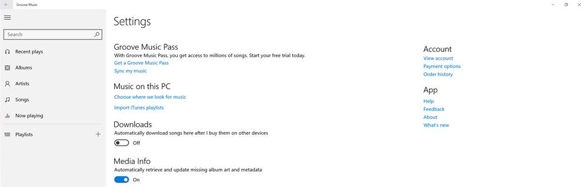

# <a name="launch-feedback-hub-from-your-app"></a>Iniciar el Centro de opiniones desde la aplicación

Puedes animar a los clientes a dejar comentarios agregando un control (como un botón) a la aplicación de la Plataforma universal de Windows (UWP) que inicia el Centro de opiniones. El Centro de opiniones es una aplicación preinstalada que proporciona un único lugar para recopilar comentarios sobre Windows y las aplicaciones instaladas. Todos los comentarios de los clientes sobre la aplicación enviados a través del Centro de opiniones se recopilan y se presentan en el [informe de comentarios](../publish/feedback-report.md), en el panel del Centro de desarrollo de Windows; por lo tanto, puedes ver los problemas, sugerencias y votos a favor que los clientes hayan enviado en un informe.

Para iniciar el Centro de opiniones desde la aplicación, usa una API que se incluya con el [Microsoft Store Services SDK](http://aka.ms/store-em-sdk). Se recomienda usar esta API para iniciar el Centro de opiniones desde un elemento de la interfaz de usuario de tu aplicación que siga nuestras directrices para el diseño.

> [!NOTE]
> El Centro de opiniones solo está disponible en dispositivos que ejecutan la versión 10.0.14271 o posterior de un sistema operativo Windows 10 que se base en [familias de dispositivos](https://msdn.microsoft.com/windows/uwp/get-started/universal-application-platform-guide#device-families) móviles o de escritorio. Te recomendamos que muestres un control de comentarios en la aplicación solo si el Centro de opiniones está disponible en el dispositivo del usuario. El código de este tema muestra cómo hacerlo.

## <a name="how-to-launch-feedback-hub-from-your-app"></a>Cómo iniciar el Centro de opiniones desde la aplicación

Para iniciar el Centro de opiniones desde la aplicación:

1. [Instala Microsoft Store Services SDK](microsoft-store-services-sdk.md#install-the-sdk). Además de la API para iniciar el Centro de opiniones, este SDK también proporciona API para otras características, como ejecutar experimentos en las aplicaciones con pruebas A/B y mostrar anuncios.
2. Abre el proyecto en Visual Studio.
3. En el Explorador de soluciones, haz clic con el botón secundario en el nodo **Referencias** del proyecto y haz clic en **Agregar referencia**.
4. En el cuadro de diálogo **Administrador de referencias**, expande **Windows Universal** y haz clic en **Extensiones**.
5. En la lista de los SDK, haz clic en la casilla junto a **Microsoft Engagement Framework** y haz clic en **Aceptar**.
6. En el proyecto, agrega el control que quieras mostrar a los usuarios para iniciar el Centro de opiniones, como un botón. Te recomendamos que configures el control de la siguiente manera:
  * Establece la fuente del contenido que se muestra en el control de **Segoe MDL2 Assets**.
  * Establece el texto en el control en el código de carácter Unicode hexadecimal E939. Este es el código de carácter para el icono de comentarios recomendados en la fuente **Segoe MDL2 Assets**.
  * Establece la visibilidad del control en oculto.
    > [!NOTE]
    > Te recomendamos que ocultes el control de comentarios y que lo muestres en el código de inicialización solo si el Centro de opiniones está disponible en el dispositivo del usuario. En el paso siguiente se muestra cómo hacerlo.

  El siguiente código muestra la definición XAML de una clase [Button](https://msdn.microsoft.com/library/windows/apps/windows.ui.xaml.controls.button.aspx) que está configurada como se describió anteriormente.

  ```XML
  <Button x:Name="feedbackButton" FontFamily="Segoe MDL2 Assets" Content="&#xE939;" HorizontalAlignment="Left" Margin="138,352,0,0" VerticalAlignment="Top" Visibility="Collapsed"  Click="feedbackButton_Click"/>
  ```

7. En el código de inicialización de la página de la aplicación que hospeda el control de comentarios, usa el método estático [IsSupported](https://msdn.microsoft.com/library/windows/apps/microsoft.services.store.engagement.storeservicesfeedbacklauncher.issupported.aspx) de la clase [StoreServicesFeedbackLauncher](https://msdn.microsoft.com/library/windows/apps/microsoft.services.store.engagement.storeservicesfeedbacklauncher.aspx) para determinar si el Centro de opiniones está disponible en el dispositivo del usuario. El Centro de opiniones solo está disponible en dispositivos que ejecutan la versión 10.0.14271 o posterior de un sistema operativo Windows 10 que se base en [familias de dispositivos](https://msdn.microsoft.com/windows/uwp/get-started/universal-application-platform-guide#device-families) móviles o de escritorio.

  Si esta propiedad devuelve **true**, haz que el control sea visible. El siguiente código muestra cómo hacerlo para una clase [Button](https://msdn.microsoft.com/library/windows/apps/windows.ui.xaml.controls.button.aspx).

  [!code-cs[LaunchFeedback](./code/StoreSDKSamples/cs/FeedbackPage.xaml.cs#ToggleFeedbackVisibility)]

    > [!NOTE]
    > Aunque el Centro de opiniones no es compatible con dispositivos Xbox en este momento, la propiedad **IsSupported** devuelve actualmente **true** en dispositivos Xbox que ejecutan la versión 10.0.14271 o posterior de Windows 10. Este es un problema conocido que se resolverá en una futura versión de Microsoft Store Services SDK.  

8. En el controlador de eventos que se ejecuta cuando el usuario hace clic en el control, obtén un objeto [StoreServicesFeedbackLauncher](https://msdn.microsoft.com/library/windows/apps/microsoft.services.store.engagement.storeservicesfeedbacklauncher.aspx) y llama al método [LaunchAsync](https://msdn.microsoft.com/library/windows/apps/microsoft.services.store.engagement.storeservicesfeedbacklauncher.launchasync.aspx) para iniciar la aplicación Centro de opiniones. Hay dos sobrecargas para este método: una sin parámetros y otra que acepta un diccionario de pares clave y valor que contienen los metadatos que quieres asociar a los comentarios. En el ejemplo siguiente se muestra cómo iniciar el Centro de opiniones en el controlador de eventos [Click](https://msdn.microsoft.com/library/windows/apps/windows.ui.xaml.controls.primitives.buttonbase.click.aspx) para una clase [Button](https://msdn.microsoft.com/library/windows/apps/windows.ui.xaml.controls.button.aspx).

  [!code-cs[LaunchFeedback](./code/StoreSDKSamples/cs/FeedbackPage.xaml.cs#FeedbackButtonClick)]

## <a name="design-recommendations-for-your-feedback-ui"></a>Recomendaciones de diseño para la interfaz de usuario de información

Para iniciar el Centro de opiniones, te recomendamos que agregues un elemento de interfaz de usuario en la aplicación (por ejemplo, un botón) que muestre el siguiente icono de comentarios estándar de la fuente Segoe MDL2 Assets y el código de carácter E939.


También te recomendamos que uses una o varias de las siguientes opciones de ubicación para vincular al Centro de opiniones en la aplicación.
* **Directamente en la barra de la aplicación**. Según la implementación, se recomendará que uses solo el icono o que agregues texto (como se muestra a continuación).

  

* **En la configuración de la aplicación**. Esta es una manera más sutil de proporcionar acceso al Centro de opiniones. En el siguiente ejemplo, el vínculo Comentarios aparece como uno de los vínculos de la aplicación.

  

* **En un control flotante controlado por eventos**. Esto es útil cuando quieres consultar a los clientes sobre una pregunta específica antes de iniciar el Centro de opiniones sobre Windows. Por ejemplo, después de que la aplicación use una característica determinada, es posible que le hagas al cliente una pregunta específica sobre su satisfacción con esa característica. Si el cliente elige responder, la aplicación inicia el Centro de opiniones.


## <a name="related-topics"></a>Temas relacionados

* [Informe de comentarios](../publish/feedback-report.md)
