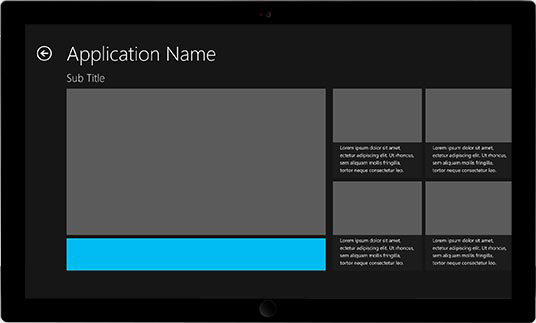

# Tamaños admitidos de anuncios de banner

Los siguientes tamaños de anuncios de banner se admiten para aplicaciones de la plataforma Universal de Windows (UWP). Cuando crees una instancia del objeto **AdControl** en la aplicación, asegúrate de que establecer las propiedades de alto y ancho para que coincida con uno de estos tamaños admitidos.

* 160 x 600
* 300 x 50
* 300 x 250
* 300 x 600
* 320 x 50
* 640 x 100
* 728 x 90

> [!NOTE]
> Para una mejor experiencia, se recomienda usar los siguientes tamaños en dispositivos Windows 10 Mobile: 300 x 50, 320 x 50 y 640 x 100.

La siguiente tabla proporciona ejemplos que muestran cada tamaño de anuncio de banner.

<table>
<colgroup>
<col width="20%" />
<col width="80%" />
</colgroup>
<thead>
<tr class="header">
<th align="left">Tamaño de anuncio</th>
<th align="left">Ejemplo</th>
</tr>
</thead>
<tbody>
<tr class="even">
<td align="left">
160 x 600
</td>
<td align="left"></td>
</tr>
<tr class="even">
<td align="left">
300 x 250
</td>
<td align="left"></td>
</tr>
<tr class="odd">
<td align="left">
300 x 600
</td>
<td align="left"></td>
</tr>
<tr class="odd">
<td align="left">
728 x 90
</td>
<td align="left"></td>
</tr>
<tr class="odd">
<td align="left">
300 x 50
</td>
<td align="left"></td>
</tr>
<tr class="even">
<td align="left">
320 x 50
</td>
<td align="left"></td>
</tr>
<tr class="even">
<td align="left">
640 x 100
</td>
<td align="left"></td>
</tr>
</tbody>
</table>

 

 

 
