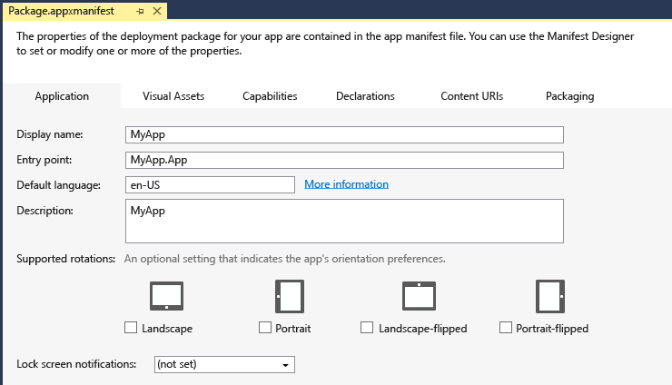

# Empaquetar una aplicación para UWP con Visual Studio

Para vender tu aplicación Plataforma universal de Windows (UWP) o distribuirla a otros usuarios, necesitas empaquetarla. Si no quieres distribuir tu aplicación a través de Microsoft Store, puedes transferir localmente el paquete de la aplicación directamente a un dispositivo o distribuirla a través de [Web Install](installing-UWP-apps-web.md). Este artículo describe el proceso de configuración, creación y prueba de un paquete de la aplicación para UWP con Visual Studio. Para obtener más información sobre cómo administrar e implementar aplicaciones de línea de negocio (LOB), consulta [Administración de aplicaciones de empresa](https://docs.microsoft.com/windows/client-management/mdm/enterprise-app-management).

En Windows 10, puedes enviar un paquete de aplicación, un lote de aplicaciones o un archivo de carga del paquete de aplicación completa al [Centro de partners](https://partner.microsoft.com/dashboard). De estas opciones, enviar un archivo de carga del paquete proporcionará la mejor experiencia. 

## Tipos de paquetes de aplicación

- **Paquete de la aplicación (.appx o .msix)**  
    Un archivo que contiene tu aplicación en un formato que pueda instalarse de prueba en un dispositivo. Cualquier archivo de paquete de aplicación única creado por Visual Studio es **no** está pensado para ser enviado al centro de partners y debe usarse para la instalación de prueba y solo con fines de pruebas. Si quieres enviar la aplicación Centro de partners, usa el archivo de carga del paquete de aplicación.  

- **Recopilación de aplicación (.appxbundle o .msixbundle)**  
    Una recopilación de aplicación es un tipo de paquete que puede contener varios paquetes de aplicación, cada uno de ellos integrado para admitir una arquitectura de dispositivo específica. Por ejemplo, una recopilación de aplicación puede contener tres paquetes de aplicación independientes para las configuraciones x86, x64 y ARM. Las recopilaciones de aplicaciones deberían generarse siempre que sea posible, ya que permiten que tu aplicación esté disponible en la gama de dispositivos más amplia posible.  

- **Archivo de carga de paquete de aplicación (.appxupload)**  
    Un único archivo que puede contener varios paquetes de aplicación o una recopilación de aplicación para admitir distintas arquitecturas de procesador. El archivo de carga también contiene un archivo de símbolos para [analizar el rendimiento de la aplicación](https://docs.microsoft.com/windows/uwp/publish/analytics) tras haber publicado la aplicación en Microsoft Store. Este archivo se creará automáticamente para TI si vas a empaquetar la aplicación con Visual Studio con la intención de enviarla al centro de partners para la publicación. Es importante tener en cuenta que estos son los **solo** válido aplicación Centro de partners envíos de paquetes que se pueden crear con Visual Studio.

A continuación describimos los pasos para preparar y crear un paquete de la aplicación:

1.  [Antes de empaquetar la aplicación](#before-packaging-your-app). Sigue estos pasos para garantizar que la aplicación está lista para empaquetarse para el envío al centro de partners.
2.  [Configura un paquete de la aplicación](#configure-an-app-package). Usa el diseñador de manifiestos de Visual Studio para configurar el paquete. Por ejemplo, agrega imágenes de icono y elige las orientaciones que admitirá la aplicación.
3.  [Crear un archivo de carga del paquete de aplicación](#create-an-app-package-upload-file). Usa el asistente del paquete de aplicación de Visual Studio para crear un paquete de la aplicación y, después, certifica el paquete con el Kit para la certificación de aplicaciones en Windows.
4.  [Transfiere localmente el paquete de la aplicación](#sideload-your-app-package). Después de realizar la instalación de prueba de la aplicación en un dispositivo, puedes probar si funciona de la forma esperada.

Después de completar los pasos anteriores, estás listo para distribuir tu aplicación. Si tienes una aplicación de línea de negocio (LOB) que no tienes previsto vender porque es solo para usuarios internos, puedes instalar esta aplicación para instalarla en cualquier dispositivo Windows 10.

## Antes de empaquetar la aplicación

1.  **Prueba la aplicación.** Antes de empaquetar la aplicación para el envío al centro de partners, asegúrate de que funciona según lo previsto en todas las familias de dispositivos que Planeas admitir. Estas familias de dispositivos pueden incluir los equipos de escritorio, móviles, Surface Hub, Xbox, dispositivos de IoT, etc.
2.  **Optimiza la aplicación.** Puedes usar las herramientas de generación de perfiles y depuración de Visual Studio para optimizar el rendimiento de tu aplicación para UWP. Por ejemplo, la herramienta Línea de tiempo para la capacidad de respuesta de la interfaz de usuario, la herramienta Uso de memoria, la herramienta Uso de CPU, etc. Para obtener más información acerca de estas herramientas de línea de comandos, consulta el tema [Recorrido por las funciones de perfiles](https://docs.microsoft.com/visualstudio/profiling/profiling-feature-tour):
3.  **Comprueba la compatibilidad de .NET nativo (para aplicaciones de VB y C#).** En la Plataforma universal de Windows, hay un compilador nativo que mejorará el rendimiento en tiempo de ejecución de la aplicación. Una vez hecho este cambio, debe probar la aplicación en este entorno de compilación. De manera predeterminada, la configuración de compilación **Release** habilita la cadena de herramientas de .NET nativa, por lo que es importante probar la aplicación con esta configuración **Release** y comprobar que se comporta según lo esperado. Algunos problemas de depuración comunes que pueden producirse con .NET Native se explican con más detalle en [Depuración de aplicaciones universales de .NET Native](http://blogs.msdn.com/b/visualstudioalm/archive/2015/07/29/debugging-net-native-windows-universal-apps.aspx).

## Configurar un paquete de la aplicación

El archivo de manifiesto de la aplicación (Package.appxmanifest.xml) es un archivo XML que contiene las propiedades y la configuración necesarias para crear el paquete de la aplicación. Por ejemplo, las propiedades del archivo de manifiesto de aplicación describen la imagen que se usará como icono de la aplicación y las orientaciones que la aplicación admite cuando el usuario gira el dispositivo.

El diseñador de manifiestos de Visual Studio le permite actualizar el archivo de manifiesto sin modificar el lenguaje XML sin formato del archivo.

**Configurar un paquete con el diseñador de manifiestos**

1.  En el **Explorador de soluciones**, expande el nodo del proyecto de la aplicación para UWP.
2.  Haz doble clic en el archivo **package.appxmanifest**. Si el archivo de manifiesto ya está abierto en la vista de código XML, Visual Studio te pedirá que lo cierres.
3.  Ahora puedes decidir cómo configurar la aplicación. Cada pestaña contiene información que se puede configurar sobre la aplicación y vínculos para obtener más información si es necesario.  
    

    Comprueba que tienes todas las imágenes necesarias para una aplicación para UWP en la pestaña **Activos visuales**.

    En la pestaña **Empaquetado** puedes escribir los datos de publicación. Aquí es donde puedes elegir el certificado que se usará para firmar la aplicación. Todas las aplicaciones para UWP deben estar firmadas con un certificado. 
    
    >[!IMPORTANT]
    >Si publicas tu aplicación en Microsoft Store, la aplicación se firmará con un certificado de confianza para ti. Esto permite al usuario instalar y ejecutar la aplicación sin necesidad de instalar el certificado de firma de la aplicación asociado. 
    
    Si no vas a publicar la aplicación o simplemente quieres instalar un paquete de aplicación de prueba, primero debes indicar que el paquete es de confianza. Para indicar que el paquete es de confianza, el certificado debe instalarse en el dispositivo del usuario. Para obtener más información acerca de la instalación de prueba, consulta [Habilitar el dispositivo para el desarrollo](https://docs.microsoft.com/windows/uwp/get-started/enable-your-device-for-development).

4.  Guarda el archivo **Package.appxmanifest** después de realizar las modificaciones necesarias para la aplicación.

Si distribuyes la aplicación a través de Microsoft Store, Visual Studio puede asociar el paquete con la Store. Cuando asocias tu aplicación, se actualizan automáticamente algunos de los campos en la pestaña Empaquetado del diseñador de manifiestos.

## Crear un archivo de carga del paquete de aplicación

Para distribuir una aplicación a través de Microsoft Store debe crear un paquete de aplicación (.appx o .msix), un lote de aplicaciones (.appxbundle o .msixbundle), o un paquete de carga (.appxupload) y [enviar la aplicación empaquetada al centro de partners](https://docs.microsoft.com/windows/uwp/publish/app-submissions). Aunque es posible enviar un lote de aplicación o paquete de aplicaciones al centro de partners por sí solo, se recomienda enviar un paquete de carga.

>[!NOTE]
> El archivo de carga del paquete de aplicación (.appxupload) es el tipo **solo** del paquete de aplicación válido para el centro de partners que se puede crear con Visual Studio. Otros [paquetes de aplicación válidos pueden crearse manualmente](https://docs.microsoft.com/windows/uwp/packaging/create-app-package-with-makeappx-tool) sin Visual Studio. 

Puedes hacerlo mediante el asistente **Crear paquetes de aplicaciones**. Sigue estos pasos para crear un paquete apropiado para el envío al centro de partners con Visual Studio.

**Para crear tu archivo de carga del paquete de aplicación**

1.  En el **Explorador de soluciones**, abre la solución del proyecto de la aplicación para UWP.
2.  Haz clic con el botón derecho en el proyecto y elige **Tienda**->**Crear paquetes de aplicaciones**. Si esta opción está deshabilitada o no aparece, comprueba que el proyecto sea un proyecto de universal de Windows.  
    

    A continuación, se mostrará el asistente **Crear paquetes de aplicaciones**.

3.  Selecciona "Sí" en el primer cuadro de diálogo que te pregunte si quieres compilar paquetes para cargarlos en el centro de partners y luego haz clic en siguiente.  
    

    Si eliges No, Visual Studio no generará el archivo de carga (.appxupload) del paquete de aplicación para envíos del centro de partners. Si solo quieres realizar la instalación de prueba de la aplicación para ejecutarla en dispositivos internos o para pruebas, puedes seleccionar esta opción. Para obtener más información acerca de la instalación de prueba, consulta [Habilitar el dispositivo para el desarrollo](https://docs.microsoft.com/windows/uwp/get-started/enable-your-device-for-development).
4.  Inicia sesión con tu cuenta de desarrollador en el centro de partners. Si aún no tienes una cuenta de desarrollador, el asistente te ayudará a crear una.
5.  Selecciona el nombre de la aplicación para el paquete o reserva uno nuevo si todavía no lo has hecho en el centro de partners.  
    
6.  Asegúrate de seleccionar las tres configuraciones de arquitectura (x86, x64 y ARM) en el diálogo **Seleccionar y configurar paquetes** para garantizar que tu aplicación se puede implementar en la gama de dispositivos más amplia. En el cuadro de lista **Crear lote de aplicaciones**, selecciona **Siempre**. Un lote de aplicaciones (.appxbundle) se prefiere un archivo de paquete de aplicación única porque contiene una colección de paquetes de aplicación configurados para cada tipo de arquitectura de procesador. Cuando eliges generar la recopilación de aplicación, esta se incluirá en el archivo de carga (.appxupload) del paquete final junto con la información de depuración a análisis de bloqueo. Si no estás seguro de qué arquitecturas elegir o quieres obtener más información sobre qué arquitecturas se usan en varios dispositivos, consulta [Arquitecturas de paquete de aplicación](https://docs.microsoft.com/windows/uwp/packaging/device-architecture).  
    

7.  Incluir archivos de símbolos PDB completos para [analizar el rendimiento de aplicación](https://docs.microsoft.com/windows/uwp/publish/analytics) del centro de partners se haya publicado la aplicación. Configura detalles adicionales, como la numeración de la versión o la ubicación de salida del paquete.
9.  Haz clic en **Crear** para generar el paquete de aplicación. Si ha seleccionado **Sí** en el paso 3 y estás creando un paquete para el envío al centro de partners, el asistente creará un archivo de carga (.appxupload) del paquete. Si has seleccionado **No** en el paso 3, el asistente creará un único paquete de aplicación o una recopilación de aplicación en función de tus selecciones en el paso 6.
10. Cuando la aplicación se haya empaquetado correctamente, verás este cuadro de diálogo.  
    

    Valida la aplicación antes de enviarla al centro de partners para la certificación en un equipo local o remoto. Solo se pueden validar las compilaciones de versiones del paquete de la aplicación, no las compilaciones de depuración.

11. Para validar localmente tu aplicación, deja la opción **Máquina local** seleccionada y haz clic en **Iniciar el Kit para la certificación de aplicaciones en Windows**. Para obtener más información sobre la prueba de la aplicación con el Kit para la certificación de hardware en Windows, consulta [Kit para la certificación de aplicaciones en Windows](https://msdn.microsoft.com/library/windows/apps/Mt186449).

    El Kit para la certificación de aplicaciones en Windows realiza diversas pruebas y devuelve los resultados. Consulta [Pruebas del Kit para la certificación de aplicaciones en Windows](https://msdn.microsoft.com/library/windows/apps/mt186450) para obtener información más especifica.

    Si tienes un dispositivo remoto de Windows 10 que quieres usar para las pruebas, tendrás que instalar el Kit de certificación de aplicaciones de Windows de forma manual en ese dispositivo. La siguiente sección te guiará a través de estos pasos. Después de realizar estos pasos, puedes seleccionar **Máquina remota** y hacer clic en **Iniciar el Kit para la certificación de aplicaciones en Windows** para conectarte al dispositivo remoto y ejecutar las pruebas de validación.

12. Después de herramienta WACK haya terminado y la aplicación haya pasado la certificación, estás listo para enviar la aplicación Centro de partners. Asegúrate de cargar el archivo correcto. La ubicación predeterminada del archivo puedes encontrarlo en la carpeta raíz de la solución `\[AppName]\AppPackages` y terminará con la extensión de archivo .appxupload. El nombre tendrá el formato `[AppName]_[AppVersion]_x86_x64_arm_bundle.appxupload` si has optado por una recopilación de aplicación con toda la arquitectura del paquete seleccionada.

Para obtener más información sobre el envío de la aplicación al centro de partners, consulta [envíos de aplicaciones](https://docs.microsoft.com/windows/uwp/publish/app-submissions).

**Validar el paquete de la aplicación en un dispositivo remoto de Windows 10**

1.  Habilitar el dispositivo de Windows 10 para el desarrollo siguiendo las instrucciones para [Habilitar el dispositivo para el desarrollo](https://msdn.microsoft.com/library/windows/apps/Dn706236) .
    **Importante**no puedes validar el paquete de la aplicación en un dispositivo remoto de ARM para Windows 10.
2.  Descarga e instala las herramientas remotas para Visual Studio. Estas herramientas se usan para ejecutar el Kit para la certificación de aplicaciones en Windows de forma remota. Para obtener más información acerca de estas herramientas, incluida la ubicación para descargarlas, visita [Ejecutar aplicaciones para UWP en un equipo remoto](https://msdn.microsoft.com/library/hh441469.aspx#BKMK_Starting_the_Remote_Debugger_Monitor).
3.  Descargar el [Kit de certificación de aplicaciones de Windows](http://go.microsoft.com/fwlink/p/?LinkID=309666) necesarios y, a continuación, se instala en el dispositivo remoto de Windows 10.
4.  En la página **Creación del paquete completada** del asistente, elige el botón de opción **Máquina remota** y, a continuación, el botón de puntos suspensivos que se encuentra junto al botón **Probar conexión**.
    **Nota**el botón de opción del **Equipo remoto** está disponible únicamente si seleccionaste al menos una configuración de solución que admita la validación. Para obtener más información sobre la prueba de la aplicación con el WACK, consulta [Kit para la certificación de aplicaciones en Windows](https://msdn.microsoft.com/library/windows/apps/Mt186449).
5.  Especifica un tipo de dispositivo de la subred, o proporciona el nombre del servidor de nombres de dominio (DNS) o la dirección IP de un dispositivo que esté fuera de la subred.
6.  En la lista **Modo de autenticación**, elige **Ninguno** si el dispositivo no requiere que inicies sesión con las credenciales de Windows.
7.  Elige el botón **Seleccionar** y el botón **Iniciar el Kit para la certificación de aplicaciones en Windows**. Si se ejecutan herramientas remotas en este dispositivo, Visual Studio se conecta a al dispositivo y realiza las pruebas de validación. Consulta [Pruebas del Kit para la certificación de aplicaciones en Windows](https://msdn.microsoft.com/library/windows/apps/mt186450).

## Realizar la instalación de prueba del paquete de la aplicación

Introducidos en la Actualización de aniversario de Windows 10, los paquetes de la aplicación se pueden instalar simplemente haciendo doble clic en el archivo de paquete de la aplicación. Para usarlo, ve a tu paquete de la aplicación o el archivo de recopilación de aplicación y haz doble clic en él. El instalador de aplicaciones se inicia y proporciona la información de la aplicación básica, así como un botón de instalación, barra de progreso de instalación y los mensajes de error pertinentes. 

> [!NOTE]
> El instalador de aplicación da por hecho que el dispositivo confía en la aplicación. Si estás realizando la instalación de prueba de una aplicación de desarrollador o empresarial, tendrás que instalar el certificado de firma en el almacén de Entidades de certificación raíz de personas de confianza o editores de confianza en el dispositivo. Si no estás seguro de cómo hacerlo, consulta [Instalar certificados de prueba](https://docs.microsoft.com/windows-hardware/drivers/install/installing-test-certificates).

### Transferir localmente la aplicación en versiones anteriores de Windows
Con los paquetes de aplicación para UWP, las aplicaciones no se instalan en un dispositivo ya que están con aplicaciones de escritorio. Por lo general, descargas aplicaciones para UWP desde Microsoft Store, que también instala la aplicación en el dispositivo para ti. Las aplicaciones se pueden instalar sin publicarlas en la Store (instalación de prueba). Esto te permite instalar y aplicaciones de prueba con el paquete de la aplicación de archivos que haya creado. Si tienes una aplicación que no quieres vender en la Store, como una aplicación de línea de negocio (LOB), puedes realizar la instalación de prueba de dicha aplicación para que otros usuarios de la empresa pueden usarla.

La siguiente lista proporciona los requisitos para la instalación de prueba de la aplicación.

-   Debes [habilitar el dispositivo para el desarrollo](https://msdn.microsoft.com/library/windows/apps/Dn706236).
-   Para transferir localmente la aplicación en un dispositivo Windows 10 Mobile, usa la herramienta [WinAppDeployCmd.exe](install-universal-windows-apps-with-the-winappdeploycmd-tool.md) .

**Realizar la instalación de prueba de una aplicación en un equipo de escritorio, un portátil o una tableta**

1.  Copia las carpetas de la versión de la aplicación que deseas instalar en el dispositivo de destino.

    Si ya has creado un lote de aplicaciones, tendrás una carpeta basada en el número de versión y una carpeta `*_Test`. Aquí tienes un ejemplo de estas dos carpetas (donde la versión que se va a instalar es 1.0.2.0):

    -   `C:\Projects\MyApp\MyApp\AppPackages\MyApp_1.0.2.0`
    -   `C:\Projects\MyApp\MyApp\AppPackages\MyApp_1.0.2.0_Test`

    Si no tienes un lote de aplicaciones, copia la carpeta de la arquitectura correcta y su carpeta `*_Test` correspondiente. Estas dos carpetas son un ejemplo de un paquete de la aplicación con la arquitectura x64 y su carpeta `*_Test`:

    -   `C:\Projects\MyApp\MyApp\AppPackages\MyApp_1.0.2.0_x64`
    -   `C:\Projects\MyApp\MyApp\AppPackages\MyApp_1.0.2.0_x64_Test`

2.  En el dispositivo de destino, abre la carpeta `*_Test`.
3.  Haz clic con el botón derecho en el archivo **Add-AppDevPackage.ps1**. Elige **Ejecutar con PowerShell** y sigue las instrucciones.  
    

    Después de instalar el paquete de la aplicación, la ventana de PowerShell muestra este mensaje: **La aplicación se instaló correctamente**.

    **Sugerencia**: para abrir el menú contextual en una tableta, toca la pantalla donde quieras con el botón derecho, sostén hasta que se muestre un círculo completo y después levanta el dedo. El menú contextual se abre después de levantar el dedo.
4.  Haz clic en el botón Inicio para buscar la aplicación por nombre y luego, iníciala.
