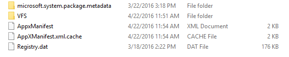
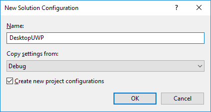

# Implementa y depura tu aplicación para UWP convertida (Proyecto Centennial)

\[Parte de la información hace referencia a la versión preliminar del producto, el cual puede sufrir importantes modificaciones antes de que se publique la versión comercial. Microsoft no ofrece ninguna garantía, expresa o implícita, con respecto a la información que se ofrece aquí.\]

Este tema contiene información para ayudarte a implementar correctamente y a depurar la aplicación después de convertirla. Además, si tienes curiosidad sobre algunos de los aspectos internos de las extensiones de conversión de escritorio, entonces este tema es para ti.

## Depurar la aplicación para UWP convertida

Tienes dos opciones principales para depurar la aplicación convertida mediante Visual Studio.

### Asociar al proceso

Cuando se está ejecutando Microsoft Visual Studio "como administrador", los comandos __Iniciar depuración__ e __Iniciar sin depurar__ funcionarán para el proyecto de la aplicación convertida, pero la aplicación iniciada se ejecutará en un [nivel de integridad media](https://msdn.microsoft.com/library/bb625963). Es decir, _no_ tendrá privilegios elevados. Para otorgar privilegios de administrador a la aplicación iniciada, primero tienes que iniciar "como administrador" a través de un acceso directo o un icono. Una vez que la aplicación se ejecute desde una instancia de Microsoft Visual Studio "como administrador", invoca __Asociar al proceso__ y selecciona el proceso de la aplicación en el cuadro de diálogo.

### Depuración con F5

Visual Studio admite ahora un nuevo proyecto de empaquetado que te permite copiar automáticamente las actualizaciones que haces al compilar la aplicación en el paquete AppX creado al ejecutar el convertidor en el instalador de la aplicación. Una vez que configures el proyecto de empaquetado ahora también puedes usar F5 para depurar directamente en el paquete AppX. 

Puedes empezar de este modo: 

1. Primero, asegúrate de que estás preparado para usar Centennial. Para obtener instrucciones, consulta [Vista previa de Desktop App Converter (Proyecto Centennial)](https://msdn.microsoft.com/windows/uwp/porting/desktop-to-uwp-run-desktop-app-converter). 

2. Ejecuta el convertidor y, a continuación, el instalador de la aplicación de Win32. El convertidor captura el diseño y los cambios realizados en el registro y produce un Appx con manifiesto y registery.dat para virtualizar el registro:



3. Instalar e iniciar [Visual Studio "15" Preview 2](https://www.visualstudio.com/downloads/visual-studio-next-downloads-vs.aspx). 

4. Instalar el proyecto VSIX de empaquetado de escritorio a UWP desde la [Galería de Visual Studio](http://go.microsoft.com/fwlink/?LinkId=797871). 

5. Abre la solución de Win32 correspondiente que se convirtió en Visual Studio.
 
6. Agrega el nuevo proyecto de empaquetado a la solución haciendo clic en la solución y eligiendo "Agregar nuevo proyecto". A continuación, elige el proyecto de empaquetado de escritorio a UWP en Instalación e implementación:

    

    El proyecto resultante se agregará a la solución:

    

    En el proyecto de empaquetado, AppXFileList proporciona una asignación de archivos en el diseño de AppX. Las referencias están vacías al principio, pero se deben establecer manualmente en el proyecto .exe para la ordenación de la compilación. 

7. El proyecto DesktopToUWPPackaging tiene una página de propiedades que te permite configurar la raíz del paquete AppX y qué icono ejecutar:

    

    Establece PackageLayout en la ubicación raíz de la AppX que creó el convertidor (arriba). A continuación, elige qué icono ejecutar.

8.  Abre y edita AppXFileList.xml. Este archivo define cómo copiar el resultado de la compilación de depuración de Win32 en el diseño de AppX que el convertidor compiló. De manera predeterminada, tenemos un marcador de posición en el archivo con una etiqueta y comentario de ejemplo:

    ```XML
    <?xml version="1.0" encoding="utf-8"?>
    <Project ToolsVersion="4.0" xmlns="http://schemas.microsoft.com/developer/msbuild/2003">
      <ItemGroup>
    <!— Use the following syntax to copy debug output to the AppX layout
       <AppxPackagedFile Include="$(outdir)\App.exe">
          <PackagePath>App.exe</PackagePath>
        </AppxPackagedFile> 
        See http://etc...
    -->
      </ItemGroup>
    </Project>
    ```

    A continuación, te mostramos un ejemplo de cómo crear la asignación. En este caso, copiaremos el .exe y el .dll de la ubicación de la compilación de Win32 en la ubicación del diseño del paquete. 

    ```XML
    <?xml version="1.0" encoding=utf-8"?>
    <Project ToolsVersion=14.0" xmlns="http://scehmas.microsoft.com/developer/msbuild/2003">
        <PropertyGroup>
            <MyProjectOutputPath>C:\{path}</MyProjectOutputPath>
        </PropertyGroup>
        <ItemGroup>
            <LayoutFile Include="$(MyProjectOutputPath)\ProjectTracker.exe">
                <PackagePath>$(PackageLayout)\VFS\Program Files (x86)\Contoso Software\Project Tracker\ProjectTracker.exe</PackagePath>
            </LayoutFile>
            <LayoutFile Include="$(MyProjectOutputPath)\ProjectTracker.Models.dll">
                <PackagePath>$(PackageLayout)\VFS\Program Files (x86)\Contoso Software\Project Tracker\ProjectTracker.Models.dll</PackagePath>
            </LayoutFile>
        </ItemGroup>
    </Project>
    ```

    El archivo se define del siguiente modo: 

    En primer lugar, definimos *MyProjectOutputPath* para que señale a la ubicación donde se compilará el proyecto de Win32:

    ```XML
    <?xml version="1.0" encoding="utf-8"?>
    <Project ToolsVersion="14.0" xmlns="http://schemas.microsoft.com/developer/msbuild/2003">
        <PropertyGroup>
            <MyProjectOutputPath>C:\Users\peterfar\Desktop\ProjectTracker\ProjectTracker\bin\DesktopUWP</MyProjectOutputPath>
        </PropertyGroup>
    ```

    A continuación, cada *LayoutFile* especifica un archivo para copiar desde la ubicación de la compilación de Win32 en el diseño del paquete Appx. En este caso, se copian primero un .exe y, luego, un .dll. 

    ```XML
        <ItemGroup>
            <LayoutFile Include="$(MyProjectOutputPath)\ProjectTracker.exe">
                <PackagePath>$(PackageLayout)\VFS\Program Files (x86)\Contoso Software\Project Tracker\ProjectTracker.exe</PackagePath>
            </LayoutFile>
            <LayoutFile Include="$(MyProjectOutputPath)\ProjectTracker.Models.dll">
                <PackagePath>$(PackageLayout)\VFS\Program Files (x86)\Contoso Software\Project Tracker\ProjectTracker.Models.dll</PackagePath>
            </LayoutFile>
        </ItemGroup>
    </Project>
    ```

9. Establece el proyecto de empaquetado como proyecto de inicio. De este modo se copian los archivos de Win32 en la AppX y, a continuación, se inicia el depurador cuando el proyecto se genera y se ejecuta.  

    

10. Por último, ahora puedes establecer un punto de interrupción en el código de Win32 y presionar la tecla F5 para iniciar el depurador. Copiará las actualizaciones que realizaste en tu aplicación de Win32 en el paquete AppX y te permitirá depurar directamente desde dentro de Visual Studio.

11. Si actualizas tu aplicación, necesitarás usar MakeAppX para volver a empaquetar la aplicación. Para obtener más información, consulta [App packager (MakeAppx.exe) (Empaquetador de aplicaciones [MakeAppx.exe])](https://msdn.microsoft.com/library/windows/desktop/hh446767(v=vs.85).aspx). 

Si tienes varias configuraciones de compilación (por ejemplo, para lanzamiento y depuración), puedes agregar lo siguiente al archivo AppXFileList.xml para copiar la compilación de Win32 desde distintas ubicaciones:

```XML
<PropertyGroup>
    <MyProjectOutputPath Condition="$(Configuration) == 'DesktopUWP'">C:\Users\peterfar\Desktop\ProjectTracker\ProjectTracker\bin\DesktopUWP>
    </MyProjectOutputPath>
    <MyProjectOutputPath Condition="$(Configuration) == 'ReleaseDesktopUWP'"> C:\Users\peterfar\Desktop\ProjectTracker\ProjectTracker\bin\ReleaseDesktopUWP</MyProjectOutputPath>
</PropertyGroup>
```

También puedes usar la compilación condicional para habilitar rutas de código en particular si actualizas tu aplicación para UWP pero sigues queriendo compilarla para Win32. 

1.  En el ejemplo siguiente, el código se compilará solo para DesktopUWP y mostrará un icono con la API de WinRT. 

    ```C#
    [Conditional("DesktopUWP")]
    private void showtile()
    {
        XmlDocument tileXml = TileUpdateManager.GetTemplateContent(TileTemplateType.TileSquare150x150Text01);
        XmlNodeList textNodes = tileXml.GetElementsByTagName("text");
        textNodes[0].InnerText = string.Format("Welcome to DesktopUWP!");
        TileNotification tileNotification = new TileNotification(tileXml);
        TileUpdateManager.CreateTileUpdaterForApplication().Update(tileNotification);
    }
    ```

2.  Puedes usar Configuration Manager para agregar la nueva configuración de compilación:

    

    

3.  A continuación, en las propiedades del proyecto, agrega compatibilidad con símbolos de compilación condicional:

    

4.  Ahora puedes alternar el destino de compilación a DesktopUWP si quieres que la compilación se dirija a la API de UWP que agregaste.

## Implementa la aplicación para UWP convertida

Para implementar la aplicación durante el desarrollo, ejecuta el siguiente cmdlet de PowerShell: 

```Add-AppxPackage –Register AppxManifest.xml```

Para actualizar los archivos .exe o .dll de la aplicación, simplemente reemplaza los archivos existentes en el paquete con los nuevos, aumenta el número de versión en AppxManifest.xml y, a continuación, vuelve a ejecutar el comando anterior.

Ten en cuenta esto: 

Cualquier unidad en la que instales la aplicación convertida debe tener el formato NTFS.

Una aplicación convertida se ejecuta siempre como el usuario interactivo. Esto tiene particular importancia para una aplicación de .NET cuyo manifiesto especifica un nivel de ejecución de __requireAdministrator__. Si el usuario interactivo tiene privilegios de administrador, se mostrará un símbolo del sistema del UAC _cada vez que la aplicación se inicie_. La aplicación no podrá iniciarse para los usuarios estándar.

Si intentas ejecutar el cmdlet Add-AppxPackage en un equipo en el que no importaste el certificado que creaste, obtendrás un error.

Antes de implementar la aplicación, debes iniciar sesión con un certificado. Para obtener información sobre cómo crear un certificado, consulta [Firma el paquete .Appx](https://msdn.microsoft.com/windows/uwp/porting/desktop-to-uwp-run-desktop-app-converter#deploy-your-converted-appx). 

Aquí se explica cómo importar un certificado que creaste anteriormente. Puedes instalarlo directamente o puedes instalarlo desde un appx que hayas firmado, como hará el cliente.
1.  En el Explorador de archivos, haz clic en un appx que hayas firmado con un certificado de prueba y elige **Propiedades** en el menú contextual.
2.  Haz clic o pulsa la pestaña **Firmas digitales**.
3.  Haz clic o pulsa en el certificado y elige **Detalles**.
4.  Haz clic o pulsa **Ver certificado**.
5.  Haz clic o pulsa **Instalar certificado**.
6.  En el grupo **Ubicación del almacén**, selecciona **Equipo local**.
7.  Haz clic o pulsa **Siguiente** y **Aceptar** para confirmar el cuadro de diálogo de UAC.
8.  En la siguiente pantalla del Asistente para importación de certificados, cambia la opción seleccionada a **Colocar todos los certificados en el siguiente almacén**.
9.  Haz clic o pulsa **Examinar**. En la ventana Seleccionar almacén de certificados, desplázate hacia abajo y selecciona **Personas de confianza** y, por último, haz clic o pulsa **Aceptar**.
10. Haz clic o pulsa **Siguiente**. Aparece una nueva pantalla. Haz clic o pulsa **Finalizar**.
11. Debería aparecer un cuadro de diálogo de confirmación. Si es así, haz clic en **Aceptar**. Si aparece otro cuadro de diálogo en el que se indica que hay un problema con el certificado, tendrás que solucionarlo.

Para que Windows confíe en el certificado, el certificado debe estar ubicado en el nodo **Certificados (equipo local) > Entidades de certificación raíz de confianza > Certificados** o en el nodo **Certificados (equipo local) > Personas de confianza > Certificados**. Solo los certificados de estas dos ubicaciones pueden validar certificados de confianza en el contexto del equipo local. De lo contrario, aparece un mensaje de error similar a la siguiente cadena:
```CMD
"Add-AppxPackage : Deployment failed with HRESULT: 0x800B0109, A certificate chain processed,
but terminated in a rootcertificate which is not trusted by the trust provider.
(Exception from HRESULT: 0x800B0109) error 0x800B0109: The root certificate of the signature
in the app package must be trusted."
```

### En segundo plano

Al ejecutar una aplicación convertida, el paquete de la aplicación para UWP se inicia desde \Archivos de programa\WindowsApps\\&lt;_nombre del paquete_&gt;\\&lt;_nombre de la aplicación_&gt;.exe. Si buscas allí, verás que tu aplicación tiene un manifiesto del paquete de la aplicación (denominado AppxManifest.xml), que hace referencia a un espacio de nombres XML especial que se usa para aplicaciones convertidas. Dentro de ese archivo de manifiesto hay un elemento __&lt;EntryPoint&gt;__, que hace referencia a una aplicación de plena confianza. Cuando se inicia la aplicación, no se ejecuta dentro de un contenedor de aplicación, sino que, en su lugar, se ejecuta como el usuario con normalidad.

Pero la aplicación se ejecuta en un entorno especial donde se redirigen los accesos que la aplicación permite en el sistema de archivos y en el registro. El archivo llamado Registry.dat se usa para el redireccionamiento del registro. Es realmente un subárbol del Registro, para que puedas verlo en el Editor del Registro de Windows (Regedit). Ten en cuenta que este mecanismo significa que no se puede usar el registro para la comunicación entre procesos. El registro no se diseñó para ese procedimiento y no es adecuado para este en ningún caso. En cuanto al sistema de archivos, lo único que se redirige es la carpeta AppData, y se redirige a la misma ubicación en la que se almacenan los datos de la aplicación para todas las aplicaciones para UWP. Esta ubicación se conoce como el almacén de datos locales de la aplicación y puedes acceder a ella mediante la propiedad [ApplicationData.LocalFolder](https://msdn.microsoft.com/library/windows/apps/br241621). De esta forma, el código ya está migrado para leer y escribir datos de la aplicación en el lugar correcto, sin que hagas nada. Y también puedes escribir allí directamente. Una ventaja de la redirección del sistema de archivos es una experiencia de desinstalación más limpia.

Dentro de una carpeta denominada VFS, se muestran las carpetas que contienen los archivos DLL en los que la aplicación tiene dependencias. Estos archivos DLL se instalan en carpetas del sistema para la versión de escritorio clásica de la aplicación. Sin embargo, como aplicación para UWP, los archivos DLL son locales en la aplicación. De esta forma, no existen problemas de versión cuando se instalan y desinstalan aplicaciones para UWP.

## Consulta también
[Convertir la aplicación de escritorio en una aplicación para la Plataforma universal de Windows (UWP)](https://msdn.microsoft.com/windows/uwp/porting/desktop-to-uwp-root)

[Vista previa de Desktop App Converter (Project Centennial)](https://msdn.microsoft.com/windows/uwp/porting/desktop-to-uwp-run-desktop-app-converter)

[Convertir manualmente la aplicación de escritorio de Windows en una aplicación para la Plataforma universal de Windows (UWP)](https://msdn.microsoft.com/windows/uwp/porting/desktop-to-uwp-manual-conversion)

[Puente de la aplicación de escritorio a ejemplos de código de UWP en GitHub](https://github.com/Microsoft/DesktopBridgeToUWP-Samples)


<!--HONumber=Jul16_HO2-->


