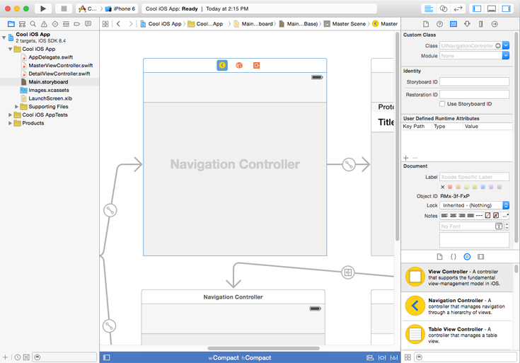
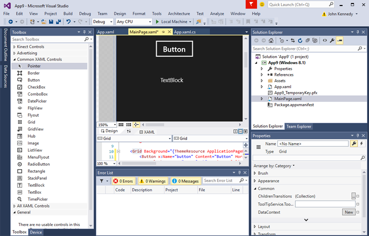
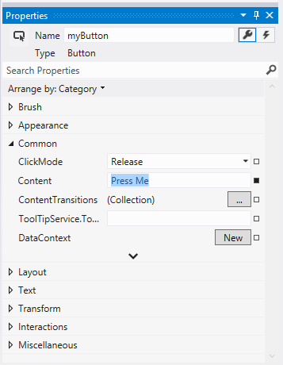
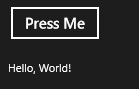

# <a name="getting-started-getting-around-in-visual-studio"></a>Tareas iniciales: desplazamiento por Visual Studio


## <a name="getting-around-in-microsoft-visual-studio"></a>Desplazamiento por MicrosoftVisual Studio

Volvamos al proyecto que creamos antes: te mostraremos cómo desplazarte por el entorno de desarrollo integrado (IDE) Microsoft de Visual Studio.

Si eres desarrollador de Xcode, deberías estar familiarizado con la vista predeterminada, donde los archivos de origen aparecen en el panel izquierdo, el editor (de la interfaz de usuario o el código fuente) en el panel central y los controles y sus propiedades en el panel derecho.



MicrosoftVisual Studio es muy similar, aunque la vista predeterminada tiene los controles en el lado izquierdo del **cuadro de herramientas**. Los archivos de origen están en el **Explorador de soluciones** en el lado derecho y las propiedades están en **Propiedades**, en el panel **Explorador de soluciones**, de este modo:


Si todo esto te suena extraño, te alegrará saber que puedes reorganizar los paneles de Visual Studio para colocar los archivos de origen a la izquierda de la pantalla y el cuadro de herramientas a la derecha. De hecho, puedes hacer clic y arrastrar la barra de título de cualquier panel para cambiar su posición, y Visual Studio mostrará un cuadro sombreado para indicarte dónde se acoplará una vez que lo sueltes. Muchos paneles también tienen un pequeño icono de chincheta en su barra de título. Esto te permite anclar el panel en su posición actual para fijarlo. Si desanclas el panel, puedes contraerlo para ahorrar espacio: útil si tienes un monitor pequeño. Y si te lías (no te preocupes, a todos nos ha pasado alguna vez), selecciona **Restablecer diseño de ventana** desde el menú **Ventana** para restaurar el orden.

## <a name="adding-controls-setting-their-properties-and-responding-to-events"></a>Adición de controles, configuración de sus propiedades y respuesta a eventos

Ahora agregaremos algunos controles al proyecto. Después cambiaremos algunas de las propiedades y escribiremos código para responder a uno de los eventos del control.

Para agregar controles en Xcode, debes abrir el archivo .xib o el guión gráfico que quieras usar y después arrastrar y soltar los controles, por ejemplo, un **botón RoundRect** o una **Etiqueta**, como se muestra a continuación.


Hagamos algo parecido en Visual Studio. En el **Cuadro de herramientas**, arrastra el control **Button** y después suéltalo en la superficie de diseño del archivo MainPage.xaml.

Haz lo mismo con el control **TextBlock**, de modo que se muestre así:



A diferencia de Xcode, que oculta la información de diseño y enlace en un archivo .xib o de guión gráfico, Visual Studio te anima a modificar los archivos XAML donde se guarda esta información en su lenguaje enriquecido, modificable y declarativo de estilo XML. Para obtener más información sobre el lenguaje XAML, consulta [Introducción a XAML](https://msdn.microsoft.com/library/windows/apps/mt185595). Por ahora, todo lo que se muestra en el panel **Diseño** se define en el panel **XAML**. El panel **XAML** permite tener un control preciso cuando es necesario y, a medida que vayas acumulando conocimientos sobre este lenguaje, podrás desarrollar código de interfaz de usuario manualmente más rápido. No obstante, de momento solo nos centraremos en los paneles **Diseño** y **Propiedades**.

Vamos a cambiar los detalles del botón. Como ya sabrás, para cambiar el nombre del botón en Xcode, puedes cambiar el valor del campo **Título** en el panel de propiedades.

Al usar Visual Studio, se hace algo muy similar. En el panel **Diseño**, pulsa el botón para que reciba el foco. A continuación, en el panel **Propiedades**, cambia el valor de **Contenido** de "Button" a "Púlsame". A continuación, actualiza el nombre del control de botón cambiando el valor **Nombre** de "&lt;Sin nombre&gt;" a "myButton", como se muestra aquí:



Ahora, vamos a escribir código para cambiar el contenido del control **TextBlock** por "Hola a todos" después de que el usuario pulse el botón.

En Xcode, para asociar un evento con un control, hay que escribir código y luego asociarlo con el control, normalmente manteniendo pulsado Control y arrastrando el botón al código fuente, del siguiente modo:


```swift
// Swift implementation.

@IBAction func buttonPressed(sender: UIButton) {
    
}
```

Visual Studio es similar. En la esquina superior derecha de **Propiedades** hay un botón con el icono de un rayo. Aquí es donde se enumeran los posibles eventos asociados al control seleccionado, del siguiente modo:


Para agregar código para el evento de clic del botón, primero selecciona el botón en el panel **Diseño**. A continuación, haz clic en el botón del rayo y haz doble clic en el cuadro vacío situado junto al nombre **Click**. Visual Studio agrega el evento "myButton\_Click" al cuadro **Click** y después agrega y muestra el controlador de eventos correspondiente en el archivo MainPage.xaml.cs, como se indica a continuación.

```csharp
private void myButton_Click(object sender, RoutedEventArgs e)
{

}
```

Conectemos ahora el control **TextBlock**. En Xcode, puedes presionar Control y arrastrar el botón al archivo de código fuente para asociar el control con su definición, de este modo.


```swift
// Swift implentation.

@IBOutlet weak var myLabel : UILabel
```

En Visual Studio, no necesitas asociar el control, ya que esto se hace automáticamente. No obstante, vamos a cambiar algunas de las propiedades:

1.  Pulsa en la pestaña del archivo MainPage.xaml.
2.  En el panel **Diseño**, pulsa en el control **TextBlock**.
3.  En el panel **Propiedades**, pulsa en el botón de llave inglesa para mostrar sus propiedades.
4.  En el cuadro **Nombre**, cambia "&lt;Sin nombre&gt;" a "miEtiqueta".


A continuación, agregaremos código al evento Click del botón. Para ello, pulsa en el archivo MainPage.xaml.cs y agrega el código siguiente al controlador de eventos myButton\_Click.

```csharp
private void myButton_Click(object sender, RoutedEventArgs e)
{
    // Add the following line of code.    
    myLabel.Text = "Hello, World!";
}
```

Esto es similar a lo que escribirías en Swift:

```swift
@IBAction func buttonPressed(sender: UIButton) {
    myLabel.text = "Hello, World!"
}
```

Por último, para ejecutar la aplicación, selecciona el menú **Depurar** y después selecciona **Iniciar depuración** (o presiona F5). Tras iniciar la aplicación, haz clic en el botón "Púlsame" y verás cómo el contenido de la etiqueta cambia de "TextBlock" a "Hola a todos", como se muestra en la siguiente ilustración.



Para salir de la aplicación, vuelve a VisualStudio, pulsa el menú **Depurar** y después pulsa **Detener depuración** (o presiona Mayús+F5). Ten en cuenta que Visual Studio te permite probar la aplicación en muchos dispositivos diferentes para comprobar cómo funcionará en cada uno.

## <a name="next-step"></a>Paso siguiente

[Introducción: controles habituales](getting-started-common-controls.md)

