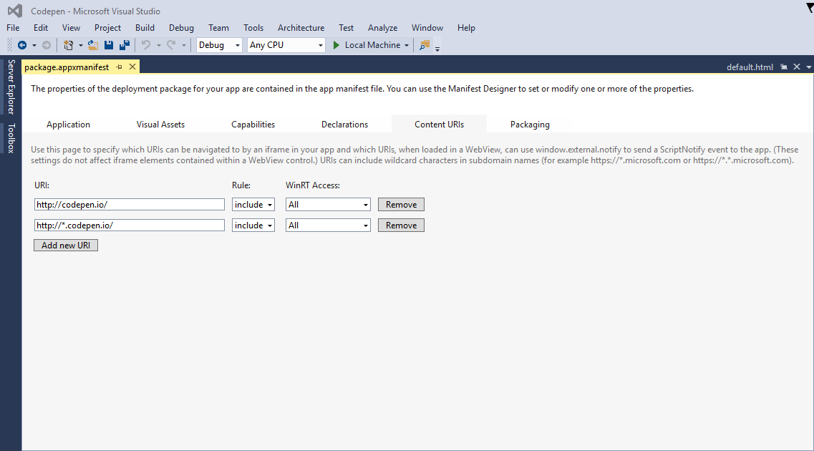

# Convertir tu aplicación web en una aplicación para la Plataforma universal de Windows (UWP)

Aprende cómo crear rápidamente una aplicación para la Plataforma universal de Windows (UWP) para Windows10 empezando con solo la dirección URL de un sitio web. 

> [!NOTE]
> Las siguientes instrucciones son para su uso con una plataforma de desarrollo Windows. Si eres usuario de Mac, visita [instrucciones sobre el uso de una plataforma de desarrollo de Mac](/hwa-create-mac.md).

## Qué necesitas para desarrollar en Windows

- [Visual Studio2015.](https://www.visualstudio.com/) Visual Studio Community2015 incluye las herramientas para desarrolladores de Windows10, plantillas de aplicaciones universales, un editor de código, un depurador de enorme eficacia, emuladores de Windows Moble, un amplio soporte de lenguaje y mucho más; todo ello es gratuito y está dotado de todas las características necesarias para su uso directo en la producción.
- (Opcional) [SDK independiente de Windows para Windows10.](https://dev.windows.com/downloads/windows-10-sdk) Si estás usando un entorno de desarrollo distinto a Visual Studio2015, puedes descargar un instalador de Windows SDK para Windows10 independiente. Ten en cuenta que no es necesario instalar este SDK si usas Visual Studio2015, porque ya está incluido.

## Paso 1: Seleccionar la dirección URL de un sitio web
Elige un sitio web existente que funcione perfectamente como una aplicación de una sola página. Es muy recomendable que seas el propietario o el desarrollador del sitio, de este modo, podrás realizar todos los cambios necesarios. Si no se te ocurre ninguna dirección URL, pruebe a usar este [ejemplo de Codepen](http://codepen.io/seksenov/pen/wBbVyb/?editors=101) como sitio web. Copia tu dirección URL o la dirección URL de Codepen para usarla en el tutorial. 


## Paso 2: Crea una aplicación de JavaScript en blanco

Inicia VisualStudio.
1. Haz clic en **Archivo**.
2. Haz clic en **Nuevo proyecto**.
3. En **JavaScript**, selecciona **Windows Universal** y luego haz clic en **Aplicación vacía (Windows universal)**.


## Paso 3: Elimina cualquier código empaquetado

Dado que se trata de una aplicación web hospedada en la que el contenido se proporciona desde un servidor remoto, no necesitarás la mayoría de los archivos de aplicación local que se incluyen de forma predeterminada con la plantilla de JavaScript. Elimina los recursos locales de HTML, JavaScript o CSS. Lo único que debe quedar es el archivo `package.appxmanifest` que permite configurar la aplicación y los recursos de imagen.


## Paso 4: Establece la dirección URL de la página de inicio

1. Abre el archivo `package.appxmanifest`.
2. En la pestaña **Aplicación**, busca el campo de texto **Página de inicio**.
3. Sustituye `default.html` por la dirección URL de tu sitio web.


## Paso 5: Define los límites de la aplicación web

Las reglas de URI de contenido de la aplicación (las ACUR) especifican qué direcciones URL remotas tienen permitido el acceso a la aplicación y a las API de Windows universales. Como mínimo, deberás agregar una ACUR para tu página de inicio y para todos los recursos web que use esa página. Para obtener más información sobre las ACUR, [haz clic aquí](./hwa-access-features.md#keep-your-app-secure-setting-application-content-uri-rules-acurs).
1. Abre el archivo `package.appxmanifest`.
2. Haz clic en la pestaña **URI de contenido**.
3. Agrega todas las URI necesarias para la página de inicio.

Por ejemplo:
```
1. http://codepen.io/seksenov/pen/wBbVyb/?editors=101
2. http://*.codepen.io/
```
4. Establece el **Acceso a WinRT** en **Todo** para cada URI que hayas agregado.



## Paso 6: Ejecuta la aplicación

Llegados a este punto, tienes una aplicación de Windows10 totalmente funcional capaz de obtener acceso a las API de Windows universales.

Si estás trabajando con nuestro ejemplo de Codepen, haz clic en el botón **Notificación del sistema** para llamar a una API de Windows desde script hospedado.


## Extra: Agrega la captura de cámara

Copia y pega el siguiente código de JavaScript para habilitar la captura de cámara. Si estás trabajando con tu propio sitio web, crea un botón para invocar el método `cameraCapture()`. Si estás trabajando con nuestro ejemplo de Codepen, ya existe un botón en HTML. Haz clic en el botón y haz una foto.

```JavaScript
function cameraCapture() {
  if(typeof Windows != 'undefined') {
   var captureUI = new Windows.Media.Capture.CameraCaptureUI();
   //Set the format of the picture that's going to be captured (.png, .jpg, ...)
   captureUI.photoSettings.format = Windows.Media.Capture.CameraCaptureUIPhotoFormat.png;
   //Pop up the camera UI to take a picture
   captureUI.captureFileAsync(Windows.Media.Capture.CameraCaptureUIMode.photo).then(function (capturedItem) {
      // Do something with the picture
   });
  }
}
```

## Temas relacionados

- [Mejorar la aplicación web mediante el acceso a características de la Plataforma universal de Windows (UWP)](hwa-access-features.md)
- [Guía de aplicaciones para la Plataforma universal de Windows (UWP)](http://go.microsoft.com/fwlink/p/?LinkID=397871)
- [Descarga de activos de diseño para aplicaciones de la Tienda Windows](https://msdn.microsoft.com/library/windows/apps/xaml/bg125377.aspx)


<!--HONumber=Aug16_HO3-->


