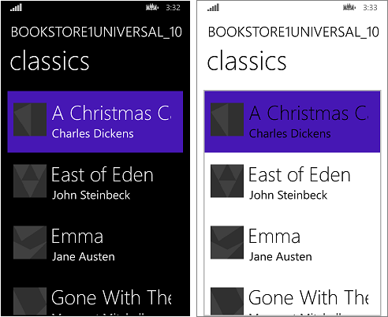

# Caso práctico de Windows Runtime 8.x a UWP: Bookstore1

\[ Actualizado para aplicaciones para UWP en Windows 10. Para leer artículos sobre Windows 8.x, consulta el [archivo](http://go.microsoft.com/fwlink/p/?linkid=619132) \]

En este tema se presenta un caso práctico de migración de una aplicación Universal 8.1 a una aplicación para la Plataforma universal de Windows (UWP) de Windows 10. Una aplicación Universal 8.1 es aquella que crea un paquete de la aplicación para Windows 8.1 y otro paquete de la aplicación para Windows Phone 8.1. Con Windows 10, puedes crear un paquete de la aplicación único que los clientes pueden instalar en una amplia variedad de dispositivos, como se verá en este caso práctico. Consulta [Guía de aplicaciones para UWP](https://msdn.microsoft.com/library/windows/apps/dn894631).

La aplicación que portaremos consta de un enlace **ListBox** enlazado con un modelo de vista. El modelo de vista tiene una lista de libros que muestra el título, el autor y la portada de libro. Las imágenes de portada de libro tienen el valor de **Acción de compilación** establecido en **Contenido** y de **Copiar en el directorio de salida** establecido en **No copiar**.

En los temas anteriores de esta sección se describen las diferencias entre las plataformas y se proporcionan detalles y pautas sobre el proceso de migración de diversos aspectos de una aplicación, entre ellos el marcado XAML, el enlace a un modelo de vista y el acceso a los datos. El objetivo de un caso práctico consiste en complementar esa orientación mostrando un ejemplo real en la práctica. En el caso práctico se supone que has leído las directrices, ya que no se repiten.

**Nota** Cuando abras Bookstore1Universal\_10 en Visual Studio, si aparece el mensaje "Se requiere una actualización de Visual Studio", sigue los pasos de [TargetPlatformVersion](w8x-to-uwp-troubleshooting.md#targetplatformversion).

## Descargas

[Descarga la aplicación Bookstore1\_81 Universal 8.1](http://go.microsoft.com/fwlink/?linkid=532946).

[Descarga la aplicación para Windows 10 Bookstore1Universal\_10](http://go.microsoft.com/fwlink/?linkid=532950).

## Aplicación Universal 8.1

Este es el aspecto de Bookstore1\_81 (la aplicación que se va a portar). Es simplemente un cuadro de lista de libros con desplazamiento vertical debajo del encabezado del nombre de aplicación y título de la página.

Bookstore1\_81 en Windows

Bookstore1\_81 en Windows Phone

##  Migración a un proyecto de Windows 10

La solución Bookstore1\_81 es un proyecto de aplicación universal 8.1 y contiene estos proyectos.

-   Bookstore1\_81.Windows. Este es el proyecto que crea el paquete de la aplicación para Windows 8.1.
-   Bookstore1\_81.WindowsPhone. Este es el proyecto que crea el paquete de la aplicación para Windows Phone 8.1.
-   Bookstore1\_81.Shared. Este es el proyecto que contiene código fuente, archivos de marcado y otros activos y recursos que usan los otros dos proyectos.

Para este caso práctico, tenemos las opciones habituales que se describen en [Si ya tienes una aplicación Universal 8.1](w8x-to-uwp-root.md#if-you-have-an-81-universal-windows-app) con respecto a los dispositivos que se admiten. En este caso, la decisión es muy simple: esta aplicación tiene las mismas características y funciona principalmente con el mismo código en los formatos Windows 8.1 y Windows Phone 8.1. Por lo tanto, portaremos el contenido del proyecto compartido (y cualquier otra cosa que necesitemos de los otros proyectos) a una aplicación de Windows 10 que tenga como destino la familia de dispositivos universales (que se pueda instalar en la más amplia variedad de dispositivos).

Es una tarea muy rápida crear un nuevo proyecto en Visual Studio, copiar archivos en él desde Bookstore1\_81 e incluir los archivos copiados en el nuevo proyecto. Empieza creando un proyecto nuevo de Aplicación vacía (Windows Universal). Asígnale el nombre Bookstore1Universal\_10. Estos son los archivos que hay que copiar de Bookstore1\_81 a Bookstore1Universal\_10.

**Desde el proyecto compartido**

-   Copia la carpeta que contiene los archivos PNG de la imagen de portada de libro (la carpeta es \\Assets\\CoverImages). Después de copiar la carpeta, en el **Explorador de soluciones**, asegúrate de que **Mostrar todos los archivos** esté activado. Haz clic con el botń secundario en la carpeta que has copiado y haz clic en **Incluir en el proyecto**. Este comando es lo que conocemos como "incluir" archivos o carpetas en un proyecto. Cada vez que se copia un archivo o carpeta, haz clic en **Actualizar** en el **Explorador de soluciones** y, a continuación, incluye el archivo o carpeta en el proyecto. No es necesario hacer esto para los archivos que reemplaces en el destino.
-   Copia la carpeta que contiene el archivo de origen del modelo de vista (la carpeta es \\ViewModel).
-   Copia MainPage.xaml y reemplaza el archivo en el destino.

**Del proyecto de Windows**

-   Copia BookstoreStyles.xaml. Usaremos este como un punto de partida adecuado porque todas las claves de recurso de este archivo se resolverán en una aplicación de Windows 10; no lo harán algunas de las que están en el archivo equivalente de Windows Phone.

Edita el código fuente y los archivos de marcado que acabas de copiar y cambia las referencias al espacio de nombres Bookstore1\_81 a Bookstore1Universal\_10. Una forma rápida de hacerlo es usar la función **Reemplazar en archivos**. No es necesario hacer cambios de código en el modelo de vista ni en ningún otro código imperativo. Pero solo para que sea más fácil averiguar la versión de la aplicación que se está ejecutando, cambia el valor devuelto por la propiedad **Bookstore1Universal\_10.BookstoreViewModel.AppName** de "BOOKSTORE1\_81" a "BOOKSTORE1UNIVERSAL\_10".

Ahora ya se puede compilar y ejecutar. Este es el aspecto de nuestra nueva aplicación para UWP sin haber realizado aún ningún trabajo explícito para portarla a Windows 10.

La aplicación para Windows 10 con cambios del código fuente inicial ejecutándose en un dispositivo de escritorio

Aplicación para Windows 10 con cambios del código fuente inicial ejecutándose en un dispositivo móvil

La vista y el modelo de vista funcionan juntos correctamente y **ListBox** está funcionando. Solo tenemos que corregir el estilo. En el tema claro de un dispositivo móvil, se puede ver el borde del cuadro de lista y también se puede ocultar fácilmente. La tipografía es demasiado grande, así que cambiamos los estilos que estamos usando. Además, la aplicación debería tener un color claro al ejecutarse en un dispositivo de escritorio si queremos que se parezca a la configuración predeterminada. Así que lo cambiaremos.

## Estilos universales

La aplicación Bookstore1\_81 usa dos diccionarios de recursos distintos (BookstoreStyles.xaml) para adaptar sus estilos a los sistemas operativos Windows 8.1 y Windows Phone 8.1. Ninguno de estos dos archivos BookstoreStyles.xaml contiene exactamente los estilos que necesitamos para nuestra aplicación de Windows 10. Pero la buena noticia es que lo que queremos es realmente mucho más sencillo que cualquiera de ellos. Por lo tanto, los pasos siguientes implicarán eliminar y simplificar los archivos y el marcado de nuestro proyecto. Los pasos se indican a continuación. Puedes usar los vínculos que aparecen en la parte superior de este tema para descargar los proyectos y ver los resultados de todos los cambios entre este punto y el final del caso práctico.

-   Para ajustar el espaciado entre los elementos, busca la plantilla de datos `BookTemplate` en MainPage.xaml y elimina el `Margin="0,0,0,8"` de la raíz **Grid**.
-   Además, en `BookTemplate`, hay referencias a `BookTemplateTitleTextBlockStyle` y `BookTemplateAuthorTextBlockStyle`. Bookstore1\_81 usaba dichas claves como direccionamiento indirecto de manera que una sola clave tenía distintas implementaciones en las dos aplicaciones. Ya no necesitamos el direccionamiento indirecto; podemos hacer referencia a estilos del sistema directamente. Por lo tanto, reemplaza las referencias por `TitleTextBlockStyle` y `SubtitleTextBlockStyle`, respectivamente.
-   Ahora debemos establecer el elemento Background de `LayoutRoot` en el valor predeterminado correcto para que la aplicación tenga una apariencia adecuada cuando se ejecute en todos los dispositivos independientemente de cuál sea el tema. Cámbialo de `"Transparent"` a `"{ThemeResource ApplicationPageBackgroundThemeBrush}"`.
-   En `TitlePanel`, cambia la referencia a `TitleTextBlockStyle` (que ahora es un poco grande) a una referencia a `CaptionTextBlockStyle`. `PageTitleTextBlockStyle` es otro direccionamiento indirecto de Bookstore1\_81 que ya no necesitamos. Cámbialo para hacer referencia a `HeaderTextBlockStyle` .
-   Ya no necesitamos establecer ningún valor para Background, Style ni ItemContainerStyle especial en **ListBox**, así que elimina los tres atributos y sus valores del marcado. Sin embargo, queremos ocultar el borde de **ListBox**, así que agrega `BorderBrush="{x:Null}"` .
-   Ya no estamos haciendo referencia a ninguno de los recursos del archivo **ResourceDictionary** de BookstoreStyles.xaml. Puedes eliminar todos esos recursos. Pero no elimines el propio archivo BookstoreStyles.xaml: aún tenemos que usarlo una vez, como verás en la siguiente sección.

La última secuencia de operaciones de estilo deja la aplicación con la apariencia siguiente.

La aplicación para Windows 10 casi portada ejecutándose en un dispositivo de escritorio

La aplicación para Windows 10 casi portada ejecutándose en un dispositivo móvil

## Un ajuste opcional en el cuadro de lista para dispositivos móviles

Cuando la aplicación se ejecuta en un dispositivo móvil, el fondo de un cuadro de lista es claro en ambos temas de forma predeterminada. Ese puede ser el estilo que prefieras y, si es así, no hay nada más que hacer excepto organizarlo: elimina el archivo de diccionario de recursos BookstoreStyles.xaml del proyecto y quita el marcado que lo combina en MainPage.xaml.

No obstante, los controles están diseñados para que puedas personalizar su apariencia sin que ello influya en el comportamiento. Por lo tanto, si quieres que el cuadro de lista sea oscuro en el tema oscuro (la apariencia que tenía la aplicación original), en esta sección se describe una forma de hacerlo.

El cambio que realizamos solamente tiene que afectar a la aplicación cuando se ejecuta en dispositivos móviles. Por lo tanto, usaremos un estilo de cuadro de lista muy ligeramente personalizado cuando ejecutemos la aplicación en la familia de dispositivos móviles y continuaremos usando el estilo predeterminado cuando la estemos ejecutando en otros dispositivos. Para ello, haremos una copia de BookstoreStyles.xaml y le asignaremos un nombre completo de MRT, que hará que se cargue solamente en los dispositivos móviles.

Agrega un nuevo elemento de proyecto **ResourceDictionary** y asígnale el nombre BookstoreStyles.DeviceFamily Mobile.xaml. Ahora tienes dos archivos cuyo nombre lógico es BookstoreStyles.xaml (y ese es el nombre que usas en el marcado y código). Sin embargo, estos archivos tienen diferentes nombres físicos, por lo que pueden contener marcado diferente. Puedes usar este esquema de nomenclatura completa de MRT con cualquier archivo xaml, pero ten en cuenta que todos los archivos xaml con el mismo nombre lógico comparten un solo archivo de código subyacente xaml.cs (donde se aplica uno).

Edita una copia de la plantilla de control para el cuadro de lista y almacénala con la clave de `BookstoreListBoxStyle` en el nuevo diccionario de recursos, BookstoreStyles.DeviceFamily-Mobile.xaml. Ahora realizaremos cambios simples en tres de los establecedores.

-   En el establecedor de primer plano, cambia el valor a `"{x:Null}"`. Ten en cuenta que establecer una propiedad en `"{x:Null}"` directamente en un elemento es lo mismo que si se establece en `null` en el código. Pero con un valor de `"{x:Null}"` en un establecedor tiene un efecto único: reemplaza el establecedor en el estilo predeterminado (de la misma propiedad) y restaura el valor predeterminado de la propiedad en el elemento de destino.
-   En el establecedor de segundo plano, cambia el valor a `"Transparent"` para quitar el fondo claro.
-   En el establecedor de la plantilla, busca el estado visual llamado `Focused` y elimina su guion gráfico convirtiéndolo en una etiqueta vacía.
-   Elimina los demás establecedores del marcado.

Por último, copia `BookstoreListBoxStyle` en BookstoreStyles.xaml y elimina sus tres establecedores, convirtiéndolos en una etiqueta vacía. Esto lo hacemos para que en dispositivos diferentes a los móviles, nuestra referencia a BookstoreStyles.xaml y a `BookstoreListBoxStyle` se resuelva pero no tenga efecto.

La aplicación para Windows 10 portada ejecutándose en un dispositivo móvil

## Conclusión

En este caso práctico se mostró el proceso de migración de una aplicación muy sencilla (y posiblemente, poco realista). Por ejemplo, se puede usar un cuadro de lista para seleccionar o establecer un contexto de navegación; la aplicación navega a una página con más detalles sobre el elemento que se pulsó. Esta aplicación en particular no hace nada con la selección del usuario y no tiene navegación. Aun así, el caso práctico sirve para dar los primeros pasos y presentar el proceso de migración, así como demostrar técnicas importantes que se puede usar en aplicaciones para UWP reales.

También observamos que la migración de modelos de vista es, por lo general, un proceso uniforme de pruebas. La interfaz de usuario y la compatibilidad con factores de forma son los aspectos que probablemente requerirán nuestra atención para la migración.

El siguiente caso práctico es [Bookstore2](w8x-to-uwp-case-study-bookstore2.md), en el que vamos a ver cómo mostrar datos agrupados y obtener acceso a ellos.

<!--HONumber=Jun16_HO4-->

