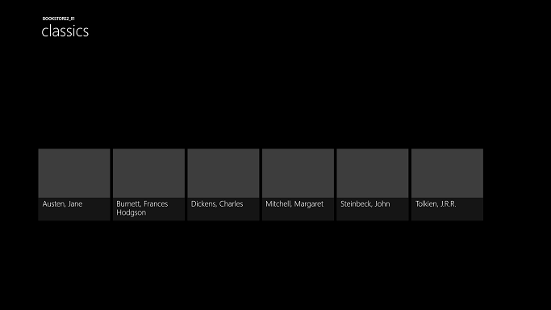
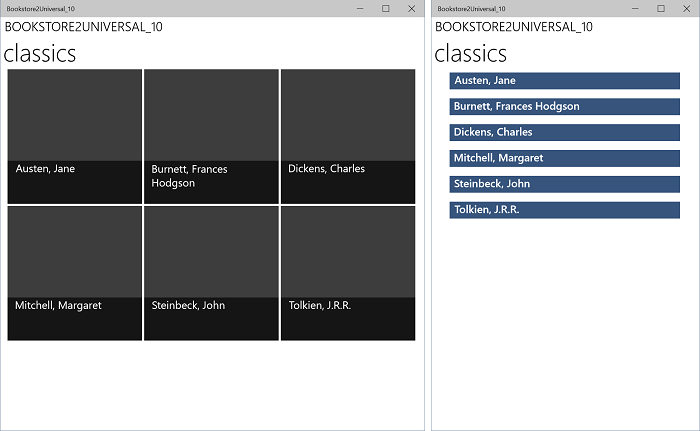

# <a name="windows-runtime-8x-to-uwp-case-study-bookstore2"></a>Caso práctico de Windows Runtime 8.x a UWP: Bookstore2


Este caso práctico, que se basa en la información proporcionada en [Bookstore1](w8x-to-uwp-case-study-bookstore1.md), comienza con una aplicación Universal 8.1 que muestra datos agrupados en un control [**SemanticZoom**](https://msdn.microsoft.com/library/windows/apps/hh702601). En el modelo de vista, cada instancia de la clase **Author** representa el grupo de los libros que ha escrito ese autor y en **SemanticZoom** podemos ver la lista de libros agrupados por autor, o bien podemos alejar la vista para ver una lista de accesos directos a autores. La lista de accesos directos ofrece una navegación mucho más rápida que un desplazamiento por la lista de libros. Repasaremos los pasos de migración de la aplicación a una aplicación de plataforma de Windows Windows10Universal (UWP).

**Nota**  cuando abras Bookstore2Universal\_10 en Visual Studio, si aparece el mensaje "Requiere la actualización de Visual Studio", sigue los pasos descritos en [TargetPlatformVersion](w8x-to-uwp-troubleshooting.md).

## <a name="downloads"></a>Descargas

[Descarga la aplicación Bookstore2\_81 Universal 8.1](http://go.microsoft.com/fwlink/?linkid=532951).

[Descargar el Bookstore2Universal\_10 de aplicación de Windows 10](http://go.microsoft.com/fwlink/?linkid=532952).

## <a name="the-universal-81-app"></a>Aplicación Universal 8.1

Este es el aspecto de Bookstore2\_81 (la aplicación que se portará). Es un [**SemanticZoom**](https://msdn.microsoft.com/library/windows/apps/hh702601) de desplazamiento horizontal (desplazamiento vertical en Windows Phone) que muestra libros agrupados por autor. Puedes alejar la lista de accesos directos y, desde allí, puedes navegar a cualquier grupo. Existen dos elementos principales en esta aplicación: el modelo de vista que proporciona el origen de datos agrupados y la interfaz de usuario que se enlaza a ese modelo de vista. Como se verá, ambas partes se pueden portar fácilmente de tecnología de WinRT 8.1 a Windows 10.


Bookstore2\_81 en Windows, vista ampliada
 



Bookstore2\_81 en Windows, vista alejada


Bookstore2\_81 en Windows Phone, vista ampliada


Bookstore2\_81 en Windows Phone, vista alejada

##  <a name="porting-to-a-windows10-project"></a>Migración a un proyecto de Windows 10

La solución Bookstore2\_81 es un proyecto de aplicación universal 8.1. El proyecto bookstore2\_81 el paquete de la aplicación para Windows8.1 y el proyecto bookstore2\_81. windowsphone genera el paquete de la aplicación para Windows Phone 8.1. Bookstore2\_81.Shared es el proyecto que contiene código fuente, archivos de marcado y otros activos y recursos, que usan los otros dos proyectos.

Al igual que con el caso práctico anterior, la opción que elegiremos (de los que se describe en [Si tienes una aplicación Universal 8.1](w8x-to-uwp-root.md)) es portar el contenido de la compartido del proyecto a un Windows 10 destinada a la familia de dispositivos universales.

Comienza creando un proyecto nuevo de Aplicación vacía (Windows Universal). Asígnale el nombre Bookstore2Universal\_10. Estos son los archivos que hay que copiar de Bookstore2\_81 a Bookstore2Universal\_10.

**Desde el proyecto compartido**

-   Copia la carpeta que contiene los archivos PNG de la imagen de portada de libro (la carpeta es \\Assets\\CoverImages). Después de copiar la carpeta, en el **Explorador de soluciones**, asegúrate de que **Mostrar todos los archivos** esté activado. Haz clic con el botń secundario en la carpeta que has copiado y haz clic en **Incluir en el proyecto**. Este comando es lo que conocemos como "incluir" archivos o carpetas en un proyecto. Cada vez que se copia un archivo o carpeta, haz clic en **Actualizar** en el **Explorador de soluciones** y, a continuación, incluye el archivo o carpeta en el proyecto. No es necesario hacer esto para los archivos que reemplaces en el destino.
-   Copia la carpeta que contiene el archivo de origen del modelo de vista (la carpeta es \\ViewModel).
-   Copia MainPage.xaml y reemplaza el archivo en el destino.

**Del proyecto de Windows**

-   Copia BookstoreStyles.xaml. Vamos a utilizar este una como un punto de partida adecuado porque todas las claves de recurso de este archivo se resolverán en una aplicación de Windows 10; algunos de ellos en el archivo equivalente de Windows Phone no lo hará.
-   Copia SeZoUC.xaml y SeZoUC.xaml.cs. Comenzaremos con la versión de Windows de esta vista, que es adecuada para ventanas anchas y, después, haremos se adapte a ventanas más pequeñas (y por tanto a los dispositivos más pequeños).

Edita el código fuente y los archivos de marcado que acabas de copiar y cambia las referencias al espacio de nombres Bookstore2\_81 a Bookstore2Universal\_10. Una forma rápida de hacerlo es usar la función **Reemplazar en archivos**. No es necesario hacer cambios de código en el modelo de vista ni en ningún otro código imperativo. Pero solo para que sea más fácil averiguar la versión de la aplicación que se está ejecutando, cambia el valor devuelto por la propiedad **Bookstore2Universal\_10.BookstoreViewModel.AppName** de "Bookstore2\_81" a "BOOKSTORE2UNIVERSAL\_10".

Ahora ya se puede compilar y ejecutar. Este es el aspecto de nuestra nueva aplicación para UWP sin haber realizado aún ningún trabajo para portarla a Windows 10.


La aplicación de Windows 10 con cambios del código fuente inicial ejecutándose en un dispositivo de escritorio, vista ampliada


La aplicación de Windows 10 con cambios del código fuente inicial ejecutándose en un dispositivo de escritorio, vista alejada

El modelo de vista y las vistas acercada y alejada funcionan juntos correctamente, aunque hay problemas que hacen que sea un poco difícil de ver. Un problema es que [**SemanticZoom**](https://msdn.microsoft.com/library/windows/apps/hh702601) no se desplaza. Esto es porque, en Windows 10, el estilo predeterminado de un [**control GridView**](https://msdn.microsoft.com/library/windows/apps/br242705) hace que se dispuestas verticalmente (y las directrices de diseño de Windows 10 se recomiendan que se use de esta manera en nuevas aplicaciones y portadas). No obstante, desplazamiento horizontal opciones de configuración de la plantilla del panel de elementos personalizados que copiamos del proyecto Bookstore2\_81 (que se ha diseñado para el 8.1 app) entra en conflicto con la configuración de desplazamiento vertical en el estilo predeterminado de Windows 10 que se está aplicando como resultado de haber portado a una aplicación de Windows 10. Una segunda cuestión es que la aplicación aún no adapta su interfaz de usuario para que ofrezca la mejor experiencia en distintos tamaños de ventanas y en dispositivos pequeños. Y en tercer lugar, los estilos y pinceles correctos aún no se usan, lo que provoca que gran parte del texto sea invisible (incluidos los encabezados de grupo en los que puede hacer clic para alejar). Por tanto, en las siguientes tres secciones ([Cambios de diseño de SemanticZoom y GridView](#semanticzoom-and-gridview-design-changes), [Interfaz de usuario adaptativa](#adaptive-ui) y [Estilos universales](#universal-styling)) se solucionarán los tres problemas.

## <a name="semanticzoom-and-gridview-design-changes"></a>Cambios de diseño de SemanticZoom y GridView

En la sección [cambios de SemanticZoom](w8x-to-uwp-porting-xaml-and-ui.md)se describen los cambios de diseño en Windows 10 en el control [**SemanticZoom**](https://msdn.microsoft.com/library/windows/apps/hh702601) . No es necesario realizar ningún trabajo en esta sección en respuesta a esos cambios.

Los cambios realizados a [**GridView**](https://msdn.microsoft.com/library/windows/apps/br242705) se describen en la sección [Cambios de GridView/ListView](w8x-to-uwp-porting-xaml-and-ui.md). Hay que realizar algunos pequeños ajustes para adaptarse a esos cambios, como se describe a continuación.

-   En SeZoUC.xaml, en `ZoomedInItemsPanelTemplate`, establece `Orientation="Horizontal"` y `GroupPadding="0,0,0,20"`.
-   En SeZoUC.xaml, elimina `ZoomedOutItemsPanelTemplate` y quitar el atributo `ItemsPanel` de la vista alejada.

Y eso es todo.

## <a name="adaptive-ui"></a>Interfaz de usuario adaptativa

Después de ese cambio, el diseño de la interfaz de usuario que proporciona SeZoUC.xaml es ideal cuando la aplicación se ejecuta en una ventana ancha (que solo es posible en un dispositivo con una pantalla grande). Sin embargo, cuando la ventana de la aplicación es estrecha (que sucede en un dispositivo pequeño y también puede ocurrir en un dispositivo de gran tamaño), la interfaz de usuario que teníamos en la aplicación de la Tienda de Windows Phone es posiblemente más apropiada.

Se puede usar la función adaptativa de Visual State Manager para lograr esto. Estableceremos las propiedades en los elementos visuales para que, de manera predeterminada, la interfaz de usuario se disponga en el estado estrecho con las plantillas más pequeñas que estábamos usando en la aplicación de la Tienda de Windows Phone. A continuación, detectaremos cuando la ventana de la aplicación es mayor o igual a un tamaño específico (que se mide en unidades de [píxeles funcionales](w8x-to-uwp-porting-xaml-and-ui.md)) y, como respuesta, cambiaremos las propiedades de los elementos visuales para obtener un diseño más grande y ancho. Colocaremos esos cambios de propiedades en un estado visual y usaremos un desencadenador adaptable para supervisar de forma continua y determinar si se aplica ese estado visual o no, según el ancho de la ventana en píxeles efectivos. Estamos activando el ancho de la ventana en este caso, pero también es posible activar el alto de la ventana.

Un ancho mínimo de 548 píxeles efectivos es apropiado para este caso práctico porque es el tamaño del dispositivo más pequeño en el que queremos mostrar el diseño. Los teléfonos son normalmente tienen menos de 548 píxeles efectivos y, por ese motivo, en un dispositivo pequeño como ese, se conservará el diseño estrecho de forma predeterminada. En un equipo, se iniciará la ventana de forma predeterminada con un ancho suficiente para desencadenar el cambio al estado ancho. Desde allí podrás arrastrar la ventana estrecha lo suficiente para mostrar dos columnas de elementos con un tamaño de 250x250. Si se hace un poco más estrecha que eso, el desencadenador se desactivará, se quitará el estado visual ancho y se mostrará el diseño estrecho predeterminado.

Por tanto, ¿qué propiedades es necesario establecer (y cambiar) para lograr estos dos diseños diferentes? Hay dos alternativas y cada una usa un enfoque diferente.

1.  Podemos incluir dos controles [**SemanticZoom**](https://msdn.microsoft.com/library/windows/apps/hh702601) en nuestro marcado. Uno sería una copia del marcado que se usaban en la aplicación de 8.x de Windows Runtime (con controles de [**GridView**](https://msdn.microsoft.com/library/windows/apps/br242705) en su interior) y contraído de manera predeterminada. El otro sería una copia del marcado que estábamos usando en la aplicación de la Tienda de Windows Phone (con controles [**ListView**](https://msdn.microsoft.com/library/windows/apps/br242878) en su interior) y contraído de manera predeterminada. El estado visual podría cambiar las propiedades de visibilidad de los dos controles **SemanticZoom**. Se requeriría muy poco esfuerzo para lograrlo, pero en general no se trata de una técnica de alto rendimiento. Por tanto, si la usas, deberías generar perfiles de la aplicación y asegurarte de que aún se cumplen los objetivos de rendimiento.
2.  Podemos usar un único [**SemanticZoom**](https://msdn.microsoft.com/library/windows/apps/hh702601) que contenga controles [**ListView**](https://msdn.microsoft.com/library/windows/apps/br242878). Para lograr los dos diseños, en el estado visual ancho, se deben cambiar las propiedades de los controles **ListView**, incluidas las plantillas que se aplican a estos, para que se dispongan de la misma forma que [**GridView**](https://msdn.microsoft.com/library/windows/apps/br242705). Esto puede funcionar mejor, pero hay tantas diferencias pequeñas entre los distintos estilos y plantillas de **GridView** y **ListView**, y entre sus diversos tipos de elementos, que es la solución más difícil de lograr. Esta solución también está estrechamente relacionada con la manera en que las plantillas y los estilos predeterminados están diseñados en este momento, lo que nos da una solución que es frágil y sensible a cualquier cambio posterior de los valores predeterminados.

En este caso práctico, aplicaremos la primera alternativa. Pero si lo prefieres, puedes probar la segunda y ver si funciona mejor en tu caso. Estos son los pasos que se deben seguir para implementar la primera alternativa.

-   En el [**SemanticZoom**](https://msdn.microsoft.com/library/windows/apps/hh702601) en el marcado del nuevo proyecto, establece `x:Name="wideSeZo"` y `Visibility="Collapsed"`.
-   Vuelve al proyecto Bookstore2\_81.WindowsPhone y abre SeZoUC.xaml. Copia el marcado del elemento [**SemanticZoom**](https://msdn.microsoft.com/library/windows/apps/hh702601) fuera de ese archivo y pégalo inmediatamente después de `wideSeZo` en el nuevo proyecto. Establece `x:Name="narrowSeZo"` en el elemento que acabas de pegar.
-   Pero `narrowSeZo` necesita un par de estilos que aún no hemos copiado. De nuevo en Bookstore2\_81.WindowsPhone, copia los dos estilos (`AuthorGroupHeaderContainerStyle` y `ZoomedOutAuthorItemContainerStyle`) fuera de SeZoUC.xaml y pégalos en BookstoreStyles.xaml, en el nuevo proyecto.
-   Ahora tienes dos elementos [**SemanticZoom**](https://msdn.microsoft.com/library/windows/apps/hh702601) en el nuevo archivo SeZoUC.xaml. Encapsula los dos elementos en un **Grid**.
-   En el archivo BookstoreStyles.xaml del nuevo proyecto, anexa la palabra `Wide` a estas tres claves de recursos (y a sus referencias en SeZoUC.xaml, pero solo para las referencias dentro de `wideSeZo`): `AuthorGroupHeaderTemplate`, `ZoomedOutAuthorTemplate` y `BookTemplate`.
-   En el proyecto Bookstore2\_81.WindowsPhone, abre BookstoreStyles.xaml. En este archivo, copia los mismos tres recursos (mencionados anteriormente), los dos convertidores de elementos de listas de accesos directos y la declaración de prefijo del espacio de nombres Windows\_UI\_Xaml\_Controls\_Primitives, y pégalos todos en el archivo BookstoreStyles.xaml del nuevo proyecto.
-   Por último, en el archivo SeZoUC.xaml del nuevo proyecto, agrega el marcado de Visual State Manager adecuado para el **Grid** que agregaste anteriormente.

```xml
    <Grid>
        <VisualStateManager.VisualStateGroups>
            <VisualStateGroup>
                <VisualState x:Name="WideState">
                    <VisualState.StateTriggers>
                        <AdaptiveTrigger MinWindowWidth="548"/>
                    </VisualState.StateTriggers>
                    <VisualState.Setters>
                        <Setter Target="wideSeZo.Visibility" Value="Visible"/>
                        <Setter Target="narrowSeZo.Visibility" Value="Collapsed"/>
                    </VisualState.Setters>
                </VisualState>
            </VisualStateGroup>
        </VisualStateManager.VisualStateGroups>

    ...

    </Grid>
```

## <a name="universal-styling"></a>Estilos universales

Ahora vamos a corregir algunos problemas de estilos, incluido uno que presentamos anteriormente mientras se realizaba la copia desde el proyecto antiguo.

-   En MainPage.xaml, cambia el elemento Background de `LayoutRoot` por `"{ThemeResource ApplicationPageBackgroundThemeBrush}"`.
-   En BookstoreStyles.xaml, establece el valor del recurso `TitlePanelMargin` del recurso en `0` (o cualquier valor que te parezca adecuado).
-   En SeZoUC.xaml, establece el elemento Margin de `wideSeZo` a `0` (o cualquier valor que te parezca adecuado).
-   En BookstoreStyles.xaml, quita el atributo Margin de `AuthorGroupHeaderTemplateWide`.
-   Quita el atributo FontFamily de `AuthorGroupHeaderTemplate` y de `ZoomedOutAuthorTemplate`.
-   Bookstore2\_81 usaba las claves de recurso `BookTemplateTitleTextBlockStyle`, `BookTemplateAuthorTextBlockStyle` y `PageTitleTextBlockStyle` como direccionamiento indirecto, de forma que una sola clave tuviera implementaciones distintas en las dos aplicaciones. Ya no necesitamos el direccionamiento indirecto; podemos hacer referencia a estilos del sistema directamente. Por lo tanto, reemplaza las referencias de toda la aplicación por `TitleTextBlockStyle`, `CaptionTextBlockStyle` y `HeaderTextBlockStyle`, respectivamente. Puedes usar la función **Reemplazar en archivos** de Visual Studio para hacerlo de forma rápida y precisa. Puedes eliminar esos tres recursos no usados.
-   En `AuthorGroupHeaderTemplate`, reemplaza `PhoneAccentBrush` por `SystemControlBackgroundAccentBrush` y establece `Foreground="White"` en **TextBlock**, de modo que se vea correctamente cuando se ejecute en la familia de dispositivos móviles.
-   En `BookTemplateWide`, copia el atributo Foreground del segundo **TextBlock** en el primero.
-   En `ZoomedOutAuthorTemplateWide`, cambia la referencia a `SubheaderTextBlockStyle` (que ahora es un poco grande) a una referencia a `SubtitleTextBlockStyle`.
-   La vista alejada (la lista de accesos directos) ya no se superpone a la vista ampliada en la nueva plataforma, por lo que es posible quitar el atributo `Background` de la vista alejada de `narrowSeZo`.
-   Para que todos los estilos y plantillas estén en un archivo, mueva `ZoomedInItemsPanelTemplate` fuera de SeZoUC.xaml y dentro de BookstoreStyles.xaml.

La última secuencia de operaciones de estilo deja la aplicación con la apariencia siguiente.


La aplicación de Windows 10 portada ejecutándose en un dispositivo de escritorio, vista ampliada y dos tamaños de ventana



La aplicación de Windows 10 portada ejecutándose en un dispositivo de escritorio, vista alejada y dos tamaños de ventana


La aplicación de Windows 10 portada ejecutándose en un dispositivo móvil, vista ampliada


La aplicación de Windows 10 portada ejecutándose en un dispositivo móvil, vista alejada

## <a name="conclusion"></a>Conclusión

En este caso práctico se ha observado una interfaz de usuario más ambiciosa que la anterior. Al igual que con el caso práctico anterior, este modelo de vista particular no requirió ningún trabajo y nuestros esfuerzos se centraron principalmente en la refactorización de la interfaz de usuario. Algunos de los cambios fueron el resultado necesario de combinar dos proyectos en uno, mientras se admitían muchos factores de forma (de hecho, muchos más de los que antes se podían). Algunos de los cambios estuvieron relacionados con los cambios realizados en la plataforma.

El siguiente caso práctico es [QuizGame](w8x-to-uwp-case-study-quizgame.md), en el que vamos a ver cómo mostrar datos agrupados y obtener acceso a ellos.
