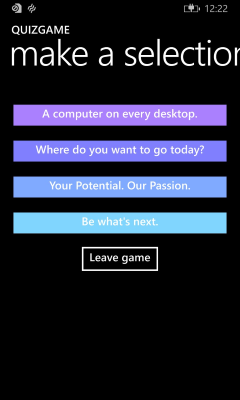

# <a name="windows-runtime-8x-to-uwp-case-study-quizgame-sample-app"></a>Windows Runtime 8.x a UWP caso práctico: QuizGame aplicación de muestra


Este tema presenta un caso práctico de migración de una cuestionario de punto a punto juego WinRT 8.1 aplicación de muestra funcional a una aplicación de plataforma de Windows Windows10Universal (UWP).

Una aplicación Universal 8.1 es aquella que crea dos versiones de la misma aplicación: paquete de una aplicación para Windows8.1 y un paquete de la aplicación diferente para Windows Phone 8.1. La versión para WinRT8.1 de QuizGame usa una organización de proyecto de aplicación universal de Windows, pero toma un enfoque distinto y crea una aplicación funcionalmente distinta para las dos plataformas. El paquete de la aplicación Windows8.1 actúa como el host de sesión de juego de preguntas, mientras que el paquete de la aplicación de Windows Phone 8.1 asume el rol del cliente al host. Las dos partes de la sesión del juego de preguntas se comunican a través de redes de punto a punto.

La adaptación de las dos partes al equipo y al teléfono, respectivamente, tiene sentido. Pero, ¿no sería aún mejor si se pudieran ejecutar el host y el cliente en prácticamente cualquier dispositivo que quisieras? En este caso práctico, se portarán las dos aplicaciones a Windows 10 donde se compilarán en un paquete de aplicación única que los usuarios pueden instalar en una amplia gama de dispositivos.

La aplicación usa patrones que usan vistas y modelos de vista. Como resultado de esta clara separación, el proceso de migración de esta aplicación es, como se verá, muy sencillo.

**Nota**en este ejemplo se da por hecho que la red está configurada para enviar y recibir UDP personalizados (la mayoría de las redes doméstica está, aunque no puede ser la red del trabajo) de paquetes de multidifusión de grupo. La muestra también envía y recibe paquetes TCP.

 

**Nota**  cuando abras QuizGame10 en Visual Studio, si aparece el mensaje "Requiere la actualización de Visual Studio", sigue los pasos de [TargetPlatformVersion](w8x-to-uwp-troubleshooting.md).

 

## <a name="downloads"></a>Descargas

[Descarga la aplicación QuizGame Universal 8.1](http://go.microsoft.com/fwlink/?linkid=532953). Este es el estado inicial de la aplicación antes de portar. 

[Descarga la aplicación QuizGame10 para Windows 10](http://go.microsoft.com/fwlink/?linkid=532954). Este es el estado de la aplicación justo después de la migración. 

[Consulta la versión más reciente de esta muestra en GitHub](https://github.com/Microsoft/Windows-appsample-quizgame).

## <a name="the-winrt-81-solution"></a>La solución de WinRT8.1


Este es el aspecto de QuizGame (la aplicación que vamos a portar).


La aplicación host de QuizGame ejecutándose en Windows

 



La aplicación cliente de QuizGame ejecutándose en Windows Phone

## <a name="a-walkthrough-of-quizgame-in-use"></a>Un tutorial de uso de QuizGame

Esta es una cuenta hipotética corta de la aplicación en uso, pero proporciona información útil si quieres probar la aplicación tú mismo en tu red inalámbrica.

Un divertido juego de preguntas tiene lugar en un bar. Hay un televisor grande en el bar que todo el mundo puede ver. El responsable de la partida tiene un equipo cuya salida se muestra en el televisor. En ese equipo se está ejecutando "la aplicación host". Cualquiera que quiera formar parte del juego solo debe instalar "la aplicación cliente" en su teléfono o Surface.

La aplicación host está en modo sala de espera y, en el televisor grande, se anuncia que está lista para que las aplicaciones cliente se conecten. Joan inicia la aplicación de cliente en su dispositivo móvil. Escribe su nombre en el cuadro de texto **Nombre del jugador** y pulsa **Unirme al juego**. La aplicación host confirma que Joan se ha unido y muestra su nombre, y la aplicación cliente de Joan indica que está esperando que el juego comience. A continuación, Maxwell sigue los mismos pasos en su dispositivo móvil.

El responsable de la partida hace clic en **Iniciar el juego** y la aplicación host muestra una pregunta y las posibles respuestas (también muestra una lista de los jugadores que se han unido en tipo de fuente normal, en color gris). Al mismo tiempo, las respuestas aparecen en los botones de los dispositivos cliente que se han unido. Joan pulsa el botón con la respuesta "1975", tras lo cual se deshabilitan todos los botones. En la aplicación host, el nombre de Joan se vuelve de color verde (en negrita) como confirmación de la recepción de su respuesta. Maxwell también responde. El responsable de la partida, cuando ve que todos los nombres de los jugadores están en verde, hace clic en **Siguiente pregunta**.

Las preguntas siguen mostrándose y respondiéndose en este mismo ciclo. Cuando se muestra la última pregunta en la aplicación host, el contenido del botón será **Mostrar resultados** y no **Siguiente pregunta**. Cuando se hace clic en **Mostrar resultados**, se muestran los resultados. Al hacer clic en **Volver a la sala de espera**, se vuelve al principio del ciclo del juego, con la excepción de que los jugadores que se han unido permanecen unidos. No obstante, al volver a la sala de espera, se permite que nuevos jugadores se unan e incluso se proporciona un tiempo adecuado para que los jugadores que se han unido puedan dejar el juego (aunque también pueden dejarlo en cualquier momento si pulsan **Salir del juego**).

## <a name="local-test-mode"></a>Modo de prueba local

Para probar la aplicación y sus interacciones en un solo equipo en lugar de distribuidas entre varios dispositivos, puedes crear la aplicación host en modo de prueba local. Este modo omite completamente el uso de la red. En su lugar, la interfaz de usuario de la aplicación host muestra la parte de host a la izquierda de la ventana y, a la derecha, dos copias de la interfaz de usuario de la aplicación cliente, apiladas de forma vertical (ten en cuenta que, en esta versión, la interfaz de usuario del modo de prueba local está fijada para una pantalla de equipo; no se adapta a dispositivos pequeños). Estos segmentos de interfaz de usuario, que se encuentran en la misma aplicación, se comunican entre sí mediante un communicator de cliente ficticio que simula las interacciones que en otros casos tendrían lugar en la red.

Para activar el modo de prueba local, define **LOCALTESTMODEON** (en las propiedades del proyecto) como un símbolo de compilación condicional y vuelve a compilar.

## <a name="porting-to-a-windows10-project"></a>Migración a un proyecto de Windows 10

QuizGame tiene las siguientes partes.

-   P2PHelper. Se trata de una biblioteca de clases portable que contiene la lógica de red punto a punto.
-   QuizGame.Windows. Este es el proyecto que crea el paquete de aplicación para la aplicación host, que está destinado a Windows8.1.
-   QuizGame.WindowsPhone. Este es el proyecto que crea el paquete de la aplicación para la aplicación cliente, que está destinado a Windows Phone8.1.
-   QuizGame.Shared. Este es el proyecto que contiene código fuente, archivos de marcado y otros activos y recursos que usan los otros dos proyectos.

Para este caso práctico, tenemos las opciones habituales que se describen en [Si ya tienes una aplicación Universal 8.1](w8x-to-uwp-root.md) con respecto a los dispositivos que se admiten.

En función de estas opciones, podrás portar QuizGame.Windows a un nuevo proyecto de Windows 10 denominado QuizGameHost. Y, quizgame.windowsphone se portará a un nuevo proyecto de Windows 10 denominado QuizGameClient. Estos proyectos tendrán como destino la familia de dispositivos universales, para que funcionen en cualquier dispositivo. Además, se conservarán los archivos de origen de QuizGame.Shared, etc. en su propia carpeta y se vincularán esos archivos compartidos en los dos proyectos nuevos. Al igual que antes, se conservará todo en una solución que se llamará QuizGame10.

**La solución QuizGame10**

-   Crea una nueva solución (**Nuevo proyecto** &gt; **Otros tipos de proyectos** &gt; **Soluciones de Visual Studio**) y asígnale el nombre QuizGame10.

**P2PHelper**

-   En la solución, crea un nuevo proyecto de biblioteca de clases de Windows 10 (**Nuevo proyecto** &gt; **Windows Universal** &gt; **Biblioteca de clases (Windows Universal)**) y el nombre P2PHelper.
-   Elimina Class1.cs del nuevo proyecto.
-   Copia P2PSession.cs, P2PSessionClient.cs y P2PSessionHost.cs en la carpeta del nuevo proyecto e incluye los archivos copiados en el nuevo proyecto.
-   El proyecto se compila sin necesidad de realizar más cambios.

**Archivos compartidos**

-   Copia las carpetas Common, Model, View y ViewModel de \|QuizGame.Shared\\ a \\QuizGame10\\.
-   Al hacer referencia a las carpetas compartidas en el disco, nos referiremos a Common, Model, View y ViewModel.

**QuizGameHost**

-   Crear un nuevo proyecto de aplicación de Windows 10 (**Agregar** &gt; **Nuevo proyecto** &gt; **Windows Universal** &gt; **Aplicación vacía (Windows Universal)**) y el nombre QuizGameHost.
-   Agrega una referencia a P2PHelper (**Agregar referencia** &gt; **Proyectos** &gt; **Solución** &gt; **P2PHelper**).
-   En el **Explorador de soluciones**, crea una nueva carpeta para cada una de las carpetas compartidas en el disco. A continuación, haz clic con el botón derecho en cada carpeta creada y pulsa **Agregar** &gt; **Elemento existente** para obtener acceso a una de esas carpetas. Abre la carpeta compartida correspondiente, selecciona todos los archivos y haz clic en **Agregar como vínculo**.
-   Copia MainPage.xaml de \\QuizGame.Windows\\ a \\QuizGameHost\\ y cambia el espacio de nombres a QuizGameHost.
-   Copia App.xaml de \\QuizGame.Shared\\ a \\QuizGameHost\\ y cambia el espacio de nombres a QuizGameHost.
-   En lugar de sobrescribir app.xaml.cs, se conservará la versión en el nuevo proyecto y simplemente se hará un cambio de destino para poder admitir el modo de prueba local. En app.xaml.cs, reemplaza esta línea de código:

```CSharp
rootFrame.Navigate(typeof(MainPage), e.Arguments);
```

por esta:

```CSharp
#if LOCALTESTMODEON
    rootFrame.Navigate(typeof(TestView), e.Arguments);
#else
    rootFrame.Navigate(typeof(MainPage), e.Arguments);
#endif
```

-   En **Propiedades** &gt; **Compilar** &gt; **Símbolos de compilación condicional**, agrega LOCALTESTMODEON.
-   Ahora podrás volver al código que agregaste en app.xaml.cs y resolver el tipo de TestView.
-   En package.appxmanifest, cambia el nombre de la funcionalidad de internetClient a internetClientServer.

**QuizGameClient**

-   Crear un nuevo proyecto de aplicación de Windows 10 (**Agregar** &gt; **Nuevo proyecto** &gt; **Windows Universal** &gt; **Aplicación vacía (Windows Universal)**) y el nombre QuizGameClient.
-   Agrega una referencia a P2PHelper (**Agregar referencia** &gt; **Proyectos** &gt; **Solución** &gt; **P2PHelper**).
-   En el **Explorador de soluciones**, crea una nueva carpeta para cada una de las carpetas compartidas en el disco. A continuación, haz clic con el botón derecho en cada carpeta creada y pulsa **Agregar** &gt; **Elemento existente** para obtener acceso a una de esas carpetas. Abre la carpeta compartida correspondiente, selecciona todos los archivos y haz clic en **Agregar como vínculo**.
-   Copia MainPage.xaml de \\QuizGame.WindowsPhone\\ a \\QuizGameClient\\ y cambia el espacio de nombres a QuizGameClient.
-   Copia App.xaml de \\QuizGame.Shared\\ a \\QuizGameClient\\ y cambia el espacio de nombres a QuizGameClient.
-   En package.appxmanifest, cambia el nombre de la funcionalidad de internetClient a internetClientServer.

Ahora ya podrás compilar y ejecutar.

## <a name="adaptive-ui"></a>Interfaz de usuario adaptativa

La aplicación QuizGameHost Windows10 se vea bien cuando la aplicación se ejecuta en una ventana ancha (que solo es posible en un dispositivo con una pantalla grande). Sin embargo, cuando la ventana de la aplicación sea estrecha (algo que sucede en un dispositivo pequeño y también puede ocurrir en un dispositivo de gran tamaño), la interfaz de usuario está tan comprimida que es ilegible.

Es posible usar la función adaptativa de Visual State Manager para solucionarlo, como ya se explicó en [Caso práctico: Bookstore2](w8x-to-uwp-case-study-bookstore2.md). En primer lugar, establece propiedades en los elementos visuales para que, de manera predeterminada, la interfaz de usuario se disponga en el estado estrecho. Todos estos cambios tienen lugar en \\View\\HostView.xaml.

-   En el elemento **Grid** principal, cambia la propiedad **Height** del primer elemento **RowDefinition** de "140" a "Auto".
-   En el elemento **Grid** que contiene el elemento **TextBlock** denominado `pageTitle`, establece `x:Name="pageTitleGrid"` y `Height="60"`. Estos dos primeros pasos son para que podemos controlar eficazmente el alto de ese elemento **RowDefinition** a través de un establecedor en un estado visual.
-   En `pageTitle`, establece `Margin="-30,0,0,0"`.
-   En el elemento **Grid** indicado por el comentario `<!-- Content -->`, establece `x:Name="contentGrid"` y `Margin="-18,12,0,0"`.
-   En **TextBlock**, justo encima del comentario `<!-- Options -->`, establece `Margin="0,0,0,24"`.
-   En el estilo **TextBlock** predeterminado (el primer recurso del archivo), cambia el valor **FontSize** del establecedor a "15".
-   En `OptionContentControlStyle`, cambia el valor **FontSize** del establecedor a "20". Este paso y el anterior nos proporcionarán una buena tabla de tipos que funcione bien en todos los dispositivos. Estos son tamaños mucho más flexibles que estábamos usando para la aplicación Windows8.1 "30".
-   Por último, agrega el marcado de Visual State Manager adecuado al elemento raíz **Grid**.

```xml
<VisualStateManager.VisualStateGroups>
    <VisualStateGroup>
        <VisualState x:Name="WideState">
            <VisualState.StateTriggers>
                <AdaptiveTrigger MinWindowWidth="548"/>
            </VisualState.StateTriggers>
            <VisualState.Setters>
                <Setter Target="pageTitleGrid.Height" Value="140"/>
                <Setter Target="pageTitle.Margin" Value="0,0,30,40"/>
                <Setter Target="contentGrid.Margin" Value="40,40,0,0"/>
            </VisualState.Setters>
        </VisualState>
    </VisualStateGroup>
</VisualStateManager.VisualStateGroups>
```

## <a name="universal-styling"></a>Estilos universales


Verás que en Windows 10, los botones no tienen el mismo táctil del destino de relleno en su plantilla. Dos pequeños cambios lo solucionarán. En primer lugar, agrega este marcado a app.xaml en QuizGameHost y QuizGameClient.

```xml
<Style TargetType="Button">
    <Setter Property="Margin" Value="12"/>
</Style>
```

Y en segundo lugar, agrega este establecedor a `OptionButtonStyle` en \\View\\ClientView.xaml.

```xml
<Setter Property="Margin" Value="6"/>
```

Con ese último retoque, la aplicación se comportará y tendrá el mismo aspecto que antes de la migración, con el valor adicional de que ahora se ejecutará en todas partes.

## <a name="conclusion"></a>Conclusión

La aplicación que migramos en este caso práctico era relativamente compleja e incluía varios proyectos, una biblioteca de clases y una gran cantidad de código e interfaz de usuario. Aun así, la migración resultó sencilla. Parte de la facilidad de migración corresponde directamente a la similitud entre la plataforma de desarrollador de Windows 10 y las plataformas Windows8.1 y Windows Phone 8.1. En parte también se debe a la forma en que la aplicación original se diseñó para separar los modelos, los modelos de vista y las vistas.
