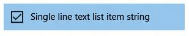

# <a name="porting-windows-runtime-8x-xaml-and-ui-to-uwp"></a>Migración de XAML y la interfaz de usuario de Windows Runtime 8.x a UWP


El tema anterior era [Solución de problemas](w8x-to-uwp-troubleshooting.md).

La práctica para definir la interfaz de usuario en forma de marcado XAML declarativo se traduce muy bien tanto para aplicaciones de tipo Universal 8.1 como para aplicaciones para la Plataforma universal de Windows (UWP). Verás que la mayor parte del código de marcado es compatible, aunque es posible que necesites realizar algunos ajustes en las claves de recurso del sistema o plantillas personalizadas que estás usando. El código imperativo de los modelos de vista requerirá pocos o ningún cambio. Gran parte o la mayoría del código de la capa de presentación que manipula elementos de la IU debe ser también sencillo de migrar.

## <a name="imperative-code"></a>Código imperativo

Si solo quieres llegar a la etapa donde se crea el proyecto, puedes establecer como comentario o código auxiliar cualquier código que no sea esencial. Después itera, un problema cada vez, y consulta los siguientes temas de esta sección (y el tema anterior: [Solución de problemas](w8x-to-uwp-troubleshooting.md)), hasta que se zanjen todos los problemas de compilación y de tiempo de ejecución y la migración se complete.

## <a name="adaptiveresponsive-ui"></a>Interfaz de usuario adaptativa y dinámica

Dado que la aplicación se puede usar en una amplia gama de dispositivos (cada uno con su propio tamaño de pantalla y resolución), es aconsejable ir más allá de los pasos mínimos para migrar la aplicación y adaptar la interfaz de usuario para que tenga el mejor aspecto en esos dispositivos. Puedes usar la función adaptativa Visual State Manager para detectar dinámicamente el tamaño de ventana y cambiar el diseño en respuesta. Se muestra un ejemplo de cómo hacerlo en la sección [Interfaz de usuario adaptativa](w8x-to-uwp-case-study-bookstore2.md) en el tema de caso práctico Bookstore2.

## <a name="back-button-handling"></a>Control del botón Atrás

En el caso de las aplicaciones Universal 8,1, las aplicaciones de Windows Runtime 8. x y las aplicaciones de Windows Phone tienda tienen enfoques diferentes para la interfaz de usuario que muestra y los eventos que controla para el botón atrás. Sin embargo, para las aplicaciones de Windows 10, puede usar un solo enfoque en la aplicación. En los dispositivos móviles, el botón se proporciona automáticamente como un botón capacitivo en el dispositivo o como un botón en el shell. En un dispositivo de escritorio, se agrega un botón al cromo de la aplicación siempre que la navegación hacia atrás es posible dentro de la aplicación; esto aparece en la barra de título para aplicaciones en ventana o en la barra de tareas para el modo de tableta. El evento de botón Atrás es un concepto universal en todas las familias de dispositivos y los botones implementados en el hardware o el software originan el mismo evento [**BackRequested**](https://docs.microsoft.com/uwp/api/windows.ui.core.systemnavigationmanager.backrequested).

El siguiente ejemplo funciona para todas las familias de dispositivos y resulta útil para los casos donde el mismo procesamiento se aplica a todas las páginas y cuando no es necesario confirmar la navegación (por ejemplo, para advertir sobre cambios sin guardar).

```csharp
   // app.xaml.cs

    protected override void OnLaunched(LaunchActivatedEventArgs e)
    {
        [...]

        Windows.UI.Core.SystemNavigationManager.GetForCurrentView().BackRequested += App_BackRequested;
        rootFrame.Navigated += RootFrame_Navigated;
    }

    private void RootFrame_Navigated(object sender, NavigationEventArgs e)
    {
        Frame rootFrame = Window.Current.Content as Frame;

        // Note: On device families that have no title bar, setting AppViewBackButtonVisibility can safely execute 
        // but it will have no effect. Such device families provide back button UI for you.
        if (rootFrame.CanGoBack)
        {
            Windows.UI.Core.SystemNavigationManager.GetForCurrentView().AppViewBackButtonVisibility = 
                Windows.UI.Core.AppViewBackButtonVisibility.Visible;
        }
        else
        {
            Windows.UI.Core.SystemNavigationManager.GetForCurrentView().AppViewBackButtonVisibility = 
                Windows.UI.Core.AppViewBackButtonVisibility.Collapsed;
        }
    }

    private void App_BackRequested(object sender, Windows.UI.Core.BackRequestedEventArgs e)
    {
        Frame rootFrame = Window.Current.Content as Frame;

        if (rootFrame.CanGoBack)
        {
            rootFrame.GoBack();
        }
    }
```

También es un método único para todas las familias de dispositivos para salir de la aplicación mediante programación.

```csharp
   Windows.UI.Xaml.Application.Current.Exit();
```

## <a name="charms"></a>Accesos

No es necesario cambiar el código que se integra con los accesos, pero es necesario agregar una interfaz de usuario a la aplicación para que ocupe el lugar de la barra de accesos, que no forma parte del shell de Windows 10. Una aplicación universal 8,1 que se ejecuta en Windows 10 tiene su propia interfaz de usuario de reemplazo proporcionada por el cromo representado por el sistema en la barra de título de la aplicación.

## <a name="controls-and-control-styles-and-templates"></a>Controles y estilos y plantillas de control

Una aplicación universal 8,1 que se ejecuta en Windows 10 conservará la apariencia y el comportamiento de 8,1 con respecto a los controles. Sin embargo, cuando se traslada esa aplicación a una aplicación de Windows 10, hay algunas diferencias en la apariencia y el comportamiento que se deben tener en cuenta. La arquitectura y el diseño de los controles son esencialmente inalterados para las aplicaciones de Windows 10, por lo que los cambios están principalmente en torno al lenguaje de diseño, la simplificación y las mejoras de facilidad de uso.

**Tenga en cuenta**   el estado visual PointerOver es relevante en estilos y plantillas personalizados en las aplicaciones de Windows 10 y en las aplicaciones de Windows Runtime 8. x, pero no en Windows Phone aplicaciones de la tienda. Por esta razón (y debido a las claves de recursos del sistema que se admiten para las aplicaciones de Windows 10), se recomienda volver a usar las plantillas y estilos personalizados de las aplicaciones Windows Runtime 8. x al migrar la aplicación a Windows 10.
Si quiere estar seguro de que sus estilos y plantillas personalizados están usando el conjunto más reciente de Estados visuales, y se benefician de las mejoras de rendimiento realizadas en los estilos y plantillas predeterminados, edite una copia de la nueva plantilla predeterminada de Windows 10 y vuelva a aplicar la personalización a este. Un ejemplo de mejora del rendimiento es que se han quitado los **Border** que anteriormente encerraban un **ContentPresenter** o un panel. Ahora, un elemento secundario representa el borde.

Estos son algunos ejemplos más específicos de los cambios en los controles.

| Nombre del control | Cambio |
|--------------|--------|
| **AppBar**   | Si está utilizando el control **AppBar** (en su lugar se recomienda usar[**CommandBar**](https://docs.microsoft.com/uwp/api/Windows.UI.Xaml.Controls.AppBar) ), no se oculta de forma predeterminada en una aplicación de Windows 10. Puedes controlarlo con la propiedad [**AppBar.ClosedDisplayMode**](https://docs.microsoft.com/uwp/api/windows.ui.xaml.controls.appbar.closeddisplaymode). |
| **AppBar**, [**CommandBar**](https://docs.microsoft.com/uwp/api/Windows.UI.Xaml.Controls.AppBar) | En una aplicación de Windows 10, **AppBar** y [**CommandBar**](https://docs.microsoft.com/uwp/api/Windows.UI.Xaml.Controls.AppBar) tienen un botón **Ver más** (los puntos suspensivos). |
| [**CommandBar**](https://docs.microsoft.com/uwp/api/Windows.UI.Xaml.Controls.AppBar) | En una aplicación Windows Runtime 8. x, los comandos secundarios de un [**CommandBar**](https://docs.microsoft.com/uwp/api/Windows.UI.Xaml.Controls.AppBar) siempre están visibles. En una aplicación de la tienda de Windows Phone y en una aplicación de Windows 10, la no aparece hasta que se abra la barra de comandos. |
| [**CommandBar**](https://docs.microsoft.com/uwp/api/Windows.UI.Xaml.Controls.AppBar) | Para una aplicación de la Tienda de Windows Phone, el valor de [**CommandBar.IsSticky**](https://docs.microsoft.com/uwp/api/windows.ui.xaml.controls.appbar.issticky) no afecta al hecho de que la barra sea o no descartable por cambio de foco. En el caso de una aplicación de Windows 10, si **IsSticky** está establecido en true, el **CommandBar** no tiene en cuenta el gesto de descartado de luz. |
| [**CommandBar**](https://docs.microsoft.com/uwp/api/Windows.UI.Xaml.Controls.AppBar) | En una aplicación de Windows 10, [**CommandBar**](https://docs.microsoft.com/uwp/api/Windows.UI.Xaml.Controls.AppBar) no controla los eventos [**EdgeGesture. Completed**](https://docs.microsoft.com/uwp/api/windows.ui.input.edgegesture.completed) ni [**UIElement. RightTapped**](https://docs.microsoft.com/uwp/api/windows.ui.xaml.uielement.righttapped) . Tampoco responde a una pulsación ni a deslizar rápidamente el dedo hacia arriba. Sigues teniendo la opción de controlar estos eventos y establecer [**IsOpen**](https://docs.microsoft.com/uwp/api/windows.ui.xaml.controls.appbar.isopen). |
| [**DatePicker**](https://docs.microsoft.com/uwp/api/Windows.UI.Xaml.Controls.DatePicker), [ **TimePicker**](https://docs.microsoft.com/uwp/api/Windows.UI.Xaml.Controls.TimePicker) | Revisa el aspecto de la aplicación con los cambios visuales de [**DatePicker**](https://docs.microsoft.com/uwp/api/Windows.UI.Xaml.Controls.DatePicker) y [**TimePicker**](https://docs.microsoft.com/uwp/api/Windows.UI.Xaml.Controls.TimePicker). En el caso de una aplicación de Windows 10 que se ejecuta en un dispositivo móvil, estos controles ya no navegan a una página de selección, sino que usan un elemento emergente descartable ligero. |
| [**DatePicker**](https://docs.microsoft.com/uwp/api/Windows.UI.Xaml.Controls.DatePicker), [ **TimePicker**](https://docs.microsoft.com/uwp/api/Windows.UI.Xaml.Controls.TimePicker) | En una aplicación de Windows 10, no puede poner [**DatePicker**](https://docs.microsoft.com/uwp/api/Windows.UI.Xaml.Controls.DatePicker) o [**TimePicker**](https://docs.microsoft.com/uwp/api/Windows.UI.Xaml.Controls.TimePicker) dentro de una ventana emergente. Si desea que esos controles se muestren en un control de tipo emergente, puede usar [**DatePickerFlyout**](https://docs.microsoft.com/uwp/api/Windows.UI.Xaml.Controls.DatePickerFlyout) y [**TimePickerFlyout**](https://docs.microsoft.com/uwp/api/Windows.UI.Xaml.Controls.TimePickerFlyout). |
| **GridView**, **ListView** | Para **GridView**/**ListView**, consulta [Cambios de GridView y ListView](#gridview-and-listview-changes). |
| [**Hub**](https://docs.microsoft.com/uwp/api/Windows.UI.Xaml.Controls.Hub) | En una aplicación de la Tienda de Windows Phone, un control [**Hub**](https://docs.microsoft.com/uwp/api/Windows.UI.Xaml.Controls.Hub) encapsula automáticamente desde la última sección a la primera. En una aplicación Windows Runtime 8. x y en una aplicación de Windows 10, las secciones del concentrador no se ajustan. |
| [**Hub**](https://docs.microsoft.com/uwp/api/Windows.UI.Xaml.Controls.Hub) | En una aplicación de la Tienda de Windows Phone, la imagen de fondo de un control [**Hub**](https://docs.microsoft.com/uwp/api/Windows.UI.Xaml.Controls.Hub) se mueve en paralaje respecto a las secciones del hub. En una aplicación Windows Runtime 8. x y en una aplicación de Windows 10, no se usa Parallax. |
| [**Hub**](https://docs.microsoft.com/uwp/api/Windows.UI.Xaml.Controls.Hub)  | En una aplicación Universal 8.1, la propiedad [**HubSection.IsHeaderInteractive**](https://docs.microsoft.com/uwp/api/windows.ui.xaml.controls.hubsection.isheaderinteractive) hace que el encabezado de sección (y un glifo de botón de contenido adicional representado junto a él) sea interactivo. En una aplicación de Windows 10, hay una prestación interactiva "ver más" junto al encabezado, pero el propio encabezado no es interactivo. **IsHeaderInteractive** sigue determinando si la interacción genera el evento [**Hub.SectionHeaderClick**](https://docs.microsoft.com/uwp/api/windows.ui.xaml.controls.hub.sectionheaderclick). |
| **MessageDialog** | Si usas **MessageDialog**, considera la posibilidad de usar [**ContentDialog**](https://docs.microsoft.com/uwp/api/Windows.UI.Xaml.Controls.ContentDialog), más flexible. Consulta también la muestra de [conceptos básicos de la interfaz de usuario XAML](https://github.com/Microsoft/Windows-universal-samples/tree/master/Samples/XamlUIBasics) . |
| **ListPickerFlyout**, **PickerFlyout**  | **ListPickerFlyout** y **PickerFlyout** están en desuso para una aplicación de Windows 10. Para una única selección emergente, usa [**MenuFlyout**](https://docs.microsoft.com/uwp/api/Windows.UI.Xaml.Controls.MenuFlyout); para experiencias más complejas, usa [**Flyout**](https://docs.microsoft.com/uwp/api/Windows.UI.Xaml.Controls.Flyout). |
| [**PasswordBox**](https://docs.microsoft.com/uwp/api/Windows.UI.Xaml.Controls.PasswordBox) | La propiedad [**PasswordBox. IsPasswordRevealButtonEnabled**](https://docs.microsoft.com/uwp/api/windows.ui.xaml.controls.passwordbox.ispasswordrevealbuttonenabled) está en desuso en una aplicación de Windows 10 y su configuración no tiene ningún efecto. Use [**PasswordBox. PasswordRevealMode**](https://docs.microsoft.com/uwp/api/windows.ui.xaml.controls.passwordbox.passwordrevealmode) en su lugar, que tiene como valor predeterminado **PEEK** (en el que se muestra un glifo de ojo, como en una aplicación Windows Runtime 8. x). Consulta también [Directrices para cuadros de contraseña](https://docs.microsoft.com/windows/uwp/controls-and-patterns/password-box). |
| [**Tabla dinámica**](https://docs.microsoft.com/uwp/api/Windows.UI.Xaml.Controls.Pivot) | El control [**Pivot**](https://docs.microsoft.com/uwp/api/Windows.UI.Xaml.Controls.Pivot) es ahora universal, su uso ya no está limitado a los dispositivos móviles. |
| [**Control searchbox**](https://docs.microsoft.com/uwp/api/Windows.UI.Xaml.Controls.SearchBox) | Aunque [**SearchBox**](https://docs.microsoft.com/uwp/api/windows.ui.xaml.controls.searchbox) se implementa en la familia de dispositivos universales, no es totalmente funcional en dispositivos móviles. Consulta [SearchBox en desuso en favor de AutoSuggestBox](#searchbox-deprecated-in-favor-of-autosuggestbox). |
| **SemanticZoom** | Para **SemanticZoom**, consulta [Cambios en SemanticZoom](#semanticzoom-changes). |
| [**ScrollViewer**](https://docs.microsoft.com/uwp/api/Windows.UI.Xaml.Controls.ScrollViewer)  | Algunas propiedades predeterminadas de [**ScrollViewer**](https://docs.microsoft.com/uwp/api/Windows.UI.Xaml.Controls.ScrollViewer) han cambiado. [**HorizontalScrollMode**](https://docs.microsoft.com/uwp/api/windows.ui.xaml.controls.scrollviewer.horizontalscrollmode) es **auto**, [**VerticalScrollMode**](https://docs.microsoft.com/uwp/api/windows.ui.xaml.controls.scrollviewer.verticalscrollmode) es **auto**y [**ZoomMode**](https://docs.microsoft.com/uwp/api/windows.ui.xaml.controls.scrollviewer.zoommode) está **deshabilitado**. Si los nuevos valores predeterminados no son adecuados para la aplicación, puedes convertirlos en un estilo o en valores locales en el propio control.  |
| [**Mytextbox**](https://docs.microsoft.com/uwp/api/Windows.UI.Xaml.Controls.TextBox) | En una aplicación Windows Runtime 8. x, la revisión ortográfica está desactivada de forma predeterminada para un [**cuadro de texto**](https://docs.microsoft.com/uwp/api/Windows.UI.Xaml.Controls.TextBox). En una aplicación de la tienda de Windows Phone y en una aplicación de Windows 10, está activada de forma predeterminada. |
| [**Mytextbox**](https://docs.microsoft.com/uwp/api/Windows.UI.Xaml.Controls.TextBox) | El tamaño de fuente predeterminado para [**TextBox**](https://docs.microsoft.com/uwp/api/Windows.UI.Xaml.Controls.TextBox) ha cambiado de 11 a 15. |
| [**Mytextbox**](https://docs.microsoft.com/uwp/api/Windows.UI.Xaml.Controls.TextBox) | El valor predeterminado de [**TextBox.TextReadingOrder**](https://docs.microsoft.com/uwp/api/windows.ui.xaml.controls.textblock.textreadingorder) ha cambiado de **Default** a **DetectFromContent**. Si no es lo que quieres, usa **UseFlowDirection**. **Default** está en desuso. |
| Diversos | El color de énfasis se aplica a las aplicaciones de la tienda de Windows Phone y a las aplicaciones de Windows 10, pero no a las aplicaciones de Windows Runtime 8. x.  |

Para obtener más información sobre los controles de aplicaciones para UWP, consulta [Controles por función](https://docs.microsoft.com/windows/uwp/controls-and-patterns/controls-by-function), [Lista de controles](https://docs.microsoft.com/windows/uwp/design/controls-and-patterns/) y [Directrices sobre controles](https://docs.microsoft.com/windows/uwp/design/controls-and-patterns/index).

##  <a name="design-language-in-windows10"></a>Lenguaje de diseño en Windows 10

Hay algunas diferencias pequeñas pero importantes en el lenguaje de diseño entre aplicaciones universales 8,1 y aplicaciones de Windows 10. Para obtener detalles, consulta [Diseño](https://developer.microsoft.com/en-us/windows/apps/design). A pesar de los cambios del lenguaje de diseño, nuestros principios de diseño siguen siendo coherentes: prestar atención a los detalles, pero siempre lograr la simplicidad centrándonos en el contenido y no en el embellecimiento, reducir drásticamente los elementos visuales y mantenernos auténticos al dominio digital; usar jerarquía visual especialmente con tipografía; diseño en cuadrícula; y hacer que tus experiencias cobren vida con animaciones fluidas.

## <a name="effective-pixels-viewing-distance-and-scale-factors"></a>Píxeles efectivos, distancia de visualización y factores de escala

Antes, los píxeles de visualización eran la manera de abstraer el tamaño y el diseño de los elementos de la interfaz de usuario con respecto al tamaño y la resolución físicas reales de los dispositivos. Ahora, los píxeles de visualización han evolucionado a los píxeles efectivos y, a continuación, se ofrece una explicación de ese término, lo que significa y el valor adicional que aporta.

El término "resolución" se refiere a una medida de densidad de píxeles y no, como se suele considerar, al número de píxeles. La "resolución eficaz" es la forma en que los píxeles físicos que componen una imagen o un glifo se resuelve a la vista, dadas las diferencias en la distancia de visualización y el tamaño de los píxeles físicos del dispositivo (la densidad de píxeles es recíproca del tamaño de píxeles físicos). La resolución eficiente es una buena métrica para crear una experiencia porque se centra en el usuario. Mediante la comprensión de todos los factores y el control del tamaño de los elementos de la interfaz de usuario, puedes hacer que la experiencia del usuario sea positiva.

Los dispositivos distintos tienen un número diferente de píxeles efectivos de ancho, que van desde los 320 epx en los dispositivos más pequeños hasta los 1024 epx en un monitor de tamaño reducido, y mucho más allá hasta anchos muy superiores. Lo único que tienes que hacer es continuar usando elementos de tamaño automático y paneles de diseño dinámico como siempre. También habrá algunos casos en loa que establecerás las propiedades de tus elementos de interfaz de usuario en un tamaño fijo en el marcado XAML. Un factor de escala se aplica automáticamente a la aplicación en función del dispositivo en que se ejecuta y de la configuración de visualización que tenga el usuario. Y ese factor de escala sirve para mantener cualquier elemento de interfaz de usuario con un tamaño fijo con un destino táctil (y de lectura) de tamaño más o menos constante para el usuario, a través de una amplia variedad de tamaños de pantalla. Junto con un diseño dinámico, la interfaz de usuario no solo escalará ópticamente en diferentes dispositivos. En cambio, hará lo necesario para ajustar la cantidad adecuada de contenido en el espacio disponible.

Para que la aplicación ofrezca la mejor experiencia en todas las pantallas, te recomendamos que crees cada recurso de mapa de bits en una variedad de tamaños, cada uno adecuado para un factor de escala particular. Ofrecer recursos con una escala del 100 %, 200 % y 400 % (en este orden de prioridad), te dará excelentes resultados en la mayoría de los casos en todos los factores de escala intermedios.

**Tenga en cuenta**  si, por cualquier motivo, no puede crear recursos en más de un tamaño y, a continuación, crear recursos a escala de 100%. En Microsoft Visual Studio, la plantilla de proyecto predeterminada para aplicaciones para UWP proporciona recursos de personalización de marca (imágenes de icono y logotipos) en un solo tamaño, pero no tiene la escala del 100 %. Al crear recursos para tu propia aplicación, sigue las instrucciones de esta sección y ofrece tamaños del 100 %, 200 % y 400 %, además de usar paquetes de recursos.

Si tienes ilustraciones intrincadas, puede que quieras ofrecer tus recursos en más tamaños aún. Si estás empezando con el arte vectorial, es relativamente fácil generar recursos de alta calidad con cualquier factor de escala.

No se recomienda intentar admitir todos los factores de escala, pero la lista completa de factores de escala para aplicaciones de Windows 10 es 100%, 125%, 150%, 200%, 250%, 300% y 400%. Si los proporcionas, la Tienda elegirá los recursos de tamaño correcto para cada dispositivo y solo se descargarán estos recursos. La Tienda selecciona los recursos para descargar en función de los valores de PPP del dispositivo. Puede volver a usar los recursos de la aplicación Windows Runtime 8. x en factores de escala como 140% y 220%, pero la aplicación se ejecutará en uno de los nuevos factores de escala, por lo que no se evitará el escalado de mapa de bits. Prueba la aplicación en una variedad de dispositivos para ver si estás satisfecho con los resultados en tu caso.

Puede volver a usar el marcado XAML desde una aplicación Windows Runtime 8. x, donde se usan valores de dimensión literales en el marcado (quizás para ajustar el tamaño de las formas u otros elementos, quizás para la tipografía). Sin embargo, en algunos casos, se usa un factor de escala mayor en un dispositivo para una aplicación de Windows 10 que para una aplicación universal 8,1 (por ejemplo, el 150% se usa donde el 140% era anterior y se usa el 200% donde el 180% era). Por lo tanto, si observa que estos valores literales son ahora demasiado grandes en Windows 10, intente multiplicarlos por 0,8. Para obtener más información, consulta [Diseño con capacidad de respuesta 101 para aplicaciones para UWP](https://docs.microsoft.com/windows/uwp/layout/screen-sizes-and-breakpoints-for-responsive-design).

## <a name="gridview-and-listview-changes"></a>Cambios de GridView y ListView

Se han realizado varios cambios en los establecedores de estilo predeterminado de [**GridView**](https://docs.microsoft.com/uwp/api/Windows.UI.Xaml.Controls.GridView) para que el control de desplazamiento sea vertical (en lugar de horizontal, como era antes de forma predeterminada). Si editaste una copia del estilo predeterminado en el proyecto, la copia no tendrá estos cambios, por lo que tendrás que realizarlos manualmente. A continuación te indicamos una lista de cambios:

-   El establecedor de [**ScrollViewer.HorizontalScrollBarVisibility**](https://docs.microsoft.com/uwp/api/windows.ui.xaml.controls.scrollviewer.horizontalscrollbarvisibility) ha cambiado de **Auto** a **Disabled**.
-   El establecedor de [**ScrollViewer.VerticalScrollBarVisibility**](https://docs.microsoft.com/uwp/api/windows.ui.xaml.controls.scrollviewer.verticalscrollbarvisibility) ha cambiado de **Disabled** a **Auto**.
-   El establecedor de [**ScrollViewer.HorizontalScrollMode**](https://docs.microsoft.com/uwp/api/windows.ui.xaml.controls.scrollviewer.horizontalscrollmode) ha cambiado de **Enabled** a **Disabled**.
-   El establecedor de [**ScrollViewer.VerticalScrollMode**](https://docs.microsoft.com/uwp/api/windows.ui.xaml.controls.scrollviewer.verticalscrollmode) ha cambiado de **Disabled** a **Enabled**.
-   En el establecedor de [**ItemsPanel**](https://docs.microsoft.com/uwp/api/windows.ui.xaml.controls.itemscontrol.itemspanel), el valor de [**ItemsWrapGrid.Orientation**](https://docs.microsoft.com/uwp/api/windows.ui.xaml.controls.itemswrapgrid.orientation) ha cambiado de **Vertical** a **Horizontal**.

Si el último cambio (el cambio de **Orientation**) parece contradictorio, no olvides que estamos hablando de una cuadrícula de encapsulado. Una cuadrícula de ajuste orientada de forma horizontal (el nuevo valor) es similar a un sistema de escritura donde el texto fluye horizontalmente y se divide en la siguiente línea al final de una página. Una página de texto como esa se desplaza verticalmente. Por el contrario, una cuadrícula de encapsulado orientada en vertical (el valor anterior) es similar a un sistema de escritura donde el texto fluye en vertical y, por tanto, se desplaza horizontalmente.

Estos son los aspectos de [**GridView**](https://docs.microsoft.com/uwp/api/Windows.UI.Xaml.Controls.GridView) y [**ListView**](https://docs.microsoft.com/uwp/api/Windows.UI.Xaml.Controls.ListView) que han cambiado o no se admiten en Windows 10.

-   La propiedad [**IsSwipeEnabled**](https://docs.microsoft.com/uwp/api/windows.ui.xaml.controls.listviewbase.isswipeenabled) (solo aplicaciones Windows Runtime 8. x) no se admite para las aplicaciones de Windows 10. La API aún está presente, pero establecerla no tiene ningún efecto. Todos los gestos de selección anteriores se admiten excepto deslizar hacia abajo (que no es compatible porque los datos muestran que no es reconocible) y hacer clic con el botón secundario (que está reservado para mostrar un menú contextual).
-   La propiedad [**ReorderMode**](https://docs.microsoft.com/uwp/api/windows.ui.xaml.controls.listviewbase.reordermode) (solo aplicaciones de la tienda de Windows Phone) no se admite para las aplicaciones de Windows 10. La API aún está presente, pero establecerla no tiene ningún efecto. En lugar de ello, establece [**AllowDrop**](https://docs.microsoft.com/uwp/api/windows.ui.xaml.uielement.allowdrop) y [**CanReorderItems**](https://docs.microsoft.com/uwp/api/windows.ui.xaml.controls.listviewbase.canreorderitems) en true en **GridView** o **ListView** y, después, el usuario podrá reorganizar mediante un gesto de presionar y sostener (o hacer clic y arrastrar).
-   Al desarrollar para Windows 10, use [**ListViewItemPresenter**](https://docs.microsoft.com/uwp/api/Windows.UI.Xaml.Controls.Primitives.ListViewItemPresenter) en lugar de [**GridViewItemPresenter**](https://docs.microsoft.com/uwp/api/Windows.UI.Xaml.Controls.Primitives.GridViewItemPresenter) en el estilo del contenedor de elementos, tanto para [**ListView**](https://docs.microsoft.com/uwp/api/Windows.UI.Xaml.Controls.ListView) como para [**GridView**](https://docs.microsoft.com/uwp/api/Windows.UI.Xaml.Controls.GridView). Si editas una copia de los estilos del contenedor de elementos predeterminados, obtendrás el tipo correcto.
-   Los objetos visuales de selección han cambiado para una aplicación de Windows 10. Si estableces [**SelectionMode**](https://docs.microsoft.com/uwp/api/windows.ui.xaml.controls.listviewbase.selectionmode) en **Multiple**, se representa una casilla para cada elemento de manera predeterminada. La configuración predeterminada para los elementos **ListView** significa que la casilla está dispuesta en línea junto al elemento y, como resultado, el espacio ocupado por el resto del elemento se reduce y desplaza ligeramente. Para los elementos **GridView**, la casilla se superpone al elemento de forma predeterminada. En cualquier caso, se puede controlar el diseño (en línea o superpuesto) de las casillas (con la propiedad [**CheckMode**](https://docs.microsoft.com/uwp/api/windows.ui.xaml.controls.primitives.listviewitempresenter.checkmode)) y si se muestran totalmente (con la propiedad [**SelectionCheckMarkVisualEnabled**](https://docs.microsoft.com/uwp/api/windows.ui.xaml.controls.primitives.listviewitempresenter.selectioncheckmarkvisualenabled)) en el elemento [**ListViewItemPresenter**](https://docs.microsoft.com/uwp/api/windows.ui.xaml.controls.primitives.listviewitempresenter) dentro del estilo del contenedor de elementos, como en el ejemplo siguiente.
-   En Windows 10, el evento [**ContainerContentChanging**](https://docs.microsoft.com/uwp/api/windows.ui.xaml.controls.listviewbase.containercontentchanging) se genera dos veces por elemento durante la virtualización de la interfaz de usuario: una vez para la recuperación y otra para la reutilización. Si el valor de [**InRecycleQueue**](https://docs.microsoft.com/uwp/api/windows.ui.xaml.controls.containercontentchangingeventargs.inrecyclequeue) es **true** y no tienes que realizar ningún trabajo de reclamación especial, puedes salir del controlador de eventos inmediatamente con la garantía de que se volverá a obtener acceso a él cuando se vuelva a usar ese mismo elemento (en cuyo momento **InRecycleQueue** será **false**).

```xml
<Style x:Key="CustomItemContainerStyle" TargetType="ListViewItem|GridViewItem">
    ...
    <Setter.Value>
        <ControlTemplate TargetType="ListViewItem|GridViewItem">
            <ListViewItemPresenter CheckMode="Inline|Overlay" ... />
        </ControlTemplate>
    </Setter.Value>
    ...
</Style>
```



Un ListViewItemPresenter con casilla en línea


Un ListViewItemPresenter con una casilla superpuesta

-   Con la eliminación de los gestos deslizar hacia abajo y haz clic con el botón secundario (por los motivos anteriores), el modelo de interacción ha cambiado, una consecuencia de lo cual es que los eventos [**ItemClick**](https://docs.microsoft.com/uwp/api/windows.ui.xaml.controls.listviewbase.itemclick) y [**SelectionChanged**](https://docs.microsoft.com/uwp/api/windows.ui.xaml.controls.primitives.selector.selectionchanged) ya no son mutuamente excluyentes. Para la aplicación de Windows 10, revise los escenarios y decida si desea adoptar el modelo de interacción "selección" o "invocar". Si quieres obtener más información, consulta [Cómo cambiar el modo de interacción](https://docs.microsoft.com/previous-versions/windows/apps/hh780625(v=win.10)).
-   Hay algunos cambios en las propiedades que se usan para aplicar estilo a [**ListViewItemPresenter**](https://docs.microsoft.com/uwp/api/windows.ui.xaml.controls.primitives.listviewitempresenter). Las propiedades nuevas son [**CheckBoxBrush**](https://docs.microsoft.com/uwp/api/windows.ui.xaml.controls.primitives.listviewitempresenter.checkboxbrush), [**PressedBackground**](https://docs.microsoft.com/uwp/api/windows.ui.xaml.controls.primitives.listviewitempresenter.pressedbackground), [**SelectedPressedBackground**](https://docs.microsoft.com/uwp/api/windows.ui.xaml.controls.primitives.listviewitempresenter.selectedpressedbackground) y [**FocusSecondaryBorderBrush**](https://docs.microsoft.com/uwp/api/windows.ui.xaml.controls.primitives.listviewitempresenter.focussecondaryborderbrush). Las propiedades que se omiten para una aplicación de Windows 10 son [**padding**](https://docs.microsoft.com/uwp/api/windows.ui.xaml.controls.primitives.listviewitempresenter.padding) (use [**ContentMargin**](https://docs.microsoft.com/uwp/api/windows.ui.xaml.controls.primitives.listviewitempresenter.contentmargin) en su lugar), [**CheckHintBrush**](https://docs.microsoft.com/uwp/api/windows.ui.xaml.controls.primitives.listviewitempresenter.checkhintbrush), [**CheckSelectingBrush**](https://docs.microsoft.com/uwp/api/windows.ui.xaml.controls.primitives.listviewitempresenter.checkselectingbrush), [**PointerOverBackgroundMargin**](https://docs.microsoft.com/uwp/api/windows.ui.xaml.controls.primitives.listviewitempresenter.pointeroverbackgroundmargin), [**ReorderHintOffset**](https://docs.microsoft.com/uwp/api/windows.ui.xaml.controls.primitives.listviewitempresenter.reorderhintoffset), [**SelectedBorderThickness**](https://docs.microsoft.com/uwp/api/windows.ui.xaml.controls.primitives.listviewitempresenter.selectedborderthickness)y [**SelectedPointerOverBorderBrush**](https://docs.microsoft.com/uwp/api/windows.ui.xaml.controls.primitives.listviewitempresenter.selectedpointeroverborderbrush).

En esta tabla se describen los cambios en los estados visuales y los grupos de estado visual de las plantillas de control [**ListViewItem**](https://docs.microsoft.com/uwp/api/Windows.UI.Xaml.Controls.ListViewItem) y [**GridViewItem**](https://docs.microsoft.com/uwp/api/Windows.UI.Xaml.Controls.GridViewItem).

| 8.1                 |                         | Windows 10        |                     |
|---------------------|-------------------------|-------------------|---------------------|
| CommonStates        |                         | CommonStates      |                     |
|                     | Normal                  |                   | Normal              |
|                     | PointerOver             |                   | PointerOver         |
|                     | Pressed                 |                   | Pressed             |
|                     | PointerOverPressed      |                   | [no disponible]       |
|                     | Deshabilitada                |                   | [no disponible]       |
|                     | [no disponible]           |                   | PointerOverSelected |
|                     | [no disponible]           |                   | Selected            |
|                     | [no disponible]           |                   | PressedSelected     |
| [no disponible]       |                         | DisabledStates    |                     |
|                     | [no disponible]           |                   | Deshabilitada            |
|                     | [no disponible]           |                   | Habilitado             |
| SelectionHintStates |                         | [no disponible]     |                     |
|                     | VerticalSelectionHint   |                   | [no disponible]       |
|                     | HorizontalSelectionHint |                   | [no disponible]       |
|                     | NoSelectionHint         |                   | [no disponible]       |
| [no disponible]       |                         | MultiSelectStates |                     |
|                     | [no disponible]           |                   | MultiSelectDisabled |
|                     | [no disponible]           |                   | MultiSelectEnabled  |
| SelectionStates     |                         | [no disponible]     |                     |
|                     | Unselecting             |                   | [no disponible]       |
|                     | Unselected              |                   | [no disponible]       |
|                     | UnselectedPointerOver   |                   | [no disponible]       |
|                     | UnselectedSwiping       |                   | [no disponible]       |
|                     | Selecting               |                   | [no disponible]       |
|                     | Selected                |                   | [no disponible]       |
|                     | SelectedSwiping         |                   | [no disponible]       |
|                     | SelectedUnfocused       |                   | [no disponible]       |

Si tienes una plantilla de control [**ListViewItem**](https://docs.microsoft.com/uwp/api/Windows.UI.Xaml.Controls.ListViewItem) o [**GridViewItem**](https://docs.microsoft.com/uwp/api/Windows.UI.Xaml.Controls.GridViewItem) personalizada, revísala teniendo en cuenta los cambios mencionados. Se recomienda empezar editando una copia de la plantilla predeterminada nueva y volver a aplicar la personalización sobre esta. Si por cualquier motivo no puedes hacerlo y necesitas modificar la plantilla existente, aquí se ofrecen algunas indicaciones generales sobre cómo hacerlo.

-   Agrega el nuevo grupo de estados visuales MultiSelectStates.
-   Agrega el nuevo estado visual MultiSelectDisabled.
-   Agrega el nuevo estado visual MultiSelectEnabled.
-   Agrega el nuevo grupo de estado visual DisabledStates.
-   Agrega el nuevo estado visual Enabled.
-   En el grupo de estados visuales CommonStates, quita el estado visual PointerOverPressed.
-   Mueve el estado visual Disabled al grupo de estados visuales DisabledStates.
-   Agrega el nuevo estado visual PointerOverSelected.
-   Agrega el nuevo estado visual PressedSelected.
-   Quitar el grupo de estados visuales SelectedHintStates.
-   En el grupo de estados visuales SelectionStates, mueve el estado visual Selected al grupo de estados visuales CommonStates.
-   Quita todo el grupo de estados visuales SelectionStates.

## <a name="localization-and-globalization"></a>Localización y globalización

Puedes volver a usar los archivos Resources.resw del proyecto Universal 8.1 en tu proyecto de aplicación para UWP. Después de copiar el archivo, agrégalo al proyecto y ajusta **Acción de compilación** en **PRIResource** y **Copiar en el directorio de salida** en **No copiar**. El tema [**ResourceContext.QualifierValues**](https://docs.microsoft.com/uwp/api/windows.applicationmodel.resources.core.resourcecontext.qualifiervalues) describe cómo cargar recursos específicos de la familia de dispositivos según el factor de selección de recursos de la familia de dispositivos.

## <a name="play-to"></a>Reproducir en

Las API del espacio de nombres [**Windows. Media. playto**](https://docs.microsoft.com/uwp/api/Windows.Media.PlayTo) están desusadas para las aplicaciones de Windows 10 en favor de las API de [**Windows. Media. casting**](https://docs.microsoft.com/uwp/api/Windows.Media.Casting) .

## <a name="resource-keys-and-textblock-style-sizes"></a>Claves de recursos y tamaños de estilos de TextBlock

El lenguaje de diseño ha evolucionado para Windows 10 y, por tanto, algunos estilos del sistema han cambiado. En algunos casos podrás volver a visitar los diseños visuales de tus vistas para que estén en consonancia con las propiedades de estilo que han cambiado.

En otros casos, las claves de recurso ya no son compatibles. El editor de marcado XAML en Visual Studio resalta las referencias a las claves de recursos que no puede resolver. Por ejemplo, el editor de marcado XAML subrayará una referencia a la clave de estilo `ListViewItemTextBlockStyle` con una línea ondulada roja. Si no se corrige, la aplicación finalizará inmediatamente cuando intentes implementarla en el emulador o el dispositivo. Por tanto, es importante prestar atención a la corrección del marcado XAML. Encontrarás que Visual Studio es una herramienta excelente para detectar esos problemas.

Para las claves que aún se admiten, los cambios en el lenguaje de diseño significan que han cambiado las propiedades establecidas por algunos estilos. Por ejemplo, `TitleTextBlockStyle` establece **FontSize** en 14.667 PX en una aplicación Windows Runtime 8. x y 18.14 PX en una aplicación de Windows Phone Store. Sin embargo, el mismo estilo establece **FontSize** en una 24px mucho más grande en una aplicación de Windows 10. Revisa los diseños y usa los estilos apropiados en los lugares adecuados. Si quieres obtener más información, consulta [Directrices para fuentes](https://docs.microsoft.com/windows/uwp/controls-and-patterns/fonts) y [Diseñar aplicaciones para UWP](https://developer.microsoft.com/en-us/windows/apps/design).

Se trata de una lista completa de claves que ya no son compatibles.

-   CheckBoxAndRadioButtonMinWidthSize
-   CheckBoxAndRadioButtonTextPaddingThickness
-   ComboBoxFlyoutListPlaceholderTextOpacity
-   ComboBoxFlyoutListPlaceholderTextThemeMargin
-   ComboBoxHighlightedBackgroundThemeBrush
-   ComboBoxHighlightedBorderThemeBrush
-   ComboBoxHighlightedForegroundThemeBrush
-   ComboBoxInlinePlaceholderTextForegroundThemeBrush
-   ComboBoxInlinePlaceholderTextThemeFontWeight
-   ComboBoxItemDisabledThemeOpacity
-   ComboBoxItemHighContrastBackgroundThemeMargin
-   ComboBoxItemMinHeightThemeSize
-   ComboBoxPlaceholderTextBlockStyle
-   ComboBoxPlaceholderTextThemeMargin
-   CommandBarBackgroundThemeBrush
-   CommandBarForegroundThemeBrush
-   ContentDialogButton1HostPadding
-   ContentDialogButton2HostPadding
-   ContentDialogButtonsMinHeight
-   ContentDialogContentLandscapeWidth
-   ContentDialogContentMinHeight
-   ContentDialogDimmingColor
-   ContentDialogTitleMinHeight
-   ControlContextualInfoTextBlockStyle
-   ControlHeaderContentPresenterStyle
-   ControlHeaderTextBlockStyle
-   FlyoutContentPanelLandscapeThemeMargin
-   FlyoutContentPanelPortraitThemeMargin
-   GrabberMargin
-   GridViewItemMargin
-   GridViewItemPlaceholderBackgroundThemeBrush
-   GroupHeaderTextBlockStyle
-   HeaderContentPresenterStyle
-   HighContrastBlack
-   HighContrastWhite
-   HubHeaderCharacterSpacing
-   HubHeaderFontSize
-   HubHeaderMarginThickness
-   HubSectionHeaderCharacterSpacing
-   HubSectionHeaderFontSize
-   HubSectionHeaderMarginThickness
-   HubSectionMarginThickness
-   InlineWindowPlayPauseMargin
-   ItemTemplate
-   LeftFullWindowMargin
-   LeftMargin
-   ListViewEmptyStaticTextBlockStyle
-   ListViewItemContentTextBlockStyle
-   ListViewItemContentTranslateX
-   ListViewItemMargin
-   ListViewItemMultiselectCheckBoxMargin
-   ListViewItemSubheaderTextBlockStyle
-   ListViewItemTextBlockStyle
-   MediaControlPanelAudioThemeBrush
-   MediaControlPanelPhoneVideoThemeBrush
-   MediaControlPanelVideoThemeBrush
-   MediaControlPanelVideoThemeColor
-   MediaControlPlayPauseThemeBrush
-   MediaControlTimeRowThemeBrush
-   MediaControlTimeRowThemeColor
-   MediaDownloadProgressIndicatorThemeBrush
-   MediaErrorBackgroundThemeBrush
-   MediaTextThemeBrush
-   MenuFlyoutBackgroundThemeBrush
-   MenuFlyoutBorderThemeBrush
-   MenuFlyoutLandscapeThemePadding
-   MenuFlyoutLeftLandscapeBorderThemeThickness
-   MenuFlyoutPortraitBorderThemeThickness
-   MenuFlyoutPortraitThemePadding
-   MenuFlyoutRightLandscapeBorderThemeThickness
-   MessageDialogContentStyle
-   MessageDialogTitleStyle
-   MinimalWindowMargin
-   PasswordBoxCheckBoxThemeMargin
-   PhoneAccentBrush
-   PhoneBackgroundBrush
-   PhoneBackgroundColor
-   PhoneBaseBlackColor
-   PhoneBaseHighColor
-   PhoneBaseLowColor
-   PhoneBaseLowSolidColor
-   PhoneBaseMediumHighColor
-   PhoneBaseMediumMidColor
-   PhoneBaseMediumMidSolidColor
-   PhoneBaseMidColor
-   PhoneBaseWhiteColor
-   PhoneBorderThickness
-   PhoneButtonBasePressedForegroundBrush
-   PhoneButtonContentPadding
-   PhoneButtonFontWeight
-   PhoneButtonMinHeight
-   PhoneButtonMinWidth
-   PhoneChromeBrush
-   PhoneChromeColor
-   PhoneControlBackgroundColor
-   PhoneControlDisabledColor
-   PhoneControlForegroundColor
-   PhoneDisabledBrush
-   PhoneDisabledColor
-   PhoneFontFamilyLight
-   PhoneFontFamilySemiBold
-   PhoneForegroundBrush
-   PhoneForegroundColor
-   PhoneHighContrastSelectedBackgroundThemeBrush
-   PhoneHighContrastSelectedForegroundThemeBrush
-   PhoneImagePlaceholderColor
-   PhoneLowBrush
-   PhoneMidBrush
-   PhonePageBackgroundColor
-   PhonePivotLockedTranslation
-   PhonePivotUnselectedItemOpacity
-   PhoneRadioCheckBoxBorderBrush
-   PhoneRadioCheckBoxBrush
-   PhoneRadioCheckBoxCheckBrush
-   PhoneRadioCheckBoxPressedBrush
-   PhoneStrokeThickness
-   PhoneTextHighColor
-   PhoneTextLowColor
-   PhoneTextMidColor
-   PhoneTextOverAccentColor
-   PhoneTouchTargetLargeOverhang
-   PhoneTouchTargetOverhang
-   PivotHeaderItemPadding
-   PlaceholderContentPresenterStyle
-   ProgressBarHighContrastAccentBarThemeBrush
-   ProgressBarIndeterminateRectagleThemeSize
-   ProgressBarRectangleStyle
-   ProgressRingActiveBackgroundOpacity
-   ProgressRingElipseThemeMargin
-   ProgressRingElipseThemeSize
-   ProgressRingTextForegroundThemeBrush
-   ProgressRingTextThemeMargin
-   ProgressRingThemeSize
-   RichEditBoxTextThemeMargin
-   RightFullWindowMargin
-   RightMargin
-   ScrollBarMinThemeHeight
-   ScrollBarMinThemeWidth
-   ScrollBarPanningThumbThemeHeight
-   ScrollBarPanningThumbThemeWidth
-   SliderThumbDisabledBorderThemeBrush
-   SliderTrackBorderThemeBrush
-   SliderTrackDisabledBorderThemeBrush
-   TextBoxBackgroundColor
-   TextBoxBorderColor
-   TextBoxDisabledHeaderForegroundThemeBrush
-   TextBoxFocusedBackgroundThemeBrush
-   TextBoxForegroundColor
-   TextBoxPlaceholderColor
-   TextControlHeaderMarginThemeThickness
-   TextControlHeaderMinHeightSize
-   TextStyleExtraExtraLargeFontSize
-   TextStyleExtraLargePlusFontSize
-   TextStyleMediumFontSize
-   TextStyleSmallFontSize
-   TimeRemainingElementMargin

## <a name="searchbox-deprecated-in-favor-of-autosuggestbox"></a>SearchBox en desuso en favor de AutoSuggestBox

Aunque [**SearchBox**](https://docs.microsoft.com/uwp/api/windows.ui.xaml.controls.searchbox) se implementa en la familia de dispositivos universales, no es totalmente funcional en dispositivos móviles. Usa [**AutoSuggestBox**](https://docs.microsoft.com/uwp/api/Windows.UI.Xaml.Controls.AutoSuggestBox) para tu experiencia de búsqueda universal. Así es como suele implementarse una experiencia de búsqueda con **AutoSuggestBox**.

Cuando el usuario empieza a escribir, se genera el evento **TextChanged** con un motivo de **UserInput**. Después, rellena la lista de sugerencias y establece el **ItemsSource** de [**AutoSuggestBox**](https://docs.microsoft.com/uwp/api/Windows.UI.Xaml.Controls.AutoSuggestBox). Conforme el usuario navega por la lista, se genera el evento **SuggestionChosen** (y si has establecido **TextMemberDisplayPath**, el cuadro de texto se rellena automáticamente con la propiedad especificada). Cuando el usuario envíe una opción con la tecla Entrar, se generará el evento **QuerySubmitted**, en cuyo punto se puede actuar sobre esa sugerencia (en este caso, probablemente navegando a otra página con detalles sobre el contenido especificado). Ten en cuenta que ya no se admiten las propiedades **LinguisticDetails** y **Language** de **SearchBoxQuerySubmittedEventArgs** (hay API equivalentes para esa funcionalidad). Ya no se admite **KeyModifiers**.

[**AutoSuggestBox**](https://docs.microsoft.com/uwp/api/Windows.UI.Xaml.Controls.AutoSuggestBox) también admite los editores de métodos de entrada (IME). Si quieres mostrar un icono "buscar", puedes hacerlo también (la interacción con el icono hará que se genere el evento **QuerySubmitted**).

```xml
   <AutoSuggestBox ... >
        <AutoSuggestBox.QueryIcon>
            <SymbolIcon Symbol="Find"/>
        </AutoSuggestBox.QueryIcon>
    </AutoSuggestBox>
```

Consulta también la [muestra de migración AutoSuggestBox](https://github.com/Microsoft/Windows-universal-samples/tree/master/Samples/XamlAutoSuggestBox).

## <a name="semanticzoom-changes"></a>Cambios de SemanticZoom

El gesto de alejar un elemento [**SemanticZoom**](https://docs.microsoft.com/uwp/api/Windows.UI.Xaml.Controls.SemanticZoom) ha convergido en el modelo de Windows Phone, que consiste en pulsar o hacer clic en un encabezado de grupo (por tanto, en equipos de escritorio, la prestación del botón del signo menos para alejar ya no aparece). Ahora se obtiene el mismo comportamiento coherente de forma gratuita en todos los dispositivos. Una diferencia estética del modelo de Windows Phone es que la vista alejada (la lista de accesos directos) reemplaza la vista ampliada en lugar de superponerse a ella. Por este motivo, puedes quitar los fondos semiopacos de las vistas alejadas.

En una aplicación de la tienda de Windows Phone, la vista alejada se expande hasta el tamaño de la pantalla. En una aplicación Windows Runtime 8. x y en una aplicación de Windows 10, el tamaño de la vista alejada se limita a los límites del control **SemanticZoom** .

En una aplicación de la Tienda de Windows Phone, el contenido de detrás de la vista alejada (en orden z) aparece a través suyo si la vista alejada tiene alguna transparencia en su fondo. En una aplicación Windows Runtime 8. x y en una aplicación de Windows 10, no hay nada visible detrás de la vista alejada.

En una aplicación Windows Runtime 8. x, cuando la aplicación está desactivada y reactivada, la vista alejada se descarta (si se muestra) y se muestra en su lugar la vista ampliada. En una aplicación de la tienda de Windows Phone y en una aplicación de Windows 10, la vista alejada seguirá mostrándose si se estuviera mostrando.

En una aplicación de la tienda de Windows Phone y en una aplicación de Windows 10, la vista alejada se descarta cuando se presiona el botón atrás. En el caso de una aplicación Windows Runtime 8. x, no hay ningún procesamiento de botón atrás integrado, por lo que no se aplica la pregunta.

## <a name="settings"></a>Configuración

Windows Runtime la clase **SettingsPane** 8. x no es adecuada para Windows 10. En su lugar, además de crear una página de configuración, debes ofrecer a los usuarios una manera de obtener acceso a ella desde la aplicación. Se recomienda exponer esta página de configuración de la aplicación en el nivel superior, como el último elemento anclado en el panel de navegación, pero aquí con el conjunto completo de tus opciones.

-   Panel de navegación. El elemento Configuración debe ser el último de la lista de navegación de opciones y estar anclado en la parte inferior.
-   Barra de la aplicación/barra de herramientas (en una vista con pestañas o un diseño de tabla dinámica). El elemento Configuración debe ser el último de la barra de la aplicación o el menú flotante de la barra de herramientas. No se recomienda que Configuración sea uno de los elementos de nivel superior en la navegación.
-   Hub. El elemento Configuración debe estar situado dentro del menú flotante (puede ser desde el menú de la barra de la aplicación o el menú de la barra de herramientas en el diseño del hub).

Tampoco se recomienda ocultar el elemento Configuración en un panel de maestro y detalles.

La página de configuración debe llenar toda la ventana de la aplicación y es donde deben encontrarse las opciones Acerca de y Comentarios. Para obtener instrucciones sobre el diseño de la página de configuración, consulta [Directrices para la configuración de la aplicación](https://docs.microsoft.com/windows/uwp/app-settings/guidelines-for-app-settings).

## <a name="text"></a>Text

El texto (o tipografía) es un aspecto importante de una aplicación para UWP y, durante la migración, es aconsejable que vuelvas a visitar los diseños de elementos visuales de las vistas para que estén en consonancia con el nuevo lenguaje de diseño. Usa estas ilustraciones para encontrar los estilos del sistema de **TextBlock** para la Plataforma universal de Windows (UWP) que están disponibles. Busque los que correspondan a los Windows Phone los estilos de Silverlight que usó. Como alternativa, puede crear sus propios estilos universales y copiar las propiedades de los estilos del sistema de Silverlight Windows Phone en ellos.

 <br/>Estilos de TextBlock del sistema para aplicaciones de Windows 10

En Windows Runtime aplicaciones 8. x y aplicaciones de la tienda de Windows Phone, la familia de fuentes predeterminada es la interfaz de usuario global. En una aplicación de Windows 10, la familia de fuentes predeterminada es Segoe UI. Como resultado, las métricas de fuente en tu aplicación pueden parecer diferentes. Si deseas reproducir el aspecto de tu texto 8.1, puedes establecer tus propias métricas con propiedades como [**LineHeight**](https://docs.microsoft.com/uwp/api/windows.ui.xaml.controls.textblock.lineheight) y [**LineStackingStrategy**](https://docs.microsoft.com/uwp/api/windows.ui.xaml.controls.textblock.linestackingstrategy).

En Windows Runtime las aplicaciones 8. x y las aplicaciones de la tienda de Windows Phone, el idioma predeterminado del texto se establece en el idioma de la compilación o en en-US. En una aplicación de Windows 10, el idioma predeterminado se establece en el idioma de la aplicación superior (reserva de fuentes). Puedes establecer [**FrameworkElement.Language**](https://docs.microsoft.com/uwp/api/windows.ui.xaml.frameworkelement.language) explícitamente, pero disfrutarás de un mejor comportamiento de la reserva de fuente si no estableces un valor para esa propiedad.

Si quieres obtener más información, consulta [Directrices para fuentes](https://docs.microsoft.com/windows/uwp/controls-and-patterns/fonts) y [Diseñar aplicaciones para UWP](https://developer.microsoft.com/). Consulta también la sección [Controles](#controls-and-control-styles-and-templates) más arriba para obtener información sobre los cambios realizados en los controles de texto.

## <a name="theme-changes"></a>Cambios de tema

Para una aplicación Universal 8.1, el tema predeterminado es oscuro de manera predeterminada. En el caso de los dispositivos Windows 10, el tema predeterminado ha cambiado, pero puede controlar el tema que se usa al declarar un tema solicitado en App. Xaml. Por ejemplo, para usar un tema oscuro en todos los dispositivos, agrega `RequestedTheme="Dark"` al elemento Application de raíz.

## <a name="tiles-and-toasts"></a>Iconos y notificaciones del sistema

En el caso de los iconos y notificaciones del sistema, las plantillas que usa actualmente seguirán funcionando en la aplicación de Windows 10. Sin embargo, hay nuevas plantillas adaptativas que puedes usar. Se describen en [Notificaciones, iconos, notificaciones del sistema y credenciales](https://docs.microsoft.com/windows/uwp/controls-and-patterns/tiles-badges-notifications).

Anteriormente, en los equipos de escritorio, una notificación del sistema era un mensaje transitorio. Si se perdía o se hacía caso omiso de él, desaparecía y no se podía recuperar. En Windows Phone, si se hace caso omiso o se descarta temporalmente una notificación del sistema, esta si colocaba en el Centro de actividades. Ahora, el Centro de actividades ya no está limitado a la familia de dispositivos móviles.

Para enviar una notificación del sistema, ya no es necesario declarar una funcionalidad.

## <a name="window-size"></a>Tamaño de la ventana

Para una aplicación Universal 8.1, el manifiesto de la aplicación [**ApplicationView**](https://docs.microsoft.com/uwp/schemas/appxpackage/appxmanifestschema2013/element-applicationview) se usa para declarar un ancho de ventana mínimo. En la aplicación para UWP, puedes especificar un tamaño mínimo (ancho y alto) con código imperativo. El tamaño mínimo predeterminado es 500 x 320epx, que también es el tamaño mínimo más pequeño aceptado. El tamaño mínimo mayor aceptado es 500x500 epx.

```csharp
   Windows.UI.ViewManagement.ApplicationView.GetForCurrentView().SetPreferredMinSize
        (new Size { Width = 500, Height = 500 });
```

El siguiente tema es [Migración de modelo de E/S, dispositivos y aplicaciones](w8x-to-uwp-input-and-sensors.md).

