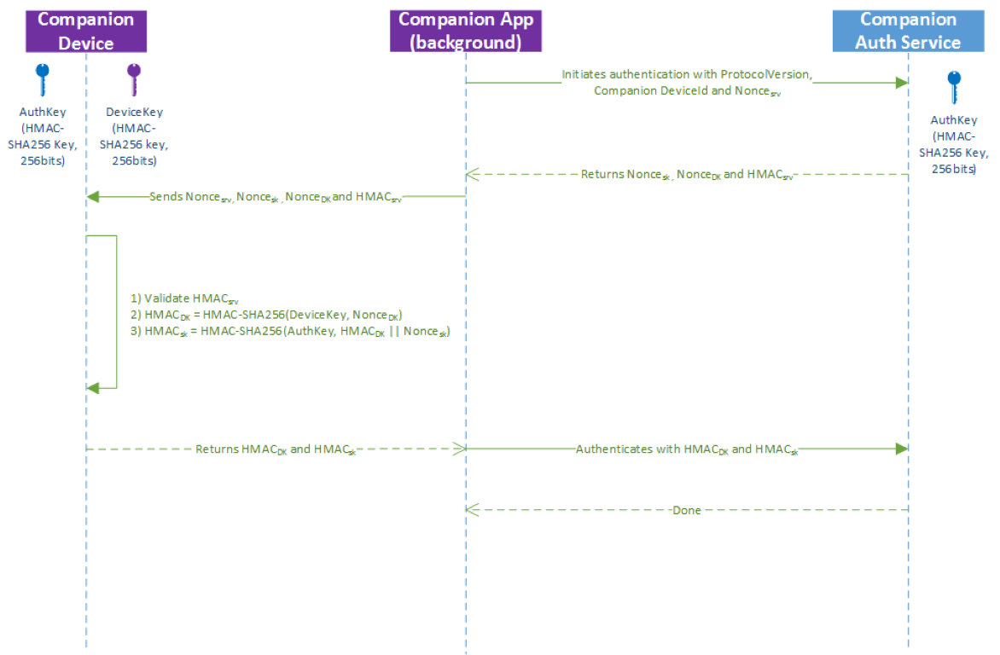

# Desbloqueo de Windows con dispositivos complementarios

Un dispositivo complementario es aquel que puede actuar junto con el escritorio de Windows 10 para mejorar la experiencia de autenticación de usuario. Con el marco de dispositivo complementario, un dispositivo complementario puede proporcionar una experiencia más satisfactoria para Microsoft Passport incluso cuando Windows Hello no está disponible (por ejemplo, si el escritorio de Windows 10 no tiene una cámara para la autenticación facial o el dispositivo lector de huellas digitales).

> **Nota** El marco de dispositivo complementario es una característica especializada no disponible para todos los desarrolladores de aplicaciones. Para usar este marco, la aplicación debe estar aprovisionada específicamente por Microsoft y hacer una lista de la funcionalidad *secondaryAuthenticatorFactor* restringida en su manifiesto. Para obtener una autorización, ponte en contacto con [cdfonboard@microsoft.com](mailto:cdfonboard@microsoft.com). 

## Introducción 

### Casos de uso 

Existen numerosas formas de uso del marco de dispositivo complementario para crear una excelente experiencia de desbloqueo de Windows con un dispositivo complementario. Por ejemplo, los usuarios pueden: 

- Adjuntar su dispositivo complementario a un equipo a través de USB, tocar el botón del dispositivo complementario y desbloquear automáticamente su PC. 
- Llevar un teléfono en el bolsillo que ya está emparejado con su PC por Bluetooth. Recibir una notificación en el teléfono al presionar la barra espaciadora en su PC. Aprobarlo y el equipo simplemente se desbloquea.
- Hacer que el dispositivo complementario toque a un lector NFC para desbloquear rápidamente su PC. 
- Llevar una pulsera de actividad física que ya ha autenticado al usuario. Desbloquear su PC al acercarse y realizar un gesto especial (como aplaudir). 

### Dispositivos complementarios con biometría habilitada 

Si el dispositivo complementario admite biometría, el marco de dispositivo complementario puede usarse solamente si el dispositivo cumple con una de las condiciones siguientes:

- Tiene una interfaz de usuario y un sistema operativo que no sea Windows que puede guiar al usuario a través de inscripción y administración biométrica (por ejemplo, un teléfono con biometría). Si un dispositivo complementario se ejecuta en Windows y admite biometría (cara y huellas digitales), debe cumplir con el [Marco biométrico de Windows](https://msdn.microsoft.com/en-us/library/windows/hardware/mt608302(v=vs.85).aspx). 
- No tiene interfaz de usuario (por ejemplo, una llave USB), pero no usa cara, iris o huella digital. 

Si no se aplica nada de lo anterior y el dispositivo complementario admite biometría, debes seguir las instrucciones para [escenarios de aplicación de Windows Hello OEM e IHV](https://msdn.microsoft.com/en-us/library/windows/hardware/mt608302(v=vs.85).aspx). 

### Componentes de la solución

El siguiente diagrama muestra los componentes de la solución y quién es responsable de su creación. 


El marco de dispositivo complementario se implementa como un servicio que se ejecuta en Windows (denominado servicio de autenticación complementario en este artículo). Este servicio es responsable de generar un token de desbloqueo que debe estar protegido por una clave HMAC almacenada en un dispositivo complementario. Esto garantiza que el acceso al token de desbloqueo necesite la presencia del dispositivo complementario. Por cada tupla (PC, usuario de Windows), habrá un token de desbloqueo único. 

La integración en el marco de dispositivo complementario requiere:

- Una aplicación de dispositivo complementario [Plataforma universal de Windows (UWP)](https://msdn.microsoft.com/en-us/windows/uwp/get-started/universal-application-platform-guide) para el dispositivo complementario, descargada de la tienda de aplicaciones de Windows. 
- La capacidad de crear dos claves HMAC de 256 bits en el dispositivo complementario y generar HMAC con él (mediante SHA-256). 
- Configuración de seguridad en el escritorio Windows 10 configurada correctamente. El servicio de autenticación complementario requerirá este PIN para configurarse antes de que cualquier dispositivo complementario pueda conectarse a él. Los usuarios deben configurar un PIN a través de Configuración > Cuentas > Opciones de inicio de sesión.

Además de los requisitos anteriores, la aplicación de dispositivo complementario es responsable de:

- Experiencia del usuario y personalización del registro inicial y la posterior eliminación del registro del dispositivo complementario.
- Ejecutarse en segundo plano, detectar el dispositivo complementario, comunicarse con el dispositivo complementario y también el servicio de autenticación complementario. 
- Control de errores

Normalmente, los dispositivos complementarios van acompañados de una aplicación para la configuración inicial, como configurar una pulsera de actividad física por primera vez. La funcionalidad descrita en este documento puede formar parte de esa aplicación y no se necesita una aplicación separada.  

### Señales de usuario

Cada dispositivo complementario debe combinarse con una aplicación que admita tres señales de usuario. Estas señales pueden ser acciones o gestos. 

- **Señal de propósito**: permite al usuario mostrar su propósito para desbloquear, por ejemplo, pulsando un botón en el dispositivo complementario. La señal de propósito debe recopilarse en el lado **dispositivo complementario**.
- **Señal de presencia del usuario**: demuestra la presencia del usuario. Por ejemplo, el dispositivo complementario requiere un código PIN antes de que se puede usar para desbloquear el equipo (no confundir con el PIN del equipo) o puede requerir presionar un botón. 
- **Señal de desambiguación**: elimina la ambigüedad de qué escritorio Windows 10 quiere desbloquear el usuario cuando estén disponibles varias opciones para el dispositivo complementario. 

Cualquier cantidad de estas señales de usuario se puede combinar en una. Son necesarias las señales de presencia y propósito del usuario en cada uso. 

### Registro y comunicación futura entre un equipo y dispositivos complementarios

Antes de que un dispositivo complementario se pueda conectar al marco de dispositivo complementario, debe registrarse con el marco. La experiencia de registro pertenece completamente a la aplicación de dispositivo complementario. El marco de dispositivo complementario no impone ninguna limitación en esta experiencia de usuario. 

La relación registrada entre el dispositivo complementario y el dispositivo con escritorio Windows 10 puede ser de uno a varios (es decir, un dispositivo complementario puede usarse en muchos dispositivos con escritorio Windows 10). Sin embargo, cada dispositivo complementario solo puede usarse para un usuario en cada dispositivo con escritorio Windows 10.   

Antes de que un dispositivo complementario pueda comunicarse con un equipo, deben acordar qué transporte usarán. Esta decisión la toma la aplicación de dispositivo complementario; el marco de dispositivo complementario no impone ninguna limitación en el tipo de transporte (USB, NFC, Wi-Fi, BT, BLE, etc.) o en el protocolo que se usa entre el dispositivo complementario y la aplicación de dispositivo complementario en el lado del dispositivo con escritorio Windows 10. Sin embargo, sugiere ciertas consideraciones de seguridad para la capa de transporte como se describe en la sección "Requisitos de seguridad" de este documento. Es responsabilidad del proveedor del dispositivo proporcionar estos requisitos. El marco no te los proporciona.


## Modelo de interacción del usuario 

### Detección de la aplicación del dispositivo complementario, instalación y registro inicial 

Un flujo de trabajo de usuario típico es el siguiente:

- El usuario configura el PIN en cada uno de los dispositivos de destino con escritorio Windows 10 que desea desbloquear con ese dispositivo complementario.
- El usuario ejecuta la aplicación de dispositivo complementario en su dispositivo con escritorio Windows 10 para registrar su dispositivo complementario con escritorio Windows 10. 

Notas: 

- Te recomendamos que la detección, la descarga y el inicio de la aplicación de dispositivo complementario sea mejorada y, si es posible, automatizada (por ejemplo, la aplicación puede descargarse al hacer que la aplicación de dispositivo complementario toque a un lector NFC en el lado del dispositivo con escritorio Windows 10). Sin embargo, es responsabilidad del dispositivo complementario y de la aplicación de dispositivo complementario.
- En un entorno empresarial, se puede implementar la aplicación de dispositivo complementario a través de MDM. 
- La aplicación de dispositivo complementario es responsable de mostrar al usuario los mensajes de error que se produzcan como parte del registro.

### Protocolo de registro y eliminación del registro

El siguiente diagrama ilustra cómo el dispositivo complementario interactúa con el servicio de autenticación complementario durante el registro.  


Hay dos claves que se usan en nuestro protocolo:

- La clave de dispositivo (**devicekey**): sirve para proteger los tokens de desbloqueo que necesita el equipo para desbloquear Windows. 
- La clave de autenticación (**authkey**): sirve para autenticar mutuamente el dispositivo complementario y el servicio de autenticación complementario. 

La clave de dispositivo y las claves de autenticación se intercambian durante el registro entre la aplicación de dispositivo complementario y el dispositivo complementario. Como resultado, la aplicación de dispositivo complementario y el dispositivo complementario deben usar un transporte seguro para proteger las claves. 

Además, ten en cuenta que, aunque el diagrama anterior muestra dos claves HMAC que se generan en el dispositivo complementario, también es posible que la aplicación las genere y las envíe al dispositivo complementario para almacenarlas. 

### Iniciar el flujo de autenticación

Existen dos formas para que el usuario inicie el flujo de inicio de sesión a escritorio Windows 10 con el marco de dispositivo complementario (es decir, proporcionar señal de propósito):

- Abrir la tapa del portátil, presionar espacio o deslizar el dedo hacia arriba en el equipo. 
- Hacer un gesto o una acción en el lado del dispositivo complementario. 

Es decisión del dispositivo complementario seleccionar cuál es el punto de partida. El marco de dispositivo complementario notificará a la aplicación de dispositivo complementario cuando se produzca la primera opción. Para la segunda opción, la aplicación de dispositivo complementario debe consultar al dispositivo complementario si se ha capturado ese evento. Así se garantiza que el dispositivo complementario recopila la señal de propósito antes de que se desbloquee correctamente. 

### Proveedor de credenciales de dispositivo complementario

Hay un nuevo proveedor de credenciales en Windows 10 que controla todos los dispositivos complementarios. 

El proveedor de credenciales de dispositivo complementario es responsable de iniciar la tarea en segundo plano del dispositivo complementario activando un desencadenador. El desencadenador se establece por primera vez cuando el equipo se reactiva y se muestra una pantalla de bloqueo. La segunda vez es cuando el equipo está entrando en la interfaz de usuario de inicio de sesión y el proveedor de credenciales de dispositivo complementario es el icono seleccionado. 

La biblioteca auxiliar de la aplicación de dispositivo complementario escuchará el cambio de estado de la pantalla de bloqueo y enviará el evento correspondiente a la tarea en segundo plano del dispositivo complementario.

Si hay varias tareas en segundo plano en el dispositivo complementario, la primera tarea en segundo plano que ha finalizado el proceso de autenticación desbloqueará el equipo. El servicio de autenticación de dispositivo complementario omitirá cualquier otra llamada de autenticación. 

La aplicación de dispositivo complementario posee y administra la experiencia en el lado del dispositivo complementario. El marco de dispositivo complementario no tiene control sobre esta parte de la experiencia del usuario. En concreto, el proveedor de autenticación complementario informa a la aplicación de dispositivo complementario (a través de su aplicación en segundo plano) de los cambios de estado en la interfaz de usuario de inicio de sesión (por ejemplo, se ha bajado la pantalla de bloqueo o el usuario ha quitado la pantalla de bloqueo al presionar la barra espaciadora) y es responsabilidad de la aplicación de dispositivo complementario crear una experiencia después (por ejemplo, al pulsar el usuario la barra espaciadora y quitar la pantalla, empezar a buscar el dispositivo por USB). 

El marco de dispositivo complementario proporcionará un valor de texto (localizado) y mensajes de error para que la aplicación de dispositivo complementario elija. Se mostrará en la parte de arriba de la pantalla de bloqueo (o en la interfaz de usuario de inicio de sesión). Consulta la sección Resolver mensajes y errores para obtener más detalles.

### Protocolo de autenticación

Una vez que se ha iniciado la tarea en segundo plano asociada a una aplicación de dispositivo complementario, es responsable de pedir al dispositivo complementario que ayude a calcular dos valores HMAC: 
- El HMAC de la clave de dispositivo con un nonce. 
- El HMAC de la clave de autenticación con el primer valor HMAC concatenado con un nonce generado por el servicio de autenticación complementario. 

El servicio usa el segundo valor para autenticar el dispositivo y también evitar ataques de reproducción en el canal de transporte.



## Administración de ciclos de vida 

### Regístrate una vez, úsalo en todas partes

Sin un servidor backend, los usuarios deben registrar su dispositivo complementario por separado con cada dispositivo con escritorio Windows 10.

Un fabricante de dispositivo complementario o un OEM puede implementar un servicio web para mover el estado del registro se muevan entre los escritorios Windows 10 del usuario o sus dispositivos móviles. Para obtener más información, consulta la sección Itinerancia, revocación y servicio de filtro.

### Administración del PIN

Antes de que se pueda usar un dispositivo complementario, debe configurarse un PIN en el dispositivo con escritorio Windows 10. Así se garantiza que el usuario tenga una copia de seguridad si su dispositivo complementario no funcionara. El PIN es algo que Windows administra y que las aplicaciones nunca ven. Para cambiarlo, el usuario debe navegar a Configuración > Cuentas > Opciones de inicio de sesión. 

### Administración y directivas

Los usuarios pueden eliminar un dispositivo complementario desde escritorios Windows 10 ejecutando la aplicación de dispositivo complementario en ese dispositivo de escritorio. 

Las empresas tienen dos opciones para controlar el marco de dispositivo complementario: 

- Activar o desactivar la característica
- Definir la lista blanca de dispositivos complementarios permitidos usando el almacén de la aplicación de Windows

El marco de dispositivo complementario no admite cualquier forma centralizada de mantener el inventario de dispositivos complementarios disponibles o un método para filtrar qué instancias de un tipo de dispositivo complementario están permitidas (por ejemplo, solo se permite un dispositivo complementario con el número de serie entre X e Y). Sin embargo, los desarrolladores de aplicaciones pueden crear un servicio para proporcionar esta funcionalidad. Para obtener más información, consulta la sección Itinerancia, revocación y servicio de filtro.

### Revocación

El marco de dispositivo complementario no permite eliminar remotamente un dispositivo complementario desde un dispositivo concreto con escritorio Windows 10. En su lugar, los usuarios pueden eliminar el dispositivo complementario con la aplicación de dispositivo complementario que se ejecuta en ese escritorio Windows 10. 

Sin embargo, los fabricantes de dispositivos complementarios pueden crear un servicio para proporcionar la funcionalidad de revocación remota. Para obtener más información, consulta la sección Itinerancia, revocación y servicio de filtro.

### Itinerancia y servicios de filtro

Los fabricantes de dispositivos complementarios pueden implementar un servicio web que puede usarse para los siguientes escenarios:

- Un servicio de filtro para empresa: una empresa puede limitar el conjunto de dispositivos complementarios que puedan trabajar en su entorno a solo unos seleccionados de un fabricante específico. Por ejemplo, la empresa Contoso podría solicitar 10 000 dispositivos complementarios del modelo Y al fabricante X y asegurarse de que solo esos dispositivos trabajarán en el dominio Contoso (y no cualquier otro modelo de dispositivo del fabricante X).
- Inventario: Una empresa puede determinar la lista de dispositivos complementarios existentes usados en un entorno empresarial.
- Revocación en tiempo real: si un empleado informa de la pérdida o robo de su dispositivo complementario, el servicio web puede usarse para revocar ese dispositivo.
- Itinerancia: Un usuario solo tiene que registrar su dispositivo complementario una vez y funcionará en todos sus escritorios Windows 10 y Windows Mobile.

Implementar estas características requiere que la aplicación de dispositivo complementario compruebe con el servicio web cuando se registre o se use. Se puede optimizar la aplicación de dispositivo complementario para escenarios de inicio de sesión almacenada en caché como necesitar comprobar con el servicio web solo una vez al día (a costa de extender el tiempo de revocación hasta un día).  

## Modelo API de marco de dispositivo complementario

### Información general

Una aplicación complementaria debe contener dos componentes: una aplicación en primer plano con interfaz de usuario responsable de registrar y anular el registro del dispositivo y una tarea en segundo plano que controla la autenticación.

El flujo general de API es el siguiente:

1. Registrar el dispositivo complementario
    * Comprobar que el dispositivo está cerca y consultar su funcionalidad de consulta (si fuera necesario)
    * Generar dos claves HMAC (ya sea en el lado del dispositivo complementario o en el de la aplicación)
    * Llamar a RequestStartRegisteringDeviceAsync
    * Llamar FinishRegisteringDeviceAsync
    * Comprobar que la aplicación de dispositivo complementario almacena las claves HMAC (si las admite) y que la aplicación de dispositivo complementario descarta sus copias
2. Registrar tu tarea en segundo plano
3. Esperar al evento correcto en la tarea en segundo plano
    * WaitingForUserConfirmation: Esperar a este evento si fuera necesario el gesto o acción del usuario en el lado del dispositivo complementario para iniciar el flujo de autenticación
    * CollectingCredential: Esperar a este evento si el dispositivo complementario se basa en una acción o gesto del usuario en el lado del equipo para iniciar el flujo de autenticación (por ejemplo, presionar la barra espaciadora)
    * Otro desencadenador, como una tarjeta inteligente: Comprobar que consulta el estado actual de autenticación para llamar a las API correctas. 
4. Mantener informado al usuario sobre los mensajes de error o los siguientes pasos necesarios llamando a ShowNotificationMessageAsync. Solo llama a esta API una vez ha recopilado una señal de propósito
5. Desbloquear
    * Comprobar que las señales de propósito y presencia del usuario se han recopilado
    * Llamar a StartAuthenticationAsync
    * Comunicarse con el dispositivo complementario para realizar las operaciones de HMAC necesarias
    * Llamar a FinishAuthenticationAsync
6. Anular el registro de un dispositivo complementario cuando el usuario lo solicite (por ejemplo, si ha perdido su dispositivo complementario)
    * Enumerar el dispositivo complementario para el usuario que inició sesión a través de FindAllRegisteredDeviceInfoAsync
    * Anular el registro con UnregisterDeviceAsync

### Registrar y eliminar el registro

El registro requiere dos llamadas API al servicio de autenticación complementario: RequestStartRegisteringDeviceAsync y FinishRegisteringDeviceAsync.

Antes de realizar cualquiera de estas llamadas, la aplicación de dispositivo complementario debe comprobar que el dispositivo complementario esté disponible. Si el dispositivo complementario es responsable de generar las claves HMAC (claves de autenticación y del dispositivo), la aplicación de dispositivo complementario también debe pedir al dispositivo complementario que las genere antes de realizar cualquiera de las dos llamadas anteriores. Si la aplicación de dispositivo complementario es responsable de generar las claves HMAC, deberá hacerlo antes de hacer las dos llamadas anteriores.

Además, como parte de la primera llamada API (RequestStartRegisteringDeviceAsync), la aplicación de dispositivo complementario debe decidir sobre la funcionalidad del dispositivo y estar preparada para pasarla como parte de la llamada API, por ejemplo, si el dispositivo complementario admite almacenamiento seguro para claves HMAC. Si se usa la misma aplicación de dispositivo complementario para administrar varias versiones del mismo dispositivo complementario y esas funcionalidades cambian (y requiere una consulta al dispositivo para decidir), recomendamos que esta consulta se produzca antes de que se haga la primera llamada API.   

La primera API (RequestStartRegisteringDeviceAsync) devolverá un identificador que usa la segunda API (FinishRegisteringDeviceAsync). La primera llamada de registro iniciará la petición de PIN para comprobar que el usuario está presente. Si no se configura un PIN, se producirá un error en esta llamada. La aplicación de dispositivo complementario puede consultar también si el PIN está configurado o no a través de la llamada de KeyCredentialManager.IsSupportedAsync. Se puede producir un error en la llamada RequestStartRegisteringDeviceAsync si la directiva ha deshabilitado el uso del dispositivo complementario. 

Se devuelve el resultado de la primera llamada a través de la enumeración SecondaryAuthenticationFactorRegistrationStatus:

```C#
{
    Failed = 0,         // Something went wrong in the underlying components
    Started,            // First call succeeded
    CanceledByUser,     // User cancelled PIN prompt
    PinSetupRequired,   // PIN is not set up
    DisabledByPolicy,   // Companion device framework or this app is disabled
}
```

La segunda llamada (FinishRegisteringDeviceAsync) termina el registro. Como parte del proceso de registro, la aplicación de dispositivo complementario puede almacenar datos de configuración del dispositivo complementario con el servicio de autenticación complementario. Hay un límite de tamaño de 4K para estos datos. Estos datos estarán disponibles para la aplicación de dispositivo complementario en el momento de la autenticación. Estos datos pueden usarse, por ejemplo, para conectarse al dispositivo complementario, como una dirección MAC, o si el dispositivo complementario no tiene almacenamiento y el dispositivo complementario quiere usar el equipo como almacenamiento, pueden usarse los datos de configuración. Ten en cuenta que todos los datos sensibles almacenados como parte de los datos de configuración deben estar cifrados con una clave que solo sepa el dispositivo complementario. Además, dado que un servicio de Windows almacena los datos de configuración, están disponibles para la aplicación de dispositivo complementario a través de los perfiles de usuario. 

La aplicación de dispositivo complementario puede llamar a AbortRegisteringDeviceAsync para cancelar el registro y pasar un código de error. El servicio de autenticación complementario registrará el error en los datos de telemetría. Un buen ejemplo de esta llamada sería cuando se produjo un error con el dispositivo complementario y no se pudo terminar el registro (por ejemplo, no se pudieron almacenar las claves HMAC o se perdió la conexión de BT). 

La aplicación de dispositivo complementario debe proporcionar una opción para que el usuario elimine el registro de su dispositivo complementario de su escritorio Windows 10 (por ejemplo, si perdiera su dispositivo complementario o comprara una versión más reciente). Cuando el usuario selecciona esta opción, la aplicación de dispositivo complementario debe llamar a UnregisterDeviceAsync. Esta llamada de la aplicación de dispositivo complementario hará que el servicio de autenticación de dispositivo complementario elimine todos los datos (incluidas las claves HMAC) correspondientes al identificador específico del dispositivo y al AppId de la aplicación que llama del lado del equipo. Esta llamada API no intenta eliminar las claves HMAC de la aplicación de dispositivo complementario o del lado del dispositivo complementario. Se deja para que la aplicación de dispositivo complementario lo implemente. 

La aplicación de dispositivo complementario es responsable de mostrar los mensajes de error que se produzcan en la fase de registro y eliminación del registro. 

```C#
using System;
using Windows.Security.Authentication.Identity.Provider;
using Windows.Storage.Streams;
using Windows.Security.Cryptography;
using Windows.UI.Popups;

namespace SecondaryAuthFactorSample
{
    public class DeviceRegistration
    {

        public void async OnRegisterButtonClick()
        {
            //
            // Pseudo function, the deviceId should be retrieved by the application from the device
            //
            string deviceId = await ReadSerialNumberFromDevice();

            IBuffer deviceKey = CryptographicBuffer.GenerateRandom(256/8);
            IBuffer mutualAuthenticationKey = CryptographicBuffer.GenerateRandom(256/8);

            SecondaryAuthenticationFactorRegistration registrationResult = 
                await SecondaryAuthenticationFactorRegistration.RequestStartRegisteringDeviceAsync(
                    deviceId,  // deviceId: max 40 wide characters. For example, serial number of the device
                    SecondaryAuthenticaitonFactorDeviceCapabilities.SupportSecureStorage | 
                        SecondaryAuthenticaitonFactorDeviceCapabilities.SupportSha2 | 
                        SecondaryAuthenticaitonFactorDeviceCapabilities.StoreKeys,
                    "My test device 1", // deviceFriendlyName: max 64 wide characters. For example: John's card
                    "SAMPLE-001", // deviceModelNumber: max 32 wide characters. The app should read the model number from device.
                    deviceKey,
                    mutualAuthenticationKey);

            switch(registerResult.Status)
            {
            case SecondaryAuthenticationFactorRegistrationStatus.Started:
                // 
                // Pseudo function:
                // The app needs to retrieve the value from device and set into opaqueBlob
                // 
                IBuffer deviceConfigData = ReadConfigurationDataFromDevice();

                if (deviceConfigData != null)
                {
                    await registrationResult.Registration.FinishRegisteringDeviceAsync(deviceConfigData); //config data limited to 4096 bytes
                    MessageDialog dialog = new MessageDialog("The device is registered correctly.");
                    await dialog.ShowAsync();
                }
                else
                {
                    await registrationResult.Registration.AbortRegisteringDeviceAsync("Failed to connect to the device");
                    MessageDialog dialog = new MessageDialog("Failed to connect to the device.");
                    await dialog.ShowAsync();
                }
                break;

            case SecondaryAuthenticationFactorRegistrationStatus.CanceledByUser:
                MessageDialog dialog = new MessageDialog("You didn't enter your PIN.");
                await dialog.ShowAsync();
                break;

            case SecondaryAuthenticationFactorRegistrationStatus.PinSetupRequired:
                MessageDialog dialog = new MessageDialog("Please setup PIN in settings.");
                await dialog.ShowAsync();
                break;

            case SecondaryAuthenticationFactorRegistrationStatus.DisabledByPolicy:
                MessageDialog dialog = new MessageDialog("Your enterprise prevents using this device to sign in.");
                await dialog.ShowAsync();
                break;
            }
        }

        public void async UpdateDeviceList()
        {
            IReadOnlyList<SecondaryAuthenticationFactorInfo> deviceInfoList = 
                await SecondaryAuthenticationFactorRegistration.FindAllRegisteredDeviceInfoAsync(
                    SecondaryAuthenticaitonFactorDeviceFindScope.User);

            if (deviceInfoList.Count > 0)
            {
                foreach (SecondaryAuthenticationFactorInfo deviceInfo in deviceInfoList)
                {
                    //
                    // Add deviceInfo.FriendlyName and deviceInfo.DeviceId into a combo box
                    //
                }
            }
        }

        public void async OnUnregisterButtonClick()
        {
            string deviceId;
            //
            // Read the deviceId from the selected item in the combo box
            //
            await SecondaryAuthenticationFactorRegistration.UnregisterDeviceAsync(deviceId);
        }
    }
}
```

### Autenticación

La autenticación requiere dos llamadas API al servicio de autenticación complementario: StartAuthenticationAsync y FinishAuthencationAsync. 

El primer inicio API devolverá un identificador que usará la segunda API.  La primera llamada devuelve, entre otras cosas, un nonce que, cuando se concatene con otras cosas, debe ser cifrado por HMAC con la clave del dispositivo almacenada en el dispositivo complementario. La segunda llamada devuelve los resultados de HMAC con la clave del dispositivo y pueden acabar potencialmente en una autenticación correcta (es decir, el usuario podrá ver su escritorio).

Se puede producir un error en el primer inicio API (StartAuthenticationAsync) si la directiva ha deshabilitado ese dispositivo complementario después del registro inicial. También se puede producir un error si se hizo la llamada API fuera de los estados WaitingForUserConfirmation o CollectingCredential (hablaremos de esto más adelante en esta sección). También se puede producir un error si una aplicación de dispositivo complementario no registrada hace la llamada. La enumeración SecondaryAuthenticationFactorAuthenticationStatus resume los posibles resultados:

```C#
{
    Failed = 0,                     // Something went wrong in the underlying components
    Started,
    UnknownDevice,                  // Companion device app is not registered with framework
    DisabledByPolicy,               // Policy disabled this device after registration
    InvalidAuthenticationStage,     // Companion device framework is not currently accepting
                                    // incoming authentication requests 
}
```

Se puede producir un error en la segunda llamada API (FinishAuthencationAsync) si el nonce que se proporcionó en la primera llamada expiró (20 segundos). La enumeración SecondaryAuthenticationFactorFinishAuthenticationStatus captura posibles resultados. 

```C#
{
    Failed = 0,     // Something went wrong in the underlying components
    Completed,      // Success
    NonceExpired,   // Nonce is expired
}
```

Los tiempos de dos llamadas API (StartAuthenticationAsync y FinishAuthencationAsync) necesitan alinearse con cómo el dispositivo complementario recopila las señales de propósito, presencia del usuario y desambiguación (consulta Señales de usuario para obtener más detalles). Por ejemplo, la segunda llamada no debe enviarse hasta que la señal de propósito esté disponible. En otras palabras, el equipo no debe desbloquearse si el usuario no ha expresado su propósito. Para aclararlo, supongamos que se usa la proximidad de Bluetooth para desbloquear el equipo, entonces es necesario recopilar una señal de propósito explícita porque, de lo contrario, cuando el usuario pase cerca de su PC de camino a la cocina, el equipo se desbloquearía. Además, el nonce devuelto de la primera llamada está controlado por tiempo (20 segundos) y expirará después de un período determinado. Como resultado, la primera llamada solo debe realizarse cuando la aplicación de dispositivo complementario tiene buena indicación de la presencia de un dispositivo complementario, por ejemplo, el dispositivo complementario está insertado en un puerto USB o toca a un lector NFC. Con Bluetooth, debe tenerse cuidado para evitar que afecte a la batería en el lado del equipo o a otras actividades de Bluetooth que estén funcionando en ese momento durante la comprobación de la presencia de dispositivo complementario. Además, si la señal de presencia del usuario debe proporcionarse (por ejemplo, escribiendo un PIN), es recomendable que la primera llamada de autenticación se realice solo después de que se haya recopilado esa señal.

El marco de dispositivo complementario ayuda a la aplicación de dispositivo complementario a tomar una decisión bien fundada de cuando hacer las dos llamadas anteriores y proporciona una imagen completa de dónde está el usuario en el flujo de autenticación. El marco de dispositivo complementario proporciona esta funcionalidad notificando cambios de estado de bloqueo a la tarea de segundo plano de la aplicación. 


Los detalles de cada uno de los estados son los siguientes: 

| Estado                         | Descripción                                                                                                                                                                                                                                                                                                                                                                                                                                                                                                                                                                                                                                                                                                                                                                                                                                                                                                               |
|----------------------------   |-----------------------------------------------------------------------------------------------------------------------------------------------------------------------------------------------------------------------------------------------------------------------------------------------------------------------------------------------------------------------------------------------------------------------------------------------------------------------------------------------------------------------------------------------------------------------------------------------------------------------------------------------------------------------------------------------------------------------------------------------------------------------------------------------------------------------------------------------------------------------------------------------------------------------    |
| WaitingForUserConfirmation    | Este evento de notificación de cambio de estado se activa cuando se baja la pantalla de bloqueo (por ejemplo, el usuario presionó Windows + L). Te recomendamos que no solicites ningún mensaje de error relacionado con problemas al encontrar un dispositivo en este estado. En general, recomendamos mostrar los mensajes solo cuando esté disponible la señal de propósito. La aplicación de dispositivo complementario debe realizar la primera llamada API para autenticar en este estado si el dispositivo complementario recopila la señal de propósito (por ejemplo, haciendo que toque a un lector NFC, pulsando un botón del dispositivo complementario o haciendo un gesto específico, como aplaudir) y la tarea en segundo plano de la aplicación de dispositivo complementario recibe la indicación del dispositivo complementario que la señal de propósito se ha detectado. De lo contrario, si la aplicación de dispositivo complementario se basa en el equipo para iniciar el flujo de autenticación (porque el usuario debe deslizar el dedo hacia arriba en la pantalla de desbloqueo o golpear la barra espaciadora), la aplicación de dispositivo complementario debe esperar al siguiente estado (CollectingCredential).    |
| CollectingCredential          | Este evento de notificación de cambio de estado se activa cuando el usuario abre la tapa del portátil, presiona cualquier tecla del teclado o desliza rápidamente el dedo hacia arriba en la pantalla de desbloqueo. Si el dispositivo complementario se basa en acciones anteriores para iniciar la recopilación de la señal de propósito, la aplicación de dispositivo complementario debe iniciar la recopilación (por ejemplo, mediante una ventana emergente en el dispositivo complementario que pregunta si el usuario quiere desbloquear el equipo). Entonces es cuando se debería proporcionar casos de error si la aplicación de dispositivo complementario necesita al usuario para proporcionar la señal de presencia del usuario en el dispositivo complementario (por ejemplo, escribiendo el PIN en el dispositivo complementario).                                                                                                                                                                                                                                                                                                                                               |
| Suspendingauthentication      | Cuando la aplicación de dispositivo complementario recibe este estado, significa que el servicio de autenticación complementario ha dejado de aceptar solicitudes de autenticación.                                                                                                                                                                                                                                                                                                                                                                                                                                                                                                                                                                                                                                                                                                                                                                              |
| CredentialCollected           | Significa que otra aplicación de dispositivo complementario ha llamado a la segunda API y que el servicio de autenticación complementario está comprobando lo que se envió. En este punto, el servicio de autenticación complementario no aceptará ninguna otra solicitud de autenticación hasta que la que se envió no pase la comprobación. La aplicación de dispositivo complementario debe permanecer conectada hasta que se alcance el siguiente estado.                                                                                                                                                                                                                                                                                                                                                                                                                                                                                                                                   |
| CredentialAuthenticated       | Significa que la credencial enviada funcionó. CredentialAuthenticated tiene un identificador de dispositivo del dispositivo complementario que se conectó correctamente. La aplicación de dispositivo complementario debe comprobarlo para ver si su dispositivo asociado fue el ganador. Si no es así, la aplicación de dispositivo complementario debe evitar mostrar cualquier flujo de autenticación posterior (como mensajes de confirmación en el dispositivo complementario o vibraciones en el dispositivo). Ten en cuenta que si la credencial enviada no funcionó, el estado cambiará a CollectingCredential.                                                                                                                                                                                                                                                                                                                                                                                        |
| StoppoingAuthentication       | La autenticación fue correcta y el usuario vio el escritorio. Hora de terminar la tarea en segundo plano                                                                                                                                                                                                                                                                                                                                                                                                                                                                                                                                                                                                                                                                                                                                                                                                                                          |


Las aplicaciones de dispositivo complementario solo deben llamar a las dos API de autenticación en los primeros dos estados.  Las aplicaciones de dispositivo complementario deben comprobar qué escenario del evento se activa. Existen dos posibilidades: desbloquear o desbloquear posteriormente. Actualmente, solo se puede desbloquear. En próximas versiones, puede que estén disponibles escenarios de desbloqueo posterior. La enumeración SecondaryAuthenticationFactorAuthenticationScenario captura estas dos opciones: 

```C#
{
    SignIn = 0,         // Running under lock screen mode 
    CredentialPrompt,   // Running post unlock 
}
```

Completar un ejemplo de código 

```C#
using System;
using Windows.Security.Authentication.Identity.Provider;
using Windows.Storage.Streams;
using Windows.Security.Cryptography;
using System.Threading;
using Windows.ApplicationModel.Background;

namespace SecondaryAuthFactorSample
{
    public sealed class AuthenticationTask : IBackgroundTask
    {
        private string _deviceId;
        private static AutoResetEvent _exitTaskEvent = new AutoResetEvent(false);
        private static IBackgroundTaskInstance _taskInstance;
        private BackgroundTaskDeferral _deferral;

        private void Authenticate()
        {
            int retryCount = 0;

            while (retryCount < 3)
            {
                //
                // Pseudo code, the svcAuthNonce should be passed to device or generated from device
                //
                IBuffer svcAuthNonce = CryptographicBuffer.GenerateRandom(256/8);
                
                SecondaryAuthenticationFactorAuthenticationResult authResult = await 
                    SecondaryAuthenticationFactorAuthentication.StartAuthenticationAsync(
                        _deviceId,
                        svcAuthNonce);
                if (authResult.Status != SecondaryAuthenticationFactorAuthenticationStatus.Started)
                {
                    SecondaryAuthenticationFactorAuthenticationMessage message;
                    switch (authResult.Status)
                    {
                        case SecondaryAuthenticationFactorAuthenticationStatus.DisabledByPolicy:
                            message = SecondaryAuthenticationFactorAuthenticationMessage.DisabledByPolicy;
                            break;
                        case SecondaryAuthenticationFactorAuthenticationStatus.InvalidAuthenticationStage:
                            // The task might need to wait for a SecondaryAuthenticationFactorAuthenticationStageChangedEvent
                            break;
                        default:
                            return;
                    }

                    // Show error message. Limited to 512 characters wide
                    await SecondaryAuthenticationFactorAuthentication.ShowNotificationMessageAsync(null, message);
                    return;
                }

                // 
                // Pseudo function:
                // The device calculates and returns sessionHmac and deviceHmac
                // 
                await GetHmacsFromDevice(
                    authResult.Authentication.ServiceAuthenticationHmac,
                    authResult.Authentication.DeviceNonce,
                    authResult.Authentication.SessionNonce,
                    out deviceHmac,
                    out sessionHmac);
                if (sessionHmac == null ||
                    deviceHmac == null)
                {
                    await authResult.Authentication.AbortAuthenticationAsync(
                        "Failed to read data from device");
                    return;
                }

                SecondaryAuthenticationFactorFinishAuthenticationStatus status = 
                    await authResult.Authentication.FinishAuthencationAsync(deviceHmac, sessionHmac);
                if (status == SecondaryAuthenticationFactorFinishAuthenticationStatus.NonceExpired)
                {
                    retryCount++;
                    continue;
                }
                else if (status == SecondaryAuthenticationFactorFinishAuthenticationStatus.Completed)
                {
                    // The credential data is collected and ready for unlock
                    return;
                }
            }
        }

        public void OnAuthenticationStageChanged(
            object sender,
            SecondaryAuthenticationFactorAuthenticationStageChangedEventArgs args)
        {
            // The application should check the args.StageInfo.Stage to determine what to do in next. Note that args.StageInfo.Scenario will have the scenario information (SignIn vs CredentialPrompt).

            switch(args.StageInfo.Stage)
            {
            case SecondaryAuthenticationFactorAuthenticationStage.WaitingForUserConfirmation:
                // Show welcome message
                await SecondaryAuthenticationFactorAuthentication.ShowNotificationMessageAsync(
                    null,
                    SecondaryAuthenticationFactorAuthenticationMessage.WelcomeMessageSwipeUp);
                break;

            case SecondaryAuthenticationFactorAuthenticationStage.CollectingCredential:
                // Authenticate device
                Authenticate();
                break;

            case SecondaryAuthenticationFactorAuthenticationStage.CredentialAuthenticated:
                if (args.StageInfo.DeviceId = _deviceId)
                {
                    // Show notification on device about PC unlock
                }
                break;

            case SecondaryAuthenticationFactorAuthenticationStage.StoppingAuthentication:
                // Quit from background task 
                _exitTaskEvent.Set();
                break;
            }

            Debug.WriteLine("Authentication Stage = " + args.StageInfo.AuthenticationStage.ToString());
        }

        //
        // The Run method is the entry point of a background task.
        //
        public void Run(IBackgroundTaskInstance taskInstance)
        {
            _taskInstance = taskInstance;
            _deferral = taskInstance.GetDeferral();

            // Register canceled event for this task
            taskInstance.Canceled += TaskInstanceCanceled;

            // Find all device registred by this application
            IReadOnlyList<SecondaryAuthenticationFactorInfo> deviceInfoList = 
                await SecondaryAuthenticationFactorRegistration.FindAllRegisteredDeviceInfoAsync(
                    SecondaryAuthenticaitonFactorDeviceFindScope.AllUsers);

            if (deviceInfoList.Count == 0)
            {
                // Quit the task silently
                return;
            }
            _deviceId = deviceInfoList[0].DeviceId;
            Debug.WriteLine("Use first device '" + _deviceId + "' in the list to signin");
     
            // Register AuthenticationStageChanged event
            SecondaryAuthenticationFactorRegistration.AuthenticationStageChanged += OnAuthenticationStageChanged;

            // Wait the task exit event
            _exitTaskEvent.WaitOne();

            _deferral.Complete();
        }

        void TaskInstanceCanceled(IBackgroundTaskInstance sender, BackgroundTaskCancellationReason reason)
        {
            _exitTaskEvent.Set();
        }
    }
}
```

### Registrar una tarea en segundo plano

Cuando la aplicación de dispositivo complementario registra el primer dispositivo complementario, también debe registrar su componente de tarea en segundo plano que pasará la información de autenticación entre el dispositivo y el servicio de autenticación del dispositivo complementario.

```C#
using System;
using Windows.Security.Authentication.Identity.Provider;
using Windows.Storage.Streams;
using Windows.ApplicationModel.Background;

namespace SecondaryAuthFactorSample
{
    public class BackgroundTaskManager
    {
        // Register background task
        public static async Task<IBackgroundTaskRegistration> GetOrRegisterBackgroundTaskAsync(
            string bgTaskName,
            string taskEntryPoint)
        {
            // Check if there's an existing background task already registered
            var bgTask = (from t in BackgroundTaskRegistration.AllTasks
                          where t.Value.Name.Equals(bgTaskName)
                          select t.Value).SingleOrDefault();
            if (bgTask == null)
            {
                BackgroundAccessStatus status =
                    BackgroundExecutionManager.RequestAccessAsync().AsTask().GetAwaiter().GetResult();

                if (status == BackgroundAccessStatus.Denied)
                {
                    Debug.WriteLine("Background Execution is denied.");
                    return null;
                }

                var taskBuilder = new BackgroundTaskBuilder();
                taskBuilder.Name = bgTaskName;
                taskBuilder.TaskEntryPoint = taskEntryPoint;
                taskBuilder.SetTrigger(new SecondaryAuthenticationFactorAuthenticationTrigger());
                bgTask = taskBuilder.Register();
                // Background task is registered
            }

            bgTask.Completed += BgTask_Completed;
            bgTask.Progress += BgTask_Progress;

            return bgTask;
        }
    }
}
```

### Errores y mensajes

El marco de dispositivo complementario es responsable de proporcionar comentarios al usuario sobre si se pudo o no iniciar la sesión. El marco de dispositivo complementario proporcionará un valor de texto (localizado) y mensajes de error para que la aplicación de dispositivo complementario elija. Se mostrarán en la interfaz de usuario de inicio de sesión.


Las aplicaciones de dispositivo complementario pueden usar ShowNotificationMessageAsync para mostrar mensajes al usuario como parte de la interfaz de usuario de inicio de sesión. Llamar a esta API cuando esté disponible la señal de propósito. Ten en cuenta que la señal de propósito siempre debe recopilarse en el lado del dispositivo complementario. 

Hay dos tipos de mensajes: instrucciones y errores. 

Los mensajes de instrucciones están diseñados para mostrar al usuario cómo iniciar el proceso de desbloqueo. Estos mensajes solo se muestran al usuario una vez, en el primer registro de dispositivo y después ya no se vuelven a mostrar. 

Siempre se muestran los mensajes de error. Los mensajes de error se mostrarán al usuario durante 5 segundos y después desaparecerán. Dado que la señal de propósito debe recopilarse antes de mostrar mensajes al usuario y el usuario proporcionará esa señal de propósito usando solo un dispositivo complementario, no puede haber una situación en la que varios dispositivos complementarios intenten mostrar mensajes de error. Como resultado, el marco de dispositivo complementario no mantiene ninguna cola. Cuando un llamador solicita un mensaje de error, se mostrará durante 5 segundos y todas las demás solicitudes para mostrar mensajes de error durante esos 5 segundos se descartan. Una vez hayan pasado los 5 segundos, se genera otra oportunidad para que otro llamador muestre el mensaje de error. Prohibimos a cualquier llamador interferir en el canal de error.

Los mensajes de instrucciones y errores son los siguientes. El nombre del dispositivo es un parámetro que pasa la aplicación de dispositivo complementario como parte de ShowNotificationMessageAsync.

**Guía**

- Desliza rápidamente hacia arriba o presiona la barra espaciadora para iniciar sesión con tu *nombre del dispositivo*
- Haz que *nombre del dispositivo* toque al lector NFC para iniciar sesión
- Conecta *nombre del dispositivo* en un puerto USB para iniciar sesión
- Buscando a *nombre del dispositivo*...

**Errores**

- Consulta *nombre del dispositivo* para obtener instrucciones de inicio de sesión
- Conecta *nombre del dispositivo* en un puerto USB para iniciar sesión
- Activa el Bluetooth para usar *nombre del dispositivo* para iniciar sesión
- Activa el NFC para usar *nombre del dispositivo* para iniciar sesión
- Conéctate a una red Wi-Fi para usar *nombre del dispositivo* para iniciar sesión
- Se ha producido un error. Inicia sesión con tu PIN o contraseña y, a continuación, configura *nombre del dispositivo* de nuevo.
- Pulsa *nombre del dispositivo* de nuevo
- Tu empresa impide que inicies sesión con *nombre del dispositivo*. Usa otra opción de inicio de sesión.
- Pulsa *nombre del dispositivo* para iniciar sesión
- Sitúa el dedo sobre *nombre del dispositivo* para iniciar sesión
- Desliza el dedo sobre *nombre del dispositivo* para iniciar sesión
- No se pudo iniciar sesión con *nombre del dispositivo*. Usa otra opción de inicio de sesión. 
- Inténtalo de nuevo
- Introduce tu contraseña en tu *nombre del dispositivo*
- Listo para iniciar sesión con *nombre del dispositivo*


### Enumerando los dispositivos registrados 

La aplicación de dispositivo complementario puede enumerar la lista de dispositivos complementarios registrados llamando a FindAllRegisteredDeviceInfoAsync. Esta API admite dos tipos de consulta definidas a través de la enumeración SecondaryAuthenticaitonFactorDeviceFindScope:

```C#
{
    User = 0,
    AllUsers,
}
```

El primer ámbito devuelve la lista de dispositivos para el usuario que ha iniciado sesión. El segundo devuelve la lista de todos los usuarios en ese PC. Debe usarse el primer ámbito al anular el registro para evitar la anulación del registro del dispositivo complementario de otro usuario. El segundo debe usarse en la autenticación o el registro: en el registro, esta enumeración puede ayudar a la aplicación a evitar que intente registrar dos veces el mismo dispositivo complementario. 

Ten en cuenta que aunque la aplicación no realice esta comprobación, el equipo sí, y rechazará el mismo dispositivo complementario que esté registrado más de una vez. En la autenticación, usar el ámbito AllUsers ayuda a la aplicación de dispositivo complementario a admitir el cambio de flujo de usuario: el usuario A puede iniciar sesión cuando el usuario B ya la ha iniciado (requiere que los dos usuarios tengan instalada la aplicación de dispositivo complementario, que el usuario A haya registrado sus dispositivos complementarios con el equipo y que el equipo esté en la pantalla de bloqueo o en la de inicio de sesión). 
    
## Requisitos de seguridad

El servicio de autenticación complementario proporciona las siguientes protecciones de seguridad.

- El malware de un dispositivo de escritorio Windows 10 que se ejecuta como usuario medio o como contenedor de la aplicación no puede usar el dispositivo complementario para acceder silenciosamente a las claves de credenciales de usuario (almacenadas como parte de Microsoft Passport) en el equipo.
- Un usuario malintencionado usando un dispositivo de escritorio Windows 10 no puede usar el dispositivo complementario de otro usuario en ese dispositivo de escritorio Windows 10 para obtener acceso silencioso a sus claves de credenciales de usuario (en el mismo dispositivo de escritorio Windows 10).
- El malware del dispositivo complementario no puede obtener silenciosamente acceso a las claves de credenciales de usuario en el dispositivo de escritorio Windows 10 o incluir una funcionalidad para sacar provecho o un código desarrollado específicamente para el marco de dispositivo complementario. 
- Un usuario malintencionado no puede desbloquear el dispositivo de escritorio Windows 10 para capturar el tráfico entre el dispositivo complementario y el dispositivo de escritorio Windows 10 y reproducirlo más tarde. El uso de nonce, authkey y HMAC en nuestro protocolo garantiza la protección contra un ataque de reproducción.
- El malware o un usuario malintencionado en un equipo no autorizado no puede usar el dispositivo complementario para obtener acceso al PC de usuario sincero. Se logra mediante la autenticación mutua entre el servicio de autenticación complementario y el dispositivo complementario a través del uso de authkey y HMAC en nuestro protocolo. 

La clave para conseguir las protecciones de seguridad enumeradas anteriormente es proteger las claves HMAC del acceso no autorizado y también comprobar la presencia del usuario. En concreto, deben cumplirse estos requisitos:

- Proporcionar protección contra la clonación del dispositivo complementario
- Proporcionar protección contra interceptaciones cuando se envían las claves HMAC en el registro del equipo
- Comprobar que la señal de presencia del usuario esté disponible. 


<!--HONumber=Mar16_HO5-->


