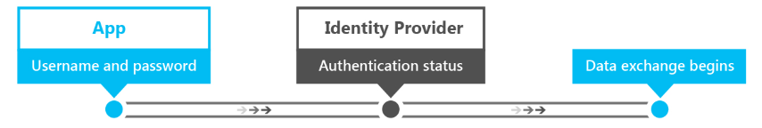
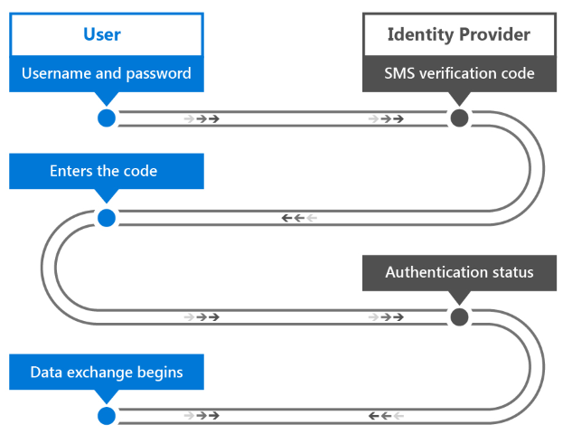
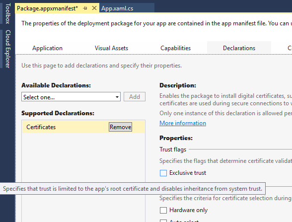

# Introducción al desarrollo seguro de aplicaciones Windows


\[ Actualizado para aplicaciones para UWP en Windows 10. Para leer más artículos sobre Windows 8.x, consulta el [archivo](http://go.microsoft.com/fwlink/p/?linkid=619132) \]


Este artículo de introducción ayuda a los arquitectos y desarrolladores de aplicaciones a comprender las distintas funcionalidades de la plataforma de Windows 10 que aceleran la creación de aplicaciones seguras para la Plataforma universal de Windows (UWP). En él, se ofrecen detalles sobre cómo usar las funciones de seguridad de Windows disponibles en cada una de las siguientes fases: autenticación, datos en desarrollo y datos en reposo. Encontrarás información más detallada sobre cada tema revisando los recursos adicionales que se incluyen en cada capítulo.

## 1 Introducción


El desarrollo de una aplicación segura puede ser desafiante. En el frenético mundo actual de los dispositivos móviles, las redes sociales, la nube y las complejas aplicaciones empresariales, los clientes esperan que las aplicaciones se pongan a su disposición y se actualicen más rápidamente que nunca. También usan muchos tipos de dispositivos, lo que agrega a la complejidad en la creación de experiencias de aplicación. Si creas aplicaciones para la Plataforma universal de Windows para Windows 10 (UWP), se podría incluir la lista tradicional de equipos de escritorio, portátiles, tabletas y dispositivos móviles, además de una creciente lista de dispositivos nuevos que abarcan Internet de las cosas, Xbox One, Microsoft Surface Hub y HoloLens. Como desarrollador, debes asegurarte de que tus aplicaciones comuniquen y almacenen los datos de forma segura, en todas las plataformas o dispositivos implicados.

Estas son algunas de las ventajas de usar las funciones de seguridad de Windows 10.

-   Al usar API coherentes en los componentes y las tecnologías de seguridad, conseguirás una seguridad estandarizada en todos los dispositivos que admiten Windows 10.
-   Escribirás, probarás y mantendrás una menor cantidad de código que la que implica la implementación de código personalizado para cubrir estos escenarios de seguridad.
-   Tus aplicaciones se hacen en más estables y seguras porque el sistema operativo se usa para controlar cómo la aplicación obtiene acceso a sus recursos y los recursos del sistema local o remoto.

Durante la autenticación, se valida la identidad de un usuario que solicita acceso a un servicio concreto. Microsoft Passport y Windows Hello son los componentes de Windows 10 que ayudan a crear un mecanismo de autenticación más seguro en las aplicaciones de Windows. Con ellos, puedes usar un número de identificación personal (PIN) o datos biométricos, como el iris, el rostro o las huellas digitales del usuario, e implementar la autenticación multifactor para tus aplicaciones.

El término "datos en desarrollo" hace referencia a la conexión y los mensajes que se transfieren entre los datos. Un ejemplo de esto es la recuperación de datos de un servidor remoto a través de servicios web. El uso de la Capa de sockets seguros (SSL) y el Protocolo seguro de transferencia de hipertexto (HTTPS) garantiza la seguridad de la conexión. La clave a la hora de proteger los datos en desarrollo es impedir que partes intermediarias accedan a estos mensajes o que aplicaciones no autorizadas se comuniquen con los servicios web.

Por último, el término "datos en reposo" se refiere a los datos que se encuentran en la memoria o en medios de almacenamiento. Windows 10 tiene un modelo de aplicaciones que impide el acceso no autorizado a datos entre aplicaciones y ofrece una API de cifrado para proteger aún más los datos almacenados en el dispositivo. Una función llamada Caja de seguridad de credenciales se puede usar para almacenar las credenciales de usuario de forma segura en el dispositivo, con el sistema operativo que impide que otras aplicaciones accedan a ellos.

## 2 Factores de autenticación


Para proteger los datos, la persona que solicita acceso a ellos se debe identificar y autorizar para acceder a los recursos de datos que solicita. El proceso de identificación de un usuario se denomina autenticación y la determinación de los privilegios de acceso a un recurso se llama autorización. Se trata de dos operaciones estrechamente relacionadas y es posible que el usuario no distinga una de otra. Pueden ser operaciones relativamente simples o complejas, según muchos factores: por ejemplo, si los datos se encuentran en un servidor o se distribuyen entre muchos sistemas. El servidor que proporciona los servicios de autenticación y autorización se conoce como el proveedor de identidades.

Para autenticarse con un servicio o una aplicación determinados, el usuario usa credenciales compuestas de algo que sabe, algo que tiene o algo que es. Cada una de estas se denominan factores de autenticación.

-   **Algo que el usuario conoce** suele ser una contraseña, pero también puede ser un número de identificación personal (PIN) o una combinación "secreta" de pregunta y respuesta.
-   **Algo que el usuario tiene** suele ser un dispositivo de memoria de hardware, por ejemplo, un stick USB, que contiene los datos de autenticación exclusivos del usuario.
-   **Algo que el usuario es** suele incluir sus huellas digitales, pero hay otros factores cada vez más populares, como la voz, el rostro, las características oculares (el ojo) o los patrones de comportamiento del usuario. Cuando se almacenan como datos, estas mediciones se denominan datos biométricos.

Una contraseña creada por el usuario es un factor de autenticación en sí mismo, pero a menudo no es suficiente; cualquier persona que conozca la contraseña puede suplantar al usuario a quien pertenece. Una tarjeta inteligente puede proporcionar un mayor nivel de seguridad, pero te la pueden robar o se puede perder. Un sistema que puede autenticar a un usuario mediante la huella digital o una detección ocular puede proporcionar el nivel de seguridad más alto y práctico, pero requiere hardware costoso y especializado (como una cámara Intel RealSense de reconocimiento facial) que podría no estar al alcance de todos los usuarios.

Diseñar el método de autenticación que usa un sistema es un aspecto importante y complejo de la seguridad de datos. En general, cuantos más factores uses para la autenticación, más seguro será el sistema. Al mismo tiempo, la autenticación debe ser utilizable. Por lo general, un usuario inicia sesión muchas veces al día, por lo que el proceso debe ser rápido. La elección del tipo de autenticación será el equilibrio entre la seguridad y la facilidad de uso; la autenticación de factor único es menos segura y más fácil de usar, mientras que la autenticación multifactor es cada vez más segura y su complejidad aumenta a medida que se agregan factores.

## 2.1 Autenticación de factor único


Este tipo de autenticación se basa en una única credencial de usuario. Suele ser una contraseña, pero también puede ser un número de identificación personal (PIN).

Este es el proceso de autenticación de factor único.

-   El usuario proporciona su nombre de usuario y su contraseña al proveedor de identidades. El proveedor de identidad es el proceso de servidor que comprueba la identidad del usuario.
-   El proveedor de identidades comprueba si el nombre de usuario y la contraseña coinciden con los almacenados en el sistema. En la mayoría de los casos, la contraseña estará cifrada, lo que proporciona seguridad adicional para que otros usuarios no puedan leerla.
-   El proveedor de identidad devuelve un estado de autenticación que indica si la autenticación se realizó correctamente.
-   Si es así, comienza el intercambio de datos. Si no lo es, el usuario debe volver a autenticarse.



Hoy en día, este método de autenticación es el que se usa con más frecuencia en los servicios. También es la forma menos segura de autenticación cuando se usa como el único medio de autenticación. Los requisitos de complejidad de la contraseña, las "preguntas secretas" y los cambios periódicos de contraseña pueden hacer que el uso de contraseñas sea más seguro, pero la responsabilidad de ello recae en los usuarios y no son un obstáculo eficaz contra los piratas informáticos.

El desafío del uso de contraseñas es que es más fácil de adivinarlas correctamente que en los sistemas que tienen más de un factor. Si se roba una base de datos con las cuentas de usuario y la contraseña con hash de una pequeña tienda en Internet, las contraseñas se pueden usar en otros sitios web. Los usuarios suelen reutilizar cuentas continuamente, ya que las contraseñas complejas son difíciles de recordar. Para un departamento de TI, la administración de contraseñas también incluye la complejidad de tener que ofrecen mecanismos de restablecimiento, que requieren actualizaciones de contraseña frecuentes y su almacenamiento seguro.

A pesar de todas sus desventajas, la autenticación de factor único pone el control de la credencial en manos del usuario. La crean y la modifican, y solo se necesita un teclado para el proceso de autenticación. Este es el aspecto principal que distingue la autenticación de factor único de la autenticación multifactor.

## 2.1.1 Agente de autenticación web


Como se explicó anteriormente, uno de los desafíos de la autenticación con contraseña para un departamento de TI es la sobrecarga adicional que implica la administración de la base de los de nombres de usuario y contraseñas, los mecanismos de restablecimiento, etc. Una opción cada vez más popular es depender de proveedores de identidades externos que ofrecen autenticación a través de OAuth, un estándar abierto para la autenticación.

Con OAuth, los departamentos de TI pueden "subcontratar" eficazmente la complejidad que implica el mantenimiento de una base de datos con nombres de usuario y contraseñas, la funcionalidad de restablecimiento de contraseñas, etc., a un proveedor de identidades externo, como Facebook, Twitter o Microsoft.

En estas plataformas los usuarios tienen control total sobre su identidad, pero las aplicaciones pueden solicitar un token del proveedor, después de que el usuario se autentique y con su consentimiento, lo que se puede usar para autorizar usuarios autenticados.

El agente de autenticación web en Windows 10 proporciona un conjunto de API e infraestructura para que las aplicaciones usen protocolos de autenticación y autorización, como OAuth y OpenID. Las aplicaciones pueden iniciar operaciones de autenticación a través de las API de [**WebAuthenticationBroker**](https://msdn.microsoft.com/library/windows/apps/br227025), lo que da como resultado la devolución de un objeto [**WebAuthenticationResult**](https://msdn.microsoft.com/library/windows/apps/br227038). En la siguiente ilustración se muestra una visión general del flujo de comunicación.


La aplicación actúa como el agente e inicia la autenticación con el proveedor de identidades a través de un objeto [**WebView**](https://msdn.microsoft.com/library/windows/apps/br227702) en la aplicación. Cuando el proveedor de identidad ha autenticado al usuario, devuelve un token a la aplicación que puede usarse para solicitar información sobre el usuario del proveedor de identidad. Como medida de seguridad, la aplicación debe registrarse ante el proveedor de identidades para poder negociar los procesos de autenticación con el proveedor de identidades. Los pasos de registro son diferentes para cada proveedor.

Este es el flujo de trabajo general para llamar a la API de [**WebAuthenticationBroker**](https://msdn.microsoft.com/library/windows/apps/br227025) y comunicarse con el proveedor.

-   Construye las cadenas de solicitud para enviarlas al proveedor de identidades. El número de cadenas y la información de cada cadena son diferentes para cada servicio web, pero normalmente se incluyen dos cadenas URI cada una con una dirección URL: una a la que se enviará la solicitud de autenticación y una a la que se redirigirá el usuario cuando se complete la autorización.
-   Llama a [**WebAuthenticationBroker.AuthenticateAsync**](https://msdn.microsoft.com/library/windows/apps/br212066), pasa las cadenas de solicitud y espera la respuesta del proveedor de identidad.
-   Llama a [**WebAuthenticationResult.ResponseStatus**](https://msdn.microsoft.com/library/windows/apps/br227041) para obtener el estado cuando se reciba la respuesta.
-   Si la comunicación es correcta, procesa la cadena de respuesta que ha devuelto el proveedor de identidad. Si no lo es, procesa el error.

Si la comunicación es correcta, procesa la cadena de respuesta que ha devuelto el proveedor de identidad. Si no lo es, procesa el error.

Código C# de muestra que, para este proceso, se incluye a continuación. Para obtener información y un tutorial detallado, consulta [WebAuthenticationBroker](web-authentication-broker.md). Para obtener una muestra de código completa, echa un vistazo a la [muestra de WebAuthenticationBroker en GitHub](http://go.microsoft.com/fwlink/p/?LinkId=620622).

```cs
string startURL = "https://<providerendpoint>?client_id=<clientid>;
string endURL = "http://<appendpoint>";

var startURI = new System.Uri(startURL);
var endURI = new System.Uri(endURL);

try
{
    WebAuthenticationResult webAuthenticationResult = 
        await WebAuthenticationBroker.AuthenticateAsync( 
            WebAuthenticationOptions.None, startURI, endURI);

    switch (webAuthenticationResult.ResponseStatus)
    {
        case WebAuthenticationStatus.Success:
            // Successful authentication. 
            break;
        case WebAuthenticationStatus.ErrorHttp:
            // HTTP error. 
            break;
        default:
            // Other error.
        break;
    }
}
catch (Exception ex)
{
    // Authentication failed. Handle parameter, SSL/TLS, and
    // Network Unavailable errors here. 
}
```

## 2.2 Autenticación multifactor


La autenticación multifactor usa más de un factor de autenticación. Por lo general, "algo que sabes", como una contraseña, se combina con "algo que tienes", que puede ser un teléfono móvil o una tarjeta inteligente. Incluso si un atacante descubre la contraseña del usuario, seguirá sin poder acceder a la cuenta sin el dispositivo o la tarjeta. Además, si solo se ponen en peligro el dispositivo o la tarjeta, no le servirá de nada sin la contraseña. Por lo tanto, la autenticación multifactor es más segura, aunque mucho más compleja, que la autenticación de factor único.

Con frecuencia, los servicios que usan la autenticación multifactor ofrecerán al usuario la opción de elegir cómo quiere recibir la segunda credencial. Un ejemplo de este tipo de autenticación es un proceso de uso frecuente en el que se envía un código de verificación al teléfono móvil del usuario mediante SMS.

-   El usuario proporciona su nombre de usuario y su contraseña al proveedor de identidades.
-   El proveedor de identidades comprueba el nombre de usuario y la contraseña como en la autorización de factor único y, luego, busca el número de teléfono móvil del usuario almacenado en el sistema.
-   El servidor envía un mensaje SMS que contiene un código de verificación generado al teléfono móvil del usuario.
-   El usuario proporciona el código de verificación al proveedor de identidades a través de un formulario que se le presenta.
-   El proveedor de identidades devuelve un estado de autenticación que indica si la autenticación de ambas credenciales se realizó correctamente.
-   Si es así, comienza el intercambio de datos. De lo contrario, el usuario debe volver a autenticados.



Como puedes ver, este proceso también difiere de la autenticación de factor único, donde la segunda credencial del usuario se envía al usuario en lugar de que este la cree o proporcione. Por lo tanto, el usuario no controla completamente las credenciales necesarias. Esto también se aplica cuando se usa una tarjeta inteligente como segunda credencial: la organización es responsable de crearla y proporcionarla al usuario.

## 2.2.1 Azure Active Directory


Azure Active Directory (Azure AD) es un servicio de identidades y administración de acceso basado en la nube que puede servir como el proveedor de identidades en la autenticación de factor único o multifactor. La autenticación de Azure AD puede usarse con o sin un código de verificación.

Si bien Azure AD también puede implementar la autenticación de factor único, las empresas suelen exigir la mayor seguridad que ofrece la autenticación multifactor. En una configuración de autenticación multifactor, un usuario que realiza la autenticación con una cuenta de Azure AD tiene la opción de recibir un código de verificación en el teléfono móvil en forma de mensaje SMS o en la aplicación móvil Azure Authenticator.

Además, Azure AD se puede usar como proveedor de OAuth, lo que proporciona al usuario estándar un mecanismo de autenticación y autorización para aplicaciones en distintas plataformas. Para más información, consulta [Azure Active Directory](https://azure.microsoft.com/services/active-directory/) y [Autenticación multifactor de Azure](https://azure.microsoft.com/services/multi-factor-authentication/).

## 2.4 Microsoft Passport y Windows Hello


En Windows 10, un mecanismo conveniente de autenticación multifactor está integrado en el sistema operativo. Los dos componentes implicados se denominan Microsoft Passport y Windows Hello. Windows Hello es el nuevo sistema de inicio de sesión biométrico integrado en Windows 10. Dado que está integrado directamente en el sistema operativo, Windows Hello permite la identificación por rostro o huella digital para desbloquear los dispositivos de los usuarios. El almacén de credenciales seguro de Windows protege los datos biométricos en el dispositivo.

Windows Hello ofrece una forma eficaz para que un dispositivo reconozca a un usuario individual y eso aborda la primera parte de la ruta entre un usuario y un elemento de datos o servicio solicitado. Después de que el dispositivo haya reconocido al usuario, aún tiene que autenticarlo antes de determinar si va a conceder acceso a un recurso solicitado. Microsoft Passport proporciona una autenticación en dos fases (2FA) altamente eficaz, totalmente integrada en Windows, y reemplaza las contraseñas reutilizables por la combinación de un dispositivo específico y un gesto biométrico o PIN. El PIN lo especifica el usuario como parte de su inscripción a Microsoft Passport.

No obstante, Microsoft Passport no es tan solo un sustituto de los sistemas 2FA tradicionales. Conceptualmente, es similar a una tarjeta inteligente: la autenticación se realiza mediante primitivas criptográficas en lugar de comparaciones de cadenas y el material de clave del usuario se protege en el interior de hardware resistente a manipulaciones. Microsoft Passport tampoco requiere los componentes de infraestructura adicionales que se necesitan para la implementación de tarjetas inteligentes. En particular, no se necesita una infraestructura de claves públicas (PKI) para administrar los certificados, si no tienes ninguna. Microsoft Passport combina las principales ventajas que ofrecen las tarjetas inteligentes (flexibilidad de implementación de tarjetas inteligentes virtuales y una seguridad eficaz para tarjetas inteligentes físicas) sin ninguna de sus desventajas.

Un dispositivo debe registrarse en Microsoft Passport para que los usuarios puedan autenticarse con él. Microsoft Passport usa el cifrado asimétrico (clave pública y privada) en el que una parte usa una clave pública para cifrar los datos que la otra parte puede descifrar mediante una clave privada. En el caso de Microsoft Passport, crea un conjunto de pares de claves pública y privada y escribe las claves privadas en el chip del Módulo de plataforma segura (TPM) del dispositivo. Después de que el dispositivo se haya registrado, las aplicaciones para UWP pueden llamar a las API del sistema para recuperar la clave pública del usuario, que se puede usar para registrar al usuario en el servidor.

El flujo de trabajo de registro de una aplicación puede ser parecido al siguiente:


Puede que la información de registro que recopiles incluya mucha más información de identificación de lo que se ve este escenario simple. Por ejemplo, si tu aplicación accede a un servicio protegido, como por ejemplo, para la banca, tendrás que solicitar comprobación de la identidad y otras cosas como parte del proceso de suscripción. Cuando se cumplan todas las condiciones, la clave pública de este usuario se almacenará en el back-end y se usará para la validación la próxima vez que el usuario utilice el servicio.

Para información sobre Microsoft Passport y Windows Hello, consulta la [Guía de Microsoft Passport](https://msdn.microsoft.com/library/mt589441) y la [Guía de Microsoft Passport para desarrolladores](microsoft-passport.md).

## 3 Métodos de seguridad de datos en desarrollo


Los métodos de seguridad de datos en desarrollo se aplican a los datos en tránsito entre los dispositivos conectados a una red. Los datos podrían transferirse entre sistemas en el entorno de alta seguridad de una intranet corporativa privada, o entre un cliente y un servicio web en el entorno no seguro de la Web. Las aplicaciones de Windows 10 admiten estándares, como SSL, a través de sus API para redes y funcionan con tecnologías, como por ejemplo, Administración de API de Azure, con las que los desarrolladores pueden garantizar el nivel apropiado de seguridad para sus aplicaciones.

## 3.1 Autenticación de sistema remoto


Existen dos escenarios generales donde la comunicación se produce con un sistema informático remoto.

-   Un servidor local autentica a un usuario a través de una conexión directa. Por ejemplo, cuando el servidor y el cliente están en una intranet corporativa.
-   La comunicación con un servicio web se hace a través de Internet.

Los requisitos de seguridad para la comunicación del servicio web son mayores que los que se aplican en escenarios de conexión directa, ya que los datos no forman parte de una red segura y también es mayor la probabilidad de que atacantes malintencionados busquen interceptar los datos. Dado que distintos tipos de dispositivos accederán al servicio, es probable que puedan compilarse como servicios REST, en lugar de WCF, por ejemplo, lo que significa la autenticación y autorización en el servicio también presentan nuevos desafíos. Analizaremos dos requisitos para la comunicación segura con sistemas remotos.

El primer requisito es la confidencialidad de los mensajes: la información que se transmite entre el cliente y los servicios web (por ejemplo, la identidad del usuario y otra información personal) no debe ser legible para terceros mientras están en tránsito. Esto se suele conseguirse mediante el cifrado de la conexión a través de la que se envían los mensajes, o bien mediante el cifrado del propio mensaje. En el cifrado de claves públicas y privadas, la clave pública está disponible para cualquier persona y se usa para cifrar mensajes se van a enviar a un receptor específico. La clave privada solo la guarda el receptor y se usa para descifrar el mensaje.

El segundo requisito es la integridad de los mensajes: el cliente y el servicio web deben ser capaces de comprobar que los mensajes que reciben son los que se prevé que envíe la otra parte, y que el mensaje no se ha manipulado durante el tránsito. Esto se logra al firmar los mensajes con firmas digitales y mediante la autenticación de certificados.

## 3.2 Conexiones SSL


Para establecer y mantener conexiones seguras a los clientes, los servicios web pueden usar la Capa de sockets seguros (SSL), que es compatible con el Protocolo seguro de transferencia de hipertexto (HTTPS). SSL proporciona confidencialidad e integridad de mensajes al admitir el cifrado de claves públicas, así como certificados de servidor. SSL se reemplazó por la Seguridad de la capa de transporte (TLS), pero TLS con frecuencia se conoce como SSL.

Cuando un cliente solicita acceso a un recurso en un servidor, SSL inicia un proceso de negociación con el servidor. Esto se denomina un protocolo de enlace SSL. Un nivel de cifrado, un conjunto de claves de cifrado pública y privada, y la información de identidad de los certificados de cliente y servidor se acuerdan como base de todas las comunicaciones para la duración de la conexión SSL. El servidor también puede requerir que el cliente se autentique en este momento. Una vez establecida la conexión, todos los mensajes se cifran con la clave pública negociada hasta que se cierra la conexión.

## 3.2.1 Anclaje SSL


Aunque SSL puede proporcionar la confidencialidad de los mensajes mediante el cifrado y los certificados, no hace nada para comprobar que el servidor con el que se comunica el cliente es el correcto. Un tercero no autorizado puede imitar el comportamiento del servidor, e interceptar los datos confidenciales que transmite el cliente. Para evitarlo, se usa una técnica denominada anclaje SSL para comprobar que el certificado en el servidor es aquel que el cliente espera y en el que confía.

Existen varias formas diferentes de implementar el anclaje SSL en las aplicaciones, cada una con sus propias ventajas y desventajas. El método más sencillo es a través de la declaración de certificados del manifiesto del paquete de la aplicación. Esta declaración permite al paquete de la aplicación instalar los certificados digitales y especificar la confianza exclusiva en estos. Como resultado, las conexiones de SSL solo se permiten entre la aplicación y los servidores con los correspondientes certificados en su cadena de certificados. Este mecanismo también permite el uso seguro de certificados autofirmados, ya que no se necesita ninguna dependencia en terceros en las entidades de certificación públicas de confianza.



Para conseguir mayor control sobre la lógica de validación, hay API disponibles para validar los certificados que devuelve el servidor en respuesta a una solicitud HTTP. Ten en cuenta que este método requiere el envío de una solicitud y la inspección de la respuesta, por lo que debes asegurarte de agregarlo como una validación antes de enviar información confidencial realmente en una solicitud.

El siguiente código C# muestra este método de anclaje SSL. El método **ValidateSSLRoot** usa la clase [**HttpClient**](https://msdn.microsoft.com/library/windows/apps/dn298639) para ejecutar una solicitud HTTP. Después de que el cliente envíe la respuesta, usa la colección [**RequestMessage.TransportInformation.ServerIntermediateCertificates**](https://msdn.microsoft.com/library/windows/apps/dn279681) para inspeccionar los certificados que devuelve el servidor. A continuación, el cliente puede validar la cadena de certificados completa con las huellas digitales que ha incluido. Este método requiere que las huellas digitales de los certificados se actualicen en la aplicación una vez que el certificado de servidor expire y se renueve.

```cs
private async Task ValidateSSLRoot()
{
    // Send a get request to Bing
    var httpClient = new HttpClient();
    var bingUri = new Uri("https://www.bing.com");
    HttpResponseMessage response = 
        await httpClient.GetAsync(bingUri);

    // Get the list of certificates that were used to
    // validate the server&#39;s identity
    IReadOnlyList<Certificate> serverCertificates = response.RequestMessage.TransportInformation.ServerIntermediateCertificates;
  
    // Perform validation
    if (!ValidateCertificates(serverCertificates))
    {
        // Close connection as chain is not valid
        return;
    }
    // Validation passed, continue with connection to service
}

private bool ValidateCertificates(IReadOnlyList<Certificate> certs)
{
    // In this example, we iterate through the certificates
    // and check that the chain contains
    // one specific certificate we are expecting
    foreach (var cert in certs)
    {
        byte[] thumbprint = cert.GetHashValue();

        // Check if the thumbprint matches whatever you 
        // are expecting
        var expected = new byte[] { 212, 222, 32, 208, 94, 102, 
            252, 83, 254, 26, 80, 136, 44, 120, 219, 40, 82, 202, 
            228, 116 };

        // ThumbprintMatches does the byte[] comparison 
        if (ThumbprintMatches(thumbprint, expected))
        {
            return true;
        }
    }
    return false;
}
```

## 3.3 Publicación y protección del acceso a las API de REST


Para garantizar el acceso autorizado a los servicios web, debe requerir autenticación cada vez que se realice una llamada de API. Poder controlar el rendimiento y la escala también es algo a tener en cuenta cuando los servicios web se exponen a través de la Web. Administración de API de Azure es un servicio que puede ayudarte a exponer las API en la Web, al tiempo que proporcionan funciones en tres niveles.

Los **editores o administradores** de la API pueden configurarla fácilmente a través del portal para editores de Administración de API de Azure. Aquí, se pueden crear conjuntos de API, además, se puede administrar el acceso a ellos para controlar quién tiene acceso a las API.

Los **desarrolladores** que quieran tener acceso a estas API pueden hacer solicitudes a través del portal para desarrolladores, que puede proporcionar acceso inmediatamente o requerir la aprobación del editor o administrador. Los desarrolladores también pueden ver la documentación y el código de muestra de la API en el portal para desarrolladores con el fin de adoptar rápidamente las API que ofrece el servicio web.

Entonces, las **aplicaciones** que crean estos desarrolladores acceden a la API a través del proxy que ofrece Administración de API de Azure. El proxy proporciona una capa de oscuridad, lo que oculta el punto de conexión real de la API en el servidor del editor o administrador y también puede incluir lógica adicional, como la traducción de API, para garantizar que la API se mantenga coherente cuando una llamada a una API se redirige a otra. También puede usar el filtrado de IP para bloquear las llamadas de API procedentes de un dominio IP específico o un conjunto de dominios. Administración de API de Azure protege sus servicios web mediante un conjunto de claves públicas, denominadas claves de API, para autenticar y autorizar cada llamada de API. Si no se puede realizar la autorización, se bloquearán el acceso a la API y las funciones que admite.

Administración de API de Azure también puede reducir el número de llamadas de API a un servicio (un procedimiento llamado "limitación") para optimizar el rendimiento del servicio web. Para más información, consulta [Administración de API](https://azure.microsoft.com/services/api-management/) y [Azure API Management at AzureCon 2015](https://channel9.msdn.com/events/Microsoft-Azure/AzureCon-2015/ACON313).

## 4 Métodos de seguridad de datos en reposo


Cuando se reciben datos en un dispositivo, nos referimos a estos como "datos en reposo". Estos datos deben almacenarse en el dispositivo de forma segura, para impedir el acceso de usuarios o aplicaciones no autorizados. El modelo de aplicaciones en Windows 10 contribuye enormemente a garantizar que los datos almacenados por cualquier aplicación solo son accesibles para esa aplicación, al tiempo que proporciona las API para compartir datos cuando sea necesario. También existen API adicionales disponibles para garantizar que los datos se puedan cifrar y que las credenciales se puedan almacenar de forma segura.

## 4.1 Modelo de aplicaciones de Windows


Tradicionalmente, Windows nunca ha tenido una definición de una aplicación. Solía denominarse "ejecutable" (.exe), pero esto nunca incluyó la instalación, el almacenamiento de estado, la longitud de ejecución, el control de versiones, la integración del sistema operativo ni la comunicación entre aplicaciones. El modelo de la Plataforma universal de Windows define un modelo de aplicaciones que trata la instalación, el entorno en tiempo de ejecución, la administración de recursos, las actualizaciones, el modelo de datos y la desinstalación.

Las aplicaciones Windows 10 se ejecutan en un contenedor, lo que significa que tienen privilegios limitados de forma predeterminada (el usuario puede solicitar y conceder privilegios adicionales). Por ejemplo, si una aplicación quiere acceder a los archivos del sistema, hay que usar un selector de archivos del espacio de nombres [**Windows.Storage.Pickers**](https://msdn.microsoft.com/library/windows/apps/br207928) para permitir que el usuario seleccione un archivo (no se habilita ningún tipo de acceso directo a los archivos). Otro ejemplo es si una aplicación quiere acceder a los datos de ubicación del usuario, debe permitir la declaración de las necesidades de funcionalidad de ubicación del dispositivo, solicitando al usuario en el momento de la descarga que esta aplicación solicitará acceso a la ubicación del usuario. Además de eso, la primera vez que la aplicación quiera acceder a la ubicación del usuario, se muestra una petición de consentimiento adicional al usuario en la que se pide permiso para acceder a los datos.

Ten en cuenta que este modelo de aplicaciones actúa como una "cárcel" para las aplicaciones, lo que significa que no pueden salir afuera. Sin embargo, no es un "castillo" inaccesible desde el exterior (evidentemente, las aplicaciones con privilegios de administrador aún pueden entrar). Device Guard en Windows 10, que permite a las organizaciones y los departamentos de TI especificar qué aplicaciones (Win32) se pueden ejecutar, puede ayudar aún más a limitar este acceso.

El modelo de aplicaciones también administra el ciclo de vida de las aplicaciones. Limita la ejecución en segundo plano de las aplicaciones de manera predeterminada. Por ejemplo, tan pronto como una aplicación pasa a segundo plano, el proceso se suspende (después de dar a la aplicación un período breve para tratar la suspensión de la aplicación en el código) y su memoria se inmoviliza. El sistema operativo proporciona mecanismos para que las aplicaciones pida la ejecución en segundo plano de tareas concretas (en una programación, desencadenada por diversos eventos, como conectividad Internet o Bluetooth, cambios de energía, etc., y en escenarios específicos, como la reproducción de música o el seguimiento de GPS).

Cuando se están agotando los recursos de memoria en el dispositivo, Windows finaliza aplicaciones para liberar espacio de memoria. Este modelo de ciclo de vida obliga a las aplicaciones a conservar los datos siempre que entran en suspensión, porque hay tiempo adicional disponible entre la suspensión y finalización.

Para más información, consulta [It's Universal: Understanding the Lifecycle of a Windows 10 Application](https://visualstudiomagazine.com/articles/2015/09/01/its-universal.aspx).

## 4.2 Protección de credenciales almacenadas


Las aplicaciones de Windows que acceden a servicios autenticados suelen proporcionar a los usuarios la opción de almacenar sus credenciales en el dispositivo local. Esto resulta útil para los usuarios; al proporcionar su nombre de usuario y contraseña, la aplicación los usa automáticamente en inicios posteriores de la aplicación. Dado que puede ser un problema de seguridad si un atacante obtiene acceso a los datos almacenados, Windows 10 ofrece la posibilidad de que las aplicaciones de Windows almacenen las credenciales de usuario en una caja de seguridad de credenciales. La aplicación llama a la API de Caja de seguridad de credenciales para almacenar y recuperar las credenciales que esta contiene, en lugar de almacenarlas en el contenedor de almacenamiento de la aplicación. La caja de seguridad de credenciales la administra el sistema operativo, pero el acceso está limitado a la aplicación que las almacena, a fin de ofrecer una solución administrada de forma segura para el almacenamiento de credenciales.

Cuando un usuario proporciona las credenciales que deben almacenarse, la aplicación obtiene una referencia para la caja de seguridad de credenciales mediante el objeto [**PasswordVault**](https://msdn.microsoft.com/library/windows/apps/br227081) del espacio de nombres [**Windows.Security.Credentials**](https://msdn.microsoft.com/library/windows/apps/br227089). A continuación, crea un objeto [**PasswordCredential**](https://msdn.microsoft.com/library/windows/apps/br227061) que contiene un identificador para la aplicación Windows, así como el nombre de usuario y la contraseña. Esta información se transfiere al método [**PasswordVault.Add**](https://msdn.microsoft.com/library/windows/apps/hh701231) para almacenar las credenciales en la caja de seguridad. En el siguiente ejemplo de código C# se muestra este procedimiento.

```cs
var vault = new PasswordVault();
vault.Add(new PasswordCredential("My App", username, password));
```

En el siguiente ejemplo de código C#, la aplicación solicita todas las credenciales correspondientes a la aplicación mediante una llamada al método [**FindAllByResource**](https://msdn.microsoft.com/library/windows/apps/br227083) del objeto [**PasswordVault**](https://msdn.microsoft.com/library/windows/apps/br227081). Si se devuelve más de una, se pide al usuario que escriba su nombre de usuario. Si las credenciales no están en la caja de seguridad, la aplicación pide al usuario que las especifique. El usuario inicia sesión en el servidor mediante las credenciales.

```cs
private string resourceName = "My App";
private string defaultUserName;

private void Login()
{
    PasswordCredential loginCredential = GetCredentialFromLocker();

    if (loginCredential != null)
    {
        // There is a credential stored in the locker.
        // Populate the Password property of the credential
        // for automatic login.
        loginCredential.RetrievePassword();
    }
    else
    {
        // There is no credential stored in the locker.
        // Display UI to get user credentials.
        loginCredential = GetLoginCredentialUI();
    }
    // Log the user in.
    ServerLogin(loginCredential.UserName, loginCredential.Password);
}

private PasswordCredential GetCredentialFromLocker()
{
    PasswordCredential credential = null;

    var vault = new PasswordVault();
    var credentialList = vault.FindAllByResource(resourceName);

    if (credentialList.Count == 1)
    {
        credential = credentialList[0];
    }
    else if (credentialList.Count > 0)
    {
        // When there are multiple usernames,
        // retrieve the default username. If one doesn’t
        // exist, then display UI to have the user select
        // a default username.
        defaultUserName = GetDefaultUserNameUI();

        credential = vault.Retrieve(resourceName, defaultUserName);
    }
    return credential;
}
```

Para más información, consulta [Caja de seguridad](credential-locker.md).

## 4.3 Protección de datos almacenados


Al tratar datos almacenados, habitualmente denominados "datos en reposo", su cifrado puede impedir que un usuario no autorizado acceda a ellos. Los dos mecanismos comunes para cifrar datos son el uso de claves simétricas o el uso de claves asimétricas. No obstante, el cifrado de datos no puede garantizar que los datos no se modifiquen entre el momento en que se envían y el momento en que se almacenan. Es decir, no se puede garantizar la integridad de los datos. Algunas técnicas comunes para resolver este problema son los códigos de autenticación de mensajes, los hash y las firmas digitales.

## 4.3.1 Cifrado de datos


Con el cifrado simétrico, tanto el remitente como el destinatario tienen la misma clave y la usan para cifrar y descifrar los datos. El desafío con este método es compartir la clave de manera segura para que ambas partes la conozcan.

Una respuesta es el cifrado asimétrico, donde se usa un par de claves pública y privada. La clave pública se comparte libremente con cualquier usuario que quiera cifrar un mensaje. La clave privada siempre se mantiene secreta para que solo tú puedas usarla para descifrar los datos. Una técnica común para permitir la detección de la clave pública es el uso de certificados digitales, que también se conocen simplemente como certificados. El certificado contiene información sobre la clave pública, así como sobre el usuario o el servidor, por ejemplo, el nombre, el emisor, la dirección de correo y el país o región.

Los desarrolladores de aplicaciones Windows pueden usar las clases [**SymmetricKeyAlgorithmProvider**](https://msdn.microsoft.com/library/windows/apps/br241537) y [**AsymmetricKeyAlgorithmProvider**](https://msdn.microsoft.com/library/windows/apps/br241478) para implementar el cifrado simétrico y asimétrico en sus aplicaciones para UWP. Además, la clase [**CryptographicEngine**](https://msdn.microsoft.com/library/windows/apps/br241490) se puede usar para cifrar y descifrar datos, firmar contenido y comprobar firmas digitales. Las aplicaciones también pueden usar la clase [**DataProtectionProvider**](https://msdn.microsoft.com/library/windows/apps/br241559) del espacio de nombres [**Windows.Security.Cryptography.DataProtection**](https://msdn.microsoft.com/library/windows/apps/br241585) para cifrar y descifrar los datos locales almacenados.

## 4.3 Detección de manipulación de mensajes (códigos MAC, hash y firmas)


Un MAC es un código (o etiqueta) que se obtiene mediante una clave simétrica (denominada clave secreta) o un mensaje como entrada de un algoritmo de cifrado MAC. El remitente y el receptor acuerdan la clave secreta y el algoritmo antes de la transferencia del mensaje.

Los códigos MAC comprueban mensajes como este.

-   El remitente deriva la etiqueta MAC mediante la clave secreta como entrada para el algoritmo MAC.
-   El remitente envía la etiqueta MAC y el mensaje al receptor.
-   El receptor deriva la etiqueta MAC mediante la clave secreta y el mensaje como entradas para el algoritmo MAC.
-   El receptor compara su etiqueta MAC con la etiqueta MAC del remitente. Si son iguales, significa que el mensaje no se ha manipulado.


Las aplicaciones Windows pueden implementar la comprobación de mensajes MAC mediante una llamada a la clase [**MacAlgorithmProvider**](https://msdn.microsoft.com/library/windows/apps/br241530) para generar la clave; y a la clase [**CryptographicEngine**](https://msdn.microsoft.com/library/windows/apps/br241490) para realizar el algoritmo de cifrado MAC.

## 4.3.1 Uso de hash


Una función hash es un algoritmo criptográfico que toma un bloque de datos de una longitud arbitraria y devuelve una cadena de bits de tamaño fijo, que se denomina "valor hash". Existe una familia completa de funciones hash que pueden hacer esto.

Un valor hash puede usarse en lugar de un código MAC en el escenario de transferencia de mensajes anterior. El remitente envía un valor hash y un mensaje. El receptor deriva su propio valor hash del valor hash y el mensaje del remitente y, finalmente, compara ambos valores hash. Las aplicaciones que se ejecutan en Windows 10 pueden llamar a la clase [**HashAlgorithmProvider**](https://msdn.microsoft.com/library/windows/apps/br241511) para enumerar los algoritmos hash disponibles y ejecutar uno de ellos. La clase [**CryptographicHash**](https://msdn.microsoft.com/library/windows/apps/br241498) representa el valor hash. El método [**CryptographicHash.GetValueAndReset**](https://msdn.microsoft.com/library/windows/apps/hh701376) puede usarse para aplicar el algoritmo hash a distintos datos repetidamente sin tener que volver a crear el objeto para cada uso. El método Append de la clase **CryptographicHash** agrega nuevos datos a un búfer para que se les aplique el algoritmo hash. El proceso completo se muestra en el siguiente ejemplo de código C#.

```cs
public void SampleReusableHash()
{
    // Create a string that contains the name of the
    // hashing algorithm to use.
    string strAlgName = HashAlgorithmNames.Sha512;

    // Create a HashAlgorithmProvider object.
    HashAlgorithmProvider objAlgProv = HashAlgorithmProvider.OpenAlgorithm(strAlgName);

    // Create a CryptographicHash object. This object can be reused to continually
    // hash new messages.
    CryptographicHash objHash = objAlgProv.CreateHash();

    // Hash message 1.
    string strMsg1 = "This is message 1";
    IBuffer buffMsg1 = CryptographicBuffer.ConvertStringToBinary(strMsg1, BinaryStringEncoding.Utf16BE);
    objHash.Append(buffMsg1);
    IBuffer buffHash1 = objHash.GetValueAndReset();

    // Hash message 2.
    string strMsg2 = "This is message 2";
    IBuffer buffMsg2 = CryptographicBuffer.ConvertStringToBinary(strMsg2, BinaryStringEncoding.Utf16BE);
    objHash.Append(buffMsg2);
    IBuffer buffHash2 = objHash.GetValueAndReset();

    // Convert the hashes to string values (for display);
    string strHash1 = CryptographicBuffer.EncodeToBase64String(buffHash1);
    string strHash2 = CryptographicBuffer.EncodeToBase64String(buffHash2);
}
```

## 4.3.2 Firmas digitales


La integridad de los datos de un mensaje almacenado firmado digitalmente se comprueba siguiendo un procedimiento similar al de la autenticación de MAC. Aquí se explica el funcionamiento del flujo de trabajo de firma digital.

-   El remitente deriva de un valor hash (también conocido como un resumen) usando el mensaje como entrada de un algoritmo hash.
-   El remitente cifra el resumen con su clave privada.
-   El remitente envía el mensaje, el resumen cifrado y el nombre del algoritmo hash usado.
-   El receptor usa la clave pública para descifrar el resumen cifrado que recibió. Luego, usa el algoritmo hash para aplicar el valor hash al mensaje a fin de crear un resumen propio. Por último, el receptor compara los dos resúmenes (el que ha recibido y descifrado con el que ha creado). Solo si ambos coinciden, el receptor puede estar seguro de que el mensaje lo envió el poseedor de la clave privada y, por tanto, es quien dice ser, así como de que el mensaje no se manipuló durante el tránsito.


Aplicar valores hash a algoritmos es un proceso muy rápido, por lo que los valores hash pueden derivarse rápidamente incluso de mensajes de gran tamaño. El valor hash resultante es una longitud arbitraria y puede ser menor que el mensaje completo, por lo que usar claves públicas y privadas para cifrar y descifrar solo el resumen en lugar del mensaje completo es una opción de optimización.

Para más información, echa un vistazo a los artículos [Firmas digitales](https://msdn.microsoft.com/library/windows/desktop/aa381977), [Mac, hash y firmas](macs-hashes-and-signatures.md) y [Criptografía](cryptography.md).

## 5 Resumen


La Plataforma universal de Windows en Windows 10 ofrece varias formas de sacar provecho de las funcionalidades del sistema operativo para crear aplicaciones más seguras. En escenarios de autenticación diferentes, como factor único, multifactor o autenticación negociada con un proveedor de identidades OAuth, existen API que para mitigar los desafíos más comunes a la autenticación. Windows Hello proporciona un nuevo sistema de inicio de sesión biométrico que reconoce al usuario e invalida activamente los esfuerzos para sortear la identificación correcta. Microsoft Passport funciona con Windows Hello para ofrecer varias capas de claves y certificados que nunca se podrán revelar o usar fuera del módulo de plataforma segura. Además, existe una capa de seguridad adicional disponible a través del uso opcional de claves y certificados de identidad de atestación.

Para proteger datos en desarrollo, hay API que permiten comunicarse con sistemas remotos de manera segura a través de SSL, al tiempo que proporcionan la posibilidad de validar la autenticidad del servidor con el anclaje SSL. La publicación de API de forma segura y controlada es algo en que Administración de API de Azure ayuda al proporcionar eficaces opciones de configuración para exponer las API en la Web mediante un proxy que proporciona ofuscación adicional del punto de conexión de las API. El acceso a estas API se protege mediante claves de API y las llamadas a las API se pueden limitar para controlar el rendimiento.

Cuando los datos llegan al dispositivo, el modelo de aplicaciones de Windows ofrece más control sobre cómo la aplicación se instala, se actualiza y accede a los datos, mientras se impide que acceda a los datos de otras aplicaciones de manera no autorizada. Caja de seguridad puede proporcionar almacenamiento seguro de las credenciales de usuario que el sistema operativo administra y otros datos se pueden proteger en el dispositivo mediante API de cifrado y hash que ofrece la Plataforma universal de Windows.

## 6 Recursos


### 6.1 Artículos sobre procedimientos

-   [Autenticación e identidad de usuario](authentication-and-user-identity.md)
-   [Microsoft Passport](microsoft-passport.md)
-   [Caja de seguridad de credenciales](credential-locker.md)
-   [Agente de autenticación web](web-authentication-broker.md)
-   [Biometría de huellas digitales](fingerprint-biometrics.md)
-   [Tarjetas inteligentes](smart-cards.md)
-   [Certificados compartidos](share-certificates.md)
-   [Criptografía](cryptography.md)
-   [Certificados](certificates.md)
-   [Claves criptográficas](cryptographic-keys.md)
-   [Protección de datos](data-protection.md)
-   [MAC, hash y firmas](macs-hashes-and-signatures.md)
-   [Restricciones de exportación sobre la criptografía](export-restrictions-on-cryptography.md)
-   [Tareas comunes de criptografía](common-cryptography-tasks.md)

### 6.2 Muestras de código

-   [Caja de seguridad de credenciales](https://github.com/Microsoft/Windows-universal-samples/blob/master/Samples/PasswordVault)
-   [Selector de credenciales](https://github.com/Microsoft/Windows-universal-samples/blob/master/Samples/CredentialPicker)
-   [Bloqueo de dispositivo con inicio de sesión de Azure](https://github.com/Microsoft/Windows-universal-samples/blob/master/Samples/DeviceLockdownAzureLogin)
-   [Enterprise Data Protection](https://github.com/Microsoft/Windows-universal-samples/blob/master/Samples/EnterpriseDataProtection)
-   [KeyCredentialManager](https://github.com/Microsoft/Windows-universal-samples/blob/master/Samples/KeyCredentialManager)
-   [Tarjetas inteligentes](https://github.com/Microsoft/Windows-universal-samples/blob/master/Samples/SmartCard)
-   [Administración de cuentas web](https://github.com/Microsoft/Windows-universal-samples/blob/master/Samples/WebAccountManagement)
-   [WebAuthenticationBroker](https://github.com/Microsoft/Windows-universal-samples/blob/master/Samples/WebAuthenticationBroker)

### 6.3 Referencia de API

-   [**Windows.Security.Authentication.OnlineId**](https://msdn.microsoft.com/library/windows/apps/hh701371)
-   [**Windows.Security.Authentication.Web**](https://msdn.microsoft.com/library/windows/apps/br227044)
-   [**Windows.Security.Authentication.Web.Core**](https://msdn.microsoft.com/library/windows/apps/dn921967)
-   [**Windows.Security.Authentication.Web.Provider**](https://msdn.microsoft.com/library/windows/apps/dn921965)
-   [**Windows.Security.Credentials**](https://msdn.microsoft.com/library/windows/apps/br227089)
-   [**Windows.Security.Credentials**](https://msdn.microsoft.com/library/windows/apps/br227089)
-   [**Windows.Security.Credentials.UI**](https://msdn.microsoft.com/library/windows/apps/hh701356)
-   [**Windows.Security.Cryptography**](https://msdn.microsoft.com/library/windows/apps/br241404)
-   [**Windows.Security.Cryptography.Certificates**](https://msdn.microsoft.com/library/windows/apps/br241476)
-   [**Windows.Security.Cryptography.Core**](https://msdn.microsoft.com/library/windows/apps/br241547)
-   [**Windows.Security.Cryptography.DataProtection**](https://msdn.microsoft.com/library/windows/apps/br241585)
-   [**Windows.Security.ExchangeActiveSyncProvisioning**](https://msdn.microsoft.com/library/windows/apps/hh701506)
-   [**Windows.Security.EnterpriseData**](https://msdn.microsoft.com/library/windows/apps/dn279153)

<!--HONumber=Mar16_HO5-->


