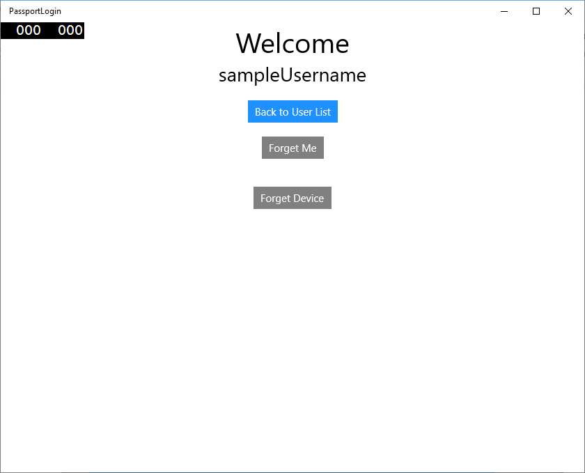

# <a name="create-a-windows-hello-login-service"></a>Crear un servicio de inicio de sesión de Windows Hello

\[Parte de la información hace referencia a la versión preliminar del producto, el cual puede sufrir importantes modificaciones antes de que se publique la versión comercial. Microsoft no ofrece ninguna garantía, expresa o implícita, respecto a la información que se ofrece aquí.\]

Esta es la segunda parte de un tutorial completo acerca de cómo usar Windows Hello como una alternativa a los sistemas tradicionales de autenticación de nombre de usuario y contraseña en aplicaciones para UWP (Plataforma universal de Windows) de Windows 10. Este artículo comienza donde terminó la primera parte, [Aplicación de inicio de sesión de Windows Hello](microsoft-passport-login.md), y amplía la funcionalidad para demostrar cómo se puede integrar Windows Hello en tu aplicación existente.

Para crear este proyecto, necesitarás algo de experiencia con C# y XAML. También tendrás que usar Visual Studio de 2015 (Community Edition o superior) en una máquina de Windows 10.

## <a name="exercise-1-server-side-logic"></a>Ejercicio 1: Lógica del lado servidor


En este ejercicio, comenzarás con la aplicación Windows Hello integrada en la primera práctica y crearás un servidor y una base de datos ficticios locales. Esta práctica de laboratorio está diseñada para enseñar cómo podría integrarse Windows Hello en un sistema existente. Al usar un servidor y una base de datos ficticios, se elimina gran parte de la configuración no relacionada. En tus propias aplicaciones deberás reemplazar los objetos ficticios por servicios y bases de datos reales.

-   Para comenzar, abre la solución PassportLogin de la primera práctica de laboratorio de Passport.
-   Para comenzar deberás implementar el servidor y la base de datos ficticios. Crea una nueva carpeta denominada "AuthService". En el Explorador de soluciones, haz clic con el botón secundario en la solución "PassportLogin (Universal Windows)" y selecciona Agregar -> Nueva carpeta.
-   Crea las clases UserAccount y PassportDevices que actuarán como modelos para los datos que se guardarán en la base de datos ficticia. La clase UserAccount será similar al modelo de usuario implementado en un servidor de autenticación tradicional. Haz clic con el botón derecho en la carpeta AuthService y agrega una nueva clase llamada "UserAccount.cs".

    

    

-   Cambia la definición de clase a pública y después agrega las siguientes propiedades públicas. Necesitarás la referencia siguiente.

    ```cs
    using System.ComponentModel.DataAnnotations;
     
    namespace PassportLogin.AuthService
    {
        public class UserAccount
        {
            [Key, Required]
            public Guid UserId { get; set; }
            [Required]
            public string Username { get; set; }
            public string Password { get; set; }
            // public List<PassportDevice> PassportDevices = new List<PassportDevice>();
        }
    }
    ```

    Habrás observado la lista comentada de PassportDevices. Esta es una modificación que deberá realizar en un modelo de usuario existente de tu implementación actual. La lista de PassportDevices contendrá un deviceID, la clave convertida en pública desde Windows Hello y un [**KeyCredentialAttestationResult**](https://msdn.microsoft.com/library/windows/apps/dn973034). Para esta práctica de laboratorio deberás implementar el elemento keyAttestationResult, que solo proporciona Windows Hello en dispositivos que tienen un chip TPM (Módulos de plataforma segura). El **KeyCredentialAttestationResult** es una combinación de varias propiedades que deberían dividirse para poderse guardar y cargar con una base de datos.

-   Crea una nueva clase en la carpeta AuthService denominada "PassportDevice.cs". Este es el modelo para los dispositivos de Windows Hello que se explicó anteriormente. Cambia la definición de clase a pública y agrega las siguientes propiedades.

    ```cs
    namespace PassportLogin.AuthService
    {
        public class PassportDevice
        {
            // These are the new variables that will need to be added to the existing UserAccount in the Database
            // The DeviceName is used to support multiple devices for the one user.
            // This way the correct public key is easier to find as a new public key is made for each device.
            // The KeyAttestationResult is only used if the User device has a TPM (Trusted Platform Module) chip, 
            // in most cases it will not. So will be left out for this hands on lab.
            public Guid DeviceId { get; set; }
            public byte[] PublicKey { get; set; }
            // public KeyCredentialAttestationResult KeyAttestationResult { get; set; }
        }
    }
    ```

-   Vuelve a UserAccount.cs y quita la marca de comentario de la lista de dispositivos de Windows Hello.

    ```cs
    using System.Collections.Generic;
     
    namespace PassportLogin.AuthService
    {
        public class UserAccount
        {
            [Key, Required]
            public Guid UserId { get; set; }
            [Required]
            public string Username { get; set; }
            public string Password { get; set; }
            public List<PassportDevice> PassportDevices = new List<PassportDevice>();
        }
    }
    ```

-   Con el modelo de UserAccount y PassportDevice creado, debes crear otra nueva clase en AuthService que actuará como la base de datos ficticia. Dado que se trata de una base de datos ficticia, desde ella guardarás y cargarás una lista de cuentas de usuario localmente. En el mundo real, sería tu implementación de base de datos. Crea una nueva clase en AuthService denominada "MockStore.cs". Cambia la definición de clase a pública.
-   Dado que el almacén ficticio guardará y cargará una lista de las cuentas de usuario localmente, puedes implementar la lógica para guardar y cargar esa lista mediante un XmlSerializer. También deberás recordar el nombre de archivo y la ubicación de almacenamiento. En MockStore.cs implementa lo siguiente:

```cs
    using System.IO;
    using System.Linq;
    using System.Xml.Serialization;
    using Windows.Storage;

    namespace PassportLogin.AuthService
    {
        public class MockStore
        {
            private const string USER_ACCOUNT_LIST_FILE_NAME = "userAccountsList.txt";
            // This cannot be a const because the LocalFolder is accessed at runtime
            private string _userAccountListPath = Path.Combine(
                ApplicationData.Current.LocalFolder.Path, USER_ACCOUNT_LIST_FILE_NAME);
            private List<UserAccount> _mockDatabaseUserAccountsList;
     
    #region Save and Load Helpers
            /// <summary>
            /// Create and save a useraccount list file. (Replacing the old one)
            /// </summary>
            private async void SaveAccountListAsync()
            {
                string accountsXml = SerializeAccountListToXml();
     
                if (File.Exists(_userAccountListPath))
                {
                    StorageFile accountsFile = await StorageFile.GetFileFromPathAsync(_userAccountListPath);
                    await FileIO.WriteTextAsync(accountsFile, accountsXml);
                }
                else
                {
                    StorageFile accountsFile = await ApplicationData.Current.LocalFolder.CreateFileAsync(USER_ACCOUNT_LIST_FILE_NAME);
                    await FileIO.WriteTextAsync(accountsFile, accountsXml);
                }
            }
     
            /// <summary>
            /// Gets the useraccount list file and deserializes it from XML to a list of useraccount objects.
            /// </summary>
            /// <returns>List of useraccount objects</returns>
            private async void LoadAccountListAsync()
            {
                if (File.Exists(_userAccountListPath))
                {
                    StorageFile accountsFile = await StorageFile.GetFileFromPathAsync(_userAccountListPath);
     
                    string accountsXml = await FileIO.ReadTextAsync(accountsFile);
                    DeserializeXmlToAccountList(accountsXml);
                }
     
                // If the UserAccountList does not contain the sampleUser Initialize the sample users
                // This is only needed as it in a Hand on Lab to demonstrate a user migrating
                // In the real world user accounts would just be in a database
                if (!_mockDatabaseUserAccountsList.Any(f => f.Username.Equals("sampleUsername")))
                {
                    //If the list is empty InitializeSampleAccounts and return the list
                    //InitializeSampleUserAccounts();
                }
            }
     
            /// <summary>
            /// Uses the local list of accounts and returns an XML formatted string representing the list
            /// </summary>
            /// <returns>XML formatted list of accounts</returns>
            private string SerializeAccountListToXml()
            {
                XmlSerializer xmlizer = new XmlSerializer(typeof(List<UserAccount>));
                StringWriter writer = new StringWriter();
                xmlizer.Serialize(writer, _mockDatabaseUserAccountsList);
                return writer.ToString();
            }
     
            /// <summary>
            /// Takes an XML formatted string representing a list of accounts and returns a list object of accounts
            /// </summary>
            /// <param name="listAsXml">XML formatted list of accounts</param>
            /// <returns>List object of accounts</returns>
            private List<UserAccount> DeserializeXmlToAccountList(string listAsXml)
            {
                XmlSerializer xmlizer = new XmlSerializer(typeof(List<UserAccount>));
                TextReader textreader = new StreamReader(new MemoryStream(Encoding.UTF8.GetBytes(listAsXml)));
                return _mockDatabaseUserAccountsList = (xmlizer.Deserialize(textreader)) as List<UserAccount>;
            }
    #endregion
        }
    }
```

-   En el método de carga habrás observado que se quitó la marca de comentario de un método InitializeSampleUserAccounts. Deberás crear este método en MockStore.cs. Este método rellenará la lista de cuentas de usuario para que se pueda realizar un inicio de sesión. En el mundo real, la base de datos de usuario ya estará rellenada. En este paso también crearás un constructor que inicializará la lista de usuarios y llamará a load.

    ```cs
    namespace PassportLogin.AuthService
    {
        public class MockStore
        {
            private const string USER_ACCOUNT_LIST_FILE_NAME = "userAccountsList.txt";
            // This cannot be a const because the LocalFolder is accessed at runtime
            private string _userAccountListPath = Path.Combine(
                ApplicationData.Current.LocalFolder.Path, USER_ACCOUNT_LIST_FILE_NAME);
            private List<UserAccount> _mockDatabaseUserAccountsList;
     
            public MockStore()
            {
                _mockDatabaseUserAccountsList = new List& lt; UserAccount & gt; ();
                LoadAccountListAsync();
            }

            private void InitializeSampleUserAccounts()
            {
                // Create a sample Traditional User Account that only has a Username and Password
                // This will be used initially to demonstrate how to migrate to use Windows Hello

                UserAccount sampleUserAccount = new UserAccount()
                {
                    UserId = Guid.NewGuid(),
                    Username = "sampleUsername",
                    Password = "samplePassword",
                };

                // Add the sampleUserAccount to the _mockDatabase
                _mockDatabaseUserAccountsList.Add(sampleUserAccount);
                SaveAccountListAsync();
            }
        }
    }
    ```

-   Ahora que el método InitalizeSampleUserAccounts existe, quita la marca de comentario de la llamada al método en el método LoadAccountListAsync.

    ```cs
    private async void LoadAccountListAsync()
    {
        if (File.Exists(_userAccountListPath))
        {
            StorageFile accountsFile = await StorageFile.GetFileFromPathAsync(_userAccountListPath);

            string accountsXml = await FileIO.ReadTextAsync(accountsFile);
            DeserializeXmlToAccountList(accountsXml);
        }

        // If the UserAccountList does not contain the sampleUser Initialize the sample users
        // This is only needed as it in a Hand on Lab to demonstrate a user migrating
        // In the real world user accounts would just be in a database
        if (!_mockDatabaseUserAccountsList.Any(f = > f.Username.Equals("sampleUsername")))
                {
            //If the list is empty InitializeSampleAccounts and return the list
            InitializeSampleUserAccounts();
        }
    }
    ```

-   La lista de cuentas de usuario del almacén ficticio ya se puede guardar y cargar. Otras partes de la aplicación deberán acceder a esta lista, por lo que deberán existir algunos métodos para recuperar estos datos. Debajo del método InitializeSampleUserAccounts, agrega los siguientes métodos get. Te permitirán obtener un identificador de usuario, un usuario único, una lista de usuarios para un dispositivo específico de Windows Hello, así como la clave pública para el usuario en un dispositivo específico.

    ```cs
    public Guid GetUserId(string username)
    {
        if (_mockDatabaseUserAccountsList.Any())
        {
            UserAccount account = _mockDatabaseUserAccountsList.FirstOrDefault(f => f.Username.Equals(username));
            if (account != null)
            {
                return account.UserId;
            }
        }
        return Guid.Empty;
    }

    public UserAccount GetUserAccount(Guid userId)
    {
        return _mockDatabaseUserAccountsList.FirstOrDefault(f => f.UserId.Equals(userId));
    }

    public List<UserAccount> GetUserAccountsForDevice(Guid deviceId)
    {
        List<UserAccount> usersForDevice = new List<UserAccount>();

        foreach (UserAccount account in _mockDatabaseUserAccountsList)
        {
            if (account.PassportDevices.Any(f => f.DeviceId.Equals(deviceId)))
            {
                usersForDevice.Add(account);
            }
        }

        return usersForDevice;
    }

    public byte[] GetPublicKey(Guid userId, Guid deviceId)
    {
        UserAccount account = _mockDatabaseUserAccountsList.FirstOrDefault(f => f.UserId.Equals(userId));
        if (account != null)
        {
            if (account.PassportDevices.Any())
            {
                return account.PassportDevices.FirstOrDefault(p => p.DeviceId.Equals(deviceId)).PublicKey;
            }
        }
        return null;
    }
    ```

-   Los siguientes métodos que se van a implementar controlarán operaciones simples para agregar o quitar la cuenta, así como para quitar el dispositivo. Es necesario quitar el dispositivo porque Windows Hello es una solución específica del dispositivo. Para cada dispositivo en el que inicies sesión, Windows Hello creará un nuevo par de claves pública y privada. Es como tener una contraseña distinta para cada dispositivo en el que inicies sesión, pero no tienes que recordar todas las contraseñas que recuerda el servidor. Agrega los siguientes métodos a MockStore.cs

    ```cs
    public UserAccount AddAccount(string username)
    {
        UserAccount newAccount = null;
        try
        {
            newAccount = new UserAccount()
            {
                UserId = Guid.NewGuid(),
                Username = username,
            };

            _mockDatabaseUserAccountsList.Add(newAccount);
            SaveAccountListAsync();
        }
        catch (Exception)
        {
            throw;
        }
        return newAccount;
    }

    public bool RemoveAccount(Guid userId)
    {
        UserAccount userAccount = GetUserAccount(userId);
        if (userAccount != null)
        {
            _mockDatabaseUserAccountsList.Remove(userAccount);
            SaveAccountListAsync();
            return true;
        }
        return false;
    }

    public bool RemoveDevice(Guid userId, Guid deviceId)
    {
        UserAccount userAccount = GetUserAccount(userId);
        PassportDevice deviceToRemove = null;
        if (userAccount != null)
        {
            foreach (PassportDevice device in userAccount.PassportDevices)
            {
                if (device.DeviceId.Equals(deviceId))
                {
                    deviceToRemove = device;
                    break;
                }
            }
        }

        if (deviceToRemove != null)
        {
            //Remove the PassportDevice
            userAccount.PassportDevices.Remove(deviceToRemove);
            SaveAccountListAsync();
        }

        return true;
    }
    ```

- En la clase MockStore agrega un método que agregará información relacionada con Windows Hello a una clase UserAccount existente. Este método se llamará PassportUpdateDetails y usará parámetros para identificar al usuario y los detalles de Windows Hello. Se quitó la marca de comentario de KeyAttestationResult al crear un PassportDevice, que en una aplicación real sería obligatoria.

    ```cs
    using Windows.Security.Credentials;

    public void PassportUpdateDetails(Guid userId, Guid deviceId, byte[] publicKey, 
        KeyCredentialAttestationResult keyAttestationResult)
    {
        UserAccount existingUserAccount = GetUserAccount(userId);
        if (existingUserAccount != null)
        {
            if (!existingUserAccount.PassportDevices.Any(f => f.DeviceId.Equals(deviceId)))
            {
                existingUserAccount.PassportDevices.Add(new PassportDevice()
                {
                    DeviceId = deviceId,
                    PublicKey = publicKey,
                    // KeyAttestationResult = keyAttestationResult
                });
            }
        }
        SaveAccountListAsync();
    }
    ```

- La clase MockStore ahora está completa, ya que representa la base de datos que debería considerarse privada. Para acceder a MockStore se necesita una clase AuthService para manipular los datos de la base de datos. En la carpeta AuthService crea una nueva clase denominada "AuthService.cs". Cambia la definición de clase a pública y agrega un patrón de la instancia singleton para garantizar que siempre se cree una sola instancia.

    ```cs
    namespace PassportLogin.AuthService
    {
        public class AuthService
        {
            // Singleton instance of the AuthService
            // The AuthService is a mock of what a real world server and service implementation would be
            private static AuthService _instance;
            public static AuthService Instance
            {
                get
                {
                    if (null == _instance)
                    {
                        _instance = new AuthService();
                    }
                    return _instance;
                }
            }

            private AuthService()
            { }
        }
    }
    ```

-   La clase AuthService deberá crear una instancia de la clase MockStore y proporcionar acceso a las propiedades del objeto MockStore.

    ```cs
    namespace PassportLogin.AuthService
    {
        public class AuthService
        {
            //Singleton instance of the AuthService
            //The AuthService is a mock of what a real world server and database implementation would be
            private static AuthService _instance;
            public static AuthService Instance
            {
                get
                {
                    if (null == _instance)
                    {
                        _instance = new AuthService();
                    }
                    return _instance;
                }
            }
     
            private MockStore _mockStore = new MockStore();
     
            public Guid GetUserId(string username)
            {
                return _mockStore.GetUserId(username);
            }
     
            public UserAccount GetUserAccount(Guid userId)
            {
                return _mockStore.GetUserAccount(userId);
            }
     
            public List<UserAccount> GetUserAccountsForDevice(Guid deviceId)
            {
                return _mockStore.GetUserAccountsForDevice(deviceId);
            }
        }
    }
    ```

-   Necesitas tener métodos en la clase AuthService para acceder, agregar, quitar y actualizar los métodos de los detalles de Passport en el objeto MockStore. Al final del archivo de clase AuthService agrega los siguientes métodos.

    ```cs
    using Windows.Security.Credentials;

    public void Register(string username)
    {
        _mockStore.AddAccount(username);
    }

    public bool PassportRemoveUser(Guid userId)
    {
        return _mockStore.RemoveAccount(userId);
    }

    public bool PassportRemoveDevice(Guid userId, Guid deviceId)
    {
        return _mockStore.RemoveDevice(userId, deviceId);
    }

    public void PassportUpdateDetails(Guid userId, Guid deviceId, byte[] publicKey, 
        KeyCredentialAttestationResult keyAttestationResult)
    {
        _mockStore.PassportUpdateDetails(userId, deviceId, publicKey, keyAttestationResult);
    }
    ```

-   La clase AuthService deberá proporcionar un método para validar las credenciales. Este método usará un nombre de usuario y una contraseña, y se asegurará de que la cuenta existe y la contraseña es válida. Un sistema existente tendría un método equivalente a este para comprobar si el usuario está autorizado. Agrega el siguiente método ValidateCredentials al archivo AuthService.cs.

    ```cs
    public bool ValidateCredentials(string username, string password)
    {
        if (!string.IsNullOrEmpty(username) && !string.IsNullOrEmpty(password))
        {
            // This would be used for existing accounts migrating to use Passport
            Guid userId = GetUserId(username);
            if (userId != Guid.Empty)
            {
                UserAccount account = GetUserAccount(userId);
                if (account != null)
                {
                    if (string.Equals(password, account.Password))
                    {
                        return true;
                    }
                }
            }
        }
        return false;
    }
    ```

-   La clase AuthService necesita un método de desafío de solicitud que devolverá un desafío al cliente para comprobar si el usuario es quien dice ser. Posteriormente, se necesitará un método en la clase AuthService para recibir el desafío firmado del cliente. Para esta práctica de laboratorio, el método para determinar si el desafío firmado se completó ha quedado incompleto. Todas las implementaciones de Windows Hello en un sistema de autenticación existente serán ligeramente diferentes. La clave pública almacenada en el servidor debe coincidir con el resultado que devuelto el cliente al servidor. Agrega estos dos métodos a AuthService.cs.

    ```cs
    using Windows.Security.Cryptography;
    using Windows.Storage.Streams;

    public IBuffer PassportRequestChallenge()
    {
        return CryptographicBuffer.ConvertStringToBinary("ServerChallenge", BinaryStringEncoding.Utf8);
    }

    public bool SendServerSignedChallenge(Guid userId, Guid deviceId, byte[] signedChallenge)
    {
        // Depending on your company polices and procedures this step will be different
        // It is at this point you will need to validate the signedChallenge that is sent back from the client.
        // Validation is used to ensure the correct user is trying to access this account. 
        // The validation process will use the signedChallenge and the stored PublicKey 
        // for the username and the specific device signin is called from.
        // Based on the validation result you will return a bool value to allow access to continue or to block the account.

        // For this sample validation will not happen as a best practice solution does not apply and will need to 
           // be configured for each company.
        // Simply just return true.

        // You could get the User's Public Key with something similar to the following:
        byte[] userPublicKey = _mockStore.GetPublicKey(userId, deviceId);
        return true;
    }
    ```

## <a name="exercise-2-client-side-logic"></a>Ejercicio 2: Lógica del lado cliente

En este ejercicio cambiarás las vistas del lado cliente y las clases auxiliares de la primera práctica para usar la clase AuthService. En el mundo real, la clase AuthService sería el servidor de autenticación y necesitaría usar la API web para enviar y recibir datos del servidor. En este caso, el cliente y el servidor son locales para simplificar la práctica de laboratorio. El objetivo es aprender a usar las API de Windows Hello.

-   En MainPage.xaml.cs puedes quitar la llamada al método AccountHelper.LoadAccountListAsync en el método cargado, ya que la clase AuthService crea una instancia de MockStore que carga la lista de cuentas. El método cargado debería ser similar al siguiente. Observa que la definición de método asincrónico se elimina, ya que no existe nada en espera.

    ```cs
    private void MainPage_Loaded(object sender, RoutedEventArgs e)
    {
        Frame.Navigate(typeof(UserSelection));
    }
    ```

-   Actualiza la interfaz de la página Login para que sea necesario introducir una cuenta de Passport. Esta práctica de laboratorio demuestra cómo se puede migrar un sistema existente para usar Windows Hello y que las cuentas existentes tendrán un nombre de usuario y una contraseña. Actualiza también la explicación de la parte inferior del XAML para incluir la contraseña predeterminada. Actualiza el siguiente XAML en Login.xaml.

    ```xml
    <Grid Background="{ThemeResource ApplicationPageBackgroundThemeBrush}">
      <StackPanel Orientation="Vertical">
        <TextBlock Text="Login" FontSize="36" Margin="4" TextAlignment="Center"/>

        <TextBlock x:Name="ErrorMessage" Text="" FontSize="20" Margin="4" Foreground="Red" TextAlignment="Center"/>

        <TextBlock Text="Enter your credentials below" Margin="0,0,0,20"
                   TextWrapping="Wrap" Width="300"
                   TextAlignment="Center" VerticalAlignment="Center" FontSize="16"/>

        <StackPanel Orientation="Horizontal" HorizontalAlignment="Center">
          <!-- Username Input -->
          <TextBlock x:Name="UserNameTextBlock" Text="Username: "
                 FontSize="20" Margin="4" Width="100"/>
          <TextBox x:Name="UsernameTextBox" PlaceholderText="sampleUsername" Width="200" Margin="4"/>
        </StackPanel>

        <StackPanel Orientation="Horizontal" HorizontalAlignment="Center">
          <!-- Password Input -->
          <TextBlock x:Name="PasswordTextBlock" Text="Password: "
                 FontSize="20" Margin="4" Width="100"/>
          <PasswordBox x:Name="PasswordBox" PlaceholderText="samplePassword" Width="200" Margin="4"/>
        </StackPanel>

        <Button x:Name="PassportSignInButton" Content="Login" Background="DodgerBlue" Foreground="White"
            Click="PassportSignInButton_Click" Width="80" HorizontalAlignment="Center" Margin="0,20"/>

        <TextBlock Text="Don't have an account?"
                    TextAlignment="Center" VerticalAlignment="Center" FontSize="16"/>
        <TextBlock x:Name="RegisterButtonTextBlock" Text="Register now"
                   PointerPressed="RegisterButtonTextBlock_OnPointerPressed"
                   Foreground="DodgerBlue"
                   TextAlignment="Center" VerticalAlignment="Center" FontSize="16"/>

        <Border x:Name="PassportStatus" Background="#22B14C"
                   Margin="0,20" Height="100">
          <TextBlock x:Name="PassportStatusText" Text="Windows Hello is ready to use!"
                 Margin="4" TextAlignment="Center" VerticalAlignment="Center" FontSize="20"/>
        </Border>

        <TextBlock x:Name="LoginExplaination" FontSize="24" TextAlignment="Center" TextWrapping="Wrap" 
            Text="Please Note: To demonstrate a login, validation will only occur using the default username 
            'sampleUsername' and default password 'samplePassword'"/>

      </StackPanel>
    </Grid>
    ```

-   En el código subyacente de la clase Login deberás cambiar la variable privada Account en la parte superior de la clase a UserAccount. Cambia el evento OnNavigateTo para convertir el tipo a UserAccount. Necesitarás la referencia siguiente.

    ```cs
    using PassportLogin.AuthService;

    namespace PassportLogin.Views
    {
        public sealed partial class Login : Page
        {
            private UserAccount _account;
            private bool _isExistingAccount;

            public Login()
            {
                this.InitializeComponent();
            }

            protected override async void OnNavigatedTo(NavigationEventArgs e)
            {
                //Check Windows Hello is setup and available on this machine
                if (await MicrosoftPassportHelper.MicrosoftPassportAvailableCheckAsync())
                {
                    if (e.Parameter != null)
                    {
                        _isExistingAccount = true;
                        //Set the account to the existing account being passed in
                        _account = (UserAccount)e.Parameter;
                        UsernameTextBox.Text = _account.Username;
                        SignInPassport();
                    }
                }
            }
        }
    }
    ```

-   Dado que la página Login usa un objeto UserAccount en lugar del objeto Account anterior, la clase MicrosoftPassportHelper.cs tendrá que actualizarse para usar UserAccount como un parámetro para algunos métodos. Deberás cambiar los siguientes parámetros para los métodos CreatePassportKeyAsync, RemovePassportAccountAsync y GetPassportAuthenticationMessageAsync. Dado que la clase UserAccount tiene un Guid para un UserId, comenzarás usando el identificador en más lugares para ser más específico.

    ```cs
    public static async Task<bool> CreatePassportKeyAsync(Guid userId, string username)
    {
        KeyCredentialRetrievalResult keyCreationResult = await KeyCredentialManager.RequestCreateAsync(username, KeyCredentialCreationOption.ReplaceExisting);
    }

    public static async void RemovePassportAccountAsync(UserAccount account)
    {

    }
    public static async Task<bool> GetPassportAuthenticationMessageAsync(UserAccount account)
    {
        KeyCredentialRetrievalResult openKeyResult = await KeyCredentialManager.OpenAsync(account.Username);
        //Calling OpenAsync will allow the user access to what is available in the app and will not require user credentials again.
        //If you wanted to force the user to sign in again you can use the following:
        //var consentResult = await Windows.Security.Credentials.UI.UserConsentVerifier.RequestVerificationAsync(account.Username);
        //This will ask for the either the password of the currently signed in Microsoft Account or the PIN used for Windows Hello.

        if (openKeyResult.Status == KeyCredentialStatus.Success)
        {
            //If OpenAsync has succeeded, the next thing to think about is whether the client application requires access to backend services.
            //If it does here you would Request a challenge from the Server. The client would sign this challenge and the server
            //would check the signed challenge. If it is correct it would allow the user access to the backend.
            //You would likely make a new method called RequestSignAsync to handle all this
            //e.g. RequestSignAsync(openKeyResult);
            //Refer to the second Windows Hello sample for information on how to do this.

            //For this sample there is not concept of a server implemented so just return true.
            return true;
        }
        else if (openKeyResult.Status == KeyCredentialStatus.NotFound)
        {
            //If the _account is not found at this stage. It could be one of two errors. 
            //1. Windows Hello has been disabled
            //2. Windows Hello has been disabled and re-enabled cause the Windows Hello Key to change.
            //Calling CreatePassportKey and passing through the account will attempt to replace the existing Windows Hello Key for that account.
            //If the error really is that Windows Hello is disabled then the CreatePassportKey method will output that error.
            if (await CreatePassportKeyAsync(account.UserId, account.Username))
            {
                //If the Passport Key was again successfully created, Windows Hello has just been reset.
                //Now that the Passport Key has been reset for the _account retry sign in.
                return await GetPassportAuthenticationMessageAsync(account);
            }
        }

        // Can't use Passport right now, try again later
        return false;
    }
    ```

-   El método SignInPassport del archivo Login.xaml.cs deberá actualizarse para usar AuthService en lugar de AccountHelper. La validación de credenciales se realizará a través de AuthService. Para esta práctica de laboratorio la única cuenta configurada es "sampleUsername". Esta cuenta se crea en el método InitializeSampleUserAccounts en MockStore.cs. Actualiza el método SignInPassport en Login.xaml.cs ahora para reflejar el fragmento de código siguiente.

    ```cs
    private async void SignInPassportAsync()
    {
        if (_isExistingLocalAccount)
        {
            if (await MicrosoftPassportHelper.GetPassportAuthenticationMessageAsync(_account))
            {
                Frame.Navigate(typeof(Welcome), _account);
            }
        }
        else if (AuthService.AuthService.Instance.ValidateCredentials(UsernameTextBox.Text, PasswordBox.Password))
        {
            Guid userId = AuthService.AuthService.Instance.GetUserId(UsernameTextBox.Text);

            if (userId != Guid.Empty)
            {
                //Now that the account exists on server try and create the necessary passport details and add them to the account
                bool isSuccessful = await MicrosoftPassportHelper.CreatePassportKeyAsync(userId, UsernameTextBox.Text);
                if (isSuccessful)
                {
                    Debug.WriteLine("Successfully signed in with Windows Hello!");
                    //Navigate to the Welcome Screen. 
                    _account = AuthService.AuthService.Instance.GetUserAccount(userId);
                    Frame.Navigate(typeof(Welcome), _account);
                }
                else
                {
                    //The passport account creation failed.
                    //Remove the account from the server as passport details were not configured
                    AuthService.AuthService.Instance.PassportRemoveUser(userId);

                    ErrorMessage.Text = "Account Creation Failed";
                }
            }
        }
        else
        {
            ErrorMessage.Text = "Invalid Credentials";
        }
    }
    ```

-   Dado que Windows Hello creará un par de claves pública y privada diferente para cada cuenta en cada dispositivo, la página principal deberá mostrar una lista de los dispositivos registrados para la cuenta que inició sesión y permitir que cada uno de ellos se olvide. En Welcome.xaml agrega el siguiente XAML debajo de ForgetButton. Esta acción implementará un control de botón de olvido de dispositivo, un área de texto de error y una lista para mostrar todos los dispositivos.

    ```xml
    <Grid Background="{ThemeResource ApplicationPageBackgroundThemeBrush}">
      <StackPanel Orientation="Vertical">
        <TextBlock x:Name="Title" Text="Welcome" FontSize="40" TextAlignment="Center"/>
        <TextBlock x:Name="UserNameText" FontSize="28" TextAlignment="Center" Foreground="Black"/>

        <Button x:Name="BackToUserListButton" Content="Back to User List" Click="Button_Restart_Click"
               HorizontalAlignment="Center" Margin="0,20" Foreground="White" Background="DodgerBlue"/>

        <Button x:Name="ForgetButton" Content="Forget Me" Click="Button_Forget_User_Click"
               Foreground="White"
               Background="Gray"
               HorizontalAlignment="Center"/>

        <Button x:Name="ForgetDeviceButton" Content="Forget Device" Click="Button_Forget_Device_Click"
               Foreground="White"
               Background="Gray"
               Margin="0,40,0,20"
               HorizontalAlignment="Center"/>

        <TextBlock x:Name="ForgetDeviceErrorTextBlock" Text="Select a device first"
                  TextWrapping="Wrap" Width="300" Foreground="Red"
                  TextAlignment="Center" VerticalAlignment="Center" FontSize="16" Visibility="Collapsed"/>

        <ListView x:Name="UserListView" MaxHeight="500" MinWidth="350" Width="350" HorizontalAlignment="Center">
          <ListView.ItemTemplate>
            <DataTemplate>
              <Grid Background="Gray" Height="50" Width="350" HorizontalAlignment="Center" VerticalAlignment="Stretch" >
                <TextBlock Text="{Binding DeviceId}" HorizontalAlignment="Center" TextAlignment="Center" VerticalAlignment="Center"
                          Foreground="White"/>
              </Grid>
            </DataTemplate>
          </ListView.ItemTemplate>
        </ListView>
      </StackPanel>
    </Grid>
    ```

-   En el archivo Welcome.xaml.cs deberás cambiar la variable privada Account privada en la parte superior de la clase a una variable privada UserAccount. Luego, actualiza el método OnNavigatedTo para usar la clase AuthService y recupera la información de la cuenta actual. Cuando tengas la información de la cuenta, puedes establecer el origen de los elementos de la lista para mostrar los dispositivos. Deberás agregar una referencia al espacio de nombres AuthService.

    ```cs
    using PassportLogin.AuthService;

    namespace PassportLogin.Views
    {
        public sealed partial class Welcome : Page
        {
            private UserAccount _activeAccount;

            public Welcome()
            {
                InitializeComponent();
            }

            protected override void OnNavigatedTo(NavigationEventArgs e)
            {
                _activeAccount = (UserAccount)e.Parameter;
                if (_activeAccount != null)
                {
                    UserAccount account = AuthService.AuthService.Instance.GetUserAccount(_activeAccount.UserId);
                    if (account != null)
                    {
                        UserListView.ItemsSource = account.PassportDevices;
                        UserNameText.Text = account.Username;
                    }
                }
            }
        }
    }
    ```

-   Dado que usarás la clase AuthService al quitar una cuenta, la referencia a la clase AccountHelper en el método Button\_Forget\_User\_Click se puede quitar. El método debería ser ahora similar al siguiente.

    ```cs
    private void Button_Forget_User_Click(object sender, RoutedEventArgs e)
    {
        //Remove it from Windows Hello
        MicrosoftPassportHelper.RemovePassportAccountAsync(_activeAccount);

        Debug.WriteLine("User " + _activeAccount.Username + " deleted.");

        //Navigate back to UserSelection page.
        Frame.Navigate(typeof(UserSelection));
    }
    ```

-   El método MicrosoftPassportHelper no usa la clase AuthService para quitar la cuenta. Debes realizar una llamada a AuthService y pasar el identificador de usuario.

    ```cs
    public static async void RemovePassportAccountAsync(UserAccount account)
    {
        //Open the account with Windows Hello
        KeyCredentialRetrievalResult keyOpenResult = await KeyCredentialManager.OpenAsync(account.Username);

        if (keyOpenResult.Status == KeyCredentialStatus.Success)
        {
            // In the real world you would send key information to server to unregister
            AuthService.AuthService.Instance.PassportRemoveUser(account.UserId);
        }

        //Then delete the account from the machines list of Passport Accounts
        await KeyCredentialManager.DeleteAsync(account.Username);
    }
    ```

-   Para poder completar la implementación de la clase de la página Welcome, debes crear un método en MicrosoftPassportHelper.cs que permita quitar un dispositivo. Crea un nuevo método que llame a PassportRemoveDevice en AuthService.

    ```cs
    public static void RemovePassportDevice(UserAccount account, Guid deviceId)
    {
        AuthService.AuthService.Instance.PassportRemoveDevice(account.UserId, deviceId);
    }
    ```

-   En Welcome.xaml.cs implementa el evento de clic Forget Device. Este usará el dispositivo seleccionado de la lista de dispositivos y usará la función auxiliar de Passport para llamar a la función para quitar el dispositivo.

    ```cs
    private void Button_Forget_Device_Click(object sender, RoutedEventArgs e)
    {
        PassportDevice selectedDevice = UserListView.SelectedItem as PassportDevice;
        if (selectedDevice != null)
        {
            //Remove it from Windows Hello
            MicrosoftPassportHelper.RemovePassportDevice(_activeAccount, selectedDevice.DeviceId);

            Debug.WriteLine("User " + _activeAccount.Username + " deleted.");

            if (!UserListView.Items.Any())
            {
                //Navigate back to UserSelection page.
                Frame.Navigate(typeof(UserSelection));
            }
        }
        else
        {
            ForgetDeviceErrorTextBlock.Visibility = Visibility.Visible;
        }
    }
    ```

-   La siguiente página que actualizarás es la página UserSelection. La página UserSelection deberá usar la clase AuthService para recuperar todas las cuentas de usuario para el dispositivo actual. Actualmente no hay ninguna manera de obtener un identificador de dispositivo para pasar a la clase AuthService para que pueda devolver cuentas de usuario para ese dispositivo. En la carpeta Utils crea una nueva clase denominada "Helpers.cs". Cambia la definición de clase a estática pública y, después, agrega el siguiente método, que te permitirá recuperar el identificador del dispositivo actual.

    ```cs
    using Windows.Security.ExchangeActiveSyncProvisioning;

    namespace PassportLogin.Utils
    {
        public static class Helpers
        {
            public static Guid GetDeviceId()
            {
                //Get the Device ID to pass to the server
                EasClientDeviceInformation deviceInformation = new EasClientDeviceInformation();
                return deviceInformation.Id;
            }
        }
    }
    ```

-   En la clase de la página UserSelection solo se debe cambiar el código subyacente, no la interfaz de usuario. En UserSelection.xaml.cs actualiza el método cargado y el método de selección del usuario para usar la clase UserAccount en lugar de la clase Account. También deberás obtener todos los usuarios de este dispositivo a través de la clase AuthService.

    ```cs
    using System.Linq;
    using PassportLogin.AuthService;

    namespace PassportLogin.Views
    {
        public sealed partial class UserSelection : Page
        {
            public UserSelection()
            {
                InitializeComponent();
                Loaded += UserSelection_Loaded;
            }

            private void UserSelection_Loaded(object sender, RoutedEventArgs e)
            {
                List<UserAccount> accounts = AuthService.AuthService.Instance.GetUserAccountsForDevice(Helpers.GetDeviceId());

                if (accounts.Any())
                {
                    UserListView.ItemsSource = accounts;
                    UserListView.SelectionChanged += UserSelectionChanged;
                }
                else
                {
                    //If there are no accounts navigate to the LoginPage
                    Frame.Navigate(typeof(Login));
                }
            }

            /// <summary>
            /// Function called when an account is selected in the list of accounts
            /// Navigates to the Login page and passes the chosen account
            /// </summary>
            private void UserSelectionChanged(object sender, RoutedEventArgs e)
            {
                if (((ListView)sender).SelectedValue != null)
                {
                    UserAccount account = (UserAccount)((ListView)sender).SelectedValue;
                    if (account != null)
                    {
                        Debug.WriteLine("Account " + account.Username + " selected!");
                    }
                    Frame.Navigate(typeof(Login), account);
                }
            }
        }
    }
    ```

-   La página PassportRegister debe actualizar el código subyacente. No es necesario modificar la interfaz de usuario. En PassportRegister.xaml.cs quita la variable privada Account en la parte superior de la clase, porque ya no es necesaria. Actualiza el evento de clic RegisterButton para usar la clase AuthService. Este método creará una nueva variable UserAccount y, después, probará y actualizará sus detalles de Passport. Si Passport no puede crear una clave de Passport, la cuenta se quitará debido a un error en el proceso de registro.

    ```cs
    private async void RegisterButton_Click_Async(object sender, RoutedEventArgs e)
    {
        ErrorMessage.Text = "";

        //Validate entered credentials are acceptable
        if (!string.IsNullOrEmpty(UsernameTextBox.Text))
        {
            //Register an Account on the AuthService so that we can get back a userId
            AuthService.AuthService.Instance.Register(UsernameTextBox.Text);
            Guid userId = AuthService.AuthService.Instance.GetUserId(UsernameTextBox.Text);

            if (userId != Guid.Empty)
            {
                //Now that the account exists on server try and create the necessary passport details and add them to the account
                bool isSuccessful = await MicrosoftPassportHelper.CreatePassportKeyAsync(userId, UsernameTextBox.Text);
                if (isSuccessful)
                {
                    //Navigate to the Welcome Screen. 
                    Frame.Navigate(typeof(Welcome), AuthService.AuthService.Instance.GetUserAccount(userId));
                }
                else
                {
                    //The passport account creation failed.
                    //Remove the account from the server as passport details were not configured
                    AuthService.AuthService.Instance.PassportRemoveUser(userId);

                    ErrorMessage.Text = "Account Creation Failed";
                }
            }
        }
        else
        {
            ErrorMessage.Text = "Please enter a username";
        }
    }
    ```

-   Compila y ejecuta la aplicación (F5). Inicia sesión en la cuenta de usuario de muestra, con las credenciales "sampleUsername" y "samplePassword". En la pantalla de inicio de sesión, puedes observar que aparece el botón de olvidar dispositivo, aunque no se muestra ningún dispositivo. Al crear o migrar un usuario para trabajar con Windows Hello, la información de Passport no se inserta en la clase AuthService.

    

    

-   Para obtener la información de Passport para la clase AuthService, MicrosoftPassportHelper.cs deberá actualizarse. En el método CreatePassportKeyAsync, en lugar de devolver solo true en el caso de que sea correcto, deberás llamar a un nuevo método que intentará obtener la clave KeyAttestation. Aunque en esta práctica de laboratorio no se registra esta información en la clase AuthService, aprenderás cómo se puede obtener esta información en el lado cliente. Actualiza el método CreatePassportKeyAsync.

    ```cs
    public static async Task<bool> CreatePassportKeyAsync(Guid userId, string username)
    {
        KeyCredentialRetrievalResult keyCreationResult = await KeyCredentialManager.RequestCreateAsync(username, KeyCredentialCreationOption.ReplaceExisting);

        switch (keyCreationResult.Status)
        {
            case KeyCredentialStatus.Success:
                Debug.WriteLine("Successfully made key");
                await GetKeyAttestationAsync(userId, keyCreationResult);
                return true;
            case KeyCredentialStatus.UserCanceled:
                Debug.WriteLine("User cancelled sign-in process.");
                break;
            case KeyCredentialStatus.NotFound:
                // User needs to setup Windows Hello
                Debug.WriteLine("Windows Hello is not setup!\nPlease go to Windows Settings and set up a PIN to use it.");
                break;
            default:
                break;
        }

        return false;
    }
    ```

-   Crea este método GetKeyAttestationAsync en MicrosoftPassportHelper.cs. Este método mostrará cómo obtener toda la información necesaria que Windows Hello puede proporcionar para cada cuenta en un dispositivo específico.

    ```cs
    using Windows.Storage.Streams;

    private static async Task GetKeyAttestationAsync(Guid userId, KeyCredentialRetrievalResult keyCreationResult)
    {
        KeyCredential userKey = keyCreationResult.Credential;
        IBuffer publicKey = userKey.RetrievePublicKey();
        KeyCredentialAttestationResult keyAttestationResult = await userKey.GetAttestationAsync();
        IBuffer keyAttestation = null;
        IBuffer certificateChain = null;
        bool keyAttestationIncluded = false;
        bool keyAttestationCanBeRetrievedLater = false;
        KeyCredentialAttestationStatus keyAttestationRetryType = 0;

        if (keyAttestationResult.Status == KeyCredentialAttestationStatus.Success)
        {
            keyAttestationIncluded = true;
            keyAttestation = keyAttestationResult.AttestationBuffer;
            certificateChain = keyAttestationResult.CertificateChainBuffer;
            Debug.WriteLine("Successfully made key and attestation");
        }
        else if (keyAttestationResult.Status == KeyCredentialAttestationStatus.TemporaryFailure)
        {
            keyAttestationRetryType = KeyCredentialAttestationStatus.TemporaryFailure;
            keyAttestationCanBeRetrievedLater = true;
            Debug.WriteLine("Successfully made key but not attestation");
        }
        else if (keyAttestationResult.Status == KeyCredentialAttestationStatus.NotSupported)
        {
            keyAttestationRetryType = KeyCredentialAttestationStatus.NotSupported;
            keyAttestationCanBeRetrievedLater = false;
            Debug.WriteLine("Key created, but key attestation not supported");
        }

        Guid deviceId = Helpers.GetDeviceId();
        //Update the Pasport details with the information we have just gotten above.
        //UpdatePassportDetails(userId, deviceId, publicKey.ToArray(), keyAttestationResult);
    }
    ```

-   Habrás observado en el método GetKeyAttestationAsync que acabas de agregar que la última línea estaba comentada. Esta última línea será un método nuevo que crearás que enviará toda la información de Windows Hello a AuthService. En el mundo real, deberías enviar esta información a un servidor real con una API web.

    ```cs
    using System.Runtime.InteropServices.WindowsRuntime;

    public static bool UpdatePassportDetails(Guid userId, Guid deviceId, byte[] publicKey, KeyCredentialAttestationResult keyAttestationResult)
    {
        //In the real world you would use an API to add Passport signing info to server for the signed in _account.
        //For this tutorial we do not implement a WebAPI for our server and simply mock the server locally 
        //The CreatePassportKey method handles adding the Windows Hello account locally to the device using the KeyCredential Manager

        //Using the userId the existing account should be found and updated.
        AuthService.AuthService.Instance.PassportUpdateDetails(userId, deviceId, publicKey, keyAttestationResult);
        return true;
    }
    ```

-   Quita la marca de comentario de la última línea en el método GetKeyAttestationAsync para que la información de Windows Hello se envíe a la clase AuthService.
-   Compila y ejecuta la aplicación e inicia sesión con las credenciales predeterminadas como antes. En la pantalla de bienvenida verás ahora que se muestra el identificador de dispositivo. Si iniciaste sesión en otro dispositivo, este también se mostraría aquí (si hubiera un servicio de autenticación hospedado en la nube). Para esta práctica de laboratorio, se muestra el identificador de dispositivo real. En una implementación real, seguramente quieras mostrar un nombre descriptivo que cualquiera pueda comprender y usarlo para determinar cada dispositivo.

    

-   21. Para completar esta práctica de laboratorio, necesitas una solicitud de comprobación, para cuando el usuario seleccione elementos en la página de selección del usuario y vuelva a iniciar sesión. La clase AuthService tiene dos métodos que creaste para solicitar un desafío, uno de los cuales usa un desafío firmado. En MicrosoftPassportHelper.cs crea un nuevo método denominado "RequestSignAsync". Este solicitará un desafío desde la clase AuthService, lo firmará localmente mediante una API de Passport y lo enviará firmado a la clase AuthService. En esta práctica de laboratorio, la clase AuthService recibirá el desafío firmado y devolverá true. En una implementación real, deberías implementar un mecanismo de comprobación para determinar si esta comprobación la firmó el usuario correcto en el dispositivo correcto. Agrega el método siguiente a MicrosoftPassportHelper.cs

    ```cs
    private static async Task<bool> RequestSignAsync(Guid userId, KeyCredentialRetrievalResult openKeyResult)
    {
        // Calling userKey.RequestSignAsync() prompts the uses to enter the PIN or use Biometrics (Windows Hello).
        // The app would use the private key from the user account to sign the sign-in request (challenge)
        // The client would then send it back to the server and await the servers response.
        IBuffer challengeMessage = AuthService.AuthService.Instance.PassportRequestChallenge();
        KeyCredential userKey = openKeyResult.Credential;
        KeyCredentialOperationResult signResult = await userKey.RequestSignAsync(challengeMessage);

        if (signResult.Status == KeyCredentialStatus.Success)
        {
            // If the challenge from the server is signed successfully
            // send the signed challenge back to the server and await the servers response
            return AuthService.AuthService.Instance.SendServerSignedChallenge(
                userId, Helpers.GetDeviceId(), signResult.Result.ToArray());
        }
        else if (signResult.Status == KeyCredentialStatus.UserCanceled)
        {
            // User cancelled the Windows Hello PIN entry.
        }
        else if (signResult.Status == KeyCredentialStatus.NotFound)
        {
            // Must recreate Windows Hello key
        }
        else if (signResult.Status == KeyCredentialStatus.SecurityDeviceLocked)
        {
            // Can't use Windows Hello right now, remember that hardware failed and suggest restart
        }
        else if (signResult.Status == KeyCredentialStatus.UnknownError)
        {
            // Can't use Windows Hello right now, try again later
        }

        return false;
    }
    ```

-   22. En la clase MicrosoftPassportHelper, llama al método RequestSignAsync desde el método GetPassportAuthenticationMessageAsync.

    ```cs
    public static async Task<bool> GetPassportAuthenticationMessageAsync(UserAccount account)
    {
        KeyCredentialRetrievalResult openKeyResult = await KeyCredentialManager.OpenAsync(account.Username);
        // Calling OpenAsync will allow the user access to what is available in the app and will not require user credentials again.
        // If you wanted to force the user to sign in again you can use the following:
        // var consentResult = await Windows.Security.Credentials.UI.UserConsentVerifier.RequestVerificationAsync(account.Username);
        // This will ask for the either the password of the currently signed in Microsoft Account or the PIN used for Windows Hello.

        if (openKeyResult.Status == KeyCredentialStatus.Success)
        {
            //If OpenAsync has succeeded, the next thing to think about is whether the client application requires access to backend services.
            //If it does here you would Request a challenge from the Server. The client would sign this challenge and the server
            //would check the signed challenge. If it is correct it would allow the user access to the backend.
            //You would likely make a new method called RequestSignAsync to handle all this
            //e.g. RequestSignAsync(openKeyResult);
            //Refer to the second Windows Hello sample for information on how to do this.

            return await RequestSignAsync(account.UserId, openKeyResult);
        }
        else if (openKeyResult.Status == KeyCredentialStatus.NotFound)
        {
            //If the _account is not found at this stage. It could be one of two errors. 
            //1. Windows Hello has been disabled
            //2. Windows Hello has been disabled and re-enabled cause the Windows Hello Key to change.
            //Calling CreatePassportKey and passing through the account will attempt to replace the existing Windows Hello Key for that account.
            //If the error really is that Windows Hello is disabled then the CreatePassportKey method will output that error.
            if (await CreatePassportKeyAsync(account.UserId, account.Username))
            {
                //If the Passport Key was again successfully created, Windows Hello has just been reset.
                //Now that the Passport Key has been reset for the _account retry sign in.
                return await GetPassportAuthenticationMessageAsync(account);
            }
        }

        // Can't use Windows Hello right now, try again later
        return false;
    }
    ```

-   En este ejercicio, actualizaste la aplicación del lado cliente para usar la clase AuthService. Al hacerlo, pudiste eliminar la necesidad de la clase Account y la clase AccountHelper. Elimina la clase Account, la carpeta Modeles y la clase AccountHelper de la carpeta Utils. Deberás quitar todas las referencias al espacio de nombres Models en toda la aplicación para que la solución pueda compilarse correctamente.
-   Compila y ejecuta la aplicación, y disfruta usando Windows Hello con el servicio y la base de datos ficticios.

En esta práctica de laboratorio has aprendido a usar las API de Windows Hello para reemplazar la necesidad de contraseñas al usar la autenticación desde una máquina de Windows 10. Si consideras la cantidad de energía que la gente invierte en mantener contraseñas y ofrecer soporte para contraseñas perdidas en los sistemas existentes, verás la ventaja de cambiar al nuevo sistema de autenticación de Windows Hello.

A modo de ejercicio, te dejamos los detalles sobre cómo implementar la autenticación en el servicio y el servidor. La mayoría de los usuarios deben tener sistemas que deberán migrarse para comenzar a trabajar con Windows Hello y los detalles de cada sistema serán diferentes.

## <a name="related-topics"></a>Temas relacionados

* [Windows Hello](microsoft-passport.md)
* [Aplicación de inicio de sesión de Windows Hello](microsoft-passport-login.md)