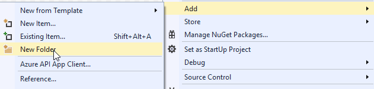
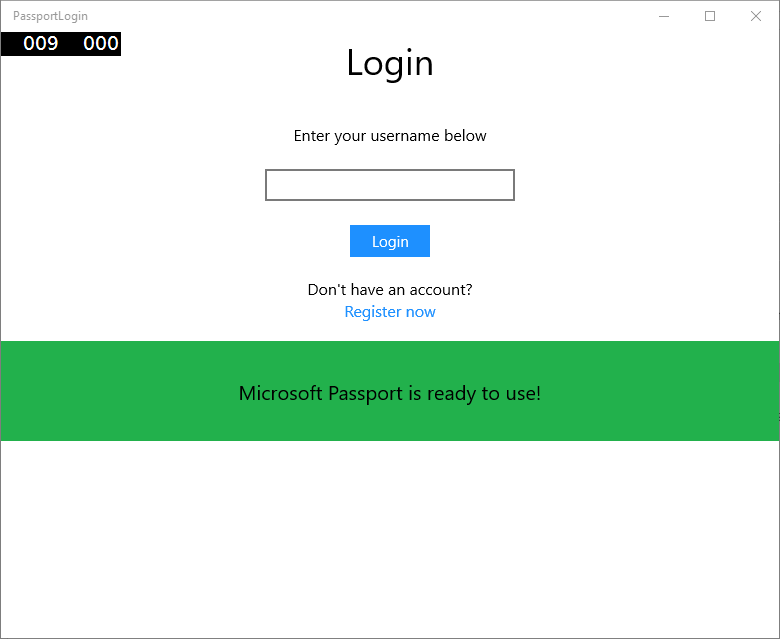
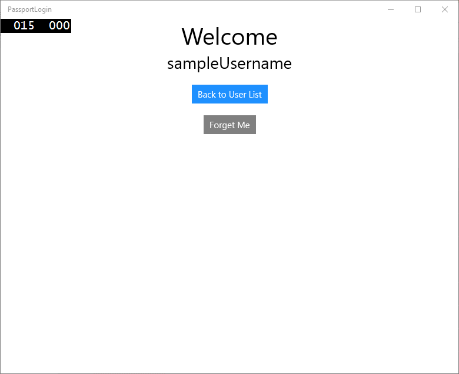
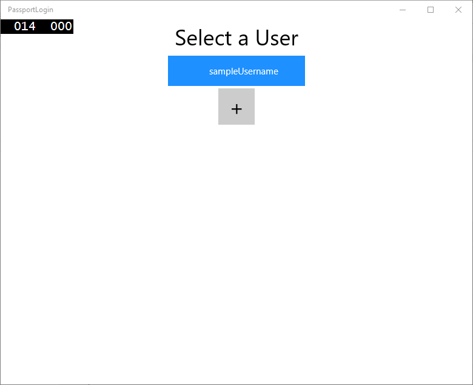

# <a name="create-a-windows-hello-login-app"></a>Crear una aplicación de inicio de sesión de Windows Hello

Esta es primera parte de un tutorial completo acerca de cómo crear una aplicación para UWP (Plataforma universal de Windows) de Windows 10 que use Windows Hello como una alternativa a los sistemas tradicionales de autenticación de nombre de usuario y contraseña. La aplicación usa un nombre de usuario para iniciar sesión y crear una clave de Hello para cada cuenta. Estas cuentas estarán protegidas por el PIN configurado en Configuración de Windows en la configuración de Windows Hello.

Este tutorial se divide en dos partes: creación de la aplicación y conexión al servicio back-end. Cuando haya terminado con este artículo, continúe con la parte 2: [Servicio de inicio de sesión de Windows Hello](microsoft-passport-login-auth-service.md).

Antes de comenzar, debes leer la introducción a [Windows Hello](microsoft-passport.md) para obtener una descripción general de cómo funciona Windows Hello.

## <a name="get-started"></a>Comenzar


Para crear este proyecto, necesitarás algo de experiencia con C# y XAML. También debe usar Visual Studio 2015 (Community Edition o superior) o una versión posterior de Visual Studio en un equipo con Windows 10. Aunque Visual Studio 2015 es la versión mínima requerida, se recomienda usar la versión más reciente de Visual Studio para las últimas actualizaciones de seguridad y desarrolladores.

-   Abra Visual Studio y seleccione Archivo > Nuevo > proyecto.
-   Se abrirá una ventana de "Nuevo proyecto". Navegación a Plantillas > Visual C#.
-   Elige la aplicación vacía (Windows Universal) y el nombre de la aplicación "PassportLogin".
-   Compila y ejecuta la nueva aplicación (F5); debería mostrarse una ventana vacía en la pantalla. Cierre la aplicación.


## <a name="exercise-1-login-with-microsoft-passport"></a>Ejercicio 1: Inicio de sesión con Microsoft Passport


En este ejercicio aprenderás a comprobar si Windows Hello está configurado en el equipo y cómo iniciar sesión en una cuenta con Windows Hello.

-   En el nuevo proyecto, crea una carpeta nueva en la solución denominada "Vistas". Esta carpeta contendrá las páginas a las que se navegará en esta muestra. Haz clic con el botón derecho en el proyecto en el Explorador de soluciones, selecciona Agregar > Nueva carpeta y, después, cambia el nombre de la carpeta a Vistas.

    

-   Haz clic con el botón secundario en la nueva carpeta Vistas, selecciona Agregar > Nuevo elemento y selecciona Página en blanco. Asigna a esta página el nombre "Login.xaml".

    

-   Para definir la interfaz de usuario de la nueva página de inicio de sesión, agrega el siguiente XAML. Este XAML define un StackPanel para alinear los elementos secundarios siguientes:

    -   TextBlock que contendrá un título.
    -   TextBlock para mensajes de error.
    -   TextBox para el nombre de usuario que se va a especificar.
    -   Botón para navegar a una página de registro.
    -   TextBlock que va a contener el estado de Windows Hello.
    -   TextBlock para explicar la página Login como si no hubiese back-end o usuarios configurados.

    ```xml
    <Grid Background="{ThemeResource ApplicationPageBackgroundThemeBrush}">
      <StackPanel Orientation="Vertical">
        <TextBlock Text="Login" FontSize="36" Margin="4" TextAlignment="Center"/>
        <TextBlock x:Name="ErrorMessage" Text="" FontSize="20" Margin="4" Foreground="Red" TextAlignment="Center"/>
        <TextBlock Text="Enter your username below" Margin="0,0,0,20"
                   TextWrapping="Wrap" Width="300"
                   TextAlignment="Center" VerticalAlignment="Center" FontSize="16"/>
        <TextBox x:Name="UsernameTextBox" Margin="4" Width="250"/>
        <Button x:Name="PassportSignInButton" Content="Login" Background="DodgerBlue" Foreground="White"
            Click="PassportSignInButton_Click" Width="80" HorizontalAlignment="Center" Margin="0,20"/>
        <TextBlock Text="Don't have an account?"
                    TextAlignment="Center" VerticalAlignment="Center" FontSize="16"/>
        <TextBlock x:Name="RegisterButtonTextBlock" Text="Register now"
                   PointerPressed="RegisterButtonTextBlock_OnPointerPressed"
                   Foreground="DodgerBlue"
                   TextAlignment="Center" VerticalAlignment="Center" FontSize="16"/>
        <Border x:Name="PassportStatus" Background="#22B14C"
                   Margin="0,20" Height="100" >
          <TextBlock x:Name="PassportStatusText" Text="Microsoft Passport is ready to use!"
                 Margin="4" TextAlignment="Center" VerticalAlignment="Center" FontSize="20"/>
        </Border>
        <TextBlock x:Name="LoginExplaination" FontSize="24" TextAlignment="Center" TextWrapping="Wrap" 
            Text="Please Note: To demonstrate a login, validation will only occur using the default username 'sampleUsername'"/>
      </StackPanel>
    </Grid>
    ```

-   Deben agregarse algunos métodos al código subyacente para obtener la compilación de soluciones. Presiona F7 o usa el Explorador de soluciones para obtener el Login.xaml.cs. Agrega los siguientes dos métodos de eventos para controlar los eventos Login y Register. Por ahora, estos métodos establecerán ErrorMessage.Text en una cadena vacía.

    ```cs
    namespace PassportLogin.Views
    {
        public sealed partial class Login : Page
        {
            public Login()
            {
                this.InitializeComponent();
            }
     
            private void PassportSignInButton_Click(object sender, RoutedEventArgs e)
            {
                ErrorMessage.Text = "";
            }
            private void RegisterButtonTextBlock_OnPointerPressed(object sender, PointerRoutedEventArgs e)
            {
                ErrorMessage.Text = "";
            }
        }
    }
    ```

-   Para representar la página Login, edita el código de MainPage para navegar a la página Inicio de sesión cuando se carga MainPage. Abre el archivo MainPage.xaml.cs. En el Explorador de soluciones, haz doble clic en MainPage.xaml.cs. Si no lo encuentras, haz clic en la pequeña flecha situada junto a MainPage.xaml para que se muestre el código subyacente. Crea un método de controlador de eventos cargados que navegará a la página de inicio de sesión. Deberás agregar una referencia al espacio de nombres Vistas.

    ```cs
    using PassportLogin.Views;
     
    namespace PassportLogin
    {
        public sealed partial class MainPage : Page
        {
            public MainPage()
            {
                this.InitializeComponent();
                Loaded += MainPage_Loaded;
            }
     
            private void MainPage_Loaded(object sender, RoutedEventArgs e)
            {
                Frame.Navigate(typeof(Login));
            }
        }
    }
    ```

-   En la página Login, debes controlar el evento OnNavigatedTo para validar si Windows Hello está disponible en este equipo. En Login.xaml.cs implementa lo siguiente. Observarás que el objeto MicrosoftPassportHelper marca un error. Esto es porque todavía no está implementado.

    ```cs
    public sealed partial class Login : Page
    {
        public Login()
        {
            this.InitializeComponent();
        }
     
        protected override async void OnNavigatedTo(NavigationEventArgs e)
        {
            // Check Microsoft Passport is setup and available on this machine
            if (await MicrosoftPassportHelper.MicrosoftPassportAvailableCheckAsync())
            {
            }
            else
            {
                // Microsoft Passport is not setup so inform the user
                PassportStatus.Background = new SolidColorBrush(Windows.UI.Color.FromArgb(255, 50, 170, 207));
                PassportStatusText.Text = "Microsoft Passport is not setup!\n" + 
                    "Please go to Windows Settings and set up a PIN to use it.";
                PassportSignInButton.IsEnabled = false;
            }
        }
    }
    ```

-   Para crear la clase MicrosoftPassportHelper, haz clic con el botón secundario en la solución PassportLogin (Universal Windows) y haz clic en Agregar > Nueva carpeta. Asigna a esta carpeta el nombre Utils.

    

-   Haz clic con el botón secundario en la carpeta Utils y haz clic en Agregar > Clase. Asigna a esta clase el nombre "MicrosoftPassportHelper.cs".
-   Cambia la definición de clase de MicrosoftPassportHelper a estática pública y, a continuación, agrega el siguiente método para informar al usuario si Windows Hello está listo para usarse o no. Deberás agregar los espacios de nombres necesarios.

    ```cs
    using System;
    using System.Diagnostics;
    using System.Threading.Tasks;
    using Windows.Security.Credentials;
     
    namespace PassportLogin.Utils
    {
        public static class MicrosoftPassportHelper
        {
            /// <summary>
            /// Checks to see if Passport is ready to be used.
            /// 
            /// Passport has dependencies on:
            ///     1. Having a connected Microsoft Account
            ///     2. Having a Windows PIN set up for that _account on the local machine
            /// </summary>
            public static async Task<bool> MicrosoftPassportAvailableCheckAsync()
            {
                bool keyCredentialAvailable = await KeyCredentialManager.IsSupportedAsync();
                if (keyCredentialAvailable == false)
                {
                    // Key credential is not enabled yet as user 
                    // needs to connect to a Microsoft Account and select a PIN in the connecting flow.
                    Debug.WriteLine("Microsoft Passport is not setup!\nPlease go to Windows Settings and set up a PIN to use it.");
                    return false;
                }
     
                return true;
            }
        }
    }
    ```

-   En Login.xaml.cs agrega una referencia al espacio de nombres Utils. Esto resolverá el error en el método OnNavigatedTo.

    ```cs
    using PassportLogin.Utils;
    ```

-   Compila y ejecuta la aplicación (F5). El sistema te dirigirá a la página de inicio de sesión y el mensaje emergente de Windows Hello te indicará si Hello está listo para usarse. Debería mostrarse el mensaje emergente verde o azul que indica el estado de Windows Hello en la máquina.

    

    

-   Lo siguiente que debes hacer es compilar la lógica para iniciar sesión. Crea una nueva carpeta denominada "Models".
-   En la carpeta Models crea una nueva clase denominada "Account.cs". Esta clase actuará como tu modelo de cuenta. Dado que se trata de una muestra, solo contendrá un nombre de usuario. Cambia la definición de clase a pública y agrega la propiedad Username.
    
    ```cs
    namespace PassportLogin.Models
    {
        public class Account
        {
            public string Username { get; set; }
        }
    }
    ```

-   Necesitarás un medio para controlar las cuentas. Para esta práctica de laboratorio, dado que no hay ningún servidor ni base de datos, una lista de usuarios se guardará y se cargará localmente. Haz clic con el botón secundario en la carpeta Utils y agrega una nueva clase denominada "AccountHelper.cs". Cambia la definición de clase para que sea estática pública. AccountHelper es una clase estática que contendrá todos los métodos necesarios para guardar y cargar la lista de cuentas localmente. La acción de guardar y cargar funcionará si se usa un XmlSerializer. También deberá recordar el archivo que guardó y dónde lo guardó.
    
    ```cs
    using System;
    using System.Collections.Generic;
    using System.IO;
    using System.Text;
    using System.Threading.Tasks;
    using System.Xml.Serialization;
    using Windows.Storage;
    using PassportLogin.Models;

    namespace PassportLogin.Utils
    {
        public static class AccountHelper
        {
            // In the real world this would not be needed as there would be a server implemented that would host a user account database.
            // For this tutorial we will just be storing accounts locally.
            private const string USER_ACCOUNT_LIST_FILE_NAME = "accountlist.txt";
            private static string _accountListPath = Path.Combine(ApplicationData.Current.LocalFolder.Path, USER_ACCOUNT_LIST_FILE_NAME);
            public static List<Account> AccountList = new List<Account>();
     
            /// <summary>
            /// Create and save a useraccount list file. (Updating the old one)
            /// </summary>
            private static async void SaveAccountListAsync()
            {
                string accountsXml = SerializeAccountListToXml();
     
                if (File.Exists(_accountListPath))
                {
                    StorageFile accountsFile = await StorageFile.GetFileFromPathAsync(_accountListPath);
                    await FileIO.WriteTextAsync(accountsFile, accountsXml);
                }
                else
                {
                    StorageFile accountsFile = await ApplicationData.Current.LocalFolder.CreateFileAsync(USER_ACCOUNT_LIST_FILE_NAME);
                    await FileIO.WriteTextAsync(accountsFile, accountsXml);
                }
            }
     
            /// <summary>
            /// Gets the useraccount list file and deserializes it from XML to a list of useraccount objects.
            /// </summary>
            /// <returns>List of useraccount objects</returns>
            public static async Task<List<Account>> LoadAccountListAsync()
            {
                if (File.Exists(_accountListPath))
                {
                    StorageFile accountsFile = await StorageFile.GetFileFromPathAsync(_accountListPath);
     
                    string accountsXml = await FileIO.ReadTextAsync(accountsFile);
                    DeserializeXmlToAccountList(accountsXml);
                }
     
                return AccountList;
            }
     
            /// <summary>
            /// Uses the local list of accounts and returns an XML formatted string representing the list
            /// </summary>
            /// <returns>XML formatted list of accounts</returns>
            public static string SerializeAccountListToXml()
            {
                XmlSerializer xmlizer = new XmlSerializer(typeof(List<Account>));
                StringWriter writer = new StringWriter();
                xmlizer.Serialize(writer, AccountList);
     
                return writer.ToString();
            }
     
            /// <summary>
            /// Takes an XML formatted string representing a list of accounts and returns a list object of accounts
            /// </summary>
            /// <param name="listAsXml">XML formatted list of accounts</param>
            /// <returns>List object of accounts</returns>
            public static List<Account> DeserializeXmlToAccountList(string listAsXml)
            {
                XmlSerializer xmlizer = new XmlSerializer(typeof(List<Account>));
                TextReader textreader = new StreamReader(new MemoryStream(Encoding.UTF8.GetBytes(listAsXml)));
     
                return AccountList = (xmlizer.Deserialize(textreader)) as List<Account>;
            }
        }
    }
    ```

-   A continuación, implementa un método para agregar y quitar una cuenta de la lista de cuentas local. Todas estas acciones guardarán la lista. El método final que necesitarás para esta práctica de laboratorio es un método de validación. Dado que no hay ningún servidor de autenticación ni base de datos de usuarios, se validará con un único usuario codificado de forma rígida. Estos métodos deben agregarse a la clase AccountHelper.
    
    ```cs
    public static Account AddAccount(string username)
            {
                // Create a new account with the username
                Account account = new Account() { Username = username };
                // Add it to the local list of accounts
                AccountList.Add(account);
                // SaveAccountList and return the account
                SaveAccountListAsync();
                return account;
            }
     
            public static void RemoveAccount(Account account)
            {
                // Remove the account from the accounts list
                AccountList.Remove(account);
                // Re save the updated list
                SaveAccountListAsync();
            }
     
            public static bool ValidateAccountCredentials(string username)
            {
                // In the real world, this method would call the server to authenticate that the account exists and is valid.
                // For this tutorial however we will just have a existing sample user that is just "sampleUsername"
                // If the username is null or does not match "sampleUsername" it will fail validation. In which case the user should register a new passport user
     
                if (string.IsNullOrEmpty(username))
                {
                    return false;
                }
     
                if (!string.Equals(username, "sampleUsername"))
                {
                    return false;
                }
     
                return true;
            }
    ```

-   Lo siguiente que debes hacer es controlar una solicitud de inicio de sesión del usuario. En Login.xaml.cs, crea una nueva variable privada que contendrá la cuenta actual con la que se está iniciando sesión. A continuación, agrega una nueva llamada de método SignInPassport. Esta acción validará las credenciales de cuenta con el método AccountHelper.ValidateAccountCredentials. Este método devolverá un valor booleano si el nombre de usuario escrito es el mismo que el valor de cadena codificado de forma rígida que estableció en el paso anterior. El valor codificado de forma rígida de esta muestra es "sampleUsername".

    ```cs
    using PassportLogin.Models;
    using PassportLogin.Utils;
    using System.Diagnostics;
     
    namespace PassportLogin.Views
    {
        public sealed partial class Login : Page
        {
            private Account _account;
     
            public Login()
            {
                this.InitializeComponent();
            }
     
            protected override async void OnNavigatedTo(NavigationEventArgs e)
            {
                // Check Microsoft Passport is setup and available on this machine
                if (await MicrosoftPassportHelper.MicrosoftPassportAvailableCheckAsync())
                {
                }
                else
                {
                    // Microsoft Passport is not setup so inform the user
                    PassportStatus.Background = new SolidColorBrush(Windows.UI.Color.FromArgb(255, 50, 170, 207));
                    PassportStatusText.Text = "Microsoft Passport is not setup!\nPlease go to Windows Settings and set up a PIN to use it.";
                    PassportSignInButton.IsEnabled = false;
                }
            }
     
            private void PassportSignInButton_Click(object sender, RoutedEventArgs e)
            {
                ErrorMessage.Text = "";
                SignInPassport();
            }
     
            private void RegisterButtonTextBlock_OnPointerPressed(object sender, PointerRoutedEventArgs e)
            {
                ErrorMessage.Text = "";
            }
     
            private async void SignInPassport()
            {
                if (AccountHelper.ValidateAccountCredentials(UsernameTextBox.Text))
                {
                    // Create and add a new local account
                    _account = AccountHelper.AddAccount(UsernameTextBox.Text);
                    Debug.WriteLine("Successfully signed in with traditional credentials and created local account instance!");
     
                    //if (await MicrosoftPassportHelper.CreatePassportKeyAsync(UsernameTextBox.Text))
                    //{
                    //    Debug.WriteLine("Successfully signed in with Microsoft Passport!");
                    //}
                }
                else
                {
                    ErrorMessage.Text = "Invalid Credentials";
                }
            }
        }
    }
    ```

-   Habrás observado el código comentado que hacía referencia a un método en MicrosoftPassportHelper. En MicrosoftPassportHelper.cs agrega un nuevo método denominado CreatePassportKeyAsync. Este método usa la API de Windows Hello en el [**KeyCredentialManager**](https://docs.microsoft.com/uwp/api/Windows.Security.Credentials.KeyCredentialManager). Al llamar a [**RequestCreateAsync**](https://docs.microsoft.com/previous-versions/windows/dn973048(v=win.10)) se creará una clave de Passport específica del *accountId* y la máquina local. Observa los comentarios de la instrucción switch si estás interesado en realizar esta implementación en un escenario real.

    ```cs
    /// <summary>
    /// Creates a Passport key on the machine using the _account id passed.
    /// </summary>
    /// <param name="accountId">The _account id associated with the _account that we are enrolling into Passport</param>
    /// <returns>Boolean representing if creating the Passport key succeeded</returns>
    public static async Task<bool> CreatePassportKeyAsync(string accountId)
    {
        KeyCredentialRetrievalResult keyCreationResult = await KeyCredentialManager.RequestCreateAsync(accountId, KeyCredentialCreationOption.ReplaceExisting);

        switch (keyCreationResult.Status)
        {
            case KeyCredentialStatus.Success:
                Debug.WriteLine("Successfully made key");

                // In the real world authentication would take place on a server.
                // So every time a user migrates or creates a new Microsoft Passport account Passport details should be pushed to the server.
                // The details that would be pushed to the server include:
                // The public key, keyAttesation if available, 
                // certificate chain for attestation endorsement key if available,  
                // status code of key attestation result: keyAttestationIncluded or 
                // keyAttestationCanBeRetrievedLater and keyAttestationRetryType
                // As this sample has no concept of a server it will be skipped for now
                // for information on how to do this refer to the second Passport sample

                //For this sample just return true
                return true;
            case KeyCredentialStatus.UserCanceled:
                Debug.WriteLine("User cancelled sign-in process.");
                break;
            case KeyCredentialStatus.NotFound:
                // User needs to setup Microsoft Passport
                Debug.WriteLine("Microsoft Passport is not setup!\nPlease go to Windows Settings and set up a PIN to use it.");
                break;
            default:
                break;
        }

        return false;
    }
    ```

-   Ahora que creaste el método CreatePassportKeyAsync, vuelve al archivo Login.xaml.cs y quita la marca de comentario del código en el método SignInPassport.

    ```cs
    private async void SignInPassport()
    {
        if (AccountHelper.ValidateAccountCredentials(UsernameTextBox.Text))
        {
            //Create and add a new local account
            _account = AccountHelper.AddAccount(UsernameTextBox.Text);
            Debug.WriteLine("Successfully signed in with traditional credentials and created local account instance!");

            if (await MicrosoftPassportHelper.CreatePassportKeyAsync(UsernameTextBox.Text))
            {
                Debug.WriteLine("Successfully signed in with Microsoft Passport!");
            }
        }
        else
        {
            ErrorMessage.Text = "Invalid Credentials";
        }
    }
    ```

-   Compila y ejecuta la aplicación. Se abrirá la página Login. Escribe "sampleUsername" y haz clic en Iniciar sesión. Se mostrará un mensaje de Windows Hello que te pedirá que escribas tu PIN. Cuando escribas el PIN correctamente, el método CreatePassportKeyAsync podrá crear una clave de Windows Hello. Supervisa las ventanas de salida para ver si se muestran mensajes que indican que la acción se ha realizado correctamente.

    

## <a name="exercise-2-welcome-and-user-selection-pages"></a>Ejercicio 2: Páginas de bienvenida y selección de usuario


En este ejercicio, partirás del ejercicio anterior. Cuando una persona inicia sesión correctamente, debería mostrarse una página de bienvenida donde se puede cerrar sesión o eliminar la cuenta. Dado que Windows Hello crea una clave para cada equipo, se puede crear una pantalla de selección del usuario, que muestra todos los usuarios que tienen una sesión iniciada en el equipo. Un usuario puede seleccionar una de estas cuentas e ir directamente a la pantalla de bienvenida sin tener que volver a escribir una contraseña, porque ya se autenticó para acceder a la máquina.

-   En la carpeta Views, agrega una nueva página en blanco denominada "Welcome.xaml". Agrega el siguiente XAML para completar la interfaz de usuario. Esta mostrará un título, el nombre del usuario que inició sesión y dos botones. Uno de los botones volverá a una lista de usuarios (que creará más adelante) y el otro botón controlará el olvido de este usuario.

    ```xml
    <Grid Background="{ThemeResource ApplicationPageBackgroundThemeBrush}">
      <StackPanel Orientation="Vertical">
        <TextBlock x:Name="Title" Text="Welcome" FontSize="40" TextAlignment="Center"/>
        <TextBlock x:Name="UserNameText" FontSize="28" TextAlignment="Center" Foreground="Black"/>

        <Button x:Name="BackToUserListButton" Content="Back to User List" Click="Button_Restart_Click"
                HorizontalAlignment="Center" Margin="0,20" Foreground="White" Background="DodgerBlue"/>

        <Button x:Name="ForgetButton" Content="Forget Me" Click="Button_Forget_User_Click"
                Foreground="White"
                Background="Gray"
                HorizontalAlignment="Center"/>
      </StackPanel>
    </Grid>
    ```

-   En el código Welcome.xaml.cs subyacente del archivo, agrega una nueva variable privada que contendrá la cuenta con la que se inició sesión. Deberás implementar un método para invalidar el evento OnNavigateTo, que almacenará la cuenta que se pasó a la página de bienvenida. También deberás implementar el evento de clic de los dos botones definidos en el XAML. Necesitarás una referencia a las carpetas Models y Utils.

    ```cs
    using PassportLogin.Models;
    using PassportLogin.Utils;
    using System.Diagnostics;
     
    namespace PassportLogin.Views
    {
        public sealed partial class Welcome : Page
        {
            private Account _activeAccount;
     
            public Welcome()
            {
                InitializeComponent();
            }
     
            protected override void OnNavigatedTo(NavigationEventArgs e)
            {
                _activeAccount = (Account)e.Parameter;
                if (_activeAccount != null)
                {
                    UserNameText.Text = _activeAccount.Username;
                }
            }
     
            private void Button_Restart_Click(object sender, RoutedEventArgs e)
            {
            }
     
            private void Button_Forget_User_Click(object sender, RoutedEventArgs e)
            {
                // Remove it from Microsoft Passport
                // MicrosoftPassportHelper.RemovePassportAccountAsync(_activeAccount);
     
                // Remove it from the local accounts list and resave the updated list
                AccountHelper.RemoveAccount(_activeAccount);
     
                Debug.WriteLine("User " + _activeAccount.Username + " deleted.");
            }
        }
    }
    ```

-   Habrás observado una línea comentada en el evento de clic de olvidar usuario. La cuenta se está quitando de tu lista local, pero actualmente no hay ninguna manera de quitarla de Windows Hello. Debes implementar un nuevo método en MicrosoftPassportHelper.cs que controlará la eliminación de un usuario de Windows Hello. Este método usará otras API de Windows Hello para abrir y eliminar la cuenta. En el mundo real, al eliminar una cuenta, el servidor o la base de datos debería recibir una notificación para que la base de datos de usuario siga siendo válida. Necesitarás una referencia a la carpeta Models.

    ```cs
    using PassportLogin.Models;

    /// <summary>
    /// Function to be called when user requests deleting their account.
    /// Checks the KeyCredentialManager to see if there is a Passport for the current user
    /// Then deletes the local key associated with the Passport.
    /// </summary>
    public static async void RemovePassportAccountAsync(Account account)
    {
        // Open the account with Passport
        KeyCredentialRetrievalResult keyOpenResult = await KeyCredentialManager.OpenAsync(account.Username);

        if (keyOpenResult.Status == KeyCredentialStatus.Success)
        {
            // In the real world you would send key information to server to unregister
            //for example, RemovePassportAccountOnServer(account);
        }

        // Then delete the account from the machines list of Passport Accounts
        await KeyCredentialManager.DeleteAsync(account.Username);
    }
    ```

-   En el Welcome.xaml.cs, quita la marca de comentario de la línea que llama a RemovePassportAccountAsync.

    ```cs
    private void Button_Forget_User_Click(object sender, RoutedEventArgs e)
    {
        // Remove it from Microsoft Passport
        MicrosoftPassportHelper.RemovePassportAccountAsync(_activeAccount);
     
        // Remove it from the local accounts list and resave the updated list
        AccountHelper.RemoveAccount(_activeAccount);
     
        Debug.WriteLine("User " + _activeAccount.Username + " deleted.");
    }
    ```

-   En el método SignInPassport (de Login.xaml.cs), cuando CreatePassportKeyAsync sea correcto, debería navegar a la pantalla Welcome y pasar la cuenta.

    ```cs
    private async void SignInPassport()
    {
        if (AccountHelper.ValidateAccountCredentials(UsernameTextBox.Text))
        {
            // Create and add a new local account
            _account = AccountHelper.AddAccount(UsernameTextBox.Text);
            Debug.WriteLine("Successfully signed in with traditional credentials and created local account instance!");

            if (await MicrosoftPassportHelper.CreatePassportKeyAsync(UsernameTextBox.Text))
            {
                Debug.WriteLine("Successfully signed in with Microsoft Passport!");
                Frame.Navigate(typeof(Welcome), _account);
            }
        }
        else
        {
            ErrorMessage.Text = "Invalid Credentials";
        }
    }
    ```

-   Compila y ejecuta la aplicación. Inicia sesión con "sampleUsername" y haz clic en Iniciar sesión. Escribe el PIN y, si es correcto, deberías dirigirte a la pantalla de bienvenida. Intenta hacer clic en la opción de olvidar usuario y supervisa la ventana de salida para ver si el usuario se ha eliminado. Ten en cuenta que una vez eliminado el usuario, permanecerás en la página principal. Deberás crear una página de selección del usuario a la que la aplicación pueda navegar.

    

-   En la carpeta Vistas, crea una nueva página en blanco denominada "UserSelection.xaml" y agrega el siguiente XAML para definir la interfaz de usuario. Esta página contendrá una [**ListView**](https://docs.microsoft.com/uwp/api/Windows.UI.Xaml.Controls.ListView) en la que se mostrarán todos los usuarios de la lista de cuentas locales, así como un botón que navegará a la página de inicio de sesión para permitir al usuario agregar otra cuenta.

    ```xml
    <Grid Background="{ThemeResource ApplicationPageBackgroundThemeBrush}">
      <StackPanel Orientation="Vertical">
        <TextBlock x:Name="Title" Text="Select a User" FontSize="36" Margin="4" TextAlignment="Center" HorizontalAlignment="Center"/>

        <ListView x:Name="UserListView" Margin="4" MaxHeight="200" MinWidth="250" Width="250" HorizontalAlignment="Center">
          <ListView.ItemTemplate>
            <DataTemplate>
              <Grid Background="DodgerBlue" Height="50" Width="250" HorizontalAlignment="Stretch" VerticalAlignment="Stretch">
                <TextBlock Text="{Binding Username}" HorizontalAlignment="Center" TextAlignment="Center" VerticalAlignment="Center" Foreground="White"/>
              </Grid>
            </DataTemplate>
          </ListView.ItemTemplate>
        </ListView>

        <Button x:Name="AddUserButton" Content="+" FontSize="36" Width="60" Click="AddUserButton_Click" HorizontalAlignment="Center"/>
      </StackPanel>
    </Grid>
    ```

-   En UserSelection.xaml.cs implementa el método cargado que navegará a la página de inicio de sesión si no hay cuentas en la lista local. También implementa el evento SelectionChanged para el control ListView y un evento de clic para el control Button.

    ```cs
    using System.Diagnostics;
    using PassportLogin.Models;
    using PassportLogin.Utils;

    namespace PassportLogin.Views
    {
        public sealed partial class UserSelection : Page
        {
            public UserSelection()
            {
                InitializeComponent();
                Loaded += UserSelection_Loaded;
            }

            private void UserSelection_Loaded(object sender, RoutedEventArgs e)
            {
                if (AccountHelper.AccountList.Count == 0)
                {
                    //If there are no accounts navigate to the LoginPage
                    Frame.Navigate(typeof(Login));
                }


                UserListView.ItemsSource = AccountHelper.AccountList;
                UserListView.SelectionChanged += UserSelectionChanged;
            }

            /// <summary>
            /// Function called when an account is selected in the list of accounts
            /// Navigates to the Login page and passes the chosen account
            /// </summary>
            private void UserSelectionChanged(object sender, RoutedEventArgs e)
            {
                if (((ListView)sender).SelectedValue != null)
                {
                    Account account = (Account)((ListView)sender).SelectedValue;
                    if (account != null)
                    {
                        Debug.WriteLine("Account " + account.Username + " selected!");
                    }
                    Frame.Navigate(typeof(Login), account);
                }
            }

            /// <summary>
            /// Function called when the "+" button is clicked to add a new user.
            /// Navigates to the Login page with nothing filled out
            /// </summary>
            private void AddUserButton_Click(object sender, RoutedEventArgs e)
            {
                Frame.Navigate(typeof(Login));
            }
        }
    }
    ```

<!-- -->

-   Hay varios lugares en la aplicación en los que deberás navegar para dirigirte a la página UserSelection. En MainPage.xaml.cs debes navegar a la página UserSelection en lugar de a la página Login. Mientras estés en el evento cargado en MainPage, deberás cargar la lista de cuentas para que la página UserSelection pueda comprobar si existen cuentas. Para ello, será necesario cambiar el método cargado para que sea asincrónico y agregar una referencia a la carpeta Utils.

    ```cs
    using PassportLogin.Utils;

    private async void MainPage_Loaded(object sender, RoutedEventArgs e)
    {
        // Load the local Accounts List before navigating to the UserSelection page
        await AccountHelper.LoadAccountListAsync();
        Frame.Navigate(typeof(UserSelection));
    }
    ```

-   A continuación, deberás navegar a la página UserSelection desde la página Welcome. En ambos eventos de clic debes navegar de nuevo a la página UserSelection.

    ```cs
    private void Button_Restart_Click(object sender, RoutedEventArgs e)
    {
        Frame.Navigate(typeof(UserSelection));
    }

    private void Button_Forget_User_Click(object sender, RoutedEventArgs e)
    {
        // Remove it from Microsoft Passport
        MicrosoftPassportHelper.RemovePassportAccountAsync(_activeAccount);

        // Remove it from the local accounts list and resave the updated list
        AccountHelper.RemoveAccount(_activeAccount);

        Debug.WriteLine("User " + _activeAccount.Username + " deleted.");

        // Navigate back to UserSelection page.
        Frame.Navigate(typeof(UserSelection));
    }
    ```

-   En la página Login se necesita código para iniciar sesión en la cuenta seleccionada en la lista de la página UserSelection. En el evento OnNavigated almacena la cuenta que se pasó a la navegación. Para empezar, agrega una nueva variable privada que identificará si la cuenta ya existe. Después, controla el evento OnNavigated.

    ```cs
    namespace PassportLogin.Views
    {
        public sealed partial class Login : Page
        {
            private Account _account;
            private bool _isExistingAccount;

            public Login()
            {
                InitializeComponent();
            }

            /// <summary>
            /// Function called when this frame is navigated to.
            /// Checks to see if Microsoft Passport is available and if an account was passed in.
            /// If an account was passed in set the "_isExistingAccount" flag to true and set the _account
            /// </summary>
            protected override async void OnNavigatedTo(NavigationEventArgs e)
            {
                // Check Microsoft Passport is setup and available on this machine
                if (await MicrosoftPassportHelper.MicrosoftPassportAvailableCheckAsync())
                {
                    if (e.Parameter != null)
                    {
                        _isExistingAccount = true;
                        // Set the account to the existing account being passed in
                        _account = (Account)e.Parameter;
                        UsernameTextBox.Text = _account.Username;
                        SignInPassport();
                    }
                }
                else
                {
                    // Microsoft Passport is not setup so inform the user
                    PassportStatus.Background = new SolidColorBrush(Windows.UI.Color.FromArgb(255, 50, 170, 207));
                    PassportStatusText.Text = "Microsoft Passport is not setup!\n" + 
                        "Please go to Windows Settings and set up a PIN to use it.";
                    PassportSignInButton.IsEnabled = false;
                }
            }
        }
    }
    ```

-   El método SignInPassport tendrá que actualizarse para poder iniciar sesión en la cuenta seleccionada. MicrosoftPassportHelper necesitará otro método para abrir la cuenta con Passport, porque la cuenta ya tiene una clave de Passport creada para ella. Implementa el método nuevo en MicrosoftPassportHelper.cs para iniciar sesión en un usuario existente con Passport. Para obtener información sobre cada parte del código, lee los comentarios del código.

    ```cs
    /// <summary>
    /// Attempts to sign a message using the Passport key on the system for the accountId passed.
    /// </summary>
    /// <returns>Boolean representing if creating the Passport authentication message succeeded</returns>
    public static async Task<bool> GetPassportAuthenticationMessageAsync(Account account)
    {
        KeyCredentialRetrievalResult openKeyResult = await KeyCredentialManager.OpenAsync(account.Username);
        // Calling OpenAsync will allow the user access to what is available in the app and will not require user credentials again.
        // If you wanted to force the user to sign in again you can use the following:
        // var consentResult = await Windows.Security.Credentials.UI.UserConsentVerifier.RequestVerificationAsync(account.Username);
        // This will ask for the either the password of the currently signed in Microsoft Account or the PIN used for Microsoft Passport.

        if (openKeyResult.Status == KeyCredentialStatus.Success)
        {
            // If OpenAsync has succeeded, the next thing to think about is whether the client application requires access to backend services.
            // If it does here you would Request a challenge from the Server. The client would sign this challenge and the server
            // would check the signed challenge. If it is correct it would allow the user access to the backend.
            // You would likely make a new method called RequestSignAsync to handle all this
            // for example, RequestSignAsync(openKeyResult);
            // Refer to the second Microsoft Passport sample for information on how to do this.

            // For this sample there is not concept of a server implemented so just return true.
            return true;
        }
        else if (openKeyResult.Status == KeyCredentialStatus.NotFound)
        {
            // If the _account is not found at this stage. It could be one of two errors. 
            // 1. Microsoft Passport has been disabled
            // 2. Microsoft Passport has been disabled and re-enabled cause the Microsoft Passport Key to change.
            // Calling CreatePassportKey and passing through the account will attempt to replace the existing Microsoft Passport Key for that account.
            // If the error really is that Microsoft Passport is disabled then the CreatePassportKey method will output that error.
            if (await CreatePassportKeyAsync(account.Username))
            {
                // If the Passport Key was again successfully created, Microsoft Passport has just been reset.
                // Now that the Passport Key has been reset for the _account retry sign in.
                return await GetPassportAuthenticationMessageAsync(account);
            }
        }

        // Can't use Passport right now, try again later
        return false;
    }
    ```

-   Actualiza el método SignInPassport en Login.xaml.cs para controlar la cuenta existente. Esta usará el nuevo método en MicrosoftPassportHelper.cs. Si la operación se realiza correctamente, se iniciará sesión con la cuenta y se dirigirá al usuario a la pantalla de bienvenida.

    ```cs
    private async void SignInPassport()
    {
        if (_isExistingAccount)
        {
            if (await MicrosoftPassportHelper.GetPassportAuthenticationMessageAsync(_account))
            {
                Frame.Navigate(typeof(Welcome), _account);
            }
        }
        else if (AccountHelper.ValidateAccountCredentials(UsernameTextBox.Text))
        {
            //Create and add a new local account
            _account = AccountHelper.AddAccount(UsernameTextBox.Text);
            Debug.WriteLine("Successfully signed in with traditional credentials and created local account instance!");

            if (await MicrosoftPassportHelper.CreatePassportKeyAsync(UsernameTextBox.Text))
            {
                Debug.WriteLine("Successfully signed in with Microsoft Passport!");
                Frame.Navigate(typeof(Welcome), _account);
            }
        }
        else
        {
            ErrorMessage.Text = "Invalid Credentials";
        }
    }
    ```

-   Compila y ejecuta la aplicación. Inicia sesión con "sampleUsername". Escribe el PIN y, si es correcto, se te dirigirá a la pantalla Welcome. Haz clic para volver a la lista de usuarios. Ahora deberías ver un usuario en la lista. Si haces clic en este, Passport te permitirá iniciar sesión posteriormente sin tener que volver a escribir contraseñas, etc.

    

## <a name="exercise-3-registering-a-new-windows-hello-user"></a>Ejercicio 3: Registrar un nuevo usuario de Windows Hello


En este ejercicio crearás una nueva página, que a su vez creará una nueva cuenta con Windows Hello. El funcionamiento es similar al de la página Login. La página Login se implementa para un usuario existente que está realizando la migración para usar Windows Hello. Una página PassportRegister creará el registro de Windows Hello para un usuario nuevo.

-   En la carpeta de vistas crea una nueva página en blanco denominada "PassportRegister.xaml". En el código XAML agrega lo siguiente para configurar la interfaz de usuario. Esta interfaz es similar a la página Login.

    ```xml
    <Grid Background="{ThemeResource ApplicationPageBackgroundThemeBrush}">
      <StackPanel Orientation="Vertical">
        <TextBlock x:Name="Title" Text="Register New Passport User" FontSize="24" Margin="4" TextAlignment="Center"/>

        <TextBlock x:Name="ErrorMessage" Text="" FontSize="20" Margin="4" Foreground="Red" TextAlignment="Center"/>

        <TextBlock Text="Enter your new username below" Margin="0,0,0,20"
                   TextWrapping="Wrap" Width="300"
                   TextAlignment="Center" VerticalAlignment="Center" FontSize="16"/>

        <TextBox x:Name="UsernameTextBox" Margin="4" Width="250"/>

        <Button x:Name="PassportRegisterButton" Content="Register" Background="DodgerBlue" Foreground="White"
            Click="RegisterButton_Click_Async" Width="80" HorizontalAlignment="Center" Margin="0,20"/>

        <Border x:Name="PassportStatus" Background="#22B14C"
                   Margin="4" Height="100">
          <TextBlock x:Name="PassportStatusText" Text="Microsoft Passport is ready to use!" FontSize="20"
                 Margin="4" TextAlignment="Center" VerticalAlignment="Center"/>
        </Border>
      </StackPanel>
    </Grid>
    ```

-   En el código PassportRegister.xaml.cs subyacente del archivo, implementa una variable Account privada y un evento de clic para el control Button de registro. Esta acción agregará una nueva cuenta local y creará una clave de Passport.

    ```cs
    using PassportLogin.Models;
    using PassportLogin.Utils;

    namespace PassportLogin.Views
    {
        public sealed partial class PassportRegister : Page
        {
            private Account _account;

            public PassportRegister()
            {
                InitializeComponent();
            }

            private async void RegisterButton_Click_Async(object sender, RoutedEventArgs e)
            {
                ErrorMessage.Text = "";

                //In the real world you would normally validate the entered credentials and information before 
                //allowing a user to register a new account. 
                //For this sample though we will skip that step and just register an account if username is not null.

                if (!string.IsNullOrEmpty(UsernameTextBox.Text))
                {
                    //Register a new account
                    _account = AccountHelper.AddAccount(UsernameTextBox.Text);
                    //Register new account with Microsoft Passport
                    await MicrosoftPassportHelper.CreatePassportKeyAsync(_account.Username);
                    //Navigate to the Welcome Screen. 
                    Frame.Navigate(typeof(Welcome), _account);
                }
                else
                {
                    ErrorMessage.Text = "Please enter a username";
                }
            }
        }
    }
    ```

-   Debes navegar a esta página desde la página Login al hacer clic para realizar el registro.

    ```cs
    private void RegisterButtonTextBlock_OnPointerPressed(object sender, PointerRoutedEventArgs e)
    {
        ErrorMessage.Text = "";
        Frame.Navigate(typeof(PassportRegister));
    }
    ```

-   Compila y ejecuta la aplicación. Intenta registrar un usuario nuevo. Luego vuelve a la lista de usuarios y comprueba que puedes seleccionar ese usuario e iniciar sesión.

    

En esta práctica has aprendido las habilidades esenciales que necesitas para usar la nueva API de Windows Hello para autenticar usuarios existentes y crear cuentas para los nuevos usuarios. Con este nuevo conocimiento puedes eliminar la necesidad de que los usuarios tengan que recordar contraseñas para tu aplicación y, aún así, estar seguro de que tus aplicaciones permanecen protegidas con la autenticación de usuarios. Windows 10 usa la nueva tecnología de autenticación de Windows Hello para admitir las opciones de inicio de sesión biométrico.

## <a name="related-topics"></a>Temas relacionados

* [Windows Hello](microsoft-passport.md)
* [Servicio de inicio de sesión de Windows Hello](microsoft-passport-login-auth-service.md)
