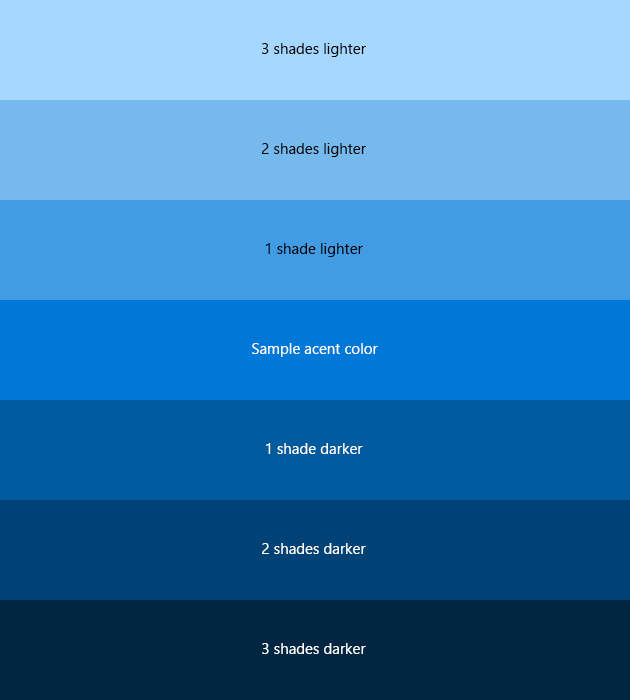
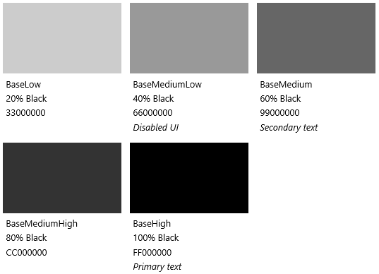

# <a name="color"></a>Color

<link rel="stylesheet" href="https://az835927.vo.msecnd.net/sites/uwp/Resources/css/custom.css">

El color proporciona una forma intuitiva de orientarse entre los distintos niveles de información de una aplicación y resulta una herramienta crucial para reforzar el modelo de interacción.

En Windows, el color también es personal. Los usuarios pueden elegir un color y un tema claro u oscuro que se reflejen a lo largo de su experiencia.

## <a name="accent-color"></a>Color de énfasis

El usuario puede seleccionar un único color, llamado de énfasis, desde *Configuración > Personalización > Colores*. Tienen su selección de un conjunto ajustado de 48 muestras de color, excepto en Xbox, que tiene una paleta de 21 colores compatibles con TV.

### <a name="default-accent-colors"></a>Colores de énfasis predeterminados
<table class="uwpd-color-table" style="border: solid 4px white;">
        <tr >
            <td class="uwpd-color-table" style="background-color: #FFB900">FFB900</td>
            <td class="uwpd-color-table" style=" background-color: #E74856">E74856</td>
            <td class="uwpd-color-table" style=" background-color: #0078D7">0078D7</td>
            <td class="uwpd-color-table" style=" background-color: #0099BC">0099BC</td>
            <td class="uwpd-color-table" style=" background-color: #7A7574">7A7574</td>
            <td class="uwpd-color-table" style=" background-color: #767676">767676</td>
        </tr>
        <tr >
            <td class="uwpd-color-table" style=" background-color: #FF8C00">FF8C00</td>
            <td class="uwpd-color-table" style=" background-color: #E81123">E81123</td>
            <td class="uwpd-color-table" style=" background-color: #0063B1">0063B1</td>
            <td class="uwpd-color-table" style=" background-color: #2D7D9A">2D7D9A</td>
            <td class="uwpd-color-table" style=" background-color: #5D5A58">5D5A58</td>
            <td class="uwpd-color-table" style=" background-color: #4C4A48" >4C4A48</td>
        </tr>
        <tr >
            <td class="uwpd-color-table" style=" background-color: #F7630C" >F7630C</td>
            <td class="uwpd-color-table" style=" background-color: #EA005E" >EA005E</td>
            <td class="uwpd-color-table" style=" background-color: #8E8CD8" >8E8CD8</td>
            <td class="uwpd-color-table" style=" background-color: #00B7C3" >00B7C3</td>
            <td class="uwpd-color-table" style=" background-color: #68768A" >68768A</td>
            <td class="uwpd-color-table" style=" background-color: #69797E" >69797E</td>
        </tr>
        <tr >
            <td class="uwpd-color-table" style=" background-color: #CA5010" >CA5010</td>
            <td class="uwpd-color-table" style=" background-color: #C30052" >C30052</td>
            <td class="uwpd-color-table" style=" background-color: #6B69D6" >6B69D6</td>
            <td class="uwpd-color-table" style=" background-color: #038387" >038387</td>
            <td class="uwpd-color-table" style=" background-color: #515C6B" >515C6B</td>
            <td class="uwpd-color-table" style=" background-color: #4A5459" >4A5459</td>
        </tr>
        <tr >
            <td class="uwpd-color-table" style=" background-color: #DA3B01" >DA3B01</td>
            <td class="uwpd-color-table" style=" background-color: #E3008C" >E3008C</td>
            <td class="uwpd-color-table" style=" background-color: #8764B8" >8764B8</td>
            <td class="uwpd-color-table" style=" background-color: #00B294" >00B294</td>
            <td class="uwpd-color-table" style=" background-color: #567C73" >567C73</td>
            <td class="uwpd-color-table" style=" background-color: #647C64" >647C64</td>
        </tr>
        <tr >
            <td class="uwpd-color-table" style=" background-color: #EF6950" >EF6950</td>
            <td class="uwpd-color-table" style=" background-color: #BF0077" >BF0077</td>
            <td class="uwpd-color-table" style=" background-color: #744DA9" >744DA9</td>
            <td class="uwpd-color-table" style=" background-color: #018574" >018574</td>
            <td class="uwpd-color-table" style=" background-color: #486860" >486860</td>
            <td class="uwpd-color-table" style=" background-color: #525E54" >525E54</td>
        </tr>
        <tr >
            <td class="uwpd-color-table" style=" background-color: #D13438" >D13438</td>
            <td class="uwpd-color-table" style=" background-color: #C239B3" >C239B3</td>
            <td class="uwpd-color-table" style=" background-color: #B146C2" >B146C2</td>
            <td class="uwpd-color-table" style=" background-color: #00CC6A" >00CC6A</td>
            <td class="uwpd-color-table" style=" background-color: #498205" >498205</td>
            <td class="uwpd-color-table" style=" background-color: #847545" >847545</td>
        </tr>
        <tr >
            <td class="uwpd-color-table" style=" background-color: #FF4343" >FF4343</td>
            <td class="uwpd-color-table" style=" background-color: #9A0089" >9A0089</td>
            <td class="uwpd-color-table" style=" background-color: #881798" >881798</td>
            <td class="uwpd-color-table" style=" background-color: #10893E" >10893E</td>
            <td class="uwpd-color-table" style=" background-color: #107C10" >107C10</td>
            <td class="uwpd-color-table" style=" background-color: #7E735F" >7E735F</td>
        </tr>

</table>

### <a name="xbox-accent-colors"></a>Colores de énfasis de Xbox
  <table class="uwpd-color-table" style="border: solid 4px white;">
      <tr >
          <td class="uwpd-color-table" style="background-color: #EB8C10" >EB8C10</td>
          <td class="uwpd-color-table" style="background-color: #ED5588" >ED5588</td>
          <td class="uwpd-color-table" style="background-color: #1073D6" >1073D6</td>
          <td class="uwpd-color-table" style="background-color: #148282" >148282</td>
          <td class="uwpd-color-table" style="background-color: #107C10" >107C10</td>
          <td class="uwpd-color-table" style="background-color: #4C4A4B" >4C4A4B</td>
      </tr>
      <tr >
          <td class="uwpd-color-table" style="background-color: #EB4910" >EB4910</td>
          <td class="uwpd-color-table" style="background-color: #BF1077" >BF1077</td>
          <td class="uwpd-color-table" style="background-color: #193E91" >193E91</td>
          <td class="uwpd-color-table" style="background-color: #54A81B" >54A81B</td>
          <td class="uwpd-color-table" style="background-color: #737373" >737373</td>
          <td class="uwpd-color-table" style="background-color: #7E715C" >7E715C</td>
      </tr>
      <tr >
          <td class="uwpd-color-table" style="background-color: #E31123" >E31123</td>
          <td class="uwpd-color-table" style="background-color: #B144C0" >B144C0</td>
          <td class="uwpd-color-table" style="background-color: #1081CA" >1081CA</td>
          <td class="uwpd-color-table" style="background-color: #547A72" >547A72</td>
          <td class="uwpd-color-table" style="background-color: #677488" >677488</td>
          <td class="uwpd-color-table" style="background-color: #724F2F" >724F2F</td>
      </tr>
      <tr >
          <td class="uwpd-color-table" style="background-color: #A21025" >A21025</td>
          <td class="uwpd-color-table" style="background-color: #744DA9" >744DA9</td>
          <td class="uwpd-color-table" style="background-color: #108272" >108272</td>
          <td class="uwpd-color-table"></td>
          <td class="uwpd-color-table"></td>
          <td class="uwpd-color-table"></td>
      </tr>
  </table>


<div class="microsoft-internal-note">
Como regla general, cuando uses el color de énfasis como fondo, coloca siempre el texto en blanco encima. El color de énfasis predeterminado que se incluye con Windows ofrece una relación de contraste excelente con texto en blanco. Un usuario puede seleccionar un color de énfasis que tenga poco contraste con el blanco según su preferencia y es correcto. Si tiene problemas para leer, siempre se puede seleccionar un color de énfasis más oscuro.
</div>


Cuando se elige un color de énfasis, este aparece como parte del tema del sistema. Las áreas en las que influye son Inicio, barra de tareas, la ventana de cromo, los estados de interacción seleccionados y los hipervínculos dentro de los [controles comunes](../controls-and-patterns/index.md). Cada aplicación puede incorporar además el color de énfasis por medio de su tipografía, fondos e interacciones, o bien reemplazarlo todo para conservar la imagen de marca específica.

## <a name="color-palette-building-blocks"></a>Bloques de creación de paleta de colores

Una vez que se ha seleccionado un color de énfasis, los tonos claros y oscuros del color de énfasis se crean según los valores de HSB de luminosidad de color. Las aplicaciones pueden usar las variaciones de tono para crear una jerarquía visual y para proporcionar una indicación de interacción.

De manera predeterminada, los hipervínculos usarán el color de énfasis del usuario. Si el fondo de página es de un color similar, puedes asignar un tono más claro (o más oscuro) de énfasis para los hipervínculos a fin de mejorar el contraste.


<div class="uwpd-image-with-caption">
    
    <div>Distintos tonos claros y oscuros del color de énfasis predeterminado.</div>
</div>

<div class="uwpd-image-with-caption">
    
    <div>Un ejemplo de cómo se aplica la lógica de color a una especificación de diseño.</div>
</div>

>[!NOTE]
>En XAML, el color de énfasis principal se expone como un [recurso de tema](https://msdn.microsoft.com/library/windows/apps/Mt187274.aspx) denominado `SystemAccentColor`. Los tonos están disponibles como `SystemAccentColorLight3`, `SystemAccentColorLight2`, `SystemAccentColorLight1`, `SystemAccentColorDark1`, `SystemAccentColorDark2` y `SystemAccentColorDark3`. También está disponible mediante programación a través de [UISettings.GetColorValue](https://msdn.microsoft.com/library/windows/apps/windows.ui.viewmanagement.uisettings.getcolorvalue.aspx) y la enumeración [UIColorType](https://msdn.microsoft.com/library/windows/apps/windows.ui.viewmanagement.uicolortype.aspx).


## <a name="color-theming"></a>Temas de color

El usuario también puede elegir entre un tema claro u oscuro para el sistema. Algunas aplicaciones optan por cambiar su tema según las preferencias del usuario, mientras que otras no ofrecen esa opción.

Las aplicaciones que usan un tema claro son para escenarios relacionados con las aplicaciones de productividad. Un ejemplo sería el conjunto de aplicaciones disponibles con Microsoft Office. Los temas claros facilitan la lectura de textos largos en combinación con períodos prolongados de tiempo dedicado a largas tareas.

El tema oscuro ofrece un contraste de contenido más visible para las aplicaciones que están basadas en multimedia o para escenarios donde los usuarios están expuestos a una gran cantidad de vídeos o imágenes. En estos escenarios, la lectura no es necesariamente la tarea principal, aunque una experiencia multimedia puede mostrarse bajo condiciones de ambiente poco luminoso.

Si la aplicación no se ajusta mucho a cualquiera de estas descripciones, considera seguir el tema del sistema para permitir al usuario decidir cuál es el mejor.

Para facilitar el diseño de temas, Windows proporciona una paleta de colores adicional que se adapta automáticamente al tema.

### <a name="light-theme"></a>Tema claro
#### <a name="base"></a>Base

#### <a name="alt"></a>Alt

#### <a name="list"></a>List

#### <a name="chrome"></a>Chrome

### <a name="dark-theme"></a>Tema oscuro
#### <a name="base"></a>Base

#### <a name="alt"></a>Alt

#### <a name="list"></a>List

#### <a name="chrome"></a>Chrome


## <a name="changing-the-theme"></a>Modificación del tema

Puedes modificar los temas fácilmente modificando la propiedad **RequestedTheme** en tu App.xaml:

```XAML
<Application
    x:Class="App9.App"
    xmlns="http://schemas.microsoft.com/winfx/2006/xaml/presentation"
    xmlns:x="http://schemas.microsoft.com/winfx/2006/xaml"
    xmlns:local="using:App9"
    RequestedTheme="Dark">

</Application>
```

Eliminar el **RequestedTheme** significa que la aplicación respeta la configuración del modo de aplicación del usuario y se podrá optar por ver la aplicación en el tema oscuro o claro. 

Asegúrate de tomar el tema en consideración al crear tu aplicación, ya que tiene un gran impacto en la apariencia de la aplicación.

## <a name="accessibility"></a>Accesibilidad

La paleta está optimizada para el uso de la pantalla. Se recomienda mantener una relación de contraste para el texto de 4,5:1 respecto al fondo para mejorar la legibilidad. Hay muchas herramientas gratuitas para probar si los colores la cumplen, como [Contrast Ratio](http://leaverou.github.io/contrast-ratio/).

## <a name="related-articles"></a>Artículos relacionados

* [Estilos XAML](https://msdn.microsoft.com/windows/uwp/controls-and-patterns/xaml-theme-resources)
* [Recursos de temas XAML](https://msdn.microsoft.com/windows/uwp/controls-and-patterns/xaml-theme-resources)

