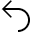
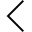
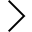
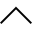
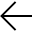
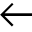
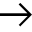
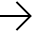

# Directrices para iconos de Segoe MDL2

En este artículo se enumeran y se proporcionan instrucciones de uso de los glifos que vienen con la fuente Segoe MDL2 Assets. Para obtener la fuente, debes instalar Windows 10.

**API importantes**

-   [**Enumeración Symbol (XAML)**](https://msdn.microsoft.com/library/windows/apps/dn252842)
-   [**Enumeración AppBarIcon (HTML)**](https://msdn.microsoft.com/library/windows/apps/hh770557)

## Recomendaciones

-   Usa estos glifos solamente cuando puedas especificar de forma explícita la fuente **Segoe MDL2 Assets**.

## Instrucciones de uso adicionales

La fuente de iconos **Segoe UI Symbol** de Windows 8/8.1 se ha reemplazado por la fuente **Segoe MDL2 Assets** a partir del lanzamiento de Windows 10. Se puede usar de forma muy parecida a la antigua, pero muchos glifos se han redibujado con el estilo de iconos de Windows 10 y con las medidas establecidas de modo que los iconos queden alineados dentro del cuadrado em de la fuente, y no con la línea base tipográfica.

**Nota** Un **em** es una unidad de medida de la fuente. En la fuente, 1 em es igual al 100 % del valor de punto especificado a 72 ppp. Por ejemplo 16 puntos es igual a 16 píxeles a 72 ppp (lo que también se conoce como meseta 100 %). Las nuevas fuentes MDL2 están diseñadas para que la superficie del icono sea un cuadrado em. Por lo tanto, si pones 16 píxeles de ancho y alto en el código, obtienes una superficie de icono de 16x16 píxeles. Eso no significa que el icono ocupe siempre esta superficie completa.

 

La **Segoe UI Symbol** seguirá estando disponible como recurso "heredado". Sin embargo, se recomienda que todas las aplicaciones se actualicen a la nueva **Segoe MDL2 Assets**.

La mayor parte de los iconos y controles de interfaz de usuario incluidos en la fuente **Segoe MDL2 Assets** están asignados a un área de uso privado (PUA) de Unicode. El PUA permite que los desarrolladores de fuentes asignen valores de Unicode privados a glifos que no se asignan a puntos de código existentes. Esto es útil al crear una fuente de símbolos, pero genera un problema de interoperabilidad. Si la fuente no está disponible, no se mostrarán los glifos. Usa estos glifos solamente cuando puedas especificar la fuente **Segoe MDL2 Assets** .

Si trabajas con iconos, no puedes usar estos glifos, porque no puedes especificar la fuente del icono y los glifos de PUA no están disponibles mediante la reserva de la fuente.

A diferencia de **Segoe UI Symbol**, los iconos de la fuente **Segoe MDL2 activos** no están diseñados para el uso en línea con texto. Esto significa que ya no sirven algunos "trucos" anteriores, como las flechas de muestra progresiva de opciones. De igual modo, como todos los nuevos iconos tienen el mismo tamaño y posición, no es necesario hacerlos con ancho cero. Ahora funcionan como un conjunto. En principio, es posible superponer directamente dos iconos diseñados como un conjunto, ya que encajarán perfectamente. Esto puede hacerse para permitir la coloración en el código. Por ejemplo, U+EA3A y U+EA3B se crearon para el estado de notificación del icono Inicio. Como ya están centrados, el relleno del círculo puede colorearse según el estado.

Segoe UI Symbol también dependía de los glifos de "ancho cero" para la superposición y la coloración, como en este ejemplo en el que se crea un contorno grueso (U+E006) sobre el corazón rojo de ancho cero (U+E00B).

Todos los glifos de **Segoe MDL2 Assets** tienen el mismo ancho fijo y un alto y un punto de origen izquierdo coherentes, de modo que es posible lograr efectos de superposición y coloreado simplemente superponiendo glifos.

Muchos de los iconos también disponen de formas reflejas para su uso en idiomas que se leen de derecha a izquierda, como el árabe, el dari, el persa y el hebreo.

Si desarrollas una aplicación en C#, VB, C++ y XAML, puedes elegir usar la [**enumeración Symbol**](https://msdn.microsoft.com/library/windows/apps/dn252842) en lugar del id. de Unicode para especificar glifos en la fuente Segoe MDL2 Assets. Si desarrollas una aplicación en JavaScript y HTML, puedes elegir usar la [**enumeración AppBarIcon**](https://msdn.microsoft.com/library/windows/apps/hh770557) en lugar del id. de Unicode para especificar glifos en la fuente **Segoe MDL2 Assets**.

Además, ten en cuenta que la fuente **Segoe MDL2 Assets** incluye muchos más iconos de los que podemos mostrar aquí. Muchos de ellos están pensados para efectos especializados y no suelen usarse para otra cosa.

## Corazones

<table>
<colgroup>
<col width="25%" />
<col width="25%" />
<col width="25%" />
<col width="25%" />
</colgroup>
<thead>
<tr class="header">
<th align="left">Código</th>
<th align="left">Símbolo</th>
<th align="left">Enumeración</th>
<th align="left">Descripción</th>
</tr>
</thead>
<tbody>
<tr class="odd">
<td align="left">
U+E006
</td>
<td align="left"></td>
<td align="left">
HeartLegacy
</td>
<td align="left">
Corazón delineado
</td>
</tr>
<tr class="even">
<td align="left">
U+E0A5
</td>
<td align="left"></td>
<td align="left">
HeartFillLegacy
</td>
<td align="left">
Corazón sólido
</td>
</tr>
<tr class="odd">
<td align="left">
U+E007
</td>
<td align="left"></td>
<td align="left">
HeartBrokenLegacy
</td>
<td align="left">
Corazón roto
</td>
</tr>
<tr class="even">
<td align="left">
U+E00B
</td>
<td align="left"></td>
<td align="left">
HeartFillZeroWidthLegacy
</td>
<td align="left">
Corazón sólido (ancho cero)
</td>
</tr>
<tr class="odd">
<td align="left">
U+E00C
</td>
<td align="left"></td>
<td align="left">
HeartBrokenZeroWidthLegacy
</td>
<td align="left">
Corazón roto (ancho cero)
</td>
</tr>
</tbody>
</table>

 

## Estrellas de calificación

<table>
<colgroup>
<col width="25%" />
<col width="25%" />
<col width="25%" />
<col width="25%" />
</colgroup>
<thead>
<tr class="header">
<th align="left">Código</th>
<th align="left">Símbolo</th>
<th align="left">Enumeración</th>
<th align="left">Descripción</th>
</tr>
</thead>
<tbody>
<tr class="odd">
<td align="left">U+E224</td>
<td align="left"></td>
<td align="left">RatingStarLegacy</td>
<td align="left">Estrella delineada</td>
</tr>
<tr class="even">
<td align="left">U+E0B4</td>
<td align="left"></td>
<td align="left">RatingStarFillLegacy</td>
<td align="left">Estrella sólida</td>
</tr>
<tr class="odd">
<td align="left">U+E00A</td>
<td align="left"></td>
<td align="left">RatingStarFillZeroWidthLegacy</td>
<td align="left">Estrella sólida (ancho cero)</td>
</tr>
<tr class="even">
<td align="left">U+E082</td>
<td align="left"></td>
<td align="left">RatingStarFillReducedPaddingHTMLLegacy</td>
<td align="left">Estrella sólida (espaciado reducido para su uso en HTML)</td>
</tr>
<tr class="odd">
<td align="left">U+E0B5</td>
<td align="left"></td>
<td align="left">RatingStarFillSmallLegacy</td>
<td align="left">Estrella pequeña</td>
</tr>
<tr class="even">
<td align="left">U+E7C6</td>
<td align="left"></td>
<td align="left">HalfStarLeft</td>
<td align="left">Media estrella, lado izquierdo</td>
</tr>
<tr class="odd">
<td align="left">
U+E7C7
</td>
<td align="left"></td>
<td align="left">HalfStarRight</td>
<td align="left">Media estrella, lado derecho</td>
</tr>
</tbody>
</table>

 

## Componentes de casilla

|        |                                                                                |                                 |                         |
|--------|--------------------------------------------------------------------------------|---------------------------------|-------------------------|
| Código   | Símbolo                                                                         | Enumeración                            | Descripción             |
| U+E001 |                                  | CheckMarkLegacy                 | Marca de verificación              |
| U+E002 |                            | CheckboxFillLegacy              | Casilla rellena         |
| U+E003 |                                    | CheckboxLegacy                  | Casilla                |
| U+E004 |          | CheckboxIndeterminateLegacy     | Estado indeterminado     |
| U+E005 |  | CheckboxCompositeReversedLegacy | Invertida                |
| U+E008 |                | CheckMarkZeroWidthLegacy        | Marca de verificación (ancho cero) |
| U+E009 |          | CheckboxFillZeroWidthLegacy     | Relleno (ancho cero)       |
| U+E0A2 |                  | CheckboxCompositeLegacy         | Compuesta               |
| U+E739 |                                                | Checkbox                        | Casilla                |
| U+E73A |                              | CheckboxComposite               | Casilla compuesta      |
| U+E73B |                                        | CheckboxFill                    | Casilla rellena         |
| U+E73C |                      | CheckboxIndeterminate           | Estado indeterminado     |
| U+E73D |              | CheckboxCompositeReversed       | Compuesta invertida      |
| U+E73E |                                              | CheckMark                       | Marca de verificación              |

 

## Varios

<table>
<colgroup>
<col width="25%" />
<col width="25%" />
<col width="25%" />
<col width="25%" />
</colgroup>
<thead>
<tr class="header">
<th align="left">Código</th>
<th align="left">Símbolo</th>
<th align="left">Enumeración</th>
<th align="left">Descripción</th>
</tr>
</thead>
<tbody>
<tr class="odd">
<td align="left">
U+E134
</td>
<td align="left"></td>
<td align="left">CommentLegacy</td>
<td align="left">Comentario</td>
</tr>
<tr class="even">
<td align="left">
U+E113
</td>
<td align="left"></td>
<td align="left">FavoriteLegacy</td>
<td align="left"></td>
</tr>
<tr class="odd">
<td align="left">
U+E195
</td>
<td align="left"></td>
<td align="left">No favoritoLegacy</td>
<td align="left"></td>
</tr>
<tr class="even">
<td align="left">
U+E734
</td>
<td align="left"></td>
<td align="left">FavoriteStar</td>
<td align="left">Favorito delineado</td>
</tr>
<tr class="odd">
<td align="left">
U+E735
</td>
<td align="left"></td>
<td align="left">FavoriteStarFill</td>
<td align="left"></td>
</tr>
<tr class="even">
<td align="left">
U+E8D9
</td>
<td align="left"></td>
<td align="left">No favorito</td>
<td align="left"></td>
</tr>
<tr class="odd">
<td align="left">
U+E19F
</td>
<td align="left"></td>
<td align="left">LikeLegacy</td>
<td align="left"></td>
</tr>
<tr class="even">
<td align="left">
U+E19E
</td>
<td align="left"></td>
<td align="left">DislikeLegacy</td>
<td align="left"></td>
</tr>
<tr class="odd">
<td align="left">
U+E19D
</td>
<td align="left"></td>
<td align="left">LikeDislikeLegacy</td>
<td align="left"></td>
</tr>
<tr class="even">
<td align="left">
U+E116
</td>
<td align="left"></td>
<td align="left">VideoLegacy</td>
<td align="left"></td>
</tr>
<tr class="odd">
<td align="left">
U+E714
</td>
<td align="left"></td>
<td align="left">Video</td>
<td align="left"></td>
</tr>
<tr class="even">
<td align="left">
U+E20B
</td>
<td align="left"></td>
<td align="left">MailMessageLegacy</td>
<td align="left">Heredado de correo</td>
</tr>
<tr class="odd">
<td align="left">
U+E248
</td>
<td align="left"></td>
<td align="left">ResponderLegacy</td>
<td align="left">Responder</td>
</tr>
<tr class="even">
<td align="left">
U+E249
</td>
<td align="left"></td>
<td align="left">Favorite2Legacy</td>
<td align="left">Favorito relleno</td>
</tr>
<tr class="odd">
<td align="left">
U+E24E
</td>
<td align="left"></td>
<td align="left">No favorito2Legacy</td>
<td align="left">No favorito</td>
</tr>
<tr class="even">
<td align="left">
U+E25A
</td>
<td align="left"></td>
<td align="left">MobileContactLegacy</td>
<td align="left">Contacto móvil</td>
</tr>
<tr class="odd">
<td align="left">
U+E25B
</td>
<td align="left"></td>
<td align="left">BlockedLegacy</td>
<td align="left">Contacto bloqueado</td>
</tr>
<tr class="even">
<td align="left">
U+E25C
</td>
<td align="left"></td>
<td align="left">TypingIndicatorLegacy</td>
<td align="left">Indicador de escritura</td>
</tr>
<tr class="odd">
<td align="left">
U+E25D
</td>
<td align="left"></td>
<td align="left">PresenceChickletVideoLegacy</td>
<td align="left">Chicklet de presencia de vídeo</td>
</tr>
<tr class="even">
<td align="left">
U+E25E
</td>
<td align="left"></td>
<td align="left">PresenceChickletLegacy</td>
<td align="left">Chicklet de presencia</td>
</tr>
</tbody>
</table>

 

## Flechas de la barra de desplazamiento

| Código   | Símbolo                                                                   | Enumeración                         |
|--------|--------------------------------------------------------------------------|------------------------------|
| U+E00E |            | ScrollChevronLeftLegacy      |
| U+E00F |          | ScrollChevronRightLegacy     |
| U+E010 |                | ScrollChevronUpLegacy        |
| U+E011 |            | ScrollChevronDownLegacy      |
| U+E016 |    | ScrollChevronLeftBoldLegacy  |
| U+E017 |  | ScrollChevronRightBoldLegacy |
| U+E018 |        | ScrollChevronUpBoldLegacy    |
| U+E019 |    | ScrollChevronDownBoldLegacy  |

 

## Botones Atrás

Los glifos heredados para los botones Atrás están disponibles en 2 tamaños distintos, de modo que el espesor del círculo exterior sea uniforme en 20 y 42 puntos. También están disponibles dos nuevos botones Atrás de cromo proporcional. Estos glifos están diseñados para admitir la disposición en capas.

| Código   | Símbolo                                                                     | Enumeración                          | Descripción                               |
|--------|----------------------------------------------------------------------------|-------------------------------|-------------------------------------------|
| U+E0C4 |                  | BackBttnArrow20Legacy         | Flecha de botón Atrás, 20 puntos                   |
| U+E0A6 |                  | BackBttnArrow42Legacy         | Flecha de botón Atrás, 42 puntos                   |
| U+E0AD |  | BackBttnMirroredArrow20Legacy | Flecha de botón Atrás reflejada invertida, 20 puntos |
| U+E0AB |  | BackBttnMirroredArrow42Legacy | Flecha de botón Atrás reflejada invertida, 42 puntos |
| U+E830 |                                        | ChromeBack                    | Botón Atrás cromo                        |
| U+EA47 |                        | ChromeBackMirrored            | Botón Atrás cromo reflejado               |

 

## Flechas Atrás para HTML

Agrega más código para crear círculos alrededor de estos glifos.

| Código   | Símbolo                                                         | Enumeración                    | Descripción                |
|--------|----------------------------------------------------------------|-------------------------|----------------------------|
| U+E0D5 |                  | ArrowHTMLLegacy         | Flecha de uso HTML         |
| U+E0AE |  | ArrowHTMLMirroredLegacy | Versión reflejada de U+E0D5 |

 

## Glifos de AppBar

Usa glifos de la siguiente lista para una [**AppBar**](https://msdn.microsoft.com/library/windows/apps/br229670). Por convención, las referencias a estos glifos se realizan por su nombre de enumeración. Están diseñados como iconos de 20 x 20 píxeles sin círculo.

<table>
<colgroup>
<col width="25%" />
<col width="25%" />
<col width="25%" />
<col width="25%" />
</colgroup>
<thead>
<tr class="header">
<th align="left">Código</th>
<th align="left">Símbolo</th>
<th align="left">Enumeración</th>
<th align="left">Descripción</th>
</tr>
</thead>
<tbody>
<tr class="odd">
<td align="left">U+E8FB</td>
<td align="left"></td>
<td align="left">Accept</td>
<td align="left"></td>
</tr>
<tr class="even">
<td align="left">U+E910</td>
<td align="left"></td>
<td align="left">Accounts</td>
<td align="left"></td>
</tr>
<tr class="odd">
<td align="left">U+E710</td>
<td align="left"></td>
<td align="left">Add</td>
<td align="left"></td>
</tr>
<tr class="even">
<td align="left">U+E8FA</td>
<td align="left"></td>
<td align="left">AddFriend</td>
<td align="left"></td>
</tr>
<tr class="odd">
<td align="left">U+E7EF</td>
<td align="left"></td>
<td align="left">Admin</td>
<td align="left"></td>
</tr>
<tr class="even">
<td align="left">U+E8E3</td>
<td align="left"></td>
<td align="left">AlignCenter</td>
<td align="left"></td>
</tr>
<tr class="odd">
<td align="left">U+E8E4</td>
<td align="left"></td>
<td align="left">AlignLeft</td>
<td align="left"></td>
</tr>
<tr class="even">
<td align="left">U+E8E2</td>
<td align="left"></td>
<td align="left">Alignright</td>
<td align="left"></td>
</tr>
<tr class="odd">
<td align="left">U+E71D</td>
<td align="left"></td>
<td align="left">AllApps</td>
<td align="left"></td>
</tr>
<tr class="even">
<td align="left">U+E723</td>
<td align="left"></td>
<td align="left">Attach</td>
<td align="left"></td>
</tr>
<tr class="odd">
<td align="left">U+E8A2</td>
<td align="left"></td>
<td align="left">AttachCamera</td>
<td align="left"></td>
</tr>
<tr class="even">
<td align="left">U+E8D6</td>
<td align="left"></td>
<td align="left">Audio</td>
<td align="left"></td>
</tr>
<tr class="odd">
<td align="left">U+E72B</td>
<td align="left"></td>
<td align="left">Back</td>
<td align="left"></td>
</tr>
<tr class="even">
<td align="left">U+E73F</td>
<td align="left"></td>
<td align="left">BackToWindow</td>
<td align="left"></td>
</tr>
<tr class="odd">
<td align="left">U+E8F8</td>
<td align="left"></td>
<td align="left">BlockContact</td>
<td align="left"></td>
</tr>
<tr class="even">
<td align="left">U+E8DD</td>
<td align="left"></td>
<td align="left">Bold</td>
<td align="left"></td>
</tr>
<tr class="odd">
<td align="left">U+E8A4</td>
<td align="left"></td>
<td align="left">Bookmarks</td>
<td align="left"></td>
</tr>
<tr class="even">
<td align="left">U+E7C5</td>
<td align="left"></td>
<td align="left">BrowsePhotos</td>
<td align="left"></td>
</tr>
<tr class="odd">
<td align="left">U+E8FD</td>
<td align="left"></td>
<td align="left">BulletedList</td>
<td align="left"></td>
</tr>
<tr class="even">
<td align="left">U+E8EF</td>
<td align="left"></td>
<td align="left">Calculator</td>
<td align="left"></td>
</tr>
<tr class="odd">
<td align="left">U+E787</td>
<td align="left"></td>
<td align="left">Calendar</td>
<td align="left"></td>
</tr>
<tr class="even">
<td align="left">U+E8BF</td>
<td align="left"></td>
<td align="left">CalendarDay</td>
<td align="left"></td>
</tr>
<tr class="odd">
<td align="left">U+E8F5</td>
<td align="left"></td>
<td align="left">CalendarReply</td>
<td align="left"></td>
</tr>
<tr class="even">
<td align="left">U+E8C0</td>
<td align="left"></td>
<td align="left">CalendarWeek</td>
<td align="left"></td>
</tr>
<tr class="odd">
<td align="left">U+E722</td>
<td align="left"></td>
<td align="left">Camera</td>
<td align="left"></td>
</tr>
<tr class="even">
<td align="left">U+E711</td>
<td align="left"></td>
<td align="left">Cancel</td>
<td align="left"></td>
</tr>
<tr class="odd">
<td align="left">U+E8BA</td>
<td align="left"></td>
<td align="left">Caption</td>
<td align="left"></td>
</tr>
<tr class="even">
<td align="left">U+E7F0</td>
<td align="left"></td>
<td align="left">CC</td>
<td align="left"></td>
</tr>
<tr class="odd">
<td align="left">U+E8EA</td>
<td align="left"></td>
<td align="left">Cellphone</td>
<td align="left"></td>
</tr>
<tr class="even">
<td align="left">U+E8C1</td>
<td align="left"></td>
<td align="left">Characters</td>
<td align="left"></td>
</tr>
<tr class="odd">
<td align="left">U+E894</td>
<td align="left"></td>
<td align="left">Clear</td>
<td align="left"></td>
</tr>
<tr class="even">
<td align="left">U+E8E6</td>
<td align="left"></td>
<td align="left">ClearSelection</td>
<td align="left"></td>
</tr>
<tr class="odd">
<td align="left">U+E89F</td>
<td align="left"></td>
<td align="left">ClosePane</td>
<td align="left"></td>
</tr>
<tr class="even">
<td align="left">U+E753</td>
<td align="left"></td>
<td align="left">Cloud</td>
<td align="left"></td>
</tr>
<tr class="odd">
<td align="left">U+E90A</td>
<td align="left"></td>
<td align="left">Comment</td>
<td align="left"></td>
</tr>
<tr class="even">
<td align="left">U+E77B</td>
<td align="left"></td>
<td align="left">Contact</td>
<td align="left"></td>
</tr>
<tr class="odd">
<td align="left">U+E8D4</td>
<td align="left"></td>
<td align="left">Contact2</td>
<td align="left"></td>
</tr>
<tr class="even">
<td align="left">U+E779</td>
<td align="left"></td>
<td align="left">ContactInfo</td>
<td align="left"></td>
</tr>
<tr class="odd">
<td align="left">U+E8CF</td>
<td align="left"></td>
<td align="left">ContactPresence</td>
<td align="left"></td>
</tr>
<tr class="even">
<td align="left">U+E8C8</td>
<td align="left"></td>
<td align="left">Copy</td>
<td align="left"></td>
</tr>
<tr class="odd">
<td align="left">U+E7A8</td>
<td align="left"></td>
<td align="left">Crop</td>
<td align="left"></td>
</tr>
<tr class="even">
<td align="left">U+E8C6</td>
<td align="left"></td>
<td align="left">Cut</td>
<td align="left"></td>
</tr>
<tr class="odd">
<td align="left">U+E74D</td>
<td align="left"></td>
<td align="left">Delete</td>
<td align="left"></td>
</tr>
<tr class="even">
<td align="left">U+E8F0</td>
<td align="left"></td>
<td align="left">Directions</td>
<td align="left"></td>
</tr>
<tr class="odd">
<td align="left">U+E8D8</td>
<td align="left"></td>
<td align="left">DisableUpdates</td>
<td align="left"></td>
</tr>
<tr class="even">
<td align="left">U+E8CD</td>
<td align="left"></td>
<td align="left">DisconnectDrive</td>
<td align="left"></td>
</tr>
<tr class="odd">
<td align="left">U+E8E0</td>
<td align="left"></td>
<td align="left">Dislike</td>
<td align="left"></td>
</tr>
<tr class="even">
<td align="left">U+E90E</td>
<td align="left"></td>
<td align="left">DockBottom</td>
<td align="left"></td>
</tr>
<tr class="odd">
<td align="left">U+E90C</td>
<td align="left"></td>
<td align="left">DockLeft</td>
<td align="left"></td>
</tr>
<tr class="even">
<td align="left">U+E90D</td>
<td align="left"></td>
<td align="left">DockRight</td>
<td align="left"></td>
</tr>
<tr class="odd">
<td align="left">U+E8A5</td>
<td align="left"></td>
<td align="left">Document</td>
<td align="left"></td>
</tr>
<tr class="even">
<td align="left">U+E896</td>
<td align="left"></td>
<td align="left">Download</td>
<td align="left"></td>
</tr>
<tr class="odd">
<td align="left">U+E70F</td>
<td align="left"></td>
<td align="left">Edit</td>
<td align="left"></td>
</tr>
<tr class="even">
<td align="left">U+E899</td>
<td align="left"></td>
<td align="left">Emoji</td>
<td align="left"></td>
</tr>
<tr class="odd">
<td align="left">U+E76E</td>
<td align="left"></td>
<td align="left">Emoji2</td>
<td align="left"></td>
</tr>
<tr class="even">
<td align="left">U+E728</td>
<td align="left"></td>
<td align="left">FavoriteList</td>
<td align="left"></td>
</tr>
<tr class="odd">
<td align="left">U+E734</td>
<td align="left"></td>
<td align="left">FavoriteStar</td>
<td align="left"></td>
</tr>
<tr class="even">
<td align="left">U+E735</td>
<td align="left"></td>
<td align="left">FavoriteStarFill</td>
<td align="left"></td>
</tr>
<tr class="odd">
<td align="left">U+E71C</td>
<td align="left"></td>
<td align="left">Filter</td>
<td align="left"></td>
</tr>
<tr class="even">
<td align="left">U+E11A</td>
<td align="left"></td>
<td align="left">FindLegacy</td>
<td align="left"></td>
</tr>
<tr class="odd">
<td align="left">U+E7C1</td>
<td align="left"></td>
<td align="left">Flag</td>
<td align="left"></td>
</tr>
<tr class="even">
<td align="left">U+E8B7</td>
<td align="left"></td>
<td align="left">Folder</td>
<td align="left"></td>
</tr>
<tr class="odd">
<td align="left">U+E8D2</td>
<td align="left"></td>
<td align="left">Font</td>
<td align="left"></td>
</tr>
<tr class="even">
<td align="left">U+E8D3</td>
<td align="left"></td>
<td align="left">Fontcolor</td>
<td align="left"></td>
</tr>
<tr class="odd">
<td align="left">U+E8E7</td>
<td align="left"></td>
<td align="left">FontDecrease</td>
<td align="left"></td>
</tr>
<tr class="even">
<td align="left">U+E8E8</td>
<td align="left"></td>
<td align="left">FontIncrease</td>
<td align="left"></td>
</tr>
<tr class="odd">
<td align="left">U+E8E9</td>
<td align="left"></td>
<td align="left">FontSize</td>
<td align="left"></td>
</tr>
<tr class="even">
<td align="left">U+E72A</td>
<td align="left"></td>
<td align="left">Forward</td>
<td align="left"></td>
</tr>
<tr class="odd">
<td align="left">U+E908</td>
<td align="left"></td>
<td align="left">FourBars</td>
<td align="left"></td>
</tr>
<tr class="even">
<td align="left">U+E740</td>
<td align="left"></td>
<td align="left">FullScreen</td>
<td align="left"></td>
</tr>
<tr class="odd">
<td align="left">U+E774</td>
<td align="left"></td>
<td align="left">Globe</td>
<td align="left"></td>
</tr>
<tr class="even">
<td align="left">U+E8AD</td>
<td align="left"></td>
<td align="left">Go</td>
<td align="left"></td>
</tr>
<tr class="odd">
<td align="left">U+E8FC</td>
<td align="left"></td>
<td align="left">GoToStart</td>
<td align="left"></td>
</tr>
<tr class="even">
<td align="left">U+E8D1</td>
<td align="left"></td>
<td align="left">GoToToday</td>
<td align="left"></td>
</tr>
<tr class="odd">
<td align="left">U+E778</td>
<td align="left"></td>
<td align="left">Hangup</td>
<td align="left"></td>
</tr>
<tr class="even">
<td align="left">U+E897</td>
<td align="left"></td>
<td align="left">Help</td>
<td align="left"></td>
</tr>
<tr class="odd">
<td align="left">U+E8C5</td>
<td align="left"></td>
<td align="left">HideBCC</td>
<td align="left"></td>
</tr>
<tr class="even">
<td align="left">U+E7E6</td>
<td align="left"></td>
<td align="left">Highlight</td>
<td align="left"></td>
</tr>
<tr class="odd">
<td align="left">U+E80F</td>
<td align="left"></td>
<td align="left">Home</td>
<td align="left"></td>
</tr>
<tr class="even">
<td align="left">U+E8B5</td>
<td align="left"></td>
<td align="left">Import</td>
<td align="left"></td>
</tr>
<tr class="odd">
<td align="left">U+E8B6</td>
<td align="left"></td>
<td align="left">ImportAll</td>
<td align="left"></td>
</tr>
<tr class="even">
<td align="left">U+E8C9</td>
<td align="left"></td>
<td align="left">Important</td>
<td align="left"></td>
</tr>
<tr class="odd">
<td align="left">U+E8DB</td>
<td align="left"></td>
<td align="left">Italic</td>
<td align="left"></td>
</tr>
<tr class="even">
<td align="left">U+E765</td>
<td align="left"></td>
<td align="left">KeyboardClassic</td>
<td align="left"></td>
</tr>
<tr class="odd">
<td align="left">U+E89B</td>
<td align="left"></td>
<td align="left">LeaveChat</td>
<td align="left"></td>
</tr>
<tr class="even">
<td align="left">U+E8F1</td>
<td align="left"></td>
<td align="left">Library</td>
<td align="left"></td>
</tr>
<tr class="odd">
<td align="left">U+E8E1</td>
<td align="left"></td>
<td align="left">Like</td>
<td align="left"></td>
</tr>
<tr class="even">
<td align="left">U+E8DF</td>
<td align="left"></td>
<td align="left">LikeDislike</td>
<td align="left"></td>
</tr>
<tr class="odd">
<td align="left">U+E71B</td>
<td align="left"></td>
<td align="left">Link</td>
<td align="left"></td>
</tr>
<tr class="even">
<td align="left">U+EA37</td>
<td align="left"></td>
<td align="left">List</td>
<td align="left"></td>
</tr>
<tr class="odd">
<td align="left">U+E81D</td>
<td align="left"></td>
<td align="left">Location</td>
<td align="left"></td>
</tr>
<tr class="even">
<td align="left">U+E715</td>
<td align="left"></td>
<td align="left">Mail</td>
<td align="left"></td>
</tr>
<tr class="odd">
<td align="left">U+E8A8</td>
<td align="left"></td>
<td align="left">MailFill</td>
<td align="left"></td>
</tr>
<tr class="even">
<td align="left">U+E89C</td>
<td align="left"></td>
<td align="left">MailForward</td>
<td align="left"></td>
</tr>
<tr class="odd">
<td align="left">U+E8CA</td>
<td align="left"></td>
<td align="left">MailReply</td>
<td align="left"></td>
</tr>
<tr class="even">
<td align="left">U+E8C2</td>
<td align="left"></td>
<td align="left">MailReplyAll</td>
<td align="left"></td>
</tr>
<tr class="odd">
<td align="left">U+E912</td>
<td align="left"></td>
<td align="left">Manage</td>
<td align="left"></td>
</tr>
<tr class="even">
<td align="left">U+E8CE</td>
<td align="left"></td>
<td align="left">MapDrive</td>
<td align="left"></td>
</tr>
<tr class="odd">
<td align="left">U+E707</td>
<td align="left"></td>
<td align="left">Mappin</td>
<td align="left"></td>
</tr>
<tr class="even">
<td align="left">U+E77C</td>
<td align="left"></td>
<td align="left">Memo</td>
<td align="left"></td>
</tr>
<tr class="odd">
<td align="left">U+E8BD</td>
<td align="left"></td>
<td align="left">Message</td>
<td align="left"></td>
</tr>
<tr class="even">
<td align="left">U+E720</td>
<td align="left"></td>
<td align="left">Microphone</td>
<td align="left"></td>
</tr>
<tr class="odd">
<td align="left">U+E712</td>
<td align="left"></td>
<td align="left">More</td>
<td align="left"></td>
</tr>
<tr class="even">
<td align="left">U+E8DE</td>
<td align="left"></td>
<td align="left">MoveToFolder</td>
<td align="left"></td>
</tr>
<tr class="odd">
<td align="left">U+E90B</td>
<td align="left"></td>
<td align="left">MusicInfo</td>
<td align="left"></td>
</tr>
<tr class="even">
<td align="left">U+E74F</td>
<td align="left"></td>
<td align="left">Mute</td>
<td align="left"></td>
</tr>
<tr class="odd">
<td align="left">U+E8F4</td>
<td align="left"></td>
<td align="left">NewFolder</td>
<td align="left"></td>
</tr>
<tr class="even">
<td align="left">U+E78B</td>
<td align="left"></td>
<td align="left">NewWindow</td>
<td align="left"></td>
</tr>
<tr class="odd">
<td align="left">U+E893</td>
<td align="left"></td>
<td align="left">Next</td>
<td align="left"></td>
</tr>
<tr class="even">
<td align="left">U+E905</td>
<td align="left"></td>
<td align="left">OneBar</td>
<td align="left"></td>
</tr>
<tr class="odd">
<td align="left">U+E8E5</td>
<td align="left"></td>
<td align="left">OpenFile</td>
<td align="left"></td>
</tr>
<tr class="even">
<td align="left">U+E8DA</td>
<td align="left"></td>
<td align="left">OpenLocal</td>
<td align="left"></td>
</tr>
<tr class="odd">
<td align="left">U+E8A0</td>
<td align="left"></td>
<td align="left">OpenPane</td>
<td align="left"></td>
</tr>
<tr class="even">
<td align="left">U+E7AC</td>
<td align="left"></td>
<td align="left">OpenWith</td>
<td align="left"></td>
</tr>
<tr class="odd">
<td align="left">U+E8B4</td>
<td align="left"></td>
<td align="left">Orientation</td>
<td align="left"></td>
</tr>
<tr class="even">
<td align="left">U+E7EE</td>
<td align="left"></td>
<td align="left">OtherUser</td>
<td align="left"></td>
</tr>
<tr class="odd">
<td align="left">U+E1CE</td>
<td align="left"></td>
<td align="left">OutlineStarLegacy</td>
<td align="left"></td>
</tr>
<tr class="even">
<td align="left">U+E7C3</td>
<td align="left"></td>
<td align="left">Page</td>
<td align="left"></td>
</tr>
<tr class="odd">
<td align="left">U+E77F</td>
<td align="left"></td>
<td align="left">Paste</td>
<td align="left"></td>
</tr>
<tr class="even">
<td align="left">U+E769</td>
<td align="left"></td>
<td align="left">Pause</td>
<td align="left"></td>
</tr>
<tr class="odd">
<td align="left">U+E716</td>
<td align="left"></td>
<td align="left">People</td>
<td align="left"></td>
</tr>
<tr class="even">
<td align="left">U+E8D7</td>
<td align="left"></td>
<td align="left">Permissions</td>
<td align="left"></td>
</tr>
<tr class="odd">
<td align="left">U+E717</td>
<td align="left"></td>
<td align="left">Phone</td>
<td align="left"></td>
</tr>
<tr class="even">
<td align="left">U+E780</td>
<td align="left"></td>
<td align="left">PhoneBook</td>
<td align="left"></td>
</tr>
<tr class="odd">
<td align="left">U+E718</td>
<td align="left"></td>
<td align="left">Pin</td>
<td align="left"></td>
</tr>
<tr class="even">
<td align="left">U+E768</td>
<td align="left"></td>
<td align="left">Play</td>
<td align="left"></td>
</tr>
<tr class="odd">
<td align="left">U+E8F3</td>
<td align="left"></td>
<td align="left">PostUpdate</td>
<td align="left"></td>
</tr>
<tr class="even">
<td align="left">U+E8FF</td>
<td align="left"></td>
<td align="left">Preview</td>
<td align="left"></td>
</tr>
<tr class="odd">
<td align="left">U+E8A1</td>
<td align="left"></td>
<td align="left">PreviewLink</td>
<td align="left"></td>
</tr>
<tr class="even">
<td align="left">U+E892</td>
<td align="left"></td>
<td align="left">Previous</td>
<td align="left"></td>
</tr>
<tr class="odd">
<td align="left">U+E8D0</td>
<td align="left"></td>
<td align="left">Priority</td>
<td align="left"></td>
</tr>
<tr class="even">
<td align="left">U+E8A6</td>
<td align="left"></td>
<td align="left">ProtectedDocument</td>
<td align="left"></td>
</tr>
<tr class="odd">
<td align="left">U+E8C3</td>
<td align="left"></td>
<td align="left">Read</td>
<td align="left"></td>
</tr>
<tr class="even">
<td align="left">U+E7A6</td>
<td align="left"></td>
<td align="left">Redo</td>
<td align="left"></td>
</tr>
<tr class="odd">
<td align="left">U+E72C</td>
<td align="left"></td>
<td align="left">Refresh</td>
<td align="left"></td>
</tr>
<tr class="even">
<td align="left">U+E8AF</td>
<td align="left"></td>
<td align="left">Remote</td>
<td align="left"></td>
</tr>
<tr class="odd">
<td align="left">U+E738</td>
<td align="left"></td>
<td align="left">Remove</td>
<td align="left"></td>
</tr>
<tr class="even">
<td align="left">U+E8AC</td>
<td align="left"></td>
<td align="left">Rename</td>
<td align="left"></td>
</tr>
<tr class="odd">
<td align="left">U+E90F</td>
<td align="left"></td>
<td align="left">Repair</td>
<td align="left"></td>
</tr>
<tr class="even">
<td align="left">U+E8EE</td>
<td align="left"></td>
<td align="left">RepeatAll</td>
<td align="left"></td>
</tr>
<tr class="odd">
<td align="left">U+E8ED</td>
<td align="left"></td>
<td align="left">RepeatOne</td>
<td align="left"></td>
</tr>
<tr class="even">
<td align="left">U+E730</td>
<td align="left"></td>
<td align="left">ReportHacked</td>
<td align="left"></td>
</tr>
<tr class="odd">
<td align="left">U+E8EB</td>
<td align="left"></td>
<td align="left">Reshare</td>
<td align="left"></td>
</tr>
<tr class="even">
<td align="left">U+E7AD</td>
<td align="left"></td>
<td align="left">Rotate</td>
<td align="left"></td>
</tr>
<tr class="odd">
<td align="left">U+E89E</td>
<td align="left"></td>
<td align="left">RotateCamera</td>
<td align="left"></td>
</tr>
<tr class="even">
<td align="left">U+E74E</td>
<td align="left"></td>
<td align="left">Guardar</td>
<td align="left"></td>
</tr>
<tr class="odd">
<td align="left">U+E78C</td>
<td align="left"></td>
<td align="left">SaveLocal</td>
<td align="left"></td>
</tr>
<tr class="even">
<td align="left">U+E8FE</td>
<td align="left"></td>
<td align="left">Scan</td>
<td align="left"></td>
</tr>
<tr class="odd">
<td align="left">U+E8B3</td>
<td align="left"></td>
<td align="left">SelectAll</td>
<td align="left"></td>
</tr>
<tr class="even">
<td align="left">U+E724</td>
<td align="left"></td>
<td align="left">Send</td>
<td align="left"></td>
</tr>
<tr class="odd">
<td align="left">U+E7B5</td>
<td align="left"></td>
<td align="left">SetLockScreen</td>
<td align="left"></td>
</tr>
<tr class="even">
<td align="left">U+E97B</td>
<td align="left"></td>
<td align="left">SetTile</td>
<td align="left"></td>
</tr>
<tr class="odd">
<td align="left">U+E713</td>
<td align="left"></td>
<td align="left">Settings</td>
<td align="left"></td>
</tr>
<tr class="even">
<td align="left">U+E72D</td>
<td align="left"></td>
<td align="left">Share</td>
<td align="left"></td>
</tr>
<tr class="odd">
<td align="left">U+E719</td>
<td align="left"></td>
<td align="left">Shop</td>
<td align="left"></td>
</tr>
<tr class="even">
<td align="left">U+E8C4</td>
<td align="left"></td>
<td align="left">ShowBCC</td>
<td align="left"></td>
</tr>
<tr class="odd">
<td align="left">U+E8BC</td>
<td align="left"></td>
<td align="left">ShowResults</td>
<td align="left"></td>
</tr>
<tr class="even">
<td align="left">U+E8B1</td>
<td align="left"></td>
<td align="left">Shuffle</td>
<td align="left"></td>
</tr>
<tr class="odd">
<td align="left">U+E786</td>
<td align="left"></td>
<td align="left">Slideshow</td>
<td align="left"></td>
</tr>
<tr class="even">
<td align="left">U+E1CF</td>
<td align="left"></td>
<td align="left">SolidStarLegacy</td>
<td align="left"></td>
</tr>
<tr class="odd">
<td align="left">U+E8CB</td>
<td align="left"></td>
<td align="left">Sort</td>
<td align="left"></td>
</tr>
<tr class="even">
<td align="left">U+E71A</td>
<td align="left"></td>
<td align="left">Stop</td>
<td align="left"></td>
</tr>
<tr class="odd">
<td align="left">U+E913</td>
<td align="left"></td>
<td align="left">Street</td>
<td align="left"></td>
</tr>
<tr class="even">
<td align="left">U+E8AB</td>
<td align="left"></td>
<td align="left">Switch</td>
<td align="left"></td>
</tr>
<tr class="odd">
<td align="left">U+E8F9</td>
<td align="left"></td>
<td align="left">SwitchApps</td>
<td align="left"></td>
</tr>
<tr class="even">
<td align="left">U+E895</td>
<td align="left"></td>
<td align="left">Sync</td>
<td align="left"></td>
</tr>
<tr class="odd">
<td align="left">U+E8F7</td>
<td align="left"></td>
<td align="left">SyncFolder</td>
<td align="left"></td>
</tr>
<tr class="even">
<td align="left">U+E8EC</td>
<td align="left"></td>
<td align="left">Tag</td>
<td align="left"></td>
</tr>
<tr class="odd">
<td align="left">U+E907</td>
<td align="left"></td>
<td align="left">ThreeBars</td>
<td align="left"></td>
</tr>
<tr class="even">
<td align="left">U+E7C9</td>
<td align="left"></td>
<td align="left">TouchPointer</td>
<td align="left"></td>
</tr>
<tr class="odd">
<td align="left">U+E78A</td>
<td align="left"></td>
<td align="left">Trim</td>
<td align="left"></td>
</tr>
<tr class="even">
<td align="left">U+E906</td>
<td align="left"></td>
<td align="left">TwoBars</td>
<td align="left"></td>
</tr>
<tr class="odd">
<td align="left">U+E89A</td>
<td align="left"></td>
<td align="left">TwoPage</td>
<td align="left"></td>
</tr>
<tr class="even">
<td align="left">U+E8DC</td>
<td align="left"></td>
<td align="left">Underline</td>
<td align="left"></td>
</tr>
<tr class="odd">
<td align="left">U+E7A7</td>
<td align="left"></td>
<td align="left">Undo</td>
<td align="left"></td>
</tr>
<tr class="even">
<td align="left">U+E8D9</td>
<td align="left"></td>
<td align="left">UnFavorite</td>
<td align="left"></td>
</tr>
<tr class="odd">
<td align="left">U+E77A</td>
<td align="left"></td>
<td align="left">UnPin</td>
<td align="left"></td>
</tr>
<tr class="even">
<td align="left">U+E8F6</td>
<td align="left"></td>
<td align="left">UnSyncFolder</td>
<td align="left"></td>
</tr>
<tr class="odd">
<td align="left">U+E74A</td>
<td align="left"></td>
<td align="left">Up</td>
<td align="left"></td>
</tr>
<tr class="even">
<td align="left">U+E898</td>
<td align="left"></td>
<td align="left">Upload</td>
<td align="left"></td>
</tr>
<tr class="odd">
<td align="left">U+E8AA</td>
<td align="left"></td>
<td align="left">VideoChat</td>
<td align="left"></td>
</tr>
<tr class="even">
<td align="left">U+E890</td>
<td align="left"></td>
<td align="left">View</td>
<td align="left"></td>
</tr>
<tr class="odd">
<td align="left">U+E8A9</td>
<td align="left"></td>
<td align="left">ViewAll</td>
<td align="left"></td>
</tr>
<tr class="even">
<td align="left">U+E767</td>
<td align="left"></td>
<td align="left">Volume</td>
<td align="left"></td>
</tr>
<tr class="odd">
<td align="left">U+E8B8</td>
<td align="left"></td>
<td align="left">Webcam</td>
<td align="left"></td>
</tr>
<tr class="even">
<td align="left">U+E909</td>
<td align="left"></td>
<td align="left">World</td>
<td align="left"></td>
</tr>
<tr class="odd">
<td align="left">U+E904</td>
<td align="left"></td>
<td align="left">ZeroBars</td>
<td align="left"></td>
</tr>
<tr class="even">
<td align="left">U+E71E</td>
<td align="left"></td>
<td align="left">Zoom</td>
<td align="left"></td>
</tr>
<tr class="odd">
<td align="left">U+E8A3</td>
<td align="left"></td>
<td align="left">ZoomIn</td>
<td align="left"></td>
</tr>
<tr class="even">
<td align="left">U+E71F</td>
<td align="left"></td>
<td align="left">ZoomOut</td>
<td align="left"></td>
</tr>
</tbody>
</table>

 

## Iconos de batería

| Código | Símbolo                                             | Enumeración              | Código | Símbolo                                                  | Enumeración                |
|------|----------------------------------------------------|-------------------|------|---------------------------------------------------------|---------------------|
| E996 |        | BatteryUnknown    | EC02 |       | MobBatteryUnknown   |
| E850 |                    | Battery0          | EBA0 |                   | MobBattery0         |
| E851 |                    | Battery1          | EBA1 |                   | MobBattery1         |
| E852 |                    | Battery2          | EBA2 |                   | MobBattery2         |
| E853 |                    | Battery3          | EBA3 |                   | MobBattery3         |
| E854 |                    | Battery4          | EBA4 |                   | MobBattery4         |
| E855 |                    | Battery5          | EBA5 |                   | MobBattery5         |
| E856 |                    | Battery6          | EBA6 |                   | MobBattery6         |
| E857 |                    | Battery7          | EBA7 |                   | MobBattery7         |
| E858 |                    | Battery8          | EBA8 |                   | MobBattery8         |
| E859 |                    | Battery9          | EBA9 |                   | MobBattery9         |
| E83F |                  | Battery10         | EBA0 |                  | MobBatter10         |
| E85A |    | BatteryCharging0  | EBAB |   | MobBatteryCharging0 |
| E85B |    | BatteryCharging1  | EBAC |   | MobBatteryCharging1 |
| E85C |    | BatteryCharging2  | EBAD |   | MobBatteryCharging2 |
| E85D |    | BatteryCharging3  | EBAE |   | MobBatteryCharging3 |
| E85E |    | BatteryCharging4  | EBAF |   | MobBatteryCharging4 |
| E85F |    | BatteryCharging5  | EBB0 |   | MobBatteryCharging5 |
| E860 |    | BatteryCharging6  | EBB1 |   | MobBatteryCharging6 |
| E861 |    | BatteryCharging7  | EBB2 |   | MobBatteryCharging7 |
| E862 |    | BatteryCharging8  | EBB3 |   | MobBatteryCharging8 |
| E83E |    | BatteryCharging9  | EBB4 |   | MobBatteryCharging9 |
| ea93 |  | BatteryCharging10 | EBB5 |  | MobBatteryChargin10 |
| E863 |          | BatterySaver0     | EBB6 |         | MobBatterySaver0    |
| E864 |          | BatterySaver1     | EBB7 |         | MobBatterySaver1    |
| E865 |          | BatterySaver2     | EBB8 |         | MobBatterySaver2    |
| E866 |          | BatterySaver3     | EBB9 |         | MobBatterySaver3    |
| E867 |          | BatterySaver4     | EBBA |         | MobBatterySaver4    |
| E868 |          | BatterySaver5     | EBBB |         | MobBatterySaver5    |
| E869 |          | BatterySaver6     | EBBC |         | MobBatterySaver6    |
| E86A |          | BatterySaver7     | EBBD |         | MobBatterySaver7    |
| E86B |          | BatterySaver8     | EBBE |         | MobBatterySaver8    |
| EA94 |          | BatterySaver9     | EBBF |         | MobBatterySaver9    |
| EA95 |        | BatterySaver10    | EBC0 |       | MobBatterySaver10   |

 

## Temas relacionados

**Para diseñadores**
* [Directrices sobre fuentes](fonts.md)
* [W3C: ¿En qué idiomas se escribe de derecha a izquierda (RTL)?](http://www.i18nguy.com/temp/rtl.mdl)
**Para desarrolladores (XAML)**
* [**Enumeración Symbol**](https://msdn.microsoft.com/library/windows/apps/dn252842)

 

<!--HONumber=Jul16_HO2-->

