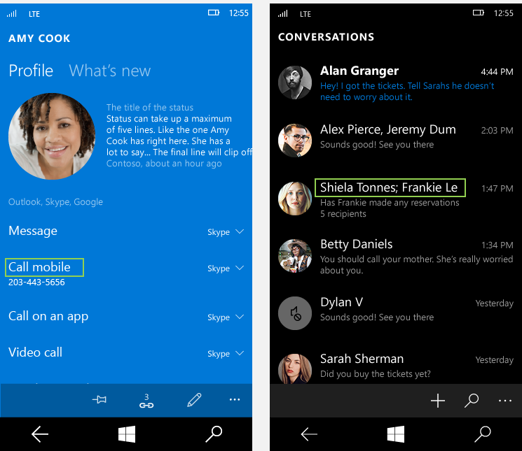
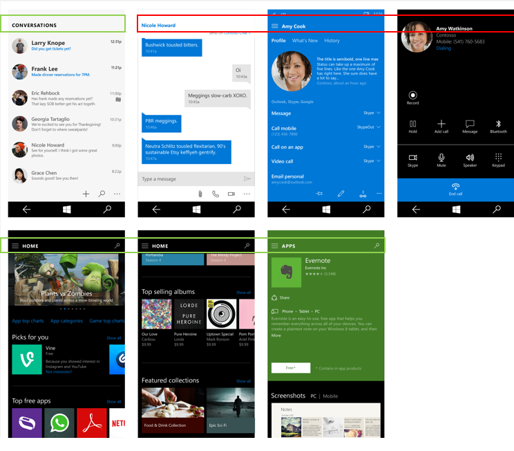

# <a name="typography"></a>Tipografía

<link rel="stylesheet" href="https://az835927.vo.msecnd.net/sites/uwp/Resources/css/custom.css"> 

Como representación visual del lenguaje, la tarea principal de la tipografía es ser clara. Su estilo nunca debe obstaculizar ese objetivo. No obstante, la tipografía también tiene un rol importante como componente de diseño, con un gran efecto en la densidad y la complejidad del diseño, y en la experiencia de usuario de ese diseño.

## <a name="typeface"></a>Tipo de letra

Hemos seleccionado Segoe UI para su uso en todos los diseños digitales de Microsoft. Segoe UI proporciona una amplia gama de caracteres y está diseñada para mantener la legibilidad óptima en distintos tamaños y densidades de píxeles. Ofrece una estética limpia, ligera y abierta que complementa el contenido del sistema.


## <a name="weights"></a>Espesores

Nuestra visión de la tipografía tiene en cuenta la simplicidad y la eficiencia. Elegimos usar un tipo de letra, una cantidad mínima de espesores y tamaños y una jerarquía clara. El posicionamiento y la alineación siguen el estilo predeterminado para el idioma especificado. En inglés el texto va de izquierda a derecha y de arriba a abajo. Las relaciones entre el texto y las imágenes son claras y directas.


## <a name="line-spacing"></a>Interlineado


El interlineado debe calcularse en relación al 125% del tamaño de la fuente, con redondeo al múltiplo más cercano de cuatro cuando sea necesario. Por ejemplo, con 15px Segoe UI, 125% de 15 píxeles es 18,75 píxeles. Recomendamos redondear por arriba y establecer la alto de línea en 20 píxeles para permanecer en la cuadrícula de 4 píxeles. Esto garantiza una buena experiencia de lectura y suficiente espacio para los signos diacríticos. Consulta la sección de rampa de tipo a continuación para ver ejemplos específicos.

Cuando se apila un tipo de mayor tamaño encima de otro de menor tamaño, la distancia desde la última línea base del tipo mayor respecto a la primera línea de base del tipo menor debe ser igual que el alto de línea del tipo mayor.


En XAML, esto se logra apilando dos [TextBlocks](https://msdn.microsoft.com/en-us/library/windows/apps/windows.ui.xaml.controls.textblock.aspx) y estableciendo el margen adecuado.

```xaml
<StackPanel Width="200">
    <!-- Setting a bottom margin of 3px on the header
         puts the baseline of the body text exactly 24px
         below the baseline of the header. 24px is the
         recommended line height for a 20px font size,
         which is what's set in SubtitleTextBlockStyle.
         The bottom margin will be different for
         different font size pairings. -->
    <TextBlock
        Style="{StaticResource SubtitleTextBlockStyle}"
        Margin="0,0,0,3"
        Text="Header text" />
    <TextBlock
        Style="{StaticResource BodyTextBlockStyle}"
        TextWrapping="Wrap"
        Text="This line of text should be positioned where the above header would have wrapped." />
</StackPanel>
```


<div class="side-by-side">
<div class="side-by-side-content">
  <div class="side-by-side-content-left">
<h2>Interletraje y tracking</h2>

Segoe es un tipo de letra humanist con un aspecto nítido y legible, con formas orgánicas y abiertas inspiradas en el texto escrito a mano. Para garantizar la legibilidad óptima y mantener la integridad humanist, la configuración del interletraje y del tracking debe tener valores específicos.

Interletraje se debe establecer en "métrica" y tracking debe establecerse en "0".
  </div>
  <div class="side-by-side-content-right">
<h2>Espacio entre palabras y entre letras</h2>

De forma parecida al interletraje y al tracking, en el espacio entre palabras y entre letras se usa una configuración específica para garantizar la legibilidad óptima y la integridad humanist.

De forma predeterminada, el espacio entre palabras siempre es del 100 % y el espaciado entre letras debe establecerse en "0".
  </div>
</div>
</div>
<div class="side-by-side">
<div class="side-by-side-content">
  <div class="side-by-side-content-left">
  
  </div>
  <div class="side-by-side-content-right">
 
  </div>
</div>
</div>


>[!NOTE]
>Usa la propiedad [Typogrphy.Kerning](https://msdn.microsoft.com/en-us/library/windows/apps/windows.ui.xaml.documents.typography.kerning.aspx) en un control de texto XAML para controlar el interletraje y [FontStretch](https://msdn.microsoft.com/en-us/library/windows/apps/windows.ui.xaml.controls.control.fontstretch.aspx) para controlar el tracking. De forma predeterminada, Typography.Kerning se ha establecido en “true”, y FontStretch se ha establecido en “Normal”; ambos son valores recomendados.

<div class="side-by-side">
<div class="side-by-side-content">
  <div class="side-by-side-content-left">
<h2>Alineación</h2>

Por lo general, recomendamos que los elementos visuales y las columnas de tipo se alineen a la izquierda. En la mayoría de los casos, la alineación del texto a la izquierda con un margen irregular a la derecha proporciona un anclaje coherente del contenido y un diseño uniforme. 
  </div>
  <div class="side-by-side-content-right">
<h2>Finales de línea</h2>

Cuando la tipografía no esté alineada a la izquierda con un margen irregular a la derecha, intenta que los finales de línea queden alineados y evita la división de palabras.
  </div>
</div>
</div>

<div class="side-by-side">
<div class="side-by-side-content">
  <div class="side-by-side-content-left">
  
  </div>
  <div class="side-by-side-content-right">
 
  </div>
</div>
</div>


## <a name="paragraphs"></a>Párrafos

Para alinear los bordes de las columnas, los párrafos deben indicarse omitiendo una línea sin aplicar sangría.


## <a name="character-count"></a>Número de caracteres

Si una línea es demasiado corta, el ojo tendrá que desplazarse de izquierda a derecha con demasiada frecuencia, interrumpiendo el ritmo de lectura. Si es posible, 50 a 60 letras por línea es lo ideal para facilitar la lectura.

Segoe proporciona una amplia gama de caracteres y está diseñada para mantener la legibilidad óptima en tamaños pequeños y grandes, así como en píxeles con densidades altas y ajas. Usar el número óptimo de letras en las líneas de una columna de texto garantiza una buena legibilidad en una aplicación.

Las líneas demasiado largas provocan un mayor esfuerzo fisual y pueden desorientar al usuario. Las líneas demasiado cortas hacen que los ojos se tengan que desplazar mucho y se puede causar fatiga.


## <a name="hanging-text-alignment"></a>Alineación de sangría francesa

La alineación horizontal de los iconos con texto se puede controlar de distintas formas según el tamaño del icono y la cantidad de texto. Cuando el texto tiene una o varias líneas y cabe en la alto del icono, el texto se debe centrar verticalmente.

Cuando el texto se extiende más allá de la alto del icono, la primera línea del texto debe alinearse verticalmente y el texto adicional debe fluir debajo de forma natural. Al usar caracteres cuyas mayúsculas son mayores (el alto ascendente y descendente), se debe tener cuidado para seguir la misma guía de alineación.


>[!NOTE]
>La propiedad [TextBlock.TextLineBounds](https://msdn.microsoft.com/en-us/library/windows/apps/windows.ui.xaml.controls.textblock.textlinebounds.aspx) de XAML proporciona acceso a la altura de las mayúsculas y a la métrica de los tipos de letra de línea de base. Puedes usar esta opción para visualizar de forma vertical, centrar o alinear en la parte superior el contenido.

## <a name="clipping-and-ellipses"></a>Recortes y puntos suspensivos

Recorta de manera predeterminada; el texto pasará a la siguiente línea a menos que la revisión especifique lo contrario. Cuando el texto no pasa a la siguiente línea, recomendamos recortar en lugar de usar puntos suspensivos. El recorte puede producirse en el borde del contenedor, en el borde del dispositivo, en el borde de una barra de desplazamiento, etc.

Excepciones: en contenedores que no están bien definidos (por ejemplo, no hay ningún color diferenciador de fondo), el texto que no se ajuste puede marcarse con puntos suspensivos "...".


## <a name="type-ramp"></a>Rampa de tipografías
La rampa de tipos establece una relación de diseño crucial entre los títulos y el texto del cuerpo, y garantiza una jerarquía comprensible y clara entre los diferentes niveles. Esta jerarquía crea una estructura que permite a los usuarios navegar fácilmente a través de la comunicación escrita.

<div class="uwpd-image-with-caption">
    
    <div>Todos los tamaños están en píxeles efectivos. Para obtener más información, consulta [Introducción al diseño de aplicaciones para UWP](../layout/design-and-ui-intro.md).</div>
</div>

>[!NOTE]
>La mayoría de los niveles de la rampa están disponibles como [recursos estáticos](https://msdn.microsoft.com/en-us/library/windows/apps/Mt187274.aspx#the_xaml_type_ramp) de XAML que siguen la convención de nomenclatura `*TextBlockStyle` (ej.: `HeaderTextBlockStyle`).


<div class="microsoft-internal-note">
SubtítuloAlt, BaseAlt y LeyendaAlt no se incluyen actualmente. Puedes crear los estilos en tu propia aplicación siguiendo los fragmentos de código disponibles en el vínculo antes mencionado. Además, ten en cuenta que XAML actualmente no coincide con el alto de línea de forma exacta.
</div>


## <a name="primary-and-secondary-text"></a>Texto principal y secundario

Para crear otras jerarquías no incluidas en la rampa de tipos, establece el texto secundario en el 60 % de opacidad. En la [paleta de colores de temas](color.md#color-theming), se usaría BaseMedium. El texto principal siempre debe tener un 100% de opacidad, o BaseHigh.

<!-- Need new images

Recommended use of SubtitleAlt. Also note the primary and secondary text usage in list items.


Recommended use of CaptionAlt.
-->

## <a name="all-caps-titles"></a>Títulos completamente en mayúsculas

Determinados títulos de página deben estar totalmente en mayúsculas para agregar otra dimensión de jerarquía. Estos títulos deben usar BaseAlt con el espaciado establecido en 75 milésimas de un espacio largo. Este tratamiento también puede usarse para facilitar la navegación por la aplicación.

Sin embargo, en algunos idiomas los nombres propios pueden cambiar su significado cuando se escriben en mayúsculas y, por lo tanto, los títulos de páginas creados con nombres propios o con información procedente del usuario *no* deben escribirse solo con totalmente en mayúsculas.


<!-- Need new images

Green shows where all caps should be used. Red shows where it should not.
-->

## <a name="dos-and-donts"></a>Qué hacer y qué no hacer
* Usa Cuerpo para la mayor parte del texto
* Usa Base para los títulos cuando el espacio es limitado
* Incluye SubtítuloAlt para crear contraste y jerarquía al enfatizar el contenido de nivel superior
* No uses Título para cadenas largas o cualquier acción principal
* No uses Encabezado o Subencabezado si hay que ajustar texto
* No combines Subtítulo y SubtítuloAlt en la misma página


## <a name="related-articles"></a>Artículos relacionados

* [Controles de texto](../controls-and-patterns/text-controls.md)
* [Fuentes](fonts.md)
* [Iconos de Segoe MDL2](segoe-ui-symbol-font.md)


<!--HONumber=Dec16_HO2-->


